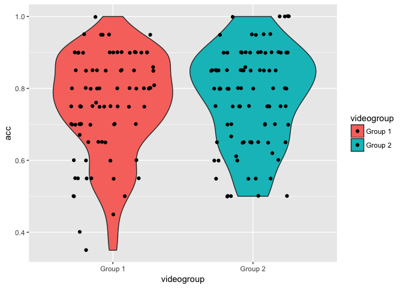

Lexical Recall Analysis (study1adults)
================
Adam Stone, PhD
09-13-2017

-   [Re-Initializing](#re-initializing)
-   [Analysis by Groups](#analysis-by-groups)
-   [AOA Modeling](#aoa-modeling)

Re-Initializing
===============

This assumes you've already done [01dataimportclean](01dataimportclean.nb.html) and so there'll be a nice new .csv file to re-import here. Also we gotta import all the libraries again.

``` r
# Import packages we'll need.
library(tidyverse)
```

    ## Loading tidyverse: ggplot2
    ## Loading tidyverse: tibble
    ## Loading tidyverse: tidyr
    ## Loading tidyverse: readr
    ## Loading tidyverse: purrr
    ## Loading tidyverse: dplyr

    ## Conflicts with tidy packages ----------------------------------------------

    ## filter(): dplyr, stats
    ## lag():    dplyr, stats

``` r
library(stringr)
library(lme4)
```

    ## Loading required package: Matrix

    ## 
    ## Attaching package: 'Matrix'

    ## The following object is masked from 'package:tidyr':
    ## 
    ##     expand

``` r
library(lmerTest)
```

    ## 
    ## Attaching package: 'lmerTest'

    ## The following object is masked from 'package:lme4':
    ## 
    ##     lmer

    ## The following object is masked from 'package:stats':
    ## 
    ##     step

``` r
library(prettydoc)
library(broom)
library(knitr)
library(xtable)
library(kableExtra)
options(knitr.table.format = "html") 
data <- read_csv('cleandata.csv',col_types = 
                   cols(.default = col_double(),
                        id = col_integer(),
                        participant = col_character(),
                        hearing = col_character(),
                        videogroup = col_character(),
                        aoagroup = col_character(),
                        languagegroup = col_character(),
                        maingroup = col_character(),
                        video = col_character(),
                        story = col_character(),
                        direction = col_character(),
                        aoasl = col_integer(),
                        acc = col_double(),
                        forehead = col_double(),
                        eyes = col_double(),
                        mouth = col_double(),
                        chin = col_double(),
                        upperchest = col_double(),
                        midchest = col_double(),
                        lowerchest = col_double(),
                        belly = col_double(),
                        left = col_double(),
                        right = col_double()
                   ))
# And factorize
data <- data %>%
  mutate(hearing = as.factor(hearing)) %>%
  mutate(videogroup = as.factor(videogroup)) %>%
  mutate(aoagroup = as.factor(aoagroup)) %>%
  mutate(languagegroup = as.factor(languagegroup)) %>%
  mutate(maingroup = as.factor(maingroup)) %>%
  mutate(video = as.factor(video)) %>%
  mutate(story = as.factor(story)) %>%
  mutate(direction = as.factor(direction))
```

Analysis by Groups
==================

Lexical recall accuracy violins and error bar charts for forward vs. backward stories.

``` r
# Summarizing means and SDs
accdata <- data %>%
  ungroup() %>%
  group_by(maingroup,direction) %>%
  summarize(acc.mean = mean(acc, na.rm=TRUE),
            acc.sd = sd(acc, na.rm=TRUE))

#Violin plot
ggplot(data,aes(maingroup,acc,fill=direction)) + 
  geom_violin() +
  scale_y_continuous(limits=c(0,1)) +
  theme(axis.text.x=element_text(angle=45,hjust=1))
```

    ## Warning: Removed 4 rows containing non-finite values (stat_ydensity).


``` r
# Error bar chart
ggplot(accdata,aes(maingroup,acc.mean,color=direction)) + 
  geom_point(position=position_dodge(0.5)) +
  geom_errorbar(aes(ymin=acc.mean-acc.sd,ymax=acc.mean+acc.sd),width=0.1,position=position_dodge(0.5)) +
  scale_y_continuous(limits=c(0,1)) +
  theme(axis.text.x=element_text(angle=45,hjust=1))
```


Let's test for statistical significance. A simple ANOVA tell us there is a main effect of group and direction, but no interactions.

``` r
# Let's set Native Deaf as the reference level to compare all other
data$maingroup <- relevel(data$maingroup, ref="NativeDeaf")
# Run the ANOVA
acc.anova <- aov(data=data,acc ~ maingroup*direction)
kable(tidy(acc.anova), digits=3) %>% kable_styling(bootstrap_options = c("striped", "hover", "condensed"))
```

<table class="table table-striped table-hover table-condensed" style="margin-left: auto; margin-right: auto;">
<thead>
<tr>
<th style="text-align:left;">
term
</th>
<th style="text-align:right;">
df
</th>
<th style="text-align:right;">
sumsq
</th>
<th style="text-align:right;">
meansq
</th>
<th style="text-align:right;">
statistic
</th>
<th style="text-align:right;">
p.value
</th>
</tr>
</thead>
<tbody>
<tr>
<td style="text-align:left;">
maingroup
</td>
<td style="text-align:right;">
4
</td>
<td style="text-align:right;">
0.216
</td>
<td style="text-align:right;">
0.054
</td>
<td style="text-align:right;">
4.211
</td>
<td style="text-align:right;">
0.003
</td>
</tr>
<tr>
<td style="text-align:left;">
direction
</td>
<td style="text-align:right;">
1
</td>
<td style="text-align:right;">
0.905
</td>
<td style="text-align:right;">
0.905
</td>
<td style="text-align:right;">
70.464
</td>
<td style="text-align:right;">
0.000
</td>
</tr>
<tr>
<td style="text-align:left;">
maingroup:direction
</td>
<td style="text-align:right;">
4
</td>
<td style="text-align:right;">
0.058
</td>
<td style="text-align:right;">
0.014
</td>
<td style="text-align:right;">
1.122
</td>
<td style="text-align:right;">
0.348
</td>
</tr>
<tr>
<td style="text-align:left;">
Residuals
</td>
<td style="text-align:right;">
170
</td>
<td style="text-align:right;">
2.183
</td>
<td style="text-align:right;">
0.013
</td>
<td style="text-align:right;">
NA
</td>
<td style="text-align:right;">
NA
</td>
</tr>
</tbody>
</table>
Tukey's HSD posthoc tells us that Hearing Novice ASL is significantly different from Deaf Native.

``` r
# Run the posthoc on main group
acc.posthoc <- TukeyHSD(acc.anova,'maingroup',conf.level = 0.95) 
kable(tidy(acc.posthoc), digits=3) %>% kable_styling(bootstrap_options = c("striped", "hover", "condensed"))
```

<table class="table table-striped table-hover table-condensed" style="margin-left: auto; margin-right: auto;">
<thead>
<tr>
<th style="text-align:left;">
term
</th>
<th style="text-align:left;">
comparison
</th>
<th style="text-align:right;">
estimate
</th>
<th style="text-align:right;">
conf.low
</th>
<th style="text-align:right;">
conf.high
</th>
<th style="text-align:right;">
adj.p.value
</th>
</tr>
</thead>
<tbody>
<tr>
<td style="text-align:left;">
maingroup
</td>
<td style="text-align:left;">
DeafEarlyASL-NativeDeaf
</td>
<td style="text-align:right;">
-0.049
</td>
<td style="text-align:right;">
-0.126
</td>
<td style="text-align:right;">
0.027
</td>
<td style="text-align:right;">
0.387
</td>
</tr>
<tr>
<td style="text-align:left;">
maingroup
</td>
<td style="text-align:left;">
DeafLateASL-NativeDeaf
</td>
<td style="text-align:right;">
-0.017
</td>
<td style="text-align:right;">
-0.105
</td>
<td style="text-align:right;">
0.071
</td>
<td style="text-align:right;">
0.985
</td>
</tr>
<tr>
<td style="text-align:left;">
maingroup
</td>
<td style="text-align:left;">
HearingLateASL-NativeDeaf
</td>
<td style="text-align:right;">
-0.030
</td>
<td style="text-align:right;">
-0.096
</td>
<td style="text-align:right;">
0.036
</td>
<td style="text-align:right;">
0.716
</td>
</tr>
<tr>
<td style="text-align:left;">
maingroup
</td>
<td style="text-align:left;">
HearingNoviceASL-NativeDeaf
</td>
<td style="text-align:right;">
-0.095
</td>
<td style="text-align:right;">
-0.162
</td>
<td style="text-align:right;">
-0.027
</td>
<td style="text-align:right;">
0.001
</td>
</tr>
<tr>
<td style="text-align:left;">
maingroup
</td>
<td style="text-align:left;">
DeafLateASL-DeafEarlyASL
</td>
<td style="text-align:right;">
0.033
</td>
<td style="text-align:right;">
-0.062
</td>
<td style="text-align:right;">
0.127
</td>
<td style="text-align:right;">
0.875
</td>
</tr>
<tr>
<td style="text-align:left;">
maingroup
</td>
<td style="text-align:left;">
HearingLateASL-DeafEarlyASL
</td>
<td style="text-align:right;">
0.019
</td>
<td style="text-align:right;">
-0.055
</td>
<td style="text-align:right;">
0.093
</td>
<td style="text-align:right;">
0.954
</td>
</tr>
<tr>
<td style="text-align:left;">
maingroup
</td>
<td style="text-align:left;">
HearingNoviceASL-DeafEarlyASL
</td>
<td style="text-align:right;">
-0.046
</td>
<td style="text-align:right;">
-0.121
</td>
<td style="text-align:right;">
0.030
</td>
<td style="text-align:right;">
0.460
</td>
</tr>
<tr>
<td style="text-align:left;">
maingroup
</td>
<td style="text-align:left;">
HearingLateASL-DeafLateASL
</td>
<td style="text-align:right;">
-0.014
</td>
<td style="text-align:right;">
-0.100
</td>
<td style="text-align:right;">
0.073
</td>
<td style="text-align:right;">
0.993
</td>
</tr>
<tr>
<td style="text-align:left;">
maingroup
</td>
<td style="text-align:left;">
HearingNoviceASL-DeafLateASL
</td>
<td style="text-align:right;">
-0.078
</td>
<td style="text-align:right;">
-0.166
</td>
<td style="text-align:right;">
0.009
</td>
<td style="text-align:right;">
0.103
</td>
</tr>
<tr>
<td style="text-align:left;">
maingroup
</td>
<td style="text-align:left;">
HearingNoviceASL-HearingLateASL
</td>
<td style="text-align:right;">
-0.065
</td>
<td style="text-align:right;">
-0.130
</td>
<td style="text-align:right;">
0.001
</td>
<td style="text-align:right;">
0.053
</td>
</tr>
</tbody>
</table>
Group coefficients are here. Remember our reference level ("control") is Native Deaf. Their forward accuracy is 85% with a reversal effect of -9%. ASL, Forward. Mean accuracy for that is 84%, and its reversal effect is -14%. All the other values are to be added to these coefficients. Hearing Novice ASL's forward accuracy was 78%, with a reversal effect of -6%!

``` r
#Coefficients
kable(tidy(acc.anova$coefficients), digits=3) %>% kable_styling(bootstrap_options = c("striped", "hover", "condensed"))
```

<table class="table table-striped table-hover table-condensed" style="margin-left: auto; margin-right: auto;">
<thead>
<tr>
<th style="text-align:left;">
names
</th>
<th style="text-align:right;">
x
</th>
</tr>
</thead>
<tbody>
<tr>
<td style="text-align:left;">
(Intercept)
</td>
<td style="text-align:right;">
0.848
</td>
</tr>
<tr>
<td style="text-align:left;">
maingroupDeafEarlyASL
</td>
<td style="text-align:right;">
-0.012
</td>
</tr>
<tr>
<td style="text-align:left;">
maingroupDeafLateASL
</td>
<td style="text-align:right;">
0.019
</td>
</tr>
<tr>
<td style="text-align:left;">
maingroupHearingLateASL
</td>
<td style="text-align:right;">
0.019
</td>
</tr>
<tr>
<td style="text-align:left;">
maingroupHearingNoviceASL
</td>
<td style="text-align:right;">
-0.065
</td>
</tr>
<tr>
<td style="text-align:left;">
directionreversed
</td>
<td style="text-align:right;">
-0.082
</td>
</tr>
<tr>
<td style="text-align:left;">
maingroupDeafEarlyASL:directionreversed
</td>
<td style="text-align:right;">
-0.075
</td>
</tr>
<tr>
<td style="text-align:left;">
maingroupDeafLateASL:directionreversed
</td>
<td style="text-align:right;">
-0.071
</td>
</tr>
<tr>
<td style="text-align:left;">
maingroupHearingLateASL:directionreversed
</td>
<td style="text-align:right;">
-0.098
</td>
</tr>
<tr>
<td style="text-align:left;">
maingroupHearingNoviceASL:directionreversed
</td>
<td style="text-align:right;">
-0.059
</td>
</tr>
</tbody>
</table>
In summary, ANOVA tells us there are main effects of group and direction, no interactions. All of which is a good thing. But I'm curious if there's any item-level effects we should be watching out for. Because there are 4 different stories. Let's plot those out.

``` r
# Run summary stats grouped by story, too
accdata2 <- data %>%
  group_by(maingroup,story,direction) %>%
  summarize(acc.mean = mean(acc, na.rm=TRUE),
            acc.sd = sd(acc, na.rm=TRUE))
# Boxplot
# ggplot(data,aes(maingroup,acc,fill=direction)) + 
#   geom_boxplot() +
#   scale_y_continuous(limits=c(0,1)) +
#   facet_wrap("story")

# Error bar chart
ggplot(accdata2,aes(maingroup,acc.mean,color=direction)) + 
  geom_point(position=position_dodge(0.5)) +
  geom_errorbar(aes(ymin=acc.mean-acc.sd,ymax=acc.mean+acc.sd),width=0.1,position=position_dodge(0.5)) +
  scale_y_continuous(limits=c(0,1)) +
  facet_wrap("story") + 
  theme(axis.text.x=element_text(angle=45,hjust=1))
```

    ## Warning: Removed 3 rows containing missing values (geom_errorbar).


Boy! Seems King Midas had a strong reversal effect, while Red Riding Hood had a weak reversal effect. Maybe we should put those in as random effects variables in a mixed model, along with participants too. With mixed models, you define predictor variables (what we're interested in; aka, fixed effects) and grouping (what we're not interested in, aka, random effects). This is overkill for simple accuracy data but this will help set us up for eye tracking analysis and **importantly reviewers may ask us about item-level effects given we have just 4 stories.**

So here, we have fixed effects of group and direction, and random effects of story and id, with varying slopes for direction.

The output tells us now that Hearing Novice ASL is significantly different from Deaf Native ASL, that we still have a main effect of direction, with a significant interaction of direction and Hearing Late ASL. We probably don't need all this in the paper, though, the ANOVA will do and accuracy is not our main point.

``` r
acc.lm <- lmer(data=data, acc ~ maingroup*direction + (direction|id) + (1|story))
summary(acc.lm)
```

    ## Linear mixed model fit by REML t-tests use Satterthwaite approximations
    ##   to degrees of freedom [lmerMod]
    ## Formula: acc ~ maingroup * direction + (direction | id) + (1 | story)
    ##    Data: data
    ## 
    ## REML criterion at convergence: -255
    ## 
    ## Scaled residuals: 
    ##      Min       1Q   Median       3Q      Max 
    ## -1.90765 -0.59357  0.03286  0.58874  2.31396 
    ## 
    ## Random effects:
    ##  Groups   Name              Variance Std.Dev. Corr
    ##  id       (Intercept)       0.002392 0.04891      
    ##           directionreversed 0.004000 0.06324  0.02
    ##  story    (Intercept)       0.001198 0.03461      
    ##  Residual                   0.007716 0.08784      
    ## Number of obs: 180, groups:  id, 46; story, 4
    ## 
    ## Fixed effects:
    ##                                             Estimate Std. Error       df
    ## (Intercept)                                  0.84836    0.02980 16.50000
    ## maingroupDeafEarlyASL                       -0.01089    0.03864 40.66000
    ## maingroupDeafLateASL                         0.01263    0.04406 43.10000
    ## maingroupHearingLateASL                      0.01762    0.03331 40.58000
    ## maingroupHearingNoviceASL                   -0.06720    0.03405 40.64000
    ## directionreversed                           -0.08441    0.03325 41.69000
    ## maingroupDeafEarlyASL:directionreversed     -0.07624    0.05318 40.77000
    ## maingroupDeafLateASL:directionreversed      -0.06397    0.06048 43.41000
    ## maingroupHearingLateASL:directionreversed   -0.09506    0.04565 40.90000
    ## maingroupHearingNoviceASL:directionreversed -0.05472    0.04669 40.95000
    ##                                             t value Pr(>|t|)    
    ## (Intercept)                                  28.470 1.78e-15 ***
    ## maingroupDeafEarlyASL                        -0.282   0.7795    
    ## maingroupDeafLateASL                          0.287   0.7757    
    ## maingroupHearingLateASL                       0.529   0.5997    
    ## maingroupHearingNoviceASL                    -1.974   0.0552 .  
    ## directionreversed                            -2.539   0.0149 *  
    ## maingroupDeafEarlyASL:directionreversed      -1.434   0.1593    
    ## maingroupDeafLateASL:directionreversed       -1.058   0.2960    
    ## maingroupHearingLateASL:directionreversed    -2.083   0.0436 *  
    ## maingroupHearingNoviceASL:directionreversed  -1.172   0.2479    
    ## ---
    ## Signif. codes:  0 '***' 0.001 '**' 0.01 '*' 0.05 '.' 0.1 ' ' 1
    ## 
    ## Correlation of Fixed Effects:
    ##             (Intr) mnDEASL mnDLASL mnHLASL mnHNASL drctnr mDEASL: mDLASL:
    ## mngrpDfEASL -0.512                                                       
    ## mngrpDfLASL -0.448  0.348                                                
    ## mngrpHrLASL -0.592  0.455   0.400                                        
    ## mngrpHrNASL -0.579  0.443   0.391   0.520                                
    ## dirctnrvrsd -0.367  0.285   0.249   0.327   0.319                        
    ## mngrpDEASL:  0.231 -0.452  -0.159  -0.201  -0.194  -0.628                
    ## mngrpDLASL:  0.202 -0.159  -0.457  -0.179  -0.174  -0.551  0.350         
    ## mngrpHLASL:  0.266 -0.203  -0.180  -0.447  -0.235  -0.727  0.450   0.399 
    ## mngrpHNASL:  0.260 -0.195  -0.175  -0.235  -0.449  -0.710  0.436   0.389 
    ##             mHLASL:
    ## mngrpDfEASL        
    ## mngrpDfLASL        
    ## mngrpHrLASL        
    ## mngrpHrNASL        
    ## dirctnrvrsd        
    ## mngrpDEASL:        
    ## mngrpDLASL:        
    ## mngrpHLASL:        
    ## mngrpHNASL:  0.521

Here are the coefficients in a nicer format.

``` r
kable(xtable(coef(summary(acc.lm))), digits=3) %>% kable_styling(bootstrap_options = c("striped", "hover", "condensed"))
```

<table class="table table-striped table-hover table-condensed" style="margin-left: auto; margin-right: auto;">
<thead>
<tr>
<th style="text-align:left;">
</th>
<th style="text-align:right;">
Estimate
</th>
<th style="text-align:right;">
Std. Error
</th>
<th style="text-align:right;">
df
</th>
<th style="text-align:right;">
t value
</th>
<th style="text-align:right;">
Pr(&gt;|t|)
</th>
</tr>
</thead>
<tbody>
<tr>
<td style="text-align:left;">
(Intercept)
</td>
<td style="text-align:right;">
0.848
</td>
<td style="text-align:right;">
0.030
</td>
<td style="text-align:right;">
16.504
</td>
<td style="text-align:right;">
28.470
</td>
<td style="text-align:right;">
0.000
</td>
</tr>
<tr>
<td style="text-align:left;">
maingroupDeafEarlyASL
</td>
<td style="text-align:right;">
-0.011
</td>
<td style="text-align:right;">
0.039
</td>
<td style="text-align:right;">
40.659
</td>
<td style="text-align:right;">
-0.282
</td>
<td style="text-align:right;">
0.779
</td>
</tr>
<tr>
<td style="text-align:left;">
maingroupDeafLateASL
</td>
<td style="text-align:right;">
0.013
</td>
<td style="text-align:right;">
0.044
</td>
<td style="text-align:right;">
43.097
</td>
<td style="text-align:right;">
0.287
</td>
<td style="text-align:right;">
0.776
</td>
</tr>
<tr>
<td style="text-align:left;">
maingroupHearingLateASL
</td>
<td style="text-align:right;">
0.018
</td>
<td style="text-align:right;">
0.033
</td>
<td style="text-align:right;">
40.582
</td>
<td style="text-align:right;">
0.529
</td>
<td style="text-align:right;">
0.600
</td>
</tr>
<tr>
<td style="text-align:left;">
maingroupHearingNoviceASL
</td>
<td style="text-align:right;">
-0.067
</td>
<td style="text-align:right;">
0.034
</td>
<td style="text-align:right;">
40.639
</td>
<td style="text-align:right;">
-1.974
</td>
<td style="text-align:right;">
0.055
</td>
</tr>
<tr>
<td style="text-align:left;">
directionreversed
</td>
<td style="text-align:right;">
-0.084
</td>
<td style="text-align:right;">
0.033
</td>
<td style="text-align:right;">
41.689
</td>
<td style="text-align:right;">
-2.539
</td>
<td style="text-align:right;">
0.015
</td>
</tr>
<tr>
<td style="text-align:left;">
maingroupDeafEarlyASL:directionreversed
</td>
<td style="text-align:right;">
-0.076
</td>
<td style="text-align:right;">
0.053
</td>
<td style="text-align:right;">
40.766
</td>
<td style="text-align:right;">
-1.434
</td>
<td style="text-align:right;">
0.159
</td>
</tr>
<tr>
<td style="text-align:left;">
maingroupDeafLateASL:directionreversed
</td>
<td style="text-align:right;">
-0.064
</td>
<td style="text-align:right;">
0.060
</td>
<td style="text-align:right;">
43.408
</td>
<td style="text-align:right;">
-1.058
</td>
<td style="text-align:right;">
0.296
</td>
</tr>
<tr>
<td style="text-align:left;">
maingroupHearingLateASL:directionreversed
</td>
<td style="text-align:right;">
-0.095
</td>
<td style="text-align:right;">
0.046
</td>
<td style="text-align:right;">
40.898
</td>
<td style="text-align:right;">
-2.083
</td>
<td style="text-align:right;">
0.044
</td>
</tr>
<tr>
<td style="text-align:left;">
maingroupHearingNoviceASL:directionreversed
</td>
<td style="text-align:right;">
-0.055
</td>
<td style="text-align:right;">
0.047
</td>
<td style="text-align:right;">
40.949
</td>
<td style="text-align:right;">
-1.172
</td>
<td style="text-align:right;">
0.248
</td>
</tr>
</tbody>
</table>
One more thing I just remembered. What if a reviewer asks if Group 1 differed from Group 2 (in other words, was there an effect of stimulus order)? Easy to do now that our data is nicely organized (or "tidy").

``` r
acc.lm.order <- lm(data=data, acc ~ videogroup)
kable(tidy(summary(acc.lm.order)),digits=4)
```

<table>
<thead>
<tr>
<th style="text-align:left;">
term
</th>
<th style="text-align:right;">
estimate
</th>
<th style="text-align:right;">
std.error
</th>
<th style="text-align:right;">
statistic
</th>
<th style="text-align:right;">
p.value
</th>
</tr>
</thead>
<tbody>
<tr>
<td style="text-align:left;">
(Intercept)
</td>
<td style="text-align:right;">
0.7552
</td>
<td style="text-align:right;">
0.0148
</td>
<td style="text-align:right;">
51.1001
</td>
<td style="text-align:right;">
0.0000
</td>
</tr>
<tr>
<td style="text-align:left;">
videogroupGroup 2
</td>
<td style="text-align:right;">
0.0204
</td>
<td style="text-align:right;">
0.0205
</td>
<td style="text-align:right;">
0.9960
</td>
<td style="text-align:right;">
0.3206
</td>
</tr>
</tbody>
</table>
Yikes. Group has an significant effect (p = 0.0396). On average they perform 4% better than Group 1. What's going on here...let's chart it.

``` r
ggplot(data, aes(x=videogroup, y=acc, fill=videogroup)) + 
#  geom_point(position="jitter") +
  geom_violin() +
  geom_jitter(width=.3)
```

    ## Warning: Removed 4 rows containing non-finite values (stat_ydensity).

    ## Warning: Removed 4 rows containing missing values (geom_point).



So Group 1 has a lot more bad test results compared to Group 2. But maybe that's a good reason to be using mixed models, and we can account for that by allowing subjects and items (and item order, by definition...I think) to vary randomly.

AOA Modeling
============

Below are models for AOA...I need to look at forward/reversed together and reversed only.

``` r
ggplot(filter(data,direction=="reversed"),aes(x=aoasl,y=acc)) +
  geom_point() +
  geom_smooth(method="lm")
```

    ## Warning: Removed 2 rows containing non-finite values (stat_smooth).

    ## Warning: Removed 2 rows containing missing values (geom_point).


``` r
aoa.model <- lm(acc ~ aoasl, data=filter(data,direction=="reversed"))
summary(aoa.model)
```

    ## 
    ## Call:
    ## lm(formula = acc ~ aoasl, data = filter(data, direction == "reversed"))
    ## 
    ## Residuals:
    ##      Min       1Q   Median       3Q      Max 
    ## -0.31237 -0.09632  0.01198  0.10368  0.22831 
    ## 
    ## Coefficients:
    ##              Estimate Std. Error t value Pr(>|t|)    
    ## (Intercept)  0.746323   0.023800  31.358   <2e-16 ***
    ## aoasl       -0.004664   0.001778  -2.624   0.0102 *  
    ## ---
    ## Signif. codes:  0 '***' 0.001 '**' 0.01 '*' 0.05 '.' 0.1 ' ' 1
    ## 
    ## Residual standard error: 0.1285 on 88 degrees of freedom
    ##   (2 observations deleted due to missingness)
    ## Multiple R-squared:  0.07257,    Adjusted R-squared:  0.06203 
    ## F-statistic: 6.886 on 1 and 88 DF,  p-value: 0.01024

<!-- acc.lm <- lmer(data=data, acc ~ maingroup*direction + (direction|id) + (1|story)) -->
<!-- summary(acc.lm) -->
