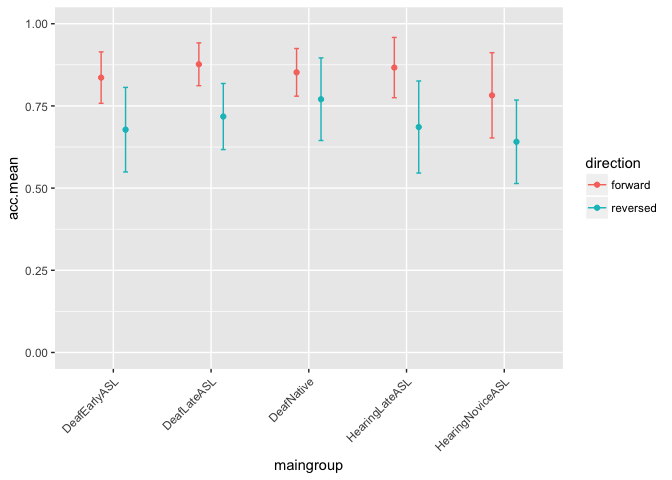

Lexical Recall Analysis (study1adults)
================
Adam Stone, PhD
09-18-2017

-   [Re-Initializing](#re-initializing)
-   [ANOVAS](#anovas)
-   [Group ANOVA](#group-anova)
-   [AoASL & Hearing ANCOVA](#aoasl-hearing-ancova)
-   [Item-Level Modeling](#item-level-modeling)
-   [Group1/Group2 Differences?](#group1group2-differences)

Re-Initializing
===============

This assumes you've already done [01dataimportclean](01dataimportclean.nb.html) and so there'll be a nice new .csv file to re-import here. Also we gotta import all the libraries again.

``` r
# Import packages we'll need.
library(tidyverse)
```

    ## Loading tidyverse: ggplot2
    ## Loading tidyverse: tibble
    ## Loading tidyverse: tidyr
    ## Loading tidyverse: readr
    ## Loading tidyverse: purrr
    ## Loading tidyverse: dplyr

    ## Conflicts with tidy packages ----------------------------------------------

    ## filter(): dplyr, stats
    ## lag():    dplyr, stats

``` r
library(stringr)
library(lme4)
```

    ## Loading required package: Matrix

    ## 
    ## Attaching package: 'Matrix'

    ## The following object is masked from 'package:tidyr':
    ## 
    ##     expand

``` r
library(lmerTest)
```

    ## 
    ## Attaching package: 'lmerTest'

    ## The following object is masked from 'package:lme4':
    ## 
    ##     lmer

    ## The following object is masked from 'package:stats':
    ## 
    ##     step

``` r
library(prettydoc)
library(broom)
library(knitr)
library(xtable)
library(kableExtra)
options(knitr.table.format = "html") 
data <- read_csv('cleandata.csv',col_types = 
                   cols(.default = col_double(),
                        id = col_integer(),
                        participant = col_character(),
                        hearing = col_character(),
                        videogroup = col_character(),
                        aoagroup = col_character(),
                        languagegroup = col_character(),
                        maingroup = col_character(),
                        video = col_character(),
                        story = col_character(),
                        direction = col_character(),
                        aoasl = col_integer(),
                        acc = col_double(),
                        forehead = col_double(),
                        eyes = col_double(),
                        mouth = col_double(),
                        chin = col_double(),
                        upperchest = col_double(),
                        midchest = col_double(),
                        lowerchest = col_double(),
                        belly = col_double(),
                        left = col_double(),
                        right = col_double()
                   ))
# And factorize
data <- data %>%
  mutate(hearing = as.factor(hearing)) %>%
  mutate(videogroup = as.factor(videogroup)) %>%
  mutate(aoagroup = as.factor(aoagroup)) %>%
  mutate(languagegroup = as.factor(languagegroup)) %>%
  mutate(maingroup = as.factor(maingroup)) %>%
  mutate(video = as.factor(video)) %>%
  mutate(story = as.factor(story)) %>%
  mutate(direction = as.factor(direction))
```

ANOVAS
======

Lexical recall accuracy violins and error bar charts for forward vs. backward stories.

``` r
# Summarizing means and SDs
accdata <- data %>%
  ungroup() %>%
  group_by(maingroup,direction) %>%
  summarize(acc.mean = mean(acc, na.rm=TRUE),
            acc.sd = sd(acc, na.rm=TRUE))

#Violin plot
ggplot(data,aes(maingroup,acc,fill=direction)) + 
  geom_violin() +
  scale_y_continuous(limits=c(0,1)) +
  theme(axis.text.x=element_text(angle=45,hjust=1))
```

    ## Warning: Removed 4 rows containing non-finite values (stat_ydensity).


``` r
# Error bar chart
ggplot(accdata,aes(maingroup,acc.mean,color=direction)) + 
  geom_point(position=position_dodge(0.5)) +
  geom_errorbar(aes(ymin=acc.mean-acc.sd,ymax=acc.mean+acc.sd),width=0.1,position=position_dodge(0.5)) +
  scale_y_continuous(limits=c(0,1)) +
  theme(axis.text.x=element_text(angle=45,hjust=1))
```



Group ANOVA
===========

Let's test for statistical significance. A simple ANOVA tell us there is a main effect of group and direction, but no interactions.

``` r
# Let's set Deaf Native as the reference level to compare all other
data$maingroup <- relevel(data$maingroup, ref="DeafNative")
# Run the ANOVA
acc.anova <- aov(data=data,acc ~ maingroup*direction)
anova(acc.anova)
```

    ## Analysis of Variance Table
    ## 
    ## Response: acc
    ##                      Df  Sum Sq Mean Sq F value    Pr(>F)    
    ## maingroup             4 0.21028 0.05257  3.9693   0.00423 ** 
    ## direction             1 0.85309 0.85309 64.4118 1.936e-13 ***
    ## maingroup:direction   4 0.06260 0.01565  1.1816   0.32091    
    ## Residuals           162 2.14559 0.01324                      
    ## ---
    ## Signif. codes:  0 '***' 0.001 '**' 0.01 '*' 0.05 '.' 0.1 ' ' 1

``` r
# kable(tidy(acc.anova), digits=3) %>% kable_styling(bootstrap_options = c("striped", "hover", "condensed"))
```

Tukey's HSD posthoc tells us that Hearing Novice ASL is significantly different from Deaf Native.

``` r
# Run the posthoc on main group
acc.posthoc <- TukeyHSD(acc.anova,'maingroup',conf.level = 0.95) 
acc.posthoc
```

    ##   Tukey multiple comparisons of means
    ##     95% family-wise confidence level
    ## 
    ## Fit: aov(formula = acc ~ maingroup * direction, data = data)
    ## 
    ## $maingroup
    ##                                        diff         lwr          upr
    ## DeafEarlyASL-DeafNative         -0.04928571 -0.12674482  0.028173389
    ## DeafLateASL-DeafNative          -0.01595000 -0.11392888  0.082028876
    ## HearingLateASL-DeafNative       -0.03461039 -0.10310010  0.033879323
    ## HearingNoviceASL-DeafNative     -0.09483766 -0.16332738 -0.026347949
    ## DeafLateASL-DeafEarlyASL         0.03333571 -0.07058658  0.137258006
    ## HearingLateASL-DeafEarlyASL      0.01467532 -0.06207637  0.091427024
    ## HearingNoviceASL-DeafEarlyASL   -0.04555195 -0.12230365  0.031199751
    ## HearingLateASL-DeafLateASL      -0.01866039 -0.11608098  0.078760198
    ## HearingNoviceASL-DeafLateASL    -0.07888766 -0.17630825  0.018532925
    ## HearingNoviceASL-HearingLateASL -0.06022727 -0.12791591  0.007461363
    ##                                     p adj
    ## DeafEarlyASL-DeafNative         0.4033609
    ## DeafLateASL-DeafNative          0.9915212
    ## HearingLateASL-DeafNative       0.6323372
    ## HearingNoviceASL-DeafNative     0.0017566
    ## DeafLateASL-DeafEarlyASL        0.9021192
    ## HearingLateASL-DeafEarlyASL     0.9844321
    ## HearingNoviceASL-DeafEarlyASL   0.4758894
    ## HearingLateASL-DeafLateASL      0.9843285
    ## HearingNoviceASL-DeafLateASL    0.1725663
    ## HearingNoviceASL-HearingLateASL 0.1063913

``` r
#kable(tidy(acc.posthoc), digits=3) %>% kable_styling(bootstrap_options = c("striped", "hover", "condensed"))
```

Group coefficients are here. Remember our reference level ("control") is Native Deaf. Their forward accuracy is 85% with a reversal effect of -9%. ASL, Forward. Mean accuracy for that is 84%, and its reversal effect is -14%. All the other values are to be added to these coefficients. Hearing Novice ASL's forward accuracy was 78%, with a reversal effect of -6%!

``` r
#Coefficients
kable(tidy(acc.anova$coefficients), digits=3) %>% kable_styling(bootstrap_options = c("striped", "hover", "condensed"))
```

<table class="table table-striped table-hover table-condensed" style="margin-left: auto; margin-right: auto;">
<thead>
<tr>
<th style="text-align:left;">
names
</th>
<th style="text-align:right;">
x
</th>
</tr>
</thead>
<tbody>
<tr>
<td style="text-align:left;">
(Intercept)
</td>
<td style="text-align:right;">
0.848
</td>
</tr>
<tr>
<td style="text-align:left;">
maingroupDeafEarlyASL
</td>
<td style="text-align:right;">
-0.012
</td>
</tr>
<tr>
<td style="text-align:left;">
maingroupDeafLateASL
</td>
<td style="text-align:right;">
0.010
</td>
</tr>
<tr>
<td style="text-align:left;">
maingroupHearingLateASL
</td>
<td style="text-align:right;">
0.018
</td>
</tr>
<tr>
<td style="text-align:left;">
maingroupHearingNoviceASL
</td>
<td style="text-align:right;">
-0.065
</td>
</tr>
<tr>
<td style="text-align:left;">
directionreversed
</td>
<td style="text-align:right;">
-0.082
</td>
</tr>
<tr>
<td style="text-align:left;">
maingroupDeafEarlyASL:directionreversed
</td>
<td style="text-align:right;">
-0.075
</td>
</tr>
<tr>
<td style="text-align:left;">
maingroupDeafLateASL:directionreversed
</td>
<td style="text-align:right;">
-0.051
</td>
</tr>
<tr>
<td style="text-align:left;">
maingroupHearingLateASL:directionreversed
</td>
<td style="text-align:right;">
-0.106
</td>
</tr>
<tr>
<td style="text-align:left;">
maingroupHearingNoviceASL:directionreversed
</td>
<td style="text-align:right;">
-0.059
</td>
</tr>
</tbody>
</table>
AoASL & Hearing ANCOVA
======================

Let's try ANCOVAs where we include AoASL and hearing status as predictors too - so now we're not using MainGroups anymore. But we do have the AoASL-hearing collinearity problem. So. Let's try it anyway. Plot first.

``` r
ggplot(data, aes(x=aoasl,y=acc)) +
  geom_point(aes(color=direction,shape=hearing)) +
  geom_smooth(aes(color=direction,linetype=hearing),method="lm",se=FALSE)
```

    ## Warning: Removed 4 rows containing non-finite values (stat_smooth).

    ## Warning: Removed 4 rows containing missing values (geom_point).

 And now the ANCOVA. I'm a bit surprised we're not getting a direction:AoASL:hearing interaction because definitely we can see within the deaf group, there is a reversal effect correlated with AoASL. Maybe it's because of the collinearity.

``` r
acc.ancova <- aov(data=data,acc ~ direction * aoasl * hearing)
anova(acc.ancova)
```

    ## Analysis of Variance Table
    ## 
    ## Response: acc
    ##                          Df  Sum Sq Mean Sq F value    Pr(>F)    
    ## direction                 1 0.85309 0.85309 61.6740 5.018e-13 ***
    ## aoasl                     1 0.08824 0.08824  6.3794   0.01249 *  
    ## hearing                   1 0.00642 0.00642  0.4643   0.49659    
    ## direction:aoasl           1 0.03588 0.03588  2.5942   0.10918    
    ## direction:hearing         1 0.00015 0.00015  0.0106   0.91829    
    ## aoasl:hearing             1 0.01396 0.01396  1.0089   0.31664    
    ## direction:aoasl:hearing   1 0.00532 0.00532  0.3848   0.53591    
    ## Residuals               164 2.26850 0.01383                      
    ## ---
    ## Signif. codes:  0 '***' 0.001 '**' 0.01 '*' 0.05 '.' 0.1 ' ' 1

In summary, ANOVA tells us there are main effects of group and direction, no interactions. The ANCOVA tells us we have a main effect of direction and AoASL, but not of hearing. All interesting.

Item-Level Modeling
===================

I'm curious if there's any item-level effects we should be watching out for. Because there are 4 different stories. Let's plot those out.

``` r
# Run summary stats grouped by story, too
accdata2 <- data %>%
  group_by(maingroup,story,direction) %>%
  summarize(acc.mean = mean(acc, na.rm=TRUE),
            acc.sd = sd(acc, na.rm=TRUE))
# Boxplot
# ggplot(data,aes(maingroup,acc,fill=direction)) + 
#   geom_boxplot() +
#   scale_y_continuous(limits=c(0,1)) +
#   facet_wrap("story")

# Error bar chart
ggplot(accdata2,aes(maingroup,acc.mean,color=direction)) + 
  geom_point(position=position_dodge(0.5)) +
  geom_errorbar(aes(ymin=acc.mean-acc.sd,ymax=acc.mean+acc.sd),width=0.1,position=position_dodge(0.5)) +
  scale_y_continuous(limits=c(0,1)) +
  facet_wrap("story") + 
  theme(axis.text.x=element_text(angle=45,hjust=1))
```

    ## Warning: Removed 5 rows containing missing values (geom_errorbar).


Boy! Seems King Midas had a stronger reversal effect, while Red Riding Hood had a weaker reversal effect.

Maybe we should put those in as random effects variables in a mixed model, along with participants too. With mixed models, you define predictor variables (what we're interested in; aka, fixed effects) and grouping (what we're not interested in, aka, random effects). This is overkill for simple accuracy data but this will help set us up for eye tracking analysis and **importantly reviewers may ask us about item-level effects given we have just 4 stories.**

So here, we have fixed effects of group and direction, and random effects of story and id, with varying slopes for direction.

The output tells us now that Hearing Novice ASL is significantly different from Deaf Native ASL, that we still have a main effect of direction, with a significant interaction of direction and Hearing Late ASL. We probably don't need all this in the paper, though, the ANOVA will do and accuracy is not our main point.

``` r
acc.lm <- lmer(data=data, acc ~ maingroup*direction + (direction|id) + (1|story))
summary(acc.lm)
```

    ## Linear mixed model fit by REML t-tests use Satterthwaite approximations
    ##   to degrees of freedom [lmerMod]
    ## Formula: acc ~ maingroup * direction + (direction | id) + (1 | story)
    ##    Data: data
    ## 
    ## REML criterion at convergence: -237.7
    ## 
    ## Scaled residuals: 
    ##      Min       1Q   Median       3Q      Max 
    ## -1.85364 -0.59820  0.03879  0.56467  2.32385 
    ## 
    ## Random effects:
    ##  Groups   Name              Variance Std.Dev. Corr
    ##  id       (Intercept)       0.002566 0.05066      
    ##           directionreversed 0.004066 0.06377  0.01
    ##  story    (Intercept)       0.001269 0.03562      
    ##  Residual                   0.007904 0.08890      
    ## Number of obs: 172, groups:  id, 44; story, 4
    ## 
    ## Fixed effects:
    ##                                               Estimate Std. Error
    ## (Intercept)                                  0.8483321  0.0305073
    ## maingroupDeafEarlyASL                       -0.0107611  0.0394655
    ## maingroupDeafLateASL                         0.0001518  0.0490985
    ## maingroupHearingLateASL                      0.0163954  0.0347659
    ## maingroupHearingNoviceASL                   -0.0672409  0.0347659
    ## directionreversed                           -0.0844480  0.0336071
    ## maingroupDeafEarlyASL:directionreversed     -0.0764083  0.0537794
    ## maingroupDeafLateASL:directionreversed      -0.0400637  0.0667392
    ## maingroupHearingLateASL:directionreversed   -0.1013707  0.0471997
    ## maingroupHearingNoviceASL:directionreversed -0.0545525  0.0471997
    ##                                                     df t value Pr(>|t|)
    ## (Intercept)                                 16.0800000  27.808 4.88e-15
    ## maingroupDeafEarlyASL                       38.5900000  -0.273   0.7866
    ## maingroupDeafLateASL                        41.9000000   0.003   0.9975
    ## maingroupHearingLateASL                     38.5600000   0.472   0.6399
    ## maingroupHearingNoviceASL                   38.5600000  -1.934   0.0605
    ## directionreversed                           39.6800000  -2.513   0.0161
    ## maingroupDeafEarlyASL:directionreversed     38.8100000  -1.421   0.1634
    ## maingroupDeafLateASL:directionreversed      42.5000000  -0.600   0.5515
    ## maingroupHearingLateASL:directionreversed   38.9800000  -2.148   0.0380
    ## maingroupHearingNoviceASL:directionreversed 38.9800000  -1.156   0.2548
    ##                                                
    ## (Intercept)                                 ***
    ## maingroupDeafEarlyASL                          
    ## maingroupDeafLateASL                           
    ## maingroupHearingLateASL                        
    ## maingroupHearingNoviceASL                   .  
    ## directionreversed                           *  
    ## maingroupDeafEarlyASL:directionreversed        
    ## maingroupDeafLateASL:directionreversed         
    ## maingroupHearingLateASL:directionreversed   *  
    ## maingroupHearingNoviceASL:directionreversed    
    ## ---
    ## Signif. codes:  0 '***' 0.001 '**' 0.01 '*' 0.05 '.' 0.1 ' ' 1
    ## 
    ## Correlation of Fixed Effects:
    ##             (Intr) mnDEASL mnDLASL mnHLASL mnHNASL drctnr mDEASL: mDLASL:
    ## mngrpDfEASL -0.511                                                       
    ## mngrpDfLASL -0.409  0.315                                                
    ## mngrpHrLASL -0.578  0.443   0.360                                        
    ## mngrpHrNASL -0.578  0.443   0.360   0.510                                
    ## dirctnrvrsd -0.365  0.284   0.227   0.319   0.319                        
    ## mngrpDEASL:  0.230 -0.452  -0.140  -0.194  -0.194  -0.628                
    ## mngrpDLASL:  0.184 -0.141  -0.460  -0.162  -0.162  -0.504  0.313         
    ## mngrpHLASL:  0.259 -0.194  -0.163  -0.448  -0.231  -0.710  0.435   0.360 
    ## mngrpHNASL:  0.259 -0.194  -0.163  -0.231  -0.448  -0.710  0.435   0.360 
    ##             mHLASL:
    ## mngrpDfEASL        
    ## mngrpDfLASL        
    ## mngrpHrLASL        
    ## mngrpHrNASL        
    ## dirctnrvrsd        
    ## mngrpDEASL:        
    ## mngrpDLASL:        
    ## mngrpHLASL:        
    ## mngrpHNASL:  0.512

Here are the coefficients in a nicer format.

``` r
kable(xtable(coef(summary(acc.lm))), digits=3) %>% kable_styling(bootstrap_options = c("striped", "hover", "condensed"))
```

<table class="table table-striped table-hover table-condensed" style="margin-left: auto; margin-right: auto;">
<thead>
<tr>
<th style="text-align:left;">
</th>
<th style="text-align:right;">
Estimate
</th>
<th style="text-align:right;">
Std. Error
</th>
<th style="text-align:right;">
df
</th>
<th style="text-align:right;">
t value
</th>
<th style="text-align:right;">
Pr(&gt;|t|)
</th>
</tr>
</thead>
<tbody>
<tr>
<td style="text-align:left;">
(Intercept)
</td>
<td style="text-align:right;">
0.848
</td>
<td style="text-align:right;">
0.031
</td>
<td style="text-align:right;">
16.079
</td>
<td style="text-align:right;">
27.808
</td>
<td style="text-align:right;">
0.000
</td>
</tr>
<tr>
<td style="text-align:left;">
maingroupDeafEarlyASL
</td>
<td style="text-align:right;">
-0.011
</td>
<td style="text-align:right;">
0.039
</td>
<td style="text-align:right;">
38.590
</td>
<td style="text-align:right;">
-0.273
</td>
<td style="text-align:right;">
0.787
</td>
</tr>
<tr>
<td style="text-align:left;">
maingroupDeafLateASL
</td>
<td style="text-align:right;">
0.000
</td>
<td style="text-align:right;">
0.049
</td>
<td style="text-align:right;">
41.901
</td>
<td style="text-align:right;">
0.003
</td>
<td style="text-align:right;">
0.998
</td>
</tr>
<tr>
<td style="text-align:left;">
maingroupHearingLateASL
</td>
<td style="text-align:right;">
0.016
</td>
<td style="text-align:right;">
0.035
</td>
<td style="text-align:right;">
38.555
</td>
<td style="text-align:right;">
0.472
</td>
<td style="text-align:right;">
0.640
</td>
</tr>
<tr>
<td style="text-align:left;">
maingroupHearingNoviceASL
</td>
<td style="text-align:right;">
-0.067
</td>
<td style="text-align:right;">
0.035
</td>
<td style="text-align:right;">
38.555
</td>
<td style="text-align:right;">
-1.934
</td>
<td style="text-align:right;">
0.060
</td>
</tr>
<tr>
<td style="text-align:left;">
directionreversed
</td>
<td style="text-align:right;">
-0.084
</td>
<td style="text-align:right;">
0.034
</td>
<td style="text-align:right;">
39.675
</td>
<td style="text-align:right;">
-2.513
</td>
<td style="text-align:right;">
0.016
</td>
</tr>
<tr>
<td style="text-align:left;">
maingroupDeafEarlyASL:directionreversed
</td>
<td style="text-align:right;">
-0.076
</td>
<td style="text-align:right;">
0.054
</td>
<td style="text-align:right;">
38.813
</td>
<td style="text-align:right;">
-1.421
</td>
<td style="text-align:right;">
0.163
</td>
</tr>
<tr>
<td style="text-align:left;">
maingroupDeafLateASL:directionreversed
</td>
<td style="text-align:right;">
-0.040
</td>
<td style="text-align:right;">
0.067
</td>
<td style="text-align:right;">
42.504
</td>
<td style="text-align:right;">
-0.600
</td>
<td style="text-align:right;">
0.551
</td>
</tr>
<tr>
<td style="text-align:left;">
maingroupHearingLateASL:directionreversed
</td>
<td style="text-align:right;">
-0.101
</td>
<td style="text-align:right;">
0.047
</td>
<td style="text-align:right;">
38.982
</td>
<td style="text-align:right;">
-2.148
</td>
<td style="text-align:right;">
0.038
</td>
</tr>
<tr>
<td style="text-align:left;">
maingroupHearingNoviceASL:directionreversed
</td>
<td style="text-align:right;">
-0.055
</td>
<td style="text-align:right;">
0.047
</td>
<td style="text-align:right;">
38.982
</td>
<td style="text-align:right;">
-1.156
</td>
<td style="text-align:right;">
0.255
</td>
</tr>
</tbody>
</table>
Group1/Group2 Differences?
==========================

One more thing I just remembered. What if a reviewer asks if Group 1 differed from Group 2 (in other words, was there an effect of stimulus order)? Easy to do now that our data is nicely organized (or "tidy").

``` r
acc.lm.order <- lm(data=data, acc ~ videogroup)
kable(tidy(summary(acc.lm.order)),digits=4)
```

<table>
<thead>
<tr>
<th style="text-align:left;">
term
</th>
<th style="text-align:right;">
estimate
</th>
<th style="text-align:right;">
std.error
</th>
<th style="text-align:right;">
statistic
</th>
<th style="text-align:right;">
p.value
</th>
</tr>
</thead>
<tbody>
<tr>
<td style="text-align:left;">
(Intercept)
</td>
<td style="text-align:right;">
0.7500
</td>
<td style="text-align:right;">
0.0156
</td>
<td style="text-align:right;">
47.9533
</td>
<td style="text-align:right;">
0.0000
</td>
</tr>
<tr>
<td style="text-align:left;">
videogroupGroup 2
</td>
<td style="text-align:right;">
0.0256
</td>
<td style="text-align:right;">
0.0212
</td>
<td style="text-align:right;">
1.2102
</td>
<td style="text-align:right;">
0.2279
</td>
</tr>
</tbody>
</table>
Yikes. Group has an significant effect (p = 0.0396). On average they perform 4% better than Group 1. What's going on here...let's chart it.

``` r
ggplot(data, aes(x=videogroup, y=acc, fill=videogroup)) + 
#  geom_point(position="jitter") +
  geom_violin() +
  geom_jitter(width=.3)
```

    ## Warning: Removed 4 rows containing non-finite values (stat_ydensity).

    ## Warning: Removed 4 rows containing missing values (geom_point).


So Group 1 has a lot more bad test results compared to Group 2. But maybe that's a good reason to be using mixed models, and we can account for that by allowing subjects and items (and item order, by definition...I think) to vary randomly.

``` r
# ggplot(filter(data,direction=="reversed"),aes(x=aoasl,y=acc)) +
#   geom_point() +
#   geom_smooth(method="lm")
```

``` r
# aoa.model <- lm(acc ~ aoasl, data=filter(data,direction=="reversed"))
# summary(aoa.model)
```

<!-- acc.lm <- lmer(data=data, acc ~ maingroup*direction + (direction|id) + (1|story)) -->
<!-- summary(acc.lm) -->
