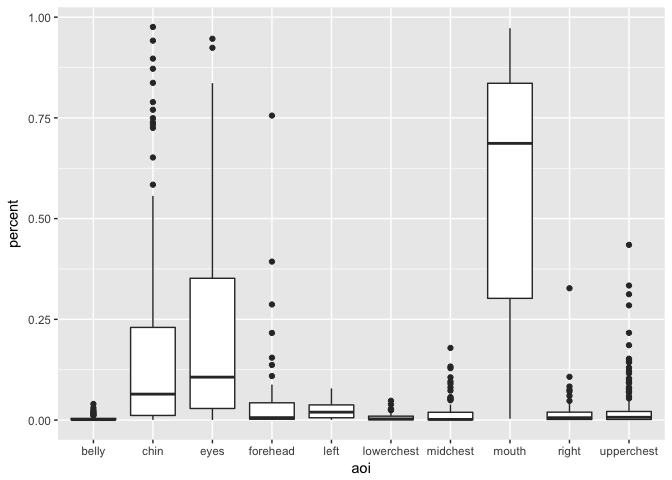
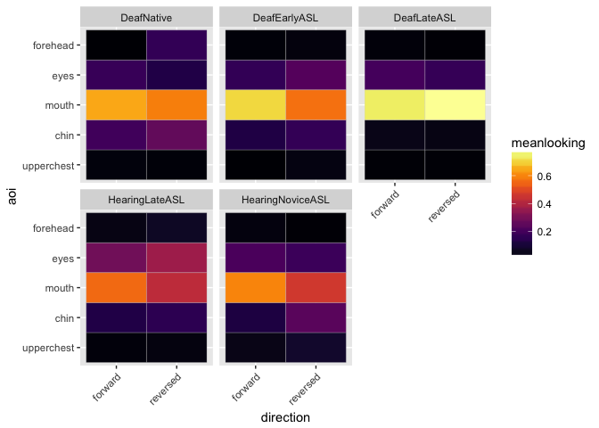

Eye Gaze Analysis (study1adults)
================
Adam Stone, PhD
09-13-2017

-   [Re-Initializing](#re-initializing)
-   [AOIs](#aois)
    -   [Data Diagnosing](#data-diagnosing)
-   [Percentage Data Prep and Visualization](#percentage-data-prep-and-visualization)
-   [Big Five AOIs](#big-five-aois)
    -   [Stats](#stats)
    -   [Visualizations](#visualizations)

Re-Initializing
===============

This assumes you've already done [01dataimportclean](01dataimportclean.nb.html) and so there'll be a nice new .csv file to re-import here. Also we gotta import all the libraries again. This shouldn't depend on anything we did for 02 Lexical Recall Analysis.

``` r
# Import packages we'll need.
library(tidyverse)
```

    ## Loading tidyverse: ggplot2
    ## Loading tidyverse: tibble
    ## Loading tidyverse: tidyr
    ## Loading tidyverse: readr
    ## Loading tidyverse: purrr
    ## Loading tidyverse: dplyr

    ## Conflicts with tidy packages ----------------------------------------------

    ## filter(): dplyr, stats
    ## lag():    dplyr, stats

``` r
library(stringr)
library(lme4)
```

    ## Loading required package: Matrix

    ## 
    ## Attaching package: 'Matrix'

    ## The following object is masked from 'package:tidyr':
    ## 
    ##     expand

``` r
library(lmerTest)
```

    ## 
    ## Attaching package: 'lmerTest'

    ## The following object is masked from 'package:lme4':
    ## 
    ##     lmer

    ## The following object is masked from 'package:stats':
    ## 
    ##     step

``` r
library(prettydoc)
library(broom)
library(knitr)
library(xtable)
library(kableExtra)
options(knitr.table.format = "html") 
data <- read_csv('cleandata.csv',col_types = 
                   cols(.default = col_double(),
                        id = col_integer(),
                        participant = col_character(),
                        hearing = col_character(),
                        videogroup = col_character(),
                        aoagroup = col_character(),
                        languagegroup = col_character(),
                        maingroup = col_character(),
                        video = col_character(),
                        story = col_character(),
                        direction = col_character(),
                        aoasl = col_integer(),
                        acc = col_double(),
                        forehead = col_double(),
                        eyes = col_double(),
                        mouth = col_double(),
                        chin = col_double(),
                        upperchest = col_double(),
                        midchest = col_double(),
                        lowerchest = col_double(),
                        belly = col_double(),
                        left = col_double(),
                        right = col_double(),
                        total = col_double()
                   ))
# And factorize
data <- data %>%
  mutate(hearing = as.factor(hearing)) %>%
  mutate(videogroup = as.factor(videogroup)) %>%
  mutate(aoagroup = as.factor(aoagroup)) %>%
  mutate(languagegroup = as.factor(languagegroup)) %>%
  mutate(maingroup = as.factor(maingroup)) %>%
  mutate(video = as.factor(video)) %>%
  mutate(story = as.factor(story)) %>%
  mutate(direction = as.factor(direction))
```

AOIs
====

These are our current AOIs. 1. Forehead (above eyes) 2. Eyes 3. Mouth 4. Chin (below chin) 5. Upper Chest 6. Middle Chest 7. Lower Chest 8. Belly 9. Left 10. Right

It's possible to do a secondary analysis combining some of these AOIs (in particular, maybe 5-6 and 7-8 can be combined into Torso Upper Half and Torso Lower Half). Anyway, the face AOIs are important, and the division of them into 4 areas is theoretically motivated and also previously seen in the literature.

*Why 4 AOIs on Face?* Emmorey et al. (2008) did this same setup. We generally know people fixate on the face across all conditions and langauge experiences, but **where** on the face is important for us to know. So these 4 AOIs.

*Why 4 AOIs for Torso?* At the same time, all papers, tend to just classify the body as "body" with no further breakdown, or two-part breakdown. We know there is a lot of different things happening in that area for signers, too, plus we're lookina at CHILDREN with different language experiences, so they may be interested in different things than adults. So just makes sense to break down body into different regions.

Data Diagnosing
---------------

This is my process of documenting how I'm weeding through data and making sure all's good. Let's visualize first of all.

``` r
# Reduce dataset to face AOIs only
data.face <- select(data,-upperchest,-midchest,-lowerchest,-belly,-left,-right)
# Reshape data so we can easily facet our charts based on face AOIs
data.face <- data.face %>% gather(aoi,looking,forehead:chin)
# Graph!
ggplot(data.face,aes(x=maingroup,y=looking,fill=direction)) +
  geom_boxplot() +
  theme(axis.text.x=element_text(angle=45,hjust=1)) +
  facet_wrap("aoi")
```

    ## Warning: Removed 157 rows containing non-finite values (stat_boxplot).

 Okay, right away I see some issues - I want to check for outliers but I'm not sure what could count as an outlier. All 4 stories are different lengths - a data point at 30 seconds would be fine for King Midas (0:37) but impossible for Red Riding Hood (0:18) so outliers need to be *relative* to the story length itself. Let's back up and do histograms for each story.

``` r
ggplot(data.face,aes(x=looking)) +
  geom_histogram(binwidth=1) +
  facet_wrap("story") +
  xlab("secs") +
  ggtitle("Face AOI sums for each story for each participant")
```

    ## Warning: Removed 157 rows containing non-finite values (stat_bin).

 Loooks good but I see weird outliers for Red Riding Hood (before Cinderalla too, which I fixed) - those single data points are past the video length (and that's just the face AOIs!). Let's sum up *all* AOIs across each story for each participant...back to the big dataset, and we'll do histograms again.

``` r
# data2 <- data %>%
#   group_by(id,story) %>%
#   mutate(total = sum(forehead,eyes,mouth,chin,upperchest,
#                      midchest,lowerchest,belly,left,right,na.rm=TRUE))
ggplot(data,aes(x=total)) +
  geom_histogram(binwidth=1) +
  facet_wrap("story") +
  xlab("secs") +
  ggtitle("Sum of ALL AOIs for each participant for each story")
```

 The tall bars are near the end of the story, right? So we see two issues: 1. Some barely watched the story at all. (Those are the ones with bars at or near zero). We should remove those. We need a rule for it. 1. A few people's AOI data has total seconds higher than the video itself! (Those are the ones with very short bars to the right of the very tall bars.) Those should be investigated, something went wrong in the data.

I'll highlight those rows that's for \#2 and send to Rain to look at.

But maybe a good way for diagnosing problem trials is to look at each AOI for each story, instead of sums of AOIs. Any outliers can be easily seen in the histograms. Let's reshape the data again and generate histograms.

``` r
data.reshape <- data %>% gather(aoi,looking,forehead:total)
ggplot(data.reshape,aes(x=looking)) +
  geom_histogram(binwidth=1) +
  facet_grid(aoi ~ story) +
  xlab("secs") +
  ggtitle("Looking times of each AOI for each participant for each story")
```

    ## Warning: Removed 812 rows containing non-finite values (stat_bin).


Need to mark this up.

Cool. Now I want to know how many people have really low looking times for each story. We can do this easily. Here's a table for how many have looking time sums that are less than 25% of the story, or less than 50% of the story.

``` r
# Split into 4 datasets (1 each story)
data.cinderella <- filter(data,story == "Cinderella")
data.goldilocks <- filter(data,story == "Goldilocks")
data.kingmidas <- filter(data,story == "KingMidas")
data.redridinghood <- filter(data,story== "RedRidingHood")

# FALSE = less than quarter or total story length
data.cinderella$quarter <- data.cinderella$total >= 5.5
data.cinderella$half <- data.cinderella$total >= 11
data.goldilocks$quarter <- data.goldilocks$total >=  5.25
data.goldilocks$half <- data.goldilocks$total >= 10.5
data.kingmidas$quarter <- data.kingmidas$total >= 9.25
data.kingmidas$half <- data.kingmidas$total >= 18.5
data.redridinghood$quarter <- data.redridinghood$total >= 4.5
data.redridinghood$half <- data.redridinghood$total >= 9

# Put it back together
data <- bind_rows(data.cinderella,data.goldilocks,data.kingmidas,data.redridinghood)

# Calculations
lowlooking <- data %>%
  group_by(story) %>%
  summarize(lessthan25 = sum(!quarter),
            lessthan50 = sum(!half),
            total = sum(!quarter,quarter))
lowlooking
```

    ## # A tibble: 4 x 4
    ##           story lessthan25 lessthan50 total
    ##          <fctr>      <int>      <int> <int>
    ## 1    Cinderella          4          8    46
    ## 2    Goldilocks          3          4    46
    ## 3     KingMidas          3          5    46
    ## 4 RedRidingHood          3          4    46

``` r
lowlookingid <- filter(data,quarter==FALSE) %>% 
  ungroup() %>%
  select(id,participant,hearing,videogroup,story,direction,total) %>%
  arrange(participant)
write.csv(lowlookingid, file="lessthan25.csv")
select(lowlookingid,-participant)
```

    ## # A tibble: 13 x 6
    ##       id hearing videogroup         story direction total
    ##    <int>  <fctr>     <fctr>        <fctr>    <fctr> <dbl>
    ##  1    10    Deaf    Group 1    Cinderella  reversed  4.62
    ##  2    10    Deaf    Group 1     KingMidas   forward  2.66
    ##  3    32 Hearing    Group 2    Goldilocks  reversed  4.08
    ##  4    31 Hearing    Group 2    Cinderella   forward  4.73
    ##  5     6    Deaf    Group 1    Cinderella  reversed  4.43
    ##  6     6    Deaf    Group 1 RedRidingHood  reversed  3.80
    ##  7     5    Deaf    Group 1     KingMidas   forward  2.91
    ##  8     5    Deaf    Group 1 RedRidingHood  reversed  1.96
    ##  9    25    Deaf    Group 2    Goldilocks  reversed  4.62
    ## 10     7    Deaf    Group 1    Cinderella  reversed  0.81
    ## 11     7    Deaf    Group 1     KingMidas   forward  6.84
    ## 12    30 Hearing    Group 1    Goldilocks   forward  2.56
    ## 13    17    Deaf    Group 1 RedRidingHood  reversed  0.52

So I will filter out the data with &lt;25% looking time. Maybe the threshold should be higher, but we'll revisit that later.

``` r
originalrows <- nrow(data)
data <- filter(data,quarter==TRUE)
difference <- originalrows - nrow(data)
```

So 13 stories were dropped from the previous total of 184 stories for a new total of 171 stories.

Percentage Data Prep and Visualization
======================================

We need to work with percentages, because of participants' idiosyntractic eye behavior. Some blink a lot, some don't, so automatically the maximum number of eye gaze data points each participant is able to contribute is different. For that reason we work with percent of total data points on a per-participant basis. That's also why we took out stories with &lt;25% looking data. Now here's the boxplots for each AOI.

``` r
# data2 uses percentage data!
data2 <- data %>%
  mutate_at(vars(forehead:right), funs(./total)) %>%
  select(-total, -quarter, -half) %>%
  gather(aoi,percent,forehead:right)

ggplot(data2, aes(x=aoi,y=percent)) +
  geom_boxplot() 
```

    ## Warning: Removed 748 rows containing non-finite values (stat_boxplot).



Big Five AOIs
=============

> You’ll have to decide how to put the AOIs in an ANOVA. All of them together is too many. And you cannot put ALL the AOIs in. If they all sum to 100% (which they currently do), then the observations are not independent. Also, you can’t put AOIs that have near-zero values in with AOIs that have super high values, you’ll get whopping significance that is too obvious to reveal anything meaningful.

Based on the boxplot there are five AOIs that got hit the most: forehead, eyes, mouth, chin, and upperchest.

*Important reference levels* - AOI reference level is eyes - MainGroup reference level is NativeDeaf

Stats
-----

> First, check the most important stats: Subject Groups, Video Condition, and some AOIs that are on the central body like: eyes, nose, mouth, neck, chest, below chest. You can combine some. If you see that no one ever looked at the forehead, you can dispense of that, and say that in the paper when you rationalize your AOIs used for stats. There might be a significant group main effect, OR a group main effect for reversed and not for forward, and furthermore, maybe only the late AoA groups show a reversal effect.

Let's jump straight to a big linear mixed model for the Big 5. We'll try both groups and regressing on AoA. Here are the ANOVA tables in order: 1. Linear model (no random terms) with MainGroups 1. Linear mixed model with MainGroups 1. Linear model (no random terms) with AoASL and Hearing 1. Linear mixed model with AoASL and Hearing

``` r
data.big5 <- filter(data2,aoi == "forehead" | aoi == "eyes" 
                    | aoi == "mouth" | aoi == "chin" | aoi == "upperchest") %>%
  mutate(aoi = as.factor(aoi))
data.big5$aoi <- relevel(data.big5$aoi, ref="eyes")
data.big5$maingroup <- relevel(data.big5$maingroup, ref="NativeDeaf")
model.group.lm <- lm(data = data.big5,percent ~ aoi * maingroup * direction)
anova(model.group.lm)
```

    ## Analysis of Variance Table
    ## 
    ## Response: percent
    ##                          Df  Sum Sq Mean Sq  F value    Pr(>F)    
    ## aoi                       4 27.4686  6.8672 142.3099 < 2.2e-16 ***
    ## maingroup                 4  0.0366  0.0091   0.1895  0.943910    
    ## direction                 1  0.0005  0.0005   0.0099  0.920829    
    ## aoi:maingroup            16  3.3323  0.2083   4.3160 4.558e-08 ***
    ## aoi:direction             4  0.8957  0.2239   4.6407  0.001068 ** 
    ## maingroup:direction       4  0.0013  0.0003   0.0068  0.999908    
    ## aoi:maingroup:direction  16  0.3648  0.0228   0.4725  0.959929    
    ## Residuals               621 29.9663  0.0483                       
    ## ---
    ## Signif. codes:  0 '***' 0.001 '**' 0.01 '*' 0.05 '.' 0.1 ' ' 1

``` r
model.group.lmm <- lmer(data = data.big5,percent ~ aoi * maingroup * direction + 
                      (1|participant) + (1|story))
anova(model.group.lmm)
```

    ## Analysis of Variance Table of type III  with  Satterthwaite 
    ## approximation for degrees of freedom
    ##                          Sum Sq Mean Sq NumDF DenDF F.value    Pr(>F)    
    ## aoi                     26.5674  6.6419     4   621 137.641 < 2.2e-16 ***
    ## maingroup                0.0252  0.0063     4   621   0.131  0.971148    
    ## direction                0.0155  0.0155     1   621   0.321  0.571316    
    ## aoi:maingroup            3.2379  0.2024    16   621   4.194 9.244e-08 ***
    ## aoi:direction            0.6881  0.1720     4   621   3.565  0.006916 ** 
    ## maingroup:direction      0.0140  0.0035     4   621   0.073  0.990369    
    ## aoi:maingroup:direction  0.3648  0.0228    16   621   0.472  0.959929    
    ## ---
    ## Signif. codes:  0 '***' 0.001 '**' 0.01 '*' 0.05 '.' 0.1 ' ' 1

``` r
model.aoa.lm <- lm(data = data.big5,percent ~ aoi * aoasl * direction * hearing)
anova(model.aoa.lm)
```

    ## Analysis of Variance Table
    ## 
    ## Response: percent
    ##                              Df  Sum Sq Mean Sq  F value    Pr(>F)    
    ## aoi                           4 27.4686  6.8672 142.6085 < 2.2e-16 ***
    ## aoasl                         1  0.0190  0.0190   0.3940 0.5304319    
    ## direction                     1  0.0006  0.0006   0.0121 0.9125082    
    ## hearing                       1  0.0051  0.0051   0.1050 0.7460503    
    ## aoi:aoasl                     4  0.7781  0.1945   4.0398 0.0030451 ** 
    ## aoi:direction                 4  0.9210  0.2302   4.7813 0.0008332 ***
    ## aoasl:direction               1  0.0005  0.0005   0.0098 0.9211112    
    ## aoi:hearing                   4  1.3845  0.3461   7.1880 1.157e-05 ***
    ## aoasl:hearing                 1  0.0283  0.0283   0.5868 0.4439334    
    ## direction:hearing             1  0.0004  0.0004   0.0084 0.9270446    
    ## aoi:aoasl:direction           4  0.0343  0.0086   0.1779 0.9498117    
    ## aoi:aoasl:hearing             4  0.9732  0.2433   5.0524 0.0005170 ***
    ## aoi:direction:hearing         4  0.0516  0.0129   0.2681 0.8985014    
    ## aoasl:direction:hearing       1  0.0006  0.0006   0.0119 0.9132244    
    ## aoi:aoasl:direction:hearing   4  0.0154  0.0039   0.0801 0.9884386    
    ## Residuals                   631 30.3851  0.0482                       
    ## ---
    ## Signif. codes:  0 '***' 0.001 '**' 0.01 '*' 0.05 '.' 0.1 ' ' 1

``` r
model.aoa.lmm <- lmer(data = data.big5,percent ~ aoi * aoasl * direction * hearing + 
                      (1|participant) + (1|story))
anova(model.aoa.lmm)
```

    ## Analysis of Variance Table of type III  with  Satterthwaite 
    ## approximation for degrees of freedom
    ##                              Sum Sq  Mean Sq NumDF DenDF F.value    Pr(>F)
    ## aoi                         1.20750 0.301874     4   631  6.2689 5.973e-05
    ## aoasl                       0.00788 0.007876     1   631  0.1636 0.6860371
    ## direction                   0.00118 0.001180     1   631  0.0245 0.8756445
    ## hearing                     0.00795 0.007946     1   631  0.1650 0.6847234
    ## aoi:aoasl                   0.53241 0.133104     4   631  2.7641 0.0268114
    ## aoi:direction               0.02700 0.006750     4   631  0.1402 0.9672570
    ## aoasl:direction             0.00005 0.000054     1   631  0.0011 0.9733496
    ## aoi:hearing                 1.18608 0.296520     4   631  6.1578 7.281e-05
    ## aoasl:hearing               0.00177 0.001769     1   631  0.0367 0.8480841
    ## direction:hearing           0.00003 0.000028     1   631  0.0006 0.9809363
    ## aoi:aoasl:direction         0.02155 0.005387     4   631  0.1119 0.9783557
    ## aoi:aoasl:hearing           0.96653 0.241634     4   631  5.0179 0.0005493
    ## aoi:direction:hearing       0.00818 0.002044     4   631  0.0424 0.9965848
    ## aoasl:direction:hearing     0.00081 0.000810     1   631  0.0168 0.8968583
    ## aoi:aoasl:direction:hearing 0.01542 0.003856     4   631  0.0801 0.9884386
    ##                                
    ## aoi                         ***
    ## aoasl                          
    ## direction                      
    ## hearing                        
    ## aoi:aoasl                   *  
    ## aoi:direction                  
    ## aoasl:direction                
    ## aoi:hearing                 ***
    ## aoasl:hearing                  
    ## direction:hearing              
    ## aoi:aoasl:direction            
    ## aoi:aoasl:hearing           ***
    ## aoi:direction:hearing          
    ## aoasl:direction:hearing        
    ## aoi:aoasl:direction:hearing    
    ## ---
    ## Signif. codes:  0 '***' 0.001 '**' 0.01 '*' 0.05 '.' 0.1 ' ' 1

But that can be complicated because of so many possible interactions (groups x aois x direction x hearing) in the posthoc analyses. We'll try separating for direction. Because we think there is no difference among groups for forward, but there should be for reverse.

``` r
data.big5.fw <- filter(data.big5,direction=="forward")
data.big5.rv <- filter(data.big5,direction=="reversed")
model.group.fw <- lmer(data = data.big5.fw,percent ~ aoi * maingroup  + 
                      (1|participant) + (1|story))
anova(model.group.fw)
```

    ## Analysis of Variance Table of type III  with  Satterthwaite 
    ## approximation for degrees of freedom
    ##                Sum Sq Mean Sq NumDF DenDF F.value  Pr(>F)    
    ## aoi           17.8463  4.4616     4   317 107.788 < 2e-16 ***
    ## maingroup      0.0012  0.0003     4   317   0.007 0.99990    
    ## aoi:maingroup  1.3453  0.0841    16   317   2.031 0.01122 *  
    ## ---
    ## Signif. codes:  0 '***' 0.001 '**' 0.01 '*' 0.05 '.' 0.1 ' ' 1

``` r
model.group.rv <- lmer(data = data.big5.rv,percent ~ aoi * maingroup  + 
                      (1|participant) + (1|story))
anova(model.group.rv)
```

    ## Analysis of Variance Table of type III  with  Satterthwaite 
    ## approximation for degrees of freedom
    ##               Sum Sq Mean Sq NumDF DenDF F.value    Pr(>F)    
    ## aoi           9.5742 2.39355     4   304  43.196 < 2.2e-16 ***
    ## maingroup     0.0383 0.00957     4   304   0.173 0.9522727    
    ## aoi:maingroup 2.3013 0.14383    16   304   2.596 0.0008294 ***
    ## ---
    ## Signif. codes:  0 '***' 0.001 '**' 0.01 '*' 0.05 '.' 0.1 ' ' 1

What if we use AoA as linear and then deaf/hearing

``` r
model.group.fw <- lmer(data = data.big5.fw,percent ~ aoi * aoasl * hearing  + 
                      (1|participant) + (1|story))
anova(model.group.fw)
```

    ## Analysis of Variance Table of type III  with  Satterthwaite 
    ## approximation for degrees of freedom
    ##                    Sum Sq  Mean Sq NumDF DenDF F.value   Pr(>F)   
    ## aoi               0.63550 0.158876     4   322  3.9206 0.004010 **
    ## aoasl             0.00304 0.003038     1   322  0.0750 0.784403   
    ## hearing           0.00417 0.004171     1   322  0.1029 0.748550   
    ## aoi:aoasl         0.22712 0.056779     4   322  1.4012 0.233335   
    ## aoi:hearing       0.57378 0.143445     4   322  3.5398 0.007622 **
    ## aoasl:hearing     0.00228 0.002279     1   322  0.0562 0.812692   
    ## aoi:aoasl:hearing 0.42962 0.107404     4   322  2.6504 0.033308 * 
    ## ---
    ## Signif. codes:  0 '***' 0.001 '**' 0.01 '*' 0.05 '.' 0.1 ' ' 1

``` r
model.group.rv <- lmer(data = data.big5.rv,percent ~ aoi * aoasl * hearing  + 
                      (1|participant) + (1|story))
anova(model.group.rv)
```

    ## Analysis of Variance Table of type III  with  Satterthwaite 
    ## approximation for degrees of freedom
    ##                    Sum Sq  Mean Sq NumDF DenDF F.value  Pr(>F)  
    ## aoi               0.59514 0.148785     4   309 2.65186 0.03331 *
    ## aoasl             0.00508 0.005077     1   309 0.09049 0.76376  
    ## hearing           0.00378 0.003775     1   309 0.06729 0.79549  
    ## aoi:aoasl         0.32722 0.081806     4   309 1.45806 0.21487  
    ## aoi:hearing       0.61723 0.154306     4   309 2.75028 0.02837 *
    ## aoasl:hearing     0.00010 0.000102     1   309 0.00181 0.96607  
    ## aoi:aoasl:hearing 0.55808 0.139520     4   309 2.48673 0.04354 *
    ## ---
    ## Signif. codes:  0 '***' 0.001 '**' 0.01 '*' 0.05 '.' 0.1 ' ' 1

Visualizations
--------------

Getting a bit confused, yeah...let's plot these out (which I should have done before diving into stats tests).

``` r
ggplot(data.big5) + 
  geom_boxplot(aes(x=maingroup,y=percent,color=direction)) +
  facet_wrap("aoi") + 
  theme(axis.text.x=element_text(angle=45,hjust=1))
```

    ## Warning: Removed 184 rows containing non-finite values (stat_boxplot).

 Or a heat map! This can be pretty useful. This one is both forward/reverse

``` r
data.big5.reduce <- data.big5 %>%
  group_by(maingroup,aoi) %>%
  summarize(meanlooking = mean(percent, na.rm=TRUE))
ggplot(data.big5.reduce, aes(x = maingroup, y = aoi)) +
  geom_tile(aes(fill=meanlooking),na.rm=TRUE) + 
  scale_fill_gradient(low = "lightblue",high = "steelblue") 
```

 Let's divide by direction...

``` r
data.big5.reduce <- data.big5 %>%
  group_by(maingroup,aoi,direction) %>%
  summarize(meanlooking = mean(percent, na.rm=TRUE)) %>%
  ungroup() %>%
  mutate(aoi = factor(aoi,levels=c("upperchest","chin","mouth","eyes","forehead")))
ggplot(data.big5.reduce, aes(x = maingroup, y = aoi)) +
  geom_tile(aes(fill=meanlooking),na.rm=TRUE) + 
  scale_fill_gradient(low = "lightblue",high = "steelblue") +
  facet_wrap("direction") +
  theme(axis.text.x=element_text(angle=45,hjust=1))
```


That's cool. We can work on this. But what I REALLY wanted to do next was to do line plots, with lines for direction AND deafness, and x-axis being AOA and y-axis being percent looking. And the facet would be AOI. That can work. Let me try this. Well, it's not exactly right. First thing in the morning.

``` r
ggplot(data.big5, aes(x=aoasl,y=percent)) +
  geom_point(aes(color=direction)) +
  geom_line(aes(color=direction)) + 
  facet_grid(aoi ~ hearing)
```

    ## Warning: Removed 184 rows containing missing values (geom_point).

 &gt; Then, how about a section on Percent Looking for AOI’s examines whether there are side biases by doing an ANOVA with the entire Left vs Right side as 2 AOI levels, with Subject Groups, and Forward and Reversed. If there are side biases, hopefully it is for the later AoA groups, then this means they are being drawn to the hands more than native signers. It’s possible that this is driven by where the signer puts her dominant hand or by a hemispheric bias.

> Maybe even the native signers have a little side bias too for other reasons, but I doubt it. This is kind of the hand-gravity idea, because there is nothing ever in the sides but arms and hands.

> If nothing is significant with side biases, you still write all this up in a section in the paper and in the Discussion revisit that saying there were no side biases found.

> Then when you do a multiple regression analysis, which will be looking at whether gaze behavior can be used to predict accuracy on lexical recall, this will have hearing status, AoA, lexical recall accuracy …. For reversed and not forward? You can’t put both in. And a few of the AOI measures, maybe just one. Maybe a looking-ratio. Maybe a measure of scatter? I don't know. That's where viewing space comes in, and that's saved for later. If we end up saving this for later, that's fine.
