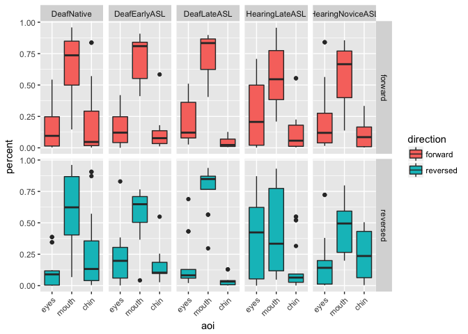
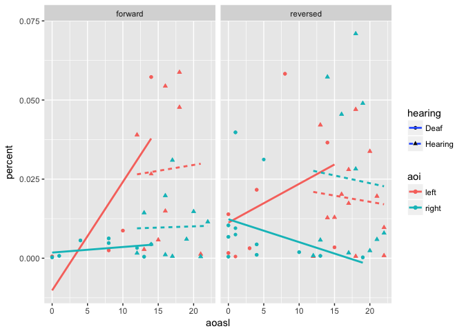

Eye Gaze Analysis (study1adults)
================
Adam Stone, PhD
09-20-2017

-   [Re-Initializing](#re-initializing)
-   [AOIs](#aois)
-   [Data Cleaning](#data-cleaning)
    -   [Percentage Data and Viz](#percentage-data-and-viz)
-   [Big Five AOIs](#big-five-aois)
    -   [Group ANOVA](#group-anova)
    -   [Age of ASL & Hearing Status ANCOVA](#age-of-asl-hearing-status-ancova)
-   [3 Face AOIs Only](#face-aois-only)
    -   [Visualizations](#visualizations)
    -   [Group ANOVA](#group-anova-1)
    -   [Age of ASL & Hearing Status ANCOVA](#age-of-asl-hearing-status-ancova-1)
-   [Left/Right Analysis](#leftright-analysis)
-   [Assorted/older stuff pushed to the bottom](#assortedolder-stuff-pushed-to-the-bottom)

Re-Initializing
===============

This assumes you've already done [01dataimportclean](01dataimportclean.nb.html) and so there'll be a nice new .csv file to re-import here. Also we gotta import all the libraries again. This shouldn't depend on anything we did for 02 Lexical Recall Analysis.

``` r
# Import packages we'll need.
library(tidyverse)
```

    ## Loading tidyverse: ggplot2
    ## Loading tidyverse: tibble
    ## Loading tidyverse: tidyr
    ## Loading tidyverse: readr
    ## Loading tidyverse: purrr
    ## Loading tidyverse: dplyr

    ## Conflicts with tidy packages ----------------------------------------------

    ## filter(): dplyr, stats
    ## lag():    dplyr, stats

``` r
library(stringr)
library(lme4)
```

    ## Loading required package: Matrix

    ## 
    ## Attaching package: 'Matrix'

    ## The following object is masked from 'package:tidyr':
    ## 
    ##     expand

``` r
library(lmerTest)
```

    ## 
    ## Attaching package: 'lmerTest'

    ## The following object is masked from 'package:lme4':
    ## 
    ##     lmer

    ## The following object is masked from 'package:stats':
    ## 
    ##     step

``` r
library(prettydoc)
library(broom)
library(knitr)
library(xtable)
library(kableExtra)
library(viridis)
```

    ## Loading required package: viridisLite

``` r
options(knitr.table.format = "html") 
data <- read_csv('cleandata.csv',col_types = 
                   cols(.default = col_double(),
                        id = col_integer(),
                        participant = col_character(),
                        hearing = col_character(),
                        videogroup = col_character(),
                        aoagroup = col_character(),
                        languagegroup = col_character(),
                        maingroup = col_character(),
                        video = col_character(),
                        story = col_character(),
                        direction = col_character(),
                        aoasl = col_integer(),
                        acc = col_double(),
                        forehead = col_double(),
                        eyes = col_double(),
                        mouth = col_double(),
                        chin = col_double(),
                        upperchest = col_double(),
                        midchest = col_double(),
                        lowerchest = col_double(),
                        belly = col_double(),
                        left = col_double(),
                        right = col_double(),
                        total = col_double()
                   ))
# And factorize
data <- data %>%
  mutate(hearing = as.factor(hearing)) %>%
  mutate(videogroup = as.factor(videogroup)) %>%
  mutate(aoagroup = as.factor(aoagroup)) %>%
  mutate(languagegroup = as.factor(languagegroup)) %>%
  mutate(maingroup = as.factor(maingroup)) %>%
  mutate(video = as.factor(video)) %>%
  mutate(story = as.factor(story)) %>%
  mutate(direction = as.factor(direction))
```

AOIs
====

These are our current AOIs.

1.  Forehead (above eyes)
2.  Eyes
3.  Mouth
4.  Chin (below chin)
5.  Upper Chest
6.  Middle Chest
7.  Lower Chest
8.  Belly
9.  Left
10. Right

It's possible to do a secondary analysis combining some of these AOIs (in particular, maybe 5-6 and 7-8 can be combined into Torso Upper Half and Torso Lower Half). Anyway, the face AOIs are important, and the division of them into 4 areas is theoretically motivated and also previously seen in the literature.

*Why 4 AOIs on Face?* Emmorey et al. (2008) did this same setup. We generally know people fixate on the face across all conditions and langauge experiences, but **where** on the face is important for us to know. So these 4 AOIs. *Write one sentence here about predictions for language experience on face-looking.*

*Why 4 AOIs for Torso?* Past papers tend to just classify the body as “body” with no further breakdown, or two-part breakdown. In our study, we have higher resolution to break this down into four AOI’s, defined as upper chest, middle chest, lower chest, and belly. We know that hands start and end at the belly and the hands spend the majority of the time in these four areas in front of the torso (and the hands spend very little time overlapping the face). If an observer (child or adult) glances at the hands (or if the hands have any “gravity” upon gaze behavior), then gaze samples will fall within these four torso areas. Although we expect that all observers do spend the most amount of time on the face, we also predict that the number of gazes towards the hands (by way of “torso”) might be impacted by language experience. *(make a footnote here: As a future project, we will analyze the data using dynamic “hand” AOIs, for each hand, in which we document, on each frame, where the left and right hands are in viewing space.)*

*Why 2 AOIs for left vs right?* People have talked how sign language impacts left vs right visual field asymmetries, as related to hemispheric laterality for language processing, so it is worth checking this. If we do find an asymmetry, we will then just touch upon this literature in the discussion, but also acknowledge that it could be the signer’s hand dominance that drives a lateral asymmetry too, not just a hemispheric asymmetry. Meaning, if the signer is right handed, her dominant hand might have some “gravity” in the viewer’s left visual field. (And we can check this with the future analysis of dynamic hand AOIs.)

Data Cleaning
=============

This is my process of documenting how I'm weeding through data and making sure all's good. \[Change 18 Sep 2017\] I deleted half of these...just cutting out the fat.

Let's sum up *all* AOIs across each story for each participant...back to the big dataset, and we'll do histograms

``` r
# data2 <- data %>%
#   group_by(id,story) %>%
#   mutate(total = sum(forehead,eyes,mouth,chin,upperchest,
#                      midchest,lowerchest,belly,left,right,na.rm=TRUE))
ggplot(data,aes(x=total)) +
  geom_histogram(binwidth=1) +
  facet_wrap("story") +
  xlab("secs") +
  ggtitle("Sum of ALL AOIs for each participant for each story")
```

 The tall bars are near the end of the story, right? So we see two issues: 1. Some barely watched the story at all. (Those are the ones with bars at or near zero). We should remove those. We need a rule for it. 1. A few people's AOI data has total seconds higher than the video itself! (Those are the ones with very short bars to the right of the very tall bars.) Those should be investigated, something went wrong in the data.

I'll highlight those rows that's for \#2 and send to Rain to look at.

But maybe a good way for diagnosing problem trials is to look at each AOI for each story, instead of sums of AOIs. Any outliers can be easily seen in the histograms. Let's reshape the data again and generate histograms.

``` r
data.reshape <- data %>% gather(aoi,looking,forehead:total)
ggplot(data.reshape,aes(x=looking)) +
  geom_histogram(binwidth=1) +
  facet_grid(aoi ~ story) +
  xlab("secs") +
  ggtitle("Looking times of each AOI for each participant for each story")
```

    ## Warning: Removed 813 rows containing non-finite values (stat_bin).


Need to mark this up.

Cool. Now I want to know how many people have really low looking times for each story. We can do this easily. Here's a table for how many have looking time sums that are less than 25% of the story, or less than 50% of the story.

``` r
# Split into 4 datasets (1 each story)
data.cinderella <- filter(data,story == "Cinderella")
data.goldilocks <- filter(data,story == "Goldilocks")
data.kingmidas <- filter(data,story == "KingMidas")
data.redridinghood <- filter(data,story== "RedRidingHood")

# FALSE = less than quarter or total story length
data.cinderella$quarter <- data.cinderella$total >= 5.5
data.cinderella$half <- data.cinderella$total >= 11
data.goldilocks$quarter <- data.goldilocks$total >=  5.25
data.goldilocks$half <- data.goldilocks$total >= 10.5
data.kingmidas$quarter <- data.kingmidas$total >= 9.25
data.kingmidas$half <- data.kingmidas$total >= 18.5
data.redridinghood$quarter <- data.redridinghood$total >= 4.5
data.redridinghood$half <- data.redridinghood$total >= 9

# Put it back together
data <- bind_rows(data.cinderella,data.goldilocks,data.kingmidas,data.redridinghood)

# Calculations
lowlooking <- data %>%
  group_by(story) %>%
  dplyr::summarize(lessthan25 = sum(!quarter),
            lessthan50 = sum(!half),
            total = sum(!quarter,quarter))
lowlooking
```

    ## # A tibble: 4 x 4
    ##           story lessthan25 lessthan50 total
    ##          <fctr>      <int>      <int> <int>
    ## 1    Cinderella          4          7    46
    ## 2    Goldilocks          2          3    46
    ## 3     KingMidas          3          5    46
    ## 4 RedRidingHood          3          4    46

``` r
lowlookingid <- filter(data,quarter==FALSE) %>% 
  ungroup() %>%
  select(id,participant,hearing,videogroup,story,direction,total) %>%
  arrange(participant)
write.csv(lowlookingid, file="lessthan25.csv")
select(lowlookingid,-participant)
```

    ## # A tibble: 12 x 6
    ##       id hearing videogroup         story direction total
    ##    <int>  <fctr>     <fctr>        <fctr>    <fctr> <dbl>
    ##  1    10    Deaf    Group 1    Cinderella  reversed  4.56
    ##  2    10    Deaf    Group 1     KingMidas   forward  2.67
    ##  3    32 Hearing    Group 2    Goldilocks  reversed  4.08
    ##  4    31 Hearing    Group 2    Cinderella   forward  4.73
    ##  5     6    Deaf    Group 1    Cinderella  reversed  4.43
    ##  6     6    Deaf    Group 1 RedRidingHood  reversed  3.80
    ##  7     5    Deaf    Group 1     KingMidas   forward  2.91
    ##  8     5    Deaf    Group 1 RedRidingHood  reversed  1.96
    ##  9    25    Deaf    Group 2    Goldilocks  reversed  4.62
    ## 10     7    Deaf    Group 1    Cinderella  reversed  0.81
    ## 11     7    Deaf    Group 1     KingMidas   forward  6.84
    ## 12    17    Deaf    Group 1 RedRidingHood  reversed  0.52

``` r
#lowlookingid
```

So I will filter out the data with &lt;25% looking time. Maybe the threshold should be higher, but we'll revisit that later.

``` r
originalrows <- nrow(data)
data <- filter(data,quarter==TRUE)
difference <- originalrows - nrow(data)
```

So 12 stories were dropped from the previous total of 184 stories for a new total of 172 stories.

Percentage Data and Viz
-----------------------

We need to work with percentages, because of participants' idiosyntractic eye behavior. Some blink a lot, some don't, so automatically the maximum number of eye gaze data points each participant is able to contribute is different. For that reason we work with percent of total data points on a per-participant basis. That's also why we took out stories with &lt;25% looking data.

I also want to have Face and Chest AOIs defined, such that: - Face = eyes + mouth + chin - Chest = upperchest + midchest + lowerchest - And a Face-Chest ratio, defined by (F-Chest)/(F+Chest)

And I will save this as `cleanpercentdata.csv.` Now here's the boxplots for each AOI.

``` r
# data2 uses percentage data!
data2 <- data %>%
  mutate_at(vars(forehead:right), funs(./total)) %>%
  select(-total, -quarter, -half) %>%
  group_by(participant,story) %>%
  mutate(face = sum(eyes,mouth,chin,na.rm=TRUE),
         chest = sum(upperchest,midchest,lowerchest,na.rm=TRUE),
         facechest = (face-chest)/(face+chest)) %>%
  gather(aoi,percent,forehead:facechest)

write.csv(data2,"cleanpercentdata.csv",row.names=FALSE)

ggplot(data2, aes(x=aoi,y=percent)) +
  geom_boxplot() 
```

    ## Warning: Removed 754 rows containing non-finite values (stat_boxplot).


But we should also look at histograms of percentage data. Those should have more normal-like distributions for the high-hitting AOIs, unlike the actual looking data in seconds which has a upper limit.

``` r
ggplot(data2,aes(x=percent)) +
  geom_histogram() +
  facet_grid(aoi ~ story) +
  xlab("secs") +
  ggtitle("Looking times of each AOI for each participant for each story")
```

    ## `stat_bin()` using `bins = 30`. Pick better value with `binwidth`.

    ## Warning: Removed 754 rows containing non-finite values (stat_bin).


### Problem people are Allison, SaraG, and ChrissyK for the reasons below:

-   **Sara G. What is happening...her story sums are still over the limit (one story has 41 s, and no story is more than 37 s). There isn't another Sara G recording hiding somewhere or maybe her scenes are wrong? I'm attaching what I have for her, and from the histograms it's her forehead in Cinderella and eyes in King Midas that seem way out of the ordinary (I highlighted both cells in yellow). **
-   **ChrissyK (yes, K) doesn't show any eye or forehead AOI data for any of her 4 stories. (no other participant fails to provide eye AOI data, although several have very low, &lt;1 s eye AOI data). Is it possible her calibration is shifted a little?**
-   **Allison's data for King Midas (2nd FW story) is strange, she has 33% looking for the right-side AOI. Nobody else even gets to 10%. Double-check?**

Big Five AOIs
=============

> You’ll have to decide how to put the AOIs in an ANOVA. All of them together is too many. And you cannot put ALL the AOIs in. If they all sum to 100% (which they currently do), then the observations are not independent. Also, you can’t put AOIs that have near-zero values in with AOIs that have super high values, you’ll get whopping significance that is too obvious to reveal anything meaningful.

Based on the boxplot there are five AOIs that got hit the most: forehead, eyes, mouth, chin, and upperchest. **But this is really important...I think there is one or two outliers in forehead. And maybe it's better to get rid of forehead and upper chest for the big ANOVAs to keep things simple. Neither of them touch 50%...but then again they are not "non-significant." I am going ahead with all 5 for now.**

*Important reference levels* - AOI reference level is eyes - MainGroup reference level is DeafNative

Creating the `data.big5` thing here.

``` r
# Make Big5 df with reference levels
data.big5 <- filter(data2,aoi == "forehead" | aoi == "eyes" 
                    | aoi == "mouth" | aoi == "chin" | aoi == "upperchest") %>%
  mutate(aoi = as.factor(aoi))
data.big5$aoi <- factor(data.big5$aoi, levels=c("upperchest","chin","mouth","eyes","forehead"))
data.big5$aoi <- relevel(data.big5$aoi, ref="eyes")
data.big5$maingroup <- relevel(data.big5$maingroup, ref="DeafNative")
```

Group ANOVA
-----------

Because we're doing ANOVAs, that means we need subject-level data, not trial-level data. Let's bump the `data.big5` up one level.

``` r
data.big5.item <- data.big5 # save item-level data for later

# Pull out and save subject info
data.big5.subjectinfo <- data.big5 %>%
  select(-acc,-aoi,-percent,-video,-story) %>%
  distinct()
```

    ## Adding missing grouping variables: `story`

``` r
# Now collapse data.big5 to subject-level 
data.big5 <- data.big5 %>%
  group_by(participant,direction,aoi) %>%
  summarize(percent = mean(percent,na.rm=TRUE))
data.big5[data.big5=="NaN"] <- NA


# Join subject info with data.big5 that's now subject-level
data.big5 <- left_join(data.big5,data.big5.subjectinfo, by=c("participant","direction"))
```

Now we can do the ANOVAs.

> First, check the most important stats: Subject Groups, Video Condition, and some AOIs that are on the central body like: eyes, nose, mouth, neck, chest, below chest. You can combine some. If you see that no one ever looked at the forehead, you can dispense of that, and say that in the paper when you rationalize your AOIs used for stats. There might be a significant group main effect, OR a group main effect for reversed and not for forward, and furthermore, maybe only the late AoA groups show a reversal effect.

First let's do groups only (no continuous variables). First the viz, then the stats.

``` r
ggplot(data.big5) + 
  geom_boxplot(aes(x=maingroup,y=percent,color=direction)) +
  facet_wrap("aoi") + 
  theme(axis.text.x=element_text(angle=45,hjust=1))
```

    ## Warning: Removed 120 rows containing non-finite values (stat_boxplot).


``` r
data.big5.viz <- data.big5 %>%
  group_by(maingroup,direction,aoi) %>%
  summarize(mean = mean(percent,na.rm=TRUE), sd = sd(percent,na.rm=TRUE))
ggplot(data.big5.viz, aes(x=maingroup,y=mean,color=direction)) +
  geom_point(position=position_dodge(0.5)) +
  geom_errorbar(aes(ymin=mean-sd,ymax=mean+sd),width=0.1,position=position_dodge(0.5)) +
  facet_wrap("aoi") +
  theme(axis.text.x=element_text(angle=45,hjust=1))
```


Or a heat map!

``` r
data.big5.reduce <- data.big5 %>%
  group_by(maingroup,aoi,direction) %>%
  summarize(meanlooking = mean(percent, na.rm=TRUE)) %>%
  ungroup() %>%
  mutate(aoi = factor(aoi,levels=c("upperchest","chin","mouth","eyes","forehead")))
ggplot(data.big5.reduce, aes(x = maingroup, y = aoi)) +
  geom_tile(aes(fill=meanlooking),color="lightgray",na.rm=TRUE) + 
#  scale_fill_gradient(low = "lightblue",high = "steelblue") +
#  scale_fill_distiller(type="div", palette = "RdYlBu") +
  scale_fill_viridis(option = "inferno") +
  facet_wrap("direction") +
  theme(axis.text.x=element_text(angle=45,hjust=1))
```


What if we faceted this heat map by group instead of direction:

``` r
ggplot(data.big5.reduce, aes(x = direction, y = aoi)) +
  geom_tile(aes(fill=meanlooking),color="lightgray",na.rm=TRUE) + 
#  scale_fill_gradient(low = "lightblue",high = "steelblue") +
#  scale_fill_distiller(type="div", palette = "RdYlBu") +
  scale_fill_viridis(option = "inferno") +
  facet_wrap("maingroup") +
  theme(axis.text.x=element_text(angle=45,hjust=1))
```


The ANOVA below tells us there's a significant effect of AOI, and significant interactions of AOI x Direction and AOI x MainGroup.

``` r
group.anova <- aov(data=data.big5,percent ~ aoi * direction * maingroup)
anova(group.anova)
```

    ## Analysis of Variance Table
    ## 
    ## Response: percent
    ##                          Df Sum Sq Mean Sq  F value    Pr(>F)    
    ## aoi                       4 33.088  8.2719 231.3064 < 2.2e-16 ***
    ## direction                 1  0.000  0.0003   0.0078  0.929760    
    ## maingroup                 4  0.024  0.0061   0.1698  0.953801    
    ## aoi:direction             4  0.569  0.1423   3.9782  0.003366 ** 
    ## aoi:maingroup            16  2.373  0.1483   4.1476 1.095e-07 ***
    ## direction:maingroup       4  0.001  0.0003   0.0087  0.999851    
    ## aoi:direction:maingroup  16  0.586  0.0366   1.0244  0.427993    
    ## Residuals               690 24.676  0.0358                       
    ## ---
    ## Signif. codes:  0 '***' 0.001 '**' 0.01 '*' 0.05 '.' 0.1 ' ' 1

Here's the posthoc (Tukey's HSD) for AOI, which tells us most AOIs are different from each other, except: 1. chin vs. eyes 1. forehead vs. upper chest

Forget doing posthocs for all the interactions, way too many.

``` r
group.anova.posthoc <- TukeyHSD(group.anova,'aoi',conf.level = 0.95) 
group.anova.posthoc
```

    ##   Tukey multiple comparisons of means
    ##     95% family-wise confidence level
    ## 
    ## Fit: aov(formula = percent ~ aoi * direction * maingroup, data = data.big5)
    ## 
    ## $aoi
    ##                             diff         lwr         upr     p adj
    ## upperchest-eyes     -0.176593807 -0.23449208 -0.11869553 0.0000000
    ## chin-eyes           -0.047639640 -0.10382384  0.00854456 0.1400238
    ## mouth-eyes           0.390967139  0.33486394  0.44707034 0.0000000
    ## forehead-eyes       -0.167983459 -0.23916217 -0.09680475 0.0000000
    ## chin-upperchest      0.128954166  0.07129764  0.18661069 0.0000000
    ## mouth-upperchest     0.567560946  0.50998335  0.62513854 0.0000000
    ## forehead-upperchest  0.008610348 -0.06373617  0.08095687 0.9975724
    ## mouth-chin           0.438606779  0.38275309  0.49446046 0.0000000
    ## forehead-chin       -0.120343818 -0.19132602 -0.04936162 0.0000415
    ## forehead-mouth      -0.558950598 -0.62986871 -0.48803249 0.0000000

Age of ASL & Hearing Status ANCOVA
----------------------------------

MainGroup is actually two different variables combined together: deaf and hearing, and native/early/late learners. What if we separated those out and regressed AoASL as a continuous variable, and added deaf/hearing as a factor. Again, first the viz, then the stats.

``` r
# Draw it
ggplot(data.big5, aes(x=aoasl,y=percent)) +
  geom_point(aes(color=direction,shape=hearing)) +
  geom_smooth(aes(color=direction,linetype=hearing),method="lm",se=FALSE) +
  facet_wrap("aoi")
```

    ## Warning: Removed 120 rows containing non-finite values (stat_smooth).

    ## Warning: Removed 120 rows containing missing values (geom_point).


Let's move to ANOVAs. This is technically an ANCOVA, and AoASL is the covariate. The output tells us there is a significant main effect of AOI, and significant interactions of AOI x Direction and AOI x Hearing. A marginally significant interaction of AOI x Hearing X AoASL. So really it's very similar to what we got with the group ANOVA.

``` r
continuous.anova <- aov(data=data.big5, percent ~ aoi * direction * hearing * aoasl)
anova(continuous.anova)
```

    ## Analysis of Variance Table
    ## 
    ## Response: percent
    ##                              Df Sum Sq Mean Sq  F value    Pr(>F)    
    ## aoi                           4 33.088  8.2719 231.2786 < 2.2e-16 ***
    ## direction                     1  0.000  0.0003   0.0078 0.9297639    
    ## hearing                       1  0.014  0.0140   0.3910 0.5319950    
    ## aoasl                         1  0.002  0.0017   0.0467 0.8289125    
    ## aoi:direction                 4  0.569  0.1422   3.9750 0.0033819 ** 
    ## aoi:hearing                   4  1.324  0.3309   9.2515 2.744e-07 ***
    ## direction:hearing             1  0.000  0.0001   0.0015 0.9688187    
    ## aoi:aoasl                     4  0.281  0.0702   1.9621 0.0985631 .  
    ## direction:aoasl               1  0.000  0.0001   0.0037 0.9516571    
    ## hearing:aoasl                 1  0.010  0.0097   0.2709 0.6028738    
    ## aoi:direction:hearing         4  0.145  0.0362   1.0129 0.3998327    
    ## aoi:direction:aoasl           4  0.034  0.0086   0.2408 0.9152243    
    ## aoi:hearing:aoasl             4  0.764  0.1909   5.3378 0.0003078 ***
    ## direction:hearing:aoasl       1  0.000  0.0003   0.0090 0.9243561    
    ## aoi:direction:hearing:aoasl   4  0.052  0.0129   0.3602 0.8370082    
    ## Residuals                   700 25.036  0.0358                       
    ## ---
    ## Signif. codes:  0 '***' 0.001 '**' 0.01 '*' 0.05 '.' 0.1 ' ' 1

Maybe it's a problem that all the hearing people have late AoASL while most deaf have early AoASL. And I don't like the forehead outliers throwing off some of those lines from the graph above so that needs to be looked at. What if we tried sign-years instead of AoASL.

``` r
ggplot(data.big5, aes(x=signyrs,y=percent)) +
  geom_point(aes(color=direction,shape=hearing)) +
  geom_smooth(aes(color=direction,linetype=hearing),method="lm",se=FALSE) +
  facet_wrap("aoi")
```

    ## Warning: Removed 120 rows containing non-finite values (stat_smooth).

    ## Warning: Removed 120 rows containing missing values (geom_point).


Look interesting and you can sort of compare the deaf/hearing lines better, although we should get rid of that person who's been signing for 60 years if we do a years-of-signing analysis. Here's the ANCOVA.

Let's move to ANOVAs. This is technically an ANCOVA, and AoASL is the covariate. The output tells us there is a significant main effect of AOI, and significant interactions of AOI x Direction and AOI x Hearing and AOI x SignYrs. Again a rather similar thing result.

``` r
continuous.anova.sy <- aov(data=data.big5, percent ~ aoi * direction * hearing * signyrs)
anova(continuous.anova.sy)
```

    ## Analysis of Variance Table
    ## 
    ## Response: percent
    ##                                Df Sum Sq Mean Sq  F value    Pr(>F)    
    ## aoi                             4 33.088  8.2719 229.4561 < 2.2e-16 ***
    ## direction                       1  0.000  0.0003   0.0077  0.930040    
    ## hearing                         1  0.014  0.0140   0.3879  0.533615    
    ## signyrs                         1  0.000  0.0002   0.0065  0.935939    
    ## aoi:direction                   4  0.568  0.1421   3.9405  0.003591 ** 
    ## aoi:hearing                     4  1.324  0.3310   9.1812 3.114e-07 ***
    ## direction:hearing               1  0.000  0.0000   0.0012  0.972345    
    ## aoi:signyrs                     4  0.535  0.1338   3.7123  0.005331 ** 
    ## direction:signyrs               1  0.001  0.0008   0.0217  0.882808    
    ## hearing:signyrs                 1  0.005  0.0055   0.1525  0.696297    
    ## aoi:direction:hearing           4  0.150  0.0374   1.0383  0.386509    
    ## aoi:direction:signyrs           4  0.060  0.0149   0.4147  0.798143    
    ## aoi:hearing:signyrs             4  0.221  0.0552   1.5320  0.191094    
    ## direction:hearing:signyrs       1  0.000  0.0003   0.0088  0.925350    
    ## aoi:direction:hearing:signyrs   4  0.116  0.0289   0.8026  0.523731    
    ## Residuals                     700 25.235  0.0361                       
    ## ---
    ## Signif. codes:  0 '***' 0.001 '**' 0.01 '*' 0.05 '.' 0.1 ' ' 1

3 Face AOIs Only
================

I'm giving this a shot. Because the boxplot way up there tells us there wasn't much looking to the forehead or the upper chest, compared with eyes, mouth, and chin. **So I'm going to take out forehead and upper chest AOIs and see what we get.**

``` r
# Make face3 df with reference levels
data.face3 <- filter(data2, aoi == "eyes" | aoi == "mouth" | aoi == "chin") %>%
  mutate(aoi = as.factor(aoi))
data.face3$aoi <- factor(data.face3$aoi, levels=c("eyes","mouth","chin"))
#data.face3$aoi <- relevel(data.face3$aoi, ref="eyes")
data.face3$maingroup <- relevel(data.face3$maingroup, ref="DeafNative")

data.face3.item <- data.face3 # save item-level data for later

# Pull out and save subject info
data.face3.subjectinfo <- data.face3 %>%
  select(-acc,-aoi,-percent,-video,-story) %>%
  distinct()
```

    ## Adding missing grouping variables: `story`

``` r
# Now collapse data.big5 to subject-level 
data.face3 <- data.face3 %>%
  group_by(participant,direction,aoi) %>%
  summarize(percent = mean(percent,na.rm=TRUE))
data.face3[data.face3=="NaN"] <- NA

# Join subject info with data.big5 that's now subject-level
data.face3 <- left_join(data.face3,data.face3.subjectinfo, by=c("participant","direction"))
```

Visualizations
--------------

Let's start with the visualizations.

``` r
ggplot(data.face3) + 
  geom_boxplot(aes(x=maingroup,y=percent,fill=direction)) +
  facet_grid(direction ~ aoi) + 
  theme(axis.text.x=element_text(angle=45,hjust=1))
```

    ## Warning: Removed 5 rows containing non-finite values (stat_boxplot).


But we have less levels so maybe another way of looking at the boxplots:

``` r
ggplot(data.face3) + 
  geom_boxplot(aes(x=maingroup,y=percent,fill=aoi)) +
  facet_grid(direction~.) + 
  theme(axis.text.x=element_text(angle=45,hjust=1))
```

    ## Warning: Removed 5 rows containing non-finite values (stat_boxplot).


Or another way even

``` r
ggplot(data.face3) + 
  geom_boxplot(aes(x=aoi,y=percent,fill=direction)) +
  facet_grid(direction~maingroup) +
  theme(axis.text.x=element_text(angle=45,hjust=1))
```

    ## Warning: Removed 5 rows containing non-finite values (stat_boxplot).



Group ANOVA
-----------

Anyway. Onto the ANOVAs. It gives us virtually identical results as the `big5` ANOVAs.

``` r
group.anova.face3 <- aov(data=data.face3,percent ~ aoi * direction * maingroup)
anova(group.anova.face3)
```

    ## Analysis of Variance Table
    ## 
    ## Response: percent
    ##                          Df  Sum Sq Mean Sq  F value    Pr(>F)    
    ## aoi                       2 19.8440  9.9220 198.2902 < 2.2e-16 ***
    ## direction                 1  0.0119  0.0119   0.2369  0.626682    
    ## maingroup                 4  0.0775  0.0194   0.3870  0.817948    
    ## aoi:direction             2  0.5342  0.2671   5.3381  0.005094 ** 
    ## aoi:maingroup             8  2.2162  0.2770   5.5363 1.031e-06 ***
    ## direction:maingroup       4  0.0037  0.0009   0.0186  0.999324    
    ## aoi:direction:maingroup   8  0.5097  0.0637   1.2733  0.255175    
    ## Residuals               481 24.0681  0.0500                       
    ## ---
    ## Signif. codes:  0 '***' 0.001 '**' 0.01 '*' 0.05 '.' 0.1 ' ' 1

The posthocs are easier to interpret, too. No difference between chin and eyes. It's the mouth vs. chin and the mouth vs. eyes contrasts that drive the differences.

``` r
group.anova.face3.posthoc <- TukeyHSD(group.anova.face3,'aoi',conf.level = 0.95) 
group.anova.face3.posthoc
```

    ##   Tukey multiple comparisons of means
    ##     95% family-wise confidence level
    ## 
    ## Fit: aov(formula = percent ~ aoi * direction * maingroup, data = data.face3)
    ## 
    ## $aoi
    ##                   diff        lwr         upr     p adj
    ## mouth-eyes  0.39096714  0.3339218  0.44801245 0.0000000
    ## chin-eyes  -0.04763964 -0.1047673  0.00948803 0.1232322
    ## chin-mouth -0.43860678 -0.4953984 -0.38181517 0.0000000

And posthoc for aoi:direction.

``` r
group.anova.face3.posthoc2 <- TukeyHSD(group.anova.face3,'aoi:direction',conf.level = 0.95) 
group.anova.face3.posthoc2
```

    ##   Tukey multiple comparisons of means
    ##     95% family-wise confidence level
    ## 
    ## Fit: aov(formula = percent ~ aoi * direction * maingroup, data = data.face3)
    ## 
    ## $`aoi:direction`
    ##                                     diff         lwr          upr
    ## mouth:forward-eyes:forward    0.45208840  0.35559948  0.548577326
    ## chin:forward-eyes:forward    -0.05751993 -0.15400885  0.038968995
    ## eyes:reversed-eyes:forward    0.02608607 -0.07278565  0.124957793
    ## mouth:reversed-eyes:forward   0.35237073  0.25473989  0.450001577
    ## chin:reversed-eyes:forward   -0.01157197 -0.10950326  0.086359317
    ## chin:forward-mouth:forward   -0.50960833 -0.60609725 -0.413119409
    ## eyes:reversed-mouth:forward  -0.42600233 -0.52487406 -0.327130611
    ## mouth:reversed-mouth:forward -0.09971767 -0.19734851 -0.002086827
    ## chin:reversed-mouth:forward  -0.46366037 -0.56159166 -0.365729087
    ## eyes:reversed-chin:forward    0.08360600 -0.01526573  0.182477720
    ## mouth:reversed-chin:forward   0.40989066  0.31225982  0.507521504
    ## chin:reversed-chin:forward    0.04594796 -0.05198333  0.143879244
    ## mouth:reversed-eyes:reversed  0.32628466  0.22629823  0.426271099
    ## chin:reversed-eyes:reversed  -0.03765804 -0.13793786  0.062621783
    ## chin:reversed-mouth:reversed -0.36394270 -0.46299929 -0.264886122
    ##                                  p adj
    ## mouth:forward-eyes:forward   0.0000000
    ## chin:forward-eyes:forward    0.5286591
    ## eyes:reversed-eyes:forward   0.9747082
    ## mouth:reversed-eyes:forward  0.0000000
    ## chin:reversed-eyes:forward   0.9994152
    ## chin:forward-mouth:forward   0.0000000
    ## eyes:reversed-mouth:forward  0.0000000
    ## mouth:reversed-mouth:forward 0.0420889
    ## chin:reversed-mouth:forward  0.0000000
    ## eyes:reversed-chin:forward   0.1515375
    ## mouth:reversed-chin:forward  0.0000000
    ## chin:reversed-chin:forward   0.7611046
    ## mouth:reversed-eyes:reversed 0.0000000
    ## chin:reversed-eyes:reversed  0.8913917
    ## chin:reversed-mouth:reversed 0.0000000

And posthoc for aoi:maingroup.

``` r
group.anova.face3.posthoc3 <- TukeyHSD(group.anova.face3,'aoi:maingroup',conf.level = 0.95) 
group.anova.face3.posthoc3
```

    ##   Tukey multiple comparisons of means
    ##     95% family-wise confidence level
    ## 
    ## Fit: aov(formula = percent ~ aoi * direction * maingroup, data = data.face3)
    ## 
    ## $`aoi:maingroup`
    ##                                                       diff          lwr
    ## mouth:DeafNative-eyes:DeafNative              0.4978099549  0.330386839
    ## chin:DeafNative-eyes:DeafNative               0.0788170065 -0.088606110
    ## eyes:DeafEarlyASL-eyes:DeafNative             0.0099744828 -0.194663957
    ## mouth:DeafEarlyASL-eyes:DeafNative            0.5490915199  0.347552123
    ## chin:DeafEarlyASL-eyes:DeafNative             0.0201658061 -0.184472634
    ## eyes:DeafLateASL-eyes:DeafNative              0.0801426568 -0.121396740
    ## mouth:DeafLateASL-eyes:DeafNative             0.5850883815  0.383548985
    ## chin:DeafLateASL-eyes:DeafNative             -0.1023918837 -0.303931280
    ## eyes:HearingLateASL-eyes:DeafNative           0.1662714430 -0.003206636
    ## mouth:HearingLateASL-eyes:DeafNative          0.3660908075  0.198667691
    ## chin:HearingLateASL-eyes:DeafNative           0.0004596467 -0.166963469
    ## eyes:HearingNoviceASL-eyes:DeafNative         0.0564202345 -0.109112597
    ## mouth:HearingNoviceASL-eyes:DeafNative        0.3950212750  0.229488443
    ## chin:HearingNoviceASL-eyes:DeafNative         0.0376684716 -0.127864360
    ## chin:DeafNative-mouth:DeafNative             -0.4189929484 -0.585404435
    ## eyes:DeafEarlyASL-mouth:DeafNative           -0.4878354720 -0.691647087
    ## mouth:DeafEarlyASL-mouth:DeafNative           0.0512815650 -0.149418239
    ## chin:DeafEarlyASL-mouth:DeafNative           -0.4776441487 -0.681455764
    ## eyes:DeafLateASL-mouth:DeafNative            -0.4176672981 -0.618367103
    ## mouth:DeafLateASL-mouth:DeafNative            0.0872784266 -0.113421378
    ## chin:DeafLateASL-mouth:DeafNative            -0.6002018386 -0.800901643
    ## eyes:HearingLateASL-mouth:DeafNative         -0.3315385119 -0.500017301
    ## mouth:HearingLateASL-mouth:DeafNative        -0.1317191474 -0.298130634
    ## chin:HearingLateASL-mouth:DeafNative         -0.4973503082 -0.663761795
    ## eyes:HearingNoviceASL-mouth:DeafNative       -0.4413897204 -0.605899299
    ## mouth:HearingNoviceASL-mouth:DeafNative      -0.1027886799 -0.267298259
    ## chin:HearingNoviceASL-mouth:DeafNative       -0.4601414832 -0.624651062
    ## eyes:DeafEarlyASL-chin:DeafNative            -0.0688425237 -0.272654139
    ## mouth:DeafEarlyASL-chin:DeafNative            0.4702745134  0.269574709
    ## chin:DeafEarlyASL-chin:DeafNative            -0.0586512004 -0.262462815
    ## eyes:DeafLateASL-chin:DeafNative              0.0013256503 -0.199374154
    ## mouth:DeafLateASL-chin:DeafNative             0.5062713750  0.305571570
    ## chin:DeafLateASL-chin:DeafNative             -0.1812088902 -0.381908695
    ## eyes:HearingLateASL-chin:DeafNative           0.0874544365 -0.081024353
    ## mouth:HearingLateASL-chin:DeafNative          0.2872738010  0.120862314
    ## chin:HearingLateASL-chin:DeafNative          -0.0783573598 -0.244768847
    ## eyes:HearingNoviceASL-chin:DeafNative        -0.0223967720 -0.186906351
    ## mouth:HearingNoviceASL-chin:DeafNative        0.3162042685  0.151694690
    ## chin:HearingNoviceASL-chin:DeafNative        -0.0411485348 -0.205658114
    ## mouth:DeafEarlyASL-eyes:DeafEarlyASL          0.5391170370  0.306465360
    ## chin:DeafEarlyASL-eyes:DeafEarlyASL           0.0101913233 -0.225150058
    ## eyes:DeafLateASL-eyes:DeafEarlyASL            0.0701681739 -0.162483503
    ## mouth:DeafLateASL-eyes:DeafEarlyASL           0.5751138986  0.342462221
    ## chin:DeafLateASL-eyes:DeafEarlyASL           -0.1123663666 -0.345018044
    ## eyes:HearingLateASL-eyes:DeafEarlyASL         0.1562969602 -0.049206066
    ## mouth:HearingLateASL-eyes:DeafEarlyASL        0.3561163246  0.152304710
    ## chin:HearingLateASL-eyes:DeafEarlyASL        -0.0095148362 -0.213326451
    ## eyes:HearingNoviceASL-eyes:DeafEarlyASL       0.0464457516 -0.155815943
    ## mouth:HearingNoviceASL-eyes:DeafEarlyASL      0.3850467922  0.182785098
    ## chin:HearingNoviceASL-eyes:DeafEarlyASL       0.0276939888 -0.174567705
    ## chin:DeafEarlyASL-mouth:DeafEarlyASL         -0.5289257138 -0.761577391
    ## eyes:DeafLateASL-mouth:DeafEarlyASL          -0.4689488631 -0.698879375
    ## mouth:DeafLateASL-mouth:DeafEarlyASL          0.0359968616 -0.193933650
    ## chin:DeafLateASL-mouth:DeafEarlyASL          -0.6514834036 -0.881413915
    ## eyes:HearingLateASL-mouth:DeafEarlyASL       -0.3828200769 -0.585237297
    ## mouth:HearingLateASL-mouth:DeafEarlyASL      -0.1830007124 -0.383700517
    ## chin:HearingLateASL-mouth:DeafEarlyASL       -0.5486318732 -0.749331678
    ## eyes:HearingNoviceASL-mouth:DeafEarlyASL     -0.4926712854 -0.691796950
    ## mouth:HearingNoviceASL-mouth:DeafEarlyASL    -0.1540702449 -0.353195909
    ## chin:HearingNoviceASL-mouth:DeafEarlyASL     -0.5114230482 -0.710548712
    ## eyes:DeafLateASL-chin:DeafEarlyASL            0.0599768507 -0.172674827
    ## mouth:DeafLateASL-chin:DeafEarlyASL           0.5649225753  0.332270898
    ## chin:DeafLateASL-chin:DeafEarlyASL           -0.1225576899 -0.355209367
    ## eyes:HearingLateASL-chin:DeafEarlyASL         0.1461056369 -0.059397390
    ## mouth:HearingLateASL-chin:DeafEarlyASL        0.3459250013  0.142113386
    ## chin:HearingLateASL-chin:DeafEarlyASL        -0.0197061595 -0.223517774
    ## eyes:HearingNoviceASL-chin:DeafEarlyASL       0.0362544283 -0.166007266
    ## mouth:HearingNoviceASL-chin:DeafEarlyASL      0.3748554689  0.172593775
    ## chin:HearingNoviceASL-chin:DeafEarlyASL       0.0175026655 -0.184759029
    ## mouth:DeafLateASL-eyes:DeafLateASL            0.5049457247  0.275015213
    ## chin:DeafLateASL-eyes:DeafLateASL            -0.1825345405 -0.412465052
    ## eyes:HearingLateASL-eyes:DeafLateASL          0.0861287862 -0.116288434
    ## mouth:HearingLateASL-eyes:DeafLateASL         0.2859481507  0.085248346
    ## chin:HearingLateASL-eyes:DeafLateASL         -0.0796830101 -0.280382815
    ## eyes:HearingNoviceASL-eyes:DeafLateASL       -0.0237224223 -0.222848086
    ## mouth:HearingNoviceASL-eyes:DeafLateASL       0.3148786182  0.115752954
    ## chin:HearingNoviceASL-eyes:DeafLateASL       -0.0424741851 -0.241599849
    ## chin:DeafLateASL-mouth:DeafLateASL           -0.6874802652 -0.917410777
    ## eyes:HearingLateASL-mouth:DeafLateASL        -0.4188169385 -0.621234159
    ## mouth:HearingLateASL-mouth:DeafLateASL       -0.2189975740 -0.419697378
    ## chin:HearingLateASL-mouth:DeafLateASL        -0.5846287348 -0.785328539
    ## eyes:HearingNoviceASL-mouth:DeafLateASL      -0.5286681470 -0.727793811
    ## mouth:HearingNoviceASL-mouth:DeafLateASL     -0.1900671065 -0.389192771
    ## chin:HearingNoviceASL-mouth:DeafLateASL      -0.5474199098 -0.746545574
    ## eyes:HearingLateASL-chin:DeafLateASL          0.2686633268  0.066246106
    ## mouth:HearingLateASL-chin:DeafLateASL         0.4684826912  0.267782887
    ## chin:HearingLateASL-chin:DeafLateASL          0.1028515304 -0.097848274
    ## eyes:HearingNoviceASL-chin:DeafLateASL        0.1588121182 -0.040313546
    ## mouth:HearingNoviceASL-chin:DeafLateASL       0.4974131587  0.298287495
    ## chin:HearingNoviceASL-chin:DeafLateASL        0.1400603554 -0.059065309
    ## mouth:HearingLateASL-eyes:HearingLateASL      0.1998193644  0.031340575
    ## chin:HearingLateASL-eyes:HearingLateASL      -0.1658117964 -0.334290586
    ## eyes:HearingNoviceASL-eyes:HearingLateASL    -0.1098512086 -0.276451692
    ## mouth:HearingNoviceASL-eyes:HearingLateASL    0.2287498320  0.062149349
    ## chin:HearingNoviceASL-eyes:HearingLateASL    -0.1286029714 -0.295203455
    ## chin:HearingLateASL-mouth:HearingLateASL     -0.3656311608 -0.532042648
    ## eyes:HearingNoviceASL-mouth:HearingLateASL   -0.3096705730 -0.474180152
    ## mouth:HearingNoviceASL-mouth:HearingLateASL   0.0289304675 -0.135579111
    ## chin:HearingNoviceASL-mouth:HearingLateASL   -0.3284223358 -0.492931915
    ## eyes:HearingNoviceASL-chin:HearingLateASL     0.0559605878 -0.108548991
    ## mouth:HearingNoviceASL-chin:HearingLateASL    0.3945616283  0.230052050
    ## chin:HearingNoviceASL-chin:HearingLateASL     0.0372088250 -0.127300754
    ## mouth:HearingNoviceASL-eyes:HearingNoviceASL  0.3386010406  0.176015617
    ## chin:HearingNoviceASL-eyes:HearingNoviceASL  -0.0187517628 -0.181337187
    ## chin:HearingNoviceASL-mouth:HearingNoviceASL -0.3573528034 -0.519938227
    ##                                                       upr     p adj
    ## mouth:DeafNative-eyes:DeafNative              0.665233071 0.0000000
    ## chin:DeafNative-eyes:DeafNative               0.246240123 0.9571392
    ## eyes:DeafEarlyASL-eyes:DeafNative             0.214612923 1.0000000
    ## mouth:DeafEarlyASL-eyes:DeafNative            0.750630917 0.0000000
    ## chin:DeafEarlyASL-eyes:DeafNative             0.224804246 1.0000000
    ## eyes:DeafLateASL-eyes:DeafNative              0.281682053 0.9904935
    ## mouth:DeafLateASL-eyes:DeafNative             0.786627778 0.0000000
    ## chin:DeafLateASL-eyes:DeafNative              0.099147513 0.9222996
    ## eyes:HearingLateASL-eyes:DeafNative           0.335749522 0.0608797
    ## mouth:HearingLateASL-eyes:DeafNative          0.533513924 0.0000000
    ## chin:HearingLateASL-eyes:DeafNative           0.167882763 1.0000000
    ## eyes:HearingNoviceASL-eyes:DeafNative         0.221953066 0.9980151
    ## mouth:HearingNoviceASL-eyes:DeafNative        0.560554107 0.0000000
    ## chin:HearingNoviceASL-eyes:DeafNative         0.203201303 0.9999821
    ## chin:DeafNative-mouth:DeafNative             -0.252581462 0.0000000
    ## eyes:DeafEarlyASL-mouth:DeafNative           -0.284023857 0.0000000
    ## mouth:DeafEarlyASL-mouth:DeafNative           0.251981369 0.9999259
    ## chin:DeafEarlyASL-mouth:DeafNative           -0.273832534 0.0000000
    ## eyes:DeafLateASL-mouth:DeafNative            -0.216967494 0.0000000
    ## mouth:DeafLateASL-mouth:DeafNative            0.287978231 0.9782281
    ## chin:DeafLateASL-mouth:DeafNative            -0.399502034 0.0000000
    ## eyes:HearingLateASL-mouth:DeafNative         -0.163059722 0.0000000
    ## mouth:HearingLateASL-mouth:DeafNative         0.034692339 0.3090003
    ## chin:HearingLateASL-mouth:DeafNative         -0.330938821 0.0000000
    ## eyes:HearingNoviceASL-mouth:DeafNative       -0.276880142 0.0000000
    ## mouth:HearingNoviceASL-mouth:DeafNative       0.061720899 0.7140789
    ## chin:HearingNoviceASL-mouth:DeafNative       -0.295631905 0.0000000
    ## eyes:DeafEarlyASL-chin:DeafNative             0.134969091 0.9981979
    ## mouth:DeafEarlyASL-chin:DeafNative            0.670974318 0.0000000
    ## chin:DeafEarlyASL-chin:DeafNative             0.145160415 0.9996983
    ## eyes:DeafLateASL-chin:DeafNative              0.202025455 1.0000000
    ## mouth:DeafLateASL-chin:DeafNative             0.706971179 0.0000000
    ## chin:DeafLateASL-chin:DeafNative              0.019490914 0.1288433
    ## eyes:HearingLateASL-chin:DeafNative           0.255933226 0.9090799
    ## mouth:HearingLateASL-chin:DeafNative          0.453685288 0.0000008
    ## chin:HearingLateASL-chin:DeafNative           0.088054127 0.9570650
    ## eyes:HearingNoviceASL-chin:DeafNative         0.142112807 1.0000000
    ## mouth:HearingNoviceASL-chin:DeafNative        0.480713847 0.0000000
    ## chin:HearingNoviceASL-chin:DeafNative         0.123361044 0.9999427
    ## mouth:DeafEarlyASL-eyes:DeafEarlyASL          0.771768714 0.0000000
    ## chin:DeafEarlyASL-eyes:DeafEarlyASL           0.245532705 1.0000000
    ## eyes:DeafLateASL-eyes:DeafEarlyASL            0.302819851 0.9994837
    ## mouth:DeafLateASL-eyes:DeafEarlyASL           0.807765576 0.0000000
    ## chin:DeafLateASL-eyes:DeafEarlyASL            0.120285311 0.9473176
    ## eyes:HearingLateASL-eyes:DeafEarlyASL         0.361799987 0.3772975
    ## mouth:HearingLateASL-eyes:DeafEarlyASL        0.559927940 0.0000005
    ## chin:HearingLateASL-eyes:DeafEarlyASL         0.194296779 1.0000000
    ## eyes:HearingNoviceASL-eyes:DeafEarlyASL       0.248707446 0.9999799
    ## mouth:HearingNoviceASL-eyes:DeafEarlyASL      0.587308486 0.0000000
    ## chin:HearingNoviceASL-eyes:DeafEarlyASL       0.229955683 1.0000000
    ## chin:DeafEarlyASL-mouth:DeafEarlyASL         -0.296274036 0.0000000
    ## eyes:DeafLateASL-mouth:DeafEarlyASL          -0.239018352 0.0000000
    ## mouth:DeafLateASL-mouth:DeafEarlyASL          0.265927373 0.9999999
    ## chin:DeafLateASL-mouth:DeafEarlyASL          -0.421552892 0.0000000
    ## eyes:HearingLateASL-mouth:DeafEarlyASL       -0.180402857 0.0000000
    ## mouth:HearingLateASL-mouth:DeafEarlyASL       0.017699092 0.1189130
    ## chin:HearingLateASL-mouth:DeafEarlyASL       -0.347932069 0.0000000
    ## eyes:HearingNoviceASL-mouth:DeafEarlyASL     -0.293545621 0.0000000
    ## mouth:HearingNoviceASL-mouth:DeafEarlyASL     0.045055419 0.3474024
    ## chin:HearingNoviceASL-mouth:DeafEarlyASL     -0.312297384 0.0000000
    ## eyes:DeafLateASL-chin:DeafEarlyASL            0.292628528 0.9999175
    ## mouth:DeafLateASL-chin:DeafEarlyASL           0.797574253 0.0000000
    ## chin:DeafLateASL-chin:DeafEarlyASL            0.110093988 0.8990204
    ## eyes:HearingLateASL-chin:DeafEarlyASL         0.351608664 0.4983038
    ## mouth:HearingLateASL-chin:DeafEarlyASL        0.549736616 0.0000013
    ## chin:HearingLateASL-chin:DeafEarlyASL         0.184105455 1.0000000
    ## eyes:HearingNoviceASL-chin:DeafEarlyASL       0.238516123 0.9999991
    ## mouth:HearingNoviceASL-chin:DeafEarlyASL      0.577117163 0.0000001
    ## chin:HearingNoviceASL-chin:DeafEarlyASL       0.219764360 1.0000000
    ## mouth:DeafLateASL-eyes:DeafLateASL            0.734876236 0.0000000
    ## chin:DeafLateASL-eyes:DeafLateASL             0.047395971 0.3041273
    ## eyes:HearingLateASL-eyes:DeafLateASL          0.288546007 0.9820978
    ## mouth:HearingLateASL-eyes:DeafLateASL         0.486647955 0.0001604
    ## chin:HearingLateASL-eyes:DeafLateASL          0.121016794 0.9906367
    ## eyes:HearingNoviceASL-eyes:DeafLateASL        0.175403242 1.0000000
    ## mouth:HearingNoviceASL-eyes:DeafLateASL       0.514004282 0.0000113
    ## chin:HearingNoviceASL-eyes:DeafLateASL        0.156651479 0.9999920
    ## chin:DeafLateASL-mouth:DeafLateASL           -0.457549754 0.0000000
    ## eyes:HearingLateASL-mouth:DeafLateASL        -0.216399718 0.0000000
    ## mouth:HearingLateASL-mouth:DeafLateASL       -0.018297770 0.0179003
    ## chin:HearingLateASL-mouth:DeafLateASL        -0.383928930 0.0000000
    ## eyes:HearingNoviceASL-mouth:DeafLateASL      -0.329542483 0.0000000
    ## mouth:HearingNoviceASL-mouth:DeafLateASL      0.009058558 0.0794726
    ## chin:HearingNoviceASL-mouth:DeafLateASL      -0.348294246 0.0000000
    ## eyes:HearingLateASL-chin:DeafLateASL          0.471080547 0.0007321
    ## mouth:HearingLateASL-chin:DeafLateASL         0.669182496 0.0000000
    ## chin:HearingLateASL-chin:DeafLateASL          0.303551335 0.9171759
    ## eyes:HearingNoviceASL-chin:DeafLateASL        0.357937782 0.2965593
    ## mouth:HearingNoviceASL-chin:DeafLateASL       0.696538823 0.0000000
    ## chin:HearingNoviceASL-chin:DeafLateASL        0.339186019 0.5175974
    ## mouth:HearingLateASL-eyes:HearingLateASL      0.368298154 0.0054087
    ## chin:HearingLateASL-eyes:HearingLateASL       0.002666993 0.0589764
    ## eyes:HearingNoviceASL-eyes:HearingLateASL     0.056749275 0.6298051
    ## mouth:HearingNoviceASL-eyes:HearingLateASL    0.395350315 0.0003637
    ## chin:HearingNoviceASL-eyes:HearingLateASL     0.037997512 0.3514377
    ## chin:HearingLateASL-mouth:HearingLateASL     -0.199219674 0.0000000
    ## eyes:HearingNoviceASL-mouth:HearingLateASL   -0.145160994 0.0000000
    ## mouth:HearingNoviceASL-mouth:HearingLateASL   0.193440046 0.9999993
    ## chin:HearingNoviceASL-mouth:HearingLateASL   -0.163912757 0.0000000
    ## eyes:HearingNoviceASL-chin:HearingLateASL     0.220470167 0.9980566
    ## mouth:HearingNoviceASL-chin:HearingLateASL    0.559071207 0.0000000
    ## chin:HearingNoviceASL-chin:HearingLateASL     0.201718404 0.9999834
    ## mouth:HearingNoviceASL-eyes:HearingNoviceASL  0.501186464 0.0000000
    ## chin:HearingNoviceASL-eyes:HearingNoviceASL   0.143833661 1.0000000
    ## chin:HearingNoviceASL-mouth:HearingNoviceASL -0.194767379 0.0000000

Age of ASL & Hearing Status ANCOVA
----------------------------------

Now we're using AoASL as a covariate and putting in hearing as a factor. Let's visualize that...what we see here is that AoASL isn't having much of an effect, but being deaf or hearing does.

``` r
# Draw it
ggplot(data.face3, aes(x=aoasl,y=percent)) +
  geom_point(aes(color=direction,shape=hearing)) +
  geom_smooth(aes(color=direction,linetype=hearing),method="lm",se=FALSE) +
  facet_wrap("aoi")
```

    ## Warning: Removed 5 rows containing non-finite values (stat_smooth).

    ## Warning: Removed 5 rows containing missing values (geom_point).

 and the ANCOVA itself...which gives us almost identical results as the `big5` stats. So maybe it's easier overall to just drop all AOIs except eye, mouth, chin when trying to look for AoA, group effects, etc? We can present summary stats overall for all AOIs, then when it gets down to the dirty stats work, we keep it simple and show ... that whatever we found.

``` r
continuous.anova.face3 <- aov(data=data.face3, percent ~ aoi * direction * hearing * aoasl)
anova(continuous.anova.face3)
```

    ## Analysis of Variance Table
    ## 
    ## Response: percent
    ##                              Df  Sum Sq Mean Sq  F value    Pr(>F)    
    ## aoi                           2 19.8440  9.9220 198.4777 < 2.2e-16 ***
    ## direction                     1  0.0119  0.0119   0.2371 0.6265168    
    ## hearing                       1  0.0651  0.0651   1.3021 0.2543934    
    ## aoasl                         1  0.0007  0.0007   0.0145 0.9043068    
    ## aoi:direction                 2  0.5335  0.2668   5.3362 0.0050999 ** 
    ## aoi:hearing                   2  1.2396  0.6198  12.3986 5.597e-06 ***
    ## direction:hearing             1  0.0009  0.0009   0.0176 0.8943763    
    ## aoi:aoasl                     2  0.2575  0.1287   2.5750 0.0771893 .  
    ## direction:aoasl               1  0.0012  0.0012   0.0233 0.8786770    
    ## hearing:aoasl                 1  0.0196  0.0196   0.3917 0.5317142    
    ## aoi:direction:hearing         2  0.1351  0.0675   1.3512 0.2598961    
    ## aoi:direction:aoasl           2  0.0229  0.0114   0.2289 0.7954993    
    ## aoi:hearing:aoasl             2  0.7530  0.3765   7.5317 0.0006006 ***
    ## direction:hearing:aoasl       1  0.0008  0.0008   0.0156 0.9007905    
    ## aoi:direction:hearing:aoasl   2  0.0343  0.0171   0.3426 0.7100594    
    ## Residuals                   487 24.3453  0.0500                       
    ## ---
    ## Signif. codes:  0 '***' 0.001 '**' 0.01 '*' 0.05 '.' 0.1 ' ' 1

We have to figure out what the interactions mean. That's where simple linear models can be helpful here. Let me try it here. Okay so the NEW cleaned data tells us there were noe ffects except AOI where mouth is looked at more than anything. I think the linear model is punishing us for the high collinearity between AoA and age, whereas ANCOVA doesn't (but why the difference, I don't know).

*Old text from before data was further cleaned: Okay, so the results are slightly different. ANOVAs in R default to Type I sums of squares, while regressions use more of a Type III sum of squares approach, I believe. But we can interpret the results here a bit more easily. Almost all the interactions have to do with being hearing vs. deaf, and there seems to be no effect of Age of ASL acquisition. So that's interesting.*

``` r
lm.face3 <- lm(data=data.face3, percent ~ aoi * direction * aoasl * hearing)
summary(lm.face3)
```

    ## 
    ## Call:
    ## lm(formula = percent ~ aoi * direction * aoasl * hearing, data = data.face3)
    ## 
    ## Residuals:
    ##      Min       1Q   Median       3Q      Max 
    ## -0.60681 -0.14413 -0.03767  0.12972  0.68225 
    ## 
    ## Coefficients:
    ##                                                   Estimate Std. Error
    ## (Intercept)                                      0.1258486  0.0440795
    ## aoimouth                                         0.5585142  0.0623378
    ## aoichin                                          0.0694468  0.0623378
    ## directionreversed                                0.0293253  0.0643571
    ## aoasl                                            0.0054129  0.0063014
    ## hearingHearing                                   0.5019811  0.2392275
    ## aoimouth:directionreversed                      -0.1176315  0.0904880
    ## aoichin:directionreversed                       -0.0005815  0.0906362
    ## aoimouth:aoasl                                  -0.0028463  0.0089115
    ## aoichin:aoasl                                   -0.0155953  0.0089115
    ## directionreversed:aoasl                         -0.0018257  0.0090971
    ## aoimouth:hearingHearing                         -0.8326965  0.3383188
    ## aoichin:hearingHearing                          -0.9105324  0.3383188
    ## directionreversed:hearingHearing                -0.0586519  0.3491798
    ## aoasl:hearingHearing                            -0.0277764  0.0146091
    ## aoimouth:directionreversed:aoasl                 0.0098416  0.0128087
    ## aoichin:directionreversed:aoasl                 -0.0019191  0.0128089
    ## aoimouth:directionreversed:hearingHearing        0.1364545  0.4863603
    ## aoichin:directionreversed:hearingHearing         0.0611784  0.4863879
    ## aoimouth:aoasl:hearingHearing                    0.0384423  0.0206604
    ## aoichin:aoasl:hearingHearing                     0.0566892  0.0206604
    ## directionreversed:aoasl:hearingHearing           0.0047723  0.0214002
    ## aoimouth:directionreversed:aoasl:hearingHearing -0.0201646  0.0297777
    ## aoichin:directionreversed:aoasl:hearingHearing   0.0017269  0.0297778
    ##                                                 t value Pr(>|t|)    
    ## (Intercept)                                       2.855  0.00449 ** 
    ## aoimouth                                          8.959  < 2e-16 ***
    ## aoichin                                           1.114  0.26581    
    ## directionreversed                                 0.456  0.64883    
    ## aoasl                                             0.859  0.39076    
    ## hearingHearing                                    2.098  0.03639 *  
    ## aoimouth:directionreversed                       -1.300  0.19423    
    ## aoichin:directionreversed                        -0.006  0.99488    
    ## aoimouth:aoasl                                   -0.319  0.74956    
    ## aoichin:aoasl                                    -1.750  0.08074 .  
    ## directionreversed:aoasl                          -0.201  0.84103    
    ## aoimouth:hearingHearing                          -2.461  0.01419 *  
    ## aoichin:hearingHearing                           -2.691  0.00736 ** 
    ## directionreversed:hearingHearing                 -0.168  0.86668    
    ## aoasl:hearingHearing                             -1.901  0.05785 .  
    ## aoimouth:directionreversed:aoasl                  0.768  0.44265    
    ## aoichin:directionreversed:aoasl                  -0.150  0.88097    
    ## aoimouth:directionreversed:hearingHearing         0.281  0.77917    
    ## aoichin:directionreversed:hearingHearing          0.126  0.89996    
    ## aoimouth:aoasl:hearingHearing                     1.861  0.06339 .  
    ## aoichin:aoasl:hearingHearing                      2.744  0.00630 ** 
    ## directionreversed:aoasl:hearingHearing            0.223  0.82363    
    ## aoimouth:directionreversed:aoasl:hearingHearing  -0.677  0.49862    
    ## aoichin:directionreversed:aoasl:hearingHearing    0.058  0.95378    
    ## ---
    ## Signif. codes:  0 '***' 0.001 '**' 0.01 '*' 0.05 '.' 0.1 ' ' 1
    ## 
    ## Residual standard error: 0.2236 on 487 degrees of freedom
    ##   (5 observations deleted due to missingness)
    ## Multiple R-squared:  0.4849, Adjusted R-squared:  0.4606 
    ## F-statistic: 19.93 on 23 and 487 DF,  p-value: < 2.2e-16

Left/Right Analysis
===================

> Then, how about a section on Percent Looking for AOI’s examines whether there are side biases by doing an ANOVA with the entire Left vs Right side as 2 AOI levels, with Subject Groups, and Forward and Reversed. If there are side biases, hopefully it is for the later AoA groups, then this means they are being drawn to the hands more than native signers. It’s possible that this is driven by where the signer puts her dominant hand or by a hemispheric bias.

> Maybe even the native signers have a little side bias too for other reasons, but I doubt it. This is kind of the hand-gravity idea, because there is nothing ever in the sides but arms and hands.

> If nothing is significant with side biases, you still write all this up in a section in the paper and in the Discussion revisit that saying there were no side biases found.

Let's go for it. Creating the `data.lr` thing here. And again because we're still doing ANOVAs and not hierarchical linear models we need to bump `data.lr` up one level.

``` r
# Make LR df with reference levels
data.lr <- filter(data2,aoi == "left" | aoi == "right") %>%
  mutate(aoi = as.factor(aoi))
data.lr$maingroup <- relevel(data.lr$maingroup, ref="DeafNative")

data.lr.item <- data.lr # save item-level data for later

# Pull out and save subject info
data.lr.subjectinfo <- data.lr %>%
  select(-acc,-aoi,-percent,-video,-story) %>%
  distinct()
```

    ## Adding missing grouping variables: `story`

``` r
# Now collapse data.big5 to subject-level 
data.lr <- data.lr %>%
  group_by(participant,direction,aoi) %>%
  summarize(percent = mean(percent,na.rm=TRUE))
data.lr[data.lr=="NaN"] <- NA

# Join subject info with data.big5 that's now subject-level
data.lr <- left_join(data.lr,data.lr.subjectinfo, by=c("participant","direction"))
```

Problem is, I can already tell this dataset is rather sparse. There are 213 empty cells out of 344. Soooo. Let's give this a shot anyway but probably not a good idea? The graph below, I changed the colors so they map on left/right AOI, and each facet is direction. So we can directly compare L/R biases.

``` r
ggplot(data.lr) + 
  geom_boxplot(aes(x=maingroup,y=percent,fill=aoi)) +
  facet_wrap("direction") + 
  theme(axis.text.x=element_text(angle=45,hjust=1))
```

    ## Warning: Removed 213 rows containing non-finite values (stat_boxplot).


Let's try the group ANOVA and the AoASL ANCOVAs. Group ANOVA first...nothing significant here.

``` r
group.lranova <- aov(data=data.lr,percent ~ aoi * direction * maingroup)
anova(group.lranova)
```

    ## Analysis of Variance Table
    ## 
    ## Response: percent
    ##                          Df   Sum Sq   Mean Sq F value    Pr(>F)    
    ## aoi                       1 0.007571 0.0075708 10.4600 0.0016035 ** 
    ## direction                 1 0.000969 0.0009694  1.3394 0.2496086    
    ## maingroup                 4 0.006134 0.0015335  2.1187 0.0831116 .  
    ## aoi:direction             1 0.009013 0.0090131 12.4526 0.0006066 ***
    ## aoi:maingroup             4 0.005385 0.0013464  1.8602 0.1224039    
    ## direction:maingroup       4 0.005250 0.0013124  1.8132 0.1312097    
    ## aoi:direction:maingroup   3 0.005699 0.0018998  2.6248 0.0539828 .  
    ## Residuals               112 0.081064 0.0007238                      
    ## ---
    ## Signif. codes:  0 '***' 0.001 '**' 0.01 '*' 0.05 '.' 0.1 ' ' 1

But the ANCOVA here shows some almost significant effects of hearing, and significant AOI:Hearing and AOASL:Hearing interactions.

``` r
continuous.lranova <- aov(data=data.lr,percent ~ aoi * direction * aoasl * hearing)
anova(continuous.lranova)
```

    ## Analysis of Variance Table
    ## 
    ## Response: percent
    ##                              Df   Sum Sq   Mean Sq F value    Pr(>F)    
    ## aoi                           1 0.007571 0.0075708 11.2133 0.0010985 ** 
    ## direction                     1 0.000969 0.0009694  1.4358 0.2332795    
    ## aoasl                         1 0.001333 0.0013332  1.9747 0.1626503    
    ## hearing                       1 0.003452 0.0034518  5.1126 0.0256331 *  
    ## aoi:direction                 1 0.008748 0.0087479 12.9568 0.0004716 ***
    ## aoi:aoasl                     1 0.000008 0.0000075  0.0112 0.9160056    
    ## direction:aoasl               1 0.000015 0.0000151  0.0223 0.8814297    
    ## aoi:hearing                   1 0.000269 0.0002692  0.3987 0.5290003    
    ## direction:hearing             1 0.000696 0.0006963  1.0313 0.3119880    
    ## aoasl:hearing                 1 0.003225 0.0032251  4.7767 0.0308740 *  
    ## aoi:direction:aoasl           1 0.000000 0.0000002  0.0003 0.9853675    
    ## aoi:direction:hearing         1 0.001617 0.0016172  2.3953 0.1244507    
    ## aoi:aoasl:hearing             1 0.005338 0.0053380  7.9063 0.0057936 ** 
    ## direction:aoasl:hearing       1 0.005898 0.0058975  8.7350 0.0037878 ** 
    ## aoi:direction:aoasl:hearing   1 0.004303 0.0043031  6.3735 0.0129470 *  
    ## Residuals                   115 0.077644 0.0006752                      
    ## ---
    ## Signif. codes:  0 '***' 0.001 '**' 0.01 '*' 0.05 '.' 0.1 ' ' 1

So that's interesting. Let's plot those out. Again, pay attention to the legend. And ahh, there's one huge outlier point with 0.30% (forward, right AOI, hearing person who learned ASL around age 12) which could be throwing off the entire stats too. Still, it's also interesting the deaf group has an increasing bias to the left the later they learn ASL. And I'm suspecting there is no general bias for hearing signers (once we fix that outlier).

``` r
ggplot(data.lr, aes(x=aoasl,y=percent)) +
  geom_point(aes(color=aoi,shape=hearing)) +
  geom_smooth(aes(color=aoi,linetype=hearing),method="lm",se=FALSE) +
  facet_wrap("direction")
```

    ## Warning: Removed 213 rows containing non-finite values (stat_smooth).

    ## Warning: Removed 213 rows containing missing values (geom_point).



Assorted/older stuff pushed to the bottom
=========================================

> Then when you do a multiple regression analysis, which will be looking at whether gaze behavior can be used to predict accuracy on lexical recall, this will have hearing status, AoA, lexical recall accuracy …. For reversed and not forward? You can’t put both in. And a few of the AOI measures, maybe just one. Maybe a looking-ratio. Maybe a measure of scatter? I don't know. That's where viewing space comes in, and that's saved for later. If we end up saving this for later, that's fine.

This will go into a separate data notebook (04).

Let's jump straight to a big linear mixed model for the Big 5. We'll try both groups and regressing on AoA. Here are the ANOVA tables in order: 1. Linear model (no random terms) with MainGroups 1. Linear mixed model with MainGroups 1. Linear model (no random terms) with AoASL and Hearing 1. Linear mixed model with AoASL and Hearing

But that can be complicated because of so many possible interactions (groups x aois x direction x hearing) in the posthoc analyses. We'll try separating for direction. Because we think there is no difference among groups for forward, but there should be for reverse.

What if we use AoA as linear and then deaf/hearing
