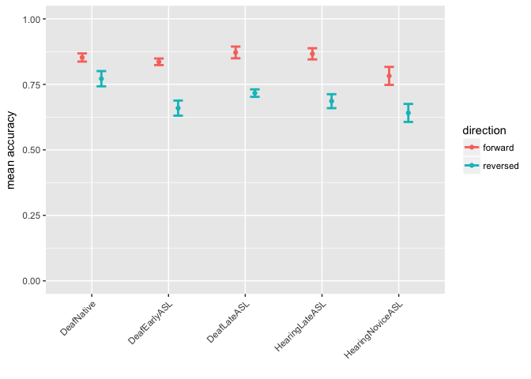
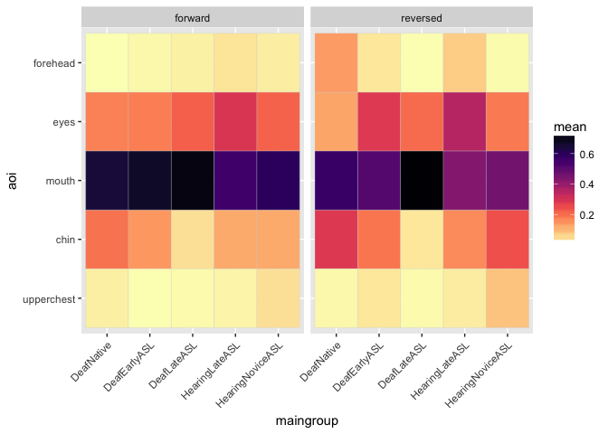
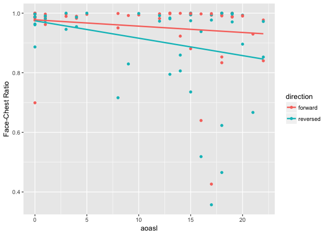

Results Section (study1adults)
================
Adam Stone, PhD
10-06-2017

-   [Refreshing Ourselves](#refreshing-ourselves)
-   [Participant Characteristics](#participant-characteristics)
-   [Lexical Recall Data, Summarized.](#lexical-recall-data-summarized.)
-   [Eye Gaze Data, Summarized.](#eye-gaze-data-summarized.)
-   [Bivariate Correlations](#bivariate-correlations)
    -   [Behavioral Correlations](#behavioral-correlations)
    -   [Forward Correlations](#forward-correlations)
    -   [Reversed Correlations](#reversed-correlations)
    -   [Summary](#summary)
-   [ANOVAs](#anovas)
    -   [All-ANOVA](#all-anova)
    -   [Forward ANOVA](#forward-anova)
    -   [Reversed ANOVA](#reversed-anova)
    -   [Summary of ANOVAs](#summary-of-anovas)
-   [Recovery](#recovery)
-   [Other Notes from Rain](#other-notes-from-rain)
-   [Deaf Hearing Analyses](#deaf-hearing-analyses)

Refreshing Ourselves
====================

> The main goal of the study is to see if comprehension is related to gaze behavior and if AoA impacts gaze behavior.

**Key Questions:** Can gaze behavior reflect whether or not a person can understand the story? When a person has a harder time understanding a difficult story, maybe because they lack the skills, can this be observed in gaze behavior?

> It is more important to show that our behavioral measure IS sensitive to effects of AoA. Period. *The cause is secondary.*

Now let's load in the dataset called `cleanpercentdata.csv`. It contains item-level data showing the percent of looking for each AOI (10 AOIs total) for each story and each participant *still in the study*. All data defined as "bad" (entire participants with poor calibration, or individual stories with too little looking data) have been dropped. We will then move this to subject-level by averaging each participant's two forward stories together and two reversed stories together.

``` r
#library(corrplot)
library(Hmisc)
library(tidyverse)
library(stringr)
library(lme4)
library(lmerTest)
library(prettydoc)
library(broom)
library(knitr)
library(xtable)
library(kableExtra)
library(viridis)
options(knitr.table.format = "html") 

# Import!
data <- read_csv('cleanpercentdata.csv',col_types = 
                   cols(
                     id = col_integer(),
                     participant = col_character(),
                     hearing = col_character(),
                     videogroup = col_character(),
                     aoagroup = col_character(),
                     languagegroup = col_character(),
                     maingroup = col_character(),
                     video = col_character(),
                     story = col_character(),
                     direction = col_character(),
                     age = col_double(),
                     selfrate = col_double(),
                     signyrs = col_double(),
                     aoasl = col_integer(),
                     acc = col_double(),
                     aoi = col_character(),
                     percent = col_double()
                   ))

# And factorize
data <- data %>%
  mutate(participant = as.factor(participant)) %>%
  mutate(id = as.factor(id)) %>%
  mutate(hearing = as.factor(hearing)) %>%
  mutate(videogroup = as.factor(videogroup)) %>%
  mutate(aoagroup = as.factor(aoagroup)) %>%
  mutate(languagegroup = as.factor(languagegroup)) %>%
  mutate(maingroup = as.factor(maingroup)) %>%
  mutate(video = as.factor(video)) %>%
  mutate(story = as.factor(story)) %>%
  mutate(direction = as.factor(direction)) %>%
  mutate(aoi = as.factor(aoi))

dataoriginal <- data # Save item-level data just in case

# Take out HearingNoviceASL
# data <- data %>%
#   filter(maingroup!="HearingNoviceASL")

# Load awesome function to make correlation tables with stars for significance
# From: https://myowelt.blogspot.co.uk/2008/04/beautiful-correlation-tables-in-r.html
corstarsl <- function(x){ 
require(Hmisc) 
x <- as.matrix(x) 
R <- rcorr(x)$r 
p <- rcorr(x)$P 
## define notions for significance levels; spacing is important.
mystars <- ifelse(p < .001, "***", ifelse(p < .01, "** ", ifelse(p < .05, "* ", " ")))
## trunctuate the matrix that holds the correlations to two decimal
R <- format(round(cbind(rep(-1.11, ncol(x)), R), 2))[,-1] 
## build a new matrix that includes the correlations with their apropriate stars 
Rnew <- matrix(paste(R, mystars, sep=""), ncol=ncol(x)) 
diag(Rnew) <- paste(diag(R), " ", sep="") 
rownames(Rnew) <- colnames(x) 
colnames(Rnew) <- paste(colnames(x), "", sep="") 
## remove upper triangle
Rnew <- as.matrix(Rnew)
Rnew[upper.tri(Rnew, diag = TRUE)] <- ""
Rnew <- as.data.frame(Rnew) 
## remove last column and return the matrix (which is now a data frame)
Rnew <- cbind(Rnew[1:length(Rnew)-1])
return(Rnew) 
}

# Pull out subject info, and averge the accuracy scores
data.subjectinfo <- data %>%
  select(-aoi,-percent,-video,-story) %>%
  distinct() %>%
  group_by(participant,direction) %>%
  mutate(acc = mean(acc,na.rm=TRUE)) %>%
  distinct()

# Now collapse eye gaze data to subject-level 
data <- data %>%
  group_by(participant,direction,aoi) %>%
  dplyr::summarize(percent = mean(percent,na.rm=TRUE))
data[data=="NaN"] <- NA

# Join subject info with data that's now subject-level
data <- left_join(data,data.subjectinfo, by=c("participant","direction"))

# Set reference levels
data$maingroup <- relevel(data$maingroup, ref="DeafNative")
# data.face3 <- filter(data2, aoi == "eyes" | aoi == "mouth" | aoi == "chin") %>%
#   mutate(aoi = as.factor(aoi))
# data.face3$aoi <- factor(data.face3$aoi, levels=c("eyes","mouth","chin"))
# data.face3$aoi <- relevel(data.face3$aoi, ref="eyes")

# But now we need to go back and add in a complete lexical recall dataset, even including those trials that got thrown out in 03eyegaze.nb.html. Because the lexical accuracy data is still good. So let's work on that. 
cleanlexdata <- read_csv('cleandata.csv',col_types = 
                   cols(
                     id = col_integer(),
                     participant = col_character(),
                     hearing = col_character(),
                     videogroup = col_character(),
                     aoagroup = col_character(),
                     languagegroup = col_character(),
                     maingroup = col_character(),
                     video = col_character(),
                     story = col_character(),
                     direction = col_character(),
                     age = col_double(),
                     selfrate = col_double(),
                     signyrs = col_double(),
                     aoasl = col_integer(),
                     acc = col_double(),
                     aoi = col_character(),
                     percent = col_double()
                   ))

cleanlexdata <- cleanlexdata %>%
  select(participant,direction,acc) %>%
  group_by(participant,direction) %>%
  dplyr::summarize(acc = mean(acc,na.rm=TRUE)) %>%
  ungroup()

data <- data %>%
  select(-acc) %>%
  left_join(cleanlexdata,by=c("participant","direction")) %>%
  ungroup() %>%
  mutate(direction = as.factor(direction),
         participant = as.factor(participant))
```

Participant Characteristics
===========================

Let's do the basic participant table here.

``` r
groupmeans <- data %>%
  ungroup() %>%
  select(id,participant,maingroup,age,selfrate,signyrs,aoasl) %>%
  distinct() %>%
  group_by(maingroup) %>%
  dplyr::summarize(n = n(),
            age.m = mean(age),
            age.sd = sd(age),
            selfrate.m = mean(selfrate),
            selfrate.sd = sd(selfrate),
            signyrs.m = mean(signyrs),
            signyrs.sd = sd(signyrs),
            aoasl.m = mean(aoasl),
            aoasl.sd = sd(aoasl))
kable(groupmeans, digits=1) %>% kable_styling(bootstrap_options = c("striped", "hover", "condensed"))
```

<table class="table table-striped table-hover table-condensed" style="margin-left: auto; margin-right: auto;">
<thead>
<tr>
<th style="text-align:left;">
maingroup
</th>
<th style="text-align:right;">
n
</th>
<th style="text-align:right;">
age.m
</th>
<th style="text-align:right;">
age.sd
</th>
<th style="text-align:right;">
selfrate.m
</th>
<th style="text-align:right;">
selfrate.sd
</th>
<th style="text-align:right;">
signyrs.m
</th>
<th style="text-align:right;">
signyrs.sd
</th>
<th style="text-align:right;">
aoasl.m
</th>
<th style="text-align:right;">
aoasl.sd
</th>
</tr>
</thead>
<tbody>
<tr>
<td style="text-align:left;">
DeafNative
</td>
<td style="text-align:right;">
11
</td>
<td style="text-align:right;">
32.9
</td>
<td style="text-align:right;">
9.7
</td>
<td style="text-align:right;">
5.0
</td>
<td style="text-align:right;">
0.0
</td>
<td style="text-align:right;">
32.5
</td>
<td style="text-align:right;">
9.8
</td>
<td style="text-align:right;">
0.3
</td>
<td style="text-align:right;">
0.5
</td>
</tr>
<tr>
<td style="text-align:left;">
DeafEarlyASL
</td>
<td style="text-align:right;">
9
</td>
<td style="text-align:right;">
34.8
</td>
<td style="text-align:right;">
6.6
</td>
<td style="text-align:right;">
5.0
</td>
<td style="text-align:right;">
0.0
</td>
<td style="text-align:right;">
29.8
</td>
<td style="text-align:right;">
7.6
</td>
<td style="text-align:right;">
5.0
</td>
<td style="text-align:right;">
2.7
</td>
</tr>
<tr>
<td style="text-align:left;">
DeafLateASL
</td>
<td style="text-align:right;">
8
</td>
<td style="text-align:right;">
38.0
</td>
<td style="text-align:right;">
5.9
</td>
<td style="text-align:right;">
5.0
</td>
<td style="text-align:right;">
0.0
</td>
<td style="text-align:right;">
23.2
</td>
<td style="text-align:right;">
5.3
</td>
<td style="text-align:right;">
14.2
</td>
<td style="text-align:right;">
3.0
</td>
</tr>
<tr>
<td style="text-align:left;">
HearingLateASL
</td>
<td style="text-align:right;">
12
</td>
<td style="text-align:right;">
28.9
</td>
<td style="text-align:right;">
6.2
</td>
<td style="text-align:right;">
4.6
</td>
<td style="text-align:right;">
0.5
</td>
<td style="text-align:right;">
11.8
</td>
<td style="text-align:right;">
4.8
</td>
<td style="text-align:right;">
17.2
</td>
<td style="text-align:right;">
3.4
</td>
</tr>
<tr>
<td style="text-align:left;">
HearingNoviceASL
</td>
<td style="text-align:right;">
11
</td>
<td style="text-align:right;">
20.2
</td>
<td style="text-align:right;">
1.3
</td>
<td style="text-align:right;">
3.0
</td>
<td style="text-align:right;">
0.7
</td>
<td style="text-align:right;">
2.4
</td>
<td style="text-align:right;">
1.0
</td>
<td style="text-align:right;">
17.6
</td>
<td style="text-align:right;">
1.8
</td>
</tr>
</tbody>
</table>
``` r
#groupmeans
```

Lexical Recall Data, Summarized.
================================

Quick summary of lexical recall data here. We have to collapse here as well from subject-level to group-level.

``` r
data.groupacc <- data %>%
  ungroup() %>%
  select(-aoi,-percent) %>%
  distinct() %>%
  group_by(maingroup,direction) %>%
  dplyr::summarize(mean = mean(acc, na.rm=TRUE),
            sd = sd(acc, na.rm=TRUE))
data.acc1 <- data.groupacc %>%
  select(-mean) %>%
  spread(direction,sd) %>%
  rename(forward.sd = forward,
         reversed.sd = reversed)
data.acc2 <- data.groupacc %>%
  select(-sd) %>%
  spread(direction,mean) %>%
  rename(forward.mean = forward,
         reversed.mean = reversed)
groupcount <- select(groupmeans,maingroup,n)
data.groupacc <- left_join(data.acc2,data.acc1, by="maingroup") %>%
  left_join(groupcount, by="maingroup") %>%
  # mutate(forward.se = forward.sd/sqrt(n),
  #        reversed.se = reversed.sd/sqrt(n)) %>%
  #select(maingroup,n,forward.mean,forward.sd,forward.se,reversed.mean,reversed.sd,reversed.se)
  select(maingroup,n,forward.mean,forward.sd,reversed.mean,reversed.sd)
#data.acc
kable(data.groupacc, digits=2) %>% kable_styling(bootstrap_options = c("striped", "hover", "condensed"))
```

<table class="table table-striped table-hover table-condensed" style="margin-left: auto; margin-right: auto;">
<thead>
<tr>
<th style="text-align:left;">
maingroup
</th>
<th style="text-align:right;">
n
</th>
<th style="text-align:right;">
forward.mean
</th>
<th style="text-align:right;">
forward.sd
</th>
<th style="text-align:right;">
reversed.mean
</th>
<th style="text-align:right;">
reversed.sd
</th>
</tr>
</thead>
<tbody>
<tr>
<td style="text-align:left;">
DeafNative
</td>
<td style="text-align:right;">
11
</td>
<td style="text-align:right;">
0.85
</td>
<td style="text-align:right;">
0.05
</td>
<td style="text-align:right;">
0.77
</td>
<td style="text-align:right;">
0.10
</td>
</tr>
<tr>
<td style="text-align:left;">
DeafEarlyASL
</td>
<td style="text-align:right;">
9
</td>
<td style="text-align:right;">
0.84
</td>
<td style="text-align:right;">
0.04
</td>
<td style="text-align:right;">
0.66
</td>
<td style="text-align:right;">
0.09
</td>
</tr>
<tr>
<td style="text-align:left;">
DeafLateASL
</td>
<td style="text-align:right;">
8
</td>
<td style="text-align:right;">
0.87
</td>
<td style="text-align:right;">
0.06
</td>
<td style="text-align:right;">
0.72
</td>
<td style="text-align:right;">
0.04
</td>
</tr>
<tr>
<td style="text-align:left;">
HearingLateASL
</td>
<td style="text-align:right;">
12
</td>
<td style="text-align:right;">
0.87
</td>
<td style="text-align:right;">
0.07
</td>
<td style="text-align:right;">
0.69
</td>
<td style="text-align:right;">
0.09
</td>
</tr>
<tr>
<td style="text-align:left;">
HearingNoviceASL
</td>
<td style="text-align:right;">
11
</td>
<td style="text-align:right;">
0.78
</td>
<td style="text-align:right;">
0.11
</td>
<td style="text-align:right;">
0.64
</td>
<td style="text-align:right;">
0.11
</td>
</tr>
</tbody>
</table>
And a boxplot that can go with it.

``` r
ggplot(data,aes(maingroup,acc,fill=direction)) + 
  geom_boxplot() +
  scale_y_continuous(limits=c(0,1)) +
  theme(axis.text.x=element_text(angle=45,hjust=1))
```

 And Rain wanted the error plot so here it is. Lines represent SEM. Good to have this too!

``` r
data.acc1 <- data.acc1 %>% 
  ungroup() %>% 
  gather(direction,sd,forward.sd:reversed.sd) %>%
  mutate(direction = str_sub(direction,1,-4))
data.acc2 <- data.acc2 %>% 
  ungroup() %>% 
  gather(direction,mean,forward.mean:reversed.mean) %>%
  mutate(direction = str_sub(direction,1,-6))
data.acc.se <- left_join(data.acc1,data.acc2, by=c("maingroup","direction")) %>%
  left_join(groupcount, by="maingroup") %>%
  mutate(se = sd/sqrt(n))
ggplot(data.acc.se,aes(maingroup,mean,color=direction)) +
  geom_point(position=position_dodge(0.5)) +
  geom_errorbar(aes(ymin=mean-se,ymax=mean+se),width=0.25,size=1,position=position_dodge(0.5)) +
  scale_y_continuous(limits=c(0,1)) +
  theme(axis.text.x=element_text(angle=45,hjust=1)) + xlab("") + ylab("mean accuracy")
```



Eye Gaze Data, Summarized.
==========================

I guess we should have a big table of means and SDs for all AOIs for each group for forward and backward. I'll write the code for this later. For now, here's the boxplot. This is the part where we will say, from all the data we have concluded that we can work with **three base AOIs** from here on due to sufficient data: chin, eyes, and mouth.

``` r
data.aoionly <- data %>%
  filter(aoi != "facechest" & aoi != "mouthchin" & aoi != "moutheyes")
ggplot(data.aoionly,aes(aoi,percent,fill=direction)) + 
  geom_boxplot() +
  scale_y_continuous(limits=c(0,1)) +
  theme(axis.text.x=element_text(angle=45,hjust=1))
```

    ## Warning: Removed 338 rows containing non-finite values (stat_boxplot).


THEN we can show heat maps too. For this I would include forehead and upperchest just to give it some dimension.

``` r
data.five <- data %>%
  ungroup() %>%
  filter(aoi == "upperchest" | aoi == "chin" | aoi == "mouth" | aoi == "eyes" | aoi == "forehead") %>%
  group_by(maingroup,aoi,direction) %>%
  dplyr::summarize(mean = mean(percent, na.rm=TRUE)) %>%
  ungroup() %>%
  mutate(aoi = factor(aoi,levels=c("upperchest","chin","mouth","eyes","forehead")))

# data.five <- data %>%
#   ungroup() %>%
#   filter(aoi == "upperchest" | aoi == "chin" | aoi == "mouth" | aoi == "eyes" | aoi == "forehead" | aoi == "upperchest" | aoi == "midchest" | aoi == "lowerchest" | aoi == "belly") %>%
#   group_by(maingroup,aoi,direction) %>%
#   dplyr::summarize(mean = mean(percent, na.rm=TRUE)) %>%
#   ungroup() %>% 
#   mutate(aoi = factor(aoi,levels=c("belly","lowerchest","midchest","upperchest","chin","mouth","eyes","forehead")))

# data.five <- data %>%
#   ungroup() %>%
#   filter(aoi == "torso" | aoi == "face") %>%
#   group_by(maingroup,aoi,direction) %>%
#   dplyr::summarize(mean = mean(percent, na.rm=TRUE)) %>%
#   ungroup()

ggplot(data.five, aes(x = maingroup, y = aoi)) +
  geom_tile(aes(fill=mean),color="lightgray",na.rm=TRUE) + 
#  scale_fill_gradient(low = "lightblue",high = "steelblue") +
#  scale_fill_distiller(type="div", palette = "RdYlBu") +
  scale_fill_viridis(option = "magma", direction=-1) +
  facet_wrap("direction") +
  theme(axis.text.x=element_text(angle=45,hjust=1))
```



Also of interest is how the FaceChest Index changes. And it shows us there's definitely more of a pull to the Chest during reversed stories.

``` r
data.indexonly <- data %>%
  filter(aoi == "facechest")
ggplot(data.indexonly,aes(aoi,percent,fill=direction)) + 
  geom_boxplot() +
  scale_y_continuous(limits=c(-1,1)) +
  theme(axis.text.x=element_text(angle=45,hjust=1))
```


Bivariate Correlations
======================

We temporarily drop groups here. We just want to ask: *"What is correlated in terms of subject characteristics and their behavioral measures?"* We'll do this separately for forward and reversed, and using only important AOIs. We can also ask additional questions like, *which is stronger - signing years or AOA? is lexical recall correlated with looking at any AOI?*

Behavioral Correlations
-----------------------

First, we'll look at correlations between participant characteristics, including AoASL, and their performance on the lexical recall task.

-   Forward accuracy is correlated with all characteristics BUT AoASL or Signing Years. So your self-rating or age predict forward accuracy, but age of acquisition or signing years doesn't.
-   Reversed accuracy *is correlated with AoASL* and signing years and self-rating. Now, self-rating is really subjective so let's not use that. Your age doesn't predict reversed accuracy. AoASL does!
-   Reversal effect is not correlated with anything.

`*` p &lt; 0.05 `**` p &lt; 0.01 `***` p &lt; 0.001

``` r
# We're going to need to make another data frame with participant-level accuracy information, this time including a reversal effect which we've calculated for each participant. 
data.subjectinfo <- data.subjectinfo %>%
  ungroup() %>%
  select(-direction,-acc)
data.acc <- data %>%
  ungroup() %>%
  select(-aoi,-percent) %>%
  distinct() %>%
  group_by(participant,direction) %>%
  dplyr::summarize(mean = mean(acc, na.rm=TRUE)) %>%
  spread(direction,mean) %>%
  mutate(effect = forward - reversed) %>%
  rename(acc.forward = forward,
         acc.reversed = reversed,
         acc.effect = effect) %>%
  left_join(data.subjectinfo, by="participant") %>%
  ungroup() %>% 
  distinct() %>%
  select(aoasl,signyrs,selfrate,age,acc.forward,acc.reversed,acc.effect)

#data.acc.results <- rcorr(as.matrix(data.acc))
corstarsl(data.acc) # Use the awesome function!
```

    ##                 aoasl  signyrs selfrate      age acc.forward acc.reversed
    ## aoasl                                                                    
    ## signyrs      -0.78***                                                    
    ## selfrate     -0.50***  0.71***                                           
    ## age           -0.31*   0.83***  0.63***                                  
    ## acc.forward    -0.07    0.29*   0.45***  0.36**                          
    ## acc.reversed  -0.31*    0.29*   0.39**     0.17      0.38**              
    ## acc.effect      0.25    -0.06    -0.03     0.12      0.41**      -0.69***

``` r
# Gather the AOIs we want
data.allaoi <- data # save current dataset
data <- data %>%
 filter(aoi == "eyes" | aoi == "mouth" | aoi == "chin" | aoi == "face" | aoi == "chest" | aoi == "facechest")

# Need to put AOIs in their own columns
data.spread <- data %>%
  spread(aoi,percent) %>%
  ungroup()

# Fwd and Rev data
data.fw <- data.spread %>%
  filter(direction == "forward") %>%
  select(acc,aoasl,signyrs,selfrate,age,eyes,mouth,chin,face,chest,facechest)

data.rv <- data.spread %>%
  filter(direction == "reversed") %>%
  select(acc,aoasl,signyrs,selfrate,age,eyes,mouth,chin,face,chest,facechest)

# Correlations
# data.fw.corr <- cor(data.fw, use="pairwise.complete.obs")
# data.rv.corr <- cor(data.rv, use="pairwise.complete.obs")
# corrplot.mixed(data.rv.corr, lower ="number", upper = "circle")
```

Forward Correlations
--------------------

Here's the Pearson's correlation matrix for forward stories.

-   No eye behavior metric predicts accuracy on forward stories.
-   AoASL or Signing Years do not predict accuracy.
-   Self-rating is medium-correlated with amount of time looking at the face, and a higher face/chest ratio
-   Same for age.

So. For forward stories it's a crapshoot.

``` r
#rcorr(as.matrix(data.fw))
corstarsl(data.fw)
```

    ##                acc    aoasl  signyrs selfrate      age     eyes    mouth
    ## acc                                                                     
    ## aoasl       -0.07                                                       
    ## signyrs     0.29*  -0.78***                                             
    ## selfrate   0.45*** -0.50***  0.71***                                    
    ## age        0.36**   -0.31*   0.83***  0.63***                           
    ## eyes        -0.19     0.11    -0.12    -0.12    -0.08                   
    ## mouth        0.19    -0.08     0.23     0.13     0.26  -0.65***         
    ## chin         0.02    -0.15    -0.03     0.10    -0.15  -0.38**  -0.41** 
    ## face         0.11    -0.23   0.38**    0.31*   0.37**    -0.13   0.47***
    ## chest       -0.05     0.15   -0.31*   -0.30*   -0.34*    -0.11   -0.29* 
    ## facechest    0.05    -0.15    0.31*    0.30*    0.34*     0.11    0.29* 
    ##              chin     face    chest
    ## acc                                
    ## aoasl                              
    ## signyrs                            
    ## selfrate                           
    ## age                                
    ## eyes                               
    ## mouth                              
    ## chin                               
    ## face       -0.19                   
    ## chest      0.28*  -0.92***         
    ## facechest -0.28*   0.93*** -1.00***

Reversed Correlations
---------------------

Here's the Pearson's correlation matrix for reversed stories.

-   Again, no eye behavior metric predicts accuracy on reversed stories.
-   Unlike forward stories, we see an effect of AoASL on looking at the face, chest, and FaceChest ratio. Those who acquired ASL later are more likely to look at the chest more and less at the face. Nice! Sign Years too at this.
-   As before, signyears continues to be a strong correlator with looking behavior, and so does age.
-   Same for age.

So.

``` r
#rcorr(as.matrix(data.rv))
corstarsl(data.rv)
```

    ##                acc    aoasl  signyrs selfrate      age     eyes    mouth
    ## acc                                                                     
    ## aoasl      -0.31*                                                       
    ## signyrs     0.29*  -0.78***                                             
    ## selfrate   0.39**  -0.50***  0.71***                                    
    ## age          0.17   -0.30*   0.83***  0.62***                           
    ## eyes        -0.14     0.07     0.00     0.04     0.08                   
    ## mouth        0.16    -0.10     0.27     0.14    0.29*  -0.64***         
    ## chin         0.02    -0.06    -0.15    -0.08    -0.28  -0.46**  -0.43** 
    ## face         0.26    -0.24   0.38**     0.28    0.36*    -0.17   0.60***
    ## chest       -0.20    0.29*  -0.44**  -0.40**  -0.41**    -0.14  -0.38** 
    ## facechest    0.22   -0.30*   0.44**   0.39**   0.40**     0.13   0.39** 
    ##             chin     face    chest
    ## acc                               
    ## aoasl                             
    ## signyrs                           
    ## selfrate                          
    ## age                               
    ## eyes                              
    ## mouth                             
    ## chin                              
    ## face      -0.12                   
    ## chest      0.28  -0.79***         
    ## facechest -0.26   0.82*** -1.00***

Summary
-------

What have we learned from the bivariate correlations? AoA is correlated with accuracy on the reversed tasks, showing that our manipulation **is** sensitive to effects of AoASL. Specifically, AoASL was correlated with accuracy such that people who acquired ASL later tended to do worse on lexical recall for reversed stories. There was no such relationship found for lexical recall for forward stories.

For no AOI was looking behavior was correlated with accuracy, for either forward or reversed stories. However, AoASL was correlated with looking behavior *only* for reversed stories. Late ASL learners, when confronted with reversed stories, looked more at the chest and less at the face (a more scattered pattern).

Years of signing appeared to have an influence on the amount of time spent looking at the face area, both by itself and in contrast with the chest. People with more signing-years spend more time on the face and less on the chest. *(We can run a quick linear regression on it...it is very significant)*

``` r
ggplot(filter(data,aoi=="facechest"),aes(x=aoasl,y=percent,color=direction)) + 
  geom_point() + 
  geom_smooth(method="lm",se=FALSE) +
  ylab("Face-Chest Ratio")
```



ANOVAs
======

Now we're going to do ANOVAs. We'll do an all-factors ANOVA including Direction, then also do separate Forward and Reversed ANOVAs.

> We do this separately for lexical recall and gaze data. But be prepared to compare the two sets of results side by side, in a summary like say “subject groups differed significantly for lexical recall (stat values) but not gaze data (stat values)” or whatever the result is. At least this can be done in the discussion, if not in the results section.

I like the idea of treating Native Deaf as baseline or the gold standard in comparisons.

All-ANOVA
---------

Factors: Maingroup & Direction. First ANOVA summary is with Accuracy as outcome, second ANOVA summary is FaceChest Ratio.

-   For accuracy, there are main effects of group (p = 0.01) and direction (p &lt; 0.001), and no interactions (p = 0.42).
    -   Posthocs for maingroup tell us that DeafNative and HearingNovice are significantly different (p = 0.005) but no other group-pairs are.
-   For facechest ratio, there is a main effect of group (p = 0.001), no main effect of direction (p = 0.14), and no interactions (p = 0.61).
    -   Posthocs for maingroup tell us that the main effect was driven by HearingNovice being significantly different from DeafNative (p &lt; 0.01), DeafEarly (p = 0.01), DeafLate (p = 0.01), and HearingLate (p = 0.02). No other pairs were significant. *recheck p-values*

``` r
data.aov.all <- data %>% filter(aoi=="facechest")

# Lex Recall ANOVA. Outcome: Acc. Factors: MainGroup, Direction
aov.lex.all <- aov(data=data.aov.all, acc ~ maingroup * direction)
aov.lex.all.tidy <- tidy(aov.lex.all)

# Gaze Behavior ANOVA. Outcome: FaceChest. Factors: MainGroup, Direction
aov.gaze.all <- aov(data=data.aov.all, percent ~ maingroup * direction)
aov.gaze.all.tidy <- tidy(aov.gaze.all)

# Prettify
aov.lex.all.tidy <- aov.lex.all.tidy %>%
  select(term,statistic,p.value) %>%
  mutate(statistic = round(statistic,3),
         p.value = round(p.value,3)) %>%
  rename(F.acc = statistic,
         P.acc = p.value)

aov.gaze.all.tidy <- aov.gaze.all.tidy %>%
  select(term,statistic,p.value) %>%
  mutate(statistic = round(statistic,3),
         p.value = round(p.value,3)) %>%
  rename(F.facechest = statistic,
         P.facechest = p.value)

left_join(aov.lex.all.tidy,aov.gaze.all.tidy,by="term") %>%
  print()
```

    ##                  term  F.acc P.acc F.facechest P.facechest
    ## 1           maingroup  4.194 0.004       5.523       0.001
    ## 2           direction 74.458 0.000       3.358       0.070
    ## 3 maingroup:direction  1.205 0.314       0.801       0.528
    ## 4           Residuals     NA    NA          NA          NA

``` r
#TukeyHSD(aov.lex.all,'maingroup',conf.level = 0.95) 
#TukeyHSD(aov.gaze.all,'maingroup',conf.level = 0.95) 
```

Forward ANOVA
-------------

There is no main effect of group on accuracy (p = 0.16) or facechest ratio (p = 0.17) for forward stories.

``` r
data.aov.fw <- data %>% filter(aoi=="facechest" & direction=="forward")

# Lex Recall ANOVA. Outcome: Acc. Factors: MainGroup, Direction
aov.lex.fw <- aov(data=data.aov.fw, acc ~ maingroup)
aov.lex.fw.tidy <- tidy(aov.lex.fw)

# Gaze Behavior ANOVA. Outcome: FaceChest. Factors: MainGroup, Direction
aov.gaze.fw <- aov(data=data.aov.fw, percent ~ maingroup)
aov.gaze.fw.tidy <- tidy(aov.gaze.fw)

# Prettify
aov.lex.fw.tidy <- aov.lex.fw.tidy %>%
  select(term,statistic,p.value) %>%
  mutate(statistic = round(statistic,3),
         p.value = round(p.value,3)) %>%
  rename(F.acc = statistic,
         P.acc = p.value)

aov.gaze.fw.tidy <- aov.gaze.fw.tidy %>%
  select(term,statistic,p.value) %>%
  mutate(statistic = round(statistic,3),
         p.value = round(p.value,3)) %>%
  rename(F.facechest = statistic,
         P.facechest = p.value)

left_join(aov.lex.fw.tidy,aov.gaze.fw.tidy,by="term") %>%
  print()
```

    ##        term F.acc P.acc F.facechest P.facechest
    ## 1 maingroup   2.4 0.064       2.009       0.109
    ## 2 Residuals    NA    NA          NA          NA

``` r
#TukeyHSD(aov.lex.fw,'maingroup',conf.level = 0.95) 
#TukeyHSD(aov.gaze.fw,'maingroup',conf.level = 0.95) 
```

Reversed ANOVA
--------------

There are main effects of group on accuracy (p = 0.04) and on facechest ratio (p = 0.01). Posthocs tell us the effect is driven by a significant difference between DeafNative and HearingNovice (p = 0.01).

``` r
data.aov.rv <- data %>% filter(aoi=="facechest" & direction=="reversed")

# Lex Recall ANOVA. Outcome: Acc. Factors: MainGroup, Direction
aov.lex.rv <- aov(data=data.aov.rv, acc ~ maingroup)
aov.lex.rv.tidy <- tidy(aov.lex.rv)

# Gaze Behavior ANOVA. Outcome: FaceChest. Factors: MainGroup, Direction
aov.gaze.rv <- aov(data=data.aov.rv, percent ~ maingroup)
aov.gaze.rv.tidy <- tidy(aov.gaze.rv)

# Prettify
aov.lex.rv.tidy <- aov.lex.rv.tidy %>%
  select(term,statistic,p.value) %>%
  mutate(statistic = round(statistic,3),
         p.value = round(p.value,3)) %>%
  rename(F.acc = statistic,
         P.acc = p.value)

aov.gaze.rv.tidy <- aov.gaze.rv.tidy %>%
  select(term,statistic,p.value) %>%
  mutate(statistic = round(statistic,3),
         p.value = round(p.value,3)) %>%
  rename(F.facechest = statistic,
         P.facechest = p.value)

left_join(aov.lex.rv.tidy,aov.gaze.rv.tidy,by="term") %>%
  print()
```

    ##        term F.acc P.acc F.facechest P.facechest
    ## 1 maingroup 2.949  0.03       3.759        0.01
    ## 2 Residuals    NA    NA          NA          NA

``` r
#TukeyHSD(aov.lex.rv,'maingroup',conf.level = 0.95) 
#TukeyHSD(aov.gaze.rv,'maingroup',conf.level = 0.95) 
```

Summary of ANOVAs
-----------------

What have the ANOVAs told us? Let's make a table here, and graphs below. We are able to find significant effects of group on both accuracy and face-chest ratio in the all-ANOVA, as well as the reversed ANOVA. However, most of our significant effects of group are driven by HearingNovice doing poorly on accuracy and looking at the hands/chest more. So...the ANOVA story is that, really, Hearing Novices don't really know ASL well, and that's why they're doing poorly. There is no *strong* AoASL story there, it's more of a L2 language learning thing?.

``` r
aov.summary <- tribble(~ANOVA, ~Accuracy, ~FaceChestRatio,
        "All-MainGroup","Sig.","Sig.",
        "All-Direction","Sig.","ns",
        "All-Interactions","ns","ns",
        "Forward-MainGroup","ns","ns",
        "Reversed-MainGroup","Sig.","Sig.")
aov.summary
```

    ## # A tibble: 5 x 3
    ##                ANOVA Accuracy FaceChestRatio
    ##                <chr>    <chr>          <chr>
    ## 1      All-MainGroup     Sig.           Sig.
    ## 2      All-Direction     Sig.             ns
    ## 3   All-Interactions       ns             ns
    ## 4  Forward-MainGroup       ns             ns
    ## 5 Reversed-MainGroup     Sig.           Sig.

``` r
data.aov.chart <- data.aov.all %>%
  select(participant,maingroup,direction,acc,percent) %>%
  rename(facechest = percent) %>%
  gather(metric,value,acc:facechest)

ggplot(data.aov.chart,aes(x=maingroup,y=value,fill=direction)) +
  geom_boxplot() + facet_wrap("metric") +
  theme(axis.text.x=element_text(angle=45,hjust=1))
```


Recovery
========

Throwing this in, will move it into a better place for now but it's great! It supports AoASL effects on the video manipulation. Because look at the medians of each boxplot.

``` r
accdiff <- dataoriginal %>%
  select(participant,maingroup,video,acc) %>%
  distinct() %>%
  spread(video,acc) %>%
  mutate(fw = fw3-fw1,
         rv = rv4-rv2) %>%
  select(participant,maingroup,fw,rv) %>%
  gather(direction,diff,fw:rv)

accdiff$maingroup = factor(accdiff$maingroup,levels=c("DeafNative","DeafEarlyASL","DeafLateASL","HearingLateASL","HearingNoviceASL"))

ggplot(accdiff,aes(x=maingroup,y=diff,fill=direction)) + geom_boxplot() + ylab("diff: 2nd rv story - 1st rv story")
```

    ## Warning: Removed 18 rows containing non-finite values (stat_boxplot).


Other Notes from Rain
=====================

It would be nice to include all lexical data in an ANOVA just to confirm that reversal DOES have an effect on comprehension (it does) and confirm that AoA also has an effect on comprehension, which is to be expected, right? This just backs up what every one else has found – that the later you learn the worse you do.

So maybe think of it as first confirming that we KNOW lexical recall is impacted. That is confirmed with ANOVA. Get that out of the way.

Then, with that confirmed….. then (and only then) we are in a position to ask:\* What is the relationship between a) the range of intelligibility scores (accuracy) and gaze…. and b) between AoA and gaze. And you can even load all these factors in together to find the unique variance. \* We know who performs well and who performs poorly…. do their gaze behaviors differ?

1.  If you do LLM or ANCOVA, do so with AoA, and without subject group or hearing status. I would set aside any stats you did with both Hearing Status and AoA, I don't think you can do that.

How come lexical recall isn’t a predictor in a model with gaze data? Yes, that is an important goal of the paper.

Here is an example of what I had noted to myself previously, which is not current any more, and I would put correlation values in here:

-   Remarkably, percent-looking at mid chest and lower chest, for both forward and reversed (and left side for reversed) are highly negatively correlated with years signing and positively correlated with AoA. That means that greater looking in those areas are associated with older ages of acquisition and fewer years of experience. What is equally interesting is that looking at the eyes was not related to subject characteristics at all (contrast with Emmorey’s finding).
-   Also, looking at the mouth for reversed stimuli was significantly correlated with years signing (r = 0.38), this means the longer one signed, the more (in terms of % looking) one looked at the mouth.

Then, maybe we can have a section called “Hearing Status” and in this paragraph say what happens when we compare hearing and deaf, using the same range of AoA, excluding hearing Novice. Or maybe separate regressions for hearing and deaf groups, looking at AoA, AOI’s, and lexical recall, to examine the relationship between the three. I don't know.

Do you find that NATIVE signers pretty much look at the same place for forward and reversed but that the novice signers show greater dispersion of gaze points for reversed than forward (like more on the chest, by way of lower face looking percent)? Because I always thought that experts are already using their efficient gaze pattern, nothing throws this off…. But novice are easily “thrown off”, gaze-wise. They have very little tolerance of phonetic variation. So they might get really good at understanding their own ASL teacher, and then give them a new variant of a signer, they start to look at the signers’ hands maybe. The same thing happens for the reversed stories, maybe.

``` r
# Me trying to run models for eye behavior -> lexical accuracy
datafc <- dataoriginal
model <- lmer(acc ~ percent * signyrs + (1|id) + (1|story), data = filter(datafc,aoi=="mouth" & direction=="forward"))
summary(model)
```

    ## Linear mixed model fit by REML t-tests use Satterthwaite approximations
    ##   to degrees of freedom [lmerMod]
    ## Formula: acc ~ percent * signyrs + (1 | id) + (1 | story)
    ##    Data: filter(datafc, aoi == "mouth" & direction == "forward")
    ## 
    ## REML criterion at convergence: -167.4
    ## 
    ## Scaled residuals: 
    ##      Min       1Q   Median       3Q      Max 
    ## -1.66734 -0.54815  0.01603  0.56072  1.55159 
    ## 
    ## Random effects:
    ##  Groups   Name        Variance Std.Dev.
    ##  id       (Intercept) 0.004614 0.06792 
    ##  story    (Intercept) 0.001302 0.03609 
    ##  Residual             0.003475 0.05895 
    ## Number of obs: 94, groups:  id, 51; story, 4
    ## 
    ## Fixed effects:
    ##                  Estimate Std. Error        df t value Pr(>|t|)    
    ## (Intercept)      0.870054   0.047191 53.600000  18.437   <2e-16 ***
    ## percent         -0.112785   0.064080 87.370000  -1.760   0.0819 .  
    ## signyrs         -0.002162   0.002236 88.350000  -0.967   0.3362    
    ## percent:signyrs  0.006244   0.003058 84.560000   2.042   0.0443 *  
    ## ---
    ## Signif. codes:  0 '***' 0.001 '**' 0.01 '*' 0.05 '.' 0.1 ' ' 1
    ## 
    ## Correlation of Fixed Effects:
    ##             (Intr) percnt sgnyrs
    ## percent     -0.818              
    ## signyrs     -0.745  0.702       
    ## prcnt:sgnyr  0.699 -0.815 -0.918

``` r
model <- lmer(percent ~ direction + (1|id), data = filter(datafc,aoi=="mouth"))
summary(model) 
```

    ## Linear mixed model fit by REML t-tests use Satterthwaite approximations
    ##   to degrees of freedom [lmerMod]
    ## Formula: percent ~ direction + (1 | id)
    ##    Data: filter(datafc, aoi == "mouth")
    ## 
    ## REML criterion at convergence: -14.9
    ## 
    ## Scaled residuals: 
    ##      Min       1Q   Median       3Q      Max 
    ## -2.67237 -0.45071  0.07741  0.61139  2.39776 
    ## 
    ## Random effects:
    ##  Groups   Name        Variance Std.Dev.
    ##  id       (Intercept) 0.04848  0.2202  
    ##  Residual             0.03096  0.1760  
    ## Number of obs: 189, groups:  id, 51
    ## 
    ## Fixed effects:
    ##                    Estimate Std. Error        df t value Pr(>|t|)    
    ## (Intercept)         0.63786    0.03576  64.75000  17.836  < 2e-16 ***
    ## directionreversed  -0.09058    0.02580 138.25000  -3.511 0.000603 ***
    ## ---
    ## Signif. codes:  0 '***' 0.001 '**' 0.01 '*' 0.05 '.' 0.1 ' ' 1
    ## 
    ## Correlation of Fixed Effects:
    ##             (Intr)
    ## dirctnrvrsd -0.352

``` r
# plot(model)
# library(ggfortify)
# autoplot(model2)
# autoplot(model2,which=1:6,data = datafc,colour='direction',label.size=3)
```

Deaf Hearing Analyses
=====================

Let's try running models with deaf/hearing. First, a scatterplot...

``` r
data.acc <- dataoriginal %>% filter(aoi=="facechest") 
ggplot(data.acc, aes(x=signyrs,y=acc,color=direction)) + geom_jitter() + geom_smooth(method="lm") + facet_grid(.~hearing)
```

    ## Warning: Removed 4 rows containing non-finite values (stat_smooth).

    ## Warning: Removed 4 rows containing missing values (geom_point).


So the slopes don't change for direction, but the seem to change for deaf/hearing. In other words, signyears doesn't have a big effect for deaf, but it does for hearing.

``` r
model <- lmer(acc ~ hearing * direction * signyrs + (1|id) + (1|story), data = data.acc)
summary(model)
```

    ## Linear mixed model fit by REML t-tests use Satterthwaite approximations
    ##   to degrees of freedom [lmerMod]
    ## Formula: acc ~ hearing * direction * signyrs + (1 | id) + (1 | story)
    ##    Data: data.acc
    ## 
    ## REML criterion at convergence: -248.6
    ## 
    ## Scaled residuals: 
    ##      Min       1Q   Median       3Q      Max 
    ## -2.04733 -0.60227 -0.01045  0.52495  2.40592 
    ## 
    ## Random effects:
    ##  Groups   Name        Variance Std.Dev.
    ##  id       (Intercept) 0.002858 0.05346 
    ##  story    (Intercept) 0.001473 0.03838 
    ##  Residual             0.008685 0.09319 
    ## Number of obs: 185, groups:  id, 51; story, 4
    ## 
    ## Fixed effects:
    ##                                            Estimate Std. Error         df
    ## (Intercept)                               7.930e-01  6.248e-02  7.951e+01
    ## hearingHearing                           -9.419e-03  6.608e-02  9.335e+01
    ## directionreversed                        -7.002e-02  6.654e-02  1.293e+02
    ## signyrs                                   2.014e-03  1.974e-03  9.515e+01
    ## hearingHearing:directionreversed         -7.788e-02  7.386e-02  1.294e+02
    ## hearingHearing:signyrs                    3.443e-03  3.755e-03  9.512e+01
    ## directionreversed:signyrs                -2.221e-03  2.207e-03  1.290e+02
    ## hearingHearing:directionreversed:signyrs  5.103e-04  4.140e-03  1.306e+02
    ##                                          t value Pr(>|t|)    
    ## (Intercept)                               12.692   <2e-16 ***
    ## hearingHearing                            -0.143    0.887    
    ## directionreversed                         -1.052    0.295    
    ## signyrs                                    1.020    0.310    
    ## hearingHearing:directionreversed          -1.055    0.294    
    ## hearingHearing:signyrs                     0.917    0.361    
    ## directionreversed:signyrs                 -1.006    0.316    
    ## hearingHearing:directionreversed:signyrs   0.123    0.902    
    ## ---
    ## Signif. codes:  0 '***' 0.001 '**' 0.01 '*' 0.05 '.' 0.1 ' ' 1
    ## 
    ## Correlation of Fixed Effects:
    ##             (Intr) hrngHr drctnr sgnyrs hrngHrng:d hrngHrng:s drctn:
    ## hearingHrng -0.856                                                  
    ## dirctnrvrsd -0.531  0.502                                           
    ## signyrs     -0.913  0.864  0.535                                    
    ## hrngHrng:dr  0.478 -0.557 -0.901 -0.483                             
    ## hrngHrng:sg  0.480 -0.743 -0.281 -0.526  0.416                      
    ## drctnrvrsd:  0.510 -0.483 -0.957 -0.559  0.864      0.295           
    ## hrngHrng:d: -0.272  0.422  0.510  0.299 -0.747     -0.575     -0.535

Eh, no effect here. How about eye gaze...

``` r
data.fc <- dataoriginal %>% filter(aoi=="facechest") 
ggplot(data.fc, aes(x=signyrs,y=percent,color=direction)) + geom_jitter() + geom_smooth(method="lm") + facet_grid(.~hearing) + ylab("FaceChest Ratio")
```


``` r
data.mouth <- dataoriginal %>% filter(aoi=="mouth") 
ggplot(data.mouth, aes(x=signyrs,y=percent,color=direction)) + geom_jitter() + geom_smooth(method="lm") + facet_grid(.~hearing) + ylab("Mouth AOI Percent")
```


``` r
data.eyes <- dataoriginal %>% filter(aoi=="eyes") 
ggplot(data.eyes, aes(x=signyrs,y=percent,color=direction)) + geom_jitter() + geom_smooth(method="lm") + facet_grid(.~hearing) + ylab("Eyes AOI Percent")
```

    ## Warning: Removed 17 rows containing non-finite values (stat_smooth).

    ## Warning: Removed 17 rows containing missing values (geom_point).


Looks like we've got different reversal effects for FaceChest Ratio, Mouth AOI, and Eyes AOI...not terribly strong, though. Let's run models.

``` r
model <- lmer(percent ~ hearing * direction * signyrs + (1|id) + (1|story), data = data.fc)
summary(model)
```

    ## Linear mixed model fit by REML t-tests use Satterthwaite approximations
    ##   to degrees of freedom [lmerMod]
    ## Formula: percent ~ hearing * direction * signyrs + (1 | id) + (1 | story)
    ##    Data: data.fc
    ## 
    ## REML criterion at convergence: -212
    ## 
    ## Scaled residuals: 
    ##     Min      1Q  Median      3Q     Max 
    ## -4.8494 -0.1080  0.0599  0.3248  1.7385 
    ## 
    ## Random effects:
    ##  Groups   Name        Variance  Std.Dev.
    ##  id       (Intercept) 0.0101497 0.10075 
    ##  story    (Intercept) 0.0002464 0.01570 
    ##  Residual             0.0090914 0.09535 
    ## Number of obs: 189, groups:  id, 51; story, 4
    ## 
    ## Fixed effects:
    ##                                            Estimate Std. Error         df
    ## (Intercept)                                0.945317   0.082384  66.730000
    ## hearingHearing                            -0.068765   0.091686  65.830000
    ## directionreversed                         -0.044191   0.065293 132.890000
    ## signyrs                                    0.001083   0.002727  66.700000
    ## hearingHearing:directionreversed          -0.069729   0.073098 133.940000
    ## hearingHearing:signyrs                     0.005594   0.005245  68.740000
    ## directionreversed:signyrs                  0.001034   0.002181 133.180000
    ## hearingHearing:directionreversed:signyrs   0.003706   0.004197 134.720000
    ##                                          t value Pr(>|t|)    
    ## (Intercept)                               11.475   <2e-16 ***
    ## hearingHearing                            -0.750    0.456    
    ## directionreversed                         -0.677    0.500    
    ## signyrs                                    0.397    0.692    
    ## hearingHearing:directionreversed          -0.954    0.342    
    ## hearingHearing:signyrs                     1.067    0.290    
    ## directionreversed:signyrs                  0.474    0.636    
    ## hearingHearing:directionreversed:signyrs   0.883    0.379    
    ## ---
    ## Signif. codes:  0 '***' 0.001 '**' 0.01 '*' 0.05 '.' 0.1 ' ' 1
    ## 
    ## Correlation of Fixed Effects:
    ##             (Intr) hrngHr drctnr sgnyrs hrngHrng:d hrngHrng:s drctn:
    ## hearingHrng -0.891                                                  
    ## dirctnrvrsd -0.395  0.355                                           
    ## signyrs     -0.955  0.858  0.382                                    
    ## hrngHrng:dr  0.353 -0.397 -0.895 -0.342                             
    ## hrngHrng:sg  0.497 -0.745 -0.199 -0.521  0.301                      
    ## drctnrvrsd:  0.379 -0.341 -0.955 -0.400  0.856      0.209           
    ## hrngHrng:d: -0.198  0.300  0.498  0.209 -0.743     -0.419     -0.522

``` r
model <- lmer(percent ~ hearing * direction * signyrs + (1|id) + (1|story), data = data.mouth)
summary(model)
```

    ## Linear mixed model fit by REML t-tests use Satterthwaite approximations
    ##   to degrees of freedom [lmerMod]
    ## Formula: percent ~ hearing * direction * signyrs + (1 | id) + (1 | story)
    ##    Data: data.mouth
    ## 
    ## REML criterion at convergence: 6
    ## 
    ## Scaled residuals: 
    ##     Min      1Q  Median      3Q     Max 
    ## -2.7936 -0.5085  0.1167  0.6300  2.0897 
    ## 
    ## Random effects:
    ##  Groups   Name        Variance Std.Dev.
    ##  id       (Intercept) 0.046762 0.21624 
    ##  story    (Intercept) 0.003873 0.06223 
    ##  Residual             0.027039 0.16444 
    ## Number of obs: 189, groups:  id, 51; story, 4
    ## 
    ## Fixed effects:
    ##                                            Estimate Std. Error         df
    ## (Intercept)                               5.948e-01  1.687e-01  6.038e+01
    ## hearingHearing                           -2.002e-02  1.854e-01  5.810e+01
    ## directionreversed                         5.647e-03  1.126e-01  1.307e+02
    ## signyrs                                   3.108e-03  5.510e-03  5.870e+01
    ## hearingHearing:directionreversed         -1.679e-01  1.263e-01  1.310e+02
    ## hearingHearing:signyrs                   -4.888e-04  1.057e-02  6.014e+01
    ## directionreversed:signyrs                -2.089e-03  3.764e-03  1.308e+02
    ## hearingHearing:directionreversed:signyrs  2.740e-03  7.257e-03  1.315e+02
    ##                                          t value Pr(>|t|)    
    ## (Intercept)                                3.526 0.000813 ***
    ## hearingHearing                            -0.108 0.914405    
    ## directionreversed                          0.050 0.960088    
    ## signyrs                                    0.564 0.574890    
    ## hearingHearing:directionreversed          -1.330 0.185916    
    ## hearingHearing:signyrs                    -0.046 0.963281    
    ## directionreversed:signyrs                 -0.555 0.579897    
    ## hearingHearing:directionreversed:signyrs   0.377 0.706424    
    ## ---
    ## Signif. codes:  0 '***' 0.001 '**' 0.01 '*' 0.05 '.' 0.1 ' ' 1
    ## 
    ## Correlation of Fixed Effects:
    ##             (Intr) hrngHr drctnr sgnyrs hrngHrng:d hrngHrng:s drctn:
    ## hearingHrng -0.879                                                  
    ## dirctnrvrsd -0.332  0.303                                           
    ## signyrs     -0.943  0.858  0.326                                    
    ## hrngHrng:dr  0.297 -0.340 -0.894 -0.292                             
    ## hrngHrng:sg  0.492 -0.746 -0.171 -0.522  0.258                      
    ## drctnrvrsd:  0.319 -0.292 -0.955 -0.341  0.856      0.179           
    ## hrngHrng:d: -0.167  0.257  0.497  0.179 -0.744     -0.360     -0.523

``` r
model <- lmer(percent ~ hearing * direction * signyrs + (1|id) + (1|story), data = data.eyes)
summary(model)
```

    ## Linear mixed model fit by REML t-tests use Satterthwaite approximations
    ##   to degrees of freedom [lmerMod]
    ## Formula: percent ~ hearing * direction * signyrs + (1 | id) + (1 | story)
    ##    Data: data.eyes
    ## 
    ## REML criterion at convergence: -33.9
    ## 
    ## Scaled residuals: 
    ##     Min      1Q  Median      3Q     Max 
    ## -2.6831 -0.4912 -0.0854  0.4018  3.3478 
    ## 
    ## Random effects:
    ##  Groups   Name        Variance Std.Dev.
    ##  id       (Intercept) 0.036832 0.19192 
    ##  story    (Intercept) 0.002119 0.04603 
    ##  Residual             0.020111 0.14181 
    ## Number of obs: 172, groups:  id, 51; story, 4
    ## 
    ## Fixed effects:
    ##                                            Estimate Std. Error         df
    ## (Intercept)                               1.677e-01  1.492e-01  5.850e+01
    ## hearingHearing                            3.732e-02  1.648e-01  5.660e+01
    ## directionreversed                        -6.009e-02  9.962e-02  1.141e+02
    ## signyrs                                   4.978e-05  4.887e-03  5.677e+01
    ## hearingHearing:directionreversed          1.484e-02  1.118e-01  1.144e+02
    ## hearingHearing:signyrs                    5.592e-03  9.374e-03  5.802e+01
    ## directionreversed:signyrs                 2.608e-03  3.308e-03  1.140e+02
    ## hearingHearing:directionreversed:signyrs  6.614e-03  6.466e-03  1.153e+02
    ##                                          t value Pr(>|t|)
    ## (Intercept)                                1.124    0.266
    ## hearingHearing                             0.226    0.822
    ## directionreversed                         -0.603    0.548
    ## signyrs                                    0.010    0.992
    ## hearingHearing:directionreversed           0.133    0.895
    ## hearingHearing:signyrs                     0.597    0.553
    ## directionreversed:signyrs                  0.789    0.432
    ## hearingHearing:directionreversed:signyrs   1.023    0.308
    ## 
    ## Correlation of Fixed Effects:
    ##             (Intr) hrngHr drctnr sgnyrs hrngHrng:d hrngHrng:s drctn:
    ## hearingHrng -0.884                                                  
    ## dirctnrvrsd -0.335  0.304                                           
    ## signyrs     -0.947  0.858  0.325                                    
    ## hrngHrng:dr  0.300 -0.341 -0.892 -0.291                             
    ## hrngHrng:sg  0.494 -0.746 -0.170 -0.522  0.257                      
    ## drctnrvrsd:  0.321 -0.292 -0.951 -0.341  0.851      0.179           
    ## hrngHrng:d: -0.166  0.254  0.488  0.176 -0.735     -0.350     -0.517

Let's ask a very simple question. Are deaf and hearing doing differently on the lexical recall test?

``` r
model <- lmer(acc ~ hearing * direction + (1|id) + (1|story), data = data.acc)
summary(model)
```

    ## Linear mixed model fit by REML t-tests use Satterthwaite approximations
    ##   to degrees of freedom [lmerMod]
    ## Formula: acc ~ hearing * direction + (1 | id) + (1 | story)
    ##    Data: data.acc
    ## 
    ## REML criterion at convergence: -284.9
    ## 
    ## Scaled residuals: 
    ##      Min       1Q   Median       3Q      Max 
    ## -2.08679 -0.66279  0.02155  0.57598  2.44153 
    ## 
    ## Random effects:
    ##  Groups   Name        Variance Std.Dev.
    ##  id       (Intercept) 0.003033 0.05507 
    ##  story    (Intercept) 0.001467 0.03830 
    ##  Residual             0.008629 0.09289 
    ## Number of obs: 185, groups:  id, 51; story, 4
    ## 
    ## Fixed effects:
    ##                                   Estimate Std. Error        df t value
    ## (Intercept)                        0.85115    0.02554   7.30000  33.321
    ## hearingHearing                    -0.02902    0.02483  94.20000  -1.169
    ## directionreversed                 -0.13422    0.01918 134.77000  -6.999
    ## hearingHearing:directionreversed  -0.02484    0.02751 133.26000  -0.903
    ##                                  Pr(>|t|)    
    ## (Intercept)                      3.01e-09 ***
    ## hearingHearing                      0.245    
    ## directionreversed                1.10e-10 ***
    ## hearingHearing:directionreversed    0.368    
    ## ---
    ## Signif. codes:  0 '***' 0.001 '**' 0.01 '*' 0.05 '.' 0.1 ' ' 1
    ## 
    ## Correlation of Fixed Effects:
    ##             (Intr) hrngHr drctnr
    ## hearingHrng -0.450              
    ## dirctnrvrsd -0.357  0.363       
    ## hrngHrng:dr  0.247 -0.546 -0.689

Interestingly they are not. Direction has a big effect here but deaf v. hearing isn't. How about eye behavior.

``` r
model <- lmer(percent ~ hearing * direction + (1|id) + (1|story), data = data.fc)
summary(model)
```

    ## Linear mixed model fit by REML t-tests use Satterthwaite approximations
    ##   to degrees of freedom [lmerMod]
    ## Formula: percent ~ hearing * direction + (1 | id) + (1 | story)
    ##    Data: data.fc
    ## 
    ## REML criterion at convergence: -243.8
    ## 
    ## Scaled residuals: 
    ##     Min      1Q  Median      3Q     Max 
    ## -5.0551 -0.1666  0.0667  0.4102  1.7136 
    ## 
    ## Random effects:
    ##  Groups   Name        Variance  Std.Dev.
    ##  id       (Intercept) 0.0110540 0.10514 
    ##  story    (Intercept) 0.0002168 0.01472 
    ##  Residual             0.0091071 0.09543 
    ## Number of obs: 189, groups:  id, 51; story, 4
    ## 
    ## Fixed effects:
    ##                                   Estimate Std. Error        df t value
    ## (Intercept)                        0.97662    0.02507  47.40000  38.949
    ## hearingHearing                    -0.05107    0.03557  68.46000  -1.436
    ## directionreversed                 -0.01437    0.01933 137.54000  -0.743
    ## hearingHearing:directionreversed  -0.06479    0.02804 136.11000  -2.311
    ##                                  Pr(>|t|)    
    ## (Intercept)                        <2e-16 ***
    ## hearingHearing                     0.1556    
    ## directionreversed                  0.4586    
    ## hearingHearing:directionreversed   0.0223 *  
    ## ---
    ## Signif. codes:  0 '***' 0.001 '**' 0.01 '*' 0.05 '.' 0.1 ' ' 1
    ## 
    ## Correlation of Fixed Effects:
    ##             (Intr) hrngHr drctnr
    ## hearingHrng -0.644              
    ## dirctnrvrsd -0.365  0.255       
    ## hrngHrng:dr  0.250 -0.388 -0.685

``` r
model <- lmer(percent ~ hearing * direction + (1|id) + (1|story), data = data.mouth)
summary(model)
```

    ## Linear mixed model fit by REML t-tests use Satterthwaite approximations
    ##   to degrees of freedom [lmerMod]
    ## Formula: percent ~ hearing * direction + (1 | id) + (1 | story)
    ##    Data: data.mouth
    ## 
    ## REML criterion at convergence: -27.5
    ## 
    ## Scaled residuals: 
    ##     Min      1Q  Median      3Q     Max 
    ## -2.7963 -0.5108  0.0722  0.6108  2.1069 
    ## 
    ## Random effects:
    ##  Groups   Name        Variance Std.Dev.
    ##  id       (Intercept) 0.044970 0.21206 
    ##  story    (Intercept) 0.003814 0.06176 
    ##  Residual             0.026703 0.16341 
    ## Number of obs: 189, groups:  id, 51; story, 4
    ## 
    ## Fixed effects:
    ##                                   Estimate Std. Error        df t value
    ## (Intercept)                        0.68440    0.05558  20.04000  12.314
    ## hearingHearing                    -0.09064    0.06862  61.83000  -1.321
    ## directionreversed                 -0.05403    0.03319 134.43000  -1.628
    ## hearingHearing:directionreversed  -0.10324    0.04807 133.54000  -2.148
    ##                                  Pr(>|t|)    
    ## (Intercept)                      8.36e-11 ***
    ## hearingHearing                     0.1914    
    ## directionreversed                  0.1059    
    ## hearingHearing:directionreversed   0.0335 *  
    ## ---
    ## Signif. codes:  0 '***' 0.001 '**' 0.01 '*' 0.05 '.' 0.1 ' ' 1
    ## 
    ## Correlation of Fixed Effects:
    ##             (Intr) hrngHr drctnr
    ## hearingHrng -0.560              
    ## dirctnrvrsd -0.282  0.226       
    ## hrngHrng:dr  0.193 -0.345 -0.682

``` r
model <- lmer(percent ~ hearing * direction + (1|id) + (1|story), data = data.eyes)
summary(model)
```

    ## Linear mixed model fit by REML t-tests use Satterthwaite approximations
    ##   to degrees of freedom [lmerMod]
    ## Formula: percent ~ hearing * direction + (1 | id) + (1 | story)
    ##    Data: data.eyes
    ## 
    ## REML criterion at convergence: -63.5
    ## 
    ## Scaled residuals: 
    ##     Min      1Q  Median      3Q     Max 
    ## -2.9743 -0.4811 -0.0983  0.4110  3.3846 
    ## 
    ## Random effects:
    ##  Groups   Name        Variance Std.Dev.
    ##  id       (Intercept) 0.03711  0.19264 
    ##  story    (Intercept) 0.00240  0.04899 
    ##  Residual             0.02024  0.14225 
    ## Number of obs: 172, groups:  id, 51; story, 4
    ## 
    ## Fixed effects:
    ##                                   Estimate Std. Error        df t value
    ## (Intercept)                      1.691e-01  4.868e-02 2.504e+01   3.473
    ## hearingHearing                   7.725e-02  6.243e-02 6.087e+01   1.237
    ## directionreversed                1.565e-02  3.084e-02 1.200e+02   0.507
    ## hearingHearing:directionreversed 4.206e-03  4.432e-02 1.183e+02   0.095
    ##                                  Pr(>|t|)   
    ## (Intercept)                       0.00189 **
    ## hearingHearing                    0.22069   
    ## directionreversed                 0.61276   
    ## hearingHearing:directionreversed  0.92455   
    ## ---
    ## Signif. codes:  0 '***' 0.001 '**' 0.01 '*' 0.05 '.' 0.1 ' ' 1
    ## 
    ## Correlation of Fixed Effects:
    ##             (Intr) hrngHr drctnr
    ## hearingHrng -0.582              
    ## dirctnrvrsd -0.287  0.221       
    ## hrngHrng:dr  0.199 -0.334 -0.689

Okay, so we get interactions for FaceChest Ratio and for Mouth...hearing and reversed do "worse". That at least. Of course, I'm worried about the Novice screwing up those results...let's check. Okay I checked all the models again with HearingNovice taken out, and yep, the effects disappeared.

What if we compared DeafLate and HearingLate, using signyrs as a covariate?

``` r
data.acc.late <- data.acc %>% filter(maingroup=="HearingLateASL" | maingroup=="DeafLateASL")
model <- lmer(acc ~ hearing * direction * signyrs + (1|id) + (1|story), data = data.acc.late)
summary(model)
```

    ## Linear mixed model fit by REML t-tests use Satterthwaite approximations
    ##   to degrees of freedom [lmerMod]
    ## Formula: acc ~ hearing * direction * signyrs + (1 | id) + (1 | story)
    ##    Data: data.acc.late
    ## 
    ## REML criterion at convergence: -73.9
    ## 
    ## Scaled residuals: 
    ##      Min       1Q   Median       3Q      Max 
    ## -2.00529 -0.56776  0.02437  0.49060  2.42451 
    ## 
    ## Random effects:
    ##  Groups   Name        Variance Std.Dev.
    ##  id       (Intercept) 0.002091 0.04572 
    ##  story    (Intercept) 0.002223 0.04715 
    ##  Residual             0.008697 0.09326 
    ## Number of obs: 73, groups:  id, 20; story, 4
    ## 
    ## Fixed effects:
    ##                                           Estimate Std. Error        df
    ## (Intercept)                               0.709832   0.162404 47.210000
    ## hearingHearing                            0.180327   0.173830 44.590000
    ## directionreversed                         0.055002   0.199187 47.040000
    ## signyrs                                   0.006700   0.006706 45.410000
    ## hearingHearing:directionreversed         -0.300184   0.216218 47.560000
    ## hearingHearing:signyrs                   -0.009230   0.008529 41.870000
    ## directionreversed:signyrs                -0.008825   0.008351 47.500000
    ## hearingHearing:directionreversed:signyrs  0.014511   0.010551 48.180000
    ##                                          t value Pr(>|t|)    
    ## (Intercept)                                4.371 6.76e-05 ***
    ## hearingHearing                             1.037    0.305    
    ## directionreversed                          0.276    0.784    
    ## signyrs                                    0.999    0.323    
    ## hearingHearing:directionreversed          -1.388    0.172    
    ## hearingHearing:signyrs                    -1.082    0.285    
    ## directionreversed:signyrs                 -1.057    0.296    
    ## hearingHearing:directionreversed:signyrs   1.375    0.175    
    ## ---
    ## Signif. codes:  0 '***' 0.001 '**' 0.01 '*' 0.05 '.' 0.1 ' ' 1
    ## 
    ## Correlation of Fixed Effects:
    ##             (Intr) hrngHr drctnr sgnyrs hrngHrng:d hrngHrng:s drctn:
    ## hearingHrng -0.920                                                  
    ## dirctnrvrsd -0.610  0.579                                           
    ## signyrs     -0.972  0.914  0.608                                    
    ## hrngHrng:dr  0.567 -0.615 -0.933 -0.568                             
    ## hrngHrng:sg  0.770 -0.932 -0.491 -0.794  0.576                      
    ## drctnrvrsd:  0.599 -0.571 -0.983 -0.618  0.920      0.502           
    ## hrngHrng:d: -0.481  0.576  0.794  0.499 -0.939     -0.616     -0.811

Weird! Hearing has no effect (reversal does, though). Let's look at eye data.

``` r
data.fc.late <- data.fc %>% filter(maingroup=="HearingLateASL" | maingroup=="DeafLateASL")
model <- lmer(percent ~ hearing * direction * signyrs + (1|id) + (1|story), data = data.fc.late)
summary(model)
```

    ## Linear mixed model fit by REML t-tests use Satterthwaite approximations
    ##   to degrees of freedom [lmerMod]
    ## Formula: percent ~ hearing * direction * signyrs + (1 | id) + (1 | story)
    ##    Data: data.fc.late
    ## 
    ## REML criterion at convergence: -103.5
    ## 
    ## Scaled residuals: 
    ##     Min      1Q  Median      3Q     Max 
    ## -3.3094 -0.1773  0.0360  0.4459  1.7308 
    ## 
    ## Random effects:
    ##  Groups   Name        Variance  Std.Dev.
    ##  id       (Intercept) 0.0039593 0.06292 
    ##  story    (Intercept) 0.0002182 0.01477 
    ##  Residual             0.0051858 0.07201 
    ## Number of obs: 75, groups:  id, 20; story, 4
    ## 
    ## Fixed effects:
    ##                                            Estimate Std. Error         df
    ## (Intercept)                               9.799e-01  1.390e-01  2.473e+01
    ## hearingHearing                           -1.965e-02  1.533e-01  2.479e+01
    ## directionreversed                        -4.865e-03  1.260e-01  5.140e+01
    ## signyrs                                   4.074e-04  5.879e-03  2.514e+01
    ## hearingHearing:directionreversed         -6.917e-02  1.408e-01  5.126e+01
    ## hearingHearing:signyrs                    2.119e-05  7.836e-03  2.561e+01
    ## directionreversed:signyrs                -5.631e-04  5.396e-03  5.107e+01
    ## hearingHearing:directionreversed:signyrs  2.279e-03  7.272e-03  5.119e+01
    ##                                          t value Pr(>|t|)    
    ## (Intercept)                                7.048 2.32e-07 ***
    ## hearingHearing                            -0.128    0.899    
    ## directionreversed                         -0.039    0.969    
    ## signyrs                                    0.069    0.945    
    ## hearingHearing:directionreversed          -0.491    0.625    
    ## hearingHearing:signyrs                     0.003    0.998    
    ## directionreversed:signyrs                 -0.104    0.917    
    ## hearingHearing:directionreversed:signyrs   0.313    0.755    
    ## ---
    ## Signif. codes:  0 '***' 0.001 '**' 0.01 '*' 0.05 '.' 0.1 ' ' 1
    ## 
    ## Correlation of Fixed Effects:
    ##             (Intr) hrngHr drctnr sgnyrs hrngHrng:d hrngHrng:s drctn:
    ## hearingHrng -0.907                                                  
    ## dirctnrvrsd -0.453  0.416                                           
    ## signyrs     -0.976  0.888  0.449                                    
    ## hrngHrng:dr  0.410 -0.455 -0.905 -0.407                             
    ## hrngHrng:sg  0.736 -0.925 -0.343 -0.754  0.427                      
    ## drctnrvrsd:  0.443 -0.408 -0.978 -0.459  0.887      0.352           
    ## hrngHrng:d: -0.334  0.422  0.738  0.347 -0.928     -0.464     -0.757

``` r
data.mouth.late <- data.fc %>% filter(maingroup=="HearingLateASL" | maingroup=="DeafLateASL")
model <- lmer(percent ~ hearing * direction * signyrs + (1|id) + (1|story), data = data.mouth.late)
summary(model)
```

    ## Linear mixed model fit by REML t-tests use Satterthwaite approximations
    ##   to degrees of freedom [lmerMod]
    ## Formula: percent ~ hearing * direction * signyrs + (1 | id) + (1 | story)
    ##    Data: data.mouth.late
    ## 
    ## REML criterion at convergence: -103.5
    ## 
    ## Scaled residuals: 
    ##     Min      1Q  Median      3Q     Max 
    ## -3.3094 -0.1773  0.0360  0.4459  1.7308 
    ## 
    ## Random effects:
    ##  Groups   Name        Variance  Std.Dev.
    ##  id       (Intercept) 0.0039593 0.06292 
    ##  story    (Intercept) 0.0002182 0.01477 
    ##  Residual             0.0051858 0.07201 
    ## Number of obs: 75, groups:  id, 20; story, 4
    ## 
    ## Fixed effects:
    ##                                            Estimate Std. Error         df
    ## (Intercept)                               9.799e-01  1.390e-01  2.473e+01
    ## hearingHearing                           -1.965e-02  1.533e-01  2.479e+01
    ## directionreversed                        -4.865e-03  1.260e-01  5.140e+01
    ## signyrs                                   4.074e-04  5.879e-03  2.514e+01
    ## hearingHearing:directionreversed         -6.917e-02  1.408e-01  5.126e+01
    ## hearingHearing:signyrs                    2.119e-05  7.836e-03  2.561e+01
    ## directionreversed:signyrs                -5.631e-04  5.396e-03  5.107e+01
    ## hearingHearing:directionreversed:signyrs  2.279e-03  7.272e-03  5.119e+01
    ##                                          t value Pr(>|t|)    
    ## (Intercept)                                7.048 2.32e-07 ***
    ## hearingHearing                            -0.128    0.899    
    ## directionreversed                         -0.039    0.969    
    ## signyrs                                    0.069    0.945    
    ## hearingHearing:directionreversed          -0.491    0.625    
    ## hearingHearing:signyrs                     0.003    0.998    
    ## directionreversed:signyrs                 -0.104    0.917    
    ## hearingHearing:directionreversed:signyrs   0.313    0.755    
    ## ---
    ## Signif. codes:  0 '***' 0.001 '**' 0.01 '*' 0.05 '.' 0.1 ' ' 1
    ## 
    ## Correlation of Fixed Effects:
    ##             (Intr) hrngHr drctnr sgnyrs hrngHrng:d hrngHrng:s drctn:
    ## hearingHrng -0.907                                                  
    ## dirctnrvrsd -0.453  0.416                                           
    ## signyrs     -0.976  0.888  0.449                                    
    ## hrngHrng:dr  0.410 -0.455 -0.905 -0.407                             
    ## hrngHrng:sg  0.736 -0.925 -0.343 -0.754  0.427                      
    ## drctnrvrsd:  0.443 -0.408 -0.978 -0.459  0.887      0.352           
    ## hrngHrng:d: -0.334  0.422  0.738  0.347 -0.928     -0.464     -0.757

``` r
data.eyes.late <- data.fc %>% filter(maingroup=="HearingLateASL" | maingroup=="DeafLateASL")
model <- lmer(percent ~ hearing * direction * signyrs + (1|id) + (1|story), data = data.eyes.late)
summary(model)
```

    ## Linear mixed model fit by REML t-tests use Satterthwaite approximations
    ##   to degrees of freedom [lmerMod]
    ## Formula: percent ~ hearing * direction * signyrs + (1 | id) + (1 | story)
    ##    Data: data.eyes.late
    ## 
    ## REML criterion at convergence: -103.5
    ## 
    ## Scaled residuals: 
    ##     Min      1Q  Median      3Q     Max 
    ## -3.3094 -0.1773  0.0360  0.4459  1.7308 
    ## 
    ## Random effects:
    ##  Groups   Name        Variance  Std.Dev.
    ##  id       (Intercept) 0.0039593 0.06292 
    ##  story    (Intercept) 0.0002182 0.01477 
    ##  Residual             0.0051858 0.07201 
    ## Number of obs: 75, groups:  id, 20; story, 4
    ## 
    ## Fixed effects:
    ##                                            Estimate Std. Error         df
    ## (Intercept)                               9.799e-01  1.390e-01  2.473e+01
    ## hearingHearing                           -1.965e-02  1.533e-01  2.479e+01
    ## directionreversed                        -4.865e-03  1.260e-01  5.140e+01
    ## signyrs                                   4.074e-04  5.879e-03  2.514e+01
    ## hearingHearing:directionreversed         -6.917e-02  1.408e-01  5.126e+01
    ## hearingHearing:signyrs                    2.119e-05  7.836e-03  2.561e+01
    ## directionreversed:signyrs                -5.631e-04  5.396e-03  5.107e+01
    ## hearingHearing:directionreversed:signyrs  2.279e-03  7.272e-03  5.119e+01
    ##                                          t value Pr(>|t|)    
    ## (Intercept)                                7.048 2.32e-07 ***
    ## hearingHearing                            -0.128    0.899    
    ## directionreversed                         -0.039    0.969    
    ## signyrs                                    0.069    0.945    
    ## hearingHearing:directionreversed          -0.491    0.625    
    ## hearingHearing:signyrs                     0.003    0.998    
    ## directionreversed:signyrs                 -0.104    0.917    
    ## hearingHearing:directionreversed:signyrs   0.313    0.755    
    ## ---
    ## Signif. codes:  0 '***' 0.001 '**' 0.01 '*' 0.05 '.' 0.1 ' ' 1
    ## 
    ## Correlation of Fixed Effects:
    ##             (Intr) hrngHr drctnr sgnyrs hrngHrng:d hrngHrng:s drctn:
    ## hearingHrng -0.907                                                  
    ## dirctnrvrsd -0.453  0.416                                           
    ## signyrs     -0.976  0.888  0.449                                    
    ## hrngHrng:dr  0.410 -0.455 -0.905 -0.407                             
    ## hrngHrng:sg  0.736 -0.925 -0.343 -0.754  0.427                      
    ## drctnrvrsd:  0.443 -0.408 -0.978 -0.459  0.887      0.352           
    ## hrngHrng:d: -0.334  0.422  0.738  0.347 -0.928     -0.464     -0.757

Ehhhh. Wha tabout using gaze behavior to predict accuracy, would that differ based on deafness?

``` r
model <- lmer(acc ~ percent * aoasl * direction * hearing + (1|id) + (1|story), data = data.eyes)
summary(model)
```

    ## Linear mixed model fit by REML t-tests use Satterthwaite approximations
    ##   to degrees of freedom [lmerMod]
    ## Formula: acc ~ percent * aoasl * direction * hearing + (1 | id) + (1 |  
    ##     story)
    ##    Data: data.eyes
    ## 
    ## REML criterion at convergence: -196.1
    ## 
    ## Scaled residuals: 
    ##      Min       1Q   Median       3Q      Max 
    ## -2.41544 -0.55731 -0.00379  0.50682  2.11570 
    ## 
    ## Random effects:
    ##  Groups   Name        Variance Std.Dev.
    ##  id       (Intercept) 0.003790 0.06157 
    ##  story    (Intercept) 0.001631 0.04039 
    ##  Residual             0.008106 0.09004 
    ## Number of obs: 168, groups:  id, 51; story, 4
    ## 
    ## Fixed effects:
    ##                                                  Estimate Std. Error
    ## (Intercept)                                      0.841926   0.037370
    ## percent                                          0.028899   0.140250
    ## aoasl                                            0.002135   0.003576
    ## directionreversed                               -0.124853   0.038259
    ## hearingHearing                                  -0.020810   0.203548
    ## percent:aoasl                                   -0.007129   0.014259
    ## percent:directionreversed                        0.035322   0.176257
    ## aoasl:directionreversed                         -0.001969   0.004080
    ## percent:hearingHearing                           0.036056   0.466141
    ## aoasl:hearingHearing                            -0.002307   0.011716
    ## directionreversed:hearingHearing                -0.428751   0.243773
    ## percent:aoasl:directionreversed                 -0.005443   0.020166
    ## percent:aoasl:hearingHearing                     0.002054   0.029257
    ## percent:directionreversed:hearingHearing         1.016473   0.533013
    ## aoasl:directionreversed:hearingHearing           0.027009   0.014185
    ## percent:aoasl:directionreversed:hearingHearing  -0.062635   0.035857
    ##                                                        df t value Pr(>|t|)
    ## (Intercept)                                     24.540000  22.529   <2e-16
    ## percent                                        146.660000   0.206   0.8370
    ## aoasl                                          115.330000   0.597   0.5516
    ## directionreversed                              130.810000  -3.263   0.0014
    ## hearingHearing                                 112.440000  -0.102   0.9188
    ## percent:aoasl                                  142.040000  -0.500   0.6179
    ## percent:directionreversed                      136.940000   0.200   0.8415
    ## aoasl:directionreversed                        122.190000  -0.483   0.6303
    ## percent:hearingHearing                         132.000000   0.077   0.9385
    ## aoasl:hearingHearing                           114.610000  -0.197   0.8442
    ## directionreversed:hearingHearing               122.710000  -1.759   0.0811
    ## percent:aoasl:directionreversed                130.440000  -0.270   0.7876
    ## percent:aoasl:hearingHearing                   142.590000   0.070   0.9441
    ## percent:directionreversed:hearingHearing       124.590000   1.907   0.0588
    ## aoasl:directionreversed:hearingHearing         123.440000   1.904   0.0592
    ## percent:aoasl:directionreversed:hearingHearing 126.910000  -1.747   0.0831
    ##                                                   
    ## (Intercept)                                    ***
    ## percent                                           
    ## aoasl                                             
    ## directionreversed                              ** 
    ## hearingHearing                                    
    ## percent:aoasl                                     
    ## percent:directionreversed                         
    ## aoasl:directionreversed                           
    ## percent:hearingHearing                            
    ## aoasl:hearingHearing                              
    ## directionreversed:hearingHearing               .  
    ## percent:aoasl:directionreversed                   
    ## percent:aoasl:hearingHearing                      
    ## percent:directionreversed:hearingHearing       .  
    ## aoasl:directionreversed:hearingHearing         .  
    ## percent:aoasl:directionreversed:hearingHearing .  
    ## ---
    ## Signif. codes:  0 '***' 0.001 '**' 0.01 '*' 0.05 '.' 0.1 ' ' 1

    ## 
    ## Correlation matrix not shown by default, as p = 16 > 12.
    ## Use print(x, correlation=TRUE)  or
    ##   vcov(x)     if you need it
