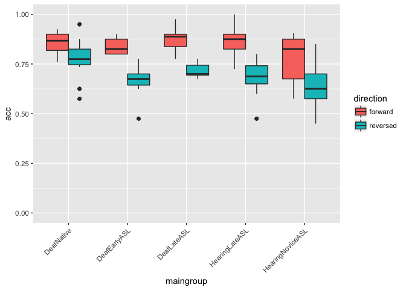
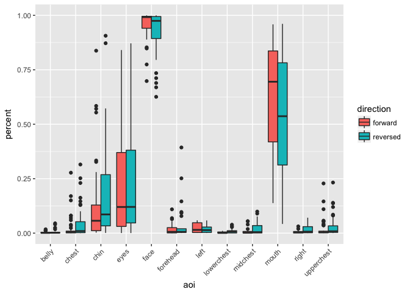

Results Section (study1adults)
================
Adam Stone, PhD
09-18-2017

-   [Refreshing Ourselves](#refreshing-ourselves)
-   [Participant Characteristics](#participant-characteristics)
-   [Lexical Recall Data, Summarized.](#lexical-recall-data-summarized.)
-   [Eye Gaze Data, Summarized.](#eye-gaze-data-summarized.)
-   [Bivariate Correlations](#bivariate-correlations)
    -   [Forward Correlations](#forward-correlations)
    -   [Reversed Correlations](#reversed-correlations)
-   [ANOVAs](#anovas)
    -   [All-ANOVA](#all-anova)
    -   [Forward ANOVA](#forward-anova)
    -   [Reversed ANOVA](#reversed-anova)
-   [Other Notes from Rain](#other-notes-from-rain)

Refreshing Ourselves
====================

> The main goal of the study is to see if comprehension is related to gaze behavior and if AoA impacts gaze behavior.

**Key Questions:** Can gaze behavior reflect whether or not a person can understand the story? When a person has a harder time understanding a difficult story, maybe because they lack the skills, can this be observed in gaze behavior?

> It is more important to show that our behavioral measure IS sensitive to effects of AoA. Period. *The cause is secondary.*

Now let's load in the dataset called `cleanpercentdata.csv`. It contains item-level data showing the percent of looking for each AOI (10 AOIs total) for each story and each participant *still in the study*. All data defined as "bad" (entire participants with poor calibration, or individual stories with too little looking data) have been dropped. We will then move this to subject-level by averaging each participant's two forward stories together and two reversed stories together.

``` r
#library(corrplot)
library(Hmisc)
library(tidyverse)
library(stringr)
library(lme4)
library(lmerTest)
library(prettydoc)
library(broom)
library(knitr)
library(xtable)
library(kableExtra)
library(viridis)
options(knitr.table.format = "html") 

# Import!
data <- read_csv('cleanpercentdata.csv',col_types = 
                   cols(
                     id = col_integer(),
                     participant = col_character(),
                     hearing = col_character(),
                     videogroup = col_character(),
                     aoagroup = col_character(),
                     languagegroup = col_character(),
                     maingroup = col_character(),
                     video = col_character(),
                     story = col_character(),
                     direction = col_character(),
                     age = col_double(),
                     selfrate = col_double(),
                     signyrs = col_double(),
                     aoasl = col_integer(),
                     acc = col_double(),
                     aoi = col_character(),
                     percent = col_double()
                   ))

# And factorize
data <- data %>%
  mutate(participant = as.factor(participant)) %>%
  mutate(id = as.factor(id)) %>%
  mutate(hearing = as.factor(hearing)) %>%
  mutate(videogroup = as.factor(videogroup)) %>%
  mutate(aoagroup = as.factor(aoagroup)) %>%
  mutate(languagegroup = as.factor(languagegroup)) %>%
  mutate(maingroup = as.factor(maingroup)) %>%
  mutate(video = as.factor(video)) %>%
  mutate(story = as.factor(story)) %>%
  mutate(direction = as.factor(direction)) %>%
  mutate(aoi = as.factor(aoi))

dataoriginal <- data # Save item-level data just in case

# Pull out subject info, and averge the accuracy scores
data.subjectinfo <- data %>%
  select(-aoi,-percent,-video,-story) %>%
  distinct() %>%
  group_by(participant,direction) %>%
  mutate(acc = mean(acc,na.rm=TRUE)) %>%
  distinct()

# Now collapse eye gaze data to subject-level 
data <- data %>%
  group_by(participant,direction,aoi) %>%
  summarize(percent = mean(percent,na.rm=TRUE))
data[data=="NaN"] <- NA

# Join subject info with data that's now subject-level
data <- left_join(data,data.subjectinfo, by=c("participant","direction"))

# Set reference levels
data$maingroup <- relevel(data$maingroup, ref="DeafNative")
# data.face3 <- filter(data2, aoi == "eyes" | aoi == "mouth" | aoi == "chin") %>%
#   mutate(aoi = as.factor(aoi))
# data.face3$aoi <- factor(data.face3$aoi, levels=c("eyes","mouth","chin"))
# data.face3$aoi <- relevel(data.face3$aoi, ref="eyes")
```

Participant Characteristics
===========================

Let's do the basic participant table here.

``` r
groupmeans <- data %>%
  ungroup() %>%
  select(id,participant,maingroup,age,selfrate,signyrs,aoasl) %>%
  distinct() %>%
  group_by(maingroup) %>%
  summarize(n = n(),
            age.m = mean(age),
            age.sd = sd(age),
            selfrate.m = mean(selfrate),
            selfrate.sd = sd(selfrate),
            signyrs.m = mean(signyrs),
            signyrs.sd = sd(signyrs),
            aoasl.m = mean(aoasl),
            aoasl.sd = sd(aoasl))
kable(groupmeans, digits=1) %>% kable_styling(bootstrap_options = c("striped", "hover", "condensed"))
```

<table class="table table-striped table-hover table-condensed" style="margin-left: auto; margin-right: auto;">
<thead>
<tr>
<th style="text-align:left;">
maingroup
</th>
<th style="text-align:right;">
n
</th>
<th style="text-align:right;">
age.m
</th>
<th style="text-align:right;">
age.sd
</th>
<th style="text-align:right;">
selfrate.m
</th>
<th style="text-align:right;">
selfrate.sd
</th>
<th style="text-align:right;">
signyrs.m
</th>
<th style="text-align:right;">
signyrs.sd
</th>
<th style="text-align:right;">
aoasl.m
</th>
<th style="text-align:right;">
aoasl.sd
</th>
</tr>
</thead>
<tbody>
<tr>
<td style="text-align:left;">
DeafNative
</td>
<td style="text-align:right;">
11
</td>
<td style="text-align:right;">
32.9
</td>
<td style="text-align:right;">
9.7
</td>
<td style="text-align:right;">
5.0
</td>
<td style="text-align:right;">
0.0
</td>
<td style="text-align:right;">
32.5
</td>
<td style="text-align:right;">
9.8
</td>
<td style="text-align:right;">
0.3
</td>
<td style="text-align:right;">
0.5
</td>
</tr>
<tr>
<td style="text-align:left;">
DeafEarlyASL
</td>
<td style="text-align:right;">
7
</td>
<td style="text-align:right;">
34.9
</td>
<td style="text-align:right;">
5.8
</td>
<td style="text-align:right;">
5.0
</td>
<td style="text-align:right;">
0.0
</td>
<td style="text-align:right;">
29.7
</td>
<td style="text-align:right;">
5.3
</td>
<td style="text-align:right;">
5.1
</td>
<td style="text-align:right;">
2.4
</td>
</tr>
<tr>
<td style="text-align:left;">
DeafLateASL
</td>
<td style="text-align:right;">
4
</td>
<td style="text-align:right;">
34.0
</td>
<td style="text-align:right;">
5.7
</td>
<td style="text-align:right;">
5.0
</td>
<td style="text-align:right;">
0.0
</td>
<td style="text-align:right;">
21.5
</td>
<td style="text-align:right;">
6.6
</td>
<td style="text-align:right;">
12.5
</td>
<td style="text-align:right;">
1.7
</td>
</tr>
<tr>
<td style="text-align:left;">
HearingLateASL
</td>
<td style="text-align:right;">
11
</td>
<td style="text-align:right;">
28.9
</td>
<td style="text-align:right;">
6.5
</td>
<td style="text-align:right;">
4.7
</td>
<td style="text-align:right;">
0.5
</td>
<td style="text-align:right;">
11.5
</td>
<td style="text-align:right;">
5.0
</td>
<td style="text-align:right;">
17.5
</td>
<td style="text-align:right;">
3.4
</td>
</tr>
<tr>
<td style="text-align:left;">
HearingNoviceASL
</td>
<td style="text-align:right;">
11
</td>
<td style="text-align:right;">
20.2
</td>
<td style="text-align:right;">
1.3
</td>
<td style="text-align:right;">
3.0
</td>
<td style="text-align:right;">
0.7
</td>
<td style="text-align:right;">
2.4
</td>
<td style="text-align:right;">
1.0
</td>
<td style="text-align:right;">
17.6
</td>
<td style="text-align:right;">
1.8
</td>
</tr>
</tbody>
</table>
``` r
#groupmeans
```

Lexical Recall Data, Summarized.
================================

Quick summary of lexical recall data here. We have to collapse here as well from subject-level to group-level.

``` r
data.acc <- data %>%
  ungroup() %>%
  select(-aoi,-percent) %>%
  distinct() %>%
  group_by(maingroup,direction) %>%
  summarize(mean = mean(acc, na.rm=TRUE),
            sd = sd(acc, na.rm=TRUE))
data.acc1 <- data.acc %>%
  select(-mean) %>%
  spread(direction,sd) %>%
  rename(forward.sd = forward,
         reversed.sd = reversed)
data.acc2 <- data.acc %>%
  select(-sd) %>%
  spread(direction,mean) %>%
  rename(forward.mean = forward,
         reversed.mean = reversed)
groupcount <- select(groupmeans,maingroup,n)
data.acc <- left_join(data.acc2,data.acc1, by="maingroup") %>%
  left_join(groupcount, by="maingroup") %>%
  # mutate(forward.se = forward.sd/sqrt(n),
  #        reversed.se = reversed.sd/sqrt(n)) %>%
  #select(maingroup,n,forward.mean,forward.sd,forward.se,reversed.mean,reversed.sd,reversed.se)
  select(maingroup,n,forward.mean,forward.sd,reversed.mean,reversed.sd)
#data.acc
kable(data.acc, digits=2) %>% kable_styling(bootstrap_options = c("striped", "hover", "condensed"))
```

<table class="table table-striped table-hover table-condensed" style="margin-left: auto; margin-right: auto;">
<thead>
<tr>
<th style="text-align:left;">
maingroup
</th>
<th style="text-align:right;">
n
</th>
<th style="text-align:right;">
forward.mean
</th>
<th style="text-align:right;">
forward.sd
</th>
<th style="text-align:right;">
reversed.mean
</th>
<th style="text-align:right;">
reversed.sd
</th>
</tr>
</thead>
<tbody>
<tr>
<td style="text-align:left;">
DeafNative
</td>
<td style="text-align:right;">
11
</td>
<td style="text-align:right;">
0.85
</td>
<td style="text-align:right;">
0.05
</td>
<td style="text-align:right;">
0.75
</td>
<td style="text-align:right;">
0.12
</td>
</tr>
<tr>
<td style="text-align:left;">
DeafEarlyASL
</td>
<td style="text-align:right;">
7
</td>
<td style="text-align:right;">
0.86
</td>
<td style="text-align:right;">
0.03
</td>
<td style="text-align:right;">
0.66
</td>
<td style="text-align:right;">
0.07
</td>
</tr>
<tr>
<td style="text-align:left;">
DeafLateASL
</td>
<td style="text-align:right;">
4
</td>
<td style="text-align:right;">
0.85
</td>
<td style="text-align:right;">
0.09
</td>
<td style="text-align:right;">
0.72
</td>
<td style="text-align:right;">
0.04
</td>
</tr>
<tr>
<td style="text-align:left;">
HearingLateASL
</td>
<td style="text-align:right;">
11
</td>
<td style="text-align:right;">
0.85
</td>
<td style="text-align:right;">
0.09
</td>
<td style="text-align:right;">
0.66
</td>
<td style="text-align:right;">
0.11
</td>
</tr>
<tr>
<td style="text-align:left;">
HearingNoviceASL
</td>
<td style="text-align:right;">
11
</td>
<td style="text-align:right;">
0.78
</td>
<td style="text-align:right;">
0.11
</td>
<td style="text-align:right;">
0.64
</td>
<td style="text-align:right;">
0.11
</td>
</tr>
</tbody>
</table>
And a boxplot that can go with it.

``` r
ggplot(data,aes(maingroup,acc,fill=direction)) + 
  geom_boxplot() +
  scale_y_continuous(limits=c(0,1)) +
  theme(axis.text.x=element_text(angle=45,hjust=1))
```

 And Rain wanted the error plot so here it is. Lines represent SEM. Good to have this too!

``` r
data.acc1 <- data.acc1 %>% 
  ungroup() %>% 
  gather(direction,sd,forward.sd:reversed.sd) %>%
  mutate(direction = str_sub(direction,1,-4))
data.acc2 <- data.acc2 %>% 
  ungroup() %>% 
  gather(direction,mean,forward.mean:reversed.mean) %>%
  mutate(direction = str_sub(direction,1,-6))
data.acc.se <- left_join(data.acc1,data.acc2, by=c("maingroup","direction")) %>%
  left_join(groupcount, by="maingroup") %>%
  mutate(se = sd/sqrt(n))
ggplot(data.acc.se,aes(maingroup,mean,color=direction)) +
  geom_point(position=position_dodge(0.5)) +
  geom_errorbar(aes(ymin=mean-se,ymax=mean+se),width=0.1,position=position_dodge(0.5)) +
  scale_y_continuous(limits=c(0,1)) +
  theme(axis.text.x=element_text(angle=45,hjust=1)) + xlab("") + ylab("mean accuracy")
```


Eye Gaze Data, Summarized.
==========================

I guess we should have a big table of means and SDs for all AOIs for each group for forward and backward. I'll write the code for this later. For now, here's the boxplot. This is the part where we will say, from all the data we have concluded that we can work with **three AOIs** from here on due to sufficient data: chin, eyes, and mouth.

``` r
ggplot(data,aes(aoi,percent,fill=direction)) + 
  geom_boxplot() +
  scale_y_continuous(limits=c(0,1)) +
  theme(axis.text.x=element_text(angle=45,hjust=1))
```

    ## Warning: Removed 303 rows containing non-finite values (stat_boxplot).



THEN we can show heat maps too. For this I would include forehead and upperchest just to give it some dimension.

``` r
data.five <- data %>%
  ungroup() %>%
  filter(aoi == "upperchest" | aoi == "chin" | aoi == "mouth" | aoi == "eyes" | aoi == "forehead") %>%
  group_by(maingroup,aoi,direction) %>%
  summarize(mean = mean(percent, na.rm=TRUE)) %>%
  ungroup() %>% 
  mutate(aoi = factor(aoi,levels=c("upperchest","chin","mouth","eyes","forehead")))

ggplot(data.five, aes(x = maingroup, y = aoi)) +
  geom_tile(aes(fill=mean),color="lightgray",na.rm=TRUE) + 
#  scale_fill_gradient(low = "lightblue",high = "steelblue") +
#  scale_fill_distiller(type="div", palette = "RdYlBu") +
  scale_fill_viridis(option = "inferno") +
  facet_wrap("direction") +
  theme(axis.text.x=element_text(angle=45,hjust=1))
```


Bivariate Correlations
======================

We temporarily drop groups here. We just want to ask: *"What is correlated in terms of subject characteristics and their behavioral measures?"* We'll do this separately for forward and reversed, and using only important AOIs. - Looking at signing years, AoA, lexical recall, gaze data - Which is stronger – signing years or AoA? - Is lexical recall correlated with looking at any AOI?

``` r
# Drop all other AOIs
data.allaoi <- data # save current dataset
data <- data %>%
  filter(aoi == "eyes" | aoi == "mouth" | aoi == "chin")

# Need to put AOIs in their own columns
data.spread <- data %>%
  spread(aoi,percent) %>%
  ungroup()

# Fwd and Rev data
data.fw <- data.spread %>%
  filter(direction == "forward") %>%
  select(age,selfrate,signyrs,aoasl,acc,eyes,mouth,chin)

data.rv <- data.spread %>%
  filter(direction == "reversed") %>%
  select(age,selfrate,signyrs,aoasl,acc,eyes,mouth,chin)

# Correlations
# data.fw.corr <- cor(data.fw, use="pairwise.complete.obs")
# data.rv.corr <- cor(data.rv, use="pairwise.complete.obs")
# corrplot.mixed(data.rv.corr, lower ="number", upper = "circle")
```

Forward Correlations
--------------------

Here's the Pearson's correlation matrix for forward stories. -AoASL & Accuracy: -0.14 (weak) *p = 0.349* -SignYrs & Accuracy: 0.30 (medium) *p = 0.045* -SelfRating & Accuracy: 0.44 (medium) *p = 0.003* -Age & Accuracy: 0.33 (medium) *p = 0.027*

The best relationship between any AOI and accuracy is for eyes: r = -0.24 (weak), p = 0.119. Less looking at eyes equals more accurate. Interesting cluster among all 3 AOIs - all strongly negatively correlated with each other. Meaning people just pick one and not "float" among all three.

``` r
#corrplot(data.fw.corr, method="number")
rcorr(as.matrix(data.fw))
```

    ##            age selfrate signyrs aoasl   acc  eyes mouth  chin
    ## age       1.00     0.63    0.85 -0.40  0.33 -0.15  0.33 -0.13
    ## selfrate  0.63     1.00    0.71 -0.55  0.44 -0.20  0.12  0.16
    ## signyrs   0.85     0.71    1.00 -0.82  0.30 -0.21  0.28  0.01
    ## aoasl    -0.40    -0.55   -0.82  1.00 -0.14  0.22 -0.11 -0.18
    ## acc       0.33     0.44    0.30 -0.14  1.00 -0.24  0.16  0.09
    ## eyes     -0.15    -0.20   -0.21  0.22 -0.24  1.00 -0.56 -0.43
    ## mouth     0.33     0.12    0.28 -0.11  0.16 -0.56  1.00 -0.54
    ## chin     -0.13     0.16    0.01 -0.18  0.09 -0.43 -0.54  1.00
    ## 
    ## n
    ##          age selfrate signyrs aoasl acc eyes mouth chin
    ## age       44       44      44    44  44   43    44   44
    ## selfrate  44       44      44    44  44   43    44   44
    ## signyrs   44       44      44    44  44   43    44   44
    ## aoasl     44       44      44    44  44   43    44   44
    ## acc       44       44      44    44  44   43    44   44
    ## eyes      43       43      43    43  43   43    43   43
    ## mouth     44       44      44    44  44   43    44   44
    ## chin      44       44      44    44  44   43    44   44
    ## 
    ## P
    ##          age    selfrate signyrs aoasl  acc    eyes   mouth  chin  
    ## age             0.0000   0.0000  0.0068 0.0274 0.3478 0.0292 0.3923
    ## selfrate 0.0000          0.0000  0.0001 0.0026 0.1988 0.4497 0.3063
    ## signyrs  0.0000 0.0000           0.0000 0.0453 0.1679 0.0690 0.9252
    ## aoasl    0.0068 0.0001   0.0000         0.3488 0.1582 0.4709 0.2316
    ## acc      0.0274 0.0026   0.0453  0.3488        0.1190 0.3117 0.5472
    ## eyes     0.3478 0.1988   0.1679  0.1582 0.1190        0.0001 0.0039
    ## mouth    0.0292 0.4497   0.0690  0.4709 0.3117 0.0001        0.0002
    ## chin     0.3923 0.3063   0.9252  0.2316 0.5472 0.0039 0.0002

Reversed Correlations
---------------------

Here's the Pearson's correlation matrix for reversed stories. -AoASL & Accuracy: -0.31 (medium) *p = 0.042* -SignYrs & Accuracy: 0.3 (medium) *p = 0.511* -SelfRating & Accuracy: 0.39 (medium) *p = 0.009* -Age & Accuracy: 0.2 (weak) *p = 0.189*

But what's interesting is now eye gaze/AOIs has much weaker relationships with accuracy. We had a small negative relationship between eyes and accuracy in forward, but in reverse there's even less...more scattered, more all over the place. Gaze behavior is impacted by reversal. *Caveat: not even forward had any significant correlations w AOIs*

``` r
#corrplot(data.rv.corr, method="number")
rcorr(as.matrix(data.rv))
```

    ##            age selfrate signyrs aoasl   acc  eyes mouth  chin
    ## age       1.00     0.62    0.85 -0.40  0.20  0.06  0.31 -0.25
    ## selfrate  0.62     1.00    0.71 -0.55  0.39  0.05  0.08 -0.01
    ## signyrs   0.85     0.71    1.00 -0.82  0.30 -0.02  0.26 -0.09
    ## aoasl    -0.40    -0.55   -0.82  1.00 -0.31  0.11 -0.10 -0.11
    ## acc       0.20     0.39    0.30 -0.31  1.00 -0.12  0.10  0.06
    ## eyes      0.06     0.05   -0.02  0.11 -0.12  1.00 -0.61 -0.47
    ## mouth     0.31     0.08    0.26 -0.10  0.10 -0.61  1.00 -0.49
    ## chin     -0.25    -0.01   -0.09 -0.11  0.06 -0.47 -0.49  1.00
    ## 
    ## n
    ##          age selfrate signyrs aoasl acc eyes mouth chin
    ## age       43       43      43    43  43   39    43   42
    ## selfrate  43       43      43    43  43   39    43   42
    ## signyrs   43       43      43    43  43   39    43   42
    ## aoasl     43       43      43    43  43   39    43   42
    ## acc       43       43      43    43  43   39    43   42
    ## eyes      39       39      39    39  39   39    39   38
    ## mouth     43       43      43    43  43   39    43   42
    ## chin      42       42      42    42  42   38    42   42
    ## 
    ## P
    ##          age    selfrate signyrs aoasl  acc    eyes   mouth  chin  
    ## age             0.0000   0.0000  0.0081 0.1892 0.7158 0.0414 0.1176
    ## selfrate 0.0000          0.0000  0.0002 0.0091 0.7769 0.6138 0.9363
    ## signyrs  0.0000 0.0000           0.0000 0.0511 0.8837 0.0966 0.5598
    ## aoasl    0.0081 0.0002   0.0000         0.0420 0.5054 0.5145 0.4953
    ## acc      0.1892 0.0091   0.0511  0.0420        0.4666 0.5081 0.7202
    ## eyes     0.7158 0.7769   0.8837  0.5054 0.4666        0.0000 0.0027
    ## mouth    0.0414 0.6138   0.0966  0.5145 0.5081 0.0000        0.0009
    ## chin     0.1176 0.9363   0.5598  0.4953 0.7202 0.0027 0.0009

ANOVAs
======

Now we're going to do ANOVAs. WE'll do an all-factors ANOVA including Directoin, then also do separate Forward and Reversed ANOVAs.

> We do this separately for lexical recall and gaze data. But be prepared to compare the two sets of results side by side, in a summary like say “subject groups differed significantly for lexical recall (stat values) but not gaze data (stat values)” or whatever the result is. At least this can be done in the discussion, if not in the results section.

I like the idea of treating Native Deaf as baseline or the gold standard in comparisons.

All-ANOVA
---------

Forward ANOVA
-------------

Reversed ANOVA
--------------

Other Notes from Rain
=====================

1.  If you do LLM or ANCOVA, do so with AoA, and without subject group or hearing status. I would set aside any stats you did with both Hearing Status and AoA, I don't think you can do that.

How come lexical recall isn’t a predictor in a model with gaze data? Yes, that is an important goal of the paper.

Here is an example of what I had noted to myself previously, which is not current any more, and I would put correlation values in here:

-Bivariate correlations were calculated for all subjects, irrespective of hearing status (which we address in a later section). Surprisingly, for no AOI was looking behavior was correlated with accuracy, for either forward or reversed stories. -Remarkably, percent-looking at mid chest and lower chest, for both forward and reversed (and left side for reversed) are highly negatively correlated with years signing and positively correlated with AoA. That means that greater looking in those areas are associated with older ages of acquisition and fewer years of experience. What is equally interesting is that looking at the eyes was not related to subject characteristics at all (contrast with Emmorey’s finding). -Also, looking at the mouth for reversed stimuli was significantly correlated with years signing (r = 0.38), this means the longer one signed, the more (in terms of % looking) one looked at the mouth.

Then, maybe we can have a section called “Hearing Status” and in this paragraph say what happens when we compare hearing and deaf, using the same range of AoA, excluding hearing Novice. Or maybe separate regressions for hearing and deaf groups, looking at AoA, AOI’s, and lexical recall, to examine the relationship between the three. I don't know.
