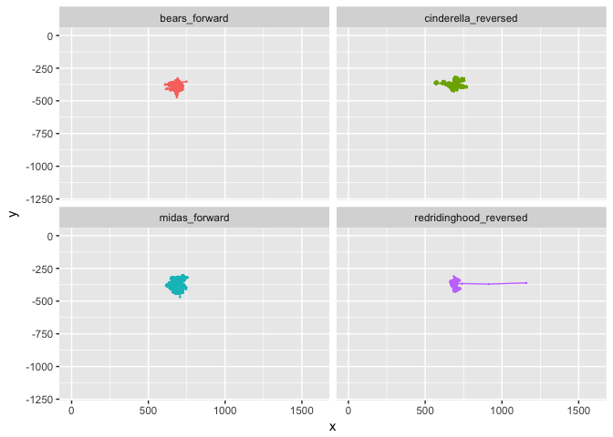

Viewing Space (study1adults)
================
Adam Stone, PhD
10-02-2017

-   [Get Data](#get-data)

Get Data
========

We'll load the raw data from all 8 .xls files. Each file shows the participant's name, group, language, media, and x/y eye gaze coordinates. Here's a quick glimpse of the data and how it's structured after I've processed and cleaned it up.

``` r
# Import packages we'll need.
library(tidyverse)
library(stringr)

# Gather up the files
files <- list.files(pattern = "\\.csv",path="rawdata")
files <- str_c("rawdata/",files)
rawdata <- do.call("rbind", lapply(files, read_csv))

# Clean Up
rawdataoriginal <- rawdata
rawdata <- rawdataoriginal
rawdata <- rawdata %>%
  rename(participant = ParticipantName,
         group = "[Group]Value",
         language = "[Language]Value",
         media = MediaName,
         x = "GazePointX (MCSpx)",
         y = "GazePointY (MCSpx)") %>%
  select(participant,group,language,media,x,y) %>%
  add_column(story=NA,direction=NA) %>%
  mutate(story = case_when(
    str_detect(media,"bears") ~ "bears",
    str_detect(media,"cinderella") ~ "cinderella",   
    str_detect(media,"midas") ~ "midas",
    str_detect(media,"redridinghood") ~ "redridinghood")) %>%
  mutate(direction = case_when(
    str_detect(media,"FW") ~ "forward",
    str_detect(media,"ER") ~ "reversed")) %>%
  mutate(media = str_c(story,direction, sep="_"))
glimpse(rawdata)
```

    ## Observations: 809,928
    ## Variables: 8
    ## $ participant <chr> "Adam", "Adam", "Adam", "Adam", "Adam", "Adam", "A...
    ## $ group       <chr> "Deaf", "Deaf", "Deaf", "Deaf", "Deaf", "Deaf", "D...
    ## $ language    <chr> "EarlyASL", "EarlyASL", "EarlyASL", "EarlyASL", "E...
    ## $ media       <chr> "bears_forward", "bears_forward", "bears_forward",...
    ## $ x           <int> 702, 703, 700, 695, 693, 704, 709, 708, 712, 717, ...
    ## $ y           <int> 493, 493, 495, 498, 503, 514, 513, 502, 495, 501, ...
    ## $ story       <chr> "bears", "bears", "bears", "bears", "bears", "bear...
    ## $ direction   <chr> "forward", "forward", "forward", "forward", "forwa...

Now that it's in the right format...it's ridiculously easy to get what we need. For example, here's the mean x and y coordinate for each story for each participant.

``` r
means <- rawdata %>%
  group_by(participant,media) %>%
  dplyr::summarize(x = mean(x,na.rm=TRUE),
            y = mean(y,na.rm=TRUE))
means
```

    ## # A tibble: 271 x 4
    ## # Groups:   participant [?]
    ##    participant                  media        x        y
    ##          <chr>                  <chr>    <dbl>    <dbl>
    ##  1        Adam          bears_forward 684.9977 389.2674
    ##  2        Adam    cinderella_reversed 692.4115 375.5225
    ##  3        Adam          midas_forward 687.0622 390.0083
    ##  4        Adam redridinghood_reversed 695.7886 384.0031
    ##  5    alicia 2         bears_reversed 678.1501 437.3332
    ##  6    alicia 2     cinderella_forward 690.3169 414.7603
    ##  7    alicia 2         midas_reversed 672.9260 393.8968
    ##  8    alicia 2  redridinghood_forward 707.9323 367.3785
    ##  9 Alicia Deaf         midas_reversed 688.1792 395.6458
    ## 10 Alicia Deaf  redridinghood_forward 700.9295 405.4189
    ## # ... with 261 more rows

And I can get x or y plots of one participant across 4 stories. Let's do Adam (me?).

``` r
adam <- filter(rawdata,participant=="Adam")
ggplot(adam,aes(x=x,y=y,color=media)) + geom_point() + geom_line() + facet_wrap("media",ncol=2,nrow=2) + guides(color="none")
```

    ## Warning: Removed 643 rows containing missing values (geom_point).

    ## Warning: Removed 643 rows containing missing values (geom_path).


