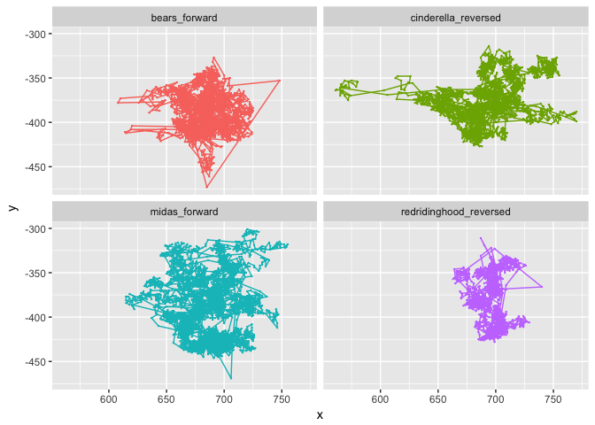

Viewing Space (study1adults)
================
Adam Stone, PhD
10-06-2017

-   [Get Data](#get-data)
-   [Analysis](#analysis)
-   [IQR](#iqr)
-   [Viewing Space Charts](#viewing-space-charts)
-   [Viewing Space Charts for Individuals](#viewing-space-charts-for-individuals)
-   [Standard Deviations?](#standard-deviations)

Get Data
========

We'll load the raw data from all 8 .xls files. Each file shows the participant's name, group, language, media, and x/y eye gaze coordinates. Here's a quick glimpse of the data and how it's structured after I've processed and cleaned it up.

``` r
# Import packages we'll need.
library(tidyverse)
library(stringr)
library(lme4)
library(lmerTest)
library(png)
library(grid)

# Gather up the files
files <- list.files(pattern = "\\.csv",path="rawdata")
files <- str_c("rawdata/",files)
rawdata <- do.call("rbind", lapply(files, read_csv))

# Clean Up
rawdataoriginal <- rawdata
rawdata <- rawdataoriginal
rawdata <- rawdata %>%
  rename(participant = ParticipantName,
         group = "[Group]Value",
         language = "[Language]Value",
         media = MediaName,
         x = "GazePointX (MCSpx)",
         y = "GazePointY (MCSpx)",
         gazeindex = GazePointIndex) %>%
  select(participant,group,language,media,x,y,gazeindex) %>%
  add_column(story=NA,direction=NA,maingroup=NA) %>%
  mutate(story = case_when(
    str_detect(media,"bears") ~ "bears",
    str_detect(media,"cinderella") ~ "cinderella",   
    str_detect(media,"midas") ~ "midas",
    str_detect(media,"redridinghood") ~ "redridinghood")) %>%
  mutate(direction = case_when(
    str_detect(media,"FW") ~ "forward",
    str_detect(media,"ER") ~ "reversed")) %>%
  mutate(media = str_c(story,direction, sep="_")) %>%
  mutate(language = case_when(
    str_detect(language,"EarlyASL") ~ "Early",
    str_detect(language,"LateASL") ~ "Late",
    str_detect(language,"NoviceASL_Trained") ~ "Trained",
    str_detect(language,"NoviceASL") ~ "Novice")) %>%
  mutate(maingroup = str_c(group,language, sep="")) %>%
  filter(!is.na(maingroup))
glimpse(rawdata)
```

    ## Observations: 809,920
    ## Variables: 10
    ## $ participant <chr> "Adam", "Adam", "Adam", "Adam", "Adam", "Adam", "A...
    ## $ group       <chr> "Deaf", "Deaf", "Deaf", "Deaf", "Deaf", "Deaf", "D...
    ## $ language    <chr> "Early", "Early", "Early", "Early", "Early", "Earl...
    ## $ media       <chr> "bears_forward", "bears_forward", "bears_forward",...
    ## $ x           <int> 702, 703, 700, 695, 693, 704, 709, 708, 712, 717, ...
    ## $ y           <int> 493, 493, 495, 498, 503, 514, 513, 502, 495, 501, ...
    ## $ gazeindex   <int> 1, 2, 3, 4, 5, 6, 7, 8, 9, 10, 11, 12, 13, 14, 15,...
    ## $ story       <chr> "bears", "bears", "bears", "bears", "bears", "bear...
    ## $ direction   <chr> "forward", "forward", "forward", "forward", "forwa...
    ## $ maingroup   <chr> "DeafEarly", "DeafEarly", "DeafEarly", "DeafEarly"...

Now that it's in the right format...it's easy to get what we need! :-D

Analysis
========

First, let's trim each participant's data, getting rid of the first 30 samples (0.5 secs). Then we'll get the the mean x and y coordinate for each story for each participant.

``` r
rawdata <- rawdata %>%
  arrange(participant,media,gazeindex) %>%
  group_by(participant,media) %>%
  slice(30:n())

means <- rawdata %>%
  group_by(participant,media) %>%
  dplyr::summarize(x = mean(x,na.rm=TRUE),
            y = mean(y,na.rm=TRUE))
head(means,10)
```

    ## # A tibble: 10 x 4
    ## # Groups:   participant [3]
    ##    participant                  media        x        y
    ##          <chr>                  <chr>    <dbl>    <dbl>
    ##  1        Adam          bears_forward 684.7927 388.0363
    ##  2        Adam    cinderella_reversed 693.0038 374.5328
    ##  3        Adam          midas_forward 687.6085 389.2098
    ##  4        Adam redridinghood_reversed 696.7134 381.1237
    ##  5    alicia 2         bears_reversed 678.2617 436.0024
    ##  6    alicia 2     cinderella_forward 688.5115 409.0559
    ##  7    alicia 2         midas_reversed 672.8772 393.5976
    ##  8    alicia 2  redridinghood_forward 703.5676 353.4820
    ##  9 Alicia Deaf         midas_reversed 688.1792 395.6458
    ## 10 Alicia Deaf  redridinghood_forward 701.0710 404.0687

And I can get x or y plots of one participant across 4 stories. Let's do Adam (me?). We'll set the x and y limits to the whole width of the Tobii monitor (1600x1200). But because Tobii considers (0,0) to be the upper left corner (and not the bottom left corner), we also need to flip the y axis.

``` r
adam <- filter(rawdata,participant=="Adam") %>% mutate(y = y*-1)
ggplot(adam,aes(x=x,y=y,color=media)) + geom_point(size=0.1) + geom_path() + facet_wrap("media",ncol=2,nrow=2) + guides(color="none") + scale_x_continuous(limit=c(0,1600)) + scale_y_continuous(limit=c(-1200,0))
```

    ## Warning: Removed 643 rows containing missing values (geom_point).

 Cool, yeah?

Let's try this again but let the x and y limits match the data. That will "zoom" in. We'll also get rid of that weird right-side outlier in RRH. Neatooooo.

``` r
adam <- filter(adam,x<800)
ggplot(adam,aes(x=x,y=y,color=media)) + geom_point(size=0.1) + geom_path() + facet_wrap("media",ncol=2,nrow=2) + guides(color="none") 
```



IQR
===

Now let's get the middle 50% (aka the IQR) of x and y for each participant's story (we've already trimmed the first 30 samples). That should also take care of further weird outliers. And we are defining "viewing space" as the IQR of the x and y axis.

``` r
iqr <- rawdata %>%
  group_by(participant,media) %>%
  dplyr::summarize(xIQR = IQR(x,na.rm=TRUE),
                   yIQR = IQR(y,na.rm=TRUE),
                   xmed = median(x, na.rm=TRUE),
                   ymed = median(y, na.rm=TRUE))
head(iqr,10)
```

    ## # A tibble: 10 x 6
    ## # Groups:   participant [3]
    ##    participant                  media  xIQR  yIQR  xmed  ymed
    ##          <chr>                  <chr> <dbl> <dbl> <dbl> <dbl>
    ##  1        Adam          bears_forward 20.00 32.00   685 388.0
    ##  2        Adam    cinderella_reversed 34.00 33.00   693 376.0
    ##  3        Adam          midas_forward 28.00 58.00   690 389.0
    ##  4        Adam redridinghood_reversed 14.00 47.00   698 382.0
    ##  5    alicia 2         bears_reversed 44.75 30.00   685 411.0
    ##  6    alicia 2     cinderella_forward 37.00 44.00   699 415.0
    ##  7    alicia 2         midas_reversed 46.00 45.00   684 385.0
    ##  8    alicia 2  redridinghood_forward 28.00 33.75   692 348.5
    ##  9 Alicia Deaf         midas_reversed 27.00 20.00   682 389.0
    ## 10 Alicia Deaf  redridinghood_forward 23.00 35.00   704 395.0

And check out the histograms:

``` r
iqr %>% 
  gather(axis,iqr,xIQR:yIQR) %>%
  ggplot(aes(x=iqr,fill=axis)) + geom_histogram() + facet_grid(axis~.)
```

    ## `stat_bin()` using `bins = 30`. Pick better value with `binwidth`.

    ## Warning: Removed 14 rows containing non-finite values (stat_bin).


There's one weird outlier for xIQR. That's Rebecca. Let's look at her data.

``` r
rebecca <- filter(rawdata,participant=="Rebecca") %>% mutate(y = y*-1)
ggplot(rebecca,aes(x=x,y=y,color=media)) + geom_point(size=0.1) + geom_path() + facet_wrap("media",ncol=2,nrow=2) + guides(color="none") + xlim(0,1440) + ylim(-1080,0)
```

    ## Warning: Removed 8265 rows containing missing values (geom_point).

    ## Warning: Removed 2569 rows containing missing values (geom_path).


So we'll remove Rebecca's midas\_forward story. Next, check the medians.

``` r
iqr %>% 
  gather(axis,med,xmed:ymed) %>%
  ggplot(aes(x=med,fill=axis)) + geom_histogram() + facet_grid(axis~.)
```

    ## `stat_bin()` using `bins = 30`. Pick better value with `binwidth`.

    ## Warning: Removed 14 rows containing non-finite values (stat_bin).


Looks great! But it also looks pretty interesting doesn't it...Y median has a wider spread than X median. That would make sense.

Now we're ready to do stats based on group, direction, etc.

``` r
rbc <- tribble(~participant, ~media, "Rebecca","midas_forward")
iqr <- iqr %>%
  ungroup() %>%
  anti_join(rbc, by=c("participant","media")) # for some reason filter wouldn't work

subjectinfo <- rawdata %>%
  select(participant,maingroup,group,language,media,story,direction) %>%
  distinct() %>%
  filter(!is.na(participant))

iqr <- iqr %>%
  left_join(subjectinfo,by=c("participant","media")) %>%
  filter(!is.na(maingroup))

iqr.gather <- iqr %>% gather(axis,value,xIQR:ymed)
iqr.iqr <- filter(iqr.gather,axis=="xIQR" | axis=="yIQR")
iqr.med <- filter(iqr.gather,axis=="xmed" | axis=="ymed")


ggplot(iqr.iqr,aes(x=maingroup,y=value,fill=direction)) + 
  geom_boxplot() + theme(axis.text.x=element_text(angle=45,hjust=1)) +
  facet_grid(.~axis)
```

    ## Warning: Removed 14 rows containing non-finite values (stat_boxplot).


And the median x and y position (this assumes all calibrations are correct):

``` r
ggplot(iqr.med,aes(x=maingroup,y=value,fill=direction)) + 
  geom_boxplot() + theme(axis.text.x=element_text(angle=45,hjust=1)) +
  facet_grid(.~axis)
```

    ## Warning: Removed 14 rows containing non-finite values (stat_boxplot).


First, does reversal have an effect on X IQR? We have random intercepts for each participant and media, and a random slope adjustment for reversed for each participant.

``` r
xiqr.reversal <- lmer(xIQR ~ direction + (direction|participant) + (1|media), data = iqr)
summary(xiqr.reversal)$coefficients
```

    ##                    Estimate Std. Error       df   t value     Pr(>|t|)
    ## (Intercept)       36.658318   4.353165 5.906561 8.4210733 0.0001661414
    ## directionreversed  1.912058   6.019849 5.389901 0.3176256 0.7627088522

Welp. No. Y IQR?

``` r
yiqr.reversal <- lmer(yIQR ~ direction + (direction|participant) + (1|media), data = iqr)
summary(yiqr.reversal)$coefficients
```

    ##                    Estimate Std. Error       df    t value     Pr(>|t|)
    ## (Intercept)       45.757853   4.157688 6.949055 11.0055997 1.195784e-05
    ## directionreversed  4.719519   5.245332 4.318736  0.8997561 4.155988e-01

No effect here either. Let's try adding maingroups. X IQR first.

``` r
xiqr.group <- lmer(xIQR ~ direction * maingroup + (direction|participant) + (1|media), data = iqr)
summary(xiqr.group)$coefficients
```

    ##                                            Estimate Std. Error         df
    ## (Intercept)                               32.466356   5.067277   9.219453
    ## directionreversed                          5.883363   6.826873   7.584826
    ## maingroupDeafLate                         -1.537986   4.946390  75.565711
    ## maingroupHearingEarly                      3.033644   8.638151  68.852824
    ## maingroupHearingLate                       9.272544   4.153781  71.594867
    ## maingroupHearingNovice                     4.130657   4.433650  70.106043
    ## maingroupHearingTrained                    8.399715   4.134045  70.594133
    ## directionreversed:maingroupDeafLate       -6.382112   5.837424 102.756967
    ## directionreversed:maingroupHearingEarly   -8.133363   9.942371  98.135777
    ## directionreversed:maingroupHearingLate    -7.871281   4.820132 102.523572
    ## directionreversed:maingroupHearingNovice  -4.285788   5.128440 100.377995
    ## directionreversed:maingroupHearingTrained -2.749306   4.813129 101.888829
    ##                                              t value     Pr(>|t|)
    ## (Intercept)                                6.4070614 0.0001116686
    ## directionreversed                          0.8617947 0.4152132835
    ## maingroupDeafLate                         -0.3109310 0.7567091452
    ## maingroupHearingEarly                      0.3511913 0.7265171890
    ## maingroupHearingLate                       2.2323141 0.0287234102
    ## maingroupHearingNovice                     0.9316605 0.3547093793
    ## maingroupHearingTrained                    2.0318395 0.0459347591
    ## directionreversed:maingroupDeafLate       -1.0933097 0.2768142707
    ## directionreversed:maingroupHearingEarly   -0.8180507 0.4153101295
    ## directionreversed:maingroupHearingLate    -1.6330012 0.1055362967
    ## directionreversed:maingroupHearingNovice  -0.8356903 0.4053139566
    ## directionreversed:maingroupHearingTrained -0.5712097 0.5691153636

This means there is a significant difference of DeafEarly vs. HearingLate and HearingTrained on xIQR, but in the forward condition only. Basically, those two groups have a "wider" viewing space than other groups.

``` r
yiqr.group <- lmer(yIQR ~ direction * maingroup + (direction|participant) + (1|media), data = iqr)
summary(yiqr.group)$coefficients
```

    ##                                             Estimate Std. Error         df
    ## (Intercept)                               41.3149410   5.849687  25.104361
    ## directionreversed                          0.6756862   6.370464   9.226171
    ## maingroupDeafLate                          3.8111456   8.747145  67.708251
    ## maingroupHearingEarly                      1.2475590  15.520700  60.923060
    ## maingroupHearingLate                       2.7405081   7.432841  62.927907
    ## maingroupHearingNovice                     6.4602450   7.950552  61.866761
    ## maingroupHearingTrained                   11.2922019   7.405277  62.286455
    ## directionreversed:maingroupDeafLate       -3.7311262   8.087989 138.085064
    ## directionreversed:maingroupHearingEarly   -4.7381862  13.774486 133.134441
    ## directionreversed:maingroupHearingLate     6.5001341   6.692006 136.966279
    ## directionreversed:maingroupHearingNovice  10.8034113   7.112659 135.129358
    ## directionreversed:maingroupHearingTrained  7.4259316   6.679035 136.371205
    ##                                               t value     Pr(>|t|)
    ## (Intercept)                                7.06276111 2.057123e-07
    ## directionreversed                          0.10606547 9.178008e-01
    ## maingroupDeafLate                          0.43570169 6.644391e-01
    ## maingroupHearingEarly                      0.08038033 9.361982e-01
    ## maingroupHearingLate                       0.36870267 7.135869e-01
    ## maingroupHearingNovice                     0.81255305 4.195902e-01
    ## maingroupHearingTrained                    1.52488579 1.323494e-01
    ## directionreversed:maingroupDeafLate       -0.46131693 6.452971e-01
    ## directionreversed:maingroupHearingEarly   -0.34398280 7.314019e-01
    ## directionreversed:maingroupHearingLate     0.97132818 3.330971e-01
    ## directionreversed:maingroupHearingNovice   1.51889903 1.311242e-01
    ## directionreversed:maingroupHearingTrained  1.11182696 2.681688e-01

No differences among groups or reversal effect for xIQR. Viewing space doesn't get significantly taller or shorter.

Viewing Space Charts
====================

I want to learn how to make rectangle plots so here we go. Using each participant's four x and y medians and 4 x and y IQRs (one set for each story, for 4 stories). So I can get the logic and code down. Let's assume all calibrations were correct. Here's the chart for the whole media size of 1440x1080 (as reported in Tobii).

``` r
# In this order, we'll get a grand median by taking a participant's median across their 4 stories, than the median for forward and reverse across all participants. 
medians <- iqr %>%
  group_by(participant,direction) %>%
  dplyr::summarize(xIQR = median(xIQR,na.rm=TRUE),
                   yIQR = median(yIQR,na.rm=TRUE),
                   xmed = median(xmed,na.rm=TRUE),
                   ymed = median(ymed,na.rm=TRUE)) %>%
  group_by(direction) %>% 
  dplyr::summarize(xIQR = median(xIQR,na.rm=TRUE),
                   yIQR = median(yIQR,na.rm=TRUE),
                   x = median(xmed,na.rm=TRUE),
                   y = median(ymed,na.rm=TRUE))

medians <- medians %>%
  mutate(y = y*-1,
         xmin = x-(xIQR/2),
         xmax = x+(xIQR/2),
         ymin = y-(yIQR/2),
         ymax = y+(yIQR/2))

img <- readPNG("cindy.png")
g <- rasterGrob(img, interpolate=TRUE, width=unit(1,"npc"), height=unit(1,"npc")) 

ggplot(medians, aes(fill=direction,color=direction)) +
  annotation_custom(g, xmin=-Inf, xmax=Inf, ymin=-Inf, ymax=Inf) +
  geom_rect(aes(xmin=xmin,ymin=ymin,xmax=xmax,ymax=ymax),alpha=.1) + 
  theme_minimal() + xlim(0,1440) + ylim(-1080,0)
```


``` r
# ggplot(iqr.global, aes(fill=direction,color=direction)) +
#   annotation_custom(g, xmin=-Inf, xmax=Inf, ymin=-Inf, ymax=Inf) +
#   geom_rect(aes(xmin=xmin,ymin=ymin,xmax=xmax,ymax=ymax),alpha=.1) + 
#   theme_minimal() + xlim(0,1440) + ylim(-1080,0) +
#   geom_hline(yintercept=-1080+885) +
#   geom_hline(yintercept=-1080+525) + 
#   annotate(geom="text", x = 300, y = -1080+555, label = "upper shoulder point") +
#   annotate(geom="point", x = 535, y = -1080+525) + 
#   annotate(geom="text", x = 535, y = -1080+910, label = "height line") + 
#   annotate(geom="rect", xmin = 535, xmax = 535+365, ymin = -525-551, ymax = -1080+525, fill="maroon", color="black", alpha=0.5) + 
#   annotate(geom="text", x = 700, y = -900, label = "torso")
```

Yayyy! It worked! A bit hard to see! Let's zoom in.

``` r
# ggplot(iqr.global, aes(fill=direction,color=direction)) +
#   annotation_custom(g, xmin=0, xmax=1440, ymin=-1080, ymax=0) +
#   geom_rect(aes(xmin=xmin,ymin=ymin,xmax=xmax,ymax=ymax),alpha=.1) + 
#   theme_minimal() + xlim(600,800) + ylim(-500,-300)

ggplot(medians, aes(fill=direction,color=direction)) +
  geom_rect(aes(xmin=xmin,ymin=ymin,xmax=xmax,ymax=ymax),alpha=.1) + 
  theme_minimal() + xlim(677,743) + ylim(-421,-370)
```


``` r
#ggplot(iqr.global, aes(fill=direction,color=direction)) +
#  geom_rect(aes(xmin=xmin,ymin=ymin,xmax=xmax,ymax=ymax),alpha=.1)
```

I have to figure out how to get Cindy to zoom in - or crop a zoomed in version of Cindy manually and use that.

Viewing Space Charts for Individuals
====================================

Now let's see the variation in viewing spaces for all our individuals. Should be fun.

``` r
iqr.individuals <- iqr %>%
  rename(x = xmed,
         y = ymed) %>%
  mutate(y = y*-1,
         xmin = x-(xIQR/2),
         xmax = x+(xIQR/2),
         ymin = y-(yIQR/2),
         ymax = y+(yIQR/2))

ggplot(iqr.individuals, aes(fill=direction,color=direction)) +
  annotation_custom(g, xmin=-Inf, xmax=Inf, ymin=-Inf, ymax=Inf) +
  geom_rect(aes(xmin=xmin,ymin=ymin,xmax=xmax,ymax=ymax),alpha=.1) + 
  theme_minimal() + xlim(0,1440) + ylim(-1080,0) + facet_wrap("direction") +
  ggtitle("with IQRs")
```

    ## Warning: Removed 7 rows containing missing values (geom_rect).


Standard Deviations?
====================

Let's try using standard deviations instead.

``` r
sd <- rawdata %>%
  group_by(participant,media) %>%
  dplyr::summarize(xsd = sd(x,na.rm=TRUE),
                   ysd = sd(y,na.rm=TRUE),
                   xmean = mean(x, na.rm=TRUE),
                   ymean = mean(y, na.rm=TRUE))

sd.individuals <- sd %>%
  rename(x = xmean,
         y = ymean) %>%
  mutate(y = y*-1,
         xmin = x-xsd,
         xmax = x+xsd,
         ymin = y-ysd,
         ymax = y+ysd) %>%
  left_join(subjectinfo,by=c("participant","media")) %>%
  filter(!is.na(maingroup))


ggplot(sd.individuals, aes(fill=direction,color=direction)) +
  annotation_custom(g, xmin=-Inf, xmax=Inf, ymin=-Inf, ymax=Inf) +
  geom_rect(aes(xmin=xmin,ymin=ymin,xmax=xmax,ymax=ymax),alpha=.1) + 
  theme_minimal() + xlim(0,1440) + ylim(-1080,0) + facet_wrap("direction") +
  ggtitle("with SDs")
```

    ## Warning: Removed 7 rows containing missing values (geom_rect).


Now let's make Outer Limits charts which is IQR +/- 2 SDs.

``` r
sd.individuals <- select(sd.individuals,participant,media,xsd,ysd)
iqrsd.individuals <- left_join(iqr.individuals,sd.individuals,by=c("participant","media")) %>%
  mutate(xmin = xmin-(2*xsd),
         xmax = xmax+(2*xsd),
         ymin = ymin-(2*ysd),
         ymax = ymax+(2*ysd))

ggplot(iqrsd.individuals, aes(fill=direction,color=direction)) +
  annotation_custom(g, xmin=-Inf, xmax=Inf, ymin=-Inf, ymax=Inf) +
  geom_rect(aes(xmin=xmin,ymin=ymin,xmax=xmax,ymax=ymax),alpha=.1) + 
  theme_minimal() + xlim(0,1440) + ylim(-1080,0) + facet_wrap("direction") +
  ggtitle("with SDs")
```

    ## Warning: Removed 7 rows containing missing values (geom_rect).


``` r
iqrsd.individuals <- iqrsd.individuals %>%
  group_by(direction) %>%
  dplyr::summarize(x = mean(x,na.rm=TRUE),
            y = mean(y,na.rm=TRUE),
            xmin = mean(xmin,na.rm=TRUE),
            ymin = mean(ymin,na.rm=TRUE),
            xmax = mean(xmax,na.rm=TRUE),
            ymax = mean(ymax,na.rm=TRUE))
ggplot(iqrsd.individuals, aes(fill=direction,color=direction)) +
  annotation_custom(g, xmin=-Inf, xmax=Inf, ymin=-Inf, ymax=Inf) +
  geom_rect(aes(xmin=xmin,ymin=ymin,xmax=xmax,ymax=ymax),alpha=.1) + 
  theme_minimal() + xlim(0,1440) + ylim(-1080,0) + facet_wrap("direction") +
  ggtitle("Average of above chart (rain's outer limits)")
```


