New Results \#2 (study1adults)
================
Adam Stone, PhD
10-11-2017

-   [Introduction](#introduction)
-   [Participants](#participants)
-   [Deaf (All) Signers](#deaf-all-signers)
    -   [Lexical Recall](#lexical-recall)
    -   [Eye Gaze Behavior](#eye-gaze-behavior)
    -   [Bivariate Correlations; Eye Gaze Effect on Accuracy](#bivariate-correlations-eye-gaze-effect-on-accuracy)
    -   [Deaf Signers Summary](#deaf-signers-summary)
-   [Late (Deaf & Hearing) Signers](#late-deaf-hearing-signers)
    -   [Participants](#participants-1)
    -   [Lexical Recall](#lexical-recall-1)
    -   [Eye Gaze Behavior](#eye-gaze-behavior-1)
    -   [Eye Gaze Predicting Accuracy](#eye-gaze-predicting-accuracy)
    -   [Late Signers Summary](#late-signers-summary)
-   [Hearing (Late & Novice) Signers](#hearing-late-novice-signers)
    -   [Participants](#participants-2)
    -   [Lexical Recall](#lexical-recall-2)
    -   [Eye Gaze Behavior](#eye-gaze-behavior-2)
    -   [Eye Gaze Predicting Accuracy](#eye-gaze-predicting-accuracy-1)
    -   [Hearing Signers Summary](#hearing-signers-summary)
-   [FaceChest Ratio](#facechest-ratio)
    -   [FCR in Deaf Signers](#fcr-in-deaf-signers)
    -   [FCR in Late Signers](#fcr-in-late-signers)
    -   [FCR in Hearing Signers](#fcr-in-hearing-signers)
    -   [FCR as a Predictor of Accuracy?](#fcr-as-a-predictor-of-accuracy)

Introduction
============

So this is a new attempt at sorting out the data analyses for this project. We'll go in this order:

1.  *Deaf Signers.* Let's set up the gold standard.
2.  *Hearing Late Signers.* Now compare DeafLate & HearingLate for an effect of hearing.
3.  *Hearing Novice Signers.* Maybe.

Participants
============

``` r
# Load libraries
library(tidyverse)
```

    ## Loading tidyverse: ggplot2
    ## Loading tidyverse: tibble
    ## Loading tidyverse: tidyr
    ## Loading tidyverse: readr
    ## Loading tidyverse: purrr
    ## Loading tidyverse: dplyr

    ## Conflicts with tidy packages ----------------------------------------------

    ## filter(): dplyr, stats
    ## lag():    dplyr, stats

``` r
library(stringr)
library(lme4)
```

    ## Loading required package: Matrix

    ## 
    ## Attaching package: 'Matrix'

    ## The following object is masked from 'package:tidyr':
    ## 
    ##     expand

``` r
library(lmerTest)
```

    ## 
    ## Attaching package: 'lmerTest'

    ## The following object is masked from 'package:lme4':
    ## 
    ##     lmer

    ## The following object is masked from 'package:stats':
    ## 
    ##     step

``` r
library(prettydoc)
library(broom)
library(knitr)
library(xtable)
library(kableExtra)
library(viridis)
```

    ## Loading required package: viridisLite

``` r
library(cowplot)
```

    ## 
    ## Attaching package: 'cowplot'

    ## The following object is masked from 'package:ggplot2':
    ## 
    ##     ggsave

``` r
options(knitr.table.format = "html") 

# Import data!
data <- read_csv('cleanpercentdata.csv',col_types = 
                   cols(
                     id = col_integer(),
                     participant = col_character(),
                     hearing = col_character(),
                     videogroup = col_character(),
                     aoagroup = col_character(),
                     languagegroup = col_character(),
                     maingroup = col_character(),
                     video = col_character(),
                     story = col_character(),
                     direction = col_character(),
                     age = col_double(),
                     selfrate = col_double(),
                     signyrs = col_double(),
                     aoasl = col_integer(),
                     acc = col_double(),
                     aoi = col_character(),
                     percent = col_double()
                   ))

# And factorize
data <- data %>%
  mutate(participant = as.factor(participant)) %>%
  mutate(id = as.factor(id)) %>%
  mutate(hearing = as.factor(hearing)) %>%
  mutate(videogroup = as.factor(videogroup)) %>%
  mutate(aoagroup = as.factor(aoagroup)) %>%
  mutate(languagegroup = as.factor(languagegroup)) %>%
  mutate(maingroup = as.factor(maingroup)) %>%
  mutate(video = as.factor(video)) %>%
  mutate(story = as.factor(story)) %>%
  mutate(direction = as.factor(direction)) %>%
  mutate(aoi = as.factor(aoi))

# Remove ASL from the end of MainGroup names
data <- data %>%
  mutate(maingroup = case_when(
    str_detect(maingroup,"DeafNative") ~ "DeafNative",
    str_detect(maingroup,"DeafEarlyASL") ~ "DeafEarly",
    str_detect(maingroup,"DeafLateASL") ~ "DeafLate",
    str_detect(maingroup,"HearingLateASL") ~ "HearingLate",
    str_detect(maingroup,"HearingNoviceASL") ~ "HearingNovice"
  )) %>%
  mutate(maingroup = as.factor(maingroup))

# Set reference levels for maingroup
data$maingroup <- relevel(data$maingroup, ref="DeafNative")

dataoriginal <- data # Save item-level data just in case

# Take out HearingNoviceASL
# data <- data %>%
#   filter(maingroup!="HearingNoviceASL")

# Load awesome function to make correlation tables with stars for significance
# From: https://myowelt.blogspot.co.uk/2008/04/beautiful-correlation-tables-in-r.html
corstarsl <- function(x){ 
require(Hmisc) 
x <- as.matrix(x) 
R <- Hmisc::rcorr(x)$r 
p <- Hmisc::rcorr(x)$P 
## define notions for significance levels; spacing is important.
mystars <- ifelse(p < .001, "***", ifelse(p < .01, "** ", ifelse(p < .05, "* ", " ")))
## trunctuate the matrix that holds the correlations to two decimal
R <- format(round(cbind(rep(-1.11, ncol(x)), R), 2))[,-1] 
## build a new matrix that includes the correlations with their apropriate stars 
Rnew <- matrix(paste(R, mystars, sep=""), ncol=ncol(x)) 
diag(Rnew) <- paste(diag(R), " ", sep="") 
rownames(Rnew) <- colnames(x) 
colnames(Rnew) <- paste(colnames(x), "", sep="") 
## remove upper triangle
Rnew <- as.matrix(Rnew)
Rnew[upper.tri(Rnew, diag = TRUE)] <- ""
Rnew <- as.data.frame(Rnew) 
## remove last column and return the matrix (which is now a data frame)
Rnew <- cbind(Rnew[1:length(Rnew)-1])
return(Rnew) 
}


# # Now collapse eye gaze data to subject-level 
# data <- data %>%
#   group_by(participant,direction,aoi) %>%
#   dplyr::summarize(percent = mean(percent,na.rm=TRUE))
# data[data=="NaN"] <- NA
# 
# # Join subject info with data that's now subject-level
# data <- left_join(data,data.subjectinfo, by=c("participant","direction"))


# But now we need to go back and add in a complete lexical recall dataset, even including those trials that got thrown out in 03eyegaze.nb.html. Because the lexical accuracy data is still good. So let's work on that. 
cleanlexdata <- read_csv('cleandata.csv',col_types = 
                   cols(
                     id = col_integer(),
                     participant = col_character(),
                     hearing = col_character(),
                     videogroup = col_character(),
                     aoagroup = col_character(),
                     languagegroup = col_character(),
                     maingroup = col_character(),
                     video = col_character(),
                     story = col_character(),
                     direction = col_character(),
                     age = col_double(),
                     selfrate = col_double(),
                     signyrs = col_double(),
                     aoasl = col_integer(),
                     acc = col_double(),
                     forehead = col_double(),
                     eyes = col_double(),
                     mouth = col_double(),
                     chin = col_double(),
                     upperchest = col_double(),
                     midchest = col_double(),
                     lowerchest = col_double(),
                     belly = col_double(),
                     left = col_double(),
                     right = col_double(),
                     total = col_double()
                   )) %>%
  mutate(maingroup = case_when(
    str_detect(maingroup,"DeafNative") ~ "DeafNative",
    str_detect(maingroup,"DeafEarlyASL") ~ "DeafEarly",
    str_detect(maingroup,"DeafLateASL") ~ "DeafLate",
    str_detect(maingroup,"HearingLateASL") ~ "HearingLate",
    str_detect(maingroup,"HearingNoviceASL") ~ "HearingNovice"
  )) %>%
  mutate(maingroup = as.factor(maingroup))

# Pull out subject info for later in summary tables
subjectinfo <- data %>%
  select(-aoi,-percent,-video,-story,-direction,-acc) %>%
  distinct()

# Participant Characteristics Table (using cleanlexdata because it's more complete)
groupmeans <- cleanlexdata %>%
  ungroup() %>%
  select(id,participant,maingroup,age,selfrate,signyrs,aoasl) %>%
  distinct() %>%
  group_by(maingroup) %>%
  dplyr::summarize(n = n(),
            age.m = mean(age),
            age.sd = sd(age),
            selfrate.m = mean(selfrate),
            selfrate.sd = sd(selfrate),
            signyrs.m = mean(signyrs),
            signyrs.sd = sd(signyrs),
            aoasl.m = mean(aoasl),
            aoasl.sd = sd(aoasl)) %>%
  mutate(maingroup =  factor(maingroup, levels = c("DeafNative","DeafEarly","DeafLate",
                                                   "HearingLate","HearingNovice"))) %>%
  arrange(maingroup)    
kable(groupmeans, digits=1) %>% kable_styling(bootstrap_options = c("striped", "hover", "condensed"))
```

<table class="table table-striped table-hover table-condensed" style="margin-left: auto; margin-right: auto;">
<thead>
<tr>
<th style="text-align:left;">
maingroup
</th>
<th style="text-align:right;">
n
</th>
<th style="text-align:right;">
age.m
</th>
<th style="text-align:right;">
age.sd
</th>
<th style="text-align:right;">
selfrate.m
</th>
<th style="text-align:right;">
selfrate.sd
</th>
<th style="text-align:right;">
signyrs.m
</th>
<th style="text-align:right;">
signyrs.sd
</th>
<th style="text-align:right;">
aoasl.m
</th>
<th style="text-align:right;">
aoasl.sd
</th>
</tr>
</thead>
<tbody>
<tr>
<td style="text-align:left;">
DeafNative
</td>
<td style="text-align:right;">
12
</td>
<td style="text-align:right;">
33.0
</td>
<td style="text-align:right;">
9.2
</td>
<td style="text-align:right;">
5.0
</td>
<td style="text-align:right;">
0.0
</td>
<td style="text-align:right;">
32.6
</td>
<td style="text-align:right;">
9.4
</td>
<td style="text-align:right;">
0.2
</td>
<td style="text-align:right;">
0.5
</td>
</tr>
<tr>
<td style="text-align:left;">
DeafEarly
</td>
<td style="text-align:right;">
9
</td>
<td style="text-align:right;">
34.8
</td>
<td style="text-align:right;">
6.6
</td>
<td style="text-align:right;">
5.0
</td>
<td style="text-align:right;">
0.0
</td>
<td style="text-align:right;">
29.8
</td>
<td style="text-align:right;">
7.6
</td>
<td style="text-align:right;">
5.0
</td>
<td style="text-align:right;">
2.7
</td>
</tr>
<tr>
<td style="text-align:left;">
DeafLate
</td>
<td style="text-align:right;">
8
</td>
<td style="text-align:right;">
38.0
</td>
<td style="text-align:right;">
5.9
</td>
<td style="text-align:right;">
5.0
</td>
<td style="text-align:right;">
0.0
</td>
<td style="text-align:right;">
23.2
</td>
<td style="text-align:right;">
5.3
</td>
<td style="text-align:right;">
14.2
</td>
<td style="text-align:right;">
3.0
</td>
</tr>
<tr>
<td style="text-align:left;">
HearingLate
</td>
<td style="text-align:right;">
12
</td>
<td style="text-align:right;">
28.9
</td>
<td style="text-align:right;">
6.2
</td>
<td style="text-align:right;">
4.6
</td>
<td style="text-align:right;">
0.5
</td>
<td style="text-align:right;">
11.8
</td>
<td style="text-align:right;">
4.8
</td>
<td style="text-align:right;">
17.2
</td>
<td style="text-align:right;">
3.4
</td>
</tr>
<tr>
<td style="text-align:left;">
HearingNovice
</td>
<td style="text-align:right;">
11
</td>
<td style="text-align:right;">
20.2
</td>
<td style="text-align:right;">
1.3
</td>
<td style="text-align:right;">
3.0
</td>
<td style="text-align:right;">
0.7
</td>
<td style="text-align:right;">
2.4
</td>
<td style="text-align:right;">
1.0
</td>
<td style="text-align:right;">
17.6
</td>
<td style="text-align:right;">
1.8
</td>
</tr>
</tbody>
</table>
Deaf (All) Signers
==================

What does deaf eye gaze behavior look like, and how can it change based on AoASL? Like you said...set up the gold standard for each group. So first we look at lexical accuracy, then eye gaze differences. All that is an easy AoASL analysis too. We also can show lots of boxplots, share our data, to show how % looking changes on different regions.

Lexical Recall
--------------

First, we show what Deaf participants' accuracy on the lexical recall task was.

``` r
# Let's get the Deaf participants only
lex_deaf <- cleanlexdata %>%
  filter(hearing == "Deaf") %>%
  mutate(maingroup = factor(maingroup, levels = c("DeafNative","DeafEarly","DeafLate")))

lex_deaf_subjects <- lex_deaf %>%
  group_by(participant,direction) %>%
  dplyr::summarize(acc = mean(acc, na.rm=TRUE)) %>%
  left_join(subjectinfo, by = "participant")

ggplot(lex_deaf_subjects, aes(x = aoasl, y = acc, color = direction)) +
  geom_point(alpha=.5) +
  geom_smooth(method = "lm") +
  scale_y_continuous(limits = c(0,1), labels = scales::percent) +
  xlab("Age of ASL Acquisition") + ylab("Accuracy") + ggtitle("Deaf Signers' Lexical Recall")
```

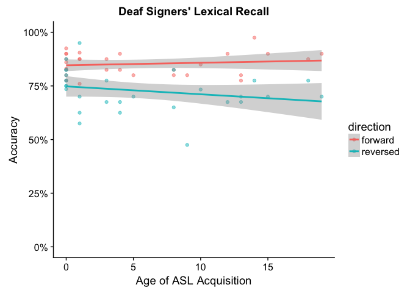

``` r
# All code below is for group analysis. 
# # Get means and SDs
# lex_deaf_mean <- lex_deaf %>%
#   group_by(maingroup, participant, direction) %>%
#   dplyr::summarize(acc = mean(acc,na.rm=TRUE)) %>%
#   group_by(maingroup, direction) %>%
#   dplyr::summarize(count = n(),
#                    mean = mean(acc),
#                    sd = sd(acc),
#                    se = sd/(sqrt(count))) %>%
#   ungroup() %>%
#   mutate(maingroup = factor(maingroup, levels = c("DeafNative","DeafEarly","DeafLate")))
# 
# ggplot(lex_deaf_mean, aes(x = maingroup, y = mean, color = direction)) +
#   geom_point(position = position_dodge(0.5)) +
#   geom_errorbar(aes(ymin = mean-se, ymax = mean+se), 
#                 width = 0.25, size = 1, position = position_dodge(0.5)) +
#   scale_y_continuous(limits = c(0,1), labels = scales::percent) +
#   xlab("") + ylab("Accuracy") + ggtitle("Deaf Signers' Lexical Recall")
# 
# lex_deaf_mean <- lex_deaf_mean %>%
#   select(maingroup, direction, mean, sd) %>%
#   gather(temp, score, mean:sd) %>%
#   unite(temp1, direction, temp, sep = ".") %>%
#   spread(temp1, score)
# 
# kable(lex_deaf_mean, digits=2) %>% kable_styling(bootstrap_options = c("striped", "hover", "condensed"))
```

Now is there a reversal effect, and are there AoASL differences? We'll do a LMM. The output below tells us:

1.  Strong reversal effect
2.  No AoASL effect or interactions

Moreover, this model is significantly better than a null random effects model, chi-sq = 51.846.

``` r
lex_deaf_m <- lmer(acc ~ direction * aoasl + (1|id) + (1|story), data = lex_deaf)
summary(lex_deaf_m)
```

    ## Linear mixed model fit by REML t-tests use Satterthwaite approximations
    ##   to degrees of freedom [lmerMod]
    ## Formula: acc ~ direction * aoasl + (1 | id) + (1 | story)
    ##    Data: lex_deaf
    ## 
    ## REML criterion at convergence: -181.9
    ## 
    ## Scaled residuals: 
    ##      Min       1Q   Median       3Q      Max 
    ## -2.69401 -0.64105  0.07292  0.55142  2.44279 
    ## 
    ## Random effects:
    ##  Groups   Name        Variance Std.Dev.
    ##  id       (Intercept) 0.002219 0.04710 
    ##  story    (Intercept) 0.001989 0.04460 
    ##  Residual             0.006712 0.08192 
    ## Number of obs: 112, groups:  id, 29; story, 4
    ## 
    ## Fixed effects:
    ##                           Estimate Std. Error         df t value Pr(>|t|)
    ## (Intercept)              0.8492698  0.0293844  6.9800000  28.902 1.58e-08
    ## directionreversed       -0.1066876  0.0212921 79.3100000  -5.011 3.22e-06
    ## aoasl                    0.0007405  0.0023308 54.2100000   0.318    0.752
    ## directionreversed:aoasl -0.0037996  0.0026109 79.5900000  -1.455    0.150
    ##                            
    ## (Intercept)             ***
    ## directionreversed       ***
    ## aoasl                      
    ## directionreversed:aoasl    
    ## ---
    ## Signif. codes:  0 '***' 0.001 '**' 0.01 '*' 0.05 '.' 0.1 ' ' 1
    ## 
    ## Correlation of Fixed Effects:
    ##             (Intr) drctnr aoasl 
    ## dirctnrvrsd -0.362              
    ## aoasl       -0.442  0.384       
    ## drctnrvrsd:  0.249 -0.686 -0.560

``` r
lex_deaf_null <- lmer(acc ~ 1 + (1|id) + (1|story), data = lex_deaf)
anova(lex_deaf_null,lex_deaf_m)
```

    ## refitting model(s) with ML (instead of REML)

    ## Data: lex_deaf
    ## Models:
    ## object: acc ~ 1 + (1 | id) + (1 | story)
    ## ..1: acc ~ direction * aoasl + (1 | id) + (1 | story)
    ##        Df     AIC     BIC  logLik deviance  Chisq Chi Df Pr(>Chisq)    
    ## object  4 -154.95 -144.07  81.475  -162.95                             
    ## ..1     7 -200.79 -181.76 107.397  -214.79 51.846      3  3.231e-11 ***
    ## ---
    ## Signif. codes:  0 '***' 0.001 '**' 0.01 '*' 0.05 '.' 0.1 ' ' 1

Next, we look at the "recovery" of the reversal effect, and how that recovery may differ based on AOA.

``` r
lex_deaf_recovery <- lex_deaf %>%
  select(participant, video, acc) %>%
  filter(video == "rv2" | video == "rv4") %>%
  spread(video, acc) %>%
  mutate(recov = rv4-rv2) %>%
  select(participant,recov) %>%
  left_join(subjectinfo, by="participant")

ggplot(lex_deaf_recovery, aes(x = aoasl, y = recov)) + 
  geom_point(alpha = 0.5, color = "#00BFC4") + 
  geom_smooth(method = "lm", color = "#00BFC4") +
  geom_hline(aes(yintercept = 0)) + 
  scale_y_continuous(labels = scales::percent) +
  ylab("Recovery") + xlab("Age of ASL Acquisition") +
  ggtitle("Recovery for Lexical Recall Task in Reversed Stories")
```

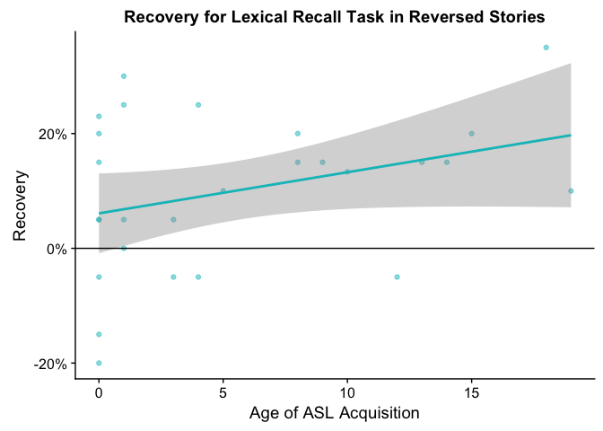

Is this significant? The simple regression below tells us no.

``` r
lex_deaf_recovery_m <- lm(recov ~ aoasl, data = lex_deaf_recovery)
summary(lex_deaf_recovery_m)
```

    ## 
    ## Call:
    ## lm(formula = recov ~ aoasl, data = lex_deaf_recovery)
    ## 
    ## Residuals:
    ##       Min        1Q    Median        3Q       Max 
    ## -0.260930 -0.082620 -0.004127  0.085394  0.231901 
    ## 
    ## Coefficients:
    ##             Estimate Std. Error t value Pr(>|t|)  
    ## (Intercept) 0.060930   0.033786   1.803   0.0834 .
    ## aoasl       0.007169   0.004130   1.736   0.0949 .
    ## ---
    ## Signif. codes:  0 '***' 0.001 '**' 0.01 '*' 0.05 '.' 0.1 ' ' 1
    ## 
    ## Residual standard error: 0.1296 on 25 degrees of freedom
    ##   (2 observations deleted due to missingness)
    ## Multiple R-squared:  0.1076, Adjusted R-squared:  0.07187 
    ## F-statistic: 3.013 on 1 and 25 DF,  p-value: 0.0949

### Summary

There was a strong reversal effect; across all Deaf signers, they showed considerably worse lexical recall scores when viewing reversed stories compared to forward stories. This effect did not change based on when the signers first acquired ASL. While there were trends suggesting that AoASL had an effect on how impacted by the reversal our Deaf signers were, these were not significant (p = 0.095).

Eye Gaze Behavior
-----------------

Now, what did their eye gaze behavior look like? The boxplot below suggests that three AOIs saw the widest range of variation: eyes, mouth, and chin. All other AOIs did not get high looking times and were not included in statistical analyses.

``` r
eyegaze_deaf <- data %>%
  filter(hearing == "Deaf") %>%
  filter(aoi != "mouthchin" & aoi != "moutheyes")

eyegaze_deaf %>%
# gg_deaf_aoi <- eyegaze_deaf %>%
  filter(aoi != "facechest" & aoi != "face" & aoi != "chest") %>%
  distinct() %>%
  ggplot(aes(x = aoi, y = percent, fill = direction)) + 
  geom_boxplot() +
  scale_y_continuous(limits = c(0,1), labels = scales::percent) +
  theme(axis.text.x = element_text(angle = 45,hjust = 1)) + 
  ylab("Percent Looking") + xlab("") + ggtitle("Deaf Signers' Eye Gaze")
```

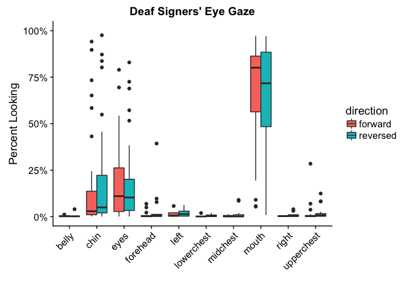

``` r
# gg_deaf_fcr <- eyegaze_deaf %>%
#   filter(aoi == "facechest") %>%
#   ggplot(aes(x = direction, y = percent, fill = direction)) + 
#   geom_boxplot() +
#   scale_y_continuous(limits = c(0,1)) +
#   theme(axis.text.x = element_text(angle = 45,hjust = 1)) + 
#   ylab("FCR") + xlab("") + ggtitle("Deaf Signers' Face-Chest Ratio")

#plot_grid(gg_deaf_aoi, gg_deaf_fc, labels = c("A", "B"))
```

Do we see AoA differences for eye gaze and reversal? Let's visualize and then run 3 models (eyes, mouth, chin). The charts and models tell us nothing was significant, and that eye gaze among deaf signers were not impacted by reversal, even when controlling for AoA.

``` r
eyegaze_deaf %>%
  filter(aoi == "eyes" | aoi == "mouth" | aoi == "chin") %>%
  mutate(aoi = factor(aoi, levels = c("forehead","eyes","mouth","chin"))) %>%
  ggplot(aes(x = aoasl, y = percent, color = direction)) +
  geom_point(alpha=.5) + geom_smooth(method="lm", se = FALSE) +
  facet_wrap("aoi") + ylab("Percent Looking") + xlab("Age of ASL Acquisition") +
  scale_y_continuous(labels = scales::percent)
```


Then we can show a nice heat map of where Deaf signers tend to look at.

``` r
# eye_deaf_heat <- eyegaze_deaf %>%
#   ungroup() %>%
#   filter(aoi != "left" & aoi != "right" & aoi != "facechest" & aoi != "face" & aoi != "chest") %>%
#   group_by(participant,direction,aoi) %>%
#   dplyr::summarize(percent = mean(percent, na.rm=TRUE)) %>%
#   group_by(direction,aoi) %>%
#   dplyr::summarize(percent = mean(percent, na.rm=TRUE)) %>%
#   ungroup() %>%
#   filter(!is.na(aoi)) %>%
#   mutate(aoi = factor(aoi,levels=c("belly","lowerchest","midchest",
#                                    "upperchest","chin","mouth","eyes","forehead")))

eye_deaf_heat <- eyegaze_deaf %>%
  ungroup() %>%
  filter(aoi != "left" & aoi != "right" & aoi != "facechest" & aoi != "face" & aoi != "chest") %>%
  group_by(maingroup,participant,direction,aoi) %>%
  dplyr::summarize(percent = mean(percent, na.rm=TRUE)) %>%
  group_by(maingroup,direction,aoi) %>%
  dplyr::summarize(percent = mean(percent, na.rm=TRUE)) %>%
  ungroup() %>%
  filter(!is.na(aoi)) %>%
  mutate(aoi = factor(aoi,levels=c("belly","lowerchest","midchest",
                                   "upperchest","chin","mouth","eyes","forehead")))

ggplot(eye_deaf_heat, aes(x = direction, y = aoi)) +
  geom_tile(aes(fill=percent),color="lightgray",na.rm=TRUE) + 
#  scale_fill_gradient(low = "lightblue",high = "steelblue") +
#  scale_fill_distiller(type="div", palette = "RdYlBu") +
  scale_fill_viridis(option = "viridis", direction=-1) +
  theme(axis.text.x=element_text(angle=45,hjust=1)) + facet_wrap("maingroup") +
  ylab("") + xlab("") + ggtitle("Deaf Signers' Eye Gaze Heat Map")
```

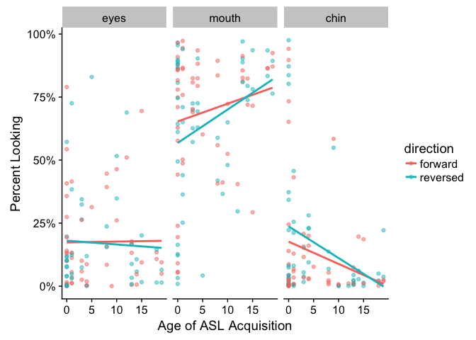

Models here. The LMMs tell us there was no significant effect of reversal or AOA on eye gaze, although there were trends for mouth and chin, as can be seen in the charts above.

``` r
eye_deaf_aoi <- eyegaze_deaf %>%
  spread(aoi,percent)

eye_deaf_eyes <- lmer(eyes ~ direction * aoasl + (1|id) + (1|story), data = eye_deaf_aoi)
eye_deaf_mouth <- lmer(mouth ~ direction * aoasl + (1|id) + (1|story), data = eye_deaf_aoi)
eye_deaf_chin <- lmer(chin ~ direction * aoasl + (1|id) + (1|story), data = eye_deaf_aoi)

summary(eye_deaf_eyes)
```

    ## Linear mixed model fit by REML t-tests use Satterthwaite approximations
    ##   to degrees of freedom [lmerMod]
    ## Formula: eyes ~ direction * aoasl + (1 | id) + (1 | story)
    ##    Data: eye_deaf_aoi
    ## 
    ## REML criterion at convergence: -16.2
    ## 
    ## Scaled residuals: 
    ##     Min      1Q  Median      3Q     Max 
    ## -1.3066 -0.5125 -0.2849  0.2182  3.4004 
    ## 
    ## Random effects:
    ##  Groups   Name        Variance Std.Dev.
    ##  id       (Intercept) 0.011082 0.10527 
    ##  story    (Intercept) 0.001227 0.03503 
    ##  Residual             0.029621 0.17211 
    ## Number of obs: 95, groups:  id, 29; story, 4
    ## 
    ## Fixed effects:
    ##                           Estimate Std. Error         df t value Pr(>|t|)
    ## (Intercept)              1.768e-01  4.652e-02  2.191e+01   3.802 0.000983
    ## directionreversed       -5.060e-03  4.912e-02  6.111e+01  -0.103 0.918297
    ## aoasl                    2.447e-04  5.084e-03  3.812e+01   0.048 0.961870
    ## directionreversed:aoasl -9.034e-05  5.655e-03  5.998e+01  -0.016 0.987307
    ##                            
    ## (Intercept)             ***
    ## directionreversed          
    ## aoasl                      
    ## directionreversed:aoasl    
    ## ---
    ## Signif. codes:  0 '***' 0.001 '**' 0.01 '*' 0.05 '.' 0.1 ' ' 1
    ## 
    ## Correlation of Fixed Effects:
    ##             (Intr) drctnr aoasl 
    ## dirctnrvrsd -0.501              
    ## aoasl       -0.631  0.365       
    ## drctnrvrsd:  0.351 -0.681 -0.541

``` r
summary(eye_deaf_mouth)
```

    ## Linear mixed model fit by REML t-tests use Satterthwaite approximations
    ##   to degrees of freedom [lmerMod]
    ## Formula: mouth ~ direction * aoasl + (1 | id) + (1 | story)
    ##    Data: eye_deaf_aoi
    ## 
    ## REML criterion at convergence: 6.8
    ## 
    ## Scaled residuals: 
    ##     Min      1Q  Median      3Q     Max 
    ## -2.4850 -0.4331  0.2075  0.5511  1.7834 
    ## 
    ## Random effects:
    ##  Groups   Name        Variance Std.Dev.
    ##  id       (Intercept) 0.035260 0.18778 
    ##  story    (Intercept) 0.001923 0.04385 
    ##  Residual             0.031490 0.17745 
    ## Number of obs: 104, groups:  id, 29; story, 4
    ## 
    ## Fixed effects:
    ##                          Estimate Std. Error        df t value Pr(>|t|)
    ## (Intercept)              0.640182   0.061538 27.350000  10.403 5.22e-11
    ## directionreversed       -0.080567   0.046962 70.390000  -1.716   0.0906
    ## aoasl                    0.007085   0.006965 35.370000   1.017   0.3160
    ## directionreversed:aoasl  0.004861   0.005657 71.740000   0.859   0.3931
    ##                            
    ## (Intercept)             ***
    ## directionreversed       .  
    ## aoasl                      
    ## directionreversed:aoasl    
    ## ---
    ## Signif. codes:  0 '***' 0.001 '**' 0.01 '*' 0.05 '.' 0.1 ' ' 1
    ## 
    ## Correlation of Fixed Effects:
    ##             (Intr) drctnr aoasl 
    ## dirctnrvrsd -0.365              
    ## aoasl       -0.627  0.260       
    ## drctnrvrsd:  0.245 -0.661 -0.397

``` r
summary(eye_deaf_chin)
```

    ## Linear mixed model fit by REML t-tests use Satterthwaite approximations
    ##   to degrees of freedom [lmerMod]
    ## Formula: chin ~ direction * aoasl + (1 | id) + (1 | story)
    ##    Data: eye_deaf_aoi
    ## 
    ## REML criterion at convergence: -39.1
    ## 
    ## Scaled residuals: 
    ##     Min      1Q  Median      3Q     Max 
    ## -2.4737 -0.3721 -0.0980  0.1231  3.7633 
    ## 
    ## Random effects:
    ##  Groups   Name        Variance  Std.Dev.
    ##  id       (Intercept) 0.0369711 0.19228 
    ##  story    (Intercept) 0.0004848 0.02202 
    ##  Residual             0.0172720 0.13142 
    ## Number of obs: 103, groups:  id, 29; story, 4
    ## 
    ## Fixed effects:
    ##                          Estimate Std. Error        df t value Pr(>|t|)   
    ## (Intercept)              0.177225   0.055304 30.810000   3.205  0.00314 **
    ## directionreversed        0.067032   0.034931 69.770000   1.919  0.05908 . 
    ## aoasl                   -0.008298   0.006562 31.830000  -1.265  0.21519   
    ## directionreversed:aoasl -0.004323   0.004173 71.740000  -1.036  0.30365   
    ## ---
    ## Signif. codes:  0 '***' 0.001 '**' 0.01 '*' 0.05 '.' 0.1 ' ' 1
    ## 
    ## Correlation of Fixed Effects:
    ##             (Intr) drctnr aoasl 
    ## dirctnrvrsd -0.296              
    ## aoasl       -0.660  0.202       
    ## drctnrvrsd:  0.202 -0.656 -0.311

### Summary

Generally, Deaf signers focus most on the mouth. There is a trend (but not significant) towards greater focus on the mouth and less on the chin in reversed stories for signers with late AoASL.

Bivariate Correlations; Eye Gaze Effect on Accuracy
---------------------------------------------------

Correlations below. They tell us there is no correlation between AoASL and accuracy, or between AoASL and any eye gaze behavior, or between eye gaze behavior and accuracy. This may also be something we **should not even report** because we failed to show any effect of AoASL or reversal on eye behavior, so why bother doing this, from a stats perspective.

``` r
lexeye_deaf <- data %>%
  filter(hearing == "Deaf") %>%
  group_by(participant, direction, aoi) %>%
  dplyr::summarize(acc = mean(acc, na.rm = TRUE),
                   percent = mean(percent, na.rm = TRUE)) %>%
  ungroup() %>%
  spread(aoi, percent) %>%
  left_join(subjectinfo, by = "participant")

lexeye_deaf_fw <- lexeye_deaf %>%
  filter(direction == "forward") %>%
  select(aoasl, signyrs, acc, eyes, mouth, chin)

lexeye_deaf_rv <- lexeye_deaf %>%
  filter(direction == "reversed") %>%
  select(aoasl, signyrs, acc, eyes, mouth, chin)

corstarsl(lexeye_deaf_fw)
```

    ## Loading required package: Hmisc

    ## Loading required package: lattice

    ## Loading required package: survival

    ## Loading required package: Formula

    ## 
    ## Attaching package: 'Hmisc'

    ## The following objects are masked from 'package:xtable':
    ## 
    ##     label, label<-

    ## The following objects are masked from 'package:dplyr':
    ## 
    ##     combine, src, summarize

    ## The following objects are masked from 'package:base':
    ## 
    ##     format.pval, round.POSIXt, trunc.POSIXt, units

    ##            aoasl signyrs    acc     eyes    mouth
    ## aoasl                                            
    ## signyrs -0.50**                                  
    ## acc        0.11   0.39*                          
    ## eyes       0.02    0.03   0.14                   
    ## mouth      0.17    0.09   0.11  -0.49**          
    ## chin      -0.24   -0.13  -0.28    -0.31  -0.67***

``` r
corstarsl(lexeye_deaf_rv)
```

    ##            aoasl signyrs    acc     eyes    mouth
    ## aoasl                                            
    ## signyrs -0.50**                                  
    ## acc       -0.16   -0.03                          
    ## eyes       0.02    0.10  -0.12                   
    ## mouth      0.30    0.01   0.12  -0.61**          
    ## chin      -0.34   -0.04  -0.03    -0.37  -0.72***

I could run models here - the code is below, but commented out - I think we have enough at this point.

Deaf Signers Summary
--------------------

1.  There is a reversal effect on accuracy, yes.
2.  There appears to be no effect of reversal on eye gaze behavior, though.
3.  There appears to be no correlation between eye gaze and accuracy, for either forward or reversed stories.
4.  Visualizations do repeatedly suggest subtle AoASL effects. Later signers appear to focus more on the mouth, and this effect is pronounced during reversed stories.

Late (Deaf & Hearing) Signers
=============================

Then we add HearingLate as a comparison group with DeafLate, to answer the "deaf/hearing" question. Now we have a little problem here, signyears and age are both different so we'll need to add those as covariates (or maybe not). But we're not using AoASL anyway, and now we can add the deaf/hearing factor.

Participants
------------

We need to do t-tests on all their characteristics to see which are different, since we're sort of "matching" the deaf and hearing late signers.

``` r
groupmeans %>%
  filter(maingroup != "DeafNative" & maingroup != "DeafEarly" & maingroup != "HearingNovice") %>%
  kable(digits=1) %>% kable_styling(bootstrap_options = c("striped", "hover", "condensed"))
```

<table class="table table-striped table-hover table-condensed" style="margin-left: auto; margin-right: auto;">
<thead>
<tr>
<th style="text-align:left;">
maingroup
</th>
<th style="text-align:right;">
n
</th>
<th style="text-align:right;">
age.m
</th>
<th style="text-align:right;">
age.sd
</th>
<th style="text-align:right;">
selfrate.m
</th>
<th style="text-align:right;">
selfrate.sd
</th>
<th style="text-align:right;">
signyrs.m
</th>
<th style="text-align:right;">
signyrs.sd
</th>
<th style="text-align:right;">
aoasl.m
</th>
<th style="text-align:right;">
aoasl.sd
</th>
</tr>
</thead>
<tbody>
<tr>
<td style="text-align:left;">
DeafLate
</td>
<td style="text-align:right;">
8
</td>
<td style="text-align:right;">
38.0
</td>
<td style="text-align:right;">
5.9
</td>
<td style="text-align:right;">
5.0
</td>
<td style="text-align:right;">
0.0
</td>
<td style="text-align:right;">
23.2
</td>
<td style="text-align:right;">
5.3
</td>
<td style="text-align:right;">
14.2
</td>
<td style="text-align:right;">
3.0
</td>
</tr>
<tr>
<td style="text-align:left;">
HearingLate
</td>
<td style="text-align:right;">
12
</td>
<td style="text-align:right;">
28.9
</td>
<td style="text-align:right;">
6.2
</td>
<td style="text-align:right;">
4.6
</td>
<td style="text-align:right;">
0.5
</td>
<td style="text-align:right;">
11.8
</td>
<td style="text-align:right;">
4.8
</td>
<td style="text-align:right;">
17.2
</td>
<td style="text-align:right;">
3.4
</td>
</tr>
</tbody>
</table>
The t-test results tell us:

1.  Age is significantly different (HearingLate are 9 yrs younger, p = 0.004)
2.  AoASL is the same, just barely (HearingLate tend to acquire 3 years older, p = 0.058)
3.  Self-Rating is different, just barely (HearingLate tend to rate 0.38 lower, p = 0.043)
4.  Signing Yrs is significantly different (HearingLate 11 yrs less signing, p &lt; 0.001)

``` r
lex_late <- cleanlexdata %>%
  filter(aoagroup == "Late") %>%
  select(id:acc) %>%
  distinct()

lex_late_subjects <- lex_late %>%
  select(participant, hearing, age, aoasl, selfrate, signyrs) %>%
  distinct()

summary(lm(age ~ hearing, data = lex_late_subjects))
```

    ## 
    ## Call:
    ## lm(formula = age ~ hearing, data = lex_late_subjects)
    ## 
    ## Residuals:
    ##      Min       1Q   Median       3Q      Max 
    ## -12.0000  -3.1875   0.5417   4.0208  10.0833 
    ## 
    ## Coefficients:
    ##                Estimate Std. Error t value Pr(>|t|)    
    ## (Intercept)      38.000      2.146  17.711 7.77e-13 ***
    ## hearingHearing   -9.083      2.770  -3.279  0.00417 ** 
    ## ---
    ## Signif. codes:  0 '***' 0.001 '**' 0.01 '*' 0.05 '.' 0.1 ' ' 1
    ## 
    ## Residual standard error: 6.069 on 18 degrees of freedom
    ## Multiple R-squared:  0.374,  Adjusted R-squared:  0.3392 
    ## F-statistic: 10.75 on 1 and 18 DF,  p-value: 0.004168

``` r
summary(lm(aoasl ~ hearing, data = lex_late_subjects))
```

    ## 
    ## Call:
    ## lm(formula = aoasl ~ hearing, data = lex_late_subjects)
    ## 
    ## Residuals:
    ##    Min     1Q Median     3Q    Max 
    ##  -5.25  -2.25   0.25   2.00   4.75 
    ## 
    ## Coefficients:
    ##                Estimate Std. Error t value Pr(>|t|)    
    ## (Intercept)      14.250      1.148  12.414 2.92e-10 ***
    ## hearingHearing    3.000      1.482   2.024    0.058 .  
    ## ---
    ## Signif. codes:  0 '***' 0.001 '**' 0.01 '*' 0.05 '.' 0.1 ' ' 1
    ## 
    ## Residual standard error: 3.247 on 18 degrees of freedom
    ## Multiple R-squared:  0.1854, Adjusted R-squared:  0.1402 
    ## F-statistic: 4.098 on 1 and 18 DF,  p-value: 0.05803

``` r
summary(lm(selfrate ~ hearing, data = lex_late_subjects))
```

    ## 
    ## Call:
    ## lm(formula = selfrate ~ hearing, data = lex_late_subjects)
    ## 
    ## Residuals:
    ##      Min       1Q   Median       3Q      Max 
    ## -0.62500 -0.03125  0.00000  0.37500  0.37500 
    ## 
    ## Coefficients:
    ##                Estimate Std. Error t value Pr(>|t|)    
    ## (Intercept)      5.0000     0.1334  37.482   <2e-16 ***
    ## hearingHearing  -0.3750     0.1722  -2.177    0.043 *  
    ## ---
    ## Signif. codes:  0 '***' 0.001 '**' 0.01 '*' 0.05 '.' 0.1 ' ' 1
    ## 
    ## Residual standard error: 0.3773 on 18 degrees of freedom
    ## Multiple R-squared:  0.2085, Adjusted R-squared:  0.1645 
    ## F-statistic: 4.741 on 1 and 18 DF,  p-value: 0.04299

``` r
summary(lm(signyrs ~ hearing, data = lex_late_subjects))
```

    ## 
    ## Call:
    ## lm(formula = signyrs ~ hearing, data = lex_late_subjects)
    ## 
    ## Residuals:
    ##     Min      1Q  Median      3Q     Max 
    ## -10.250  -2.375  -0.500   4.125   8.250 
    ## 
    ## Coefficients:
    ##                Estimate Std. Error t value Pr(>|t|)    
    ## (Intercept)      23.250      1.775  13.098 1.22e-10 ***
    ## hearingHearing  -11.500      2.292  -5.018 8.93e-05 ***
    ## ---
    ## Signif. codes:  0 '***' 0.001 '**' 0.01 '*' 0.05 '.' 0.1 ' ' 1
    ## 
    ## Residual standard error: 5.021 on 18 degrees of freedom
    ## Multiple R-squared:  0.5832, Adjusted R-squared:   0.56 
    ## F-statistic: 25.18 on 1 and 18 DF,  p-value: 8.926e-05

Lexical Recall
--------------

How do deaf and hearing late signers compare on the lexical recall task? Let's visualize first.

``` r
lex_late %>%
  ggplot(aes(x = hearing, y = acc, fill = direction)) + 
  geom_boxplot() +
  scale_y_continuous(limits = c(0,1), labels = scales::percent) +
  ylab("Accuracy") + xlab("") + ggtitle("Late Signers' Lexical Accuracy")
```

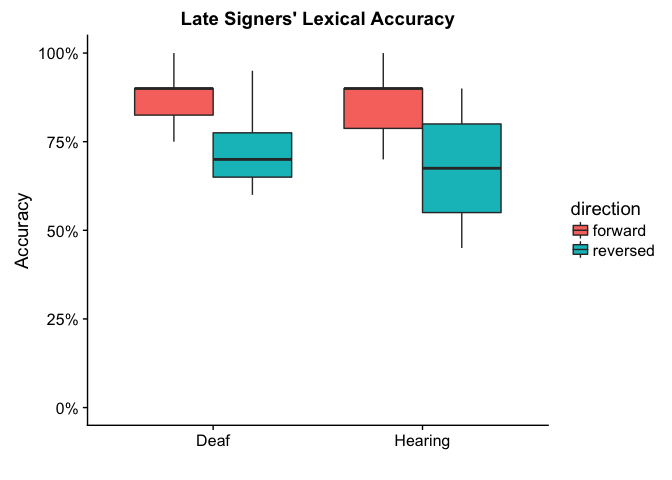

And now the LMM. It tells us that while there's a reversal effect, it's not significantly different for deaf or hearing late signers.

``` r
lex_late_m <- lmer(acc ~ direction * hearing + (1|id) + (1|story), data = lex_late)
summary(lex_late_m)
```

    ## Linear mixed model fit by REML t-tests use Satterthwaite approximations
    ##   to degrees of freedom [lmerMod]
    ## Formula: acc ~ direction * hearing + (1 | id) + (1 | story)
    ##    Data: lex_late
    ## 
    ## REML criterion at convergence: -115
    ## 
    ## Scaled residuals: 
    ##      Min       1Q   Median       3Q      Max 
    ## -2.15566 -0.59835  0.02265  0.45989  2.27586 
    ## 
    ## Random effects:
    ##  Groups   Name        Variance Std.Dev.
    ##  id       (Intercept) 0.001168 0.03418 
    ##  story    (Intercept) 0.001695 0.04117 
    ##  Residual             0.008985 0.09479 
    ## Number of obs: 78, groups:  id, 20; story, 4
    ## 
    ## Fixed effects:
    ##                                   Estimate Std. Error        df t value
    ## (Intercept)                       0.873426   0.034408 12.730000  25.385
    ## directionreversed                -0.156018   0.035247 54.220000  -4.426
    ## hearingHearing                   -0.006548   0.034986 43.800000  -0.187
    ## directionreversed:hearingHearing -0.025239   0.044263 53.390000  -0.570
    ##                                  Pr(>|t|)    
    ## (Intercept)                      2.76e-12 ***
    ## directionreversed                4.67e-05 ***
    ## hearingHearing                      0.852    
    ## directionreversed:hearingHearing    0.571    
    ## ---
    ## Signif. codes:  0 '***' 0.001 '**' 0.01 '*' 0.05 '.' 0.1 ' ' 1
    ## 
    ## Correlation of Fixed Effects:
    ##             (Intr) drctnr hrngHr
    ## dirctnrvrsd -0.512              
    ## hearingHrng -0.627  0.495       
    ## drctnrvrs:H  0.401 -0.783 -0.633

### Summary

There is a reversal effect, but it doesn't change whether the signer is deaf or hearing. Reversal effects on lexical accuracy seems to be about proficiency - all Deaf signers and all Hearing Late signers are proficient so they were similar.

Eye Gaze Behavior
-----------------

Now let's compare eye gaze behavior in this population. Let's go ahead and noarrow down the AOIs. I can just write that we observed higher percentage looking for the forehead AOI in this group, so we included this AOI. First let's see how deaf and hearing late signers' AOI compared.

``` r
eye_late <- data %>%
  filter(aoagroup == "Late")

eye_late %>%
  filter(aoi == "forehead" | aoi == "eyes" | aoi == "mouth" | aoi == "chin") %>%
  mutate(aoi = factor(aoi, levels = c("forehead","eyes","mouth","chin"))) %>%
  ggplot(aes(x = hearing, y = percent, fill = direction)) +
  geom_boxplot() +
  facet_grid(.~aoi) + ylab("Percent Looking") + xlab("") +
  scale_y_continuous(labels = scales::percent) + ggtitle("Late Signers' Eye Gaze")
```

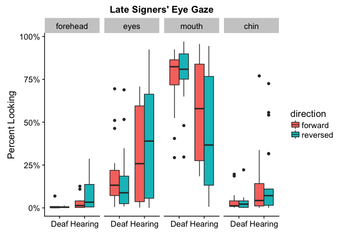

``` r
# eye_late %>%
#   filter(aoi != "facechest" & aoi != "face" & aoi != "chest") %>%
#   distinct() %>%
#   ggplot(aes(x = aoi, y = percent, fill = direction)) + 
#   geom_boxplot() +
#   scale_y_continuous(limits = c(0,1), labels = scales::percent) +
#   theme(axis.text.x = element_text(angle = 45,hjust = 1)) + 
#   ylab("Percent Looking") + xlab("") + ggtitle("Deaf Signers' Eye Gaze") + 
#   facet_grid(.~hearing)
```

Let's visualize this as a heat map too, before we start running models. It looks like hearing signers are pretty different, right?

``` r
eye_late_heat <- eye_late %>%
  ungroup() %>%
  filter(aoi != "left" & aoi != "right" & aoi != "facechest" & aoi != "face" & aoi != "chest") %>%
  group_by(hearing,participant,direction,aoi) %>%
  dplyr::summarize(percent = mean(percent, na.rm=TRUE)) %>%
  group_by(hearing,direction,aoi) %>%
  dplyr::summarize(percent = mean(percent, na.rm=TRUE)) %>%
  ungroup() %>%
  filter(!is.na(aoi)) %>%
  mutate(aoi = factor(aoi,levels=c("belly","lowerchest","midchest",
                                   "upperchest","chin","mouth","eyes","forehead")))

ggplot(eye_late_heat, aes(x = direction, y = aoi)) +
  geom_tile(aes(fill=percent),color="lightgray",na.rm=TRUE) + 
#  scale_fill_gradient(low = "lightblue",high = "steelblue") +
#  scale_fill_distiller(type="div", palette = "RdYlBu") +
  scale_fill_viridis(option = "viridis", direction=-1) +
  theme(axis.text.x=element_text(angle=45,hjust=1)) + facet_wrap("hearing") +
  ylab("") + xlab("") + ggtitle("Late Signers' Eye Gaze Heat Map")
```

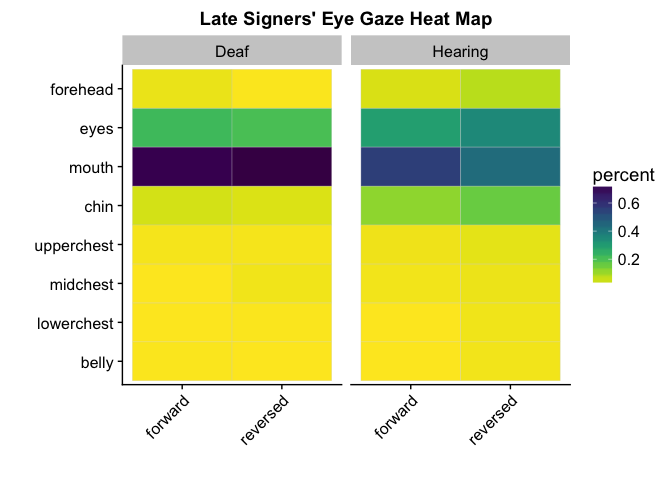

Let's run models to see if there were significant differences based on hearing. And the answer is, nope! Except a significant Direction X Hearing interaction for mouth AOI (p = 0.01).

``` r
eye_late_aoi <- eye_late %>%
  spread(aoi,percent) 

eye_late_forehead <- lmer(forehead ~ direction * hearing + (1|id) + (1|story), data = eye_late_aoi)
eye_late_eyes <- lmer(eyes ~ direction * hearing + (1|id) + (1|story), data = eye_late_aoi)
eye_late_mouth <- lmer(mouth ~ direction * hearing + (1|id) + (1|story), data = eye_late_aoi)
eye_late_chin <- lmer(chin ~ direction * hearing + (1|id) + (1|story), data = eye_late_aoi)

summary(eye_late_forehead)
```

    ## Linear mixed model fit by REML t-tests use Satterthwaite approximations
    ##   to degrees of freedom [lmerMod]
    ## Formula: forehead ~ direction * hearing + (1 | id) + (1 | story)
    ##    Data: eye_late_aoi
    ## 
    ## REML criterion at convergence: -69.5
    ## 
    ## Scaled residuals: 
    ##     Min      1Q  Median      3Q     Max 
    ## -1.0762 -0.6074 -0.1627  0.2876  2.9378 
    ## 
    ## Random effects:
    ##  Groups   Name        Variance  Std.Dev.
    ##  id       (Intercept) 0.0003765 0.019404
    ##  story    (Intercept) 0.0000374 0.006115
    ##  Residual             0.0040285 0.063471
    ## Number of obs: 34, groups:  id, 14; story, 4
    ## 
    ## Fixed effects:
    ##                                   Estimate Std. Error        df t value
    ## (Intercept)                       0.015798   0.030330 19.435000   0.521
    ## directionreversed                -0.009453   0.038780 22.205000  -0.244
    ## hearingHearing                    0.014643   0.037197 21.981000   0.394
    ## directionreversed:hearingHearing  0.057379   0.047549 14.599000   1.207
    ##                                  Pr(>|t|)
    ## (Intercept)                         0.608
    ## directionreversed                   0.810
    ## hearingHearing                      0.698
    ## directionreversed:hearingHearing    0.247
    ## 
    ## Correlation of Fixed Effects:
    ##             (Intr) drctnr hrngHr
    ## dirctnrvrsd -0.704              
    ## hearingHrng -0.811  0.579       
    ## drctnrvrs:H  0.579 -0.822 -0.713

``` r
summary(eye_late_eyes)
```

    ## Linear mixed model fit by REML t-tests use Satterthwaite approximations
    ##   to degrees of freedom [lmerMod]
    ## Formula: eyes ~ direction * hearing + (1 | id) + (1 | story)
    ##    Data: eye_late_aoi
    ## 
    ## REML criterion at convergence: -13.8
    ## 
    ## Scaled residuals: 
    ##      Min       1Q   Median       3Q      Max 
    ## -3.08995 -0.32778 -0.08788  0.34493  2.96589 
    ## 
    ## Random effects:
    ##  Groups   Name        Variance Std.Dev.
    ##  id       (Intercept) 0.05650  0.2377  
    ##  story    (Intercept) 0.00000  0.0000  
    ##  Residual             0.02119  0.1456  
    ## Number of obs: 69, groups:  id, 20; story, 4
    ## 
    ## Fixed effects:
    ##                                  Estimate Std. Error       df t value
    ## (Intercept)                       0.21846    0.09224 20.30000   2.368
    ## directionreversed                -0.03141    0.05315 46.67000  -0.591
    ## hearingHearing                    0.06898    0.11972 20.71000   0.576
    ## directionreversed:hearingHearing  0.08429    0.07124 46.99000   1.183
    ##                                  Pr(>|t|)  
    ## (Intercept)                        0.0279 *
    ## directionreversed                  0.5574  
    ## hearingHearing                     0.5707  
    ## directionreversed:hearingHearing   0.2427  
    ## ---
    ## Signif. codes:  0 '***' 0.001 '**' 0.01 '*' 0.05 '.' 0.1 ' ' 1
    ## 
    ## Correlation of Fixed Effects:
    ##             (Intr) drctnr hrngHr
    ## dirctnrvrsd -0.288              
    ## hearingHrng -0.770  0.222       
    ## drctnrvrs:H  0.215 -0.746 -0.288

``` r
summary(eye_late_mouth)
```

    ## Linear mixed model fit by REML t-tests use Satterthwaite approximations
    ##   to degrees of freedom [lmerMod]
    ## Formula: mouth ~ direction * hearing + (1 | id) + (1 | story)
    ##    Data: eye_late_aoi
    ## 
    ## REML criterion at convergence: -15.4
    ## 
    ## Scaled residuals: 
    ##      Min       1Q   Median       3Q      Max 
    ## -2.53072 -0.40448  0.06416  0.47355  2.79979 
    ## 
    ## Random effects:
    ##  Groups   Name        Variance  Std.Dev.
    ##  id       (Intercept) 5.691e-02 0.23857 
    ##  story    (Intercept) 3.422e-05 0.00585 
    ##  Residual             2.196e-02 0.14819 
    ## Number of obs: 75, groups:  id, 20; story, 4
    ## 
    ## Fixed effects:
    ##                                  Estimate Std. Error       df t value
    ## (Intercept)                       0.72100    0.09285 20.98000   7.765
    ## directionreversed                 0.03530    0.05415 52.60000   0.652
    ## hearingHearing                   -0.15211    0.11990 21.18000  -1.269
    ## directionreversed:hearingHearing -0.17336    0.07015 50.70000  -2.471
    ##                                  Pr(>|t|)    
    ## (Intercept)                      1.33e-07 ***
    ## directionreversed                  0.5173    
    ## hearingHearing                     0.2183    
    ## directionreversed:hearingHearing   0.0169 *  
    ## ---
    ## Signif. codes:  0 '***' 0.001 '**' 0.01 '*' 0.05 '.' 0.1 ' ' 1
    ## 
    ## Correlation of Fixed Effects:
    ##             (Intr) drctnr hrngHr
    ## dirctnrvrsd -0.292              
    ## hearingHrng -0.774  0.226       
    ## drctnrvrs:H  0.225 -0.771 -0.296

``` r
summary(eye_late_chin)
```

    ## Linear mixed model fit by REML t-tests use Satterthwaite approximations
    ##   to degrees of freedom [lmerMod]
    ## Formula: chin ~ direction * hearing + (1 | id) + (1 | story)
    ##    Data: eye_late_aoi
    ## 
    ## REML criterion at convergence: -86
    ## 
    ## Scaled residuals: 
    ##     Min      1Q  Median      3Q     Max 
    ## -2.1111 -0.3847 -0.0940  0.0669  3.2308 
    ## 
    ## Random effects:
    ##  Groups   Name        Variance Std.Dev.
    ##  id       (Intercept) 0.015628 0.12501 
    ##  story    (Intercept) 0.000000 0.00000 
    ##  Residual             0.008624 0.09287 
    ## Number of obs: 74, groups:  id, 20; story, 4
    ## 
    ## Fixed effects:
    ##                                   Estimate Std. Error        df t value
    ## (Intercept)                       0.041207   0.050407 23.110000   0.817
    ## directionreversed                -0.007504   0.033910 52.350000  -0.221
    ## hearingHearing                    0.069773   0.065314 23.420000   1.068
    ## directionreversed:hearingHearing  0.043074   0.044213 52.530000   0.974
    ##                                  Pr(>|t|)
    ## (Intercept)                         0.422
    ## directionreversed                   0.826
    ## hearingHearing                      0.296
    ## directionreversed:hearingHearing    0.334
    ## 
    ## Correlation of Fixed Effects:
    ##             (Intr) drctnr hrngHr
    ## dirctnrvrsd -0.336              
    ## hearingHrng -0.772  0.260       
    ## drctnrvrs:H  0.258 -0.767 -0.346

### Summary

Eye gaze data shows there is no significant effect of reversal on either deaf or hearing people's eye gaze behavior, with the exception of the Mouth AOI, where we observed a significant direction x hearing interaction. Late deaf signers, which we already know have a propensity to fixate more strongly on the mouth during reversed stories, are different from late hearing signers, which show more scattered patterns as evidenced by the heat map.

Eye Gaze Predicting Accuracy
----------------------------

Next we asked...do eye gaze behavior predict accuracy? We can't really do correlations because we're comparing groups, so we'll just skip to the LMMs. Again, there should be no point in doing this because we've shown that eye gaze behavior doesn't change based on reversal or based on deaf/hearing. So the code below shouldn't run. But if it did, it would tell us the only AOI that MAY have an effect is the chin, p = 0.09 such that increased chin % translates into better accuracy, which doesn't really make sense.

Late Signers Summary
--------------------

1.  There is a reversal effect on accuracy, yes.
2.  There appears to be no effect of reversal on eye gaze behavior, though.
3.  There appears to be no relationship between eye gaze and accuracy, for either forward or reversed stories.
4.  Visualizations do repeatedly suggest subtle AoASL effects. Hearing late signers show more scattered looking in reversed stories compared to deaf late signers who appear to focus more on the mouth.

Hearing (Late & Novice) Signers
===============================

Now to directly compare HearingLate and HearingNovice - for proficiency effects.

Participants
------------

Novice signers, on average, have been signing for 2-3 years. Let's repeat the participants table here:

``` r
groupmeans %>%
  filter(maingroup != "DeafNative" & maingroup != "DeafEarly" & maingroup != "DeafLate") %>%
  kable(digits=1) %>% kable_styling(bootstrap_options = c("striped", "hover", "condensed"))
```

<table class="table table-striped table-hover table-condensed" style="margin-left: auto; margin-right: auto;">
<thead>
<tr>
<th style="text-align:left;">
maingroup
</th>
<th style="text-align:right;">
n
</th>
<th style="text-align:right;">
age.m
</th>
<th style="text-align:right;">
age.sd
</th>
<th style="text-align:right;">
selfrate.m
</th>
<th style="text-align:right;">
selfrate.sd
</th>
<th style="text-align:right;">
signyrs.m
</th>
<th style="text-align:right;">
signyrs.sd
</th>
<th style="text-align:right;">
aoasl.m
</th>
<th style="text-align:right;">
aoasl.sd
</th>
</tr>
</thead>
<tbody>
<tr>
<td style="text-align:left;">
HearingLate
</td>
<td style="text-align:right;">
12
</td>
<td style="text-align:right;">
28.9
</td>
<td style="text-align:right;">
6.2
</td>
<td style="text-align:right;">
4.6
</td>
<td style="text-align:right;">
0.5
</td>
<td style="text-align:right;">
11.8
</td>
<td style="text-align:right;">
4.8
</td>
<td style="text-align:right;">
17.2
</td>
<td style="text-align:right;">
3.4
</td>
</tr>
<tr>
<td style="text-align:left;">
HearingNovice
</td>
<td style="text-align:right;">
11
</td>
<td style="text-align:right;">
20.2
</td>
<td style="text-align:right;">
1.3
</td>
<td style="text-align:right;">
3.0
</td>
<td style="text-align:right;">
0.7
</td>
<td style="text-align:right;">
2.4
</td>
<td style="text-align:right;">
1.0
</td>
<td style="text-align:right;">
17.6
</td>
<td style="text-align:right;">
1.8
</td>
</tr>
</tbody>
</table>
The t-test results tell us:

1.  Age is significantly different (HearingNovice are 8 yrs younger, p &lt; 0.001)
2.  AoASL is the same.
3.  Self-Rating is significantly different (HearingNovice tend to rate 1.6 lower, p &lt; 0.001)
4.  Signing Yrs is significantly different (HearingLate 9 yrs less signing, p &lt; 0.001)

``` r
lex_hearing <- cleanlexdata %>%
  filter(hearing == "Hearing") %>%
  select(id:acc) %>%
  distinct()

lex_hearing_subjects <- lex_hearing %>%
  select(participant, aoagroup, age, aoasl, selfrate, signyrs) %>%
  distinct()

summary(lm(age ~ aoagroup, data = lex_hearing_subjects))
```

    ## 
    ## Call:
    ## lm(formula = age ~ aoagroup, data = lex_hearing_subjects)
    ## 
    ## Residuals:
    ##      Min       1Q   Median       3Q      Max 
    ## -10.9167  -1.2500   0.0833   1.4167  10.0833 
    ## 
    ## Coefficients:
    ##                Estimate Std. Error t value Pr(>|t|)    
    ## (Intercept)      28.917      1.320   21.90 6.06e-16 ***
    ## aoagroupNovice   -8.667      1.909   -4.54 0.000179 ***
    ## ---
    ## Signif. codes:  0 '***' 0.001 '**' 0.01 '*' 0.05 '.' 0.1 ' ' 1
    ## 
    ## Residual standard error: 4.574 on 21 degrees of freedom
    ## Multiple R-squared:  0.4953, Adjusted R-squared:  0.4712 
    ## F-statistic: 20.61 on 1 and 21 DF,  p-value: 0.0001789

``` r
summary(lm(aoasl ~ aoagroup, data = lex_hearing_subjects))
```

    ## 
    ## Call:
    ## lm(formula = aoasl ~ aoagroup, data = lex_hearing_subjects)
    ## 
    ## Residuals:
    ##     Min      1Q  Median      3Q     Max 
    ## -5.2500 -1.9432  0.3636  1.7500  4.7500 
    ## 
    ## Coefficients:
    ##                Estimate Std. Error t value Pr(>|t|)    
    ## (Intercept)     17.2500     0.7938  21.731 7.09e-16 ***
    ## aoagroupNovice   0.3864     1.1479   0.337     0.74    
    ## ---
    ## Signif. codes:  0 '***' 0.001 '**' 0.01 '*' 0.05 '.' 0.1 ' ' 1
    ## 
    ## Residual standard error: 2.75 on 21 degrees of freedom
    ## Multiple R-squared:  0.005366,   Adjusted R-squared:  -0.042 
    ## F-statistic: 0.1133 on 1 and 21 DF,  p-value: 0.7398

``` r
summary(lm(selfrate ~ aoagroup, data = lex_hearing_subjects))
```

    ## 
    ## Call:
    ## lm(formula = selfrate ~ aoagroup, data = lex_hearing_subjects)
    ## 
    ## Residuals:
    ##      Min       1Q   Median       3Q      Max 
    ## -1.04545 -0.37500 -0.04545  0.37500  0.95455 
    ## 
    ## Coefficients:
    ##                Estimate Std. Error t value Pr(>|t|)    
    ## (Intercept)      4.6250     0.1641  28.176  < 2e-16 ***
    ## aoagroupNovice  -1.5795     0.2374  -6.655 1.38e-06 ***
    ## ---
    ## Signif. codes:  0 '***' 0.001 '**' 0.01 '*' 0.05 '.' 0.1 ' ' 1
    ## 
    ## Residual standard error: 0.5686 on 21 degrees of freedom
    ## Multiple R-squared:  0.6783, Adjusted R-squared:  0.663 
    ## F-statistic: 44.29 on 1 and 21 DF,  p-value: 1.377e-06

``` r
summary(lm(signyrs ~ aoagroup, data = lex_hearing_subjects))
```

    ## 
    ## Call:
    ## lm(formula = signyrs ~ aoagroup, data = lex_hearing_subjects)
    ## 
    ## Residuals:
    ##     Min      1Q  Median      3Q     Max 
    ## -6.7500 -1.3909 -0.4409  1.0591  8.2500 
    ## 
    ## Coefficients:
    ##                Estimate Std. Error t value Pr(>|t|)    
    ## (Intercept)      11.750      1.032  11.384 1.91e-10 ***
    ## aoagroupNovice   -9.309      1.493  -6.237 3.47e-06 ***
    ## ---
    ## Signif. codes:  0 '***' 0.001 '**' 0.01 '*' 0.05 '.' 0.1 ' ' 1
    ## 
    ## Residual standard error: 3.576 on 21 degrees of freedom
    ## Multiple R-squared:  0.6494, Adjusted R-squared:  0.6327 
    ## F-statistic:  38.9 on 1 and 21 DF,  p-value: 3.467e-06

Lexical Recall
--------------

How do hearing late and novice signers compare on the lexical recall task? Let's visualize first.

``` r
lex_hearing %>%
  ggplot(aes(x = aoagroup, y = acc, fill = direction)) + 
  geom_boxplot() +
  scale_y_continuous(limits = c(0,1), labels = scales::percent) +
  ylab("Accuracy") + xlab("") + ggtitle("Hearing Signers' Lexical Accuracy")
```

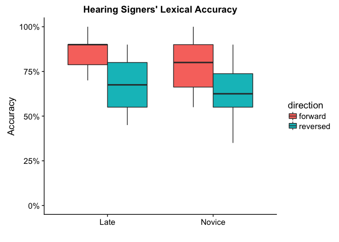

And now the LMM. It tells us that while there's a reversal effect, there is also a significant (p = 0.043) effect of Novice (they, on average, score 8% lower)

``` r
lex_hearing_m <- lmer(acc ~ direction * aoagroup + (1|id) + (1|story), data = lex_hearing)
summary(lex_hearing_m)
```

    ## Linear mixed model fit by REML t-tests use Satterthwaite approximations
    ##   to degrees of freedom [lmerMod]
    ## Formula: acc ~ direction * aoagroup + (1 | id) + (1 | story)
    ##    Data: lex_hearing
    ## 
    ## REML criterion at convergence: -114.7
    ## 
    ## Scaled residuals: 
    ##      Min       1Q   Median       3Q      Max 
    ## -1.85653 -0.69375 -0.04723  0.75780  2.28317 
    ## 
    ## Random effects:
    ##  Groups   Name        Variance Std.Dev.
    ##  id       (Intercept) 0.003760 0.06132 
    ##  story    (Intercept) 0.001089 0.03301 
    ##  Residual             0.010741 0.10364 
    ## Number of obs: 92, groups:  id, 23; story, 4
    ## 
    ## Fixed effects:
    ##                                  Estimate Std. Error       df t value
    ## (Intercept)                       0.86817    0.03218 16.53000  26.977
    ## directionreversed                -0.18383    0.03007 64.58000  -6.113
    ## aoagroupNovice                   -0.08344    0.03990 39.91000  -2.091
    ## directionreversed:aoagroupNovice  0.03756    0.04330 64.13000   0.867
    ##                                  Pr(>|t|)    
    ## (Intercept)                      4.22e-15 ***
    ## directionreversed                6.32e-08 ***
    ## aoagroupNovice                     0.0429 *  
    ## directionreversed:aoagroupNovice   0.3890    
    ## ---
    ## Signif. codes:  0 '***' 0.001 '**' 0.01 '*' 0.05 '.' 0.1 ' ' 1
    ## 
    ## Correlation of Fixed Effects:
    ##             (Intr) drctnr agrpNv
    ## dirctnrvrsd -0.467              
    ## aoagroupNvc -0.591  0.370       
    ## drctnrvrs:N  0.319 -0.683 -0.543

### Summary

So there is an effect of reversal on lexical accuracy (a drop of 18%), but Novice signers furthermore tend to score overall 8% lower.

Eye Gaze Behavior
-----------------

Now let's compare eye gaze behavior among hearing signers.

Let's go ahead and narrow down the AOIs. I can also write that we observed higher percentage looking for the upperchest AOI in this group, so we included this AOI. Let's see how deaf and hearing late signers' AOI compared.

``` r
eye_hearing <- data %>%
  filter(hearing == "Hearing") %>%
  filter(aoi != "mouthchin" & aoi != "moutheyes")

eye_hearing %>%
  filter(aoi == "forehead" | aoi == "eyes" | aoi == "mouth" | aoi == "chin" | aoi == "upperchest") %>%
  mutate(aoi = factor(aoi, levels = c("forehead","eyes","mouth","chin","upperchest"))) %>%
  ggplot(aes(x = aoagroup, y = percent, fill = direction)) +
  geom_boxplot() +
  facet_grid(.~aoi) + ylab("Percent Looking") + xlab("") +
  scale_y_continuous(labels = scales::percent) + ggtitle("Late Signers' Eye Gaze")
```

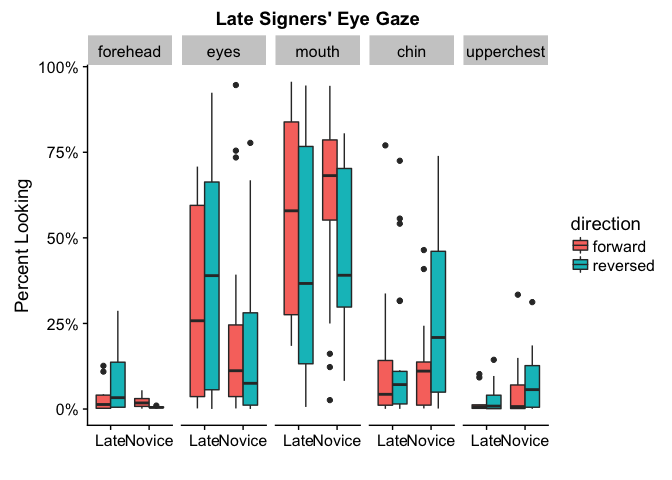

And next, the heat map.

``` r
eye_hearing_heat <- eye_hearing %>%
  ungroup() %>%
  filter(aoi != "left" & aoi != "right" & aoi != "facechest" & aoi != "face" & aoi != "chest") %>%
  group_by(aoagroup,participant,direction,aoi) %>%
  dplyr::summarize(percent = mean(percent, na.rm=TRUE)) %>%
  group_by(aoagroup,direction,aoi) %>%
  dplyr::summarize(percent = mean(percent, na.rm=TRUE)) %>%
  ungroup() %>%
  filter(!is.na(aoi)) %>%
  mutate(aoi = factor(aoi,levels=c("belly","lowerchest","midchest",
                                   "upperchest","chin","mouth","eyes","forehead")))

ggplot(eye_hearing_heat, aes(x = direction, y = aoi)) +
  geom_tile(aes(fill=percent),color="lightgray",na.rm=TRUE) + 
#  scale_fill_gradient(low = "lightblue",high = "steelblue") +
#  scale_fill_distiller(type="div", palette = "RdYlBu") +
  scale_fill_viridis(option = "viridis", direction=-1) +
  theme(axis.text.x=element_text(angle=45,hjust=1)) + facet_wrap("aoagroup") +
  ylab("") + xlab("") + ggtitle("Hearing Signers' Eye Gaze Heat Map")
```

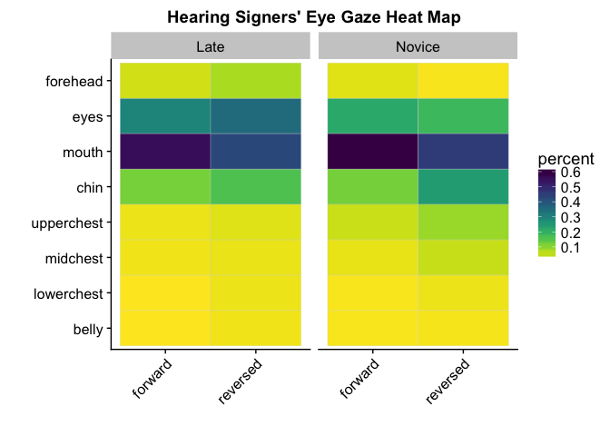

Let's run models to see if there were significant differences based on late/novice. The only significant AOI is mouth, where we observed a strong reversal effect (p = 0.004) as a main effect. No differences based on Late/Novice.

``` r
eye_hearing_aoi <- eye_hearing %>%
  spread(aoi,percent) 

eye_hearing_forehead <- lmer(forehead ~ direction * aoagroup + (1|id) + (1|story), data = eye_hearing_aoi)
eye_hearing_eyes <- lmer(eyes ~ direction * aoagroup + (1|id) + (1|story), data = eye_hearing_aoi)
eye_hearing_mouth <- lmer(mouth ~ direction * aoagroup + (1|id) + (1|story), data = eye_hearing_aoi)
eye_hearing_chin <- lmer(chin ~ direction * aoagroup + (1|id) + (1|story), data = eye_hearing_aoi)
eye_hearing_upperchest <- lmer(upperchest ~ direction * aoagroup + (1|id) + (1|story), data = eye_hearing_aoi)


summary(eye_hearing_forehead)
```

    ## Linear mixed model fit by REML t-tests use Satterthwaite approximations
    ##   to degrees of freedom [lmerMod]
    ## Formula: forehead ~ direction * aoagroup + (1 | id) + (1 | story)
    ##    Data: eye_hearing_aoi
    ## 
    ## REML criterion at convergence: -71.1
    ## 
    ## Scaled residuals: 
    ##     Min      1Q  Median      3Q     Max 
    ## -1.3209 -0.6244 -0.1417  0.2959  2.7769 
    ## 
    ## Random effects:
    ##  Groups   Name        Variance  Std.Dev.
    ##  id       (Intercept) 0.0005702 0.02388 
    ##  story    (Intercept) 0.0008865 0.02977 
    ##  Residual             0.0033068 0.05750 
    ## Number of obs: 34, groups:  id, 13; story, 4
    ## 
    ## Fixed effects:
    ##                                  Estimate Std. Error       df t value
    ## (Intercept)                       0.03841    0.02619  6.96900   1.466
    ## directionreversed                 0.03214    0.02678 26.25500   1.200
    ## aoagroupNovice                   -0.02910    0.03621 22.99600  -0.804
    ## directionreversed:aoagroupNovice -0.01430    0.05107 24.99400  -0.280
    ##                                  Pr(>|t|)
    ## (Intercept)                         0.186
    ## directionreversed                   0.241
    ## aoagroupNovice                      0.430
    ## directionreversed:aoagroupNovice    0.782
    ## 
    ## Correlation of Fixed Effects:
    ##             (Intr) drctnr agrpNv
    ## dirctnrvrsd -0.596              
    ## aoagroupNvc -0.539  0.501       
    ## drctnrvrs:N  0.393 -0.649 -0.680

``` r
summary(eye_hearing_eyes)
```

    ## Linear mixed model fit by REML t-tests use Satterthwaite approximations
    ##   to degrees of freedom [lmerMod]
    ## Formula: eyes ~ direction * aoagroup + (1 | id) + (1 | story)
    ##    Data: eye_hearing_aoi
    ## 
    ## REML criterion at convergence: -17.8
    ## 
    ## Scaled residuals: 
    ##     Min      1Q  Median      3Q     Max 
    ## -3.1621 -0.3733 -0.1197  0.3355  2.6314 
    ## 
    ## Random effects:
    ##  Groups   Name        Variance Std.Dev.
    ##  id       (Intercept) 0.060074 0.24510 
    ##  story    (Intercept) 0.001393 0.03732 
    ##  Residual             0.019920 0.14114 
    ## Number of obs: 81, groups:  id, 23; story, 4
    ## 
    ## Fixed effects:
    ##                                  Estimate Std. Error       df t value
    ## (Intercept)                       0.28555    0.08005 25.72000   3.567
    ## directionreversed                 0.05148    0.04604 53.69000   1.118
    ## aoagroupNovice                   -0.07765    0.11171 24.31000  -0.695
    ## directionreversed:aoagroupNovice -0.07301    0.06399 54.37000  -1.141
    ##                                  Pr(>|t|)   
    ## (Intercept)                       0.00145 **
    ## directionreversed                 0.26851   
    ## aoagroupNovice                    0.49361   
    ## directionreversed:aoagroupNovice  0.25886   
    ## ---
    ## Signif. codes:  0 '***' 0.001 '**' 0.01 '*' 0.05 '.' 0.1 ' ' 1
    ## 
    ## Correlation of Fixed Effects:
    ##             (Intr) drctnr agrpNv
    ## dirctnrvrsd -0.268              
    ## aoagroupNvc -0.677  0.191       
    ## drctnrvrs:N  0.190 -0.719 -0.274

``` r
summary(eye_hearing_mouth)
```

    ## Linear mixed model fit by REML t-tests use Satterthwaite approximations
    ##   to degrees of freedom [lmerMod]
    ## Formula: mouth ~ direction * aoagroup + (1 | id) + (1 | story)
    ##    Data: eye_hearing_aoi
    ## 
    ## REML criterion at convergence: -3.1
    ## 
    ## Scaled residuals: 
    ##      Min       1Q   Median       3Q      Max 
    ## -2.18333 -0.59834  0.00331  0.71871  2.14460 
    ## 
    ## Random effects:
    ##  Groups   Name        Variance Std.Dev.
    ##  id       (Intercept) 0.053585 0.23148 
    ##  story    (Intercept) 0.004406 0.06638 
    ##  Residual             0.027201 0.16493 
    ## Number of obs: 89, groups:  id, 23; story, 4
    ## 
    ## Fixed effects:
    ##                                  Estimate Std. Error       df t value
    ## (Intercept)                       0.57423    0.08271 24.73000   6.943
    ## directionreversed                -0.14768    0.04990 61.71000  -2.960
    ## aoagroupNovice                    0.03779    0.10882 26.02000   0.347
    ## directionreversed:aoagroupNovice -0.01468    0.07038 61.31000  -0.209
    ##                                  Pr(>|t|)    
    ## (Intercept)                      2.99e-07 ***
    ## directionreversed                 0.00436 ** 
    ## aoagroupNovice                    0.73116    
    ## directionreversed:aoagroupNovice  0.83544    
    ## ---
    ## Signif. codes:  0 '***' 0.001 '**' 0.01 '*' 0.05 '.' 0.1 ' ' 1
    ## 
    ## Correlation of Fixed Effects:
    ##             (Intr) drctnr agrpNv
    ## dirctnrvrsd -0.310              
    ## aoagroupNvc -0.636  0.232       
    ## drctnrvrs:N  0.216 -0.697 -0.328

``` r
summary(eye_hearing_chin)
```

    ## Linear mixed model fit by REML t-tests use Satterthwaite approximations
    ##   to degrees of freedom [lmerMod]
    ## Formula: chin ~ direction * aoagroup + (1 | id) + (1 | story)
    ##    Data: eye_hearing_aoi
    ## 
    ## REML criterion at convergence: -56.9
    ## 
    ## Scaled residuals: 
    ##     Min      1Q  Median      3Q     Max 
    ## -1.6775 -0.4698 -0.1146  0.2848  3.1054 
    ## 
    ## Random effects:
    ##  Groups   Name        Variance  Std.Dev.
    ##  id       (Intercept) 1.983e-02 0.140805
    ##  story    (Intercept) 2.885e-05 0.005371
    ##  Residual             1.623e-02 0.127381
    ## Number of obs: 86, groups:  id, 23; story, 4
    ## 
    ## Fixed effects:
    ##                                    Estimate Std. Error         df t value
    ## (Intercept)                       0.1116449  0.0495309 28.9000000   2.254
    ## directionreversed                 0.0347186  0.0388885 59.8400000   0.893
    ## aoagroupNovice                   -0.0002908  0.0706117 29.2600000  -0.004
    ## directionreversed:aoagroupNovice  0.1028437  0.0554840 59.5800000   1.854
    ##                                  Pr(>|t|)  
    ## (Intercept)                        0.0319 *
    ## directionreversed                  0.3756  
    ## aoagroupNovice                     0.9967  
    ## directionreversed:aoagroupNovice   0.0688 .
    ## ---
    ## Signif. codes:  0 '***' 0.001 '**' 0.01 '*' 0.05 '.' 0.1 ' ' 1
    ## 
    ## Correlation of Fixed Effects:
    ##             (Intr) drctnr agrpNv
    ## dirctnrvrsd -0.414              
    ## aoagroupNvc -0.699  0.290       
    ## drctnrvrs:N  0.290 -0.700 -0.392

``` r
summary(eye_hearing_upperchest)
```

    ## Linear mixed model fit by REML t-tests use Satterthwaite approximations
    ##   to degrees of freedom [lmerMod]
    ## Formula: upperchest ~ direction * aoagroup + (1 | id) + (1 | story)
    ##    Data: eye_hearing_aoi
    ## 
    ## REML criterion at convergence: -191.3
    ## 
    ## Scaled residuals: 
    ##     Min      1Q  Median      3Q     Max 
    ## -1.7369 -0.4171 -0.0987  0.1612  3.4275 
    ## 
    ## Random effects:
    ##  Groups   Name        Variance  Std.Dev.
    ##  id       (Intercept) 0.0025774 0.05077 
    ##  story    (Intercept) 0.0000863 0.00929 
    ##  Residual             0.0015316 0.03914 
    ## Number of obs: 70, groups:  id, 22; story, 4
    ## 
    ## Fixed effects:
    ##                                   Estimate Std. Error        df t value
    ## (Intercept)                       0.017096   0.019025 28.200000   0.899
    ## directionreversed                 0.008599   0.014372 47.130000   0.598
    ## aoagroupNovice                    0.024339   0.025688 28.000000   0.947
    ## directionreversed:aoagroupNovice  0.024643   0.019785 48.320000   1.246
    ##                                  Pr(>|t|)
    ## (Intercept)                         0.376
    ## directionreversed                   0.553
    ## aoagroupNovice                      0.352
    ## directionreversed:aoagroupNovice    0.219
    ## 
    ## Correlation of Fixed Effects:
    ##             (Intr) drctnr agrpNv
    ## dirctnrvrsd -0.384              
    ## aoagroupNvc -0.697  0.285       
    ## drctnrvrs:N  0.279 -0.730 -0.370

### Summary

While the heat maps show that reversed stories appear to lead to more dispersed eye gaze patterns, statistical analyses showed only mouth AOI was significantly affected by reversal, and there was no effect of group (Late vs. Novice).

Eye Gaze Predicting Accuracy
----------------------------

Would any eye gaze metric/AOI predict accuracy on the lexical recall task? like above, since we didn't see any strong effects (except mouth AOI), we probably shouldn't be running this. But if we did, it would, in fact, tell us some things:

1.  With the Eye AOI in the model (it may not even be okay to run this, because eye AOI didn't significantly change based on group):
    1.  there was a main effect of direction (reversal = less accurate, p &lt; 0.001)
    2.  a nonsignificant effect of group (novice = less accuate, p = 0.07)
    3.  a significant interaction of direction and group (reversal in novice = less accurate, p = 0.025)
    4.  a significant interaction of direction, eyes, and group (more eye % = much less accurate, p = 0.01)
2.  With the Mouth AOI in the model: main effect of direction (reversal = less accurate, p = 0.02)
3.  With the Chin AOI in the model:
    1.  main effect of direction (reversal = less accurate, p &lt; 0.001)
    2.  nonsignificant effect of group (novice = less accurate, p = 0.07)
4.  With the Upper Chest AOI in the model:
    1.  main effect of direction (reversal = less accurate, p = 0.001)
    2.  nonsignificant effect of group (novice = less accurate, p = 0.08)

Hearing Signers Summary
-----------------------

In sum, lexical recall is significantly impacted by *both* direction and group - Novice signers do worse than Late signers. There were no group effects on eye gaze behavior. In addition, eyes AOI looking percentage apeared to influence lexical accuracy scores but this was hard to interpret.

FaceChest Ratio
===============

Now I want to try and see if FaceChest Ratio is different among the five groups we've just tested. And whether it influences lexical recall. Maybe this is an easier way to compare groups. We'll give it a shot.

FCR in Deaf Signers
-------------------

Looking only at deaf signers, we find that there was no effect of AoASL or reversal on FCR.

``` r
eyegaze_deaf %>%
  filter(aoi == "facechest") %>%
  ggplot(aes(x = aoasl, y = percent, color = direction)) +
  geom_point(alpha=.5) + geom_smooth(method="lm", se = FALSE) +
  ylab("FCR") + xlab("Age of ASL Acquisition") +
  scale_y_continuous(limits = c(0,1)) +
  ggtitle("FaceChest Ratio Among Deaf Signers")
```

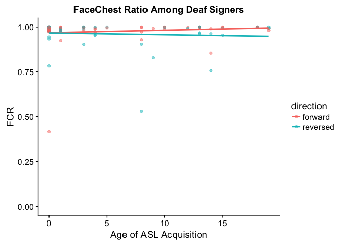

``` r
eye_deaf_fcr <- lmer(facechest ~ direction * aoasl + (1|id) + (1|story), data = eye_deaf_aoi)
summary(eye_deaf_fcr)
```

    ## Linear mixed model fit by REML t-tests use Satterthwaite approximations
    ##   to degrees of freedom [lmerMod]
    ## Formula: facechest ~ direction * aoasl + (1 | id) + (1 | story)
    ##    Data: eye_deaf_aoi
    ## 
    ## REML criterion at convergence: -199.2
    ## 
    ## Scaled residuals: 
    ##     Min      1Q  Median      3Q     Max 
    ## -6.3502  0.0110  0.1630  0.2809  1.4800 
    ## 
    ## Random effects:
    ##  Groups   Name        Variance Std.Dev.
    ##  id       (Intercept) 0.001299 0.03604 
    ##  story    (Intercept) 0.000000 0.00000 
    ##  Residual             0.005367 0.07326 
    ## Number of obs: 104, groups:  id, 29; story, 4
    ## 
    ## Fixed effects:
    ##                           Estimate Std. Error         df t value Pr(>|t|)
    ## (Intercept)              0.9683110  0.0161753 55.2100000  59.863   <2e-16
    ## directionreversed       -0.0005054  0.0192687 76.5100000  -0.026    0.979
    ## aoasl                    0.0013890  0.0019551 54.9300000   0.710    0.480
    ## directionreversed:aoasl -0.0024361  0.0022995 76.0000000  -1.059    0.293
    ##                            
    ## (Intercept)             ***
    ## directionreversed          
    ## aoasl                      
    ## directionreversed:aoasl    
    ## ---
    ## Signif. codes:  0 '***' 0.001 '**' 0.01 '*' 0.05 '.' 0.1 ' ' 1
    ## 
    ## Correlation of Fixed Effects:
    ##             (Intr) drctnr aoasl 
    ## dirctnrvrsd -0.571              
    ## aoasl       -0.667  0.379       
    ## drctnrvrsd:  0.384 -0.662 -0.577

FCR in Late Signers
-------------------

Looking only at hearing and deaf LATE signers, we find that there was no effect of AoASL or reversal on FCR.

``` r
eye_late %>%
  filter(aoi == "facechest") %>%
  ggplot(aes(x = hearing, y = percent, fill = direction)) +
  geom_boxplot() +
  ylab("FCR") + xlab("") +
  scale_y_continuous(limits = c(0,1)) + ggtitle("Late Signers' FaceChest Ratio")
```


``` r
eye_late_fcr <- lmer(facechest ~ direction * hearing + (1|id) + (1|story), data = eye_late_aoi)
summary(eye_late_fcr)
```

    ## Linear mixed model fit by REML t-tests use Satterthwaite approximations
    ##   to degrees of freedom [lmerMod]
    ## Formula: facechest ~ direction * hearing + (1 | id) + (1 | story)
    ##    Data: eye_late_aoi
    ## 
    ## REML criterion at convergence: -138.5
    ## 
    ## Scaled residuals: 
    ##     Min      1Q  Median      3Q     Max 
    ## -3.3502 -0.1554  0.0431  0.4289  1.7253 
    ## 
    ## Random effects:
    ##  Groups   Name        Variance  Std.Dev.
    ##  id       (Intercept) 0.0034544 0.05877 
    ##  story    (Intercept) 0.0001848 0.01359 
    ##  Residual             0.0050118 0.07079 
    ## Number of obs: 75, groups:  id, 20; story, 4
    ## 
    ## Fixed effects:
    ##                                  Estimate Std. Error       df t value
    ## (Intercept)                       0.98900    0.02865 27.01000  34.515
    ## directionreversed                -0.01738    0.02610 52.73000  -0.666
    ## hearingHearing                   -0.02353    0.03595 29.31000  -0.654
    ## directionreversed:hearingHearing -0.03618    0.03355 51.37000  -1.079
    ##                                  Pr(>|t|)    
    ## (Intercept)                        <2e-16 ***
    ## directionreversed                   0.508    
    ## hearingHearing                      0.518    
    ## directionreversed:hearingHearing    0.286    
    ## ---
    ## Signif. codes:  0 '***' 0.001 '**' 0.01 '*' 0.05 '.' 0.1 ' ' 1
    ## 
    ## Correlation of Fixed Effects:
    ##             (Intr) drctnr hrngHr
    ## dirctnrvrsd -0.455              
    ## hearingHrng -0.751  0.360       
    ## drctnrvrs:H  0.351 -0.772 -0.471

FCR in Hearing Signers
----------------------

Looking only at late and novice hearing signers, we find that there was no effect of AoASL or reversal on FCR.

``` r
eye_hearing %>%
  filter(aoi == "facechest") %>%
  ggplot(aes(x = aoagroup, y = percent, fill = direction)) +
  geom_boxplot() +
  ylab("FCR") + xlab("") +
  scale_y_continuous(limits = c(0,1)) + ggtitle("Hearing Signers' FaceChest Ratio")
```

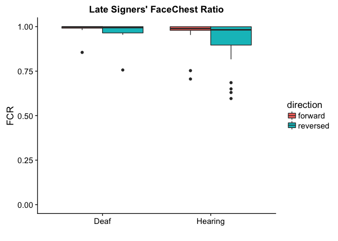

``` r
eye_hearing_fcr <- lmer(facechest ~ direction * aoagroup + (1|id) + (1|story), data = eye_hearing_aoi)
summary(eye_hearing_fcr)
```

    ## Linear mixed model fit by REML t-tests use Satterthwaite approximations
    ##   to degrees of freedom [lmerMod]
    ## Formula: facechest ~ direction * aoagroup + (1 | id) + (1 | story)
    ##    Data: eye_hearing_aoi
    ## 
    ## REML criterion at convergence: -73.4
    ## 
    ## Scaled residuals: 
    ##     Min      1Q  Median      3Q     Max 
    ## -3.8782 -0.2771  0.1366  0.5374  1.3937 
    ## 
    ## Random effects:
    ##  Groups   Name        Variance  Std.Dev.
    ##  id       (Intercept) 0.0209078 0.1446  
    ##  story    (Intercept) 0.0006866 0.0262  
    ##  Residual             0.0126744 0.1126  
    ## Number of obs: 89, groups:  id, 23; story, 4
    ## 
    ## Fixed effects:
    ##                                  Estimate Std. Error       df t value
    ## (Intercept)                       0.96585    0.05006 27.70000  19.295
    ## directionreversed                -0.05406    0.03400 62.40000  -1.590
    ## aoagroupNovice                   -0.08288    0.06934 27.30000  -1.195
    ## directionreversed:aoagroupNovice -0.05434    0.04801 61.74000  -1.132
    ##                                  Pr(>|t|)    
    ## (Intercept)                        <2e-16 ***
    ## directionreversed                   0.117    
    ## aoagroupNovice                      0.242    
    ## directionreversed:aoagroupNovice    0.262    
    ## ---
    ## Signif. codes:  0 '***' 0.001 '**' 0.01 '*' 0.05 '.' 0.1 ' ' 1
    ## 
    ## Correlation of Fixed Effects:
    ##             (Intr) drctnr agrpNv
    ## dirctnrvrsd -0.349              
    ## aoagroupNvc -0.671  0.249       
    ## drctnrvrs:N  0.244 -0.700 -0.351

FCR as a Predictor of Accuracy?
-------------------------------

Does FCR predict anything? Results below say no.

``` r
lexeye_deaf_fcr <- lmer(acc ~ direction * facechest * aoasl * (1|id) * (1|story), data = lexeye_deaf_item)
lexeye_late_fcr <- lmer(acc ~ direction * facechest * hearing * (1|id) * (1|story), data = lexeye_late_item)
lexeye_hearing_fcr <- lmer(acc ~ direction * facechest * aoagroup * (1|id) * (1|story), data = lexeye_hearing_item)

summary(lexeye_deaf_fcr)
```

    ## Linear mixed model fit by REML t-tests use Satterthwaite approximations
    ##   to degrees of freedom [lmerMod]
    ## Formula: acc ~ direction * facechest * aoasl * (1 | id) * (1 | story)
    ##    Data: lexeye_deaf_item
    ## 
    ## REML criterion at convergence: -155.9
    ## 
    ## Scaled residuals: 
    ##      Min       1Q   Median       3Q      Max 
    ## -2.05271 -0.64203  0.07424  0.54553  2.47612 
    ## 
    ## Random effects:
    ##  Groups   Name        Variance Std.Dev.
    ##  id       (Intercept) 0.001908 0.04368 
    ##  story    (Intercept) 0.001954 0.04421 
    ##  Residual             0.006376 0.07985 
    ## Number of obs: 100, groups:  id, 29; story, 4
    ## 
    ## Fixed effects:
    ##                                   Estimate Std. Error       df t value
    ## (Intercept)                        0.60820    0.15271 87.52000   3.983
    ## directionreversed                 -0.42963    0.34876 73.49000  -1.232
    ## facechest                          0.24898    0.15490 84.32000   1.607
    ## aoasl                              0.03374    0.04584 87.69000   0.736
    ## directionreversed:facechest        0.32248    0.35805 73.49000   0.901
    ## directionreversed:aoasl            0.01972    0.05584 71.29000   0.353
    ## facechest:aoasl                   -0.03411    0.04645 87.55000  -0.734
    ## directionreversed:facechest:aoasl -0.02295    0.05680 71.13000  -0.404
    ##                                   Pr(>|t|)    
    ## (Intercept)                        0.00014 ***
    ## directionreversed                  0.22193    
    ## facechest                          0.11170    
    ## aoasl                              0.46363    
    ## directionreversed:facechest        0.37071    
    ## directionreversed:aoasl            0.72504    
    ## facechest:aoasl                    0.46469    
    ## directionreversed:facechest:aoasl  0.68734    
    ## ---
    ## Signif. codes:  0 '***' 0.001 '**' 0.01 '*' 0.05 '.' 0.1 ' ' 1
    ## 
    ## Correlation of Fixed Effects:
    ##              (Intr) drctnr fcchst aoasl  drctnrvrsd:f drctnrvrsd:s fcchs:
    ## dirctnrvrsd  -0.333                                                      
    ## facechest    -0.982  0.335                                               
    ## aoasl        -0.264  0.060  0.262                                        
    ## drctnrvrsd:f  0.332 -0.998 -0.339 -0.060                                 
    ## drctnrvrsd:s  0.151 -0.585 -0.149 -0.743  0.582                          
    ## facechst:sl   0.266 -0.061 -0.268 -0.999  0.062        0.742             
    ## drctnrvrs::  -0.153  0.588  0.154  0.739 -0.587       -0.999       -0.740

``` r
summary(lexeye_late_fcr)
```

    ## Linear mixed model fit by REML t-tests use Satterthwaite approximations
    ##   to degrees of freedom [lmerMod]
    ## Formula: acc ~ direction * facechest * hearing * (1 | id) * (1 | story)
    ##    Data: lexeye_late_item
    ## 
    ## REML criterion at convergence: -108.5
    ## 
    ## Scaled residuals: 
    ##      Min       1Q   Median       3Q      Max 
    ## -1.76749 -0.64180  0.01471  0.45898  1.95695 
    ## 
    ## Random effects:
    ##  Groups   Name        Variance Std.Dev.
    ##  id       (Intercept) 0.000869 0.02948 
    ##  story    (Intercept) 0.001878 0.04333 
    ##  Residual             0.009318 0.09653 
    ## Number of obs: 73, groups:  id, 20; story, 4
    ## 
    ## Fixed effects:
    ##                                            Estimate Std. Error      df
    ## (Intercept)                                  1.3479     0.7336 62.8000
    ## directionreversed                           -0.3454     0.8267 47.0000
    ## facechest                                   -0.4877     0.7430 62.6100
    ## hearingHearing                              -0.3969     0.7805 62.3100
    ## directionreversed:facechest                  0.1956     0.8400 46.8200
    ## directionreversed:hearingHearing            -0.1879     0.8798 47.4500
    ## facechest:hearingHearing                     0.3941     0.7930 62.2600
    ## directionreversed:facechest:hearingHearing   0.1895     0.8973 47.3100
    ##                                            t value Pr(>|t|)  
    ## (Intercept)                                  1.837   0.0709 .
    ## directionreversed                           -0.418   0.6780  
    ## facechest                                   -0.656   0.5139  
    ## hearingHearing                              -0.509   0.6128  
    ## directionreversed:facechest                  0.233   0.8169  
    ## directionreversed:hearingHearing            -0.214   0.8318  
    ## facechest:hearingHearing                     0.497   0.6210  
    ## directionreversed:facechest:hearingHearing   0.211   0.8336  
    ## ---
    ## Signif. codes:  0 '***' 0.001 '**' 0.01 '*' 0.05 '.' 0.1 ' ' 1
    ## 
    ## Correlation of Fixed Effects:
    ##             (Intr) drctnr fcchst hrngHr drctn: drct:H fcch:H
    ## dirctnrvrsd -0.854                                          
    ## facechest   -0.999  0.854                                   
    ## hearingHrng -0.935  0.801  0.934                            
    ## drctnrvrsd:  0.850 -0.999 -0.851 -0.798                     
    ## drctnrvrs:H  0.797 -0.937 -0.797 -0.856  0.936              
    ## fcchst:hrnH  0.932 -0.799 -0.933 -0.999  0.797  0.856       
    ## drctnrvr::H -0.791  0.933  0.792  0.852 -0.934 -0.998 -0.853

``` r
summary(lexeye_hearing_fcr)
```

    ## Linear mixed model fit by REML t-tests use Satterthwaite approximations
    ##   to degrees of freedom [lmerMod]
    ## Formula: acc ~ direction * facechest * aoagroup * (1 | id) * (1 | story)
    ##    Data: lexeye_hearing_item
    ## 
    ## REML criterion at convergence: -106.3
    ## 
    ## Scaled residuals: 
    ##      Min       1Q   Median       3Q      Max 
    ## -1.91603 -0.66389 -0.03536  0.60980  2.11228 
    ## 
    ## Random effects:
    ##  Groups   Name        Variance Std.Dev.
    ##  id       (Intercept) 0.003890 0.06237 
    ##  story    (Intercept) 0.001179 0.03434 
    ##  Residual             0.010836 0.10410 
    ## Number of obs: 89, groups:  id, 23; story, 4
    ## 
    ## Fixed effects:
    ##                                            Estimate Std. Error      df
    ## (Intercept)                                  1.0787     0.3168 77.5800
    ## directionreversed                           -0.5734     0.3373 65.7300
    ## facechest                                   -0.2248     0.3263 76.7700
    ## aoagroupNovice                              -0.1884     0.3416 78.7600
    ## directionreversed:facechest                  0.4186     0.3521 65.4500
    ## directionreversed:aoagroupNovice             0.3379     0.3608 65.8500
    ## facechest:aoagroupNovice                     0.1049     0.3561 78.7100
    ## directionreversed:facechest:aoagroupNovice  -0.3197     0.3806 65.1300
    ##                                            t value Pr(>|t|)   
    ## (Intercept)                                  3.405  0.00105 **
    ## directionreversed                           -1.700  0.09383 . 
    ## facechest                                   -0.689  0.49298   
    ## aoagroupNovice                              -0.552  0.58279   
    ## directionreversed:facechest                  1.189  0.23878   
    ## directionreversed:aoagroupNovice             0.937  0.35238   
    ## facechest:aoagroupNovice                     0.295  0.76914   
    ## directionreversed:facechest:aoagroupNovice  -0.840  0.40405   
    ## ---
    ## Signif. codes:  0 '***' 0.001 '**' 0.01 '*' 0.05 '.' 0.1 ' ' 1
    ## 
    ## Correlation of Fixed Effects:
    ##             (Intr) drctnr fcchst agrpNv drctn: drct:N fcch:N
    ## dirctnrvrsd -0.855                                          
    ## facechest   -0.994  0.855                                   
    ## aoagroupNvc -0.927  0.796  0.924                            
    ## drctnrvrsd:  0.839 -0.995 -0.844 -0.781                     
    ## drctnrvrs:N  0.798 -0.932 -0.797 -0.848  0.928              
    ## fcchst:grpN  0.914 -0.786 -0.919 -0.992  0.776  0.845       
    ## drctnrvr::N -0.774  0.917  0.778  0.827 -0.920 -0.991 -0.832
