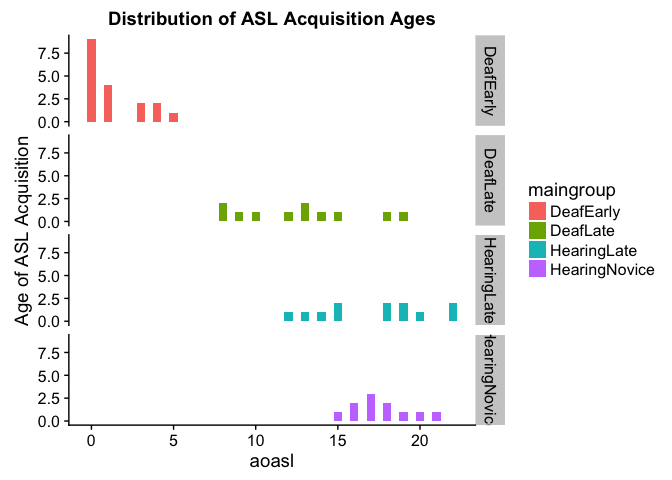
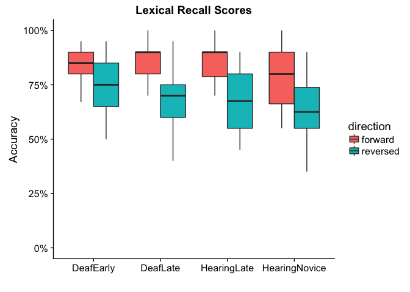
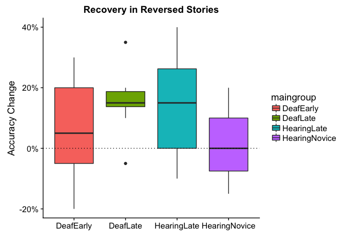
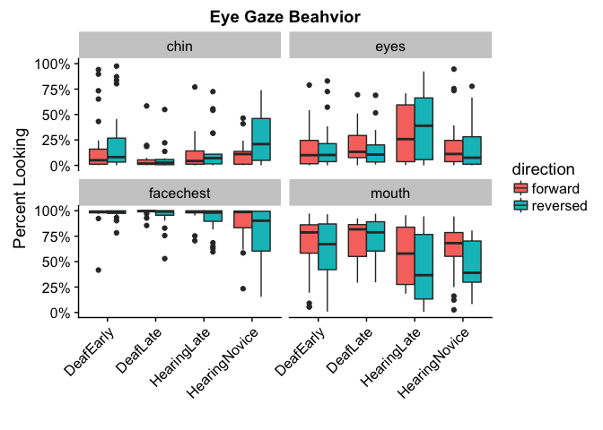
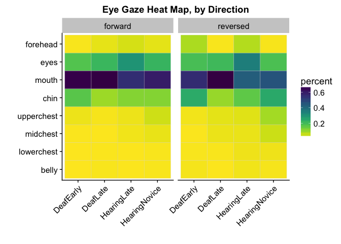
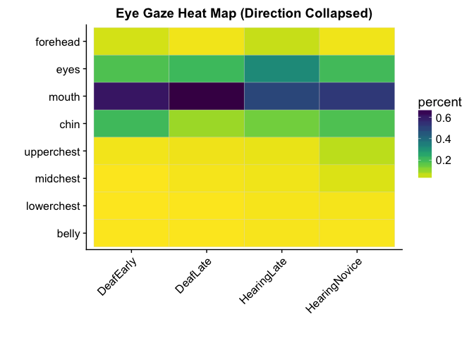

Four Groups (study1adults)
================
Adam Stone, PhD
10-12-2017

-   [Introduction](#introduction)
-   [Participants](#participants)
-   [Lexical Recall](#lexical-recall)
-   [Eye Gaze](#eye-gaze)
    -   [Eyes AOI](#eyes-aoi)
    -   [Mouth AOI](#mouth-aoi)
    -   [Chin AOI](#chin-aoi)
    -   [FaceChest Ratio](#facechest-ratio)
-   [Summary](#summary)

Introduction
============

Let's see what happens when we use FOUR groups instead of FIVE. I'm cutting off AoASL at 7 years - younger than that is "Early", older than that is "Late."

Participants
============

``` r
# Load libraries
library(tidyverse)
```

    ## Loading tidyverse: ggplot2
    ## Loading tidyverse: tibble
    ## Loading tidyverse: tidyr
    ## Loading tidyverse: readr
    ## Loading tidyverse: purrr
    ## Loading tidyverse: dplyr

    ## Conflicts with tidy packages ----------------------------------------------

    ## filter(): dplyr, stats
    ## lag():    dplyr, stats

``` r
library(stringr)
library(lme4)
```

    ## Loading required package: Matrix

    ## 
    ## Attaching package: 'Matrix'

    ## The following object is masked from 'package:tidyr':
    ## 
    ##     expand

``` r
library(lmerTest)
```

    ## 
    ## Attaching package: 'lmerTest'

    ## The following object is masked from 'package:lme4':
    ## 
    ##     lmer

    ## The following object is masked from 'package:stats':
    ## 
    ##     step

``` r
library(prettydoc)
library(broom)
library(knitr)
library(xtable)
library(kableExtra)
library(viridis)
```

    ## Loading required package: viridisLite

``` r
library(cowplot)
```

    ## 
    ## Attaching package: 'cowplot'

    ## The following object is masked from 'package:ggplot2':
    ## 
    ##     ggsave

``` r
options(knitr.table.format = "html") 

# Import data!
data <- read_csv('cleanpercentdata.csv',col_types = 
                   cols(
                     id = col_integer(),
                     participant = col_character(),
                     hearing = col_character(),
                     videogroup = col_character(),
                     aoagroup = col_character(),
                     languagegroup = col_character(),
                     maingroup = col_character(),
                     video = col_character(),
                     story = col_character(),
                     direction = col_character(),
                     age = col_double(),
                     selfrate = col_double(),
                     signyrs = col_double(),
                     aoasl = col_integer(),
                     acc = col_double(),
                     aoi = col_character(),
                     percent = col_double()
                   ))

# And factorize
data <- data %>%
  mutate(participant = as.factor(participant)) %>%
  mutate(id = as.factor(id)) %>%
  mutate(hearing = as.factor(hearing)) %>%
  mutate(videogroup = as.factor(videogroup)) %>%
  mutate(aoagroup = as.factor(aoagroup)) %>%
  mutate(languagegroup = as.factor(languagegroup)) %>%
  mutate(maingroup = as.factor(maingroup)) %>%
  mutate(video = as.factor(video)) %>%
  mutate(story = as.factor(story)) %>%
  mutate(direction = as.factor(direction)) %>%
  mutate(aoi = as.factor(aoi))

# Remove ASL from the end of MainGroup names
data <- data %>%
  mutate(maingroup = case_when(
    str_detect(maingroup,"DeafNative") ~ "DeafNative",
    str_detect(maingroup,"DeafEarlyASL") ~ "DeafEarly",
    str_detect(maingroup,"DeafLateASL") ~ "DeafLate",
    str_detect(maingroup,"HearingLateASL") ~ "HearingLate",
    str_detect(maingroup,"HearingNoviceASL") ~ "HearingNovice"
  )) %>%
  mutate(maingroup = if_else(hearing=="Deaf" & aoasl < 7, "DeafEarly", maingroup)) %>% 
  mutate(maingroup = if_else(hearing=="Deaf" & aoasl > 7, "DeafLate", maingroup)) %>%
  mutate(maingroup = as.factor(maingroup))

# Set reference levels for maingroup
data$maingroup <- relevel(data$maingroup, ref="DeafEarly")

dataoriginal <- data # Save item-level data just in case

# Take out HearingNoviceASL
# data <- data %>%
#   filter(maingroup!="HearingNoviceASL")

# Load awesome function to make correlation tables with stars for significance
# From: https://myowelt.blogspot.co.uk/2008/04/beautiful-correlation-tables-in-r.html
corstarsl <- function(x){ 
require(Hmisc) 
x <- as.matrix(x) 
R <- Hmisc::rcorr(x)$r 
p <- Hmisc::rcorr(x)$P 
## define notions for significance levels; spacing is important.
mystars <- ifelse(p < .001, "***", ifelse(p < .01, "** ", ifelse(p < .05, "* ", " ")))
## trunctuate the matrix that holds the correlations to two decimal
R <- format(round(cbind(rep(-1.11, ncol(x)), R), 2))[,-1] 
## build a new matrix that includes the correlations with their apropriate stars 
Rnew <- matrix(paste(R, mystars, sep=""), ncol=ncol(x)) 
diag(Rnew) <- paste(diag(R), " ", sep="") 
rownames(Rnew) <- colnames(x) 
colnames(Rnew) <- paste(colnames(x), "", sep="") 
## remove upper triangle
Rnew <- as.matrix(Rnew)
Rnew[upper.tri(Rnew, diag = TRUE)] <- ""
Rnew <- as.data.frame(Rnew) 
## remove last column and return the matrix (which is now a data frame)
Rnew <- cbind(Rnew[1:length(Rnew)-1])
return(Rnew) 
}


# # Now collapse eye gaze data to subject-level 
# data <- data %>%
#   group_by(participant,direction,aoi) %>%
#   dplyr::summarize(percent = mean(percent,na.rm=TRUE))
# data[data=="NaN"] <- NA
# 
# # Join subject info with data that's now subject-level
# data <- left_join(data,data.subjectinfo, by=c("participant","direction"))


# But now we need to go back and add in a complete lexical recall dataset, even including those trials that got thrown out in 03eyegaze.nb.html. Because the lexical accuracy data is still good. So let's work on that. 
cleanlexdata <- read_csv('cleandata.csv',col_types = 
                   cols(
                     id = col_integer(),
                     participant = col_character(),
                     hearing = col_character(),
                     videogroup = col_character(),
                     aoagroup = col_character(),
                     languagegroup = col_character(),
                     maingroup = col_character(),
                     video = col_character(),
                     story = col_character(),
                     direction = col_character(),
                     age = col_double(),
                     selfrate = col_double(),
                     signyrs = col_double(),
                     aoasl = col_integer(),
                     acc = col_double(),
                     forehead = col_double(),
                     eyes = col_double(),
                     mouth = col_double(),
                     chin = col_double(),
                     upperchest = col_double(),
                     midchest = col_double(),
                     lowerchest = col_double(),
                     belly = col_double(),
                     left = col_double(),
                     right = col_double(),
                     total = col_double()
                   )) %>%
  mutate(maingroup = case_when(
    str_detect(maingroup,"DeafNative") ~ "DeafNative",
    str_detect(maingroup,"DeafEarlyASL") ~ "DeafEarly",
    str_detect(maingroup,"DeafLateASL") ~ "DeafLate",
    str_detect(maingroup,"HearingLateASL") ~ "HearingLate",
    str_detect(maingroup,"HearingNoviceASL") ~ "HearingNovice"
  )) %>%
  mutate(maingroup = if_else(hearing=="Deaf" & aoasl < 7, "DeafEarly", maingroup)) %>% 
  mutate(maingroup = if_else(hearing=="Deaf" & aoasl > 7, "DeafLate", maingroup)) %>%
  mutate(maingroup = as.factor(maingroup))

cleanlexdata$maingroup <- relevel(cleanlexdata$maingroup, ref="DeafEarly")


# Pull out subject info for later in summary tables
subjectinfo <- data %>%
  select(-aoi,-percent,-video,-story,-direction,-acc) %>%
  distinct()

# Participant Characteristics Table (using cleanlexdata because it's more complete)
groupmeans <- cleanlexdata %>%
  ungroup() %>%
  select(id,participant,maingroup,age,selfrate,signyrs,aoasl) %>%
  distinct() %>%
  group_by(maingroup) %>%
  dplyr::summarize(n = n(),
            age.m = mean(age),
            age.sd = sd(age),
            selfrate.m = mean(selfrate),
            selfrate.sd = sd(selfrate),
            signyrs.m = mean(signyrs),
            signyrs.sd = sd(signyrs),
            aoasl.m = mean(aoasl),
            aoasl.sd = sd(aoasl)) %>%
  mutate(maingroup =  factor(maingroup, levels = c("DeafEarly","DeafLate",
                                                   "HearingLate","HearingNovice"))) %>%
  arrange(maingroup)    
kable(groupmeans, digits=1) %>% kable_styling(bootstrap_options = c("striped", "hover", "condensed"))
```

<table class="table table-striped table-hover table-condensed" style="margin-left: auto; margin-right: auto;">
<thead>
<tr>
<th style="text-align:left;">
maingroup
</th>
<th style="text-align:right;">
n
</th>
<th style="text-align:right;">
age.m
</th>
<th style="text-align:right;">
age.sd
</th>
<th style="text-align:right;">
selfrate.m
</th>
<th style="text-align:right;">
selfrate.sd
</th>
<th style="text-align:right;">
signyrs.m
</th>
<th style="text-align:right;">
signyrs.sd
</th>
<th style="text-align:right;">
aoasl.m
</th>
<th style="text-align:right;">
aoasl.sd
</th>
</tr>
</thead>
<tbody>
<tr>
<td style="text-align:left;">
DeafEarly
</td>
<td style="text-align:right;">
18
</td>
<td style="text-align:right;">
33.8
</td>
<td style="text-align:right;">
8.4
</td>
<td style="text-align:right;">
5.0
</td>
<td style="text-align:right;">
0.0
</td>
<td style="text-align:right;">
32.4
</td>
<td style="text-align:right;">
8.6
</td>
<td style="text-align:right;">
1.3
</td>
<td style="text-align:right;">
1.7
</td>
</tr>
<tr>
<td style="text-align:left;">
DeafLate
</td>
<td style="text-align:right;">
11
</td>
<td style="text-align:right;">
36.8
</td>
<td style="text-align:right;">
6.1
</td>
<td style="text-align:right;">
5.0
</td>
<td style="text-align:right;">
0.0
</td>
<td style="text-align:right;">
23.8
</td>
<td style="text-align:right;">
5.3
</td>
<td style="text-align:right;">
12.6
</td>
<td style="text-align:right;">
3.7
</td>
</tr>
<tr>
<td style="text-align:left;">
HearingLate
</td>
<td style="text-align:right;">
12
</td>
<td style="text-align:right;">
28.9
</td>
<td style="text-align:right;">
6.2
</td>
<td style="text-align:right;">
4.6
</td>
<td style="text-align:right;">
0.5
</td>
<td style="text-align:right;">
11.8
</td>
<td style="text-align:right;">
4.8
</td>
<td style="text-align:right;">
17.2
</td>
<td style="text-align:right;">
3.4
</td>
</tr>
<tr>
<td style="text-align:left;">
HearingNovice
</td>
<td style="text-align:right;">
11
</td>
<td style="text-align:right;">
20.2
</td>
<td style="text-align:right;">
1.3
</td>
<td style="text-align:right;">
3.0
</td>
<td style="text-align:right;">
0.7
</td>
<td style="text-align:right;">
2.4
</td>
<td style="text-align:right;">
1.0
</td>
<td style="text-align:right;">
17.6
</td>
<td style="text-align:right;">
1.8
</td>
</tr>
</tbody>
</table>
Let's see the distribution of AoASL among the four groups.

``` r
data %>%
  select(participant,maingroup,aoasl) %>%
  distinct() %>%
  ggplot(aes(x = aoasl, fill = maingroup)) + 
  geom_histogram(binwidth = .5) + 
  facet_grid(maingroup ~ .) +
  ylab("Age of ASL Acquisition") + ggtitle("Distribution of ASL Acquisition Ages")
```



Lexical Recall
==============

Let's get their lex recall scores.

``` r
cleanlexdata %>%
  ggplot(aes(x = maingroup, y = acc, fill = direction)) +
  geom_boxplot() +
  scale_y_continuous(limits = c(0,1), labels = scales::percent) +
  ggtitle("Lexical Recall Scores") + xlab("") + ylab("Accuracy")
```

    ## Warning: Removed 4 rows containing non-finite values (stat_boxplot).



Would a LMM show differences? Let's see. Below, there is a main effect of direction (p &lt; 0.001) and a main effect of maingroup for Hearing Novice (p = 0.03), and then a weak interaction for Direction & HearingLate (p = 0.047).

``` r
lex_recall_lmm <- lmer(acc ~ maingroup * direction + (1|id) + (1|story), data = cleanlexdata)
summary(lex_recall_lmm)
```

    ## Linear mixed model fit by REML t-tests use Satterthwaite approximations
    ##   to degrees of freedom [lmerMod]
    ## Formula: acc ~ maingroup * direction + (1 | id) + (1 | story)
    ##    Data: cleanlexdata
    ## 
    ## REML criterion at convergence: -303.1
    ## 
    ## Scaled residuals: 
    ##      Min       1Q   Median       3Q      Max 
    ## -2.19143 -0.62953  0.01657  0.58032  2.33790 
    ## 
    ## Random effects:
    ##  Groups   Name        Variance Std.Dev.
    ##  id       (Intercept) 0.002839 0.05328 
    ##  story    (Intercept) 0.001515 0.03892 
    ##  Residual             0.008625 0.09287 
    ## Number of obs: 204, groups:  id, 52; story, 4
    ## 
    ## Fixed effects:
    ##                                            Estimate Std. Error         df
    ## (Intercept)                                0.852352   0.028018  10.130000
    ## maingroupDeafLate                          0.001893   0.032883  95.780000
    ## maingroupHearingLate                       0.014094   0.031707  93.540000
    ## maingroupHearingNovice                    -0.070440   0.032596  93.900000
    ## directionreversed                         -0.110067   0.022276 146.090000
    ## maingroupDeafLate:directionreversed       -0.045469   0.036444 146.210000
    ## maingroupHearingLate:directionreversed    -0.070326   0.035027 146.270000
    ## maingroupHearingNovice:directionreversed  -0.030576   0.036115 146.540000
    ##                                          t value Pr(>|t|)    
    ## (Intercept)                               30.421 2.72e-11 ***
    ## maingroupDeafLate                          0.058   0.9542    
    ## maingroupHearingLate                       0.445   0.6577    
    ## maingroupHearingNovice                    -2.161   0.0332 *  
    ## directionreversed                         -4.941 2.10e-06 ***
    ## maingroupDeafLate:directionreversed       -1.248   0.2142    
    ## maingroupHearingLate:directionreversed    -2.008   0.0465 *  
    ## maingroupHearingNovice:directionreversed  -0.847   0.3986    
    ## ---
    ## Signif. codes:  0 '***' 0.001 '**' 0.01 '*' 0.05 '.' 0.1 ' ' 1
    ## 
    ## Correlation of Fixed Effects:
    ##             (Intr) mngrDL mngrHL mngrHN drctnr mngDL: mngHL:
    ## maingrpDfLt -0.442                                          
    ## mngrpHrngLt -0.458  0.392                                   
    ## mngrpHrngNv -0.447  0.383  0.397                            
    ## dirctnrvrsd -0.398  0.341  0.354  0.346                     
    ## mngrpDfLt:d  0.245 -0.554 -0.219 -0.215 -0.615              
    ## mngrpHrngL:  0.255 -0.220 -0.552 -0.225 -0.641  0.397       
    ## mngrpHrngN:  0.248 -0.216 -0.224 -0.554 -0.624  0.389  0.406

How about a traditional ANOVA? It tells us - main effect of direction (p &lt; 0.001), main effect of group (p = 0.004), but no significant interactions. The Tukey's posthoc tells us the main effect of group is driven by a difference between DeafEarly and HearingNovice (p = 0.002), and no other contrasts.

``` r
lexdata_subjects <- cleanlexdata %>%
  group_by(maingroup,participant,direction) %>%
  dplyr::summarize(acc = mean(acc,na.rm=TRUE))

lex_recall_aov <- aov(acc ~ maingroup * direction, data = lexdata_subjects)
summary(lex_recall_aov)
```

    ##                     Df Sum Sq Mean Sq F value   Pr(>F)    
    ## maingroup            3 0.1058  0.0353   4.685  0.00426 ** 
    ## direction            1 0.5211  0.5211  69.212 5.97e-13 ***
    ## maingroup:direction  3 0.0214  0.0071   0.946  0.42160    
    ## Residuals           96 0.7228  0.0075                     
    ## ---
    ## Signif. codes:  0 '***' 0.001 '**' 0.01 '*' 0.05 '.' 0.1 ' ' 1

``` r
TukeyHSD(lex_recall_aov, "maingroup", conf.level = 0.95)
```

    ##   Tukey multiple comparisons of means
    ##     95% family-wise confidence level
    ## 
    ## Fit: aov(formula = acc ~ maingroup * direction, data = lexdata_subjects)
    ## 
    ## $maingroup
    ##                                    diff         lwr          upr     p adj
    ## DeafLate-DeafEarly        -0.0218174242 -0.08321121  0.039576357 0.7893031
    ## HearingLate-DeafEarly     -0.0220833333 -0.08186826  0.037701597 0.7691496
    ## HearingNovice-DeafEarly   -0.0867424242 -0.14813621 -0.025348643 0.0020482
    ## HearingLate-DeafLate      -0.0002659091 -0.06722891  0.066697095 0.9999996
    ## HearingNovice-DeafLate    -0.0649250000 -0.13332823  0.003478234 0.0692526
    ## HearingNovice-HearingLate -0.0646590909 -0.13162210  0.002303913 0.0624412

What about the recovery metric for reversed stories?

``` r
lex_recovery <- cleanlexdata %>%
  select(maingroup, participant, video, acc) %>%
  filter(video == "rv2" | video == "rv4") %>%
  spread(video, acc) %>%
  mutate(recov = rv4-rv2) %>%
  select(maingroup, participant, recov)

lex_recovery %>%
  ggplot(aes(x = maingroup, y = recov, fill = maingroup)) +
  geom_boxplot() +
  scale_y_continuous(labels = scales::percent) +
  ggtitle("Recovery in Reversed Stories") + xlab("") + ylab("Accuracy Change") +
  geom_hline(yintercept = 0, linetype = "dotted")
```

    ## Warning: Removed 2 rows containing non-finite values (stat_boxplot).



Is there a real effect of group? Simple LM first. No effect of group. No need to do ANOVA, it's the same math.

``` r
lex_recov_lm <- lm(recov ~ maingroup, data = lex_recovery)
summary(lex_recov_lm)
```

    ## 
    ## Call:
    ## lm(formula = recov ~ maingroup, data = lex_recovery)
    ## 
    ## Residuals:
    ##      Min       1Q   Median       3Q      Max 
    ## -0.26941 -0.10599 -0.00333  0.10250  0.25500 
    ## 
    ## Coefficients:
    ##                        Estimate Std. Error t value Pr(>|t|)  
    ## (Intercept)             0.06941    0.03302   2.102   0.0411 *
    ## maingroupDeafLate       0.08392    0.05426   1.546   0.1288  
    ## maingroupHearingLate    0.07559    0.05134   1.472   0.1477  
    ## maingroupHearingNovice -0.05123    0.05269  -0.972   0.3360  
    ## ---
    ## Signif. codes:  0 '***' 0.001 '**' 0.01 '*' 0.05 '.' 0.1 ' ' 1
    ## 
    ## Residual standard error: 0.1362 on 46 degrees of freedom
    ##   (2 observations deleted due to missingness)
    ## Multiple R-squared:  0.1409, Adjusted R-squared:  0.08488 
    ## F-statistic: 2.515 on 3 and 46 DF,  p-value: 0.06999

Eye Gaze
========

We already know the best AOIs are eyes, mouth, chin, and FaceChest Ratio. So let's just plot all those out. The y-axis for FaceChest is of course not percent but a ratio, 1.0 to -1.0 (but no one goes below 0).

``` r
eyegaze <- data %>%
  filter(aoi == "eyes" | aoi == "mouth" | aoi == "chin" | aoi == "facechest")

ggplot(eyegaze, aes(x = maingroup, y = percent, fill = direction)) + 
  geom_boxplot() + 
  facet_wrap("aoi") +
  scale_y_continuous(labels = scales::percent) +
  ylab("Percent Looking") + xlab("") + ggtitle("Eye Gaze Beahvior") +
  theme(axis.text.x = element_text(angle = 45,hjust = 1))
```

    ## Warning: Removed 21 rows containing non-finite values (stat_boxplot).



Heat map next.

``` r
eyegaze_heat <- data %>%
  ungroup() %>%
  filter(aoi != "left" & aoi != "right" & aoi != "facechest" & aoi != "face" & aoi != "chest") %>%
  group_by(maingroup,participant,direction,aoi) %>%
  dplyr::summarize(percent = mean(percent, na.rm=TRUE)) %>%
  group_by(maingroup,direction,aoi) %>%
  dplyr::summarize(percent = mean(percent, na.rm=TRUE)) %>%
  ungroup() %>%
  filter(!is.na(aoi)) %>%
  mutate(aoi = factor(aoi,levels=c("belly","lowerchest","midchest",
                                   "upperchest","chin","mouth","eyes","forehead")))

eyegaze_heat_all <- data %>%
  ungroup() %>%
  filter(aoi != "left" & aoi != "right" & aoi != "facechest" & aoi != "face" & aoi != "chest") %>%
  group_by(maingroup,participant,direction,aoi) %>%
  dplyr::summarize(percent = mean(percent, na.rm=TRUE)) %>%
  group_by(maingroup,direction,aoi) %>%
  dplyr::summarize(percent = mean(percent, na.rm=TRUE)) %>%
  group_by(maingroup,aoi) %>%
  dplyr::summarize(percent = mean(percent, na.rm=TRUE)) %>%
  ungroup() %>%
  filter(!is.na(aoi)) %>%
  mutate(aoi = factor(aoi,levels=c("belly","lowerchest","midchest",
                                   "upperchest","chin","mouth","eyes","forehead")))


ggplot(eyegaze_heat, aes(x = maingroup, y = aoi)) +
  geom_tile(aes(fill=percent),color="lightgray",na.rm=TRUE) + 
#  scale_fill_gradient(low = "lightblue",high = "steelblue") +
#  scale_fill_distiller(type="div", palette = "RdYlBu") +
  scale_fill_viridis(option = "viridis", direction=-1) +
  theme(axis.text.x=element_text(angle=45,hjust=1)) + facet_grid(. ~ direction) +
  ylab("") + xlab("") + ggtitle("Eye Gaze Heat Map, by Direction")
```



``` r
ggplot(eyegaze_heat_all, aes(x = maingroup, y = aoi)) +
  geom_tile(aes(fill=percent),color="lightgray",na.rm=TRUE) + 
#  scale_fill_gradient(low = "lightblue",high = "steelblue") +
#  scale_fill_distiller(type="div", palette = "RdYlBu") +
  scale_fill_viridis(option = "viridis", direction=-1) +
  theme(axis.text.x=element_text(angle=45,hjust=1)) +
  ylab("") + xlab("") + ggtitle("Eye Gaze Heat Map (Direction Collapsed)")
```



Let's run LMMs and ANOVAs, AOI by AOI.

Eyes AOI
--------

Eyes AOI. LMM tells us there was no effect of direction or maingroup. The ANOVA tells us there was a main effect of group (p = 0.001) and that this effect was driven by significant differences between HearingLate and DeafEarly (p = 0.001), HearingLate and DeafLate (p = 0.014), and HearingLate and HearingNovice (p = 0.026).

In other words, the ANOVA tells us HearingLate look more at the eyes overall than other groups (see collapsed heat map).

``` r
eyedata <- eyegaze %>%
  spread(aoi,percent)

eyedata_subject <- eyedata %>%
  group_by(maingroup,participant,direction) %>%
  dplyr::summarize(eyes = mean(eyes,na.rm=TRUE),
                   mouth = mean(mouth,na.rm=TRUE),
                   chin = mean(chin,na.rm=TRUE),
                   fcr = mean(facechest,na.rm=TRUE))

eyes_lmm <- lmer(eyes ~ maingroup * direction + (1|id) + (1|story), data = eyedata)
summary(eyes_lmm)
```

    ## Linear mixed model fit by REML t-tests use Satterthwaite approximations
    ##   to degrees of freedom [lmerMod]
    ## Formula: eyes ~ maingroup * direction + (1 | id) + (1 | story)
    ##    Data: eyedata
    ## 
    ## REML criterion at convergence: -37.5
    ## 
    ## Scaled residuals: 
    ##     Min      1Q  Median      3Q     Max 
    ## -2.6981 -0.4587 -0.1219  0.3015  3.7241 
    ## 
    ## Random effects:
    ##  Groups   Name        Variance Std.Dev.
    ##  id       (Intercept) 0.034564 0.18591 
    ##  story    (Intercept) 0.001451 0.03809 
    ##  Residual             0.024172 0.15547 
    ## Number of obs: 176, groups:  id, 52; story, 4
    ## 
    ## Fixed effects:
    ##                                            Estimate Std. Error         df
    ## (Intercept)                                0.166401   0.055950  47.920000
    ## maingroupDeafLate                          0.037378   0.084662  61.520000
    ## maingroupHearingLate                       0.121867   0.083181  63.530000
    ## maingroupHearingNovice                     0.040524   0.084171  60.440000
    ## directionreversed                          0.001274   0.041799 119.920000
    ## maingroupDeafLate:directionreversed       -0.026772   0.067959 122.680000
    ## maingroupHearingLate:directionreversed     0.056165   0.065563 119.300000
    ## maingroupHearingNovice:directionreversed  -0.020143   0.064333 119.450000
    ##                                          t value Pr(>|t|)   
    ## (Intercept)                                2.974  0.00459 **
    ## maingroupDeafLate                          0.441  0.66040   
    ## maingroupHearingLate                       1.465  0.14783   
    ## maingroupHearingNovice                     0.481  0.63194   
    ## directionreversed                          0.030  0.97573   
    ## maingroupDeafLate:directionreversed       -0.394  0.69431   
    ## maingroupHearingLate:directionreversed     0.857  0.39335   
    ## maingroupHearingNovice:directionreversed  -0.313  0.75475   
    ## ---
    ## Signif. codes:  0 '***' 0.001 '**' 0.01 '*' 0.05 '.' 0.1 ' ' 1
    ## 
    ## Correlation of Fixed Effects:
    ##             (Intr) mngrDL mngrHL mngrHN drctnr mngDL: mngHL:
    ## maingrpDfLt -0.584                                          
    ## mngrpHrngLt -0.595  0.393                                   
    ## mngrpHrngNv -0.588  0.389  0.396                            
    ## dirctnrvrsd -0.356  0.234  0.240  0.237                     
    ## mngrpDfLt:d  0.222 -0.354 -0.151 -0.151 -0.620              
    ## mngrpHrngL:  0.226 -0.149 -0.373 -0.151 -0.637  0.395       
    ## mngrpHrngN:  0.234 -0.156 -0.159 -0.374 -0.654  0.416  0.417

``` r
eyes_aov <- aov(eyes ~ maingroup * direction, data = eyedata)
summary(eyes_aov)
```

    ##                      Df Sum Sq Mean Sq F value  Pr(>F)   
    ## maingroup             3  0.924 0.30789   5.375 0.00147 **
    ## direction             1  0.004 0.00364   0.064 0.80124   
    ## maingroup:direction   3  0.096 0.03187   0.556 0.64457   
    ## Residuals           168  9.623 0.05728                   
    ## ---
    ## Signif. codes:  0 '***' 0.001 '**' 0.01 '*' 0.05 '.' 0.1 ' ' 1
    ## 17 observations deleted due to missingness

``` r
TukeyHSD(eyes_aov,"maingroup",conf.level = 0.95)
```

    ##   Tukey multiple comparisons of means
    ##     95% family-wise confidence level
    ## 
    ## Fit: aov(formula = eyes ~ maingroup * direction, data = eyedata)
    ## 
    ## $maingroup
    ##                                  diff         lwr         upr     p adj
    ## DeafLate-DeafEarly         0.02070188 -0.10996543  0.15136918 0.9764858
    ## HearingLate-DeafEarly      0.18810717  0.05950166  0.31671267 0.0011678
    ## HearingNovice-DeafEarly    0.03693213 -0.08889705  0.16276130 0.8715459
    ## HearingLate-DeafLate       0.16740529  0.02487945  0.30993113 0.0141150
    ## HearingNovice-DeafLate     0.01623025 -0.12379554  0.15625604 0.9905152
    ## HearingNovice-HearingLate -0.15117504 -0.28927882 -0.01307127 0.0258071

Mouth AOI
---------

Mouth AOI. LMM tells us there was no effect of maingroup and a weak effect of reversal (p = 0.056). The ANOVA tells us there is a main effect of group (p &lt; 0.001) and of direction (0.022), no interactions.

The posthoc tells us HearingLate was different from DeafEarly (p = 0.02) and from DeafLate (0.000), and that HearingNovice was different from DeafLate (p = 0.01).

Look at the collapsed heat map. HearingLate looked *less* at the mouth than any of the deaf. HearingNovice looked *less* than DeafLate. Really, DeafLate looks at the mouth **a lot** compared to any other group.

``` r
mouth_lmm <- lmer(mouth ~ maingroup * direction + (1|id) + (1|story), data = eyedata)
summary(mouth_lmm)
```

    ## Linear mixed model fit by REML t-tests use Satterthwaite approximations
    ##   to degrees of freedom [lmerMod]
    ## Formula: mouth ~ maingroup * direction + (1 | id) + (1 | story)
    ##    Data: eyedata
    ## 
    ## REML criterion at convergence: -7.4
    ## 
    ## Scaled residuals: 
    ##      Min       1Q   Median       3Q      Max 
    ## -2.56049 -0.50387  0.08368  0.58913  2.10900 
    ## 
    ## Random effects:
    ##  Groups   Name        Variance Std.Dev.
    ##  id       (Intercept) 0.045477 0.21325 
    ##  story    (Intercept) 0.003106 0.05573 
    ##  Residual             0.029111 0.17062 
    ## Number of obs: 193, groups:  id, 52; story, 4
    ## 
    ## Fixed effects:
    ##                                           Estimate Std. Error        df
    ## (Intercept)                                0.66760    0.06463  36.42000
    ## maingroupDeafLate                          0.02688    0.09509  62.21000
    ## maingroupHearingLate                      -0.09303    0.09248  61.99000
    ## maingroupHearingNovice                    -0.05537    0.09420  60.19000
    ## directionreversed                         -0.08143    0.04227 134.21000
    ## maingroupDeafLate:directionreversed        0.07823    0.07115 136.80000
    ## maingroupHearingLate:directionreversed    -0.06758    0.06666 134.64000
    ## maingroupHearingNovice:directionreversed  -0.08133    0.06701 134.47000
    ##                                          t value Pr(>|t|)    
    ## (Intercept)                               10.329 2.27e-12 ***
    ## maingroupDeafLate                          0.283   0.7783    
    ## maingroupHearingLate                      -1.006   0.3183    
    ## maingroupHearingNovice                    -0.588   0.5588    
    ## directionreversed                         -1.927   0.0561 .  
    ## maingroupDeafLate:directionreversed        1.100   0.2735    
    ## maingroupHearingLate:directionreversed    -1.014   0.3125    
    ## maingroupHearingNovice:directionreversed  -1.214   0.2270    
    ## ---
    ## Signif. codes:  0 '***' 0.001 '**' 0.01 '*' 0.05 '.' 0.1 ' ' 1
    ## 
    ## Correlation of Fixed Effects:
    ##             (Intr) mngrDL mngrHL mngrHN drctnr mngDL: mngHL:
    ## maingrpDfLt -0.553                                          
    ## mngrpHrngLt -0.569  0.387                                   
    ## mngrpHrngNv -0.559  0.381  0.392                            
    ## dirctnrvrsd -0.315  0.214  0.221  0.217                     
    ## mngrpDfLt:d  0.188 -0.347 -0.133 -0.133 -0.598              
    ## mngrpHrngL:  0.200 -0.137 -0.361 -0.140 -0.635  0.385       
    ## mngrpHrngN:  0.200 -0.138 -0.142 -0.350 -0.634  0.388  0.408

``` r
mouth_aov <- aov(mouth ~ maingroup * direction, data = eyedata)
summary(mouth_aov)
```

    ##                      Df Sum Sq Mean Sq F value   Pr(>F)    
    ## maingroup             3  1.401  0.4669   6.308 0.000426 ***
    ## direction             1  0.392  0.3923   5.301 0.022425 *  
    ## maingroup:direction   3  0.153  0.0509   0.688 0.560353    
    ## Residuals           185 13.692  0.0740                     
    ## ---
    ## Signif. codes:  0 '***' 0.001 '**' 0.01 '*' 0.05 '.' 0.1 ' ' 1

``` r
TukeyHSD(mouth_aov,"maingroup",conf.level = 0.95)
```

    ##   Tukey multiple comparisons of means
    ##     95% family-wise confidence level
    ## 
    ## Fit: aov(formula = mouth ~ maingroup * direction, data = eyedata)
    ## 
    ## $maingroup
    ##                                  diff         lwr         upr     p adj
    ## DeafLate-DeafEarly         0.07882880 -0.06479221  0.22244982 0.4866539
    ## HearingLate-DeafEarly     -0.15113862 -0.28748649 -0.01479075 0.0232725
    ## HearingNovice-DeafEarly   -0.10850209 -0.24576813  0.02876396 0.1739471
    ## HearingLate-DeafLate      -0.22996742 -0.38535134 -0.07458350 0.0009747
    ## HearingNovice-DeafLate    -0.18733089 -0.34352112 -0.03114066 0.0115613
    ## HearingNovice-HearingLate  0.04263653 -0.10689318  0.19216624 0.8811245

Chin AOI
--------

Chin AOI. LMM tells us there was no effect of maingroup and a weak effect of reversal (p = 0.050). The ANOVA tells us there is a main effect of group (p &lt; 0.028) and a very weak one of direction (0.056), no interactions.

The posthoc tells us DeafEarly and DeafLate were significantly different (p = 0.026) - the heat map (collapsed) tells us DeafLate looks less at the chin.

``` r
chin_lmm <- lmer(chin ~ maingroup * direction + (1|id) + (1|story), data = eyedata)
summary(chin_lmm)
```

    ## Linear mixed model fit by REML t-tests use Satterthwaite approximations
    ##   to degrees of freedom [lmerMod]
    ## Formula: chin ~ maingroup * direction + (1 | id) + (1 | story)
    ##    Data: eyedata
    ## 
    ## REML criterion at convergence: -104.3
    ## 
    ## Scaled residuals: 
    ##     Min      1Q  Median      3Q     Max 
    ## -2.3963 -0.4427 -0.1022  0.2076  3.8969 
    ## 
    ## Random effects:
    ##  Groups   Name        Variance  Std.Dev.
    ##  id       (Intercept) 0.0301635 0.17368 
    ##  story    (Intercept) 0.0004859 0.02204 
    ##  Residual             0.0165956 0.12882 
    ## Number of obs: 189, groups:  id, 52; story, 4
    ## 
    ## Fixed effects:
    ##                                           Estimate Std. Error        df
    ## (Intercept)                                0.16115    0.04795  55.14000
    ## maingroupDeafLate                         -0.07739    0.07601  60.02000
    ## maingroupHearingLate                      -0.05146    0.07422  60.65000
    ## maingroupHearingNovice                    -0.05089    0.07537  58.21000
    ## directionreversed                          0.06403    0.03230 131.07000
    ## maingroupDeafLate:directionreversed       -0.06084    0.05381 133.62000
    ## maingroupHearingLate:directionreversed    -0.02744    0.05096 131.17000
    ## maingroupHearingNovice:directionreversed   0.07508    0.05166 131.94000
    ##                                          t value Pr(>|t|)   
    ## (Intercept)                                3.361  0.00142 **
    ## maingroupDeafLate                         -1.018  0.31268   
    ## maingroupHearingLate                      -0.693  0.49074   
    ## maingroupHearingNovice                    -0.675  0.50221   
    ## directionreversed                          1.983  0.04951 * 
    ## maingroupDeafLate:directionreversed       -1.131  0.26025   
    ## maingroupHearingLate:directionreversed    -0.538  0.59116   
    ## maingroupHearingNovice:directionreversed   1.453  0.14853   
    ## ---
    ## Signif. codes:  0 '***' 0.001 '**' 0.01 '*' 0.05 '.' 0.1 ' ' 1
    ## 
    ## Correlation of Fixed Effects:
    ##             (Intr) mngrDL mngrHL mngrHN drctnr mngDL: mngHL:
    ## maingrpDfLt -0.597                                          
    ## mngrpHrngLt -0.612  0.386                                   
    ## mngrpHrngNv -0.603  0.381  0.390                            
    ## dirctnrvrsd -0.311  0.196  0.201  0.198                     
    ## mngrpDfLt:d  0.187 -0.324 -0.122 -0.121 -0.602              
    ## mngrpHrngL:  0.197 -0.125 -0.344 -0.127 -0.634  0.385       
    ## mngrpHrngN:  0.195 -0.125 -0.127 -0.320 -0.626  0.384  0.400

``` r
chin_aov <- aov(chin ~ maingroup * direction, data = eyedata)
summary(chin_aov)
```

    ##                      Df Sum Sq Mean Sq F value Pr(>F)  
    ## maingroup             3  0.419 0.13952   3.094 0.0283 *
    ## direction             1  0.166 0.16631   3.688 0.0564 .
    ## maingroup:direction   3  0.126 0.04187   0.929 0.4281  
    ## Residuals           181  8.161 0.04509                 
    ## ---
    ## Signif. codes:  0 '***' 0.001 '**' 0.01 '*' 0.05 '.' 0.1 ' ' 1
    ## 4 observations deleted due to missingness

``` r
TukeyHSD(chin_aov,"maingroup",conf.level = 0.95)
```

    ##   Tukey multiple comparisons of means
    ##     95% family-wise confidence level
    ## 
    ## Fit: aov(formula = chin ~ maingroup * direction, data = eyedata)
    ## 
    ## $maingroup
    ##                                   diff         lwr         upr     p adj
    ## DeafLate-DeafEarly        -0.122964289 -0.23540520 -0.01052338 0.0259757
    ## HearingLate-DeafEarly     -0.057864295 -0.16535835  0.04962976 0.5035773
    ## HearingNovice-DeafEarly   -0.009529688 -0.11853930  0.09947992 0.9958801
    ## HearingLate-DeafLate       0.065099994 -0.05683911  0.18703910 0.5107714
    ## HearingNovice-DeafLate     0.113434601 -0.00984260  0.23671180 0.0834063
    ## HearingNovice-HearingLate  0.048334607 -0.07044789  0.16711711 0.7171470

FaceChest Ratio
---------------

FCR. LMM tells us there was no effects of maingroup or reversals. There is a significant interaction for HearingNovice in the Reversed condition (p = 0.002) where they do worse, and non-significant interactinos of HearingLate and Reversed (p = 0.099) as well as HearingNovice overall (p = 0.055)

The ANOVA tells us there is a main effect of group (p &lt; 0.001) and of direction (0.0279) with no interactions. The posthoc

The posthoc tells us HearingNovice was different from the other three groups (p &lt; 0.001) - their FCR was significantly lower.

DeafLate-DeafEarly -0.01183343 -0.08461189 0.06094503 0.9747434 HearingLate-DeafEarly -0.03550413 -0.10459700 0.03358874 0.5436463 HearingNovice-DeafEarly -0.14438626 -0.21394441 -0.07482811 0.0000013 HearingLate-DeafLate -0.02367070 -0.10240989 0.05506849 0.8637293 HearingNovice-DeafLate -0.13255283 -0.21170061 -0.05340505 0.0001358 HearingNovice-HearingLate -0.10888213 -0.18465476 -0.03310950 0.0014665

``` r
fcr_lmm <- lmer(facechest ~ maingroup * direction + (1|id) + (1|story), data = eyedata)
summary(fcr_lmm)
```

    ## Linear mixed model fit by REML t-tests use Satterthwaite approximations
    ##   to degrees of freedom [lmerMod]
    ## Formula: facechest ~ maingroup * direction + (1 | id) + (1 | story)
    ##    Data: eyedata
    ## 
    ## REML criterion at convergence: -245
    ## 
    ## Scaled residuals: 
    ##     Min      1Q  Median      3Q     Max 
    ## -4.8883 -0.1749  0.0668  0.3628  1.6509 
    ## 
    ## Random effects:
    ##  Groups   Name        Variance  Std.Dev.
    ##  id       (Intercept) 0.0099407 0.09970 
    ##  story    (Intercept) 0.0002749 0.01658 
    ##  Residual             0.0087556 0.09357 
    ## Number of obs: 193, groups:  id, 52; story, 4
    ## 
    ## Fixed effects:
    ##                                            Estimate Std. Error         df
    ## (Intercept)                                0.971940   0.029723  55.080000
    ## maingroupDeafLate                          0.013829   0.046580  69.370000
    ## maingroupHearingLate                      -0.006362   0.045290  69.110000
    ## maingroupHearingNovice                    -0.089819   0.046037  66.760000
    ## directionreversed                          0.006819   0.023162 136.730000
    ## maingroupDeafLate:directionreversed       -0.060379   0.038874 140.300000
    ## maingroupHearingLate:directionreversed    -0.060507   0.036507 137.400000
    ## maingroupHearingNovice:directionreversed  -0.113524   0.036669 137.540000
    ##                                          t value Pr(>|t|)    
    ## (Intercept)                               32.700  < 2e-16 ***
    ## maingroupDeafLate                          0.297  0.76743    
    ## maingroupHearingLate                      -0.140  0.88869    
    ## maingroupHearingNovice                    -1.951  0.05525 .  
    ## directionreversed                          0.294  0.76890    
    ## maingroupDeafLate:directionreversed       -1.553  0.12263    
    ## maingroupHearingLate:directionreversed    -1.657  0.09972 .  
    ## maingroupHearingNovice:directionreversed  -3.096  0.00238 ** 
    ## ---
    ## Signif. codes:  0 '***' 0.001 '**' 0.01 '*' 0.05 '.' 0.1 ' ' 1
    ## 
    ## Correlation of Fixed Effects:
    ##             (Intr) mngrDL mngrHL mngrHN drctnr mngDL: mngHL:
    ## maingrpDfLt -0.588                                          
    ## mngrpHrngLt -0.606  0.387                                   
    ## mngrpHrngNv -0.596  0.381  0.392                            
    ## dirctnrvrsd -0.375  0.239  0.247  0.243                     
    ## mngrpDfLt:d  0.224 -0.388 -0.149 -0.148 -0.598              
    ## mngrpHrngL:  0.239 -0.153 -0.404 -0.156 -0.635  0.384       
    ## mngrpHrngN:  0.238 -0.154 -0.158 -0.392 -0.634  0.386  0.406

``` r
fcr_aov <- aov(facechest ~ maingroup * direction, data = eyedata)
summary(fcr_aov)
```

    ##                      Df Sum Sq Mean Sq F value   Pr(>F)    
    ## maingroup             3  0.614 0.20457  10.764 1.49e-06 ***
    ## direction             1  0.093 0.09336   4.912   0.0279 *  
    ## maingroup:direction   3  0.079 0.02639   1.389   0.2476    
    ## Residuals           185  3.516 0.01900                     
    ## ---
    ## Signif. codes:  0 '***' 0.001 '**' 0.01 '*' 0.05 '.' 0.1 ' ' 1

``` r
TukeyHSD(fcr_aov,"maingroup",conf.level = 0.95)
```

    ##   Tukey multiple comparisons of means
    ##     95% family-wise confidence level
    ## 
    ## Fit: aov(formula = facechest ~ maingroup * direction, data = eyedata)
    ## 
    ## $maingroup
    ##                                  diff         lwr         upr     p adj
    ## DeafLate-DeafEarly        -0.01183343 -0.08461189  0.06094503 0.9747434
    ## HearingLate-DeafEarly     -0.03550413 -0.10459700  0.03358874 0.5436463
    ## HearingNovice-DeafEarly   -0.14438626 -0.21394441 -0.07482811 0.0000013
    ## HearingLate-DeafLate      -0.02367070 -0.10240989  0.05506849 0.8637293
    ## HearingNovice-DeafLate    -0.13255283 -0.21170061 -0.05340505 0.0001358
    ## HearingNovice-HearingLate -0.10888213 -0.18465476 -0.03310950 0.0014665

Summary
=======

1.  **Lexical Recall.** There is a strong effect of direction across all groups. Only HearingNovice performed significantly different than other groups.
2.  **Eye Gaze & Reversal.** Eye gaze does not appear to be strongly affected by reversal. Any effects found were weak (p = 0.05 or greater).
3.  **Eye Gaze & Group.** HearingLate looks at the eyes a lot. DeafLate looks at the mouth a lot. The FaceChest Ratio tells us novice hearing signers direct attention to the chest significantly than other groups.
