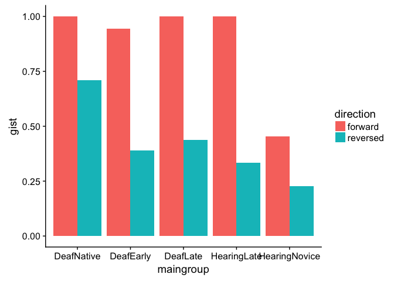
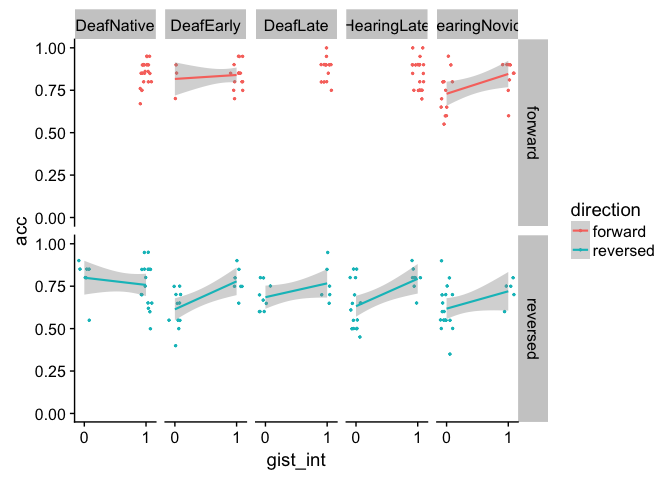
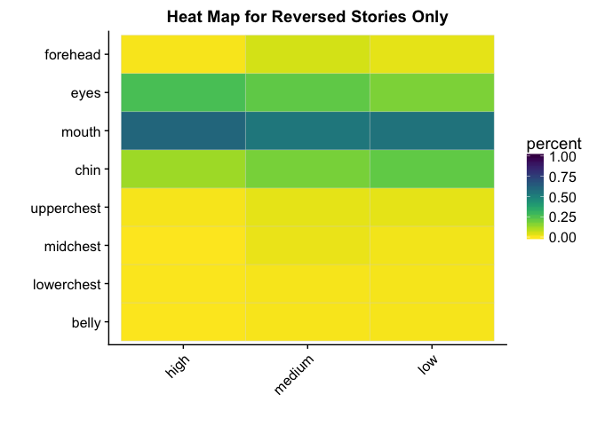
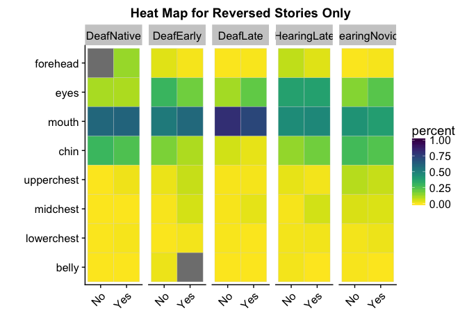

Gist (study1adults)
================
Adam Stone, PhD
10-16-2017

-   [Introduction](#introduction)
-   [Participants](#participants)
-   [Lexical Recall](#lexical-recall)
-   [High, Medium, and Low Comprehenders](#high-medium-and-low-comprehenders)
    -   [Lex Recall](#lex-recall)
-   [Heat Maps](#heat-maps)
-   [Gist & Gaze Modeling](#gist-gaze-modeling)
    -   [Eye AOI](#eye-aoi)
    -   [Mouth AOI](#mouth-aoi)
    -   [Chin AOI](#chin-aoi)
    -   [FaceChest Ratio](#facechest-ratio)

Introduction
============

xxx

Participants
============

``` r
# Load libraries
library(tidyverse)
```

    ## Loading tidyverse: ggplot2
    ## Loading tidyverse: tibble
    ## Loading tidyverse: tidyr
    ## Loading tidyverse: readr
    ## Loading tidyverse: purrr
    ## Loading tidyverse: dplyr

    ## Conflicts with tidy packages ----------------------------------------------

    ## filter(): dplyr, stats
    ## lag():    dplyr, stats

``` r
library(stringr)
library(lme4)
```

    ## Loading required package: Matrix

    ## 
    ## Attaching package: 'Matrix'

    ## The following object is masked from 'package:tidyr':
    ## 
    ##     expand

``` r
library(lmerTest)
```

    ## 
    ## Attaching package: 'lmerTest'

    ## The following object is masked from 'package:lme4':
    ## 
    ##     lmer

    ## The following object is masked from 'package:stats':
    ## 
    ##     step

``` r
library(prettydoc)
library(broom)
library(knitr)
library(xtable)
library(kableExtra)
library(viridis)
```

    ## Loading required package: viridisLite

``` r
library(cowplot)
```

    ## 
    ## Attaching package: 'cowplot'

    ## The following object is masked from 'package:ggplot2':
    ## 
    ##     ggsave

``` r
options(knitr.table.format = "html") 

# Import data!
data <- read_csv('cleanpercentdata.csv',col_types = 
                   cols(
                     id = col_integer(),
                     participant = col_character(),
                     hearing = col_character(),
                     videogroup = col_character(),
                     aoagroup = col_character(),
                     languagegroup = col_character(),
                     maingroup = col_character(),
                     video = col_character(),
                     story = col_character(),
                     direction = col_character(),
                     age = col_double(),
                     selfrate = col_double(),
                     signyrs = col_double(),
                     aoasl = col_integer(),
                     acc = col_double(),
                     aoi = col_character(),
                     percent = col_double()
                   ))

# And factorize
data <- data %>%
  mutate(participant = as.factor(participant)) %>%
  mutate(id = as.factor(id)) %>%
  mutate(hearing = as.factor(hearing)) %>%
  mutate(videogroup = as.factor(videogroup)) %>%
  mutate(aoagroup = as.factor(aoagroup)) %>%
  mutate(languagegroup = as.factor(languagegroup)) %>%
  mutate(maingroup = as.factor(maingroup)) %>%
  mutate(video = as.factor(video)) %>%
  mutate(story = as.factor(story)) %>%
  mutate(direction = as.factor(direction)) %>%
  mutate(aoi = as.factor(aoi))

# Remove ASL from the end of MainGroup names
data <- data %>%
  mutate(maingroup = case_when(
    str_detect(maingroup,"DeafNative") ~ "DeafNative",
    str_detect(maingroup,"DeafEarlyASL") ~ "DeafEarly",
    str_detect(maingroup,"DeafLateASL") ~ "DeafLate",
    str_detect(maingroup,"HearingLateASL") ~ "HearingLate",
    str_detect(maingroup,"HearingNoviceASL") ~ "HearingNovice"
  )) %>%
  mutate(maingroup = as.factor(maingroup))

# Set reference levels for maingroup
data$maingroup <- relevel(data$maingroup, ref="DeafNative")

dataoriginal <- data # Save item-level data just in case

# Take out HearingNoviceASL
# data <- data %>%
#   filter(maingroup!="HearingNoviceASL")

# Load awesome function to make correlation tables with stars for significance
# From: https://myowelt.blogspot.co.uk/2008/04/beautiful-correlation-tables-in-r.html
corstarsl <- function(x){ 
require(Hmisc) 
x <- as.matrix(x) 
R <- Hmisc::rcorr(x)$r 
p <- Hmisc::rcorr(x)$P 
## define notions for significance levels; spacing is important.
mystars <- ifelse(p < .001, "***", ifelse(p < .01, "** ", ifelse(p < .05, "* ", " ")))
## trunctuate the matrix that holds the correlations to two decimal
R <- format(round(cbind(rep(-1.11, ncol(x)), R), 2))[,-1] 
## build a new matrix that includes the correlations with their apropriate stars 
Rnew <- matrix(paste(R, mystars, sep=""), ncol=ncol(x)) 
diag(Rnew) <- paste(diag(R), " ", sep="") 
rownames(Rnew) <- colnames(x) 
colnames(Rnew) <- paste(colnames(x), "", sep="") 
## remove upper triangle
Rnew <- as.matrix(Rnew)
Rnew[upper.tri(Rnew, diag = TRUE)] <- ""
Rnew <- as.data.frame(Rnew) 
## remove last column and return the matrix (which is now a data frame)
Rnew <- cbind(Rnew[1:length(Rnew)-1])
return(Rnew) 
}


# # Now collapse eye gaze data to subject-level 
# data <- data %>%
#   group_by(participant,direction,aoi) %>%
#   dplyr::summarize(percent = mean(percent,na.rm=TRUE))
# data[data=="NaN"] <- NA
# 
# # Join subject info with data that's now subject-level
# data <- left_join(data,data.subjectinfo, by=c("participant","direction"))


# But now we need to go back and add in a complete lexical recall dataset, even including those trials that got thrown out in 03eyegaze.nb.html. Because the lexical accuracy data is still good. So let's work on that. 
cleanlexdata <- read_csv('cleandata.csv',col_types = 
                   cols(
                     id = col_integer(),
                     participant = col_character(),
                     hearing = col_character(),
                     videogroup = col_character(),
                     aoagroup = col_character(),
                     languagegroup = col_character(),
                     maingroup = col_character(),
                     video = col_character(),
                     story = col_character(),
                     direction = col_character(),
                     age = col_double(),
                     selfrate = col_double(),
                     signyrs = col_double(),
                     aoasl = col_integer(),
                     acc = col_double(),
                     forehead = col_double(),
                     eyes = col_double(),
                     mouth = col_double(),
                     chin = col_double(),
                     upperchest = col_double(),
                     midchest = col_double(),
                     lowerchest = col_double(),
                     belly = col_double(),
                     left = col_double(),
                     right = col_double(),
                     total = col_double()
                   )) %>%
  mutate(maingroup = case_when(
    str_detect(maingroup,"DeafNative") ~ "DeafNative",
    str_detect(maingroup,"DeafEarlyASL") ~ "DeafEarly",
    str_detect(maingroup,"DeafLateASL") ~ "DeafLate",
    str_detect(maingroup,"HearingLateASL") ~ "HearingLate",
    str_detect(maingroup,"HearingNoviceASL") ~ "HearingNovice"
  )) %>%
  mutate(maingroup = as.factor(maingroup))

# Pull out subject info for later in summary tables
subjectinfo <- data %>%
  select(-aoi,-percent,-video,-story,-direction,-acc) %>%
  distinct()

# Participant Characteristics Table (using cleanlexdata because it's more complete)
groupmeans <- cleanlexdata %>%
  ungroup() %>%
  select(id,participant,maingroup,age,selfrate,signyrs,aoasl) %>%
  distinct() %>%
  group_by(maingroup) %>%
  dplyr::summarize(n = n(),
            age.m = mean(age),
            age.sd = sd(age),
            selfrate.m = mean(selfrate),
            selfrate.sd = sd(selfrate),
            signyrs.m = mean(signyrs),
            signyrs.sd = sd(signyrs),
            aoasl.m = mean(aoasl),
            aoasl.sd = sd(aoasl)) %>%
  mutate(maingroup =  factor(maingroup, levels = c("DeafNative","DeafEarly","DeafLate",
                                                   "HearingLate","HearingNovice"))) %>%
  arrange(maingroup)    
kable(groupmeans, digits=1) %>% kable_styling(bootstrap_options = c("striped", "hover", "condensed"))
```

<table class="table table-striped table-hover table-condensed" style="margin-left: auto; margin-right: auto;">
<thead>
<tr>
<th style="text-align:left;">
maingroup
</th>
<th style="text-align:right;">
n
</th>
<th style="text-align:right;">
age.m
</th>
<th style="text-align:right;">
age.sd
</th>
<th style="text-align:right;">
selfrate.m
</th>
<th style="text-align:right;">
selfrate.sd
</th>
<th style="text-align:right;">
signyrs.m
</th>
<th style="text-align:right;">
signyrs.sd
</th>
<th style="text-align:right;">
aoasl.m
</th>
<th style="text-align:right;">
aoasl.sd
</th>
</tr>
</thead>
<tbody>
<tr>
<td style="text-align:left;">
DeafNative
</td>
<td style="text-align:right;">
12
</td>
<td style="text-align:right;">
33.0
</td>
<td style="text-align:right;">
9.2
</td>
<td style="text-align:right;">
5.0
</td>
<td style="text-align:right;">
0.0
</td>
<td style="text-align:right;">
32.6
</td>
<td style="text-align:right;">
9.4
</td>
<td style="text-align:right;">
0.2
</td>
<td style="text-align:right;">
0.5
</td>
</tr>
<tr>
<td style="text-align:left;">
DeafEarly
</td>
<td style="text-align:right;">
9
</td>
<td style="text-align:right;">
34.8
</td>
<td style="text-align:right;">
6.6
</td>
<td style="text-align:right;">
5.0
</td>
<td style="text-align:right;">
0.0
</td>
<td style="text-align:right;">
29.8
</td>
<td style="text-align:right;">
7.6
</td>
<td style="text-align:right;">
5.0
</td>
<td style="text-align:right;">
2.7
</td>
</tr>
<tr>
<td style="text-align:left;">
DeafLate
</td>
<td style="text-align:right;">
8
</td>
<td style="text-align:right;">
38.0
</td>
<td style="text-align:right;">
5.9
</td>
<td style="text-align:right;">
5.0
</td>
<td style="text-align:right;">
0.0
</td>
<td style="text-align:right;">
23.2
</td>
<td style="text-align:right;">
5.3
</td>
<td style="text-align:right;">
14.2
</td>
<td style="text-align:right;">
3.0
</td>
</tr>
<tr>
<td style="text-align:left;">
HearingLate
</td>
<td style="text-align:right;">
12
</td>
<td style="text-align:right;">
28.9
</td>
<td style="text-align:right;">
6.2
</td>
<td style="text-align:right;">
4.6
</td>
<td style="text-align:right;">
0.5
</td>
<td style="text-align:right;">
11.8
</td>
<td style="text-align:right;">
4.8
</td>
<td style="text-align:right;">
17.2
</td>
<td style="text-align:right;">
3.4
</td>
</tr>
<tr>
<td style="text-align:left;">
HearingNovice
</td>
<td style="text-align:right;">
11
</td>
<td style="text-align:right;">
20.2
</td>
<td style="text-align:right;">
1.3
</td>
<td style="text-align:right;">
3.0
</td>
<td style="text-align:right;">
0.7
</td>
<td style="text-align:right;">
2.4
</td>
<td style="text-align:right;">
1.0
</td>
<td style="text-align:right;">
17.6
</td>
<td style="text-align:right;">
1.8
</td>
</tr>
</tbody>
</table>
Next we fold in the gist data to both datasets. Because the gist data is direction-level we have to summarize both eyegaze and lexrecall datasets. After doing that we can get a quick snapshot of what comprehension looked like across groups.

``` r
# Import gist data
gist <- read_csv('gist.csv', col_types = cols(
  participant = col_character(),
  forward = col_double(),
  reversed = col_double()
)) %>%
  gather(direction, gist, forward:reversed)

# Bump up data to direction-level and join with gist
data <- data %>%
  group_by(participant, direction, aoi) %>%
  mutate(percent = mean(percent, na.rm=TRUE),
         acc = mean(acc, na.rm=TRUE)) %>%
  select(-video, -story) %>%
  distinct() %>%
  left_join(gist, by = c("participant", "direction")) %>%
  mutate(maingroup = factor(maingroup, levels = c("DeafNative","DeafEarly","DeafLate",
                                                  "HearingLate","HearingNovice")))
```

    ## Warning: Column `participant` joining factor and character vector, coercing
    ## into character vector

    ## Warning: Column `direction` joining factor and character vector, coercing
    ## into character vector

``` r
cleanlexdata <- cleanlexdata %>%
  select(id:acc) %>%
  group_by(participant, direction) %>%
  mutate(acc = mean(acc,na.rm=TRUE)) %>%
  select(-video, -story) %>%
  distinct() %>%
  left_join(gist, by = c("participant", "direction")) %>%
  mutate(maingroup = factor(maingroup, levels = c("DeafNative","DeafEarly","DeafLate",
                                                  "HearingLate","HearingNovice")))

cleanlexdata %>%
  group_by(maingroup, direction) %>%
  dplyr::summarize(gist = mean(gist, na.rm=TRUE)) %>%
  ggplot(aes(x = maingroup, y = gist, fill = direction)) + geom_col(position = "dodge")
```



Lexical Recall
==============

Immediately, one would think lexical recall and gist should be correlated, right? Let's check it out.

``` r
cleanlexdata %>%
  ggplot(aes(x = gist, y = acc, color = direction)) + geom_point() + 
  geom_smooth(method = "lm") + facet_wrap("direction") + 
  scale_x_continuous(breaks = c(0, 0.5, 1))
```



Is there an effect of maingroup and/or direction on gist? Let's do a LMM. The results are that there is a strong effect of direction (p &lt; 0.001) and of group, specifically HearingNovice did much worse on the gist measure than other groups (p &lt; 0.001).

``` r
gist_lmm <- lmer(gist ~ direction * maingroup + (1|id), data = cleanlexdata)
summary(gist_lmm)
```

    ## Linear mixed model fit by REML t-tests use Satterthwaite approximations
    ##   to degrees of freedom [lmerMod]
    ## Formula: gist ~ direction * maingroup + (1 | id)
    ##    Data: cleanlexdata
    ## 
    ## REML criterion at convergence: 56.6
    ## 
    ## Scaled residuals: 
    ##     Min      1Q  Median      3Q     Max 
    ## -1.9208 -0.5645  0.1828  0.5089  1.9714 
    ## 
    ## Random effects:
    ##  Groups   Name        Variance Std.Dev.
    ##  id       (Intercept) 0.009382 0.09686 
    ##  Residual             0.074629 0.27318 
    ## Number of obs: 104, groups:  id, 52
    ## 
    ## Fixed effects:
    ##                                          Estimate Std. Error       df
    ## (Intercept)                               1.00000    0.08367 92.84000
    ## directionreversed                        -0.41667    0.11153 47.00000
    ## maingroupDeafEarly                       -0.11111    0.12781 92.84000
    ## maingroupDeafLate                        -0.06250    0.13230 92.84000
    ## maingroupHearingLate                     -0.08333    0.11833 92.84000
    ## maingroupHearingNovice                   -0.50000    0.12099 92.84000
    ## directionreversed:maingroupDeafEarly     -0.08333    0.17036 47.00000
    ## directionreversed:maingroupDeafLate      -0.08333    0.17634 47.00000
    ## directionreversed:maingroupHearingLate   -0.16667    0.15772 47.00000
    ## directionreversed:maingroupHearingNovice  0.14394    0.16127 47.00000
    ##                                          t value Pr(>|t|)    
    ## (Intercept)                               11.951  < 2e-16 ***
    ## directionreversed                         -3.736 0.000506 ***
    ## maingroupDeafEarly                        -0.869 0.386903    
    ## maingroupDeafLate                         -0.472 0.637734    
    ## maingroupHearingLate                      -0.704 0.483042    
    ## maingroupHearingNovice                    -4.133 7.85e-05 ***
    ## directionreversed:maingroupDeafEarly      -0.489 0.627003    
    ## directionreversed:maingroupDeafLate       -0.473 0.638704    
    ## directionreversed:maingroupHearingLate    -1.057 0.296047    
    ## directionreversed:maingroupHearingNovice   0.893 0.376645    
    ## ---
    ## Signif. codes:  0 '***' 0.001 '**' 0.01 '*' 0.05 '.' 0.1 ' ' 1
    ## 
    ## Correlation of Fixed Effects:
    ##             (Intr) drctnr mngrDE mngrDL mngrHL mngrHN drc:DE drc:DL drc:HL
    ## dirctnrvrsd -0.666                                                        
    ## mngrpDfErly -0.655  0.436                                                 
    ## maingrpDfLt -0.632  0.422  0.414                                          
    ## mngrpHrngLt -0.707  0.471  0.463  0.447                                   
    ## mngrpHrngNv -0.692  0.461  0.453  0.437  0.489                            
    ## drctnrvr:DE  0.436 -0.655 -0.666 -0.276 -0.309 -0.302                     
    ## drctnrvr:DL  0.422 -0.632 -0.276 -0.666 -0.298 -0.291  0.414              
    ## drctnrvr:HL  0.471 -0.707 -0.309 -0.298 -0.666 -0.326  0.463  0.447       
    ## drctnrvr:HN  0.461 -0.692 -0.302 -0.291 -0.326 -0.666  0.453  0.437  0.489

What about reversed stories only? A simple linear regression here. HearingNovice are significantly different (p = 0.01), and a nonsignificant effect for HearingLate at p = 0.06.

``` r
gist_lmm_r <- lm(gist ~ maingroup, data = filter(cleanlexdata, direction == "reversed"))
summary(gist_lmm_r)
```

    ## 
    ## Call:
    ## lm(formula = gist ~ maingroup, data = filter(cleanlexdata, direction == 
    ##     "reversed"))
    ## 
    ## Residuals:
    ##     Min      1Q  Median      3Q     Max 
    ## -0.5833 -0.2273  0.0625  0.1667  0.6111 
    ## 
    ## Coefficients:
    ##                        Estimate Std. Error t value Pr(>|t|)    
    ## (Intercept)             0.58333    0.09295   6.276 1.03e-07 ***
    ## maingroupDeafEarly     -0.19444    0.14198  -1.369   0.1774    
    ## maingroupDeafLate      -0.14583    0.14697  -0.992   0.3261    
    ## maingroupHearingLate   -0.25000    0.13145  -1.902   0.0633 .  
    ## maingroupHearingNovice -0.35606    0.13441  -2.649   0.0110 *  
    ## ---
    ## Signif. codes:  0 '***' 0.001 '**' 0.01 '*' 0.05 '.' 0.1 ' ' 1
    ## 
    ## Residual standard error: 0.322 on 47 degrees of freedom
    ## Multiple R-squared:  0.1403, Adjusted R-squared:  0.06718 
    ## F-statistic: 1.918 on 4 and 47 DF,  p-value: 0.123

High, Medium, and Low Comprehenders
===================================

I'm going to focus on reversed stories only for now. And we'll group the 100%, 50%, and 0% in three "gist" groups.

``` r
lex_groups <- cleanlexdata %>%
  filter(direction == "reversed") %>%
  mutate(gistgroup = case_when(
    gist == 1 ~ "high",
    gist == 0.5 ~ "medium",
    gist == 0 ~ "low")) %>%
  mutate(gistgroup = factor(gistgroup, levels = c("high","medium","low")))

lex_groups %>%
  group_by(gistgroup,maingroup) %>%
  dplyr::summarize(count = n()) %>%
  spread(gistgroup,count)
```

    ## # A tibble: 5 x 4
    ##       maingroup  high medium   low
    ## *        <fctr> <int>  <int> <int>
    ## 1    DeafNative     4      6     2
    ## 2     DeafEarly     1      5     3
    ## 3      DeafLate     2      3     3
    ## 4   HearingLate    NA      8     4
    ## 5 HearingNovice    NA      5     6

Lex Recall
----------

Are the gist groups significantly different for lexical recall scores? Low is significantly different from medium and high. So medium and high still have somewhat similar lex recall scores. *(Aside: I did also run a regression of gist score on acc and the effect was significant, p = 0.00014. So maybe sometimes we just use gist as a continuous variable instead of a grouping variable.)*

``` r
lex_group_m <- lm(acc ~ gist, data = lex_groups)
summary(lex_group_m)
```

    ## 
    ## Call:
    ## lm(formula = acc ~ gist, data = lex_groups)
    ## 
    ## Residuals:
    ##      Min       1Q   Median       3Q      Max 
    ## -0.18860 -0.04819 -0.01360  0.05918  0.18640 
    ## 
    ## Coefficients:
    ##             Estimate Std. Error t value Pr(>|t|)    
    ## (Intercept)  0.63860    0.01925  33.166  < 2e-16 ***
    ## gist         0.15446    0.03744   4.125  0.00014 ***
    ## ---
    ## Signif. codes:  0 '***' 0.001 '**' 0.01 '*' 0.05 '.' 0.1 ' ' 1
    ## 
    ## Residual standard error: 0.08915 on 50 degrees of freedom
    ## Multiple R-squared:  0.2539, Adjusted R-squared:  0.239 
    ## F-statistic: 17.02 on 1 and 50 DF,  p-value: 0.0001399

Heat Maps
=========

Let's get heat maps of each group's eye behavior for reversed stories. I'll present them collapsed across all AoA groups and then show each AoA group in a grid.

And here we go. I think it's pretty interesting. Of course we've got some sub-groups with only 1 or 2 people but you can sort of see the pattern among the DeafNative - the less they understand, the more distributed the eye gaze is

``` r
eye_groups <- data %>%
  filter(direction == "reversed") %>%
  mutate(gistgroup = case_when(
    gist == 1 ~ "high",
    gist == 0.5 ~ "medium",
    gist == 0 ~ "low")) %>%
  mutate(gistgroup = factor(gistgroup, levels = c("high","medium","low"))) 

eye_groups_heat <- eye_groups %>%
  filter(aoi != "left" & aoi != "right" & aoi != "facechest" & aoi != "face" & aoi != "chest") %>%
  group_by(gistgroup, maingroup, participant, aoi) %>%
  dplyr::summarize(percent = mean(percent, na.rm=TRUE)) %>%
  group_by(gistgroup, maingroup, aoi) %>%
  dplyr::summarize(percent = mean(percent, na.rm=TRUE)) %>%
#  spread(aoi,percent) %>%
#  filter(!is.na(aoi)) %>%
  mutate(aoi = factor(aoi,levels=c("belly","lowerchest","midchest",
                                   "upperchest","chin","mouth","eyes","forehead")))

eye_groups_heat %>%
  group_by(gistgroup,aoi) %>%
  dplyr::summarize(percent = mean(percent, na.rm=TRUE)) %>%
  ggplot(aes(x = gistgroup, y = aoi)) +
  geom_tile(aes(fill=percent),color="lightgray",na.rm=TRUE) + 
  scale_fill_viridis(option = "viridis", direction=-1, limits = c(0,1)) +
  theme(axis.text.x=element_text(angle=45,hjust=1)) + 
  ylab("") + xlab("") + ggtitle("Heat Map for Reversed Stories Only")
```



``` r
eye_groups_heat %>%
  ggplot(aes(x = gistgroup, y = aoi)) +
  geom_tile(aes(fill=percent),color="lightgray",na.rm=TRUE) + 
  scale_fill_viridis(option = "viridis", direction=-1, limits = c(0,1)) +
  theme(axis.text.x=element_text(angle=45,hjust=1)) + facet_grid(.~maingroup) +
  ylab("") + xlab("") + ggtitle("Heat Map for Reversed Stories Only")
```



Gist & Gaze Modeling
====================

That's cool, right? Anyway so I am now going to try to make models. I was thinking...should eye gaze behavior predict gist, or gist predict eye behavior? Which direction could this work? Gist is measured after eye gaze, so it sounds like eye gaze should predict gist.

But that can't be right. Eye gaze is a function of whether one can understand or comprehend the story. So gist should predict eye gaze changes. *Aside: I've read criticism of the use "predict" in psychology and that it's better characterized as "associated with"...we can think about that in the write-up.*

So a basic model would be (A) gist -&gt; eye gaze. We could predict group differences such that (B) gist X group -&gt; eye gaze. Let's give it a shot. Breaking it down by AOI, and checking both A and B. **Again, reversed stories only. We can add forward stories back in later, maybe, or analyze separately**

Eye AOI
-------

1.  No effect of gist.
2.  No effect of gist or maingroup.

``` r
eye_groups_aoi <- eye_groups %>%
  spread(aoi,percent)

eye_lm <- lm(eyes ~ gist, data = eye_groups_aoi)
summary(eye_lm)
```

    ## 
    ## Call:
    ## lm(formula = eyes ~ gist, data = eye_groups_aoi)
    ## 
    ## Residuals:
    ##     Min      1Q  Median      3Q     Max 
    ## -0.2390 -0.1783 -0.1048  0.1502  0.6462 
    ## 
    ## Coefficients:
    ##             Estimate Std. Error t value Pr(>|t|)    
    ## (Intercept)  0.21079    0.05749   3.666 0.000636 ***
    ## gist         0.02875    0.11266   0.255 0.799748    
    ## ---
    ## Signif. codes:  0 '***' 0.001 '**' 0.01 '*' 0.05 '.' 0.1 ' ' 1
    ## 
    ## Residual standard error: 0.2514 on 46 degrees of freedom
    ##   (3 observations deleted due to missingness)
    ## Multiple R-squared:  0.001413,   Adjusted R-squared:  -0.0203 
    ## F-statistic: 0.0651 on 1 and 46 DF,  p-value: 0.7997

``` r
eye_lm_mg <- lm(eyes ~ gist * maingroup, data = eye_groups_aoi)
summary(eye_lm_mg)
```

    ## 
    ## Call:
    ## lm(formula = eyes ~ gist * maingroup, data = eye_groups_aoi)
    ## 
    ## Residuals:
    ##      Min       1Q   Median       3Q      Max 
    ## -0.37726 -0.15142 -0.03162  0.05603  0.53884 
    ## 
    ## Coefficients:
    ##                              Estimate Std. Error t value Pr(>|t|)
    ## (Intercept)                  0.112780   0.171678   0.657    0.515
    ## gist                         0.011001   0.242789   0.045    0.964
    ## maingroupDeafEarly          -0.081817   0.245532  -0.333    0.741
    ## maingroupDeafLate            0.003314   0.216460   0.015    0.988
    ## maingroupHearingLate         0.264758   0.211848   1.250    0.219
    ## maingroupHearingNovice       0.054189   0.199359   0.272    0.787
    ## gist:maingroupDeafEarly      0.692308   0.481143   1.439    0.158
    ## gist:maingroupDeafLate       0.175124   0.330925   0.529    0.600
    ## gist:maingroupHearingLate   -0.101014   0.394698  -0.256    0.799
    ## gist:maingroupHearingNovice  0.035629   0.386433   0.092    0.927
    ## 
    ## Residual standard error: 0.2482 on 38 degrees of freedom
    ##   (3 observations deleted due to missingness)
    ## Multiple R-squared:  0.1956, Adjusted R-squared:  0.005122 
    ## F-statistic: 1.027 on 9 and 38 DF,  p-value: 0.4369

Mouth AOI
---------

1.  No effect of gist.
2.  No effect of gist or maingroup. One weeeeaaakkk interaction for gist and HearingNovice (p = 0.098).

``` r
mouth_lm <- lm(mouth ~ gist, data = eye_groups_aoi)
summary(mouth_lm)
```

    ## 
    ## Call:
    ## lm(formula = mouth ~ gist, data = eye_groups_aoi)
    ## 
    ## Residuals:
    ##      Min       1Q   Median       3Q      Max 
    ## -0.49569 -0.21194 -0.00104  0.25736  0.41236 
    ## 
    ## Coefficients:
    ##             Estimate Std. Error t value Pr(>|t|)    
    ## (Intercept)  0.52462    0.06168   8.505 3.26e-11 ***
    ## gist         0.02646    0.12337   0.215    0.831    
    ## ---
    ## Signif. codes:  0 '***' 0.001 '**' 0.01 '*' 0.05 '.' 0.1 ' ' 1
    ## 
    ## Residual standard error: 0.2839 on 49 degrees of freedom
    ## Multiple R-squared:  0.0009382,  Adjusted R-squared:  -0.01945 
    ## F-statistic: 0.04602 on 1 and 49 DF,  p-value: 0.831

``` r
mouth_lm_mg <- lm(mouth ~ gist * maingroup, data = eye_groups_aoi)
summary(mouth_lm_mg)
```

    ## 
    ## Call:
    ## lm(formula = mouth ~ gist * maingroup, data = eye_groups_aoi)
    ## 
    ## Residuals:
    ##      Min       1Q   Median       3Q      Max 
    ## -0.56616 -0.16468  0.02667  0.18076  0.42708 
    ## 
    ## Coefficients:
    ##                             Estimate Std. Error t value Pr(>|t|)   
    ## (Intercept)                  0.49111    0.15251   3.220  0.00251 **
    ## gist                         0.14311    0.22527   0.635  0.52878   
    ## maingroupDeafEarly           0.12268    0.21731   0.565  0.57547   
    ## maingroupDeafLate            0.34090    0.20866   1.634  0.10996   
    ## maingroupHearingLate        -0.20287    0.20306  -0.999  0.32363   
    ## maingroupHearingNovice       0.08917    0.18773   0.475  0.63733   
    ## gist:maingroupDeafEarly     -0.45213    0.45180  -1.001  0.32282   
    ## gist:maingroupDeafLate      -0.33477    0.33127  -1.011  0.31815   
    ## gist:maingroupHearingLate    0.28868    0.39823   0.725  0.47263   
    ## gist:maingroupHearingNovice -0.66938    0.39521  -1.694  0.09790 . 
    ## ---
    ## Signif. codes:  0 '***' 0.001 '**' 0.01 '*' 0.05 '.' 0.1 ' ' 1
    ## 
    ## Residual standard error: 0.2681 on 41 degrees of freedom
    ## Multiple R-squared:  0.2541, Adjusted R-squared:  0.09037 
    ## F-statistic: 1.552 on 9 and 41 DF,  p-value: 0.1626

Chin AOI
--------

1.  No effect of gist.
2.  No effect of gist. One significant effect of DeafLate (p = 0.04), they look at chin less.

``` r
chin_lm <- lm(chin ~ gist, data = eye_groups_aoi)
summary(chin_lm)
```

    ## 
    ## Call:
    ## lm(formula = chin ~ gist, data = eye_groups_aoi)
    ## 
    ## Residuals:
    ##      Min       1Q   Median       3Q      Max 
    ## -0.19298 -0.15689 -0.10408  0.07455  0.72826 
    ## 
    ## Coefficients:
    ##             Estimate Std. Error t value Pr(>|t|)    
    ## (Intercept)  0.19400    0.04969   3.904 0.000295 ***
    ## gist        -0.01597    0.09938  -0.161 0.872999    
    ## ---
    ## Signif. codes:  0 '***' 0.001 '**' 0.01 '*' 0.05 '.' 0.1 ' ' 1
    ## 
    ## Residual standard error: 0.2284 on 48 degrees of freedom
    ##   (1 observation deleted due to missingness)
    ## Multiple R-squared:  0.0005378,  Adjusted R-squared:  -0.02028 
    ## F-statistic: 0.02583 on 1 and 48 DF,  p-value: 0.873

``` r
chin_lm_mg <- lm(chin ~ gist * maingroup, data = eye_groups_aoi)
summary(chin_lm_mg)
```

    ## 
    ## Call:
    ## lm(formula = chin ~ gist * maingroup, data = eye_groups_aoi)
    ## 
    ## Residuals:
    ##      Min       1Q   Median       3Q      Max 
    ## -0.33836 -0.11838 -0.03239  0.09000  0.70113 
    ## 
    ## Coefficients:
    ##                             Estimate Std. Error t value Pr(>|t|)   
    ## (Intercept)                  0.39112    0.12494   3.130  0.00326 **
    ## gist                        -0.18597    0.18455  -1.008  0.31967   
    ## maingroupDeafEarly          -0.06914    0.17803  -0.388  0.69982   
    ## maingroupDeafLate           -0.35927    0.17094  -2.102  0.04191 * 
    ## maingroupHearingLate        -0.26981    0.16635  -1.622  0.11268   
    ## maingroupHearingNovice      -0.22687    0.15379  -1.475  0.14799   
    ## gist:maingroupDeafEarly     -0.30083    0.38294  -0.786  0.43674   
    ## gist:maingroupDeafLate       0.18910    0.27138   0.697  0.48995   
    ## gist:maingroupHearingLate    0.27864    0.32624   0.854  0.39815   
    ## gist:maingroupHearingNovice  0.51631    0.32377   1.595  0.11865   
    ## ---
    ## Signif. codes:  0 '***' 0.001 '**' 0.01 '*' 0.05 '.' 0.1 ' ' 1
    ## 
    ## Residual standard error: 0.2197 on 40 degrees of freedom
    ##   (1 observation deleted due to missingness)
    ## Multiple R-squared:  0.2293, Adjusted R-squared:  0.05595 
    ## F-statistic: 1.323 on 9 and 40 DF,  p-value: 0.2561

FaceChest Ratio
---------------

1.  No effect of gist.
2.  No effect of gist or maingroup.

``` r
fcr_lm <- lm(facechest ~ gist, data = eye_groups_aoi)
summary(fcr_lm)
```

    ## 
    ## Call:
    ## lm(formula = facechest ~ gist, data = eye_groups_aoi)
    ## 
    ## Residuals:
    ##      Min       1Q   Median       3Q      Max 
    ## -0.56175 -0.01058  0.05806  0.08131  0.11501 
    ## 
    ## Coefficients:
    ##             Estimate Std. Error t value Pr(>|t|)    
    ## (Intercept)  0.88499    0.03251  27.224   <2e-16 ***
    ## gist         0.06741    0.06502   1.037    0.305    
    ## ---
    ## Signif. codes:  0 '***' 0.001 '**' 0.01 '*' 0.05 '.' 0.1 ' ' 1
    ## 
    ## Residual standard error: 0.1496 on 49 degrees of freedom
    ## Multiple R-squared:  0.02146,    Adjusted R-squared:  0.001495 
    ## F-statistic: 1.075 on 1 and 49 DF,  p-value: 0.3049

``` r
fcr_lm_mg <- lm(facechest ~ gist * maingroup, data = eye_groups_aoi)
summary(fcr_lm_mg)
```

    ## 
    ## Call:
    ## lm(formula = facechest ~ gist * maingroup, data = eye_groups_aoi)
    ## 
    ## Residuals:
    ##      Min       1Q   Median       3Q      Max 
    ## -0.37383 -0.02580  0.01980  0.05194  0.29205 
    ## 
    ## Coefficients:
    ##                               Estimate Std. Error t value Pr(>|t|)    
    ## (Intercept)                  0.9749728  0.0774997  12.580 1.16e-15 ***
    ## gist                         0.0032373  0.1144747   0.028    0.978    
    ## maingroupDeafEarly          -0.0515619  0.1104284  -0.467    0.643    
    ## maingroupDeafLate           -0.0006825  0.1060302  -0.006    0.995    
    ## maingroupHearingLate        -0.1263958  0.1031861  -1.225    0.228    
    ## maingroupHearingNovice      -0.1358642  0.0953956  -1.424    0.162    
    ## gist:maingroupDeafEarly      0.0071607  0.2295845   0.031    0.975    
    ## gist:maingroupDeafLate      -0.0056539  0.1683360  -0.034    0.973    
    ## gist:maingroupHearingLate    0.1957267  0.2023646   0.967    0.339    
    ## gist:maingroupHearingNovice -0.2759135  0.2008298  -1.374    0.177    
    ## ---
    ## Signif. codes:  0 '***' 0.001 '**' 0.01 '*' 0.05 '.' 0.1 ' ' 1
    ## 
    ## Residual standard error: 0.1363 on 41 degrees of freedom
    ## Multiple R-squared:  0.3208, Adjusted R-squared:  0.1717 
    ## F-statistic: 2.151 on 9 and 41 DF,  p-value: 0.04656
