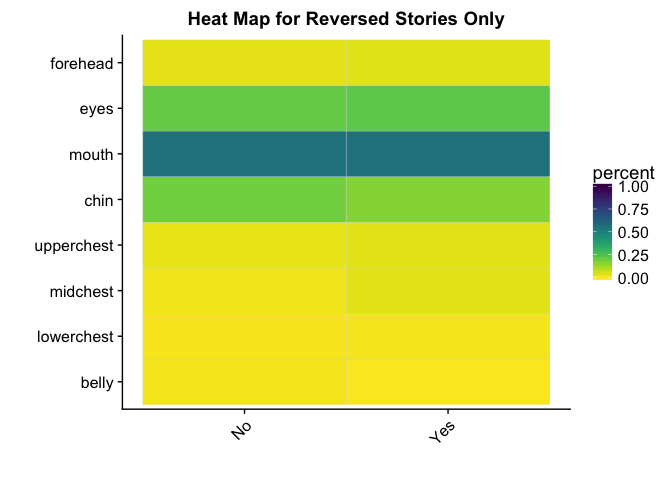

Gist (study1adults)
================
Adam Stone, PhD
10-23-2017

-   [Introduction](#introduction)
-   [Participants](#participants)
-   [Lexical Recall](#lexical-recall)
-   [AoA effects for Reversed Stories on Gist!](#aoa-effects-for-reversed-stories-on-gist)
-   [Heat Maps](#heat-maps)
-   [Gist & Gaze Modeling](#gist-gaze-modeling)
    -   [Eye AOI](#eye-aoi)
    -   [Mouth AOI](#mouth-aoi)
    -   [Chin AOI](#chin-aoi)
    -   [FaceChest Ratio](#facechest-ratio)
    -   [MouthEye Ratio (+1 = Mouth, -1 = Eye)](#moutheye-ratio-1-mouth--1-eye)
-   [Correlations](#correlations)
-   [Moutheye Ratio](#moutheye-ratio)

Introduction
============

Okay let's look at gist!

Participants
============

``` r
# Load libraries
library(tidyverse)
```

    ## Loading tidyverse: ggplot2
    ## Loading tidyverse: tibble
    ## Loading tidyverse: tidyr
    ## Loading tidyverse: readr
    ## Loading tidyverse: purrr
    ## Loading tidyverse: dplyr

    ## Conflicts with tidy packages ----------------------------------------------

    ## filter(): dplyr, stats
    ## lag():    dplyr, stats

``` r
library(stringr)
library(lme4)
```

    ## Loading required package: Matrix

    ## 
    ## Attaching package: 'Matrix'

    ## The following object is masked from 'package:tidyr':
    ## 
    ##     expand

``` r
library(lmerTest)
```

    ## 
    ## Attaching package: 'lmerTest'

    ## The following object is masked from 'package:lme4':
    ## 
    ##     lmer

    ## The following object is masked from 'package:stats':
    ## 
    ##     step

``` r
library(prettydoc)
library(broom)
library(knitr)
library(xtable)
library(kableExtra)
library(viridis)
```

    ## Loading required package: viridisLite

``` r
library(cowplot)
```

    ## 
    ## Attaching package: 'cowplot'

    ## The following object is masked from 'package:ggplot2':
    ## 
    ##     ggsave

``` r
options(knitr.table.format = "html") 

# Import data!
data <- read_csv('cleanpercentdata.csv',col_types = 
                   cols(
                     id = col_integer(),
                     participant = col_character(),
                     hearing = col_character(),
                     videogroup = col_character(),
                     aoagroup = col_character(),
                     languagegroup = col_character(),
                     maingroup = col_character(),
                     video = col_character(),
                     story = col_character(),
                     direction = col_character(),
                     age = col_double(),
                     selfrate = col_double(),
                     signyrs = col_double(),
                     aoasl = col_integer(),
                     acc = col_double(),
                     aoi = col_character(),
                     percent = col_double()
                   ))

# And factorize
data <- data %>%
  mutate(participant = as.factor(participant)) %>%
  mutate(id = as.factor(id)) %>%
  mutate(hearing = as.factor(hearing)) %>%
  mutate(videogroup = as.factor(videogroup)) %>%
  mutate(aoagroup = as.factor(aoagroup)) %>%
  mutate(languagegroup = as.factor(languagegroup)) %>%
  mutate(maingroup = as.factor(maingroup)) %>%
  mutate(video = as.factor(video)) %>%
  mutate(story = as.factor(story)) %>%
  mutate(direction = as.factor(direction)) %>%
  mutate(aoi = as.factor(aoi))

# Remove ASL from the end of MainGroup names
data <- data %>%
  mutate(maingroup = case_when(
    str_detect(maingroup,"DeafNative") ~ "DeafNative",
    str_detect(maingroup,"DeafEarlyASL") ~ "DeafEarly",
    str_detect(maingroup,"DeafLateASL") ~ "DeafLate",
    str_detect(maingroup,"HearingLateASL") ~ "HearingLate",
    str_detect(maingroup,"HearingNoviceASL") ~ "HearingNovice"
  )) %>%
  mutate(maingroup = as.factor(maingroup))

# Set reference levels for maingroup
data$maingroup <- relevel(data$maingroup, ref="DeafNative")

dataoriginal <- data # Save item-level data just in case

# Take out HearingNoviceASL
# data <- data %>%
#   filter(maingroup!="HearingNoviceASL")

# Load awesome function to make correlation tables with stars for significance
# From: https://myowelt.blogspot.co.uk/2008/04/beautiful-correlation-tables-in-r.html
corstarsl <- function(x){ 
require(Hmisc) 
x <- as.matrix(x) 
R <- Hmisc::rcorr(x)$r 
p <- Hmisc::rcorr(x)$P 
## define notions for significance levels; spacing is important.
mystars <- ifelse(p < .001, "***", ifelse(p < .01, "** ", ifelse(p < .05, "* ", " ")))
## trunctuate the matrix that holds the correlations to two decimal
R <- format(round(cbind(rep(-1.11, ncol(x)), R), 2))[,-1] 
## build a new matrix that includes the correlations with their apropriate stars 
Rnew <- matrix(paste(R, mystars, sep=""), ncol=ncol(x)) 
diag(Rnew) <- paste(diag(R), " ", sep="") 
rownames(Rnew) <- colnames(x) 
colnames(Rnew) <- paste(colnames(x), "", sep="") 
## remove upper triangle
Rnew <- as.matrix(Rnew)
Rnew[upper.tri(Rnew, diag = TRUE)] <- ""
Rnew <- as.data.frame(Rnew) 
## remove last column and return the matrix (which is now a data frame)
Rnew <- cbind(Rnew[1:length(Rnew)-1])
return(Rnew) 
}

prob_calc <- function(x){
  odds <- exp(x)
  prob <- odds / (1 + odds)
  return(prob)
}

# # Now collapse eye gaze data to subject-level 
# data <- data %>%
#   group_by(participant,direction,aoi) %>%
#   dplyr::summarize(percent = mean(percent,na.rm=TRUE))
# data[data=="NaN"] <- NA
# 
# # Join subject info with data that's now subject-level
# data <- left_join(data,data.subjectinfo, by=c("participant","direction"))


# But now we need to go back and add in a complete lexical recall dataset, even including those trials that got thrown out in 03eyegaze.nb.html. Because the lexical accuracy data is still good. So let's work on that. 
cleanlexdata <- read_csv('cleandata.csv',col_types = 
                   cols(
                     id = col_integer(),
                     participant = col_character(),
                     hearing = col_character(),
                     videogroup = col_character(),
                     aoagroup = col_character(),
                     languagegroup = col_character(),
                     maingroup = col_character(),
                     video = col_character(),
                     story = col_character(),
                     direction = col_character(),
                     age = col_double(),
                     selfrate = col_double(),
                     signyrs = col_double(),
                     aoasl = col_integer(),
                     acc = col_double(),
                     forehead = col_double(),
                     eyes = col_double(),
                     mouth = col_double(),
                     chin = col_double(),
                     upperchest = col_double(),
                     midchest = col_double(),
                     lowerchest = col_double(),
                     belly = col_double(),
                     left = col_double(),
                     right = col_double(),
                     total = col_double()
                   )) %>%
  mutate(maingroup = case_when(
    str_detect(maingroup,"DeafNative") ~ "DeafNative",
    str_detect(maingroup,"DeafEarlyASL") ~ "DeafEarly",
    str_detect(maingroup,"DeafLateASL") ~ "DeafLate",
    str_detect(maingroup,"HearingLateASL") ~ "HearingLate",
    str_detect(maingroup,"HearingNoviceASL") ~ "HearingNovice"
  )) %>%
  mutate(maingroup = as.factor(maingroup))

# Pull out subject info for later in summary tables
subjectinfo <- data %>%
  dplyr::select(-aoi,-percent,-video,-story,-direction,-acc) %>%
  distinct()

# Participant Characteristics Table (using cleanlexdata because it's more complete)
groupmeans <- cleanlexdata %>%
  ungroup() %>%
  dplyr::select(id,participant,maingroup,age,selfrate,signyrs,aoasl) %>%
  distinct() %>%
  group_by(maingroup) %>%
  dplyr::summarize(n = n(),
            age.m = mean(age),
            age.sd = sd(age),
            selfrate.m = mean(selfrate),
            selfrate.sd = sd(selfrate),
            signyrs.m = mean(signyrs),
            signyrs.sd = sd(signyrs),
            aoasl.m = mean(aoasl),
            aoasl.sd = sd(aoasl)) %>%
  mutate(maingroup =  factor(maingroup, levels = c("DeafNative","DeafEarly","DeafLate",
                                                   "HearingLate","HearingNovice"))) %>%
  arrange(maingroup)    
kable(groupmeans, digits=1) %>% kable_styling(bootstrap_options = c("striped", "hover", "condensed"))
```

<table class="table table-striped table-hover table-condensed" style="margin-left: auto; margin-right: auto;">
<thead>
<tr>
<th style="text-align:left;">
maingroup
</th>
<th style="text-align:right;">
n
</th>
<th style="text-align:right;">
age.m
</th>
<th style="text-align:right;">
age.sd
</th>
<th style="text-align:right;">
selfrate.m
</th>
<th style="text-align:right;">
selfrate.sd
</th>
<th style="text-align:right;">
signyrs.m
</th>
<th style="text-align:right;">
signyrs.sd
</th>
<th style="text-align:right;">
aoasl.m
</th>
<th style="text-align:right;">
aoasl.sd
</th>
</tr>
</thead>
<tbody>
<tr>
<td style="text-align:left;">
DeafNative
</td>
<td style="text-align:right;">
12
</td>
<td style="text-align:right;">
33.0
</td>
<td style="text-align:right;">
9.2
</td>
<td style="text-align:right;">
5.0
</td>
<td style="text-align:right;">
0.0
</td>
<td style="text-align:right;">
32.6
</td>
<td style="text-align:right;">
9.4
</td>
<td style="text-align:right;">
0.2
</td>
<td style="text-align:right;">
0.5
</td>
</tr>
<tr>
<td style="text-align:left;">
DeafEarly
</td>
<td style="text-align:right;">
9
</td>
<td style="text-align:right;">
34.8
</td>
<td style="text-align:right;">
6.6
</td>
<td style="text-align:right;">
5.0
</td>
<td style="text-align:right;">
0.0
</td>
<td style="text-align:right;">
29.8
</td>
<td style="text-align:right;">
7.6
</td>
<td style="text-align:right;">
5.0
</td>
<td style="text-align:right;">
2.7
</td>
</tr>
<tr>
<td style="text-align:left;">
DeafLate
</td>
<td style="text-align:right;">
8
</td>
<td style="text-align:right;">
38.0
</td>
<td style="text-align:right;">
5.9
</td>
<td style="text-align:right;">
5.0
</td>
<td style="text-align:right;">
0.0
</td>
<td style="text-align:right;">
23.2
</td>
<td style="text-align:right;">
5.3
</td>
<td style="text-align:right;">
14.2
</td>
<td style="text-align:right;">
3.0
</td>
</tr>
<tr>
<td style="text-align:left;">
HearingLate
</td>
<td style="text-align:right;">
12
</td>
<td style="text-align:right;">
28.9
</td>
<td style="text-align:right;">
6.2
</td>
<td style="text-align:right;">
4.6
</td>
<td style="text-align:right;">
0.5
</td>
<td style="text-align:right;">
11.8
</td>
<td style="text-align:right;">
4.8
</td>
<td style="text-align:right;">
17.2
</td>
<td style="text-align:right;">
3.4
</td>
</tr>
<tr>
<td style="text-align:left;">
HearingNovice
</td>
<td style="text-align:right;">
11
</td>
<td style="text-align:right;">
20.2
</td>
<td style="text-align:right;">
1.3
</td>
<td style="text-align:right;">
3.0
</td>
<td style="text-align:right;">
0.7
</td>
<td style="text-align:right;">
2.4
</td>
<td style="text-align:right;">
1.0
</td>
<td style="text-align:right;">
17.6
</td>
<td style="text-align:right;">
1.8
</td>
</tr>
</tbody>
</table>
Next we fold in the gist data to both datasets. Because the gist data is direction-level we have to summarize both eyegaze and lexrecall datasets. After doing that we can get a quick snapshot of what comprehension looked like across groups.

``` r
# Import gist data
gist <- read_csv('gist_indiv.csv', col_types = cols(
  participant = col_character(),
  gist.fw1 = col_integer(),
  gist.rv2 = col_integer(),
  gist.fw3 = col_integer(),
  gist.rv4 = col_integer()
)) %>%
  gather(video, gist, gist.fw1:gist.rv4) %>%
  mutate(video = str_sub(video,6,8))

# Join eye and lex data with gist
data <- data %>%
  left_join(gist, by = c("participant", "video")) %>%
  mutate(maingroup = factor(maingroup, levels = c("DeafNative","DeafEarly","DeafLate",
                                                  "HearingLate","HearingNovice"))) %>%
  mutate(gist = factor(gist, labels = c("No","Yes")))
```

    ## Warning: Column `participant` joining factor and character vector, coercing
    ## into character vector

    ## Warning: Column `video` joining factor and character vector, coercing into
    ## character vector

``` r
cleanlexdata <- cleanlexdata %>%
  dplyr::select(id:acc) %>%
  left_join(gist, by = c("participant", "video")) %>%
  mutate(maingroup = factor(maingroup, levels = c("DeafNative","DeafEarly","DeafLate",
                                                  "HearingLate","HearingNovice"))) %>%
  mutate(gistfactor = factor(gist, labels = c("No","Yes"))) %>%
  rename(gist_int = gist,
         gist = gistfactor)

# Bar chart of gist across groups
cleanlexdata %>%
  group_by(maingroup, direction) %>%
  dplyr::summarize(gist = mean(gist_int, na.rm=TRUE)) %>%
  ggplot(aes(x = maingroup, y = gist, fill = direction)) + geom_col(position = "dodge")
```


``` r
cleanlexdata %>%
  dplyr::select(maingroup,direction,gist) %>%
  group_by(maingroup,direction) %>%
  count(gist) %>%
  ungroup() %>%
  spread(gist,n) %>%
  mutate(percent = if_else(!is.na(No), Yes/(No+Yes), 1)) %>%
  dplyr::select(maingroup,direction,percent) %>%
  spread(direction,percent) %>%
  kable(digits=2) %>% kable_styling(bootstrap_options = c("striped", "hover", "condensed"))
```

<table class="table table-striped table-hover table-condensed" style="margin-left: auto; margin-right: auto;">
<thead>
<tr>
<th style="text-align:left;">
maingroup
</th>
<th style="text-align:right;">
forward
</th>
<th style="text-align:right;">
reversed
</th>
</tr>
</thead>
<tbody>
<tr>
<td style="text-align:left;">
DeafNative
</td>
<td style="text-align:right;">
1.00
</td>
<td style="text-align:right;">
0.71
</td>
</tr>
<tr>
<td style="text-align:left;">
DeafEarly
</td>
<td style="text-align:right;">
0.94
</td>
<td style="text-align:right;">
0.39
</td>
</tr>
<tr>
<td style="text-align:left;">
DeafLate
</td>
<td style="text-align:right;">
1.00
</td>
<td style="text-align:right;">
0.44
</td>
</tr>
<tr>
<td style="text-align:left;">
HearingLate
</td>
<td style="text-align:right;">
1.00
</td>
<td style="text-align:right;">
0.33
</td>
</tr>
<tr>
<td style="text-align:left;">
HearingNovice
</td>
<td style="text-align:right;">
0.45
</td>
<td style="text-align:right;">
0.23
</td>
</tr>
</tbody>
</table>
So we have this weird pattern of DeafLate and HearingLate doing best on the forward stories - even better than DeafNative or DeafEarly! We have a decent pattern for the reversed stories, though.

Lexical Recall
==============

Immediately, one would think lexical recall and gist should be correlated, right? Let's check it out.

``` r
cleanlexdata %>%
  ggplot(aes(x = gist_int, y = acc, color = direction)) + geom_jitter(width = .1, size = .5) + 
  geom_smooth(method = "lm", size = .75) + facet_grid(direction ~ maingroup) + 
  scale_x_continuous(breaks = c(0, 1)) +
  scale_y_continuous(limits = c(0,1))
```

    ## Warning: Removed 4 rows containing non-finite values (stat_smooth).

    ## Warning: Removed 7 rows containing missing values (geom_point).


Hmm. First, let's see if gist changes accuracy, via a LMM with predictors gist, maingroup, direction, and grouping variables participant & story. I think the output is cool...it tells us there are main effects of group (HearingLate and HearingNovice) on accuracy, and there's an interaction between those two groups and gist, meaning if they understand the story, accuracy would go up for those two groups.

Wha I find weird is reversal is not important here, I wonder if gist and direction are highly correlated and therefore collinear. I ran models collapsing maingroup together, and in those, direction is a significant effect on acc along with gist, so it's probably just loss of power.

``` r
gistonacc_lmm <- lmer(acc ~ gist * direction * maingroup + (1|id) + (1|story), data = cleanlexdata)
```

    ## fixed-effect model matrix is rank deficient so dropping 3 columns / coefficients

``` r
summary(gistonacc_lmm)
```

    ## fixed-effect model matrix is rank deficient so dropping 3 columns / coefficients
    ## fixed-effect model matrix is rank deficient so dropping 3 columns / coefficients
    ## fixed-effect model matrix is rank deficient so dropping 3 columns / coefficients
    ## fixed-effect model matrix is rank deficient so dropping 3 columns / coefficients
    ## fixed-effect model matrix is rank deficient so dropping 3 columns / coefficients
    ## fixed-effect model matrix is rank deficient so dropping 3 columns / coefficients
    ## fixed-effect model matrix is rank deficient so dropping 3 columns / coefficients
    ## fixed-effect model matrix is rank deficient so dropping 3 columns / coefficients
    ## fixed-effect model matrix is rank deficient so dropping 3 columns / coefficients
    ## fixed-effect model matrix is rank deficient so dropping 3 columns / coefficients
    ## fixed-effect model matrix is rank deficient so dropping 3 columns / coefficients
    ## fixed-effect model matrix is rank deficient so dropping 3 columns / coefficients
    ## fixed-effect model matrix is rank deficient so dropping 3 columns / coefficients
    ## fixed-effect model matrix is rank deficient so dropping 3 columns / coefficients
    ## fixed-effect model matrix is rank deficient so dropping 3 columns / coefficients
    ## fixed-effect model matrix is rank deficient so dropping 3 columns / coefficients
    ## fixed-effect model matrix is rank deficient so dropping 3 columns / coefficients
    ## fixed-effect model matrix is rank deficient so dropping 3 columns / coefficients

    ## Linear mixed model fit by REML t-tests use Satterthwaite approximations
    ##   to degrees of freedom [lmerMod]
    ## Formula: acc ~ gist * direction * maingroup + (1 | id) + (1 | story)
    ##    Data: cleanlexdata
    ## 
    ## REML criterion at convergence: -297.5
    ## 
    ## Scaled residuals: 
    ##      Min       1Q   Median       3Q      Max 
    ## -2.15989 -0.61905 -0.00836  0.61144  2.29820 
    ## 
    ## Random effects:
    ##  Groups   Name        Variance Std.Dev.
    ##  id       (Intercept) 0.002504 0.05004 
    ##  story    (Intercept) 0.000782 0.02796 
    ##  Residual             0.007711 0.08781 
    ## Number of obs: 204, groups:  id, 52; story, 4
    ## 
    ## Fixed effects:
    ##                                                Estimate Std. Error
    ## (Intercept)                                    0.822614   0.080469
    ## gistYes                                        0.030422   0.075637
    ## directionreversed                             -0.011176   0.068779
    ## maingroupDeafEarly                             0.084527   0.125073
    ## maingroupDeafLate                             -0.101004   0.076561
    ## maingroupHearingLate                          -0.173149   0.067451
    ## maingroupHearingNovice                        -0.094182   0.075292
    ## gistYes:directionreversed                     -0.090908   0.062500
    ## gistYes:maingroupDeafEarly                    -0.104660   0.124056
    ## gistYes:maingroupDeafLate                      0.119881   0.066721
    ## gistYes:maingroupHearingLate                   0.186321   0.058781
    ## gistYes:maingroupHearingNovice                 0.086377   0.064170
    ## directionreversed:maingroupDeafEarly          -0.273202   0.120918
    ## directionreversed:maingroupDeafLate           -0.016733   0.052950
    ## directionreversed:maingroupHearingLate         0.006056   0.047191
    ## directionreversed:maingroupHearingNovice      -0.081483   0.058017
    ## gistYes:directionreversed:maingroupDeafEarly   0.304257   0.125620
    ##                                                      df t value Pr(>|t|)
    ## (Intercept)                                  175.280000  10.223  < 2e-16
    ## gistYes                                      166.670000   0.402  0.68804
    ## directionreversed                            161.760000  -0.162  0.87113
    ## maingroupDeafEarly                           178.200000   0.676  0.50003
    ## maingroupDeafLate                            183.980000  -1.319  0.18872
    ## maingroupHearingLate                         185.050000  -2.567  0.01105
    ## maingroupHearingNovice                       183.450000  -1.251  0.21257
    ## gistYes:directionreversed                    165.560000  -1.455  0.14770
    ## gistYes:maingroupDeafEarly                   169.080000  -0.844  0.40006
    ## gistYes:maingroupDeafLate                    173.920000   1.797  0.07411
    ## gistYes:maingroupHearingLate                 163.680000   3.170  0.00182
    ## gistYes:maingroupHearingNovice               166.640000   1.346  0.18011
    ## directionreversed:maingroupDeafEarly         166.910000  -2.259  0.02515
    ## directionreversed:maingroupDeafLate          153.210000  -0.316  0.75243
    ## directionreversed:maingroupHearingLate       146.820000   0.128  0.89806
    ## directionreversed:maingroupHearingNovice     151.910000  -1.404  0.16222
    ## gistYes:directionreversed:maingroupDeafEarly 170.540000   2.422  0.01648
    ##                                                 
    ## (Intercept)                                  ***
    ## gistYes                                         
    ## directionreversed                               
    ## maingroupDeafEarly                              
    ## maingroupDeafLate                               
    ## maingroupHearingLate                         *  
    ## maingroupHearingNovice                          
    ## gistYes:directionreversed                       
    ## gistYes:maingroupDeafEarly                      
    ## gistYes:maingroupDeafLate                    .  
    ## gistYes:maingroupHearingLate                 ** 
    ## gistYes:maingroupHearingNovice                  
    ## directionreversed:maingroupDeafEarly         *  
    ## directionreversed:maingroupDeafLate             
    ## directionreversed:maingroupHearingLate          
    ## directionreversed:maingroupHearingNovice        
    ## gistYes:directionreversed:maingroupDeafEarly *  
    ## ---
    ## Signif. codes:  0 '***' 0.001 '**' 0.01 '*' 0.05 '.' 0.1 ' ' 1

    ## 
    ## Correlation matrix not shown by default, as p = 17 > 12.
    ## Use print(x, correlation=TRUE)  or
    ##   vcov(x)     if you need it

    ## fit warnings:
    ## fixed-effect model matrix is rank deficient so dropping 3 columns / coefficients

Is there an effect of maingroup and/or direction on gist? Let's do a LMM but with a logit-link function since it's a binary outcome.

Nothing significant here, mainly because most people got gist correctly for forward stories so it's not a very normal thingy... or this model is just screwy. The reversed-only model below gets it better.

``` r
gist_glmm <- glmer(gist ~ direction * maingroup + (1|id) + (1|story), data = cleanlexdata, family=binomial (link="logit"))
```

    ## Warning in checkConv(attr(opt, "derivs"), opt$par, ctrl = control
    ## $checkConv, : unable to evaluate scaled gradient

    ## Warning in checkConv(attr(opt, "derivs"), opt$par, ctrl = control
    ## $checkConv, : Model failed to converge: degenerate Hessian with 2 negative
    ## eigenvalues

``` r
summary(gist_glmm)
```

    ## Warning in vcov.merMod(object, use.hessian = use.hessian): variance-covariance matrix computed from finite-difference Hessian is
    ## not positive definite or contains NA values: falling back to var-cov estimated from RX

    ## Warning in vcov.merMod(object, correlation = correlation, sigm = sig): variance-covariance matrix computed from finite-difference Hessian is
    ## not positive definite or contains NA values: falling back to var-cov estimated from RX

    ## Generalized linear mixed model fit by maximum likelihood (Laplace
    ##   Approximation) [glmerMod]
    ##  Family: binomial  ( logit )
    ## Formula: gist ~ direction * maingroup + (1 | id) + (1 | story)
    ##    Data: cleanlexdata
    ## 
    ##      AIC      BIC   logLik deviance df.resid 
    ##    171.1    211.2    -73.6    147.1      196 
    ## 
    ## Scaled residuals: 
    ##     Min      1Q  Median      3Q     Max 
    ## -3.4073 -0.3503  0.0000  0.2763  1.6190 
    ## 
    ## Random effects:
    ##  Groups Name        Variance Std.Dev.
    ##  id     (Intercept) 1.276    1.129   
    ##  story  (Intercept) 1.723    1.313   
    ## Number of obs: 208, groups:  id, 52; story, 4
    ## 
    ## Fixed effects:
    ##                                            Estimate Std. Error z value
    ## (Intercept)                                20.93625 4893.09264   0.004
    ## directionreversed                         -19.53023 4893.09261  -0.004
    ## maingroupDeafEarly                        -17.03486 4893.09277  -0.003
    ## maingroupDeafLate                          -1.43454 5801.41660   0.000
    ## maingroupHearingLate                        0.06823 7473.54709   0.000
    ## maingroupHearingNovice                    -21.18375 4893.09264  -0.004
    ## directionreversed:maingroupDeafEarly       14.96127 4893.09281   0.003
    ## directionreversed:maingroupDeafLate        -0.43037 5801.41664   0.000
    ## directionreversed:maingroupHearingLate     -2.56743 7473.54711   0.000
    ## directionreversed:maingroupHearingNovice   17.81038 4893.09268   0.004
    ##                                          Pr(>|z|)
    ## (Intercept)                                 0.997
    ## directionreversed                           0.997
    ## maingroupDeafEarly                          0.997
    ## maingroupDeafLate                           1.000
    ## maingroupHearingLate                        1.000
    ## maingroupHearingNovice                      0.997
    ## directionreversed:maingroupDeafEarly        0.998
    ## directionreversed:maingroupDeafLate         1.000
    ## directionreversed:maingroupHearingLate      1.000
    ## directionreversed:maingroupHearingNovice    0.997
    ## 
    ## Correlation of Fixed Effects:
    ##             (Intr) drctnr mngrDE mngrDL mngrHL mngrHN drc:DE drc:DL drc:HL
    ## dirctnrvrsd -1.000                                                        
    ## mngrpDfErly -1.000  1.000                                                 
    ## maingrpDfLt -0.843  0.843  0.843                                          
    ## mngrpHrngLt -0.655  0.655  0.655  0.552                                   
    ## mngrpHrngNv -1.000  1.000  1.000  0.843  0.655                            
    ## drctnrvr:DE  1.000 -1.000 -1.000 -0.843 -0.655 -1.000                     
    ## drctnrvr:DL  0.843 -0.843 -0.843 -1.000 -0.552 -0.843  0.843              
    ## drctnrvr:HL  0.655 -0.655 -0.655 -0.552 -1.000 -0.655  0.655  0.552       
    ## drctnrvr:HN  1.000 -1.000 -1.000 -0.843 -0.655 -1.000  1.000  0.843  0.655
    ## convergence code: 0
    ## unable to evaluate scaled gradient
    ## Model failed to converge: degenerate  Hessian with 2 negative eigenvalues

AoA effects for Reversed Stories on Gist!
=========================================

The coefficients are log odds. HearingNovice and Direction are significant main effects. I converted them to probability by hand (odds = exp(coef), then probability = odds / 1+odds). From [Sebastian's blog](https://sebastiansauer.github.io/convert_logit2prob/). [And a good SO post here.](https://stackoverflow.com/questions/41384075/r-calculate-and-interpret-odds-ratio-in-logistic-regression) The intercept is around 1, so the probability of getting it right as a DeafNative is 100%. (If I'm interpreting this right). Adding up the coefficients:

What about reversed stories only? Doing it again here.

1.  DeafNative probability of getting gist correctly (the intercept): 79%
2.  DeafEarly probability: 33.5% (significant diff from DeafNative, p = 0.039)
3.  DeafLate probability: 40% (not significantly diff from DeafNative, p = 0.079)
4.  HearingLate probability: 26% (significantly diff from DeafNative, p = 0.014)
5.  HearingNovice probability: 14% (significantly diff from DeafNative, p = 0.004)

``` r
gist_glmm_r <- glmer(gist ~ maingroup + (1|id) + (1|story), data = filter(cleanlexdata, direction=="reversed"), family=binomial (link="logit"))
summary(gist_glmm_r)
```

    ## Generalized linear mixed model fit by maximum likelihood (Laplace
    ##   Approximation) [glmerMod]
    ##  Family: binomial  ( logit )
    ## Formula: gist ~ maingroup + (1 | id) + (1 | story)
    ##    Data: filter(cleanlexdata, direction == "reversed")
    ## 
    ##      AIC      BIC   logLik deviance df.resid 
    ##    125.5    144.0    -55.7    111.5       97 
    ## 
    ## Scaled residuals: 
    ##     Min      1Q  Median      3Q     Max 
    ## -3.5451 -0.4940 -0.2469  0.7100  1.6423 
    ## 
    ## Random effects:
    ##  Groups Name        Variance Std.Dev.
    ##  id     (Intercept) 0.5038   0.7098  
    ##  story  (Intercept) 1.8083   1.3447  
    ## Number of obs: 104, groups:  id, 52; story, 4
    ## 
    ## Fixed effects:
    ##                        Estimate Std. Error z value Pr(>|z|)   
    ## (Intercept)              1.3098     0.9330   1.404  0.16034   
    ## maingroupDeafEarly      -1.9922     0.9651  -2.064  0.03900 * 
    ## maingroupDeafLate       -1.7113     0.9742  -1.757  0.07897 . 
    ## maingroupHearingLate    -2.3442     0.9489  -2.470  0.01350 * 
    ## maingroupHearingNovice  -3.1104     1.0960  -2.838  0.00454 **
    ## ---
    ## Signif. codes:  0 '***' 0.001 '**' 0.01 '*' 0.05 '.' 0.1 ' ' 1
    ## 
    ## Correlation of Fixed Effects:
    ##             (Intr) mngrDE mngrDL mngrHL
    ## mngrpDfErly -0.514                     
    ## maingrpDfLt -0.496  0.540              
    ## mngrpHrngLt -0.541  0.603  0.580       
    ## mngrpHrngNv -0.521  0.595  0.572  0.649

I ran posthoc contrasts here. Tells us HearingNovice is driving the differences (HearingNovice significantly different from DeafNative at 0.0362).

``` r
library(multcomp)
```

    ## Loading required package: mvtnorm

    ## Loading required package: survival

    ## Loading required package: TH.data

    ## Loading required package: MASS

    ## 
    ## Attaching package: 'MASS'

    ## The following object is masked from 'package:dplyr':
    ## 
    ##     select

    ## 
    ## Attaching package: 'TH.data'

    ## The following object is masked from 'package:MASS':
    ## 
    ##     geyser

``` r
summary(glht(gist_glmm_r, linfct = mcp(maingroup = "Tukey")))
```

    ## 
    ##   Simultaneous Tests for General Linear Hypotheses
    ## 
    ## Multiple Comparisons of Means: Tukey Contrasts
    ## 
    ## 
    ## Fit: glmer(formula = gist ~ maingroup + (1 | id) + (1 | story), data = filter(cleanlexdata, 
    ##     direction == "reversed"), family = binomial(link = "logit"))
    ## 
    ## Linear Hypotheses:
    ##                                  Estimate Std. Error z value Pr(>|z|)  
    ## DeafEarly - DeafNative == 0       -1.9922     0.9651  -2.064   0.2335  
    ## DeafLate - DeafNative == 0        -1.7113     0.9742  -1.757   0.3964  
    ## HearingLate - DeafNative == 0     -2.3442     0.9489  -2.470   0.0965 .
    ## HearingNovice - DeafNative == 0   -3.1104     1.0960  -2.838   0.0363 *
    ## DeafLate - DeafEarly == 0          0.2809     0.9296   0.302   0.9982  
    ## HearingLate - DeafEarly == 0      -0.3520     0.8526  -0.413   0.9938  
    ## HearingNovice - DeafEarly == 0    -1.1182     0.9349  -1.196   0.7514  
    ## HearingLate - DeafLate == 0       -0.6329     0.8818  -0.718   0.9519  
    ## HearingNovice - DeafLate == 0     -1.3991     0.9642  -1.451   0.5916  
    ## HearingNovice - HearingLate == 0  -0.7662     0.8676  -0.883   0.9021  
    ## ---
    ## Signif. codes:  0 '***' 0.001 '**' 0.01 '*' 0.05 '.' 0.1 ' ' 1
    ## (Adjusted p values reported -- single-step method)

Heat Maps
=========

I'm going to focus on reversed stories only for now. Can we see differences in eye gaze between those who "got" the reversed story and those who didn't?

``` r
eye_heat <- data %>%
  filter(direction == "reversed") %>%
  filter(aoi != "left" & aoi != "right" & aoi != "facechest" & aoi != "face" & aoi != "chest") %>%
  group_by(gist, maingroup, participant, aoi) %>%
  dplyr::summarize(percent = mean(percent, na.rm=TRUE)) %>%
  group_by(gist, maingroup, aoi) %>%
  dplyr::summarize(percent = mean(percent, na.rm=TRUE)) %>%
#  spread(aoi,percent) %>%
#  filter(!is.na(aoi)) %>%
  mutate(aoi = factor(aoi,levels=c("belly","lowerchest","midchest",
                                   "upperchest","chin","mouth","eyes","forehead")))

eye_heat %>%
  group_by(gist,aoi) %>%
  dplyr::summarize(percent = mean(percent, na.rm=TRUE)) %>%
  ggplot(aes(x = gist, y = aoi)) +
  geom_tile(aes(fill=percent),color="lightgray",na.rm=TRUE) + 
  scale_fill_viridis(option = "viridis", direction=-1, limits = c(0,1)) +
  theme(axis.text.x=element_text(angle=45,hjust=1)) + 
  ylab("") + xlab("") + ggtitle("Heat Map for Reversed Stories Only")
```



``` r
eye_heat %>%
  ggplot(aes(x = gist, y = aoi)) +
  geom_tile(aes(fill=percent),color="lightgray",na.rm=TRUE) + 
  scale_fill_viridis(option = "viridis", direction=-1, limits = c(0,1)) +
  theme(axis.text.x=element_text(angle=45,hjust=1)) + facet_grid(.~maingroup) +
  ylab("") + xlab("") + ggtitle("Heat Map for Reversed Stories Only")
```


``` r
eye_heat %>%
  ggplot(aes(x = maingroup, y = aoi)) +
  geom_tile(aes(fill=percent),color="lightgray",na.rm=TRUE) + 
  scale_fill_viridis(option = "viridis", direction=-1, limits = c(0,1)) +
  theme(axis.text.x=element_text(angle=45,hjust=1)) + facet_grid(.~gist) +
  ylab("") + xlab("") + ggtitle("Heat Map for Reversed Stories Only")
```


Gist & Gaze Modeling
====================

That's cool, right? Anyway so I am now going to try to make models. I was thinking...should eye gaze behavior predict gist, or gist predict eye behavior? Which direction could this work? Gist is measured after eye gaze, so it sounds like eye gaze should predict gist.

But that can't be right. Eye gaze is a function of whether one can understand or comprehend the story. So gist should predict eye gaze changes. *Aside: I've read criticism of the use "predict" in psychology and that it's better characterized as "associated with"...we can think about that in the write-up.*

So a basic model would be (A) gist -&gt; eye gaze. We could predict group differences such that (B) gist X group -&gt; eye gaze. Let's give it a shot. Breaking it down by AOI, and checking both A and B. **Again, reversed stories only. We can add forward stories back in later, maybe, or analyze separately**

Eye AOI
-------

1.  No effect of gist.
2.  No effect of gist or maingroup.

``` r
data_r <- data %>%
  filter(direction=="reversed") %>%
  spread(aoi,percent)

eye_lm <- lmer(eyes ~ gist + (1|id) + (1|story), data = data_r)
summary(eye_lm)
```

    ## Linear mixed model fit by REML t-tests use Satterthwaite approximations
    ##   to degrees of freedom [lmerMod]
    ## Formula: eyes ~ gist + (1 | id) + (1 | story)
    ##    Data: data_r
    ## 
    ## REML criterion at convergence: -7.3
    ## 
    ## Scaled residuals: 
    ##     Min      1Q  Median      3Q     Max 
    ## -2.2691 -0.3907 -0.1829  0.4183  2.5880 
    ## 
    ## Random effects:
    ##  Groups   Name        Variance Std.Dev.
    ##  id       (Intercept) 0.040382 0.20095 
    ##  story    (Intercept) 0.007595 0.08715 
    ##  Residual             0.019833 0.14083 
    ## Number of obs: 85, groups:  id, 48; story, 4
    ## 
    ## Fixed effects:
    ##             Estimate Std. Error       df t value Pr(>|t|)  
    ## (Intercept)  0.24909    0.05844  3.79000   4.262   0.0146 *
    ## gistYes     -0.03937    0.04881 56.84000  -0.807   0.4233  
    ## ---
    ## Signif. codes:  0 '***' 0.001 '**' 0.01 '*' 0.05 '.' 0.1 ' ' 1
    ## 
    ## Correlation of Fixed Effects:
    ##         (Intr)
    ## gistYes -0.349

``` r
eye_lm_mg <- lmer(eyes ~ gist * maingroup + (1|id) + (1|story), data = data_r)
summary(eye_lm_mg)
```

    ## Linear mixed model fit by REML t-tests use Satterthwaite approximations
    ##   to degrees of freedom [lmerMod]
    ## Formula: eyes ~ gist * maingroup + (1 | id) + (1 | story)
    ##    Data: data_r
    ## 
    ## REML criterion at convergence: 6.3
    ## 
    ## Scaled residuals: 
    ##     Min      1Q  Median      3Q     Max 
    ## -2.0372 -0.4805 -0.1178  0.3587  2.6839 
    ## 
    ## Random effects:
    ##  Groups   Name        Variance Std.Dev.
    ##  id       (Intercept) 0.037100 0.19261 
    ##  story    (Intercept) 0.006467 0.08042 
    ##  Residual             0.021307 0.14597 
    ## Number of obs: 85, groups:  id, 48; story, 4
    ## 
    ## Fixed effects:
    ##                                 Estimate Std. Error        df t value
    ## (Intercept)                     0.173821   0.104380 33.570000   1.665
    ## gistYes                        -0.056810   0.089987 39.920000  -0.631
    ## maingroupDeafEarly              0.120458   0.130817 63.030000   0.921
    ## maingroupDeafLate               0.015261   0.131362 65.300000   0.116
    ## maingroupHearingLate            0.201964   0.119752 65.790000   1.687
    ## maingroupHearingNovice          0.008729   0.118278 65.230000   0.074
    ## gistYes:maingroupDeafEarly     -0.056524   0.143642 38.330000  -0.394
    ## gistYes:maingroupDeafLate       0.086627   0.138559 48.120000   0.625
    ## gistYes:maingroupHearingLate    0.035512   0.123981 39.650000   0.286
    ## gistYes:maingroupHearingNovice  0.118984   0.126808 39.310000   0.938
    ##                                Pr(>|t|)  
    ## (Intercept)                      0.1052  
    ## gistYes                          0.5314  
    ## maingroupDeafEarly               0.3607  
    ## maingroupDeafLate                0.9079  
    ## maingroupHearingLate             0.0964 .
    ## maingroupHearingNovice           0.9414  
    ## gistYes:maingroupDeafEarly       0.6961  
    ## gistYes:maingroupDeafLate        0.5348  
    ## gistYes:maingroupHearingLate     0.7760  
    ## gistYes:maingroupHearingNovice   0.3538  
    ## ---
    ## Signif. codes:  0 '***' 0.001 '**' 0.01 '*' 0.05 '.' 0.1 ' ' 1
    ## 
    ## Correlation of Fixed Effects:
    ##             (Intr) gistYs mngrDE mngrDL mngrHL mngrHN gsY:DE gsY:DL gsY:HL
    ## gistYes     -0.656                                                        
    ## mngrpDfErly -0.660  0.493                                                 
    ## maingrpDfLt -0.663  0.510  0.519                                          
    ## mngrpHrngLt -0.726  0.550  0.574  0.576                                   
    ## mngrpHrngNv -0.743  0.571  0.579  0.591  0.639                            
    ## gstYs:mngDE  0.368 -0.562 -0.466 -0.300 -0.333 -0.330                     
    ## gstYs:mngDL  0.393 -0.613 -0.314 -0.585 -0.357 -0.362  0.388              
    ## gstYs:mngHL  0.432 -0.667 -0.357 -0.360 -0.549 -0.390  0.441  0.478       
    ## gstYs:mngHN  0.426 -0.662 -0.347 -0.361 -0.389 -0.505  0.427  0.483  0.526

Mouth AOI
---------

1.  No effect of gist.
2.  No effect of gist or maingroup.

``` r
mouth_lm <- lmer(mouth ~ gist + (1|id) + (1|story), data = data_r)
summary(mouth_lm)
```

    ## Linear mixed model fit by REML t-tests use Satterthwaite approximations
    ##   to degrees of freedom [lmerMod]
    ## Formula: mouth ~ gist + (1 | id) + (1 | story)
    ##    Data: data_r
    ## 
    ## REML criterion at convergence: 12.7
    ## 
    ## Scaled residuals: 
    ##     Min      1Q  Median      3Q     Max 
    ## -1.8185 -0.5222  0.0608  0.4316  2.1468 
    ## 
    ## Random effects:
    ##  Groups   Name        Variance Std.Dev.
    ##  id       (Intercept) 0.04539  0.2131  
    ##  story    (Intercept) 0.02199  0.1483  
    ##  Residual             0.02698  0.1643  
    ## Number of obs: 95, groups:  id, 51; story, 4
    ## 
    ## Fixed effects:
    ##             Estimate Std. Error       df t value Pr(>|t|)   
    ## (Intercept)  0.53044    0.08471  3.42000   6.262  0.00552 **
    ## gistYes     -0.01041    0.05402 75.67000  -0.193  0.84768   
    ## ---
    ## Signif. codes:  0 '***' 0.001 '**' 0.01 '*' 0.05 '.' 0.1 ' ' 1
    ## 
    ## Correlation of Fixed Effects:
    ##         (Intr)
    ## gistYes -0.258

``` r
mouth_lm_mg <- lmer(mouth ~ gist * maingroup + (1|id) + (1|story), data = data_r)
summary(mouth_lm_mg)
```

    ## Linear mixed model fit by REML t-tests use Satterthwaite approximations
    ##   to degrees of freedom [lmerMod]
    ## Formula: mouth ~ gist * maingroup + (1 | id) + (1 | story)
    ##    Data: data_r
    ## 
    ## REML criterion at convergence: 21.1
    ## 
    ## Scaled residuals: 
    ##      Min       1Q   Median       3Q      Max 
    ## -1.91890 -0.46168  0.01684  0.49722  2.04902 
    ## 
    ## Random effects:
    ##  Groups   Name        Variance Std.Dev.
    ##  id       (Intercept) 0.03673  0.1916  
    ##  story    (Intercept) 0.02500  0.1581  
    ##  Residual             0.02831  0.1683  
    ## Number of obs: 95, groups:  id, 51; story, 4
    ## 
    ## Fixed effects:
    ##                                 Estimate Std. Error        df t value
    ## (Intercept)                     0.618740   0.125414 13.090000   4.934
    ## gistYes                        -0.047262   0.098455 55.130000  -0.480
    ## maingroupDeafEarly             -0.045355   0.129471 72.070000  -0.350
    ## maingroupDeafLate               0.112518   0.136098 73.950000   0.827
    ## maingroupHearingLate           -0.185734   0.119737 75.360000  -1.551
    ## maingroupHearingNovice         -0.197481   0.120387 73.170000  -1.640
    ## gistYes:maingroupDeafEarly      0.009804   0.159982 50.950000   0.061
    ## gistYes:maingroupDeafLate       0.021645   0.153543 62.900000   0.141
    ## gistYes:maingroupHearingLate   -0.024066   0.128980 49.260000  -0.187
    ## gistYes:maingroupHearingNovice  0.068327   0.141253 51.870000   0.484
    ##                                Pr(>|t|)    
    ## (Intercept)                    0.000268 ***
    ## gistYes                        0.633102    
    ## maingroupDeafEarly             0.727127    
    ## maingroupDeafLate              0.411042    
    ## maingroupHearingLate           0.125047    
    ## maingroupHearingNovice         0.105216    
    ## gistYes:maingroupDeafEarly     0.951377    
    ## gistYes:maingroupDeafLate      0.888344    
    ## gistYes:maingroupHearingLate   0.852749    
    ## gistYes:maingroupHearingNovice 0.630623    
    ## ---
    ## Signif. codes:  0 '***' 0.001 '**' 0.01 '*' 0.05 '.' 0.1 ' ' 1
    ## 
    ## Correlation of Fixed Effects:
    ##             (Intr) gistYs mngrDE mngrDL mngrHL mngrHN gsY:DE gsY:DL gsY:HL
    ## gistYes     -0.568                                                        
    ## mngrpDfErly -0.569  0.528                                                 
    ## maingrpDfLt -0.547  0.513  0.517                                          
    ## mngrpHrngLt -0.614  0.570  0.588  0.576                                   
    ## mngrpHrngNv -0.619  0.579  0.587  0.577  0.644                            
    ## gstYs:mngDE  0.308 -0.552 -0.466 -0.293 -0.335 -0.329                     
    ## gstYs:mngDL  0.339 -0.605 -0.324 -0.609 -0.377 -0.369  0.375              
    ## gstYs:mngHL  0.390 -0.700 -0.384 -0.386 -0.581 -0.422  0.451  0.509       
    ## gstYs:mngHN  0.360 -0.645 -0.352 -0.355 -0.402 -0.520  0.409  0.466  0.556

Chin AOI
--------

1.  No effect of gist.
2.  No effect of gist or maingroup.

``` r
chin_lm <- lmer(chin ~ gist + (1|id) + (1|story), data = data_r)
summary(chin_lm)
```

    ## Linear mixed model fit by REML t-tests use Satterthwaite approximations
    ##   to degrees of freedom [lmerMod]
    ## Formula: chin ~ gist + (1 | id) + (1 | story)
    ##    Data: data_r
    ## 
    ## REML criterion at convergence: -20.5
    ## 
    ## Scaled residuals: 
    ##     Min      1Q  Median      3Q     Max 
    ## -1.8702 -0.3256 -0.2160  0.2778  2.4096 
    ## 
    ## Random effects:
    ##  Groups   Name        Variance  Std.Dev.
    ##  id       (Intercept) 0.0391173 0.19778 
    ##  story    (Intercept) 0.0002256 0.01502 
    ##  Residual             0.0180216 0.13424 
    ## Number of obs: 92, groups:  id, 50; story, 4
    ## 
    ## Fixed effects:
    ##             Estimate Std. Error       df t value Pr(>|t|)    
    ## (Intercept) 0.184830   0.035749 8.268000   5.170 0.000769 ***
    ## gistYes     0.003223   0.037515 5.261000   0.086 0.934713    
    ## ---
    ## Signif. codes:  0 '***' 0.001 '**' 0.01 '*' 0.05 '.' 0.1 ' ' 1
    ## 
    ## Correlation of Fixed Effects:
    ##         (Intr)
    ## gistYes -0.427

``` r
chin_lm_mg <- lmer(chin ~ gist * maingroup + (1|id) + (1|story), data = data_r)
summary(chin_lm_mg)
```

    ## Linear mixed model fit by REML t-tests use Satterthwaite approximations
    ##   to degrees of freedom [lmerMod]
    ## Formula: chin ~ gist * maingroup + (1 | id) + (1 | story)
    ##    Data: data_r
    ## 
    ## REML criterion at convergence: -7.8
    ## 
    ## Scaled residuals: 
    ##     Min      1Q  Median      3Q     Max 
    ## -2.0678 -0.3978 -0.0728  0.2629  2.0613 
    ## 
    ## Random effects:
    ##  Groups   Name        Variance Std.Dev.
    ##  id       (Intercept) 0.03910  0.1977  
    ##  story    (Intercept) 0.00000  0.0000  
    ##  Residual             0.01734  0.1317  
    ## Number of obs: 92, groups:  id, 50; story, 4
    ## 
    ## Fixed effects:
    ##                                Estimate Std. Error       df t value
    ## (Intercept)                     0.25342    0.08436 79.35000   3.004
    ## gistYes                         0.03140    0.07714 46.98000   0.407
    ## maingroupDeafEarly             -0.07912    0.12158 65.41000  -0.651
    ## maingroupDeafLate              -0.20027    0.12183 69.23000  -1.644
    ## maingroupHearingLate           -0.11935    0.10778 69.84000  -1.107
    ## maingroupHearingNovice          0.02219    0.10922 68.53000   0.203
    ## gistYes:maingroupDeafEarly     -0.02007    0.12828 44.19000  -0.156
    ## gistYes:maingroupDeafLate      -0.07666    0.12231 52.07000  -0.627
    ## gistYes:maingroupHearingLate    0.01603    0.10022 43.85000   0.160
    ## gistYes:maingroupHearingNovice -0.16116    0.11079 44.62000  -1.455
    ##                                Pr(>|t|)   
    ## (Intercept)                     0.00356 **
    ## gistYes                         0.68586   
    ## maingroupDeafEarly              0.51746   
    ## maingroupDeafLate               0.10475   
    ## maingroupHearingLate            0.27191   
    ## maingroupHearingNovice          0.83959   
    ## gistYes:maingroupDeafEarly      0.87639   
    ## gistYes:maingroupDeafLate       0.53355   
    ## gistYes:maingroupHearingLate    0.87364   
    ## gistYes:maingroupHearingNovice  0.15274   
    ## ---
    ## Signif. codes:  0 '***' 0.001 '**' 0.01 '*' 0.05 '.' 0.1 ' ' 1
    ## 
    ## Correlation of Fixed Effects:
    ##             (Intr) gistYs mngrDE mngrDL mngrHL mngrHN gsY:DE gsY:DL gsY:HL
    ## gistYes     -0.653                                                        
    ## mngrpDfErly -0.694  0.453                                                 
    ## maingrpDfLt -0.692  0.452  0.480                                          
    ## mngrpHrngLt -0.783  0.511  0.543  0.542                                   
    ## mngrpHrngNv -0.772  0.504  0.536  0.535  0.605                            
    ## gstYs:mngDE  0.392 -0.601 -0.423 -0.272 -0.307 -0.303                     
    ## gstYs:mngDL  0.412 -0.631 -0.286 -0.543 -0.322 -0.318  0.379              
    ## gstYs:mngHL  0.502 -0.770 -0.349 -0.348 -0.521 -0.388  0.463  0.485       
    ## gstYs:mngHN  0.454 -0.696 -0.315 -0.315 -0.356 -0.473  0.419  0.439  0.536

FaceChest Ratio
---------------

1.  No effect of gist.
2.  No effect of gist. Main effect of HearingNovice (much lower facechest ratio)

``` r
fcr_lm <- lmer(facechest ~ gist + (1|id) + (1|story), data = data_r)
summary(fcr_lm)
```

    ## Linear mixed model fit by REML t-tests use Satterthwaite approximations
    ##   to degrees of freedom [lmerMod]
    ## Formula: facechest ~ gist + (1 | id) + (1 | story)
    ##    Data: data_r
    ## 
    ## REML criterion at convergence: -73.6
    ## 
    ## Scaled residuals: 
    ##     Min      1Q  Median      3Q     Max 
    ## -3.7034  0.0201  0.1606  0.3381  1.5996 
    ## 
    ## Random effects:
    ##  Groups   Name        Variance Std.Dev.
    ##  id       (Intercept) 0.01723  0.1313  
    ##  story    (Intercept) 0.00074  0.0272  
    ##  Residual             0.01206  0.1098  
    ## Number of obs: 95, groups:  id, 51; story, 4
    ## 
    ## Fixed effects:
    ##             Estimate Std. Error       df t value Pr(>|t|)    
    ## (Intercept)  0.91414    0.02871 10.65000  31.845 6.56e-12 ***
    ## gistYes     -0.01345    0.03223 39.07000  -0.417    0.679    
    ## ---
    ## Signif. codes:  0 '***' 0.001 '**' 0.01 '*' 0.05 '.' 0.1 ' ' 1
    ## 
    ## Correlation of Fixed Effects:
    ##         (Intr)
    ## gistYes -0.451

``` r
fcr_lm_mg <- lmer(facechest ~ gist * maingroup + (1|id) + (1|story), data = data_r)
summary(fcr_lm_mg)
```

    ## Linear mixed model fit by REML t-tests use Satterthwaite approximations
    ##   to degrees of freedom [lmerMod]
    ## Formula: facechest ~ gist * maingroup + (1 | id) + (1 | story)
    ##    Data: data_r
    ## 
    ## REML criterion at convergence: -64.8
    ## 
    ## Scaled residuals: 
    ##     Min      1Q  Median      3Q     Max 
    ## -3.4273 -0.1647  0.0852  0.3758  1.8842 
    ## 
    ## Random effects:
    ##  Groups   Name        Variance Std.Dev.
    ##  id       (Intercept) 0.014320 0.11967 
    ##  story    (Intercept) 0.001601 0.04001 
    ##  Residual             0.010698 0.10343 
    ## Number of obs: 95, groups:  id, 51; story, 4
    ## 
    ## Fixed effects:
    ##                                Estimate Std. Error       df t value
    ## (Intercept)                     1.02328    0.06311 56.86000  16.213
    ## gistYes                        -0.06262    0.06013 57.05000  -1.041
    ## maingroupDeafEarly             -0.05347    0.08015 74.67000  -0.667
    ## maingroupDeafLate              -0.03808    0.08393 76.51000  -0.454
    ## maingroupHearingLate           -0.10508    0.07403 77.66000  -1.419
    ## maingroupHearingNovice         -0.25686    0.07436 75.76000  -3.454
    ## gistYes:maingroupDeafEarly     -0.12719    0.09836 51.70000  -1.293
    ## gistYes:maingroupDeafLate       0.01905    0.09408 64.14000   0.203
    ## gistYes:maingroupHearingLate    0.04385    0.07881 51.54000   0.556
    ## gistYes:maingroupHearingNovice  0.10049    0.08647 53.60000   1.162
    ##                                Pr(>|t|)    
    ## (Intercept)                     < 2e-16 ***
    ## gistYes                        0.302136    
    ## maingroupDeafEarly             0.506692    
    ## maingroupDeafLate              0.651352    
    ## maingroupHearingLate           0.159793    
    ## maingroupHearingNovice         0.000907 ***
    ## gistYes:maingroupDeafEarly     0.201707    
    ## gistYes:maingroupDeafLate      0.840157    
    ## gistYes:maingroupHearingLate   0.580318    
    ## gistYes:maingroupHearingNovice 0.250308    
    ## ---
    ## Signif. codes:  0 '***' 0.001 '**' 0.01 '*' 0.05 '.' 0.1 ' ' 1
    ## 
    ## Correlation of Fixed Effects:
    ##             (Intr) gistYs mngrDE mngrDL mngrHL mngrHN gsY:DE gsY:DL gsY:HL
    ## gistYes     -0.687                                                        
    ## mngrpDfErly -0.696  0.525                                                 
    ## maingrpDfLt -0.669  0.509  0.518                                          
    ## mngrpHrngLt -0.752  0.568  0.587  0.573                                   
    ## mngrpHrngNv -0.756  0.574  0.586  0.572  0.641                            
    ## gstYs:mngDE  0.383 -0.565 -0.467 -0.294 -0.336 -0.331                     
    ## gstYs:mngDL  0.417 -0.613 -0.325 -0.605 -0.373 -0.366  0.376              
    ## gstYs:mngHL  0.486 -0.717 -0.387 -0.387 -0.580 -0.425  0.452  0.505       
    ## gstYs:mngHN  0.447 -0.658 -0.354 -0.355 -0.400 -0.521  0.411  0.462  0.550

MouthEye Ratio (+1 = Mouth, -1 = Eye)
-------------------------------------

1.  No effect of gist.
2.  No effect of gist. Main effect of HearingLate (much lower moutheye ratio (meaning more looking at eye)).

``` r
me_lm <- lmer(moutheye ~ gist + (1|id) + (1|story), data = data_r)
summary(me_lm)
```

    ## Linear mixed model fit by REML t-tests use Satterthwaite approximations
    ##   to degrees of freedom [lmerMod]
    ## Formula: moutheye ~ gist + (1 | id) + (1 | story)
    ##    Data: data_r
    ## 
    ## REML criterion at convergence: 131.1
    ## 
    ## Scaled residuals: 
    ##     Min      1Q  Median      3Q     Max 
    ## -2.6349 -0.3461  0.1181  0.4187  2.0975 
    ## 
    ## Random effects:
    ##  Groups   Name        Variance Std.Dev.
    ##  id       (Intercept) 0.20789  0.4560  
    ##  story    (Intercept) 0.06189  0.2488  
    ##  Residual             0.10496  0.3240  
    ## Number of obs: 85, groups:  id, 48; story, 4
    ## 
    ## Fixed effects:
    ##             Estimate Std. Error       df t value Pr(>|t|)  
    ## (Intercept)  0.39638    0.15306  3.64000    2.59   0.0667 .
    ## gistYes      0.08611    0.11328 61.73000    0.76   0.4500  
    ## ---
    ## Signif. codes:  0 '***' 0.001 '**' 0.01 '*' 0.05 '.' 0.1 ' ' 1
    ## 
    ## Correlation of Fixed Effects:
    ##         (Intr)
    ## gistYes -0.309

``` r
me_lm_mg <- lmer(moutheye ~ gist * maingroup + (1|id) + (1|story), data = data_r)
summary(me_lm_mg)
```

    ## Linear mixed model fit by REML t-tests use Satterthwaite approximations
    ##   to degrees of freedom [lmerMod]
    ## Formula: moutheye ~ gist * maingroup + (1 | id) + (1 | story)
    ##    Data: data_r
    ## 
    ## REML criterion at convergence: 129.9
    ## 
    ## Scaled residuals: 
    ##      Min       1Q   Median       3Q      Max 
    ## -2.71836 -0.27365  0.08178  0.51162  1.79965 
    ## 
    ## Random effects:
    ##  Groups   Name        Variance Std.Dev.
    ##  id       (Intercept) 0.17569  0.4191  
    ##  story    (Intercept) 0.05661  0.2379  
    ##  Residual             0.11508  0.3392  
    ## Number of obs: 85, groups:  id, 48; story, 4
    ## 
    ## Fixed effects:
    ##                                Estimate Std. Error       df t value
    ## (Intercept)                     0.56502    0.24855 24.65000   2.273
    ## gistYes                         0.11995    0.20848 40.37000   0.575
    ## maingroupDeafEarly             -0.22764    0.29380 65.19000  -0.775
    ## maingroupDeafLate               0.01464    0.29546 66.79000   0.050
    ## maingroupHearingLate           -0.52335    0.26943 67.72000  -1.942
    ## maingroupHearingNovice         -0.02101    0.26604 66.96000  -0.079
    ## gistYes:maingroupDeafEarly      0.07386    0.33237 38.62000   0.222
    ## gistYes:maingroupDeafLate      -0.14684    0.31924 49.03000  -0.460
    ## gistYes:maingroupHearingLate   -0.06754    0.28694 39.92000  -0.235
    ## gistYes:maingroupHearingNovice -0.25698    0.29368 39.68000  -0.875
    ##                                Pr(>|t|)  
    ## (Intercept)                      0.0320 *
    ## gistYes                          0.5683  
    ## maingroupDeafEarly               0.4412  
    ## maingroupDeafLate                0.9606  
    ## maingroupHearingLate             0.0562 .
    ## maingroupHearingNovice           0.9373  
    ## gistYes:maingroupDeafEarly       0.8253  
    ## gistYes:maingroupDeafLate        0.6476  
    ## gistYes:maingroupHearingLate     0.8151  
    ## gistYes:maingroupHearingNovice   0.3868  
    ## ---
    ## Signif. codes:  0 '***' 0.001 '**' 0.01 '*' 0.05 '.' 0.1 ' ' 1
    ## 
    ## Correlation of Fixed Effects:
    ##             (Intr) gistYs mngrDE mngrDL mngrHL mngrHN gsY:DE gsY:DL gsY:HL
    ## gistYes     -0.637                                                        
    ## mngrpDfErly -0.631  0.506                                                 
    ## maingrpDfLt -0.635  0.523  0.525                                          
    ## mngrpHrngLt -0.694  0.564  0.581  0.582                                   
    ## mngrpHrngNv -0.711  0.586  0.585  0.599  0.647                            
    ## gstYs:mngDE  0.354 -0.557 -0.480 -0.307 -0.341 -0.337                     
    ## gstYs:mngDL  0.382 -0.615 -0.324 -0.599 -0.368 -0.374  0.389              
    ## gstYs:mngHL  0.417 -0.663 -0.367 -0.368 -0.563 -0.400  0.442  0.481       
    ## gstYs:mngHN  0.412 -0.659 -0.357 -0.370 -0.400 -0.518  0.427  0.485  0.528

I want to make and see DeafLate's mouth AOI model...and eyes and chin. Nothing.

``` r
deaflate <- data %>% filter(maingroup == "DeafLate") %>% spread(aoi,percent)

deaflate_m <- lmer(chin ~ gist * direction + (1|id) + (1|story), data = deaflate)
```

    ## fixed-effect model matrix is rank deficient so dropping 1 column / coefficient

``` r
summary(deaflate_m)
```

    ## fixed-effect model matrix is rank deficient so dropping 1 column / coefficient
    ## fixed-effect model matrix is rank deficient so dropping 1 column / coefficient
    ## fixed-effect model matrix is rank deficient so dropping 1 column / coefficient
    ## fixed-effect model matrix is rank deficient so dropping 1 column / coefficient

    ## Linear mixed model fit by REML t-tests use Satterthwaite approximations
    ##   to degrees of freedom [lmerMod]
    ## Formula: chin ~ gist * direction + (1 | id) + (1 | story)
    ##    Data: deaflate
    ## 
    ## REML criterion at convergence: -68.6
    ## 
    ## Scaled residuals: 
    ##      Min       1Q   Median       3Q      Max 
    ## -0.76918 -0.51863 -0.32469  0.09753  2.96036 
    ## 
    ## Random effects:
    ##  Groups   Name        Variance  Std.Dev.
    ##  id       (Intercept) 0.0001238 0.01113 
    ##  story    (Intercept) 0.0001306 0.01143 
    ##  Residual             0.0034050 0.05835 
    ## Number of obs: 30, groups:  id, 8; story, 4
    ## 
    ## Fixed effects:
    ##                   Estimate Std. Error       df t value Pr(>|t|)
    ## (Intercept)        0.05704    0.03597 22.35400   1.586    0.127
    ## gistYes           -0.01423    0.03208 24.97000  -0.444    0.661
    ## directionreversed -0.01556    0.02865 24.29800  -0.543    0.592
    ## 
    ## Correlation of Fixed Effects:
    ##             (Intr) gistYs
    ## gistYes     -0.886       
    ## dirctnrvrsd -0.808  0.657
    ## fit warnings:
    ## fixed-effect model matrix is rank deficient so dropping 1 column / coefficient

Correlations
============

Now I wanna do correlations. We've got eye gaze and lex recall and gist in the `data` object now, right? Okay I'll break it down to lexrecall, gist, and have forward/reversed flavors for each.

GIST and FORWARD (is this fair to even compute? not normal...85 out of 98 forward stories were correct gist.)

``` r
gaze_gist_fw <- data %>% 
  filter(direction == "forward") %>%
  spread(aoi,percent) %>%
  dplyr::select(-(id:acc)) %>%
  mutate(gist = case_when(
    gist == "Yes" ~ 1,
    gist == "No" ~ 0
  ))

corstarsl(gaze_gist_fw)
```

    ## Loading required package: Hmisc

    ## Loading required package: lattice

    ## Loading required package: Formula

    ## 
    ## Attaching package: 'Hmisc'

    ## The following objects are masked from 'package:xtable':
    ## 
    ##     label, label<-

    ## The following objects are masked from 'package:dplyr':
    ## 
    ##     combine, src, summarize

    ## The following objects are masked from 'package:base':
    ## 
    ##     format.pval, round.POSIXt, trunc.POSIXt, units

    ##            moutheye     gist    belly    chest     chin     eyes     face
    ## moutheye                                                                 
    ## gist          0.00                                                       
    ## belly         0.15   -0.46*                                              
    ## chest         0.09   -0.24*   0.63***                                    
    ## chin        0.34**     0.00     0.21   0.36***                           
    ## eyes       -0.99***    0.00    -0.18    -0.15  -0.38***                  
    ## face         0.21*    0.24*  -0.62*** -0.91*** -0.29**    -0.12          
    ## facechest    -0.09    0.25*  -0.63*** -1.00*** -0.36***    0.14   0.91***
    ## forehead    -0.44*    -0.09    -0.12    -0.07    -0.13     0.34  -0.64***
    ## left          0.08    -0.12     0.24     0.38     0.28    -0.13   -0.59* 
    ## lowerchest    0.09    -0.13     0.15    0.40*     0.14    -0.13   -0.38* 
    ## midchest      0.11    -0.15     0.36   0.63***    0.16    -0.16  -0.59***
    ## mouth       0.79***    0.07    -0.11  -0.34*** -0.46*** -0.76***  0.48***
    ## right        -0.18  -0.54**     0.36    0.48*     0.11     0.20   -0.47* 
    ## upperchest    0.13   -0.28*   0.65***  0.98***  0.35**    -0.19  -0.89***
    ##            facechest forehead   left lowerchest midchest    mouth    right
    ## moutheye                                                                  
    ## gist                                                                      
    ## belly                                                                     
    ## chest                                                                     
    ## chin                                                                      
    ## eyes                                                                      
    ## face                                                                      
    ## facechest                                                                 
    ## forehead       0.06                                                       
    ## left          -0.38    -0.22                                              
    ## lowerchest   -0.39*     0.25  -0.45                                       
    ## midchest    -0.63***   -0.04   0.09      0.48*                            
    ## mouth        0.34*** -0.48**  -0.17      -0.12    -0.17                   
    ## right        -0.48*     0.33  -0.44       0.04     0.26    -0.26          
    ## upperchest  -0.98***   -0.07   0.30       0.27   0.44**  -0.35**   0.65**

GIST and REVERSED. No correlations.

``` r
gaze_gist_rv <- data %>% 
  filter(direction == "reversed") %>%
  spread(aoi,percent) %>%
  dplyr::select(-(id:acc)) %>%
  mutate(gist = case_when(
    gist == "Yes" ~ 1,
    gist == "No" ~ 0
  ))

corstarsl(gaze_gist_rv)
```

    ##            moutheye   gist  belly    chest     chin     eyes     face
    ## moutheye                                                             
    ## gist          0.07                                                   
    ## belly        -0.06  -0.28                                            
    ## chest         0.03  -0.04   0.23                                     
    ## chin        0.40***  0.02  -0.09   0.28**                            
    ## eyes       -0.96*** -0.04   0.02    -0.15  -0.46***                  
    ## face        0.35***  0.11  -0.30  -0.80***   -0.11    -0.14          
    ## facechest     0.00   0.05  -0.24  -1.00*** -0.27**     0.14   0.82***
    ## forehead   -0.65*** -0.03  -0.26    -0.10    -0.22   0.44**  -0.71***
    ## left          0.05  -0.08  -0.42     0.32     0.13    -0.18    -0.33 
    ## lowerchest   -0.23   0.07   0.38   0.44**     0.06     0.12  -0.47** 
    ## midchest     -0.02   0.11   0.18   0.83***    0.06    -0.10  -0.68***
    ## mouth       0.71***  0.05  -0.11  -0.40*** -0.44*** -0.63***  0.60***
    ## right        -0.31  -0.31   0.40    0.39*    -0.03     0.11  -0.64***
    ## upperchest    0.08  -0.09   0.18   0.94***    0.23    -0.21  -0.83***
    ##            facechest forehead   left lowerchest midchest    mouth  right
    ## moutheye                                                                
    ## gist                                                                    
    ## belly                                                                   
    ## chest                                                                   
    ## chin                                                                    
    ## eyes                                                                    
    ## face                                                                    
    ## facechest                                                               
    ## forehead       0.05                                                     
    ## left          -0.35    -0.14                                            
    ## lowerchest  -0.44**     0.34   0.11                                     
    ## midchest    -0.82***   -0.17  -0.03       0.23                          
    ## mouth        0.41*** -0.62*** -0.15     -0.33*   -0.30*                 
    ## right        -0.42*     0.47   0.27      0.57*   0.66**   -0.43*        
    ## upperchest  -0.94***    0.11   0.31      0.34*   0.59*** -0.37**   0.38

LEX RECALL and FORWARD. Only one correlation - forehead is negatively correlated with accuracy. There was some increased forehead looking in reversed stories that we didn't see in forward stories. But forward stories has really tiny forehead percentages. May not be good to report it.

``` r
gaze_lex_fw <- data %>% 
  filter(direction == "forward") %>%
  spread(aoi,percent) %>%
  dplyr::select(-(id:aoasl)) %>%
  dplyr::select(-gist)

corstarsl(gaze_lex_fw)
```

    ##                acc moutheye    belly    chest     chin     eyes     face
    ## acc                                                                     
    ## moutheye     0.11                                                       
    ## belly        0.28     0.15                                              
    ## chest       -0.02     0.09   0.63***                                    
    ## chin         0.01   0.34**     0.21   0.36***                           
    ## eyes        -0.11  -0.99***   -0.18    -0.15  -0.38***                  
    ## face         0.09    0.21*  -0.62*** -0.91*** -0.29**    -0.12          
    ## facechest    0.02    -0.09  -0.63*** -1.00*** -0.36***    0.14   0.91***
    ## forehead   -0.37*   -0.44*    -0.12    -0.07    -0.13     0.34  -0.64***
    ## left        -0.06     0.08     0.24     0.38     0.28    -0.13   -0.59* 
    ## lowerchest  -0.04     0.09     0.15    0.40*     0.14    -0.13   -0.38* 
    ## midchest     0.08     0.11     0.36   0.63***    0.16    -0.16  -0.59***
    ## mouth        0.13   0.79***   -0.11  -0.34*** -0.46*** -0.76***  0.48***
    ## right        0.01    -0.18     0.36    0.48*     0.11     0.20   -0.47* 
    ## upperchest  -0.06     0.13   0.65***  0.98***  0.35**    -0.19  -0.89***
    ##            facechest forehead   left lowerchest midchest    mouth    right
    ## acc                                                                       
    ## moutheye                                                                  
    ## belly                                                                     
    ## chest                                                                     
    ## chin                                                                      
    ## eyes                                                                      
    ## face                                                                      
    ## facechest                                                                 
    ## forehead       0.06                                                       
    ## left          -0.38    -0.22                                              
    ## lowerchest   -0.39*     0.25  -0.45                                       
    ## midchest    -0.63***   -0.04   0.09      0.48*                            
    ## mouth        0.34*** -0.48**  -0.17      -0.12    -0.17                   
    ## right        -0.48*     0.33  -0.44       0.04     0.26    -0.26          
    ## upperchest  -0.98***   -0.07   0.30       0.27   0.44**  -0.35**   0.65**

LEX RECALL and REVERSED. Face-looking correlated with increased accuracy in reversed stories. Nice. r = 0.23, p &lt;= 0.05.

``` r
gaze_lex_rv<- data %>% 
  filter(direction == "reversed") %>%
  spread(aoi,percent) %>%
  dplyr::select(-(id:aoasl)) %>%
  dplyr::select(-gist)

corstarsl(gaze_lex_rv)
```

    ##                acc moutheye  belly    chest     chin     eyes     face
    ## acc                                                                   
    ## moutheye     0.21                                                     
    ## belly        0.13    -0.06                                            
    ## chest       -0.15     0.03   0.23                                     
    ## chin         0.04   0.40*** -0.09   0.28**                            
    ## eyes        -0.13  -0.96***  0.02    -0.15  -0.46***                  
    ## face        0.23*   0.35*** -0.30  -0.80***   -0.11    -0.14          
    ## facechest    0.17     0.00  -0.24  -1.00*** -0.27**     0.14   0.82***
    ## forehead    -0.22  -0.65*** -0.26    -0.10    -0.22   0.44**  -0.71***
    ## left        -0.12     0.05  -0.42     0.32     0.13    -0.18    -0.33 
    ## lowerchest  -0.13    -0.23   0.38   0.44**     0.06     0.12  -0.47** 
    ## midchest     0.00    -0.02   0.18   0.83***    0.06    -0.10  -0.68***
    ## mouth        0.14   0.71*** -0.11  -0.40*** -0.44*** -0.63***  0.60***
    ## right       -0.30    -0.31   0.40    0.39*    -0.03     0.11  -0.64***
    ## upperchest  -0.21     0.08   0.18   0.94***    0.23    -0.21  -0.83***
    ##            facechest forehead   left lowerchest midchest    mouth  right
    ## acc                                                                     
    ## moutheye                                                                
    ## belly                                                                   
    ## chest                                                                   
    ## chin                                                                    
    ## eyes                                                                    
    ## face                                                                    
    ## facechest                                                               
    ## forehead       0.05                                                     
    ## left          -0.35    -0.14                                            
    ## lowerchest  -0.44**     0.34   0.11                                     
    ## midchest    -0.82***   -0.17  -0.03       0.23                          
    ## mouth        0.41*** -0.62*** -0.15     -0.33*   -0.30*                 
    ## right        -0.42*     0.47   0.27      0.57*   0.66**   -0.43*        
    ## upperchest  -0.94***    0.11   0.31      0.34*   0.59*** -0.37**   0.38

Moutheye Ratio
==============

Checking out moutheye ratio. Okay I think this is interesting. HearingLate has much more variance for moutheye, quite low (a lot of eye looking).

``` r
me_data <- data %>%
  dplyr::select(-aoi, -percent, -gist) %>%
  distinct()

ggplot(me_data, aes(x = maingroup, y = moutheye, fill = direction)) + geom_boxplot()
```

    ## Warning: Removed 17 rows containing non-finite values (stat_boxplot).


Is there an AoA effect on moutheye ratio? Nope...

``` r
me_aoa <- lmer(moutheye ~ maingroup * direction + (1|id) + (1|story), data = me_data)
summary(me_aoa)
```

    ## Linear mixed model fit by REML t-tests use Satterthwaite approximations
    ##   to degrees of freedom [lmerMod]
    ## Formula: moutheye ~ maingroup * direction + (1 | id) + (1 | story)
    ##    Data: me_data
    ## 
    ## REML criterion at convergence: 225.9
    ## 
    ## Scaled residuals: 
    ##     Min      1Q  Median      3Q     Max 
    ## -3.4580 -0.3873  0.1157  0.4878  2.3411 
    ## 
    ## Random effects:
    ##  Groups   Name        Variance Std.Dev.
    ##  id       (Intercept) 0.17430  0.4175  
    ##  story    (Intercept) 0.01054  0.1026  
    ##  Residual             0.11269  0.3357  
    ## Number of obs: 176, groups:  id, 52; story, 4
    ## 
    ## Fixed effects:
    ##                                           Estimate Std. Error        df
    ## (Intercept)                                0.66189    0.15078  49.90000
    ## maingroupDeafEarly                        -0.06799    0.21916  62.15000
    ## maingroupDeafLate                         -0.08352    0.22279  58.35000
    ## maingroupHearingLate                      -0.30332    0.20134  60.49000
    ## maingroupHearingNovice                    -0.11024    0.20349  58.11000
    ## directionreversed                          0.03394    0.10922 119.16000
    ## maingroupDeafEarly:directionreversed      -0.20519    0.17847 120.94000
    ## maingroupDeafLate:directionreversed       -0.01744    0.16481 117.54000
    ## maingroupHearingLate:directionreversed    -0.27633    0.15441 118.60000
    ## maingroupHearingNovice:directionreversed  -0.04244    0.15152 118.09000
    ##                                          t value Pr(>|t|)    
    ## (Intercept)                                4.390 5.89e-05 ***
    ## maingroupDeafEarly                        -0.310   0.7574    
    ## maingroupDeafLate                         -0.375   0.7091    
    ## maingroupHearingLate                      -1.506   0.1371    
    ## maingroupHearingNovice                    -0.542   0.5901    
    ## directionreversed                          0.311   0.7566    
    ## maingroupDeafEarly:directionreversed      -1.150   0.2525    
    ## maingroupDeafLate:directionreversed       -0.106   0.9159    
    ## maingroupHearingLate:directionreversed    -1.790   0.0761 .  
    ## maingroupHearingNovice:directionreversed  -0.280   0.7799    
    ## ---
    ## Signif. codes:  0 '***' 0.001 '**' 0.01 '*' 0.05 '.' 0.1 ' ' 1
    ## 
    ## Correlation of Fixed Effects:
    ##             (Intr) mngrDE mngrDL mngrHL mngrHN drctnr mngDE: mngDL: mngHL:
    ## mngrpDfErly -0.607                                                        
    ## maingrpDfLt -0.598  0.410                                                 
    ## mngrpHrngLt -0.662  0.454  0.449                                          
    ## mngrpHrngNv -0.655  0.449  0.444  0.491                                   
    ## dirctnrvrsd -0.335  0.228  0.225  0.251  0.248                            
    ## mngrpDfErl:  0.202 -0.346 -0.136 -0.151 -0.149 -0.609                     
    ## mngrpDfLt:d  0.223 -0.150 -0.358 -0.168 -0.167 -0.661  0.399              
    ## mngrpHrngL:  0.236 -0.161 -0.159 -0.357 -0.175 -0.707  0.431  0.467       
    ## mngrpHrngN:  0.242 -0.162 -0.166 -0.183 -0.358 -0.720  0.435  0.485  0.509

AoA effect for reversed stories only? Yes, HearingLate.

``` r
me_aoa_r <- lmer(moutheye ~ maingroup + (1|id) + (1|story), data = filter(me_data, direction=="reversed"))
summary(me_aoa_r)
```

    ## Linear mixed model fit by REML t-tests use Satterthwaite approximations
    ##   to degrees of freedom [lmerMod]
    ## Formula: moutheye ~ maingroup + (1 | id) + (1 | story)
    ##    Data: filter(me_data, direction == "reversed")
    ## 
    ## REML criterion at convergence: 125.7
    ## 
    ## Scaled residuals: 
    ##     Min      1Q  Median      3Q     Max 
    ## -2.8324 -0.3429  0.1118  0.5167  1.9635 
    ## 
    ## Random effects:
    ##  Groups   Name        Variance Std.Dev.
    ##  id       (Intercept) 0.17695  0.4207  
    ##  story    (Intercept) 0.05434  0.2331  
    ##  Residual             0.10590  0.3254  
    ## Number of obs: 85, groups:  id, 48; story, 4
    ## 
    ## Fixed effects:
    ##                        Estimate Std. Error       df t value Pr(>|t|)   
    ## (Intercept)             0.65506    0.18894 10.33000   3.467  0.00577 **
    ## maingroupDeafEarly     -0.27016    0.24126 41.29000  -1.120  0.26928   
    ## maingroupDeafLate      -0.08894    0.22731 38.55000  -0.391  0.69775   
    ## maingroupHearingLate   -0.59487    0.20996 39.50000  -2.833  0.00722 **
    ## maingroupHearingNovice -0.14273    0.20863 38.55000  -0.684  0.49799   
    ## ---
    ## Signif. codes:  0 '***' 0.001 '**' 0.01 '*' 0.05 '.' 0.1 ' ' 1
    ## 
    ## Correlation of Fixed Effects:
    ##             (Intr) mngrDE mngrDL mngrHL
    ## mngrpDfErly -0.486                     
    ## maingrpDfLt -0.513  0.398              
    ## mngrpHrngLt -0.557  0.437  0.461       
    ## mngrpHrngNv -0.559  0.434  0.469  0.503
