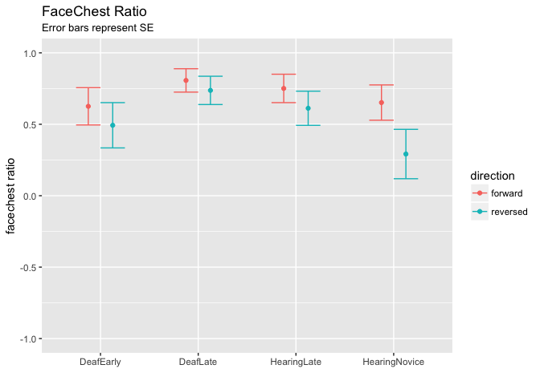
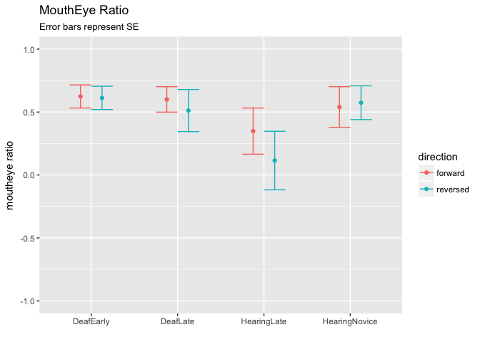
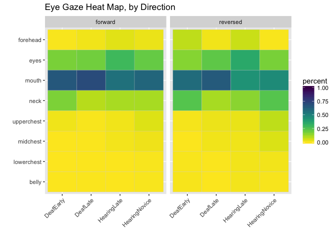
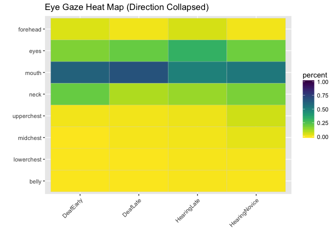

The Last Data Analysis to Rule Them All? (study1adults)
================
Adam Stone, PhD
11-09-2017

-   [Putting It All Back Together](#putting-it-all-back-together)
-   [Group Changes and Participant Tables](#group-changes-and-participant-tables)
-   [Gist & Lexical Recall Data](#gist-lexical-recall-data)
    -   [Tables & Charts](#tables-charts)
    -   [ANOVAs](#anovas)
    -   [AoA Correlations](#aoa-correlations)
-   [Eye Gaze Data](#eye-gaze-data)
    -   [ANOVAS](#anovas-1)
    -   [FaceChest](#facechest)
    -   [MouthEye](#moutheye)
-   [Heat Maps](#heat-maps)
-   [Summary](#summary)
-   [Rain's Notes](#rains-notes)

Putting It All Back Together
============================

Throughout all the data analysis we've done, the datasets have become more fragmented - lexical recall, gist, and eye tracking datasets. I want to put them all together in one whole dataset again so we can perform some analyses more efficiently (particularly correlations). The only thing I need to remember is we'll have a new column called `eye_exclude` and if it is set to `TRUE` it means we can't include that row in any analysis relating to eye gaze (usually because that trial was less than 25% looking).

``` r
# Libraries
library(tidyverse)
library(lme4)
library(lmerTest)
library(scales)
library(viridis)

# Load lex and eye data
cleanlexdata <- read_csv("cleandata.csv") %>%
  select(-(forehead:total))

cleaneyedata <- read_csv("cleanpercentdata.csv") %>%
  spread(aoi,percent) %>%
  add_column(eye_exclude = FALSE)

# What rows were removed from the eye data back in 03eyegaze? Let's add back in
# With a new column - eye_exclude
removed <- anti_join(cleanlexdata, cleaneyedata) %>%
  add_column(eye_exclude = TRUE)
eyelexdata <- bind_rows(cleaneyedata, removed)

# Load gist data
gist <- read_csv('gist_indiv.csv', col_types = cols(
  participant = col_character(),
  gist.fw1 = col_integer(),
  gist.rv2 = col_integer(),
  gist.fw3 = col_integer(),
  gist.rv4 = col_integer()
)) %>%
  gather(video, gist, gist.fw1:gist.rv4) %>%
  mutate(video = str_sub(video,6,8))

# Presto, our full reunified dataset - 'fulldata'
fulldata <- left_join(eyelexdata, gist)
```

Group Changes and Participant Tables
====================================

We have some changes to make to the groups. First, fix Josh as learning ASL when he was 6. Next, drop the DeafNative Group and reclassify all who learned ASL &lt; 3.9 as DeafEarly and ASL =&gt; 4.0 as DeafLate.

``` r
# Change Josh's AoASL to 6
fulldata <- fulldata %>%
  mutate(aoasl = as.double(aoasl)) %>%
  mutate(aoasl = case_when(
    participant == "Josh" ~ 6,
    TRUE ~ aoasl
  ))

# Reclassify Groups
fulldata <- fulldata %>%
  mutate(maingroup = case_when(
    hearing == "Deaf" & aoasl < 4 ~ "DeafEarly",
    hearing == "Deaf" & aoasl >= 4 ~ "DeafLate",
    maingroup == "HearingLateASL" ~ "HearingLate",
    maingroup == "HearingNoviceASL" ~ "HearingNovice"
  ))

# Create Participant Demographics Table
participant_info <- fulldata %>%
  select(-(acc:gist)) %>%
  select(-(video:direction)) %>%
  distinct() %>% 
  group_by(maingroup) %>%
  summarise(n = n(),
            age_mean = mean(age),
            age_sd = sd(age),
            aoasl_mean = mean(aoasl),
            aoasl_sd = sd(aoasl),
            signyrs_mean = mean(signyrs),
            signyrs_sd = sd(signyrs),
            selfrate_mean = mean(selfrate),
            selfrate_sd = sd(selfrate)) %>%
  ungroup() %>%
  mutate_if(is.double, funs(round(., 2))) %>%
  mutate(age = paste(age_mean, "±", age_sd, sep = " "),
         aoasl = paste(aoasl_mean, "±", aoasl_sd, sep = " "),
         signyrs = paste(signyrs_mean, "±", signyrs_sd, sep = " "),
         selfrate = paste(selfrate_mean, "±", selfrate_sd, sep = " ")) %>%
  select(-(age_mean:selfrate_sd)) %>%
  print()
```

    ## # A tibble: 4 x 6
    ##       maingroup     n          age        aoasl      signyrs    selfrate
    ##           <chr> <int>        <chr>        <chr>        <chr>       <chr>
    ## 1     DeafEarly    15  33.6 ± 9.16  0.67 ± 1.05  32.8 ± 9.32       5 ± 0
    ## 2      DeafLate    14 36.36 ± 5.64    11 ± 4.64 25.21 ± 5.62       5 ± 0
    ## 3   HearingLate    12  28.92 ± 6.2 17.25 ± 3.39 11.75 ± 4.85 4.62 ± 0.48
    ## 4 HearingNovice    11 20.25 ± 1.28  17.64 ± 1.8  2.44 ± 1.01 3.05 ± 0.65

Gist & Lexical Recall Data
==========================

Tables & Charts
---------------

Let's generate a table for lexical recall and gist for forward vs. reversed stories.

``` r
lexgist_info <- fulldata %>%
  group_by(maingroup, direction) %>%
  summarise(lex_mean = mean(acc, na.rm = TRUE),
            lex_sd = sd(acc, na.rm = TRUE),
            gist_mean = mean(gist),
            gist_sd = sd(gist)) %>%
  ungroup() %>%
  mutate_if(is.double, funs(round(., 2))) %>% 
  mutate(lex = paste(lex_mean, "±", lex_sd, sep = " "),
         gist = paste(gist_mean, "±", gist_sd, sep = " ")) %>%
  select(-(lex_mean:gist_sd)) %>%
  gather(metric, value, lex:gist) %>%
  unite("metric", c(metric, direction), sep = "_") %>%
  spread(metric, value) %>%
  print()
```

    ## # A tibble: 4 x 5
    ##       maingroup gist_forward gist_reversed lex_forward lex_reversed
    ## *         <chr>        <chr>         <chr>       <chr>        <chr>
    ## 1     DeafEarly  0.97 ± 0.18   0.67 ± 0.48 0.85 ± 0.07  0.76 ± 0.12
    ## 2      DeafLate        1 ± 0    0.39 ± 0.5 0.85 ± 0.08  0.69 ± 0.12
    ## 3   HearingLate        1 ± 0   0.33 ± 0.48 0.87 ± 0.09  0.69 ± 0.14
    ## 4 HearingNovice  0.45 ± 0.51   0.23 ± 0.43 0.78 ± 0.13  0.64 ± 0.13

And then bar charts too after that with error bars.

``` r
# Gist bar chart
gist_bar <- fulldata %>% select(participant, maingroup, direction, gist) %>%
  group_by(maingroup, participant, direction) %>%
  summarise(gist = mean(gist)) %>%
  group_by(maingroup, direction) %>%
  summarise(mean = mean(gist),
            sd = sd(gist),
            count = n(),
            se = sd/sqrt(count))

ggplot(gist_bar, aes(x = maingroup, y = mean, fill = direction)) +
  geom_bar(stat = "identity", position = position_dodge()) + 
  geom_errorbar(aes(ymin = mean-se, ymax = mean+se), position = position_dodge(0.9), width = 0.5) +
  labs(title = "Story Comprehension (Gist)", subtitle = "Error bars represent SE", x = "", y = "mean gist") +
  scale_y_continuous(labels = percent)
```


``` r
# Gist bar chart
lex_bar <- fulldata %>% select(participant, maingroup, direction, acc) %>%
  group_by(maingroup, participant, direction) %>%
  summarise(acc = mean(acc, na.rm = TRUE)) %>%
  group_by(maingroup, direction) %>%
  summarise(mean = mean(acc, na.rm = TRUE),
            sd = sd(acc, na.rm = TRUE),
            count = n(),
            se = sd/sqrt(count))

ggplot(lex_bar, aes(x = maingroup, y = mean, fill = direction)) +
  geom_bar(stat = "identity", position = position_dodge()) + 
  geom_errorbar(aes(ymin = mean-se, ymax = mean+se), position = position_dodge(0.9), width = 0.5) +
  labs(title = "Lexical Recall", subtitle = "Error bars represent SE", x = "", y = "mean accuracy") +
  scale_y_continuous(labels = percent, limits = c(0,1))
```


ANOVAs
------

Here, ANOVAs are done with **direction Included.** Gist first, with Tukey's comparisons.

``` r
# Gist ANOVA. We have to make participant-level means first. 
gist_aov <- fulldata %>%
  group_by(maingroup, participant, direction) %>%
  summarise(gist = mean(gist, na.rm = TRUE)) %>%
#  filter(direction != "reversed") %>%
  aov(gist ~ maingroup * direction, data = .)
summary(gist_aov)
```

    ##                     Df Sum Sq Mean Sq F value   Pr(>F)    
    ## maingroup            3  3.002   1.001  13.284 2.53e-07 ***
    ## direction            1  5.310   5.310  70.491 4.10e-13 ***
    ## maingroup:direction  3  0.896   0.299   3.965   0.0103 *  
    ## Residuals           96  7.232   0.075                     
    ## ---
    ## Signif. codes:  0 '***' 0.001 '**' 0.01 '*' 0.05 '.' 0.1 ' ' 1

``` r
TukeyHSD(gist_aov)
```

    ##   Tukey multiple comparisons of means
    ##     95% family-wise confidence level
    ## 
    ## Fit: aov(formula = gist ~ maingroup * direction, data = .)
    ## 
    ## $maingroup
    ##                                 diff        lwr         upr     p adj
    ## DeafLate-DeafEarly        -0.1202381 -0.3088051  0.06832887 0.3466547
    ## HearingLate-DeafEarly     -0.1500000 -0.3465269  0.04652685 0.1968334
    ## HearingNovice-DeafEarly   -0.4757576 -0.6771861 -0.27432905 0.0000001
    ## HearingLate-DeafLate      -0.0297619 -0.2293839  0.16986005 0.9797740
    ## HearingNovice-DeafLate    -0.3555195 -0.5599689 -0.15107005 0.0000928
    ## HearingNovice-HearingLate -0.3257576 -0.5375709 -0.11394428 0.0006581
    ## 
    ## $direction
    ##                        diff        lwr        upr p adj
    ## reversed-forward -0.4519231 -0.5587683 -0.3450778     0
    ## 
    ## $`maingroup:direction`
    ##                                                       diff        lwr
    ## DeafLate:forward-DeafEarly:forward            3.333333e-02 -0.2827280
    ## HearingLate:forward-DeafEarly:forward         3.333333e-02 -0.2960697
    ## HearingNovice:forward-DeafEarly:forward      -5.121212e-01 -0.8497401
    ## DeafEarly:reversed-DeafEarly:forward         -3.000000e-01 -0.6105642
    ## DeafLate:reversed-DeafEarly:forward          -5.738095e-01 -0.8898709
    ## HearingLate:reversed-DeafEarly:forward       -6.333333e-01 -0.9627364
    ## HearingNovice:reversed-DeafEarly:forward     -7.393939e-01 -1.0770128
    ## HearingLate:forward-DeafLate:forward          1.110223e-16 -0.3345908
    ## HearingNovice:forward-DeafLate:forward       -5.454545e-01 -0.8881368
    ## DeafEarly:reversed-DeafLate:forward          -3.333333e-01 -0.6493947
    ## DeafLate:reversed-DeafLate:forward           -6.071429e-01 -0.9286073
    ## HearingLate:reversed-DeafLate:forward        -6.666667e-01 -1.0012575
    ## HearingNovice:reversed-DeafLate:forward      -7.727273e-01 -1.1154096
    ## HearingNovice:forward-HearingLate:forward    -5.454545e-01 -0.9004796
    ## DeafEarly:reversed-HearingLate:forward       -3.333333e-01 -0.6627364
    ## DeafLate:reversed-HearingLate:forward        -6.071429e-01 -0.9417337
    ## HearingLate:reversed-HearingLate:forward     -6.666667e-01 -1.0138880
    ## HearingNovice:reversed-HearingLate:forward   -7.727273e-01 -1.1277523
    ## DeafEarly:reversed-HearingNovice:forward      2.121212e-01 -0.1254977
    ## DeafLate:reversed-HearingNovice:forward      -6.168831e-02 -0.4043706
    ## HearingLate:reversed-HearingNovice:forward   -1.212121e-01 -0.4762371
    ## HearingNovice:reversed-HearingNovice:forward -2.272727e-01 -0.5899336
    ## DeafLate:reversed-DeafEarly:reversed         -2.738095e-01 -0.5898709
    ## HearingLate:reversed-DeafEarly:reversed      -3.333333e-01 -0.6627364
    ## HearingNovice:reversed-DeafEarly:reversed    -4.393939e-01 -0.7770128
    ## HearingLate:reversed-DeafLate:reversed       -5.952381e-02 -0.3941146
    ## HearingNovice:reversed-DeafLate:reversed     -1.655844e-01 -0.5082667
    ## HearingNovice:reversed-HearingLate:reversed  -1.060606e-01 -0.4610856
    ##                                                       upr     p adj
    ## DeafLate:forward-DeafEarly:forward            0.349394663 0.9999794
    ## HearingLate:forward-DeafEarly:forward         0.362736402 0.9999845
    ## HearingNovice:forward-DeafEarly:forward      -0.174502341 0.0002270
    ## DeafEarly:reversed-DeafEarly:forward          0.010564191 0.0661325
    ## DeafLate:reversed-DeafEarly:forward          -0.257748194 0.0000050
    ## HearingLate:reversed-DeafEarly:forward       -0.303930265 0.0000012
    ## HearingNovice:reversed-DeafEarly:forward     -0.401775069 0.0000000
    ## HearingLate:forward-DeafLate:forward          0.334590838 1.0000000
    ## HearingNovice:forward-DeafLate:forward       -0.202772260 0.0000904
    ## DeafEarly:reversed-DeafLate:forward          -0.017272004 0.0311735
    ## DeafLate:reversed-DeafLate:forward           -0.285678379 0.0000018
    ## HearingLate:reversed-DeafLate:forward        -0.332075829 0.0000004
    ## HearingNovice:reversed-DeafLate:forward      -0.430044987 0.0000000
    ## HearingNovice:forward-HearingLate:forward    -0.190429523 0.0001790
    ## DeafEarly:reversed-HearingLate:forward       -0.003930265 0.0452077
    ## DeafLate:reversed-HearingLate:forward        -0.272552020 0.0000050
    ## HearingLate:reversed-HearingLate:forward     -0.319445345 0.0000012
    ## HearingNovice:reversed-HearingLate:forward   -0.417702250 0.0000000
    ## DeafEarly:reversed-HearingNovice:forward      0.549740083 0.5227399
    ## DeafLate:reversed-HearingNovice:forward       0.280993974 0.9992560
    ## HearingLate:reversed-HearingNovice:forward    0.233812901 0.9637494
    ## HearingNovice:reversed-HearingNovice:forward  0.135388115 0.5260785
    ## DeafLate:reversed-DeafEarly:reversed          0.042251806 0.1400787
    ## HearingLate:reversed-DeafEarly:reversed      -0.003930265 0.0452077
    ## HearingNovice:reversed-DeafEarly:reversed    -0.101775069 0.0027006
    ## HearingLate:reversed-DeafLate:reversed        0.275067028 0.9993113
    ## HearingNovice:reversed-DeafLate:reversed      0.177097870 0.8070333
    ## HearingNovice:reversed-HearingLate:reversed   0.248964416 0.9828143

And Lexical Recall ANOVA with Tukey's comparisons.

``` r
# Lex ANOVA. We have to make participant-level means first. 
lex_aov <- fulldata %>%
  group_by(maingroup, participant, direction) %>%
  summarise(acc = mean(acc, na.rm = TRUE)) %>%
#  filter(direction != "reversed") %>%
  aov(acc ~ maingroup * direction, data = .)
summary(lex_aov)
```

    ##                     Df Sum Sq Mean Sq F value   Pr(>F)    
    ## maingroup            3 0.1175  0.0392   5.348  0.00189 ** 
    ## direction            1 0.5211  0.5211  71.149 3.38e-13 ***
    ## maingroup:direction  3 0.0294  0.0098   1.336  0.26731    
    ## Residuals           96 0.7031  0.0073                     
    ## ---
    ## Signif. codes:  0 '***' 0.001 '**' 0.01 '*' 0.05 '.' 0.1 ' ' 1

``` r
TukeyHSD(lex_aov)
```

    ##   Tukey multiple comparisons of means
    ##     95% family-wise confidence level
    ## 
    ## Fit: aov(formula = acc ~ maingroup * direction, data = .)
    ## 
    ## $maingroup
    ##                                   diff         lwr          upr     p adj
    ## DeafLate-DeafEarly        -0.035439881 -0.09423688  0.023357113 0.3971317
    ## HearingLate-DeafEarly     -0.030916667 -0.09219563  0.030362296 0.5531130
    ## HearingNovice-DeafEarly   -0.095575758 -0.15838311 -0.032768407 0.0007654
    ## HearingLate-DeafLate       0.004523214 -0.05772083  0.066767259 0.9975516
    ## HearingNovice-DeafLate    -0.060135877 -0.12388518  0.003613423 0.0718133
    ## HearingNovice-HearingLate -0.064659091 -0.13070451  0.001386332 0.0573100
    ## 
    ## $direction
    ##                        diff        lwr        upr p adj
    ## reversed-forward -0.1415702 -0.1748856 -0.1082548     0
    ## 
    ## $`maingroup:direction`
    ##                                                      diff         lwr
    ## DeafLate:forward-DeafEarly:forward           -0.001880952 -0.10043192
    ## HearingLate:forward-DeafEarly:forward         0.013000000 -0.08971105
    ## HearingNovice:forward-DeafEarly:forward      -0.071393939 -0.17666675
    ## DeafEarly:reversed-DeafEarly:forward         -0.093000000 -0.18983690
    ## DeafLate:reversed-DeafEarly:forward          -0.161998810 -0.26054977
    ## HearingLate:reversed-DeafEarly:forward       -0.167833333 -0.27054438
    ## HearingNovice:reversed-DeafEarly:forward     -0.212757576 -0.31803039
    ## HearingLate:forward-DeafLate:forward          0.014880952 -0.08944769
    ## HearingNovice:forward-DeafLate:forward       -0.069512987 -0.17636462
    ## DeafEarly:reversed-DeafLate:forward          -0.091119048 -0.18967001
    ## DeafLate:reversed-DeafLate:forward           -0.160117857 -0.26035357
    ## HearingLate:reversed-DeafLate:forward        -0.165952381 -0.27028102
    ## HearingNovice:reversed-DeafLate:forward      -0.210876623 -0.31772826
    ## HearingNovice:forward-HearingLate:forward    -0.084393939 -0.19509416
    ## DeafEarly:reversed-HearingLate:forward       -0.106000000 -0.20871105
    ## DeafLate:reversed-HearingLate:forward        -0.174998810 -0.27932745
    ## HearingLate:reversed-HearingLate:forward     -0.180833333 -0.28910028
    ## HearingNovice:reversed-HearingLate:forward   -0.225757576 -0.33645779
    ## DeafEarly:reversed-HearingNovice:forward     -0.021606061 -0.12687887
    ## DeafLate:reversed-HearingNovice:forward      -0.090604870 -0.19745650
    ## HearingLate:reversed-HearingNovice:forward   -0.096439394 -0.20713961
    ## HearingNovice:reversed-HearingNovice:forward -0.141363636 -0.25444478
    ## DeafLate:reversed-DeafEarly:reversed         -0.068998810 -0.16754977
    ## HearingLate:reversed-DeafEarly:reversed      -0.074833333 -0.17754438
    ## HearingNovice:reversed-DeafEarly:reversed    -0.119757576 -0.22503039
    ## HearingLate:reversed-DeafLate:reversed       -0.005834524 -0.11016317
    ## HearingNovice:reversed-DeafLate:reversed     -0.050758766 -0.15761040
    ## HearingNovice:reversed-HearingLate:reversed  -0.044924242 -0.15562446
    ##                                                       upr     p adj
    ## DeafLate:forward-DeafEarly:forward            0.096670010 1.0000000
    ## HearingLate:forward-DeafEarly:forward         0.115711045 0.9999287
    ## HearingNovice:forward-DeafEarly:forward       0.033878872 0.4214465
    ## DeafEarly:reversed-DeafEarly:forward          0.003836902 0.0691753
    ## DeafLate:reversed-DeafEarly:forward          -0.063447847 0.0000469
    ## HearingLate:reversed-DeafEarly:forward       -0.065122288 0.0000531
    ## HearingNovice:reversed-DeafEarly:forward     -0.107484764 0.0000003
    ## HearingLate:forward-DeafLate:forward          0.119209594 0.9998406
    ## HearingNovice:forward-DeafLate:forward        0.037338646 0.4768076
    ## DeafEarly:reversed-DeafLate:forward           0.007431915 0.0914889
    ## DeafLate:reversed-DeafLate:forward           -0.059882140 0.0000842
    ## HearingLate:reversed-DeafLate:forward        -0.061623739 0.0000916
    ## HearingNovice:reversed-DeafLate:forward      -0.104024990 0.0000006
    ## HearingNovice:forward-HearingLate:forward     0.026306278 0.2718825
    ## DeafEarly:reversed-HearingLate:forward       -0.003288955 0.0380371
    ## DeafLate:reversed-HearingLate:forward        -0.070670168 0.0000305
    ## HearingLate:reversed-HearingLate:forward     -0.072566385 0.0000335
    ## HearingNovice:reversed-HearingLate:forward   -0.115057359 0.0000002
    ## DeafEarly:reversed-HearingNovice:forward      0.083666751 0.9982644
    ## DeafLate:reversed-HearingNovice:forward       0.016246763 0.1589599
    ## HearingLate:reversed-HearingNovice:forward    0.014260823 0.1353842
    ## HearingNovice:reversed-HearingNovice:forward -0.028282497 0.0046665
    ## DeafLate:reversed-DeafEarly:reversed          0.029552153 0.3792970
    ## HearingLate:reversed-DeafEarly:reversed       0.027877712 0.3277729
    ## HearingNovice:reversed-DeafEarly:reversed    -0.014484764 0.0144605
    ## HearingLate:reversed-DeafLate:reversed        0.098494118 0.9999997
    ## HearingNovice:reversed-DeafLate:reversed      0.056092867 0.8202120
    ## HearingNovice:reversed-HearingLate:reversed   0.065775975 0.9118925

AoA Correlations
----------------

Next, we want to look at correlations between AoA and Gist, and betwen AoA and Lexical Recall. Rain asked for forward and reversed separately (1) deaf only, (2) hearing only, and (3) both. Let's make it work.

``` r
# Let's make participant-level data, and have forward/reversed in separate columns
lexgist_data <- fulldata %>%
  group_by(maingroup, participant, direction) %>%
  mutate(gist = mean(gist, na.rm = TRUE),
         lex = mean(acc, na.rm = TRUE)) %>%
  ungroup() %>%
  select(maingroup, participant, hearing, direction, aoasl, gist, lex) %>%
  distinct() %>%
  gather(metric, value, gist:lex) %>%
  unite(metricvalue, c(metric, direction), sep = "_") %>%
  spread(metricvalue, value) %>%
  select(-participant, -maingroup)

lexgist_deaf <- lexgist_data %>% filter(hearing == "Deaf") %>% select(-hearing)
lexgist_hearing <- lexgist_data %>% filter(hearing == "Hearing") %>% select(-hearing)
lexgist_all <- lexgist_data %>% select(-hearing)

# Load awesome function to make correlation tables with stars for significance
# From: https://myowelt.blogspot.co.uk/2008/04/beautiful-correlation-tables-in-r.html
corstarsl <- function(x){ 
require(Hmisc) 
x <- as.matrix(x) 
R <- Hmisc::rcorr(x)$r 
p <- Hmisc::rcorr(x)$P 
## define notions for significance levels; spacing is important.
mystars <- ifelse(p < .001, "***", ifelse(p < .01, "** ", ifelse(p < .05, "* ", " ")))
## trunctuate the matrix that holds the correlations to two decimal
R <- format(round(cbind(rep(-1.11, ncol(x)), R), 2))[,-1] 
## build a new matrix that includes the correlations with their apropriate stars 
Rnew <- matrix(paste(R, mystars, sep=""), ncol=ncol(x)) 
diag(Rnew) <- paste(diag(R), " ", sep="") 
rownames(Rnew) <- colnames(x) 
colnames(Rnew) <- paste(colnames(x), "", sep="") 
## remove upper triangle
Rnew <- as.matrix(Rnew)
Rnew[upper.tri(Rnew, diag = TRUE)] <- ""
Rnew <- as.data.frame(Rnew) 
## remove last column and return the matrix (which is now a data frame)
Rnew <- cbind(Rnew[1:length(Rnew)-1])
return(Rnew) 
}

# Correlations for Deaf
print("DEAF Correlations - Pearson's r")
```

    ## [1] "DEAF Correlations - Pearson's r"

``` r
#corstarsl(lexgist_deaf)
Hmisc::rcorr(as.matrix(lexgist_deaf))$r
```

    ##                     aoasl gist_forward gist_reversed lex_forward
    ## aoasl          1.00000000   0.08266371   -0.25585943  0.14743346
    ## gist_forward   0.08266371   1.00000000    0.01762269 -0.08155560
    ## gist_reversed -0.25585943   0.01762269    1.00000000  0.02667231
    ## lex_forward    0.14743346  -0.08155560    0.02667231  1.00000000
    ## lex_reversed  -0.25601873  -0.09770666    0.36021802  0.35984892
    ##               lex_reversed
    ## aoasl          -0.25601873
    ## gist_forward   -0.09770666
    ## gist_reversed   0.36021802
    ## lex_forward     0.35984892
    ## lex_reversed    1.00000000

``` r
print("DEAF Correlations - P-values")
```

    ## [1] "DEAF Correlations - P-values"

``` r
Hmisc::rcorr(as.matrix(lexgist_deaf))$P
```

    ##                   aoasl gist_forward gist_reversed lex_forward
    ## aoasl                NA    0.6698839    0.18035489  0.44533530
    ## gist_forward  0.6698839           NA    0.92770438  0.67406661
    ## gist_reversed 0.1803549    0.9277044            NA  0.89076140
    ## lex_forward   0.4453353    0.6740666    0.89076140          NA
    ## lex_reversed  0.1800743    0.6140990    0.05492031  0.05518766
    ##               lex_reversed
    ## aoasl           0.18007434
    ## gist_forward    0.61409897
    ## gist_reversed   0.05492031
    ## lex_forward     0.05518766
    ## lex_reversed            NA

``` r
cat(paste("","\n",""))
```

``` r
# Correlations for Hearing
print("HEARING Correlations - Pearson's r")
```

    ## [1] "HEARING Correlations - Pearson's r"

``` r
#corstarsl(lexgist_hearing)
Hmisc::rcorr(as.matrix(lexgist_hearing))$r
```

    ##                     aoasl gist_forward gist_reversed lex_forward
    ## aoasl          1.00000000  -0.15525565    0.07815751  0.02500269
    ## gist_forward  -0.15525565   1.00000000    0.29502174  0.57154566
    ## gist_reversed  0.07815751   0.29502174    1.00000000  0.35682374
    ## lex_forward    0.02500269   0.57154566    0.35682374  1.00000000
    ## lex_reversed   0.01411303   0.07645807    0.57951176  0.36558339
    ##               lex_reversed
    ## aoasl           0.01411303
    ## gist_forward    0.07645807
    ## gist_reversed   0.57951176
    ## lex_forward     0.36558339
    ## lex_reversed    1.00000000

``` r
print("HEARING Correlations - P-values")
```

    ## [1] "HEARING Correlations - P-values"

``` r
Hmisc::rcorr(as.matrix(lexgist_hearing))$P
```

    ##                   aoasl gist_forward gist_reversed lex_forward
    ## aoasl                NA  0.479339909   0.722986497 0.909841021
    ## gist_forward  0.4793399           NA   0.171744860 0.004385475
    ## gist_reversed 0.7229865  0.171744860            NA 0.094647552
    ## lex_forward   0.9098410  0.004385475   0.094647552          NA
    ## lex_reversed  0.9490402  0.728786878   0.003755275 0.086260140
    ##               lex_reversed
    ## aoasl          0.949040176
    ## gist_forward   0.728786878
    ## gist_reversed  0.003755275
    ## lex_forward    0.086260140
    ## lex_reversed            NA

``` r
cat(paste("","\n",""))
```

``` r
# Correlations for All
print("ALL Correlations - Pearson's r")
```

    ## [1] "ALL Correlations - Pearson's r"

``` r
#corstarsl(lexgist_all)
Hmisc::rcorr(as.matrix(lexgist_all))$r
```

    ##                     aoasl gist_forward gist_reversed lex_forward
    ## aoasl          1.00000000   -0.3230903    -0.3922803 -0.08115845
    ## gist_forward  -0.32309031    1.0000000     0.2712761  0.49279109
    ## gist_reversed -0.39228034    0.2712761     1.0000000  0.21701819
    ## lex_forward   -0.08115845    0.4927911     0.2170182  1.00000000
    ## lex_reversed  -0.33945209    0.1521110     0.4921550  0.38007715
    ##               lex_reversed
    ## aoasl           -0.3394521
    ## gist_forward     0.1521110
    ## gist_reversed    0.4921550
    ## lex_forward      0.3800772
    ## lex_reversed     1.0000000

``` r
print("ALL Correlations - P-values")
```

    ## [1] "ALL Correlations - P-values"

``` r
Hmisc::rcorr(as.matrix(lexgist_all))$P
```

    ##                     aoasl gist_forward gist_reversed  lex_forward
    ## aoasl                  NA 0.0194786567  0.0040239673 0.5673489939
    ## gist_forward  0.019478657           NA  0.0517394597 0.0002061625
    ## gist_reversed 0.004023967 0.0517394597            NA 0.1222542968
    ## lex_forward   0.567348994 0.0002061625  0.1222542968           NA
    ## lex_reversed  0.013820178 0.2817023354  0.0002107074 0.0054478274
    ##               lex_reversed
    ## aoasl         0.0138201778
    ## gist_forward  0.2817023354
    ## gist_reversed 0.0002107074
    ## lex_forward   0.0054478274
    ## lex_reversed            NA

I'm also including nicely formatted tables with \*\*\* indicators of significance for quick referencing. Order: Deaf, Hearing, All.

``` r
corstarsl(lexgist_deaf)
```

    ## Loading required package: Hmisc

    ## Loading required package: lattice

    ## Loading required package: survival

    ## Loading required package: Formula

    ## 
    ## Attaching package: 'Hmisc'

    ## The following objects are masked from 'package:dplyr':
    ## 
    ##     combine, src, summarize

    ## The following objects are masked from 'package:base':
    ## 
    ##     format.pval, round.POSIXt, trunc.POSIXt, units

    ##                aoasl gist_forward gist_reversed lex_forward
    ## aoasl                                                      
    ## gist_forward   0.08                                        
    ## gist_reversed -0.26         0.02                           
    ## lex_forward    0.15        -0.08          0.03             
    ## lex_reversed  -0.26        -0.10          0.36        0.36

``` r
corstarsl(lexgist_hearing)
```

    ##                aoasl gist_forward gist_reversed lex_forward
    ## aoasl                                                      
    ## gist_forward  -0.16                                        
    ## gist_reversed  0.08         0.30                           
    ## lex_forward    0.03       0.57**          0.36             
    ## lex_reversed   0.01         0.08        0.58**        0.37

``` r
corstarsl(lexgist_all)
```

    ##                  aoasl gist_forward gist_reversed lex_forward
    ## aoasl                                                        
    ## gist_forward   -0.32*                                        
    ## gist_reversed -0.39**         0.27                           
    ## lex_forward     -0.08       0.49***         0.22             
    ## lex_reversed   -0.34*         0.15        0.49***     0.38**

Eye Gaze Data
=============

Now eye gaze data. Boxplots first. Also here, we're renaming "chin" to "neck" because that's what it actually is!

``` r
# rename chin to neck
fulldata <- fulldata %>%
  rename(neck = chin)

fulldata %>%
  filter(eye_exclude == FALSE) %>%
  select(direction, moutheye:upperchest) %>%
  select(-moutheye, -facechest, -face, -chest) %>%
  gather(aoi, percent, belly:upperchest) %>%
  ggplot(aes(x = aoi, y = percent, fill = direction)) + geom_boxplot()
```

    ## Warning: Removed 835 rows containing non-finite values (stat_boxplot).


ANOVAS
------

We have three big AOIs. Eyes, Mouth, and Neck. To some extent we also have Forehead and UpperChest. Let's run ANOVAs on all those five AOIs and see if either direction or group membership affect looking behavior for any of those AOIs.

``` r
# Define the 5 AOIs
aoi5 <- c('forehead','eyes','mouth','neck','upperchest')

# Organize the data by those AOIs (but again we need participant-level first)
aoi5_data <- fulldata %>%
  filter(eye_exclude == FALSE) %>%
  select(id, maingroup, direction, belly:upperchest) %>%
  gather(aoi, percent, belly:upperchest) %>%
  group_by(id, direction, aoi) %>%
  mutate(percent = mean(percent, na.rm = TRUE)) %>%
  ungroup () %>%
  distinct() %>%
  filter(aoi %in% aoi5) %>%
  spread(aoi, percent)

print("Forehead ANOVA")
```

    ## [1] "Forehead ANOVA"

``` r
forehead_aov <- aov(forehead ~ maingroup * direction, data = aoi5_data)
summary(forehead_aov)
```

    ##                     Df  Sum Sq  Mean Sq F value Pr(>F)
    ## maingroup            3 0.01249 0.004164   0.862  0.468
    ## direction            1 0.00879 0.008786   1.819  0.185
    ## maingroup:direction  3 0.01411 0.004702   0.973  0.414
    ## Residuals           42 0.20287 0.004830               
    ## 53 observations deleted due to missingness

``` r
cat(paste("","\n",""))
```

``` r
print("Eyes ANOVA")
```

    ## [1] "Eyes ANOVA"

``` r
eyes_aov <- aov(eyes ~ maingroup * direction, data = aoi5_data)
summary(eyes_aov)
```

    ##                     Df Sum Sq Mean Sq F value Pr(>F)
    ## maingroup            3  0.324 0.10784   1.961  0.125
    ## direction            1  0.002 0.00221   0.040  0.842
    ## maingroup:direction  3  0.034 0.01118   0.203  0.894
    ## Residuals           92  5.060 0.05500               
    ## 3 observations deleted due to missingness

``` r
cat(paste("","\n",""))
```

``` r
print("Mouth ANOVA")
```

    ## [1] "Mouth ANOVA"

``` r
mouth_aov <- aov(mouth ~ maingroup * direction, data = aoi5_data)
summary(mouth_aov)
```

    ##                     Df Sum Sq Mean Sq F value Pr(>F)  
    ## maingroup            3  0.499 0.16623   2.533 0.0616 .
    ## direction            1  0.246 0.24582   3.745 0.0559 .
    ## maingroup:direction  3  0.029 0.00955   0.146 0.9323  
    ## Residuals           95  6.235 0.06563                 
    ## ---
    ## Signif. codes:  0 '***' 0.001 '**' 0.01 '*' 0.05 '.' 0.1 ' ' 1

``` r
cat(paste("","\n",""))
```

``` r
print("Neck ANOVA")
```

    ## [1] "Neck ANOVA"

``` r
neck_aov <- aov(neck ~ maingroup * direction, data = aoi5_data)
summary(neck_aov)
```

    ##                     Df Sum Sq Mean Sq F value Pr(>F)
    ## maingroup            3  0.181 0.06038   1.465  0.229
    ## direction            1  0.103 0.10254   2.488  0.118
    ## maingroup:direction  3  0.037 0.01228   0.298  0.827
    ## Residuals           94  3.874 0.04121               
    ## 1 observation deleted due to missingness

``` r
cat(paste("","\n",""))
```

``` r
print("UpperChest ANOVA")
```

    ## [1] "UpperChest ANOVA"

``` r
upperchest_aov <- aov(upperchest ~ maingroup * direction, data = aoi5_data)
summary(upperchest_aov)
```

    ##                     Df  Sum Sq  Mean Sq F value  Pr(>F)   
    ## maingroup            3 0.02998 0.009993   5.588 0.00154 **
    ## direction            1 0.00356 0.003560   1.991 0.16206   
    ## maingroup:direction  3 0.00591 0.001970   1.101 0.35337   
    ## Residuals           82 0.14663 0.001788                   
    ## ---
    ## Signif. codes:  0 '***' 0.001 '**' 0.01 '*' 0.05 '.' 0.1 ' ' 1
    ## 13 observations deleted due to missingness

``` r
TukeyHSD(upperchest_aov)
```

    ##   Tukey multiple comparisons of means
    ##     95% family-wise confidence level
    ## 
    ## Fit: aov(formula = upperchest ~ maingroup * direction, data = aoi5_data)
    ## 
    ## $maingroup
    ##                                    diff          lwr        upr     p adj
    ## DeafLate-DeafEarly        -0.0007914082 -0.032259263 0.03067645 0.9998962
    ## HearingLate-DeafEarly      0.0066520381 -0.026065452 0.03936953 0.9507319
    ## HearingNovice-DeafEarly    0.0450163736  0.012298883 0.07773386 0.0029190
    ## HearingLate-DeafLate       0.0074434462 -0.026463076 0.04134997 0.9390764
    ## HearingNovice-DeafLate     0.0458077818  0.011901259 0.07971430 0.0036014
    ## HearingNovice-HearingLate  0.0383643355  0.003294968 0.07343370 0.0263890
    ## 
    ## $direction
    ##                       diff          lwr        upr  p adj
    ## reversed-forward 0.0125832 -0.005169066 0.03033547 0.1623
    ## 
    ## $`maingroup:direction`
    ##                                                      diff           lwr
    ## DeafLate:forward-DeafEarly:forward           -0.011893305 -0.0636402067
    ## HearingLate:forward-DeafEarly:forward        -0.002333292 -0.0567953337
    ## HearingNovice:forward-DeafEarly:forward       0.024450757 -0.0285475455
    ## DeafEarly:reversed-DeafEarly:forward         -0.007367995 -0.0580318820
    ## DeafLate:reversed-DeafEarly:forward           0.003902141 -0.0490961618
    ## HearingLate:reversed-DeafEarly:forward        0.008542261 -0.0459197805
    ## HearingNovice:reversed-DeafEarly:forward      0.062268675  0.0060693679
    ## HearingLate:forward-DeafLate:forward          0.009560013 -0.0467613339
    ## HearingNovice:forward-DeafLate:forward        0.036344062 -0.0185631342
    ## DeafEarly:reversed-DeafLate:forward           0.004525310 -0.0481321640
    ## DeafLate:reversed-DeafLate:forward            0.015795446 -0.0391117505
    ## HearingLate:reversed-DeafLate:forward         0.020435567 -0.0358857807
    ## HearingNovice:reversed-DeafLate:forward       0.074161980  0.0161590297
    ## HearingNovice:forward-HearingLate:forward     0.026784049 -0.0306891833
    ## DeafEarly:reversed-HearingLate:forward       -0.005034703 -0.0603626509
    ## DeafLate:reversed-HearingLate:forward         0.006235433 -0.0512377997
    ## HearingLate:reversed-HearingLate:forward      0.010875553 -0.0479501755
    ## HearingNovice:reversed-HearingLate:forward    0.064601967  0.0041642761
    ## DeafEarly:reversed-HearingNovice:forward     -0.031818752 -0.0857064861
    ## DeafLate:reversed-HearingNovice:forward      -0.020548616 -0.0766367480
    ## HearingLate:reversed-HearingNovice:forward   -0.015908496 -0.0733817282
    ## HearingNovice:reversed-HearingNovice:forward  0.037817918 -0.0213041638
    ## DeafLate:reversed-DeafEarly:reversed          0.011270136 -0.0426175978
    ## HearingLate:reversed-DeafEarly:reversed       0.015910257 -0.0394176910
    ## HearingNovice:reversed-DeafEarly:reversed     0.069636670  0.0125978247
    ## HearingLate:reversed-DeafLate:reversed        0.004640121 -0.0528331118
    ## HearingNovice:reversed-DeafLate:reversed      0.058366534 -0.0007555475
    ## HearingNovice:reversed-HearingLate:reversed   0.053726414 -0.0067112771
    ##                                                     upr     p adj
    ## DeafLate:forward-DeafEarly:forward           0.03985360 0.9963279
    ## HearingLate:forward-DeafEarly:forward        0.05212875 1.0000000
    ## HearingNovice:forward-DeafEarly:forward      0.07744906 0.8382449
    ## DeafEarly:reversed-DeafEarly:forward         0.04329589 0.9998114
    ## DeafLate:reversed-DeafEarly:forward          0.05690044 0.9999982
    ## HearingLate:reversed-DeafEarly:forward       0.06300430 0.9996881
    ## HearingNovice:reversed-DeafEarly:forward     0.11846798 0.0193600
    ## HearingLate:forward-DeafLate:forward         0.06588136 0.9994745
    ## HearingNovice:forward-DeafLate:forward       0.09125126 0.4498466
    ## DeafEarly:reversed-DeafLate:forward          0.05718278 0.9999947
    ## DeafLate:reversed-DeafLate:forward           0.07070264 0.9857605
    ## HearingLate:reversed-DeafLate:forward        0.07675691 0.9485852
    ## HearingNovice:reversed-DeafLate:forward      0.13216493 0.0035884
    ## HearingNovice:forward-HearingLate:forward    0.08425728 0.8311284
    ## DeafEarly:reversed-HearingLate:forward       0.05029324 0.9999922
    ## DeafLate:reversed-HearingLate:forward        0.06370866 0.9999740
    ## HearingLate:reversed-HearingLate:forward     0.06970128 0.9990820
    ## HearingNovice:reversed-HearingLate:forward   0.12503966 0.0276122
    ## DeafEarly:reversed-HearingNovice:forward     0.02206898 0.5974009
    ## DeafLate:reversed-HearingNovice:forward      0.03553952 0.9459416
    ## HearingLate:reversed-HearingNovice:forward   0.04156474 0.9886403
    ## HearingNovice:reversed-HearingNovice:forward 0.09694000 0.4950600
    ## DeafLate:reversed-DeafEarly:reversed         0.06515787 0.9979722
    ## HearingLate:reversed-DeafEarly:reversed      0.07123820 0.9857929
    ## HearingNovice:reversed-DeafEarly:reversed    0.12667552 0.0064964
    ## HearingLate:reversed-DeafLate:reversed       0.06211335 0.9999966
    ## HearingNovice:reversed-DeafLate:reversed     0.11748862 0.0555578
    ## HearingNovice:reversed-HearingLate:reversed  0.11416410 0.1184488

``` r
cat(paste("","\n",""))
```

FaceChest
---------

We originally defined FaceChest such that

1.  Face = eyes + mouth + chin
2.  Chest = upperchest + midchest + lowerchest

BUT. Chin is actually neck. It's not even part of the face if you think about it. So I'm redefining FaceChest as:

1.  Face = forehead + eyes + mouth
2.  Chest = neck + upperchest + midchest + lowerchest

So let's do this. Then see what's happening across groups for FaceChest. First I want a boxplot to comapre the new and old FaceChest variables.

``` r
# Redefine face, chest, and facechest
fulldata <- fulldata %>%
  ungroup() %>%
  rename(facechest_old = facechest) %>%
  rowwise() %>%
  mutate(face = sum(forehead, eyes, mouth, na.rm = TRUE),
         chest = sum(neck, upperchest, midchest, lowerchest, na.rm = TRUE),
         facechest = (face - chest)/(face + chest)) %>%
  ungroup()

fulldata %>% 
  gather(metric, value, c(facechest_old, facechest)) %>%
  ggplot(aes(x = maingroup, y = value, fill = direction)) + geom_boxplot() + facet_wrap("metric")
```

    ## Warning: Removed 30 rows containing non-finite values (stat_boxplot).


Cool. Next we'll do error bar charts using the new FaceChest across groups.

``` r
facechest_info <- fulldata %>%
  filter(eye_exclude == FALSE) %>%
  group_by(maingroup, direction, participant) %>%
  summarise(facechest = mean(facechest, na.rm = TRUE)) %>%
  group_by(maingroup, direction) %>%
  summarise(mean = mean(facechest),
            sd = sd(facechest),
            n = n(),
            se = sd/sqrt(n))

ggplot(facechest_info, aes(x = maingroup, y = mean, fill = direction, color = direction)) +
  geom_point(stat = "identity", position = position_dodge(0.5)) + 
  geom_errorbar(aes(ymin = mean-se, ymax = mean+se), position = position_dodge(0.5), width = 0.5) +
  labs(title = "FaceChest Ratio", subtitle = "Error bars represent SE", x = "", y = "facechest ratio") +
  scale_y_continuous(limits = c(-1,1))
```



Now let's do the ANOVA.

``` r
# FaceChest ANOVA but remember, participant-level first!
fc_aov <- fulldata %>%
  group_by(maingroup, participant, direction) %>%
  summarise(facechest = mean(facechest, na.rm = TRUE)) %>%
  aov(facechest ~ maingroup * direction, data = .)
summary(fc_aov)
```

    ##                     Df Sum Sq Mean Sq F value Pr(>F)  
    ## maingroup            3  1.317  0.4389   2.111 0.1040  
    ## direction            1  0.712  0.7116   3.422 0.0674 .
    ## maingroup:direction  3  0.283  0.0942   0.453 0.7157  
    ## Residuals           95 19.754  0.2079                 
    ## ---
    ## Signif. codes:  0 '***' 0.001 '**' 0.01 '*' 0.05 '.' 0.1 ' ' 1
    ## 1 observation deleted due to missingness

``` r
TukeyHSD(fc_aov)
```

    ##   Tukey multiple comparisons of means
    ##     95% family-wise confidence level
    ## 
    ## Fit: aov(formula = facechest ~ maingroup * direction, data = .)
    ## 
    ## $maingroup
    ##                                  diff        lwr        upr     p adj
    ## DeafLate-DeafEarly         0.21402505 -0.1023072 0.53035734 0.2944823
    ## HearingLate-DeafEarly      0.12217507 -0.2043972 0.44874728 0.7620918
    ## HearingNovice-DeafEarly   -0.08754118 -0.4222586 0.24717623 0.9029764
    ## HearingLate-DeafLate      -0.09184998 -0.4263885 0.24268858 0.8897151
    ## HearingNovice-DeafLate    -0.30156623 -0.6440606 0.04092812 0.1046612
    ## HearingNovice-HearingLate -0.20971625 -0.5616902 0.14225773 0.4074069
    ## 
    ## $direction
    ##                        diff        lwr        upr     p adj
    ## reversed-forward -0.1662271 -0.3446328 0.01217867 0.0674613
    ## 
    ## $`maingroup:direction`
    ##                                                     diff        lwr
    ## DeafLate:forward-DeafEarly:forward            0.18128134 -0.3439484
    ## HearingLate:forward-DeafEarly:forward         0.12525665 -0.4221444
    ## HearingNovice:forward-DeafEarly:forward       0.02624201 -0.5348120
    ## DeafEarly:reversed-DeafEarly:forward         -0.13268312 -0.6487778
    ## DeafLate:reversed-DeafEarly:forward           0.11150119 -0.4240755
    ## HearingLate:reversed-DeafEarly:forward       -0.01358964 -0.5609907
    ## HearingNovice:reversed-DeafEarly:forward     -0.33400749 -0.8950615
    ## HearingLate:forward-DeafLate:forward         -0.05602469 -0.6120467
    ## HearingNovice:forward-DeafLate:forward       -0.15503933 -0.7245077
    ## DeafEarly:reversed-DeafLate:forward          -0.31396446 -0.8391942
    ## DeafLate:reversed-DeafLate:forward           -0.06978014 -0.6141652
    ## HearingLate:reversed-DeafLate:forward        -0.19487097 -0.7508930
    ## HearingNovice:reversed-DeafLate:forward      -0.51528883 -1.0847572
    ## HearingNovice:forward-HearingLate:forward    -0.09901464 -0.6889942
    ## DeafEarly:reversed-HearingLate:forward       -0.25793977 -0.8053408
    ## DeafLate:reversed-HearingLate:forward        -0.01375545 -0.5795616
    ## HearingLate:reversed-HearingLate:forward     -0.13884628 -0.7158576
    ## HearingNovice:reversed-HearingLate:forward   -0.45926414 -1.0492436
    ## DeafEarly:reversed-HearingNovice:forward     -0.15892513 -0.7199791
    ## DeafLate:reversed-HearingNovice:forward       0.08525919 -0.4937662
    ## HearingLate:reversed-HearingNovice:forward   -0.03983164 -0.6298112
    ## HearingNovice:reversed-HearingNovice:forward -0.36024950 -0.9629182
    ## DeafLate:reversed-DeafEarly:reversed          0.24418431 -0.2913924
    ## HearingLate:reversed-DeafEarly:reversed       0.11909348 -0.4283075
    ## HearingNovice:reversed-DeafEarly:reversed    -0.20132437 -0.7623784
    ## HearingLate:reversed-DeafLate:reversed       -0.12509083 -0.6908970
    ## HearingNovice:reversed-DeafLate:reversed     -0.44550869 -1.0245340
    ## HearingNovice:reversed-HearingLate:reversed  -0.32041786 -0.9103974
    ##                                                     upr     p adj
    ## DeafLate:forward-DeafEarly:forward           0.70651110 0.9614976
    ## HearingLate:forward-DeafEarly:forward        0.67265767 0.9965412
    ## HearingNovice:forward-DeafEarly:forward      0.58729603 0.9999999
    ## DeafEarly:reversed-DeafEarly:forward         0.38341151 0.9929145
    ## DeafLate:reversed-DeafEarly:forward          0.64707791 0.9980947
    ## HearingLate:reversed-DeafEarly:forward       0.53381139 1.0000000
    ## HearingNovice:reversed-DeafEarly:forward     0.22704653 0.5913057
    ## HearingLate:forward-DeafLate:forward         0.49999735 0.9999849
    ## HearingNovice:forward-DeafLate:forward       0.41442906 0.9900034
    ## DeafEarly:reversed-DeafLate:forward          0.21126530 0.5862038
    ## DeafLate:reversed-DeafLate:forward           0.47460487 0.9999221
    ## HearingLate:reversed-DeafLate:forward        0.36115107 0.9582064
    ## HearingNovice:reversed-DeafLate:forward      0.05417956 0.1060821
    ## HearingNovice:forward-HearingLate:forward    0.49096487 0.9995291
    ## DeafEarly:reversed-HearingLate:forward       0.28946126 0.8260434
    ## DeafLate:reversed-HearingLate:forward        0.55205072 1.0000000
    ## HearingLate:reversed-HearingLate:forward     0.43816506 0.9952726
    ## HearingNovice:reversed-HearingLate:forward   0.13071537 0.2473425
    ## DeafEarly:reversed-HearingNovice:forward     0.40212889 0.9873632
    ## DeafLate:reversed-HearingNovice:forward      0.66428454 0.9998023
    ## HearingLate:reversed-HearingNovice:forward   0.55014787 0.9999990
    ## HearingNovice:reversed-HearingNovice:forward 0.24241919 0.5862222
    ## DeafLate:reversed-DeafEarly:reversed         0.77976103 0.8490339
    ## HearingLate:reversed-DeafEarly:reversed      0.66649451 0.9974807
    ## HearingNovice:reversed-DeafEarly:reversed    0.35972965 0.9526484
    ## HearingLate:reversed-DeafLate:reversed       0.44071534 0.9972122
    ## HearingNovice:reversed-DeafLate:reversed     0.13351667 0.2608580
    ## HearingNovice:reversed-HearingLate:reversed  0.26956165 0.6978317

MouthEye
--------

We've also got a moutheye ratio! Maybe something there, too.

``` r
moutheye_info <- fulldata %>%
  filter(eye_exclude == FALSE) %>%
  group_by(maingroup, direction, participant) %>%
  summarise(moutheye = mean(moutheye, na.rm = TRUE)) %>%
  group_by(maingroup, direction) %>%
  summarise(mean = mean(moutheye, na.rm = TRUE),
            sd = sd(moutheye, na.rm = TRUE),
            n = n(),
            se = sd/sqrt(n))

ggplot(moutheye_info, aes(x = maingroup, y = mean, fill = direction, color = direction)) +
  geom_point(stat = "identity", position = position_dodge(0.5)) + 
  geom_errorbar(aes(ymin = mean-se, ymax = mean+se), position = position_dodge(0.5), width = 0.5) +
  labs(title = "MouthEye Ratio", subtitle = "Error bars represent SE", x = "", y = "moutheye ratio") +
  scale_y_continuous(limits = c(-1,1))
```



And Moutheye ANOVA.

``` r
# MouthEye ANOVA but remember, participant-level first!
me_aov <- fulldata %>%
  group_by(maingroup, participant, direction) %>%
  summarise(moutheye = mean(moutheye, na.rm = TRUE)) %>%
  aov(moutheye ~ maingroup * direction, data = .)
summary(me_aov)
```

    ##                     Df Sum Sq Mean Sq F value Pr(>F)  
    ## maingroup            3  2.165  0.7218   2.652 0.0533 .
    ## direction            1  0.131  0.1312   0.482 0.4892  
    ## maingroup:direction  3  0.241  0.0804   0.296 0.8286  
    ## Residuals           92 25.035  0.2721                 
    ## ---
    ## Signif. codes:  0 '***' 0.001 '**' 0.01 '*' 0.05 '.' 0.1 ' ' 1
    ## 4 observations deleted due to missingness

``` r
TukeyHSD(me_aov)
```

    ##   Tukey multiple comparisons of means
    ##     95% family-wise confidence level
    ## 
    ## Fit: aov(formula = moutheye ~ maingroup * direction, data = .)
    ## 
    ## $maingroup
    ##                                   diff         lwr          upr     p adj
    ## DeafLate-DeafEarly        -0.058776004 -0.42742730  0.309875290 0.9754099
    ## HearingLate-DeafEarly     -0.381706457 -0.76282392 -0.000588997 0.0494956
    ## HearingNovice-DeafEarly   -0.061136623 -0.44705445  0.324781203 0.9758569
    ## HearingLate-DeafLate      -0.322930453 -0.71365216  0.067791253 0.1415325
    ## HearingNovice-DeafLate    -0.002360619 -0.39776611  0.393044871 0.9999986
    ## HearingNovice-HearingLate  0.320569834 -0.08648329  0.727622955 0.1738594
    ## 
    ## $direction
    ##                        diff        lwr       upr     p adj
    ## reversed-forward -0.0724788 -0.2798536 0.1348961 0.4893376
    ## 
    ## $`maingroup:direction`
    ##                                                     diff        lwr
    ## DeafLate:forward-DeafEarly:forward           -0.02323934 -0.6245312
    ## HearingLate:forward-DeafEarly:forward        -0.27511698 -0.9017909
    ## HearingNovice:forward-DeafEarly:forward      -0.08352026 -0.7258243
    ## DeafEarly:reversed-DeafEarly:forward         -0.01110222 -0.6123941
    ## DeafLate:reversed-DeafEarly:forward          -0.11184810 -0.7385220
    ## HearingLate:reversed-DeafEarly:forward       -0.50919251 -1.1514966
    ## HearingNovice:reversed-DeafEarly:forward     -0.04947236 -0.6917764
    ## HearingLate:forward-DeafLate:forward         -0.25187764 -0.8884210
    ## HearingNovice:forward-DeafLate:forward       -0.06028092 -0.7122179
    ## DeafEarly:reversed-DeafLate:forward           0.01213713 -0.5994340
    ## DeafLate:reversed-DeafLate:forward           -0.08860876 -0.7251521
    ## HearingLate:reversed-DeafLate:forward        -0.48595316 -1.1378902
    ## HearingNovice:reversed-DeafLate:forward      -0.02623302 -0.6781700
    ## HearingNovice:forward-HearingLate:forward     0.19159672 -0.4838217
    ## DeafEarly:reversed-HearingLate:forward        0.26401477 -0.3725286
    ## DeafLate:reversed-HearingLate:forward         0.16326888 -0.4973034
    ## HearingLate:reversed-HearingLate:forward     -0.23407552 -0.9094940
    ## HearingNovice:reversed-HearingLate:forward    0.22564462 -0.4497738
    ## DeafEarly:reversed-HearingNovice:forward      0.07241805 -0.5795189
    ## DeafLate:reversed-HearingNovice:forward      -0.02832784 -0.7037463
    ## HearingLate:reversed-HearingNovice:forward   -0.42567224 -1.1156175
    ## HearingNovice:reversed-HearingNovice:forward  0.03404790 -0.6558974
    ## DeafLate:reversed-DeafEarly:reversed         -0.10074589 -0.7372893
    ## HearingLate:reversed-DeafEarly:reversed      -0.49809029 -1.1500273
    ## HearingNovice:reversed-DeafEarly:reversed    -0.03837015 -0.6903071
    ## HearingLate:reversed-DeafLate:reversed       -0.39734440 -1.0727629
    ## HearingNovice:reversed-DeafLate:reversed      0.06237574 -0.6130427
    ## HearingNovice:reversed-HearingLate:reversed   0.45972015 -0.2302251
    ##                                                    upr     p adj
    ## DeafLate:forward-DeafEarly:forward           0.5780525 1.0000000
    ## HearingLate:forward-DeafEarly:forward        0.3515569 0.8719243
    ## HearingNovice:forward-DeafEarly:forward      0.5587838 0.9999136
    ## DeafEarly:reversed-DeafEarly:forward         0.5901897 1.0000000
    ## DeafLate:reversed-DeafEarly:forward          0.5148258 0.9992899
    ## HearingLate:reversed-DeafEarly:forward       0.1331116 0.2264623
    ## HearingNovice:reversed-DeafEarly:forward     0.5928317 0.9999976
    ## HearingLate:forward-DeafLate:forward         0.3846657 0.9216637
    ## HearingNovice:forward-DeafLate:forward       0.5916561 0.9999915
    ## DeafEarly:reversed-DeafLate:forward          0.6237082 1.0000000
    ## DeafLate:reversed-DeafLate:forward           0.5479346 0.9998633
    ## HearingLate:reversed-DeafLate:forward        0.1659838 0.2984707
    ## HearingNovice:reversed-DeafLate:forward      0.6257040 1.0000000
    ## HearingNovice:forward-HearingLate:forward    0.8670152 0.9871789
    ## DeafEarly:reversed-HearingLate:forward       0.9005582 0.9016148
    ## DeafLate:reversed-HearingLate:forward        0.8238412 0.9943902
    ## HearingLate:reversed-HearingLate:forward     0.4413429 0.9604359
    ## HearingNovice:reversed-HearingLate:forward   0.9010631 0.9675629
    ## DeafEarly:reversed-HearingNovice:forward     0.7243550 0.9999703
    ## DeafLate:reversed-HearingNovice:forward      0.6470906 1.0000000
    ## HearingLate:reversed-HearingNovice:forward   0.2642730 0.5452564
    ## HearingNovice:reversed-HearingNovice:forward 0.7239932 0.9999999
    ## DeafLate:reversed-DeafEarly:reversed         0.5357975 0.9996780
    ## HearingLate:reversed-DeafEarly:reversed      0.1538467 0.2686661
    ## HearingNovice:reversed-DeafEarly:reversed    0.6135668 0.9999996
    ## HearingLate:reversed-DeafLate:reversed       0.2780741 0.6051160
    ## HearingNovice:reversed-DeafLate:reversed     0.7377942 0.9999916
    ## HearingNovice:reversed-HearingLate:reversed  1.1496654 0.4439614

Heat Maps
=========

And finally, we're going to do heat maps.

``` r
eyegaze_heat <- fulldata %>%
  ungroup() %>%
  filter(eye_exclude == FALSE) %>%
  select(id:direction, belly, lowerchest, midchest, upperchest, neck, mouth, eyes, forehead) %>%
  gather(aoi, percent, belly:forehead) %>%
  group_by(maingroup, participant, direction, aoi) %>%
  summarise(percent = mean(percent, na.rm=TRUE)) %>%
  group_by(maingroup,direction,aoi) %>%
  summarise(percent = mean(percent, na.rm=TRUE)) %>%
  ungroup() %>%
  filter(!is.na(aoi)) %>%
  mutate(aoi = factor(aoi,levels=c("belly","lowerchest","midchest",
                                   "upperchest","neck","mouth","eyes","forehead")))

eyegaze_heat_all <- fulldata %>%
  ungroup() %>%
  filter(eye_exclude == FALSE) %>%
  select(id:direction, belly, lowerchest, midchest, upperchest, neck, mouth, eyes, forehead) %>%
  gather(aoi, percent, belly:forehead) %>%
  group_by(maingroup,participant,direction,aoi) %>%
  dplyr::summarize(percent = mean(percent, na.rm=TRUE)) %>%
  group_by(maingroup,direction,aoi) %>%
  dplyr::summarize(percent = mean(percent, na.rm=TRUE)) %>%
  group_by(maingroup,aoi) %>%
  dplyr::summarize(percent = mean(percent, na.rm=TRUE)) %>%
  ungroup() %>%
  filter(!is.na(aoi)) %>%
  mutate(aoi = factor(aoi,levels=c("belly","lowerchest","midchest",
                                   "upperchest","neck","mouth","eyes","forehead")))

ggplot(eyegaze_heat, aes(x = maingroup, y = aoi)) +
  geom_tile(aes(fill=percent),color="lightgray",na.rm=TRUE) + 
#  scale_fill_gradient(low = "lightblue",high = "steelblue") +
#  scale_fill_distiller(type="div", palette = "RdYlBu") +
  scale_fill_viridis(option = "viridis", direction=-1, limits = c(0,1)) +
  theme(axis.text.x=element_text(angle=45,hjust=1)) + facet_grid(. ~ direction) +
  ylab("") + xlab("") + ggtitle("Eye Gaze Heat Map, by Direction")
```



``` r
ggplot(eyegaze_heat_all, aes(x = maingroup, y = aoi)) +
  geom_tile(aes(fill=percent),color="lightgray",na.rm=TRUE) + 
#  scale_fill_gradient(low = "lightblue",high = "steelblue") +
#  scale_fill_distiller(type="div", palette = "RdYlBu") +
  scale_fill_viridis(option = "viridis", direction=-1, limits = c(0,1)) +
  theme(axis.text.x=element_text(angle=45,hjust=1)) +
  ylab("") + xlab("") + ggtitle("Eye Gaze Heat Map (Direction Collapsed)")
```



Summary
=======

1.  For **gist**, there are significant main effects of group and direction. The effect of group is driven by HearingNovice doing poorly. Also, all groups do worse with reversed stories. There is also a significant group x direction interaction which we need to sort out.

2.  For **lexical recall**, there are significant main effects of group and direction. The group effect is driven again by HearingNovice. All groups perform poorly when asked to recall signs from reversed stories. There is no group x direction interaction.

3.  For **AoA correlations** there are no significant correlations for deaf and hearing groups separately. When we combine them all in one dataset, there are significant correlations between AoASL and Forward Gist, Reversed Gist, and Reversed Lexical Recall. I worry those may just be driven by HearingNovice, however.

4.  For **eye gaze** there are no significant effects of group or direction on looking at the forehead, eyes, mouth, or neck AOIs. There is a significant effect of group on looking at the upperchest AOI which is driven by HearingNovice.

5.  I modified the **FaceChest** ratio so that the neck AOI is now in Chest, instead of Face (similar to how we do it with babies/children). This significantly changes the variability of the FaceChest measure. However, an ANOVA showed no significant effects of direction or group on this metric. Similar ANOVA outcome for **MouthEye**.

6.  These analysis does not give us any concrete differences between early and late AoA for any of the above measurements...it's not finding the critical AoA cutoff.

Rain's Notes
============

About Adults:

-I think I want to write it up as an ANCOVA, with direction included. And LSD comparisons instead of Tukey. (I will do my own corrections) -You often have one liners summarizing results, in all tabs, those are nice, keep them coming. -(If you have reasons to present anything other than the ANCOVA, put that in your results tab)

I think if we do it this way then we get a really important story to tell: That the *critical* AoA cutoff is below 4 vs above 4 years of age (two groups 0-4 vs 4-13). This suggest early ASL is important.
