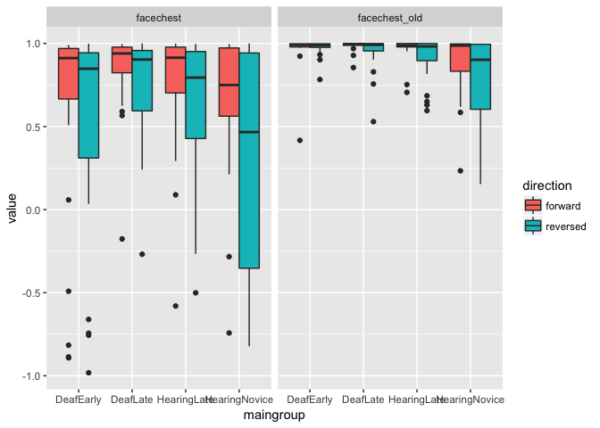
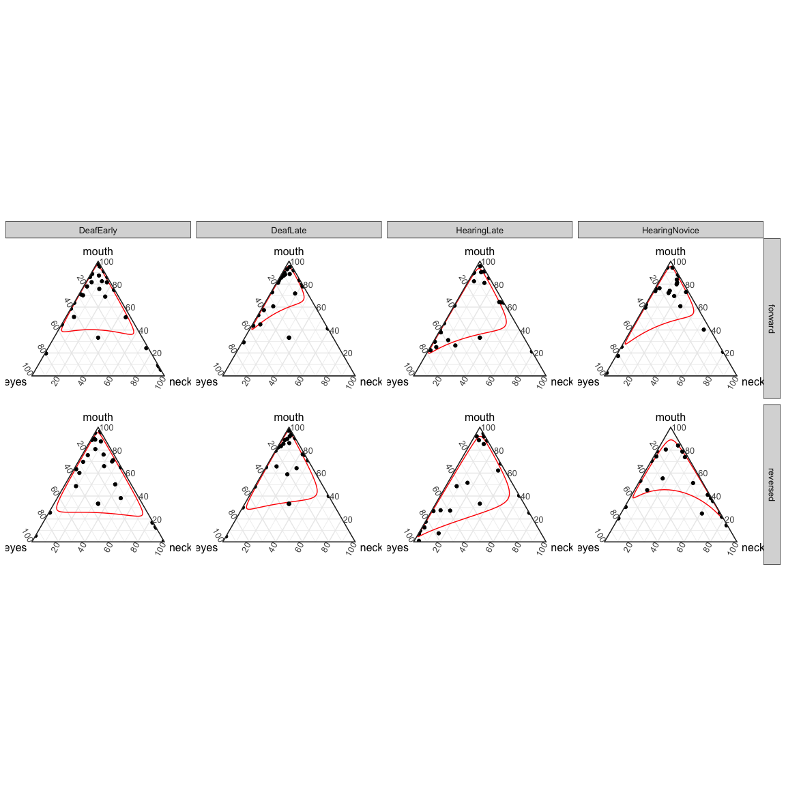

The Last Data Analysis to Rule Them All? (study1adults)
================
Adam Stone, PhD
11-18-2017

-   [Putting It All Back Together](#putting-it-all-back-together)
-   [Group Changes and Participant Tables](#group-changes-and-participant-tables)
    -   [Participant ANOVAs](#participant-anovas)
-   [Gist & Lexical Recall Data](#gist-lexical-recall-data)
    -   [Tables & Charts](#tables-charts)
    -   [ANOVA Plan](#anova-plan)
    -   [Gist ANOVAs](#gist-anovas)
    -   [Lexical Recall ANOVAs](#lexical-recall-anovas)
-   [AoA Correlations](#aoa-correlations)
    -   [Scatterplot of Correlations](#scatterplot-of-correlations)
-   [Eye Gaze Data](#eye-gaze-data)
    -   [Forehead](#forehead)
    -   [Eyes](#eyes)
    -   [Mouth](#mouth)
    -   [Neck](#neck)
    -   [Upperchest](#upperchest)
    -   [FaceChest](#facechest)
    -   [MouthEye](#moutheye)
-   [Heat Maps](#heat-maps)
-   [Summary](#summary)
-   [Rain's Notes](#rains-notes)
-   [Ternary Plots](#ternary-plots)

Putting It All Back Together
============================

Throughout all the data analysis we've done, the datasets have become more fragmented - lexical recall, gist, and eye tracking datasets. I want to put them all together in one whole dataset again so we can perform some analyses more efficiently (particularly correlations). The only thing I need to remember is we'll have a new column called `eye_exclude` and if it is set to `TRUE` it means we can't include that row in any analysis relating to eye gaze (usually because that trial was less than 25% looking).

``` r
# Libraries
library(tidyverse)
library(lme4)
library(lmerTest)
library(scales)
library(viridis)
library(agricolae) 
library(GGally)

# Load lex and eye data
cleanlexdata <- read_csv("cleandata.csv") %>%
  select(-(forehead:total))

cleaneyedata <- read_csv("cleanpercentdata.csv") %>%
  spread(aoi,percent) %>%
  add_column(eye_exclude = FALSE)

# What rows were removed from the eye data back in 03eyegaze? Let's add back in
# With a new column - eye_exclude
removed <- anti_join(cleanlexdata, cleaneyedata) %>%
  add_column(eye_exclude = TRUE)
eyelexdata <- bind_rows(cleaneyedata, removed)

# Load gist data
gist <- read_csv('gist_indiv.csv', col_types = cols(
  participant = col_character(),
  gist.fw1 = col_integer(),
  gist.rv2 = col_integer(),
  gist.fw3 = col_integer(),
  gist.rv4 = col_integer()
)) %>%
  gather(video, gist, gist.fw1:gist.rv4) %>%
  mutate(video = str_sub(video,6,8))

# Presto, our full reunified dataset - 'fulldata'
# But I want to remove columns I don't want anymore
fulldata <- left_join(eyelexdata, gist) %>%
  select(-moutheye, -facechest, -face, -chest)
```

Group Changes and Participant Tables
====================================

We have some changes to make to the groups. First, fix Josh as learning ASL when he was 6. Next, drop the DeafNative Group and reclassify all who learned ASL &lt; 3.9 as DeafEarly and ASL =&gt; 4.0 as DeafLate.

``` r
# Change Josh's AoASL to 6
fulldata <- fulldata %>%
  mutate(aoasl = as.double(aoasl)) %>%
  mutate(aoasl = case_when(
    participant == "Josh" ~ 6,
    TRUE ~ aoasl
  ))

# Reclassify Groups
fulldata <- fulldata %>%
  mutate(maingroup = case_when(
    hearing == "Deaf" & aoasl < 4 ~ "DeafEarly",
    hearing == "Deaf" & aoasl >= 4 ~ "DeafLate",
    maingroup == "HearingLateASL" ~ "HearingLate",
    maingroup == "HearingNoviceASL" ~ "HearingNovice"
  ))

# Create Participant Demographics Table
participant_info <- fulldata %>%
  select(-(acc:gist)) %>%
  select(-(video:direction)) %>%
  distinct() %>% 
  group_by(maingroup) %>%
  summarise(n = n(),
            age_mean = mean(age),
            age_sd = sd(age),
            aoasl_mean = mean(aoasl),
            aoasl_sd = sd(aoasl),
            signyrs_mean = mean(signyrs),
            signyrs_sd = sd(signyrs),
            selfrate_mean = mean(selfrate),
            selfrate_sd = sd(selfrate)) %>%
  ungroup() %>%
  mutate_if(is.double, funs(round(., 2))) %>%
  mutate(age = paste(age_mean, "±", age_sd, sep = " "),
         aoasl = paste(aoasl_mean, "±", aoasl_sd, sep = " "),
         signyrs = paste(signyrs_mean, "±", signyrs_sd, sep = " "),
         selfrate = paste(selfrate_mean, "±", selfrate_sd, sep = " ")) %>%
  select(-(age_mean:selfrate_sd)) %>%
  print()
```

    ## # A tibble: 4 x 6
    ##       maingroup     n          age        aoasl      signyrs    selfrate
    ##           <chr> <int>        <chr>        <chr>        <chr>       <chr>
    ## 1     DeafEarly    15  33.6 ± 9.16  0.67 ± 1.05  32.8 ± 9.32       5 ± 0
    ## 2      DeafLate    14 36.36 ± 5.64    11 ± 4.64 25.21 ± 5.62       5 ± 0
    ## 3   HearingLate    12  28.92 ± 6.2 17.25 ± 3.39 11.75 ± 4.85 4.62 ± 0.48
    ## 4 HearingNovice    11 20.25 ± 1.28  17.64 ± 1.8  2.44 ± 1.01 3.05 ± 0.65

Participant ANOVAs
------------------

Below are the ANOVA outputs for participant demographics, and LSDs for each.

Participants' age

    ##             Df Sum Sq Mean Sq F value   Pr(>F)    
    ## maingroup    3   1810   603.3   14.29 8.75e-07 ***
    ## Residuals   48   2026    42.2                     
    ## ---
    ## Signif. codes:  0 '***' 0.001 '**' 0.01 '*' 0.05 '.' 0.1 ' ' 1

    ##                             difference pvalue signif.        LCL       UCL
    ## DeafEarly - DeafLate         -2.757143 0.2591         -7.6115142  2.097228
    ## DeafEarly - HearingLate       4.683333 0.0688       . -0.3759532  9.742620
    ## DeafEarly - HearingNovice    13.350000 0.0000     ***  8.1645274 18.535473
    ## DeafLate - HearingLate        7.440476 0.0054      **  2.3015110 12.579441
    ## DeafLate - HearingNovice     16.107143 0.0000     *** 10.8439015 21.370384
    ## HearingLate - HearingNovice   8.666667 0.0025      **  3.2138538 14.119480

Participants' AoASL

    ##             Df Sum Sq Mean Sq F value Pr(>F)    
    ## maingroup    3 2553.9   851.3   89.98 <2e-16 ***
    ## Residuals   48  454.1     9.5                   
    ## ---
    ## Signif. codes:  0 '***' 0.001 '**' 0.01 '*' 0.05 '.' 0.1 ' ' 1

    ##                              difference pvalue signif.        LCL
    ## DeafEarly - DeafLate        -10.3333333 0.0000     *** -12.631552
    ## DeafEarly - HearingLate     -16.5833333 0.0000     *** -18.978566
    ## DeafEarly - HearingNovice   -16.9696970 0.0000     *** -19.424670
    ## DeafLate - HearingLate       -6.2500000 0.0000     ***  -8.682955
    ## DeafLate - HearingNovice     -6.6363636 0.0000     ***  -9.128155
    ## HearingLate - HearingNovice  -0.3863636 0.7648          -2.967905
    ##                                    UCL
    ## DeafEarly - DeafLate         -8.035114
    ## DeafEarly - HearingLate     -14.188101
    ## DeafEarly - HearingNovice   -14.514724
    ## DeafLate - HearingLate       -3.817045
    ## DeafLate - HearingNovice     -4.144572
    ## HearingLate - HearingNovice   2.195177

Participants' Sign Yrs

    ##             Df Sum Sq Mean Sq F value   Pr(>F)    
    ## maingroup    3   7032  2344.1   59.37 3.52e-16 ***
    ## Residuals   48   1895    39.5                     
    ## ---
    ## Signif. codes:  0 '***' 0.001 '**' 0.01 '*' 0.05 '.' 0.1 ' ' 1

    ##                             difference pvalue signif.       LCL      UCL
    ## DeafEarly - DeafLate          7.585714 0.0021      **  2.890730 12.28070
    ## DeafEarly - HearingLate      21.050000 0.0000     *** 16.156828 25.94317
    ## DeafEarly - HearingNovice    30.359091 0.0000     *** 25.343876 35.37431
    ## DeafLate - HearingLate       13.464286 0.0000     ***  8.494052 18.43452
    ## DeafLate - HearingNovice     22.773377 0.0000     *** 17.682947 27.86381
    ## HearingLate - HearingNovice   9.309091 0.0009     ***  4.035314 14.58287

Participants' Self-Rating

    ##             Df Sum Sq Mean Sq F value Pr(>F)    
    ## maingroup    3  30.71  10.237   72.37 <2e-16 ***
    ## Residuals   48   6.79   0.141                   
    ## ---
    ## Signif. codes:  0 '***' 0.001 '**' 0.01 '*' 0.05 '.' 0.1 ' ' 1

    ##                             difference pvalue signif.         LCL
    ## DeafEarly - DeafLate          0.000000 1.0000         -0.28101502
    ## DeafEarly - HearingLate       0.375000 0.0132       *  0.08212263
    ## DeafEarly - HearingNovice     1.954545 0.0000     ***  1.65436329
    ## DeafLate - HearingLate        0.375000 0.0146       *  0.07751010
    ## DeafLate - HearingNovice      1.954545 0.0000     ***  1.64986133
    ## HearingLate - HearingNovice   1.579545 0.0000     ***  1.26388721
    ##                                   UCL
    ## DeafEarly - DeafLate        0.2810150
    ## DeafEarly - HearingLate     0.6678774
    ## DeafEarly - HearingNovice   2.2547276
    ## DeafLate - HearingLate      0.6724899
    ## DeafLate - HearingNovice    2.2592296
    ## HearingLate - HearingNovice 1.8952037

Gist & Lexical Recall Data
==========================

Tables & Charts
---------------

Let's generate a table for lexical recall and gist for forward vs. reversed stories.

``` r
lexgist_info <- fulldata %>%
  group_by(maingroup, direction) %>%
  summarise(lex_mean = mean(acc, na.rm = TRUE),
            lex_sd = sd(acc, na.rm = TRUE),
            gist_mean = mean(gist),
            gist_sd = sd(gist)) %>%
  ungroup() %>%
  mutate_if(is.double, funs(round(., 2))) %>% 
  mutate(lex = paste(lex_mean, "±", lex_sd, sep = " "),
         gist = paste(gist_mean, "±", gist_sd, sep = " ")) %>%
  select(-(lex_mean:gist_sd)) %>%
  gather(metric, value, lex:gist) %>%
  unite("metric", c(metric, direction), sep = "_") %>%
  spread(metric, value) %>%
  print()
```

    ## # A tibble: 4 x 5
    ##       maingroup gist_forward gist_reversed lex_forward lex_reversed
    ## *         <chr>        <chr>         <chr>       <chr>        <chr>
    ## 1     DeafEarly  0.97 ± 0.18   0.67 ± 0.48 0.85 ± 0.07  0.76 ± 0.12
    ## 2      DeafLate        1 ± 0    0.39 ± 0.5 0.85 ± 0.08  0.69 ± 0.12
    ## 3   HearingLate        1 ± 0   0.33 ± 0.48 0.87 ± 0.09  0.69 ± 0.14
    ## 4 HearingNovice  0.45 ± 0.51   0.23 ± 0.43 0.78 ± 0.13  0.64 ± 0.13

And then bar charts too after that with error bars.

``` r
# Gist bar chart
gist_bar <- fulldata %>% select(participant, maingroup, direction, gist) %>%
  group_by(maingroup, participant, direction) %>%
  summarise(gist = mean(gist)) %>%
  group_by(maingroup, direction) %>%
  summarise(mean = mean(gist),
            sd = sd(gist),
            count = n(),
            se = sd/sqrt(count))

ggplot(gist_bar, aes(x = maingroup, y = mean, fill = direction)) +
  geom_bar(stat = "identity", position = position_dodge()) + 
  geom_errorbar(aes(ymin = mean-se, ymax = mean+se), position = position_dodge(0.9), width = 0.5) +
  labs(title = "Story Comprehension (Gist)", subtitle = "Error bars represent SE", x = "", y = "mean gist") +
  scale_y_continuous(labels = percent, limits = c(0,1))
```


``` r
# Lex bar chart
lex_bar <- fulldata %>% select(participant, maingroup, direction, acc) %>%
  group_by(maingroup, participant, direction) %>%
  summarise(acc = mean(acc, na.rm = TRUE)) %>%
  group_by(maingroup, direction) %>%
  summarise(mean = mean(acc, na.rm = TRUE),
            sd = sd(acc, na.rm = TRUE),
            count = n(),
            se = sd/sqrt(count))

ggplot(lex_bar, aes(x = maingroup, y = mean, fill = direction)) +
  geom_bar(stat = "identity", position = position_dodge()) + 
  geom_errorbar(aes(ymin = mean-se, ymax = mean+se), position = position_dodge(0.9), width = 0.5) +
  labs(title = "Lexical Recall", subtitle = "Error bars represent SE", x = "", y = "mean accuracy") +
  scale_y_continuous(labels = percent, limits = c(0,1)) +
  geom_hline(yintercept = .5, linetype = "dotted") +
  coord_cartesian(ylim = c(.5,1))
```


ANOVA Plan
----------

Next, we're going to do ANOVAs and ANCOVAs. We'll always do it in this order. The first three ANOVAs will be followed by LSD of the four maingroups with *uncorrected p-values.*

1.  ANOVA with factors MainGroup & Direction
2.  ANOVA with factor MainGroup, for Forward only
3.  ANOVA with factor MainGroup, for Reverse only
4.  ANCOVA with factor Direction, and covariate AoASL and Age
5.  Regression with variables AoASL and Age, for Forward only
6.  Regression with variables AoASL and Age, for Reverse only.

I did not include Age as a covariate in the first 3 ANOVAs because they did not add to or change the model in any significant way.

Gist ANOVAs
-----------

1.  ANOVA with factors MainGroup & Direction.

<!-- -->

    ##                     Df Sum Sq Mean Sq F value   Pr(>F)    
    ## maingroup            3  3.002   1.001  13.284 2.53e-07 ***
    ## direction            1  5.310   5.310  70.491 4.10e-13 ***
    ## maingroup:direction  3  0.896   0.299   3.965   0.0103 *  
    ## Residuals           96  7.232   0.075                     
    ## ---
    ## Signif. codes:  0 '***' 0.001 '**' 0.01 '*' 0.05 '.' 0.1 ' ' 1

    ##                             difference pvalue signif.           LCL
    ## DeafEarly - DeafLate         0.1202381 0.0987       . -0.0229201333
    ## DeafEarly - HearingLate      0.1500000 0.0488       *  0.0007987047
    ## DeafEarly - HearingNovice    0.4757576 0.0000     ***  0.3228349784
    ## DeafLate - HearingLate       0.0297619 0.6975         -0.1217891618
    ## DeafLate - HearingNovice     0.3555195 0.0000     ***  0.2003034374
    ## HearingLate - HearingNovice  0.3257576 0.0001     ***  0.1649509584
    ##                                   UCL
    ## DeafEarly - DeafLate        0.2633963
    ## DeafEarly - HearingLate     0.2992013
    ## DeafEarly - HearingNovice   0.6286802
    ## DeafLate - HearingLate      0.1813130
    ## DeafLate - HearingNovice    0.5107355
    ## HearingLate - HearingNovice 0.4865642

1.  ANOVA with factor MainGroup, for Forward only. Also a Kruskal-Wallis test. And Chi-Sq too.

<!-- -->

    ##             Df Sum Sq Mean Sq F value   Pr(>F)    
    ## maingroup    3  2.477  0.8256   16.11 2.23e-07 ***
    ## Residuals   48  2.461  0.0513                     
    ## ---
    ## Signif. codes:  0 '***' 0.001 '**' 0.01 '*' 0.05 '.' 0.1 ' ' 1

    ##                              difference pvalue signif.        LCL
    ## DeafEarly - DeafLate        -0.03333333 0.6937         -0.2025032
    ## DeafEarly - HearingLate     -0.03333333 0.7055         -0.2096443
    ## DeafEarly - HearingNovice    0.51212121 0.0000     ***  0.3314128
    ## DeafLate - HearingLate       0.00000000 1.0000         -0.1790877
    ## DeafLate - HearingNovice     0.54545455 0.0000     ***  0.3620360
    ## HearingLate - HearingNovice  0.54545455 0.0000     ***  0.3554296
    ##                                   UCL
    ## DeafEarly - DeafLate        0.1358365
    ## DeafEarly - HearingLate     0.1429776
    ## DeafEarly - HearingNovice   0.6928296
    ## DeafLate - HearingLate      0.1790877
    ## DeafLate - HearingNovice    0.7288731
    ## HearingLate - HearingNovice 0.7354795

    ## 
    ##  Kruskal-Wallis rank sum test
    ## 
    ## data:  gist by maingroup
    ## Kruskal-Wallis chi-squared = 25.46, df = 3, p-value = 1.237e-05

    ## Warning in chisq.test(gist_chisq_fw): Chi-squared approximation may be
    ## incorrect

    ## 
    ##  Pearson's Chi-squared test
    ## 
    ## data:  gist_chisq_fw
    ## X-squared = 26.984, df = 6, p-value = 0.0001458

1.  ANOVA with factor MainGroup, for Reverse only.

<!-- -->

    ##             Df Sum Sq Mean Sq F value  Pr(>F)   
    ## maingroup    3  1.421  0.4737   4.766 0.00548 **
    ## Residuals   48  4.771  0.0994                   
    ## ---
    ## Signif. codes:  0 '***' 0.001 '**' 0.01 '*' 0.05 '.' 0.1 ' ' 1

    ##                             difference pvalue signif.         LCL
    ## DeafEarly - DeafLate        0.27380952 0.0237       *  0.03824420
    ## DeafEarly - HearingLate     0.33333333 0.0088      **  0.08782421
    ## DeafEarly - HearingNovice   0.43939394 0.0010     ***  0.18776145
    ## DeafLate - HearingLate      0.05952381 0.6335         -0.18985184
    ## DeafLate - HearingNovice    0.16558442 0.1986         -0.08982191
    ## HearingLate - HearingNovice 0.10606061 0.4243         -0.15854495
    ##                                   UCL
    ## DeafEarly - DeafLate        0.5093748
    ## DeafEarly - HearingLate     0.5788425
    ## DeafEarly - HearingNovice   0.6910264
    ## DeafLate - HearingLate      0.3088995
    ## DeafLate - HearingNovice    0.4209907
    ## HearingLate - HearingNovice 0.3706662

    ## 
    ##  Kruskal-Wallis rank sum test
    ## 
    ## data:  gist by maingroup
    ## Kruskal-Wallis chi-squared = 11.365, df = 3, p-value = 0.009907

    ## Warning in chisq.test(gist_chisq_rv): Chi-squared approximation may be
    ## incorrect

    ## 
    ##  Pearson's Chi-squared test
    ## 
    ## data:  gist_chisq_rv
    ## X-squared = 15.056, df = 6, p-value = 0.01982

1.  ANCOVA with factor Direction, and variables AoASL and Age.

<!-- -->

    ##                     Df Sum Sq Mean Sq F value   Pr(>F)    
    ## direction            1  5.310   5.310  61.435 6.24e-12 ***
    ## aoasl                1  1.435   1.435  16.602 9.50e-05 ***
    ## age                  1  0.524   0.524   6.058   0.0156 *  
    ## direction:aoasl      1  0.033   0.033   0.386   0.5360    
    ## direction:age        1  0.216   0.216   2.493   0.1176    
    ## aoasl:age            1  0.579   0.579   6.703   0.0111 *  
    ## direction:aoasl:age  1  0.045   0.045   0.524   0.4707    
    ## Residuals           96  8.298   0.086                     
    ## ---
    ## Signif. codes:  0 '***' 0.001 '**' 0.01 '*' 0.05 '.' 0.1 ' ' 1

1.  Regression with variables Age and AoASL, for Forward only

<!-- -->

    ## 
    ## Call:
    ## lm(formula = gist ~ aoasl * age, data = filter(participant_data, 
    ##     direction == "forward"))
    ## 
    ## Residuals:
    ##      Min       1Q   Median       3Q      Max 
    ## -0.64682 -0.04576  0.00158  0.12355  0.42535 
    ## 
    ## Coefficients:
    ##               Estimate Std. Error t value Pr(>|t|)    
    ## (Intercept)  1.0541328  0.2576559   4.091 0.000163 ***
    ## aoasl       -0.0551054  0.0184504  -2.987 0.004431 ** 
    ## age         -0.0016630  0.0074651  -0.223 0.824659    
    ## aoasl:age    0.0015158  0.0005719   2.650 0.010863 *  
    ## ---
    ## Signif. codes:  0 '***' 0.001 '**' 0.01 '*' 0.05 '.' 0.1 ' ' 1
    ## 
    ## Residual standard error: 0.2599 on 48 degrees of freedom
    ## Multiple R-squared:  0.3434, Adjusted R-squared:  0.3023 
    ## F-statistic: 8.366 on 3 and 48 DF,  p-value: 0.0001409

1.  Regression with variables AoASL and Age, for Reverse only.

<!-- -->

    ## 
    ## Call:
    ## lm(formula = gist ~ aoasl * age, data = filter(participant_data, 
    ##     direction == "reversed"))
    ## 
    ## Residuals:
    ##      Min       1Q   Median       3Q      Max 
    ## -0.63610 -0.22752  0.02114  0.24941  0.61943 
    ## 
    ## Coefficients:
    ##               Estimate Std. Error t value Pr(>|t|)  
    ## (Intercept)  0.8059325  0.3217367   2.505   0.0157 *
    ## aoasl       -0.0431909  0.0230392  -1.875   0.0669 .
    ## age         -0.0058563  0.0093218  -0.628   0.5328  
    ## aoasl:age    0.0008532  0.0007142   1.195   0.2381  
    ## ---
    ## Signif. codes:  0 '***' 0.001 '**' 0.01 '*' 0.05 '.' 0.1 ' ' 1
    ## 
    ## Residual standard error: 0.3245 on 48 degrees of freedom
    ## Multiple R-squared:  0.1836, Adjusted R-squared:  0.1326 
    ## F-statistic: 3.598 on 3 and 48 DF,  p-value: 0.02002

Lexical Recall ANOVAs
---------------------

1.  ANOVA with factors MainGroup & Direction.

<!-- -->

    ##                     Df Sum Sq Mean Sq F value   Pr(>F)    
    ## maingroup            3 0.1175  0.0392   5.348  0.00189 ** 
    ## direction            1 0.5211  0.5211  71.149 3.38e-13 ***
    ## maingroup:direction  3 0.0294  0.0098   1.336  0.26731    
    ## Residuals           96 0.7031  0.0073                     
    ## ---
    ## Signif. codes:  0 '***' 0.001 '**' 0.01 '*' 0.05 '.' 0.1 ' ' 1

    ##                               difference pvalue signif.          LCL
    ## DeafEarly - DeafLate         0.035439881 0.1183         -0.009198232
    ## DeafEarly - HearingLate      0.030916667 0.1903         -0.015605732
    ## DeafEarly - HearingNovice    0.095575758 0.0001     ***  0.047893021
    ## DeafLate - HearingLate      -0.004523214 0.8497         -0.051778295
    ## DeafLate - HearingNovice     0.060135877 0.0154       *  0.011738021
    ## HearingLate - HearingNovice  0.064659091 0.0120       *  0.014518041
    ##                                    UCL
    ## DeafEarly - DeafLate        0.08007799
    ## DeafEarly - HearingLate     0.07743907
    ## DeafEarly - HearingNovice   0.14325849
    ## DeafLate - HearingLate      0.04273187
    ## DeafLate - HearingNovice    0.10853373
    ## HearingLate - HearingNovice 0.11480014

1.  ANOVA with factor MainGroup, for Forward only.

<!-- -->

    ##             Df  Sum Sq  Mean Sq F value Pr(>F)  
    ## maingroup    3 0.04988 0.016626   2.984 0.0404 *
    ## Residuals   48 0.26749 0.005573                 
    ## ---
    ## Signif. codes:  0 '***' 0.001 '**' 0.01 '*' 0.05 '.' 0.1 ' ' 1

    ##                               difference pvalue signif.          LCL
    ## DeafEarly - DeafLate         0.001880952 0.9462         -0.053895965
    ## DeafEarly - HearingLate     -0.013000000 0.6550         -0.071131400
    ## DeafEarly - HearingNovice    0.071393939 0.0199       *  0.011812655
    ## DeafLate - HearingLate      -0.014880952 0.6147         -0.073927864
    ## DeafLate - HearingNovice     0.069512987 0.0252       *  0.009038137
    ## HearingLate - HearingNovice  0.084393939 0.0093      **  0.021740905
    ##                                    UCL
    ## DeafEarly - DeafLate        0.05765787
    ## DeafEarly - HearingLate     0.04513140
    ## DeafEarly - HearingNovice   0.13097522
    ## DeafLate - HearingLate      0.04416596
    ## DeafLate - HearingNovice    0.12998784
    ## HearingLate - HearingNovice 0.14704697

1.  ANOVA with factor MainGroup, for Reverse only.

<!-- -->

    ##             Df Sum Sq Mean Sq F value Pr(>F)  
    ## maingroup    3 0.0970 0.03233   3.562 0.0209 *
    ## Residuals   48 0.4356 0.00908                 
    ## ---
    ## Signif. codes:  0 '***' 0.001 '**' 0.01 '*' 0.05 '.' 0.1 ' ' 1

    ##                              difference pvalue signif.           LCL
    ## DeafEarly - DeafLate        0.068998810 0.0571       . -0.0021805250
    ## DeafEarly - HearingLate     0.074833333 0.0481       *  0.0006493411
    ## DeafEarly - HearingNovice   0.119757576 0.0027      **  0.0437233245
    ## DeafLate - HearingLate      0.005834524 0.8769         -0.0695177922
    ## DeafLate - HearingNovice    0.050758766 0.1923         -0.0264158033
    ## HearingLate - HearingNovice 0.044924242 0.2642         -0.0350300021
    ##                                    UCL
    ## DeafEarly - DeafLate        0.14017814
    ## DeafEarly - HearingLate     0.14901733
    ## DeafEarly - HearingNovice   0.19579183
    ## DeafLate - HearingLate      0.08118684
    ## DeafLate - HearingNovice    0.12793334
    ## HearingLate - HearingNovice 0.12487849

1.  ANCOVA with factor Direction, and covariate AoASL and Age.

<!-- -->

    ##                     Df Sum Sq Mean Sq F value   Pr(>F)    
    ## direction            1 0.5211  0.5211  69.354 5.72e-13 ***
    ## aoasl                1 0.0431  0.0431   5.731   0.0186 *  
    ## age                  1 0.0347  0.0347   4.621   0.0341 *  
    ## direction:aoasl      1 0.0204  0.0204   2.716   0.1026    
    ## direction:age        1 0.0094  0.0094   1.253   0.2658    
    ## aoasl:age            1 0.0195  0.0195   2.602   0.1100    
    ## direction:aoasl:age  1 0.0015  0.0015   0.202   0.6540    
    ## Residuals           96 0.7213  0.0075                     
    ## ---
    ## Signif. codes:  0 '***' 0.001 '**' 0.01 '*' 0.05 '.' 0.1 ' ' 1

1.  Regression with variables Age and AoASL, for Forward only

<!-- -->

    ## 
    ## Call:
    ## lm(formula = acc ~ aoasl * age, data = filter(participant_data, 
    ##     direction == "forward"))
    ## 
    ## Residuals:
    ##       Min        1Q    Median        3Q       Max 
    ## -0.223429 -0.032150  0.004461  0.039614  0.205706 
    ## 
    ## Coefficients:
    ##               Estimate Std. Error t value Pr(>|t|)    
    ## (Intercept)  0.7878168  0.0743596  10.595 3.69e-14 ***
    ## aoasl       -0.0045003  0.0053248  -0.845    0.402    
    ## age          0.0017563  0.0021544   0.815    0.419    
    ## aoasl:age    0.0001569  0.0001651   0.951    0.347    
    ## ---
    ## Signif. codes:  0 '***' 0.001 '**' 0.01 '*' 0.05 '.' 0.1 ' ' 1
    ## 
    ## Residual standard error: 0.07501 on 48 degrees of freedom
    ## Multiple R-squared:  0.1491, Adjusted R-squared:  0.09593 
    ## F-statistic: 2.804 on 3 and 48 DF,  p-value: 0.04966

1.  Regression with variables AoASL and Age, for Reverse only.

<!-- -->

    ## 
    ## Call:
    ## lm(formula = acc ~ aoasl * age, data = filter(participant_data, 
    ##     direction == "reversed"))
    ## 
    ## Residuals:
    ##       Min        1Q    Median        3Q       Max 
    ## -0.243150 -0.053718  0.000822  0.061438  0.212639 
    ## 
    ## Coefficients:
    ##               Estimate Std. Error t value Pr(>|t|)    
    ## (Intercept)  0.8084021  0.0961239   8.410 5.33e-11 ***
    ## aoasl       -0.0127774  0.0068833  -1.856   0.0696 .  
    ## age         -0.0018529  0.0027850  -0.665   0.5090    
    ## aoasl:age    0.0002782  0.0002134   1.304   0.1985    
    ## ---
    ## Signif. codes:  0 '***' 0.001 '**' 0.01 '*' 0.05 '.' 0.1 ' ' 1
    ## 
    ## Residual standard error: 0.09696 on 48 degrees of freedom
    ## Multiple R-squared:  0.1527, Adjusted R-squared:  0.09977 
    ## F-statistic: 2.884 on 3 and 48 DF,  p-value: 0.04527

AoA Correlations
================

Next, we want to look at correlations between AoA and Gist, and betwen AoA and Lexical Recall. Rain asked for forward and reversed separately (1) deaf only, (2) hearing only, and (3) both. Let's make it work.

``` r
# Let's make participant-level data, and have forward/reversed in separate columns
lexgist_data <- fulldata %>%
  group_by(maingroup, participant, direction) %>%
  mutate(gist = mean(gist, na.rm = TRUE),
         lex = mean(acc, na.rm = TRUE)) %>%
  ungroup() %>%
  select(maingroup, participant, hearing, direction, aoasl, signyrs, age, gist, lex) %>%
  distinct() %>%
  gather(metric, value, gist:lex) %>%
  unite(metricvalue, c(metric, direction), sep = "_") %>%
  spread(metricvalue, value) %>%
  select(-participant, -maingroup)

lexgist_deaf <- lexgist_data %>% filter(hearing == "Deaf") %>% select(-hearing)
lexgist_hearing <- lexgist_data %>% filter(hearing == "Hearing") %>% select(-hearing)
lexgist_all <- lexgist_data %>% select(-hearing)

# Load awesome function to make correlation tables with stars for significance
# From: https://myowelt.blogspot.co.uk/2008/04/beautiful-correlation-tables-in-r.html
corstarsl <- function(x){ 
require(Hmisc) 
x <- as.matrix(x) 
R <- Hmisc::rcorr(x)$r 
p <- Hmisc::rcorr(x)$P 
## define notions for significance levels; spacing is important.
mystars <- ifelse(p < .001, "***", ifelse(p < .01, "** ", ifelse(p < .05, "* ", " ")))
## trunctuate the matrix that holds the correlations to two decimal
R <- format(round(cbind(rep(-1.11, ncol(x)), R), 2))[,-1] 
## build a new matrix that includes the correlations with their apropriate stars 
Rnew <- matrix(paste(R, mystars, sep=""), ncol=ncol(x)) 
diag(Rnew) <- paste(diag(R), " ", sep="") 
rownames(Rnew) <- colnames(x) 
colnames(Rnew) <- paste(colnames(x), "", sep="") 
## remove upper triangle
Rnew <- as.matrix(Rnew)
Rnew[upper.tri(Rnew, diag = TRUE)] <- ""
Rnew <- as.data.frame(Rnew) 
## remove last column and return the matrix (which is now a data frame)
Rnew <- cbind(Rnew[1:length(Rnew)-1])
return(Rnew) 
}

# Correlations for Deaf
print("DEAF Correlations - Pearson's r")
```

    ## [1] "DEAF Correlations - Pearson's r"

``` r
#corstarsl(lexgist_deaf)
Hmisc::rcorr(as.matrix(lexgist_deaf))$r
```

    ##                     aoasl     signyrs        age gist_forward
    ## aoasl          1.00000000 -0.50188273  0.2569266   0.08266371
    ## signyrs       -0.50188273  1.00000000  0.7005996   0.18321127
    ## age            0.25692660  0.70059955  1.0000000   0.27454460
    ## gist_forward   0.08266371  0.18321127  0.2745446   1.00000000
    ## gist_reversed -0.25585943 -0.01264108 -0.1726494   0.01762269
    ## lex_forward    0.14743346  0.27968505  0.4299784  -0.08155560
    ## lex_reversed  -0.25601873  0.06666998 -0.1276563  -0.09770666
    ##               gist_reversed lex_forward lex_reversed
    ## aoasl           -0.25585943  0.14743346  -0.25601873
    ## signyrs         -0.01264108  0.27968505   0.06666998
    ## age             -0.17264941  0.42997837  -0.12765634
    ## gist_forward     0.01762269 -0.08155560  -0.09770666
    ## gist_reversed    1.00000000  0.02667231   0.36021802
    ## lex_forward      0.02667231  1.00000000   0.35984892
    ## lex_reversed     0.36021802  0.35984892   1.00000000

``` r
print("DEAF Correlations - P-values")
```

    ## [1] "DEAF Correlations - P-values"

``` r
Hmisc::rcorr(as.matrix(lexgist_deaf))$P
```

    ##                     aoasl      signyrs          age gist_forward
    ## aoasl                  NA 5.536857e-03 1.784812e-01    0.6698839
    ## signyrs       0.005536857           NA 2.316796e-05    0.3414473
    ## age           0.178481213 2.316796e-05           NA    0.1495001
    ## gist_forward  0.669883883 3.414473e-01 1.495001e-01           NA
    ## gist_reversed 0.180354888 9.481084e-01 3.704662e-01    0.9277044
    ## lex_forward   0.445335297 1.417224e-01 1.990877e-02    0.6740666
    ## lex_reversed  0.180074336 7.311330e-01 5.093054e-01    0.6140990
    ##               gist_reversed lex_forward lex_reversed
    ## aoasl            0.18035489  0.44533530   0.18007434
    ## signyrs          0.94810844  0.14172236   0.73113301
    ## age              0.37046625  0.01990877   0.50930544
    ## gist_forward     0.92770438  0.67406661   0.61409897
    ## gist_reversed            NA  0.89076140   0.05492031
    ## lex_forward      0.89076140          NA   0.05518766
    ## lex_reversed     0.05492031  0.05518766           NA

``` r
cat(paste("","\n",""))
```

``` r
# Correlations for Hearing
print("HEARING Correlations - Pearson's r")
```

    ## [1] "HEARING Correlations - Pearson's r"

``` r
#corstarsl(lexgist_hearing)
Hmisc::rcorr(as.matrix(lexgist_hearing))$r
```

    ##                     aoasl     signyrs       age gist_forward gist_reversed
    ## aoasl          1.00000000 -0.07887013 0.3468184  -0.15525565    0.07815751
    ## signyrs       -0.07887013  1.00000000 0.9021947   0.57814670    0.28845748
    ## age            0.34681845  0.90219468 1.0000000   0.44651473    0.30963454
    ## gist_forward  -0.15525565  0.57814670 0.4465147   1.00000000    0.29502174
    ## gist_reversed  0.07815751  0.28845748 0.3096345   0.29502174    1.00000000
    ## lex_forward    0.02500269  0.36725658 0.3093175   0.57154566    0.35682374
    ## lex_reversed   0.01411303  0.20828810 0.2013959   0.07645807    0.57951176
    ##               lex_forward lex_reversed
    ## aoasl          0.02500269   0.01411303
    ## signyrs        0.36725658   0.20828810
    ## age            0.30931753   0.20139593
    ## gist_forward   0.57154566   0.07645807
    ## gist_reversed  0.35682374   0.57951176
    ## lex_forward    1.00000000   0.36558339
    ## lex_reversed   0.36558339   1.00000000

``` r
print("HEARING Correlations - P-values")
```

    ## [1] "HEARING Correlations - P-values"

``` r
Hmisc::rcorr(as.matrix(lexgist_hearing))$P
```

    ##                   aoasl      signyrs          age gist_forward
    ## aoasl                NA 7.205586e-01 1.049514e-01  0.479339909
    ## signyrs       0.7205586           NA 4.046899e-09  0.003857505
    ## age           0.1049514 4.046899e-09           NA  0.032691671
    ## gist_forward  0.4793399 3.857505e-03 3.269167e-02           NA
    ## gist_reversed 0.7229865 1.819325e-01 1.505025e-01  0.171744860
    ## lex_forward   0.9098410 8.472343e-02 1.509426e-01  0.004385475
    ## lex_reversed  0.9490402 3.402228e-01 3.567949e-01  0.728786878
    ##               gist_reversed lex_forward lex_reversed
    ## aoasl           0.722986497 0.909841021  0.949040176
    ## signyrs         0.181932462 0.084723426  0.340222805
    ## age             0.150502508 0.150942632  0.356794880
    ## gist_forward    0.171744860 0.004385475  0.728786878
    ## gist_reversed            NA 0.094647552  0.003755275
    ## lex_forward     0.094647552          NA  0.086260140
    ## lex_reversed    0.003755275 0.086260140           NA

``` r
cat(paste("","\n",""))
```

``` r
# Correlations for All
print("ALL Correlations - Pearson's r")
```

    ## [1] "ALL Correlations - Pearson's r"

``` r
#corstarsl(lexgist_all)
Hmisc::rcorr(as.matrix(lexgist_all))$r
```

    ##                     aoasl    signyrs        age gist_forward gist_reversed
    ## aoasl          1.00000000 -0.7852245 -0.3136458   -0.3230903    -0.3922803
    ## signyrs       -0.78522450  1.0000000  0.8314757    0.4956183     0.3356193
    ## age           -0.31364575  0.8314757  1.0000000    0.4602616     0.1930257
    ## gist_forward  -0.32309031  0.4956183  0.4602616    1.0000000     0.2712761
    ## gist_reversed -0.39228034  0.3356193  0.1930257    0.2712761     1.0000000
    ## lex_forward   -0.08115845  0.2969899  0.3631828    0.4927911     0.2170182
    ## lex_reversed  -0.33945209  0.3182316  0.1886432    0.1521110     0.4921550
    ##               lex_forward lex_reversed
    ## aoasl         -0.08115845   -0.3394521
    ## signyrs        0.29698992    0.3182316
    ## age            0.36318284    0.1886432
    ## gist_forward   0.49279109    0.1521110
    ## gist_reversed  0.21701819    0.4921550
    ## lex_forward    1.00000000    0.3800772
    ## lex_reversed   0.38007715    1.0000000

``` r
print("ALL Correlations - P-values")
```

    ## [1] "ALL Correlations - P-values"

``` r
Hmisc::rcorr(as.matrix(lexgist_all))$P
```

    ##                      aoasl      signyrs          age gist_forward
    ## aoasl                   NA 5.523138e-12 2.356068e-02 0.0194786567
    ## signyrs       5.523138e-12           NA 2.309264e-14 0.0001870211
    ## age           2.356068e-02 2.309264e-14           NA 0.0005965582
    ## gist_forward  1.947866e-02 1.870211e-04 5.965582e-04           NA
    ## gist_reversed 4.023967e-03 1.500067e-02 1.703671e-01 0.0517394597
    ## lex_forward   5.673490e-01 3.251160e-02 8.137388e-03 0.0002061625
    ## lex_reversed  1.382018e-02 2.149676e-02 1.804672e-01 0.2817023354
    ##               gist_reversed  lex_forward lex_reversed
    ## aoasl          0.0040239673 0.5673489939 0.0138201778
    ## signyrs        0.0150006737 0.0325116001 0.0214967644
    ## age            0.1703671221 0.0081373882 0.1804672184
    ## gist_forward   0.0517394597 0.0002061625 0.2817023354
    ## gist_reversed            NA 0.1222542968 0.0002107074
    ## lex_forward    0.1222542968           NA 0.0054478274
    ## lex_reversed   0.0002107074 0.0054478274           NA

I'm also including nicely formatted tables with \*\*\* indicators of significance for quick referencing. Order: Deaf, Hearing, All.

``` r
corstarsl(lexgist_deaf)
```

    ## Loading required package: Hmisc

    ## Loading required package: lattice

    ## Loading required package: survival

    ## Loading required package: Formula

    ## 
    ## Attaching package: 'Hmisc'

    ## The following objects are masked from 'package:dplyr':
    ## 
    ##     combine, src, summarize

    ## The following objects are masked from 'package:base':
    ## 
    ##     format.pval, round.POSIXt, trunc.POSIXt, units

    ##                  aoasl  signyrs     age gist_forward gist_reversed
    ## aoasl                                                             
    ## signyrs       -0.50**                                             
    ## age              0.26   0.70***                                   
    ## gist_forward     0.08     0.18    0.27                            
    ## gist_reversed   -0.26    -0.01   -0.17         0.02               
    ## lex_forward      0.15     0.28   0.43*        -0.08          0.03 
    ## lex_reversed    -0.26     0.07   -0.13        -0.10          0.36 
    ##               lex_forward
    ## aoasl                    
    ## signyrs                  
    ## age                      
    ## gist_forward             
    ## gist_reversed            
    ## lex_forward              
    ## lex_reversed        0.36

``` r
corstarsl(lexgist_hearing)
```

    ##                aoasl  signyrs     age gist_forward gist_reversed
    ## aoasl                                                           
    ## signyrs       -0.08                                             
    ## age            0.35   0.90***                                   
    ## gist_forward  -0.16   0.58**   0.45*                            
    ## gist_reversed  0.08     0.29    0.31         0.30               
    ## lex_forward    0.03     0.37    0.31       0.57**          0.36 
    ## lex_reversed   0.01     0.21    0.20         0.08        0.58** 
    ##               lex_forward
    ## aoasl                    
    ## signyrs                  
    ## age                      
    ## gist_forward             
    ## gist_reversed            
    ## lex_forward              
    ## lex_reversed        0.37

``` r
corstarsl(lexgist_all)
```

    ##                  aoasl  signyrs      age gist_forward gist_reversed
    ## aoasl                                                              
    ## signyrs       -0.79***                                             
    ## age            -0.31*   0.83***                                    
    ## gist_forward   -0.32*   0.50***  0.46***                           
    ## gist_reversed -0.39**    0.34*     0.19         0.27               
    ## lex_forward     -0.08    0.30*   0.36**       0.49***         0.22 
    ## lex_reversed   -0.34*    0.32*     0.19         0.15        0.49***
    ##               lex_forward
    ## aoasl                    
    ## signyrs                  
    ## age                      
    ## gist_forward             
    ## gist_reversed            
    ## lex_forward              
    ## lex_reversed      0.38**

Scatterplot of Correlations
---------------------------

Let's visualize what's happening with the correlations here.

``` r
ggpairs(lexgist_data, columns = c(2:8), aes(color = hearing))
```


Eye Gaze Data
=============

Now eye gaze data. Boxplots first. Also here, we're renaming "chin" to "neck" because that's what it actually is! But we also have to fix all NA's in the percentages to zeros, becuase that's what they actually are.

``` r
# rename chin to neck
fulldata <- fulldata %>%
  rename(neck = chin) %>%
  gather(aoi, percent, belly:upperchest)

# Fix all NA's in Percent column to 0
fixpercent <- fulldata$percent
fulldata$percent <- coalesce(fixpercent, 0)
fulldata <- fulldata %>%
  spread(aoi, percent)

fulldata %>%
  filter(eye_exclude == FALSE) %>%
  select(direction, belly:upperchest) %>%
  gather(aoi, percent, belly:upperchest) %>%
  ggplot(aes(x = aoi, y = percent, fill = direction)) + geom_boxplot()
```


Forehead
--------

This is going to get complicated - we need to run all 6 ANOVAs/ANCOVAs on 5 AOIs. That's 30 models. Thank goodness for find-and-replace! I'm going to skip the LSD comparisons for now, to make it easier to just scroll through.

1.  ANOVA with factors MainGroup & Direction.

<!-- -->

    ##                     Df  Sum Sq  Mean Sq F value Pr(>F)  
    ## maingroup            3 0.00957 0.003191   2.309 0.0814 .
    ## direction            1 0.00304 0.003044   2.202 0.1411  
    ## maingroup:direction  3 0.00382 0.001273   0.921 0.4340  
    ## Residuals           95 0.13132 0.001382                 
    ## ---
    ## Signif. codes:  0 '***' 0.001 '**' 0.01 '*' 0.05 '.' 0.1 ' ' 1

1.  ANOVA with factor MainGroup, for Forward only.

<!-- -->

    ##             Df   Sum Sq   Mean Sq F value Pr(>F)
    ## maingroup    3 0.001415 0.0004717   1.782  0.163
    ## Residuals   48 0.012704 0.0002647

1.  ANOVA with factor MainGroup, for Reverse only.

<!-- -->

    ##             Df  Sum Sq  Mean Sq F value Pr(>F)
    ## maingroup    3 0.01193 0.003977   1.576  0.208
    ## Residuals   47 0.11862 0.002524

1.  ANCOVA with factor Direction, and covariate AoASL and Age.

<!-- -->

    ##                     Df  Sum Sq   Mean Sq F value Pr(>F)
    ## direction            1 0.00309 0.0030909   2.045  0.156
    ## aoasl                1 0.00009 0.0000867   0.057  0.811
    ## age                  1 0.00032 0.0003163   0.209  0.648
    ## direction:aoasl      1 0.00016 0.0001580   0.105  0.747
    ## direction:age        1 0.00022 0.0002163   0.143  0.706
    ## aoasl:age            1 0.00009 0.0000923   0.061  0.805
    ## direction:aoasl:age  1 0.00018 0.0001784   0.118  0.732
    ## Residuals           95 0.14362 0.0015118

1.  Regression with variables Age and AoASL, for Forward only

<!-- -->

    ## 
    ## Call:
    ## lm(formula = forehead ~ aoasl * age, data = filter(aoi5_data, 
    ##     direction == "forward"))
    ## 
    ## Residuals:
    ##       Min        1Q    Median        3Q       Max 
    ## -0.010785 -0.008783 -0.005130 -0.003979  0.061707 
    ## 
    ## Coefficients:
    ##               Estimate Std. Error t value Pr(>|t|)
    ## (Intercept)  3.797e-03  1.685e-02   0.225    0.823
    ## aoasl        4.507e-04  1.207e-03   0.373    0.710
    ## age          2.391e-05  4.882e-04   0.049    0.961
    ## aoasl:age   -5.838e-06  3.740e-05  -0.156    0.877
    ## 
    ## Residual standard error: 0.017 on 48 degrees of freedom
    ## Multiple R-squared:  0.01786,    Adjusted R-squared:  -0.04352 
    ## F-statistic: 0.291 on 3 and 48 DF,  p-value: 0.8317

1.  Regression with variables Age and AoASL, for Reverse only

<!-- -->

    ## 
    ## Call:
    ## lm(formula = forehead ~ aoasl * age, data = filter(aoi5_data, 
    ##     direction == "reversed"))
    ## 
    ## Residuals:
    ##      Min       1Q   Median       3Q      Max 
    ## -0.02793 -0.01961 -0.01649 -0.01334  0.23359 
    ## 
    ## Coefficients:
    ##               Estimate Std. Error t value Pr(>|t|)
    ## (Intercept)  4.482e-02  5.210e-02   0.860    0.394
    ## aoasl       -1.290e-03  3.731e-03  -0.346    0.731
    ## age         -7.676e-04  1.511e-03  -0.508    0.614
    ## aoasl:age    3.574e-05  1.156e-04   0.309    0.759
    ## 
    ## Residual standard error: 0.05254 on 47 degrees of freedom
    ## Multiple R-squared:  0.006095,   Adjusted R-squared:  -0.05735 
    ## F-statistic: 0.09608 on 3 and 47 DF,  p-value: 0.9618

Eyes
----

1.  ANOVA with factors MainGroup & Direction.

<!-- -->

    ##                     Df Sum Sq Mean Sq F value Pr(>F)
    ## maingroup            3  0.315 0.10508   1.936  0.129
    ## direction            1  0.000 0.00000   0.000  0.999
    ## maingroup:direction  3  0.013 0.00425   0.078  0.972
    ## Residuals           95  5.157 0.05429

1.  ANOVA with factor MainGroup, for Forward only.

<!-- -->

    ##             Df Sum Sq Mean Sq F value Pr(>F)
    ## maingroup    3 0.1234 0.04114   0.863  0.467
    ## Residuals   48 2.2876 0.04766

1.  ANOVA with factor MainGroup, for Reverse only.

<!-- -->

    ##             Df Sum Sq Mean Sq F value Pr(>F)
    ## maingroup    3 0.2046 0.06820   1.117  0.352
    ## Residuals   47 2.8695 0.06105

1.  ANCOVA with factor Direction, and covariate AoASL and Age.

<!-- -->

    ##                     Df Sum Sq Mean Sq F value Pr(>F)
    ## direction            1  0.000 0.00000   0.000  0.995
    ## aoasl                1  0.047 0.04669   0.821  0.367
    ## age                  1  0.009 0.00903   0.159  0.691
    ## direction:aoasl      1  0.000 0.00008   0.001  0.971
    ## direction:age        1  0.014 0.01362   0.239  0.626
    ## aoasl:age            1  0.003 0.00258   0.045  0.832
    ## direction:aoasl:age  1  0.007 0.00717   0.126  0.723
    ## Residuals           95  5.406 0.05690

1.  Regression with variables Age and AoASL, for Forward only

<!-- -->

    ## 
    ## Call:
    ## lm(formula = eyes ~ aoasl * age, data = filter(aoi5_data, direction == 
    ##     "forward"))
    ## 
    ## Residuals:
    ##      Min       1Q   Median       3Q      Max 
    ## -0.23543 -0.16625 -0.09484  0.13048  0.60413 
    ## 
    ## Coefficients:
    ##               Estimate Std. Error t value Pr(>|t|)
    ## (Intercept)  0.1114653  0.2205845   0.505    0.616
    ## aoasl        0.0093545  0.0157958   0.592    0.556
    ## age          0.0019633  0.0063910   0.307    0.760
    ## aoasl:age   -0.0002108  0.0004897  -0.431    0.669
    ## 
    ## Residual standard error: 0.2225 on 48 degrees of freedom
    ## Multiple R-squared:  0.01437,    Adjusted R-squared:  -0.04723 
    ## F-statistic: 0.2333 on 3 and 48 DF,  p-value: 0.8727

1.  Regression with variables Age and AoASL, for Reverse only

<!-- -->

    ## 
    ## Call:
    ## lm(formula = eyes ~ aoasl * age, data = filter(aoi5_data, direction == 
    ##     "reversed"))
    ## 
    ## Residuals:
    ##      Min       1Q   Median       3Q      Max 
    ## -0.25646 -0.18517 -0.08579  0.17714  0.62517 
    ## 
    ## Coefficients:
    ##              Estimate Std. Error t value Pr(>|t|)
    ## (Intercept) 1.095e-01  2.517e-01   0.435    0.666
    ## aoasl       1.935e-03  1.803e-02   0.107    0.915
    ## age         2.005e-03  7.300e-03   0.275    0.785
    ## aoasl:age   5.266e-05  5.588e-04   0.094    0.925
    ## 
    ## Residual standard error: 0.2539 on 47 degrees of freedom
    ## Multiple R-squared:  0.01448,    Adjusted R-squared:  -0.04843 
    ## F-statistic: 0.2302 on 3 and 47 DF,  p-value: 0.8749

Mouth
-----

1.  ANOVA with factors MainGroup & Direction.

<!-- -->

    ##                     Df Sum Sq Mean Sq F value Pr(>F)  
    ## maingroup            3  0.499 0.16623   2.533 0.0616 .
    ## direction            1  0.246 0.24582   3.745 0.0559 .
    ## maingroup:direction  3  0.029 0.00955   0.146 0.9323  
    ## Residuals           95  6.235 0.06563                 
    ## ---
    ## Signif. codes:  0 '***' 0.001 '**' 0.01 '*' 0.05 '.' 0.1 ' ' 1

    ##                              difference pvalue signif.         LCL
    ## DeafEarly - DeafLate        -0.06025012 0.3776         -0.19516772
    ## DeafEarly - HearingLate      0.11851495 0.0945       . -0.02077004
    ## DeafEarly - HearingNovice    0.08382286 0.2467         -0.05893611
    ## DeafLate - HearingLate       0.17876508 0.0146       *  0.03608239
    ## DeafLate - HearingNovice     0.14407298 0.0532       . -0.00200290
    ## HearingLate - HearingNovice -0.03469210 0.6474         -0.18481109
    ##                                    UCL
    ## DeafEarly - DeafLate        0.07466748
    ## DeafEarly - HearingLate     0.25779995
    ## DeafEarly - HearingNovice   0.22658183
    ## DeafLate - HearingLate      0.32144776
    ## DeafLate - HearingNovice    0.29014886
    ## HearingLate - HearingNovice 0.11542690

1.  ANOVA with factor MainGroup, for Forward only.

<!-- -->

    ##             Df Sum Sq Mean Sq F value Pr(>F)
    ## maingroup    3 0.1506 0.05021   0.909  0.444
    ## Residuals   48 2.6511 0.05523

1.  ANOVA with factor MainGroup, for Reverse only.

<!-- -->

    ##             Df Sum Sq Mean Sq F value Pr(>F)
    ## maingroup    3  0.368 0.12263   1.608    0.2
    ## Residuals   47  3.584 0.07625

1.  ANCOVA with factor Direction, and covariate AoASL and Age.

<!-- -->

    ##                     Df Sum Sq Mean Sq F value  Pr(>F)   
    ## direction            1  0.255  0.2546   3.875 0.05191 . 
    ## aoasl                1  0.037  0.0368   0.561 0.45580   
    ## age                  1  0.459  0.4593   6.991 0.00958 **
    ## direction:aoasl      1  0.003  0.0027   0.041 0.84063   
    ## direction:age        1  0.009  0.0089   0.136 0.71335   
    ## aoasl:age            1  0.001  0.0011   0.017 0.89558   
    ## direction:aoasl:age  1  0.003  0.0030   0.046 0.83099   
    ## Residuals           95  6.242  0.0657                   
    ## ---
    ## Signif. codes:  0 '***' 0.001 '**' 0.01 '*' 0.05 '.' 0.1 ' ' 1

1.  Regression with variables Age and AoASL, for Forward only

<!-- -->

    ## 
    ## Call:
    ## lm(formula = mouth ~ aoasl * age, data = filter(aoi5_data, direction == 
    ##     "forward"))
    ## 
    ## Residuals:
    ##      Min       1Q   Median       3Q      Max 
    ## -0.44000 -0.20113  0.06621  0.19821  0.31155 
    ## 
    ## Coefficients:
    ##               Estimate Std. Error t value Pr(>|t|)
    ## (Intercept)  0.3649728  0.2314635   1.577    0.121
    ## aoasl        0.0049408  0.0165748   0.298    0.767
    ## age          0.0084860  0.0067063   1.265    0.212
    ## aoasl:age   -0.0001379  0.0005138  -0.268    0.790
    ## 
    ## Residual standard error: 0.2335 on 48 degrees of freedom
    ## Multiple R-squared:  0.06612,    Adjusted R-squared:  0.007748 
    ## F-statistic: 1.133 on 3 and 48 DF,  p-value: 0.3453

1.  Regression with variables Age and AoASL, for Reverse only

<!-- -->

    ## 
    ## Call:
    ## lm(formula = mouth ~ aoasl * age, data = filter(aoi5_data, direction == 
    ##     "reversed"))
    ## 
    ## Residuals:
    ##      Min       1Q   Median       3Q      Max 
    ## -0.57201 -0.20495  0.01672  0.20824  0.37940 
    ## 
    ## Coefficients:
    ##               Estimate Std. Error t value Pr(>|t|)
    ## (Intercept)  2.625e-01  2.754e-01   0.953    0.345
    ## aoasl       -8.955e-04  1.972e-02  -0.045    0.964
    ## age          8.966e-03  7.986e-03   1.123    0.267
    ## aoasl:age    3.289e-05  6.112e-04   0.054    0.957
    ## 
    ## Residual standard error: 0.2777 on 47 degrees of freedom
    ## Multiple R-squared:  0.08266,    Adjusted R-squared:  0.02411 
    ## F-statistic: 1.412 on 3 and 47 DF,  p-value: 0.2511

Neck
----

1.  ANOVA with factors MainGroup & Direction.

<!-- -->

    ##                     Df Sum Sq Mean Sq F value Pr(>F)
    ## maingroup            3  0.195 0.06505   1.584  0.198
    ## direction            1  0.095 0.09484   2.309  0.132
    ## maingroup:direction  3  0.040 0.01326   0.323  0.809
    ## Residuals           95  3.902 0.04107

1.  ANOVA with factor MainGroup, for Forward only.

<!-- -->

    ##             Df Sum Sq Mean Sq F value Pr(>F)
    ## maingroup    3 0.0557 0.01857   0.583  0.629
    ## Residuals   48 1.5296 0.03187

1.  ANOVA with factor MainGroup, for Reverse only.

<!-- -->

    ##             Df Sum Sq Mean Sq F value Pr(>F)
    ## maingroup    3 0.1758 0.05860   1.161  0.335
    ## Residuals   47 2.3723 0.05048

1.  ANCOVA with factor Direction, and covariate AoASL and Age.

<!-- -->

    ##                     Df Sum Sq Mean Sq F value  Pr(>F)   
    ## direction            1  0.098 0.09830   2.499 0.11721   
    ## aoasl                1  0.048 0.04800   1.220 0.27206   
    ## age                  1  0.282 0.28158   7.160 0.00878 **
    ## direction:aoasl      1  0.000 0.00005   0.001 0.97094   
    ## direction:age        1  0.024 0.02403   0.611 0.43638   
    ## aoasl:age            1  0.034 0.03404   0.866 0.35455   
    ## direction:aoasl:age  1  0.010 0.00971   0.247 0.62033   
    ## Residuals           95  3.736 0.03933                   
    ## ---
    ## Signif. codes:  0 '***' 0.001 '**' 0.01 '*' 0.05 '.' 0.1 ' ' 1

1.  Regression with variables Age and AoASL, for Forward only

<!-- -->

    ## 
    ## Call:
    ## lm(formula = neck ~ aoasl * age, data = filter(aoi5_data, direction == 
    ##     "forward"))
    ## 
    ## Residuals:
    ##      Min       1Q   Median       3Q      Max 
    ## -0.21315 -0.09850 -0.05872  0.03555  0.59574 
    ## 
    ## Coefficients:
    ##               Estimate Std. Error t value Pr(>|t|)  
    ## (Intercept)  0.4618934  0.1722346   2.682   0.0100 *
    ## aoasl       -0.0181887  0.0123335  -1.475   0.1468  
    ## age         -0.0091690  0.0049902  -1.837   0.0723 .
    ## aoasl:age    0.0004405  0.0003823   1.152   0.2550  
    ## ---
    ## Signif. codes:  0 '***' 0.001 '**' 0.01 '*' 0.05 '.' 0.1 ' ' 1
    ## 
    ## Residual standard error: 0.1737 on 48 degrees of freedom
    ## Multiple R-squared:  0.08614,    Adjusted R-squared:  0.02902 
    ## F-statistic: 1.508 on 3 and 48 DF,  p-value: 0.2244

1.  Regression with variables Age and AoASL, for Reverse only

<!-- -->

    ## 
    ## Call:
    ## lm(formula = neck ~ aoasl * age, data = filter(aoi5_data, direction == 
    ##     "reversed"))
    ## 
    ## Residuals:
    ##      Min       1Q   Median       3Q      Max 
    ## -0.26322 -0.14892 -0.05726  0.06747  0.61028 
    ## 
    ## Coefficients:
    ##               Estimate Std. Error t value Pr(>|t|)  
    ## (Intercept)  0.5422914  0.2187298   2.479   0.0168 *
    ## aoasl       -0.0097882  0.0156634  -0.625   0.5351  
    ## age         -0.0096767  0.0063433  -1.525   0.1338  
    ## aoasl:age    0.0001337  0.0004855   0.275   0.7842  
    ## ---
    ## Signif. codes:  0 '***' 0.001 '**' 0.01 '*' 0.05 '.' 0.1 ' ' 1
    ## 
    ## Residual standard error: 0.2206 on 47 degrees of freedom
    ## Multiple R-squared:  0.1024, Adjusted R-squared:  0.04508 
    ## F-statistic: 1.787 on 3 and 47 DF,  p-value: 0.1626

Upperchest
----------

1.  ANOVA with factors MainGroup & Direction.

<!-- -->

    ##                     Df  Sum Sq  Mean Sq F value  Pr(>F)   
    ## maingroup            3 0.02930 0.009767   5.796 0.00111 **
    ## direction            1 0.00191 0.001909   1.133 0.28987   
    ## maingroup:direction  3 0.00304 0.001013   0.601 0.61589   
    ## Residuals           95 0.16009 0.001685                   
    ## ---
    ## Signif. codes:  0 '***' 0.001 '**' 0.01 '*' 0.05 '.' 0.1 ' ' 1

    ##                               difference pvalue signif.         LCL
    ## DeafEarly - DeafLate         0.001035362 0.9245         -0.02058361
    ## DeafEarly - HearingLate     -0.005252260 0.6414         -0.02757106
    ## DeafEarly - HearingNovice   -0.041960305 0.0004     *** -0.06483576
    ## DeafLate - HearingLate      -0.006287622 0.5864         -0.02915086
    ## DeafLate - HearingNovice    -0.042995666 0.0004     *** -0.06640262
    ## HearingLate - HearingNovice -0.036708044 0.0032      ** -0.06076286
    ##                                     UCL
    ## DeafEarly - DeafLate         0.02265433
    ## DeafEarly - HearingLate      0.01706654
    ## DeafEarly - HearingNovice   -0.01908484
    ## DeafLate - HearingLate       0.01657562
    ## DeafLate - HearingNovice    -0.01958871
    ## HearingLate - HearingNovice -0.01265323

1.  ANOVA with factor MainGroup, for Forward only.

<!-- -->

    ##             Df  Sum Sq  Mean Sq F value Pr(>F)
    ## maingroup    3 0.00916 0.003053   1.958  0.133
    ## Residuals   48 0.07484 0.001559

1.  ANOVA with factor MainGroup, for Reverse only.

<!-- -->

    ##             Df  Sum Sq  Mean Sq F value  Pr(>F)   
    ## maingroup    3 0.02309 0.007695   4.243 0.00984 **
    ## Residuals   47 0.08525 0.001814                   
    ## ---
    ## Signif. codes:  0 '***' 0.001 '**' 0.01 '*' 0.05 '.' 0.1 ' ' 1

    ##                               difference pvalue signif.         LCL
    ## DeafEarly - DeafLate        -0.008436433 0.6036         -0.04090276
    ## DeafEarly - HearingLate     -0.013171868 0.4286         -0.04635498
    ## DeafEarly - HearingNovice   -0.057042252 0.0015      ** -0.09105300
    ## DeafLate - HearingLate      -0.004735435 0.7824         -0.03903426
    ## DeafLate - HearingNovice    -0.048605819 0.0077      ** -0.08370598
    ## HearingLate - HearingNovice -0.043870384 0.0173       * -0.07963458
    ##                                     UCL
    ## DeafEarly - DeafLate         0.02402990
    ## DeafEarly - HearingLate      0.02001124
    ## DeafEarly - HearingNovice   -0.02303150
    ## DeafLate - HearingLate       0.02956339
    ## DeafLate - HearingNovice    -0.01350566
    ## HearingLate - HearingNovice -0.00810619

1.  ANCOVA with factor Direction, and covariate AoASL and Age.

<!-- -->

    ##                     Df  Sum Sq  Mean Sq F value  Pr(>F)   
    ## direction            1 0.00200 0.002004   1.173 0.28147   
    ## aoasl                1 0.00634 0.006342   3.713 0.05698 . 
    ## age                  1 0.01797 0.017971  10.522 0.00163 **
    ## direction:aoasl      1 0.00124 0.001239   0.725 0.39652   
    ## direction:age        1 0.00016 0.000158   0.092 0.76175   
    ## aoasl:age            1 0.00301 0.003010   1.762 0.18755   
    ## direction:aoasl:age  1 0.00135 0.001355   0.793 0.37537   
    ## Residuals           95 0.16226 0.001708                   
    ## ---
    ## Signif. codes:  0 '***' 0.001 '**' 0.01 '*' 0.05 '.' 0.1 ' ' 1

1.  Regression with variables Age and AoASL, for Forward only

<!-- -->

    ## 
    ## Call:
    ## lm(formula = upperchest ~ aoasl * age, data = filter(aoi5_data, 
    ##     direction == "forward"))
    ## 
    ## Residuals:
    ##       Min        1Q    Median        3Q       Max 
    ## -0.034569 -0.019989 -0.008841  0.003154  0.191098 
    ## 
    ## Coefficients:
    ##               Estimate Std. Error t value Pr(>|t|)
    ## (Intercept)  5.093e-02  3.929e-02   1.296    0.201
    ## aoasl        9.317e-04  2.814e-03   0.331    0.742
    ## age         -1.170e-03  1.138e-03  -1.028    0.309
    ## aoasl:age   -2.810e-05  8.722e-05  -0.322    0.749
    ## 
    ## Residual standard error: 0.03963 on 48 degrees of freedom
    ## Multiple R-squared:  0.1024, Adjusted R-squared:  0.04628 
    ## F-statistic: 1.825 on 3 and 48 DF,  p-value: 0.1552

1.  Regression with variables Age and AoASL, for Reverse only

<!-- -->

    ## 
    ## Call:
    ## lm(formula = upperchest ~ aoasl * age, data = filter(aoi5_data, 
    ##     direction == "reversed"))
    ## 
    ## Residuals:
    ##       Min        1Q    Median        3Q       Max 
    ## -0.058713 -0.020916 -0.006297  0.003274  0.170664 
    ## 
    ## Coefficients:
    ##               Estimate Std. Error t value Pr(>|t|)  
    ## (Intercept)  2.021e-02  4.262e-02   0.474   0.6377  
    ## aoasl        5.292e-03  3.052e-03   1.734   0.0895 .
    ## age         -2.694e-04  1.236e-03  -0.218   0.8285  
    ## aoasl:age   -1.427e-04  9.461e-05  -1.508   0.1383  
    ## ---
    ## Signif. codes:  0 '***' 0.001 '**' 0.01 '*' 0.05 '.' 0.1 ' ' 1
    ## 
    ## Residual standard error: 0.04299 on 47 degrees of freedom
    ## Multiple R-squared:  0.1982, Adjusted R-squared:  0.147 
    ## F-statistic: 3.873 on 3 and 47 DF,  p-value: 0.01483

FaceChest
---------

We originally defined FaceChest such that

1.  Face = eyes + mouth + chin
2.  Chest = upperchest + midchest + lowerchest

BUT. Chin is actually neck. It's not even part of the face if you think about it. So I'm redefining FaceChest as:

1.  Face = forehead + eyes + mouth
2.  Chest = neck + upperchest + midchest + lowerchest

So let's do this. Then see what's happening across groups for FaceChest.

Cool. Next we'll do error bar charts using the new FaceChest across groups.

``` r
facechest_info <- fulldata %>%
  filter(eye_exclude == FALSE) %>%
  group_by(maingroup, direction, participant) %>%
  summarise(facechest = mean(facechest, na.rm = TRUE)) %>%
  group_by(maingroup, direction) %>%
  summarise(mean = mean(facechest),
            sd = sd(facechest),
            n = n(),
            se = sd/sqrt(n))

ggplot(facechest_info, aes(x = maingroup, y = mean, fill = direction, color = direction)) +
  geom_point(stat = "identity", position = position_dodge(0.5), size = 2) + 
  geom_errorbar(aes(ymin = mean-se, ymax = mean+se), position = position_dodge(0.5), width = 0.3, size = 1) +
  labs(title = "FaceChest Ratio", subtitle = "Error bars represent SE", x = "", y = "facechest ratio") +
  scale_y_continuous(limits = c(-1,1)) + 
  geom_hline(yintercept = 0, linetype = "dotted")
```


Now let's do the ANOVAs. Also skipping LSDs here.

1.  ANOVA with factors MainGroup & Direction.

<!-- -->

    ## Warning: Grouping rowwise data frame strips rowwise nature

    ##                     Df Sum Sq Mean Sq F value Pr(>F)  
    ## maingroup            3  1.317  0.4389   2.111 0.1040  
    ## direction            1  0.712  0.7116   3.422 0.0674 .
    ## maingroup:direction  3  0.283  0.0942   0.453 0.7157  
    ## Residuals           95 19.754  0.2079                 
    ## ---
    ## Signif. codes:  0 '***' 0.001 '**' 0.01 '*' 0.05 '.' 0.1 ' ' 1

1.  ANOVA with factor MainGroup, for Forward only.

<!-- -->

    ##             Df Sum Sq Mean Sq F value Pr(>F)
    ## maingroup    3  0.295 0.09847   0.608  0.613
    ## Residuals   48  7.777 0.16202

1.  ANOVA with factor MainGroup, for Reverse only.

<!-- -->

    ##             Df Sum Sq Mean Sq F value Pr(>F)
    ## maingroup    3  1.279  0.4264   1.673  0.185
    ## Residuals   47 11.977  0.2548

1.  ANCOVA with factor Direction, and covariate AoASL and Age.

<!-- -->

    ##                     Df Sum Sq Mean Sq F value  Pr(>F)   
    ## direction            1  0.736  0.7363   3.722 0.05667 . 
    ## aoasl                1  0.014  0.0140   0.071 0.79077   
    ## age                  1  2.218  2.2182  11.215 0.00116 **
    ## direction:aoasl      1  0.024  0.0245   0.124 0.72574   
    ## direction:age        1  0.162  0.1617   0.818 0.36814   
    ## aoasl:age            1  0.026  0.0256   0.130 0.71972   
    ## direction:aoasl:age  1  0.093  0.0934   0.472 0.49369   
    ## Residuals           95 18.791  0.1978                   
    ## ---
    ## Signif. codes:  0 '***' 0.001 '**' 0.01 '*' 0.05 '.' 0.1 ' ' 1

1.  Regression with variables Age and AoASL, for Forward only

<!-- -->

    ## 
    ## Call:
    ## lm(formula = facechest ~ aoasl * age, data = filter(fc_data, 
    ##     direction == "forward"))
    ## 
    ## Residuals:
    ##     Min      1Q  Median      3Q     Max 
    ## -1.1587 -0.1404  0.1393  0.2517  0.4754 
    ## 
    ## Coefficients:
    ##               Estimate Std. Error t value Pr(>|t|)  
    ## (Intercept) -0.0308724  0.3874355  -0.080   0.9368  
    ## aoasl        0.0306476  0.0277438   1.105   0.2748  
    ## age          0.0207509  0.0112253   1.849   0.0707 .
    ## aoasl:age   -0.0007246  0.0008600  -0.843   0.4037  
    ## ---
    ## Signif. codes:  0 '***' 0.001 '**' 0.01 '*' 0.05 '.' 0.1 ' ' 1
    ## 
    ## Residual standard error: 0.3908 on 48 degrees of freedom
    ## Multiple R-squared:  0.09183,    Adjusted R-squared:  0.03507 
    ## F-statistic: 1.618 on 3 and 48 DF,  p-value: 0.1975

1.  Regression with variables Age and AoASL, for Reverse only

<!-- -->

    ## 
    ## Call:
    ## lm(formula = facechest ~ aoasl * age, data = filter(fc_data, 
    ##     direction == "reversed"))
    ## 
    ## Residuals:
    ##      Min       1Q   Median       3Q      Max 
    ## -1.19830 -0.16427  0.08831  0.31808  0.62208 
    ## 
    ## Coefficients:
    ##               Estimate Std. Error t value Pr(>|t|)
    ## (Intercept) -0.1552602  0.4895982  -0.317    0.753
    ## aoasl        0.0004786  0.0350606   0.014    0.989
    ## age          0.0204410  0.0141987   1.440    0.157
    ## aoasl:age    0.0002265  0.0010868   0.208    0.836
    ## 
    ## Residual standard error: 0.4938 on 47 degrees of freedom
    ## Multiple R-squared:  0.1355, Adjusted R-squared:  0.08032 
    ## F-statistic: 2.456 on 3 and 47 DF,  p-value: 0.07467

MouthEye
--------

We've also got a moutheye ratio! Maybe something there, too.

``` r
moutheye_info <- fulldata %>%
  filter(eye_exclude == FALSE) %>%
  group_by(maingroup, direction, participant) %>%
  summarise(moutheye = mean(moutheye, na.rm = TRUE)) %>%
  group_by(maingroup, direction) %>%
  summarise(mean = mean(moutheye, na.rm = TRUE),
            sd = sd(moutheye, na.rm = TRUE),
            n = n(),
            se = sd/sqrt(n))

ggplot(moutheye_info, aes(x = maingroup, y = mean, fill = direction, color = direction)) +
  geom_point(stat = "identity", position = position_dodge(0.5), size = 2) + 
  geom_errorbar(aes(ymin = mean-se, ymax = mean+se), position = position_dodge(0.5), width = 0.3, size = 1) +
  labs(title = "MouthEye Ratio", subtitle = "Error bars represent SE", x = "", y = "moutheye ratio") +
  scale_y_continuous(limits = c(-1,1)) + 
  geom_hline(yintercept = 0, linetype = "dotted")
```


And Moutheye ANOVAs. Also skipping LSDs here.

1.  ANOVA with factors MainGroup & Direction.

<!-- -->

    ##                     Df Sum Sq Mean Sq F value Pr(>F)  
    ## maingroup            3  2.077  0.6923   2.538 0.0612 .
    ## direction            1  0.061  0.0612   0.225 0.6367  
    ## maingroup:direction  3  0.104  0.0347   0.127 0.9437  
    ## Residuals           95 25.912  0.2728                 
    ## ---
    ## Signif. codes:  0 '***' 0.001 '**' 0.01 '*' 0.05 '.' 0.1 ' ' 1

    ##                              difference pvalue signif.          LCL
    ## DeafEarly - DeafLate         0.07578075 0.5857         -0.199262170
    ## DeafEarly - HearingLate      0.37662195 0.0099      **  0.092675672
    ## DeafEarly - HearingNovice    0.09217742 0.5310         -0.198850901
    ## DeafLate - HearingLate       0.30084120 0.0428       *  0.009968386
    ## DeafLate - HearingNovice     0.01639667 0.9132         -0.281393506
    ## HearingLate - HearingNovice -0.28444453 0.0681       . -0.590476999
    ##                                    UCL
    ## DeafEarly - DeafLate        0.35082367
    ## DeafEarly - HearingLate     0.66056823
    ## DeafEarly - HearingNovice   0.38320574
    ## DeafLate - HearingLate      0.59171402
    ## DeafLate - HearingNovice    0.31418685
    ## HearingLate - HearingNovice 0.02158794

1.  ANOVA with factor MainGroup, for Forward only.

<!-- -->

    ##             Df Sum Sq Mean Sq F value Pr(>F)
    ## maingroup    3  0.712  0.2374   1.086  0.364
    ## Residuals   48 10.494  0.2186

1.  ANOVA with factor MainGroup, for Reverse only.

<!-- -->

    ##             Df Sum Sq Mean Sq F value Pr(>F)
    ## maingroup    3  1.466  0.4887    1.49  0.229
    ## Residuals   47 15.419  0.3281

1.  ANCOVA with factor Direction, and covariate AoASL and Age.

<!-- -->

    ##                     Df Sum Sq Mean Sq F value Pr(>F)
    ## direction            1  0.064 0.06376   0.219  0.641
    ## aoasl                1  0.302 0.30238   1.036  0.311
    ## age                  1  0.002 0.00225   0.008  0.930
    ## direction:aoasl      1  0.000 0.00005   0.000  0.990
    ## direction:age        1  0.025 0.02513   0.086  0.770
    ## aoasl:age            1  0.022 0.02165   0.074  0.786
    ## direction:aoasl:age  1  0.023 0.02262   0.078  0.781
    ## Residuals           95 27.717 0.29175

1.  Regression with variables Age and AoASL, for Forward only

<!-- -->

    ## 
    ## Call:
    ## lm(formula = moutheye ~ aoasl * age, data = filter(fc_data, direction == 
    ##     "forward"))
    ## 
    ## Residuals:
    ##     Min      1Q  Median      3Q     Max 
    ## -1.1953 -0.2816  0.2015  0.3433  0.5118 
    ## 
    ## Coefficients:
    ##              Estimate Std. Error t value Pr(>|t|)
    ## (Intercept)  0.740418   0.474760   1.560    0.125
    ## aoasl       -0.020911   0.033997  -0.615    0.541
    ## age         -0.003540   0.013755  -0.257    0.798
    ## aoasl:age    0.000463   0.001054   0.439    0.662
    ## 
    ## Residual standard error: 0.4789 on 48 degrees of freedom
    ## Multiple R-squared:  0.01766,    Adjusted R-squared:  -0.04374 
    ## F-statistic: 0.2877 on 3 and 48 DF,  p-value: 0.8341

1.  Regression with variables Age and AoASL, for Reverse only

<!-- -->

    ## 
    ## Call:
    ## lm(formula = moutheye ~ aoasl * age, data = filter(fc_data, direction == 
    ##     "reversed"))
    ## 
    ## Residuals:
    ##     Min      1Q  Median      3Q     Max 
    ## -1.4288 -0.2857  0.2498  0.4508  0.5968 
    ## 
    ## Coefficients:
    ##               Estimate Std. Error t value Pr(>|t|)
    ## (Intercept)  6.610e-01  5.912e-01   1.118    0.269
    ## aoasl       -7.896e-03  4.233e-02  -0.187    0.853
    ## age         -2.437e-03  1.714e-02  -0.142    0.888
    ## aoasl:age   -5.108e-06  1.312e-03  -0.004    0.997
    ## 
    ## Residual standard error: 0.5962 on 47 degrees of freedom
    ## Multiple R-squared:  0.01043,    Adjusted R-squared:  -0.05273 
    ## F-statistic: 0.1652 on 3 and 47 DF,  p-value: 0.9193

Heat Maps
=========

And finally, we're going to do heat maps.

``` r
eyegaze_heat <- fulldata %>%
  ungroup() %>%
  filter(eye_exclude == FALSE) %>%
  select(id:direction, belly, lowerchest, midchest, upperchest, neck, mouth, eyes, forehead) %>%
  gather(aoi, percent, belly:forehead) %>%
  group_by(maingroup, participant, direction, aoi) %>%
  summarise(percent = mean(percent, na.rm=TRUE)) %>%
  group_by(maingroup,direction,aoi) %>%
  summarise(percent = mean(percent, na.rm=TRUE)) %>%
  ungroup() %>%
  filter(!is.na(aoi)) %>%
  mutate(aoi = factor(aoi,levels=c("belly","lowerchest","midchest",
                                   "upperchest","neck","mouth","eyes","forehead")))

eyegaze_heat_all <- fulldata %>%
  ungroup() %>%
  filter(eye_exclude == FALSE) %>%
  select(id:direction, belly, lowerchest, midchest, upperchest, neck, mouth, eyes, forehead) %>%
  gather(aoi, percent, belly:forehead) %>%
  group_by(maingroup,participant,direction,aoi) %>%
  dplyr::summarize(percent = mean(percent, na.rm=TRUE)) %>%
  group_by(maingroup,direction,aoi) %>%
  dplyr::summarize(percent = mean(percent, na.rm=TRUE)) %>%
  group_by(maingroup,aoi) %>%
  dplyr::summarize(percent = mean(percent, na.rm=TRUE)) %>%
  ungroup() %>%
  filter(!is.na(aoi)) %>%
  mutate(aoi = factor(aoi,levels=c("belly","lowerchest","midchest",
                                   "upperchest","neck","mouth","eyes","forehead")))

ggplot(eyegaze_heat, aes(x = maingroup, y = aoi)) +
  geom_tile(aes(fill=percent),color="lightgray",na.rm=TRUE) + 
#  scale_fill_gradient(low = "lightblue",high = "steelblue") +
#  scale_fill_distiller(type="div", palette = "RdYlBu") +
  scale_fill_viridis(option = "viridis", direction=-1, limits = c(0,.75)) +
  theme(axis.text.x=element_text(angle=45,hjust=1)) + facet_grid(. ~ direction) +
  ylab("") + xlab("") + ggtitle("Eye Gaze Heat Map, by Direction")
```


``` r
ggplot(eyegaze_heat_all, aes(x = maingroup, y = aoi)) +
  geom_tile(aes(fill=percent),color="lightgray",na.rm=TRUE) + 
#  scale_fill_gradient(low = "lightblue",high = "steelblue") +
#  scale_fill_distiller(type="div", palette = "RdYlBu") +
  scale_fill_viridis(option = "viridis", direction=-1, limits = c(0,.75)) +
  theme(axis.text.x=element_text(angle=45,hjust=1)) +
  ylab("") + xlab("") + ggtitle("Eye Gaze Heat Map (Direction Collapsed)")
```


Summary
=======

Below are the p-values from the ANOVAs with 4 MainGroups. I never included Age as a covariate because it never improved the model. I included all ANOVAs for Gist and Lex Recall, and ANOVAs for any eye AOI or ratio was included only if either maingroup or direction was significant. Deafearly-Deaflate shows the LSD p-value for that comparison.

``` r
results1 <- structure(list(model = c("gist-maingroup-both", "gist-maingroup-fw", 
"gist-maingroup-rv", "lexrecall-maingroup-both", "lexrecall-maingroup-fw", 
"lexrecall-maingroup-rv", "mouth-maingroup-both", "upperchest-maingroup-both", 
"upperchest-maingroup-rv", "facechest-maingroup-both", "moutheye-maingroup-both"
), maingroup = c(0, 0, 0.01, 0, 0.04, 0.02, 0.06, 0, 0.01, 0.1, 
0.05), direction = c(0, NA, NA, 0, NA, NA, 0.06, 0.16, NA, 0.07, 
0.48), `deafearly-deaflate` = c(0.1, 0.69, 0.02, 0.11, 0.95, 
0.06, 0.38, 0.94, 0.52, 0.08, 0.68)), .Names = c("model", "maingroup", 
"direction", "deafearly-deaflate"), class = c("tbl_df", "tbl", 
"data.frame"), row.names = c(NA, -11L))

results1
```

    ## # A tibble: 11 x 4
    ##                        model maingroup direction `deafearly-deaflate`
    ##                        <chr>     <dbl>     <dbl>                <dbl>
    ##  1       gist-maingroup-both      0.00      0.00                 0.10
    ##  2         gist-maingroup-fw      0.00        NA                 0.69
    ##  3         gist-maingroup-rv      0.01        NA                 0.02
    ##  4  lexrecall-maingroup-both      0.00      0.00                 0.11
    ##  5    lexrecall-maingroup-fw      0.04        NA                 0.95
    ##  6    lexrecall-maingroup-rv      0.02        NA                 0.06
    ##  7      mouth-maingroup-both      0.06      0.06                 0.38
    ##  8 upperchest-maingroup-both      0.00      0.16                 0.94
    ##  9   upperchest-maingroup-rv      0.01        NA                 0.52
    ## 10  facechest-maingroup-both      0.10      0.07                 0.08
    ## 11   moutheye-maingroup-both      0.05      0.48                 0.68

And below are the p-values from the ANCOVAs with Hearing & AoASL. I included all ANCOVAs for Gist and Lex Recall, and ANCOVAs for any eye AOI or ratio was included only if any main factor was significant. LSD comparisons are not needed because there's only 2 levels in each group!

``` r
results2 <- structure(list(model = c("gist-both", "gist-fw", "gist-rv", "lex-both", 
"lex-fw", "lex-rv", "forehead-fw", "mouth-both", "mouth-rv", 
"upperchest-both", "upperchest-rv", "facechest-both", "moutheye-both"
), hearing = c(0, 0.00, 0.01, 0.01, 0.22, 0.03, 0.06, 0.01, 
0.04, 0.01, 0.01, 0.35, 0.07), direction = c(0, NA, NA, 0, NA, 
NA, NA, 0.05, NA, 0.21, NA, 0.05, 0.52), aoasl = c(0.22, 0.77, 
0.19, 0.56, 0.58, 0.25, 0.08, 0.06, 0.12, 0.68, 0.95, 0.12, 0.44
), age = c(0.08, 0.01, 0.86, 0.09, 0.02, 0.7, 0.68, 0.28, 0.5, 
0.02, 0.08, 0.00, 0.21)), .Names = c("model", "hearing", "direction", 
"aoasl", "age"), class = c("tbl_df", "tbl", "data.frame"), row.names = c(NA, 
-13L))
results2
```

    ## # A tibble: 13 x 5
    ##              model hearing direction aoasl   age
    ##              <chr>   <dbl>     <dbl> <dbl> <dbl>
    ##  1       gist-both    0.00      0.00  0.22  0.08
    ##  2         gist-fw    0.00        NA  0.77  0.01
    ##  3         gist-rv    0.01        NA  0.19  0.86
    ##  4        lex-both    0.01      0.00  0.56  0.09
    ##  5          lex-fw    0.22        NA  0.58  0.02
    ##  6          lex-rv    0.03        NA  0.25  0.70
    ##  7     forehead-fw    0.06        NA  0.08  0.68
    ##  8      mouth-both    0.01      0.05  0.06  0.28
    ##  9        mouth-rv    0.04        NA  0.12  0.50
    ## 10 upperchest-both    0.01      0.21  0.68  0.02
    ## 11   upperchest-rv    0.01        NA  0.95  0.08
    ## 12  facechest-both    0.35      0.05  0.12  0.00
    ## 13   moutheye-both    0.07      0.52  0.44  0.21

Finally, the correlations for Deaf and Hearing separately are not significant. But there are significant correlations across all participants. I worry it is caused by HearingNovice, though...

``` r
results3 <- tribble(
  ~ metric, ~ AoASLcorrelationRvalue, ~ Pvalue,
  "gist-fw", -0.32, 0.019,
  "gist-rv", -0.39, 0.004,
  "lex-fw", -0.08, 0.567,
  "lex-rv", -0.34, 0.014
)
results3
```

    ## # A tibble: 4 x 3
    ##    metric AoASLcorrelationRvalue Pvalue
    ##     <chr>                  <dbl>  <dbl>
    ## 1 gist-fw                  -0.32  0.019
    ## 2 gist-rv                  -0.39  0.004
    ## 3  lex-fw                  -0.08  0.567
    ## 4  lex-rv                  -0.34  0.014

Rain's Notes
============

About Adults:

-I think I want to write it up as an ANCOVA, with direction included. And LSD comparisons instead of Tukey. (I will do my own corrections) -You often have one liners summarizing results, in all tabs, those are nice, keep them coming. -(If you have reasons to present anything other than the ANCOVA, put that in your results tab)

I think if we do it this way then we get a really important story to tell: That the *critical* AoA cutoff is below 4 vs above 4 years of age (two groups 0-4 vs 4-13). This suggest early ASL is important.

Ternary Plots
=============

Let's make triangle plots. "What?" you say. Read on.

``` r
library(ggtern)
fulldata %>% 
  ggtern(aes(x = eyes, y = mouth, z = neck)) + facet_grid(direction ~ maingroup) + stat_density_tern(geom='polygon', aes(fill=..level..), bins=4) + geom_point(color = "white", alpha = 0.5) + theme_bw()
```



``` r
fulldata %>% 
  ggtern(aes(x = eyes, y = mouth, z = neck)) + facet_grid(direction ~ maingroup) + geom_confidence_tern(breaks = c(.5), color = "red") + geom_point() + theme_bw()
```


