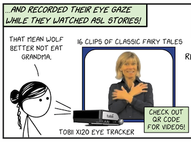

```{r eval=FALSE, include=FALSE}

# This block is to generated clean x-y coordinates for every timestamp, for each AOI 
get_xy_timestamp <- function(z){

x <- read_lines(z) %>%
  enframe(name = NULL) %>%
  rowid_to_column("ID")

# pull out timestamp rows
timestamps <- x %>%
  filter(str_detect(value, "timestamp")) %>%
  separate(value, into = c("throw","timestamp"), sep = " = ") %>%
  separate(timestamp, into = c("one","two","sec"), sep = ":") %>%
  select(sec) %>%
  mutate(sec = as.numeric(sec))

# Find AOI coordinate rows
xys <- x %>%
  mutate(find = str_detect(value, "X\tY"))

# first vertex (2 rows after each "XY" line)
xys_row <- which(xys$find) + 2

xy1 <- x %>%
  filter(ID %in% xys_row) %>%
  separate(value, into = c("x1","y1"), sep = "\t") %>%
  select(-ID)

# opposite vertex (2 more rows down)
xys_row <- xys_row + 2

xy2 <- x %>%
  filter(ID %in% xys_row) %>%
  separate(value, into = c("x2","y2"), sep = "\t") %>%
  select(-ID)

# Now get average XY position per timestamp
xys <- cbind(timestamps, xy1, xy2) %>%
  mutate_all(as.numeric) %>%
  rowwise() %>%
  mutate(x = mean(x1,x2),
         y = mean(y1, y2)) %>%
  select(sec, x, y)
}

# Process each and save to file
get_xy_timestamp("aoi_position/Cindy_bears_FW_Position of Right Hand.txt") %>%
  write_csv("aoi_position/aoi_bears_right_hand.csv")

get_xy_timestamp("aoi_position/Cindy_bears_FW_Position of Left Hand.txt") %>%
  write_csv("aoi_position/aoi_bears_left_hand.csv")

get_xy_timestamp("aoi_position/Cindy_bears_FW_Position of mouth small.txt") %>%
  write_csv("aoi_position/aoi_bears_mouth.csv")
```

# Intro

So we had a bunch of people watch a video of a person telling a story (Three Bears) in American Sign Language (ASL).  We recorded their eye gaze as (x,y) coordinate data. We also have the positions of the signer's right hand, left hand, and mouth throughout the video. We want to measure the relationship between the participant/watcher’s eye gaze, and the position of different elements in the video they are watching. In other words, do the position of the hands in the video "tug" on the watcher's eye gaze? E.g., if the signer's hands get really low near the hips, would the watcher shift their eye gaze downward? We're super curious if this behavior (if exists) is found more often in new signers than fluent signers.

Here's a diagram from [our ICSLA poster](https://twitter.com/foundinblank/status/1012331346558160896).



# Setting up 
Setting up the dataset. Here's our participants (this is just 1 out of 4 stories so it's not many, we'll fatten it up later).

```{r message=FALSE, warning=FALSE}
library(tidyverse)
library(openxlsx)
library(janitor)
library(skimr)
library(tsibble)
library(crqa)

# Get Three Bears data
rawdata <- read.xlsx("Test1_Cindy_bears_FW_Examine for Spatial Referencing.xlsx") %>%
  clean_names() %>%
  rename(x = gaze_point_x_mc_spx,
         y = gaze_point_y_mc_spx,
         language = language_value,
         name = participant_name,
         group = group_value)

# Pull clean names (and handle Laura2 for Laura (missing stories))
cleannames <- read_csv("partnames.csv") %>%
  distinct() %>%
  rename(name = participant) %>%
  filter(name != "Laura2")

# Pull final group assignments
cleangroups <- read_csv("finaldataset.csv") %>%
  select(participant, maingroup) %>%
  rename(name = participant) %>%
  distinct()

# Join both to rawdata
data <- rawdata %>%
  left_join(cleannames, by = "name") %>%
  select(-name) %>%
  rename(name = new_participant) %>%
  filter(!is.na(name)) %>%
  left_join(cleangroups, by = "name") %>%
  select(-group)

# Let's find out who was NOT included in Three Bears
excluded <- read_csv("finaldataset.csv") %>%
  select(participant, maingroup, story, direction, eye_exclude) %>%
  filter(story == "Goldilocks" & direction == "forward") %>%
  rename(name = participant) %>%
  select(name, eye_exclude)

data <- data %>% left_join(excluded, by = "name") %>%
  filter(!eye_exclude) %>%
  filter(!is.na(eye_exclude)) %>%
  select(-c(eye_exclude, recording_name)) %>%
  mutate_at(vars(language, maingroup, name), as.factor)

data %>% distinct(name, maingroup) %>% count(maingroup) %>% rename(participants = n)

#skim(data)
```

Let's graph each of our participants' eye gaze on the y dimension. 

```{r warning=FALSE}
data %>%
  ggplot(aes(x = gaze_point_index, y = y, color = maingroup, group = name)) + 
  geom_line() + 
  scale_y_reverse(limits = c(1080,0)) +
  theme_bw() +
  facet_wrap("name") +
  labs(title = "Participants' eye gaze along y-axis",
       x = "time")
```

# Smoothing

We're adding smoothing with a moving average window size - 5. (y_ma5). Good for removing noise. Then we'll eliminate 30 samples from the start and end (that's 0.25 seconds on both sides). 

> The data were then smoothed with a standard moving average noise reduction algorithm (window size = 5 samples) which acts as a low-pass filter that reduces the influence of microsaccades, blinks, and large data gaps (based on Yarbus, 1967). 

```{r}

min_gaze_point_index <- data %>% 
  group_by(maingroup) %>%
  summarise(max = max(gaze_point_index)) %>%
  ungroup() %>%
  summarise(min(max)) %>%
  pull()

bookend <- 30

data_ma <- data %>%
  as_tsibble(key = id(name), index = gaze_point_index) %>%
  group_by(maingroup, name) %>%
  mutate(y_ma5 = slide_dbl(y, ~ mean(., na.rm = T), .size = 5)) %>%
  mutate(y_ma5 = na_if(y_ma5, 'NaN')) %>%
  as_tibble() %>%
  ungroup() %>%
  filter(gaze_point_index > bookend & gaze_point_index < min_gaze_point_index - bookend)

# data_ma %>%
#   ggplot(aes(x = gaze_point_index, y = y_ma5, color = maingroup, group = name)) +
#   geom_line() + 
#   scale_y_reverse(limits = c(1200,0)) +
#   theme_bw() +
#   facet_wrap("name")
# 
# data_ma %>%
#   ggplot(aes(x = gaze_point_index, y = y_ma10, color = maingroup, group = name)) +
#   geom_line() + 
#   scale_y_reverse(limits = c(1200,0)) +
#   theme_bw() +
#   facet_wrap("name")

# data_ma %>%
#   filter(name == "Erin") %>%
#   ungroup() %>%
#   gather(key = "metric", value = "y_position", c(y, y_ma5)) %>%
#   ggplot(aes(x = gaze_point_index, y = y_position, color = metric)) +
#   geom_line() +
#   facet_wrap("metric", nrow = 3) +
#   scale_y_reverse(limits = c(1080,0)) +
#   ggtitle("Erin")


data_ma %>%
  filter(name == "Monica") %>%
  ungroup() %>%
  gather(key = "metric", value = "y_position", c(y, y_ma5)) %>%
  ggplot(aes(x = gaze_point_index, y = y_position, color = metric)) +
  geom_line(alpha = 0.5) +
  scale_y_reverse() +
  ggtitle("Monica - see effect of smoothing with MA = 5")
```

Also I'm curious about missing data points. This counts how many missing data points we have for each participant, at the three different measurements. Based on that, I probably should take out Lynnette, so much missing data there. We'll worry about that later. 

```{r}
data_ma %>%
  group_by(name, maingroup) %>%
  summarise_at(vars(y, y_ma5), list(~sum(is.na(.)))) %>%
  ungroup() %>%
  arrange(desc(y))

data_ma %>%
  group_by(maingroup) %>%
  summarise_at(vars(y, y_ma5), list(~sum(is.na(.)))) %>%
  ungroup() %>%
  arrange(desc(y))
```

# CRQA

## Visualizing Right Hand, Left Hand, Mouth. 

So we want to measure the relationship between the watcher's eye gaze (in this case, Monica), and the position of differnet elements in the sign language video they are watching. We're focused on three elements: the signer's left hand, right hand, and mouth. Would the watcher's eye gaze somehow be correlated with the position of the signer's hands as the hands move around in 2-D space? 

We're only focusing on y-axis measurements (up vs down, head vs torso). We don't see a lot of movement along the x-axis (left to right side). 

Let's visualize this first of all. 

```{r}
# Get rhand, lhand, mouth data 
rows_to_use <- data_ma %>% filter(name == "Monica") %>% nrow()

rhand <- read_csv("aoi_position/aoi_bears_right_hand.csv",
                  col_types = cols(sec = col_double(),
                                   x = col_double(),
                                   y = col_double()
                                   )) %>%
  mutate(sec = floor(sec*120)) %>%
  mutate(sec = sec + 1) %>%
  add_row(sec = rows_to_use) %>%
  fill(x, y)
rhand_expanded <- seq(1, max(rhand$sec)) %>%
  enframe(name = NULL, value = 'sec') %>%
  left_join(rhand, by = 'sec') %>%
  fill(x, y)

lhand <- read_csv("aoi_position/aoi_bears_left_hand.csv",
                  col_types = cols(sec = col_double(),
                                   x = col_double(),
                                   y = col_double()
                                   )) %>%
  mutate(sec = floor(sec*120)) %>%
  mutate(sec = sec + 1) %>%
  add_row(sec = rows_to_use) %>%
  fill(x, y)
lhand_expanded <- seq(1, max(lhand$sec)) %>%
  enframe(name = NULL, value = 'sec') %>%
  left_join(lhand, by = 'sec') %>%
  fill(x, y)

mouth <- read_csv("aoi_position/aoi_bears_mouth.csv",
                  col_types = cols(sec = col_double(),
                                   x = col_double(),
                                   y = col_double()
                                   )) %>%
  mutate(sec = floor(sec * 120)) %>%
  mutate(sec = sec + 1) %>%
  add_row(sec = rows_to_use) %>%
  fill(x, y)
mouth_expanded <- seq(1, max(mouth$sec)) %>%
  enframe(name = NULL, value = "sec") %>%
  left_join(mouth, by = "sec") %>%
  fill(x, y)

# Subset Monica's data and reset so gaze_point_index starts with 1
monica <- data_ma %>%
  filter(name == "Monica") %>%
  mutate(gaze_point_index = gaze_point_index - 30)

# Visualize
monica %>%
  ggplot(aes(x = gaze_point_index, y = y)) +
  scale_y_reverse(limits = c(1200,0), expand = c(0,0)) +
  geom_line(alpha = 1, color = "purple") +
  geom_step(data = rhand_expanded, aes(x = sec, y = y), color = "red", linetype = "longdash", alpha = 0.5) +
  annotate("text", label = "Right Hand", x = 3, y = 1000, color = "red", alpha = 0.5) +
  labs(title = "Monica's Eye Gaze vs. Signer's Right Hand") +
  theme_bw() +
  theme(panel.grid.minor.y = element_blank())

monica %>%
  ggplot(aes(x = gaze_point_index, y = y)) +
  scale_y_reverse(limits = c(1200,0), expand = c(0,0)) +
  geom_line(alpha = 1, color = "purple") +
  geom_step(data = lhand_expanded, aes(x = sec, y = y), color = "blue", linetype = "longdash", alpha = 0.5) +
  annotate("text", label = "Left Hand", x = 3, y = 1000, color = "blue", alpha = 0.5) +
  labs(title = "Monica's Eye Gaze vs. Signer's Left Hand") +
  theme_bw() +
  theme(panel.grid.minor.y = element_blank())

monica %>%
  ggplot(aes(x = gaze_point_index, y = y)) +
  scale_y_reverse(limits = c(1200,0), expand = c(0,0)) +
  geom_line(alpha = 1, color = "purple") +
  geom_step(data = mouth_expanded, aes(x = sec, y = y), color = "black", linetype = "longdash", alpha = 0.5) +
  annotate("text", label = "Mouth", x = 3, y = 300, color = "black", alpha = 0.5) +
  labs(title = "Monica's Eye Gaze vs. Signer's Mouth") +
  theme_bw() +
  theme(panel.grid.minor.y = element_blank())
```

Is it a problem, however, that the right-hand and left-hand y-position values are completely different from the eye gaze? It's like between 400 and 800, while eye gaze is between 300-400. WONDERING.

## CRQA Time: Monica vs. Right Hand

We'll do CRQA, using the parameters from [Wallot & Leonardi 2018](https://www.frontiersin.org/articles/10.3389/fpsyg.2018.02232/full). Two CRQAs: (1) normal, and (2) with both time-series shuffled. 

So we've got a RR of 46.59 above a random RR of 22.47. That's good, I think? "RR - repetition of elements across the two sequences." 

Regular DET is 99.68 over 40.05 (random). Again, think that's good? "DET - how many of the individual repetitions co-occur in connected trajectories."
```{r}

# Get vectors of Monica's and AOIs y-positions
monica_y <- monica %>% pull(y_ma5)
rhand_y <- rhand_expanded %>% pull(y)
lhand_y <- lhand_expanded %>% pull(y)
mouth_y <- mouth_expanded %>% pull(y)

# Compare Monica to RHand
results <- crqa(monica_y, rhand_y, delay = 9, embed = 3, rescale = 2, radius = 20, normalize = 2, mindiagline = 2, minvertline = 2, tw = 0, whiteline = FALSE, recpt = FALSE, side = 'both')

# Shuffle to get baseline measure of cross-recurrences
results_shuffled <- crqa(sample(monica_y), sample(rhand_y), delay = 9, embed = 3, rescale = 2, radius = 20, normalize = 2, mindiagline = 2, minvertline = 2, tw = 0, whiteline = FALSE, recpt = FALSE, side = 'both')

results_tbl <- as_tibble(results[1:9]) %>%
  bind_rows(as_tibble(results_shuffled[1:9])) %>%
  add_column(CRQA = c('regular', 'shuffled')) %>%
  select(CRQA, everything())

results_tbl %>%
  mutate_if(is.double, round, 2)
```

## CRQA for all participants

Okay, I'm running CRQA (using same parameters) for ALL participants, against right hand, left hand, and mouth, with regular vs. shuffled versions. So each participant gets 6 CRQAs. PURRRR to the rescue! 

Eye gaze data has missing values though, and CRQA doesn't like them. So umm, let's just, for now, do a fill-in where NAs takes the most recent valid value preceding it.

```{r}
# Functions for running CRQA on the right hand
crqa_rhand <- function(x){
  crqa(x, rhand_y, delay = 9, embed = 3, rescale = 2, radius = 20, normalize = 2, mindiagline = 2, minvertline = 2, tw = 0, whiteline = FALSE, recpt = FALSE, side = 'both')
}

crqa_rhand_shuffled <- function(x){
  crqa(sample(x), sample(rhand_y), delay = 9, embed = 3, rescale = 2, radius = 20, normalize = 2, mindiagline = 2, minvertline = 2, tw = 0, whiteline = FALSE, recpt = FALSE, side = 'both')
}

crqa_lhand <- function(x){
  crqa(x, lhand_y, delay = 9, embed = 3, rescale = 2, radius = 20, normalize = 2, mindiagline = 2, minvertline = 2, tw = 0, whiteline = FALSE, recpt = FALSE, side = 'both')
}

crqa_lhand_shuffled <- function(x){
  crqa(sample(x), sample(lhand_y), delay = 9, embed = 3, rescale = 2, radius = 20, normalize = 2, mindiagline = 2, minvertline = 2, tw = 0, whiteline = FALSE, recpt = FALSE, side = 'both')
}

crqa_mouth <- function(x){
  crqa(x, mouth_y, delay = 9, embed = 3, rescale = 2, radius = 20, normalize = 2, mindiagline = 2, minvertline = 2, tw = 0, whiteline = FALSE, recpt = FALSE, side = 'both')
}

crqa_mouth_shuffled <- function(x){
  crqa(sample(x), sample(mouth_y), delay = 9, embed = 3, rescale = 2, radius = 20, normalize = 2, mindiagline = 2, minvertline = 2, tw = 0, whiteline = FALSE, recpt = FALSE, side = 'both')
}


library(furrr)
plan(multiprocess)
crqa_data <- data_ma %>%
  fill(y_ma5) %>%
  group_by(name) %>%
  nest(y_ma5) %>%
  mutate(crqa_rhand = future_map(data, crqa_rhand),
         crqa_rhand_sh = future_map(data, crqa_rhand_shuffled),
         crqa_lhand = future_map(data, crqa_lhand),
         crqa_lhand_sh = future_map(data, crqa_lhand_shuffled),
         crqa_mouth = future_map(data, crqa_mouth),
         crqa_mouth_sh = future_map(data, crqa_mouth_shuffled))

crqa_results <- crqa_data %>%
  select(-data) %>%
  left_join(data, by = "name") %>%
  select(name, maingroup, crqa_rhand:crqa_mouth_sh) 
```

Not finished yet... 

```{r eval=FALSE, include=FALSE}

# I have to rewrite all this code, it worked before I started listing all CRQA results instead of just returning the RR value... 

crqa_results_group <- crqa_results %>%
  group_by(maingroup) %>%
  mutate(participants = n()) %>%
  group_by(maingroup, participants) %>%
  summarise_if(is.double, funs(mean))

crqa_results_group

crqa_results %>%
  ggplot(aes(x = maingroup, y = RR_rhand, fill = maingroup)) +
  geom_boxplot() +
  geom_jitter(width = 0.1, alpha = 0.5) +
  guides(fill = F) +
  labs(x = "",
       y = "Percent Recurrence (%REC)",
       title = "Recurrence with position of right hand")

crqa_results %>%
  ggplot(aes(x = maingroup, y = RR_mouth, fill = maingroup)) +
  geom_boxplot() +
  geom_jitter(width = 0.1, alpha = 0.5) +
  guides(fill = F) +
  labs(x = "",
       y = "Percent Recurrence (%REC)",
       title = "Recurrence with position of mouth")


# data_nested_results %>%
#   ggplot(aes(x = maingroup, y = diff)) +
#   geom_boxplot()
```


# DCRP

I tried this (Monica's eye gaze vs. right hand position), but with ws = 60 (60 samples per second, so the window size is one second on either side, right?). So it's telling me there's a probable lag around +30 (half a second). In which direction, not sure, and the REC looks so tiny...  

```{r}
dcrp <- drpdfromts(monica_y, rhand_y, ws = 60, datatype = 'continuous', radius = 0.5)
plot(-60:60, dcrp$profile, type = 'l', xlab = "Lag", ylab = "%Rec")
```

