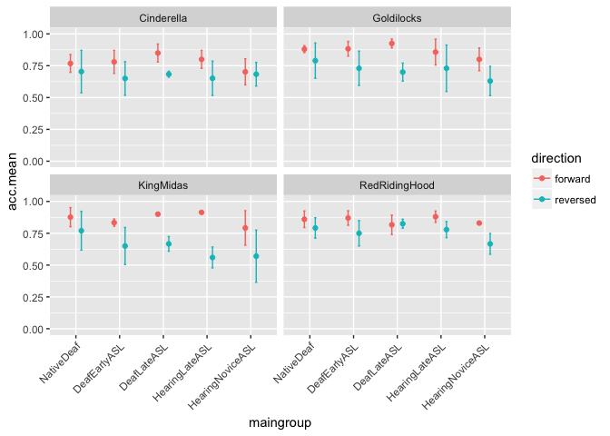
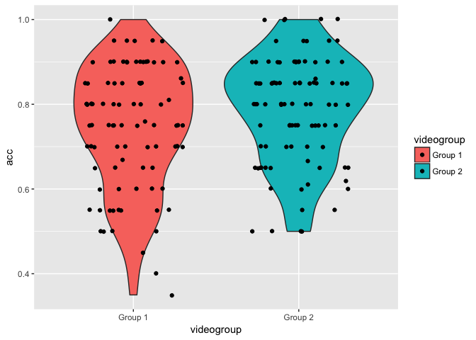
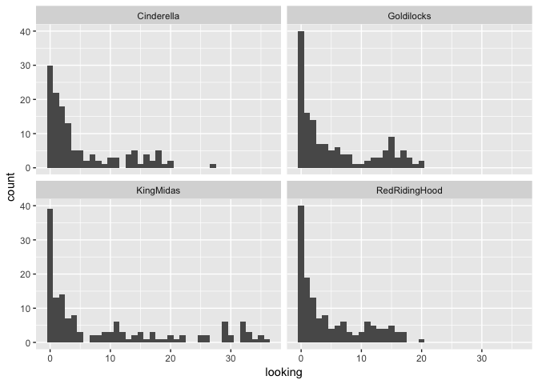
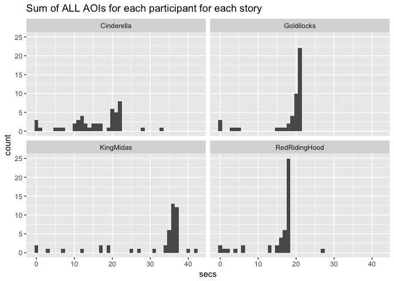

Study 1 Adult Data Analysis
================
Adam Stone, PhD
09-04-2017

-   [Importing and Reshaping Data](#importing-and-reshaping-data)
-   [Participant Demographics](#participant-demographics)
-   [Accuracy Data Analysis](#accuracy-data-analysis)
-   [Eye Gaze Data](#eye-gaze-data)
    -   [Face AOIs (for Rain to look at)](#face-aois-for-rain-to-look-at)

Importing and Reshaping Data
============================

Here we're going to import the data, remove dropped participants, and reshape the data so story and direction are grouping variables (and the dataset will be more tall than wide). Let's see ALL of our data first (scroll horizontally).

    ## # A tibble: 52 x 54
    ##       id hearing videogroup aoagroup languagegroup    maingroup selfrate
    ##    <int>   <chr>      <chr>    <chr>         <chr>        <chr>    <dbl>
    ##  1     1    Deaf    Group 1    Early      EarlyASL DeafEarlyASL        5
    ##  2     2    Deaf    Group 1    Early      EarlyASL DeafEarlyASL        5
    ##  3     3    Deaf    Group 2    Early      EarlyASL DeafEarlyASL        5
    ##  4     4    Deaf    Group 2    Early      EarlyASL DeafEarlyASL        5
    ##  5     5    Deaf    Group 1    Early      EarlyASL DeafEarlyASL        5
    ##  6     6    Deaf    Group 1    Early      EarlyASL DeafEarlyASL        5
    ##  7     7    Deaf    Group 1    Early      EarlyASL DeafEarlyASL        5
    ##  8     8    Deaf    Group 2    Early      EarlyASL DeafEarlyASL        5
    ##  9     9    Deaf    Group 2    Early       LateASL  DeafLateASL        5
    ## 10    10    Deaf    Group 1    Early       LateASL  DeafLateASL        5
    ## # ... with 42 more rows, and 47 more variables: age <dbl>, signyrs <dbl>,
    ## #   aoasl <int>, acc.fw1 <dbl>, acc.rv2 <dbl>, acc.fw3 <dbl>,
    ## #   acc.rv4 <dbl>, forehead.fw1 <dbl>, forehead.fw3 <dbl>,
    ## #   forehead.rv2 <dbl>, forehead.rv4 <dbl>, eyes.fw1 <dbl>,
    ## #   eyes.fw3 <dbl>, eyes.rv2 <dbl>, eyes.rv4 <dbl>, mouth.fw1 <dbl>,
    ## #   mouth.fw3 <dbl>, mouth.rv2 <dbl>, mouth.rv4 <dbl>, chin.fw1 <dbl>,
    ## #   chin.fw3 <dbl>, chin.rv2 <dbl>, chin.rv4 <dbl>, upperchest.fw1 <dbl>,
    ## #   upperchest.fw3 <dbl>, upperchest.rv2 <dbl>, upperchest.rv4 <dbl>,
    ## #   midchest.fw1 <dbl>, midchest.fw3 <dbl>, midchest.rv2 <dbl>,
    ## #   midchest.rv4 <dbl>, lowerchest.fw1 <dbl>, lowerchest.fw3 <dbl>,
    ## #   lowerchest.rv2 <dbl>, lowerchest.rv4 <dbl>, belly.fw1 <dbl>,
    ## #   belly.fw3 <dbl>, belly.rv2 <dbl>, belly.rv4 <dbl>, left.fw1 <dbl>,
    ## #   left.fw3 <dbl>, left.rv2 <dbl>, left.rv4 <dbl>, right.fw1 <dbl>,
    ## #   right.fw3 <dbl>, right.rv2 <dbl>, right.rv4 <dbl>

Remove dropped participants (they have no main group name, or no data). These are who we dropped.

``` r
dropped <- filter(data, is.na(maingroup)==TRUE)
manual <- filter(data,participant=="Lucinda" | participant=="Joe")
dropped <- rbind(dropped,manual) %>% arrange(id)
data <- data %>%
  filter(is.na(maingroup)==FALSE) %>% 
  filter(participant!="Lucinda" & participant!="Joe")
#kable(select(dropped,participant,maingroup,age)) %>% kable_styling(bootstrap_options = c("striped", "hover","condensed"), full_width = F, position = "left")
select(data,-participant)
```

    ## # A tibble: 47 x 54
    ##       id hearing videogroup aoagroup languagegroup    maingroup selfrate
    ##    <int>   <chr>      <chr>    <chr>         <chr>        <chr>    <dbl>
    ##  1     1    Deaf    Group 1    Early      EarlyASL DeafEarlyASL        5
    ##  2     2    Deaf    Group 1    Early      EarlyASL DeafEarlyASL        5
    ##  3     3    Deaf    Group 2    Early      EarlyASL DeafEarlyASL        5
    ##  4     4    Deaf    Group 2    Early      EarlyASL DeafEarlyASL        5
    ##  5     5    Deaf    Group 1    Early      EarlyASL DeafEarlyASL        5
    ##  6     6    Deaf    Group 1    Early      EarlyASL DeafEarlyASL        5
    ##  7     7    Deaf    Group 1    Early      EarlyASL DeafEarlyASL        5
    ##  8     8    Deaf    Group 2    Early      EarlyASL DeafEarlyASL        5
    ##  9     9    Deaf    Group 2    Early       LateASL  DeafLateASL        5
    ## 10    10    Deaf    Group 1    Early       LateASL  DeafLateASL        5
    ## # ... with 37 more rows, and 47 more variables: age <dbl>, signyrs <dbl>,
    ## #   aoasl <int>, acc.fw1 <dbl>, acc.rv2 <dbl>, acc.fw3 <dbl>,
    ## #   acc.rv4 <dbl>, forehead.fw1 <dbl>, forehead.fw3 <dbl>,
    ## #   forehead.rv2 <dbl>, forehead.rv4 <dbl>, eyes.fw1 <dbl>,
    ## #   eyes.fw3 <dbl>, eyes.rv2 <dbl>, eyes.rv4 <dbl>, mouth.fw1 <dbl>,
    ## #   mouth.fw3 <dbl>, mouth.rv2 <dbl>, mouth.rv4 <dbl>, chin.fw1 <dbl>,
    ## #   chin.fw3 <dbl>, chin.rv2 <dbl>, chin.rv4 <dbl>, upperchest.fw1 <dbl>,
    ## #   upperchest.fw3 <dbl>, upperchest.rv2 <dbl>, upperchest.rv4 <dbl>,
    ## #   midchest.fw1 <dbl>, midchest.fw3 <dbl>, midchest.rv2 <dbl>,
    ## #   midchest.rv4 <dbl>, lowerchest.fw1 <dbl>, lowerchest.fw3 <dbl>,
    ## #   lowerchest.rv2 <dbl>, lowerchest.rv4 <dbl>, belly.fw1 <dbl>,
    ## #   belly.fw3 <dbl>, belly.rv2 <dbl>, belly.rv4 <dbl>, left.fw1 <dbl>,
    ## #   left.fw3 <dbl>, left.rv2 <dbl>, left.rv4 <dbl>, right.fw1 <dbl>,
    ## #   right.fw3 <dbl>, right.rv2 <dbl>, right.rv4 <dbl>

Now we'll reshape the data. Based on Rain's UNM talk, this is what Group 1 & 2 saw: **Note, I've switched the groups around from Rain's UNM talk**

| No. | Group1              | Group2              |
|:----|:--------------------|:--------------------|
| 1   | Goldilocks Fwd      | Red Riding Hood Fwd |
| 2   | Cinderella Rev      | King Midas Rev      |
| 3   | King Midas Fwd      | Cinderella Fwd      |
| 4   | Red Riding Hood Rev | Goldilocks Rev      |

Let's add that information to our data when we reshape it. You can look at the code below if you want.

``` r
# I tried writing a function to do this using column names as arguments. 
# But after hours of googling I couldn't figure it out! So just copying/pasting code here.
data.acc <- data %>%
  select(id,acc.fw1:acc.rv4) %>%
  gather(video,acc,acc.fw1:acc.rv4, factor_key=TRUE) %>%
  mutate(video = str_sub(video,-3,-1))
data.forehead <- data %>%
  select(id,forehead.fw1:forehead.rv4) %>%
  gather(video,forehead,forehead.fw1:forehead.rv4) %>%
  mutate(video = str_sub(video,-3,-1))
data.eyes <- data %>%
  select(id,eyes.fw1:eyes.rv4) %>%
  gather(video,eyes,eyes.fw1:eyes.rv4) %>%
  mutate(video = str_sub(video,-3,-1))
data.mouth <- data %>%
  select(id,mouth.fw1:mouth.rv4) %>%
  gather(video,mouth,mouth.fw1:mouth.rv4) %>%
  mutate(video = str_sub(video,-3,-1))
data.chin <- data %>%
  select(id,chin.fw1:chin.rv4) %>%
  gather(video,chin,chin.fw1:chin.rv4) %>%
  mutate(video = str_sub(video,-3,-1))
data.upperchest <- data %>%
  select(id,upperchest.fw1:upperchest.rv4) %>%
  gather(video,upperchest,upperchest.fw1:upperchest.rv4) %>%
  mutate(video = str_sub(video,-3,-1))
data.midchest <- data %>%
  select(id,midchest.fw1:midchest.rv4) %>%
  gather(video,midchest,midchest.fw1:midchest.rv4) %>%
  mutate(video = str_sub(video,-3,-1))
data.lowerchest <- data %>%
  select(id,lowerchest.fw1:lowerchest.rv4) %>%
  gather(video,lowerchest,lowerchest.fw1:lowerchest.rv4) %>%
  mutate(video = str_sub(video,-3,-1))
data.belly <- data %>%
  select(id,belly.fw1:belly.rv4) %>%
  gather(video,belly,belly.fw1:belly.rv4) %>%
  mutate(video = str_sub(video,-3,-1))
data.left <- data %>%
  select(id,left.fw1:left.rv4) %>%
  gather(video,left,left.fw1:left.rv4) %>%
  mutate(video = str_sub(video,-3,-1))
data.right <- data %>%
  select(id,right.fw1:right.rv4) %>%
  gather(video,right,right.fw1:right.rv4) %>%
  mutate(video = str_sub(video,-3,-1))
data.header <- data[1:11]

# Join them all back together. inner_join is smart, it'll join by id AND video.
newdata <- data.header %>%
  inner_join(data.acc,by="id") %>%
  inner_join(data.forehead) %>%
  inner_join(data.eyes) %>%
  inner_join(data.mouth) %>%
  inner_join(data.chin) %>%
  inner_join(data.upperchest) %>%
  inner_join(data.midchest) %>%
  inner_join(data.lowerchest) %>%
  inner_join(data.belly) %>%
  inner_join(data.left) %>%
  inner_join(data.right)

# Let's change the names
oldata <- data
data <- newdata

# Add story and direction variables and split data into videogroups
data$story <- NA
data$direction <- NA
group1 <- filter(data,videogroup=="Group 1")
group2 <- filter(data,videogroup=="Group 2")

# Now define levels for story and direction based on that table above
group1 <- mutate(group1,story = ifelse(video == "fw1","Goldilocks",
                                       ifelse(video == "rv2","Cinderella",
                                            ifelse(video=="fw3","KingMidas","RedRidingHood"))))
group1 <- mutate(group1,direction = ifelse(video == "fw1","forward",
                                           ifelse(video == "rv2","reversed",
                                                  ifelse(video == "fw3","forward","reversed"))))
group2 <- mutate(group2,story = ifelse(video == "fw1","RedRidingHood",
                                       ifelse(video == "rv2","KingMidas",
                                              ifelse(video =="fw3","Cinderella","Goldilocks"))))
group2 <- mutate(group2,direction = ifelse(video == "fw1","forward",
                                       ifelse(video == "rv2","reversed",
                                              ifelse(video == "fw3","forward","reversed"))))


# Join groups back together and view
data <- rbind(group1,group2)
data <- arrange(data,id,video)

# Convert some columns to factors
data <- data %>%
  mutate(hearing = as.factor(hearing)) %>%
  mutate(videogroup = as.factor(videogroup)) %>%
  mutate(aoagroup = as.factor(aoagroup)) %>%
  mutate(languagegroup = as.factor(languagegroup)) %>%
  mutate(maingroup = as.factor(maingroup)) %>%
  mutate(video = as.factor(video)) %>%
  mutate(story = as.factor(story)) %>%
  mutate(direction = as.factor(direction)) %>%
  select(id,participant,hearing,videogroup,aoagroup,languagegroup,maingroup,video,story,
         direction,age,selfrate,signyrs,aoasl,acc,forehead,eyes,mouth,chin,upperchest,
         midchest,lowerchest,belly,left,right)
```

Here's the final, "cleaned-up" dataset that we're going to use for all further analysis. Just the first 10 rows. Notice that there are now story and direction columns, and AOI-only columns, and each participant has 4 observation rows (one observation per story). So, more rows, less columns.

``` r
#kable(head(data, n=10)) %>% kable_styling(bootstrap_options = c("striped", "hover", "condensed"))
select(data,-participant)
```

    ## # A tibble: 188 x 24
    ##       id hearing videogroup aoagroup languagegroup    maingroup  video
    ##    <int>  <fctr>     <fctr>   <fctr>        <fctr>       <fctr> <fctr>
    ##  1     1    Deaf    Group 1    Early      EarlyASL DeafEarlyASL    fw1
    ##  2     1    Deaf    Group 1    Early      EarlyASL DeafEarlyASL    fw3
    ##  3     1    Deaf    Group 1    Early      EarlyASL DeafEarlyASL    rv2
    ##  4     1    Deaf    Group 1    Early      EarlyASL DeafEarlyASL    rv4
    ##  5     2    Deaf    Group 1    Early      EarlyASL DeafEarlyASL    fw1
    ##  6     2    Deaf    Group 1    Early      EarlyASL DeafEarlyASL    fw3
    ##  7     2    Deaf    Group 1    Early      EarlyASL DeafEarlyASL    rv2
    ##  8     2    Deaf    Group 1    Early      EarlyASL DeafEarlyASL    rv4
    ##  9     3    Deaf    Group 2    Early      EarlyASL DeafEarlyASL    fw1
    ## 10     3    Deaf    Group 2    Early      EarlyASL DeafEarlyASL    fw3
    ## # ... with 178 more rows, and 17 more variables: story <fctr>,
    ## #   direction <fctr>, age <dbl>, selfrate <dbl>, signyrs <dbl>,
    ## #   aoasl <int>, acc <dbl>, forehead <dbl>, eyes <dbl>, mouth <dbl>,
    ## #   chin <dbl>, upperchest <dbl>, midchest <dbl>, lowerchest <dbl>,
    ## #   belly <dbl>, left <dbl>, right <dbl>

Participant Demographics
========================

Now we can easily get group means.

``` r
groupmeans <- data %>%
  group_by(maingroup) %>%
  summarize(n = n()/4,
            age = mean(age),
            selfrate = mean(selfrate),
            signyrs = mean(signyrs),
            aoasl = mean(aoasl))
kable(groupmeans, digits=1) %>% kable_styling(bootstrap_options = c("striped", "hover", "condensed"))
```

<table class="table table-striped table-hover table-condensed" style="margin-left: auto; margin-right: auto;">
<thead>
<tr>
<th style="text-align:left;">
maingroup
</th>
<th style="text-align:right;">
n
</th>
<th style="text-align:right;">
age
</th>
<th style="text-align:right;">
selfrate
</th>
<th style="text-align:right;">
signyrs
</th>
<th style="text-align:right;">
aoasl
</th>
</tr>
</thead>
<tbody>
<tr>
<td style="text-align:left;">
DeafEarlyASL
</td>
<td style="text-align:right;">
8
</td>
<td style="text-align:right;">
35.4
</td>
<td style="text-align:right;">
5.0
</td>
<td style="text-align:right;">
29.8
</td>
<td style="text-align:right;">
5.6
</td>
</tr>
<tr>
<td style="text-align:left;">
DeafLateASL
</td>
<td style="text-align:right;">
5
</td>
<td style="text-align:right;">
35.8
</td>
<td style="text-align:right;">
5.0
</td>
<td style="text-align:right;">
22.6
</td>
<td style="text-align:right;">
12.4
</td>
</tr>
<tr>
<td style="text-align:left;">
HearingLateASL
</td>
<td style="text-align:right;">
12
</td>
<td style="text-align:right;">
28.9
</td>
<td style="text-align:right;">
4.6
</td>
<td style="text-align:right;">
11.8
</td>
<td style="text-align:right;">
17.2
</td>
</tr>
<tr>
<td style="text-align:left;">
HearingNoviceASL
</td>
<td style="text-align:right;">
11
</td>
<td style="text-align:right;">
20.2
</td>
<td style="text-align:right;">
3.0
</td>
<td style="text-align:right;">
2.4
</td>
<td style="text-align:right;">
17.6
</td>
</tr>
<tr>
<td style="text-align:left;">
NativeDeaf
</td>
<td style="text-align:right;">
11
</td>
<td style="text-align:right;">
32.9
</td>
<td style="text-align:right;">
5.0
</td>
<td style="text-align:right;">
32.5
</td>
<td style="text-align:right;">
0.3
</td>
</tr>
</tbody>
</table>
``` r
#groupmeans
```

Accuracy Data Analysis
======================

And accuracy violins and error bar charts for forward vs. backward stories.

``` r
# Summarizing means and SDs
accdata <- data %>%
  group_by(maingroup,direction) %>%
  summarize(acc.mean = mean(acc, na.rm=TRUE),
            acc.sd = sd(acc, na.rm=TRUE))

#Boxplot
ggplot(data,aes(maingroup,acc,fill=direction)) + 
  geom_violin() +
  scale_y_continuous(limits=c(0,1)) +
  theme(axis.text.x=element_text(angle=45,hjust=1))
```

    ## Warning: Removed 4 rows containing non-finite values (stat_ydensity).


``` r
# Error bar chart
ggplot(accdata,aes(maingroup,acc.mean,color=direction)) + 
  geom_point(position=position_dodge(0.5)) +
  geom_errorbar(aes(ymin=acc.mean-acc.sd,ymax=acc.mean+acc.sd),width=0.1,position=position_dodge(0.5)) +
  scale_y_continuous(limits=c(0,1)) +
  theme(axis.text.x=element_text(angle=45,hjust=1))
```


Let's test for statistical significance. A simple ANOVA tell us there is a main effect of group and direction, but no interactions.

``` r
# Let's set Native Deaf as the reference level to compare all other
data$maingroup <- relevel(data$maingroup, ref="NativeDeaf")
# Run the ANOVA
acc.anova <- aov(data=data,acc ~ maingroup*direction)
kable(tidy(acc.anova), digits=3) %>% kable_styling(bootstrap_options = c("striped", "hover", "condensed"))
```

<table class="table table-striped table-hover table-condensed" style="margin-left: auto; margin-right: auto;">
<thead>
<tr>
<th style="text-align:left;">
term
</th>
<th style="text-align:right;">
df
</th>
<th style="text-align:right;">
sumsq
</th>
<th style="text-align:right;">
meansq
</th>
<th style="text-align:right;">
statistic
</th>
<th style="text-align:right;">
p.value
</th>
</tr>
</thead>
<tbody>
<tr>
<td style="text-align:left;">
maingroup
</td>
<td style="text-align:right;">
4
</td>
<td style="text-align:right;">
0.214
</td>
<td style="text-align:right;">
0.053
</td>
<td style="text-align:right;">
4.202
</td>
<td style="text-align:right;">
0.003
</td>
</tr>
<tr>
<td style="text-align:left;">
direction
</td>
<td style="text-align:right;">
1
</td>
<td style="text-align:right;">
0.899
</td>
<td style="text-align:right;">
0.899
</td>
<td style="text-align:right;">
70.656
</td>
<td style="text-align:right;">
0.000
</td>
</tr>
<tr>
<td style="text-align:left;">
maingroup:direction
</td>
<td style="text-align:right;">
4
</td>
<td style="text-align:right;">
0.056
</td>
<td style="text-align:right;">
0.014
</td>
<td style="text-align:right;">
1.097
</td>
<td style="text-align:right;">
0.360
</td>
</tr>
<tr>
<td style="text-align:left;">
Residuals
</td>
<td style="text-align:right;">
174
</td>
<td style="text-align:right;">
2.215
</td>
<td style="text-align:right;">
0.013
</td>
<td style="text-align:right;">
NA
</td>
<td style="text-align:right;">
NA
</td>
</tr>
</tbody>
</table>
Tukey's HSD posthoc tells us that Hearing Novice ASL is significantly different from Deaf Native.

``` r
# Run the posthoc on main group
acc.posthoc <- TukeyHSD(acc.anova,'maingroup',conf.level = 0.95) 
kable(tidy(acc.posthoc), digits=3) %>% kable_styling(bootstrap_options = c("striped", "hover", "condensed"))
```

<table class="table table-striped table-hover table-condensed" style="margin-left: auto; margin-right: auto;">
<thead>
<tr>
<th style="text-align:left;">
term
</th>
<th style="text-align:left;">
comparison
</th>
<th style="text-align:right;">
estimate
</th>
<th style="text-align:right;">
conf.low
</th>
<th style="text-align:right;">
conf.high
</th>
<th style="text-align:right;">
adj.p.value
</th>
</tr>
</thead>
<tbody>
<tr>
<td style="text-align:left;">
maingroup
</td>
<td style="text-align:left;">
DeafEarlyASL-NativeDeaf
</td>
<td style="text-align:right;">
-0.041
</td>
<td style="text-align:right;">
-0.114
</td>
<td style="text-align:right;">
0.032
</td>
<td style="text-align:right;">
0.537
</td>
</tr>
<tr>
<td style="text-align:left;">
maingroup
</td>
<td style="text-align:left;">
DeafLateASL-NativeDeaf
</td>
<td style="text-align:right;">
-0.017
</td>
<td style="text-align:right;">
-0.104
</td>
<td style="text-align:right;">
0.071
</td>
<td style="text-align:right;">
0.985
</td>
</tr>
<tr>
<td style="text-align:left;">
maingroup
</td>
<td style="text-align:left;">
HearingLateASL-NativeDeaf
</td>
<td style="text-align:right;">
-0.030
</td>
<td style="text-align:right;">
-0.096
</td>
<td style="text-align:right;">
0.036
</td>
<td style="text-align:right;">
0.712
</td>
</tr>
<tr>
<td style="text-align:left;">
maingroup
</td>
<td style="text-align:left;">
HearingNoviceASL-NativeDeaf
</td>
<td style="text-align:right;">
-0.095
</td>
<td style="text-align:right;">
-0.162
</td>
<td style="text-align:right;">
-0.028
</td>
<td style="text-align:right;">
0.001
</td>
</tr>
<tr>
<td style="text-align:left;">
maingroup
</td>
<td style="text-align:left;">
DeafLateASL-DeafEarlyASL
</td>
<td style="text-align:right;">
0.024
</td>
<td style="text-align:right;">
-0.067
</td>
<td style="text-align:right;">
0.116
</td>
<td style="text-align:right;">
0.950
</td>
</tr>
<tr>
<td style="text-align:left;">
maingroup
</td>
<td style="text-align:left;">
HearingLateASL-DeafEarlyASL
</td>
<td style="text-align:right;">
0.011
</td>
<td style="text-align:right;">
-0.060
</td>
<td style="text-align:right;">
0.082
</td>
<td style="text-align:right;">
0.994
</td>
</tr>
<tr>
<td style="text-align:left;">
maingroup
</td>
<td style="text-align:left;">
HearingNoviceASL-DeafEarlyASL
</td>
<td style="text-align:right;">
-0.054
</td>
<td style="text-align:right;">
-0.126
</td>
<td style="text-align:right;">
0.018
</td>
<td style="text-align:right;">
0.242
</td>
</tr>
<tr>
<td style="text-align:left;">
maingroup
</td>
<td style="text-align:left;">
HearingLateASL-DeafLateASL
</td>
<td style="text-align:right;">
-0.014
</td>
<td style="text-align:right;">
-0.100
</td>
<td style="text-align:right;">
0.072
</td>
<td style="text-align:right;">
0.992
</td>
</tr>
<tr>
<td style="text-align:left;">
maingroup
</td>
<td style="text-align:left;">
HearingNoviceASL-DeafLateASL
</td>
<td style="text-align:right;">
-0.078
</td>
<td style="text-align:right;">
-0.165
</td>
<td style="text-align:right;">
0.009
</td>
<td style="text-align:right;">
0.100
</td>
</tr>
<tr>
<td style="text-align:left;">
maingroup
</td>
<td style="text-align:left;">
HearingNoviceASL-HearingLateASL
</td>
<td style="text-align:right;">
-0.065
</td>
<td style="text-align:right;">
-0.130
</td>
<td style="text-align:right;">
0.000
</td>
<td style="text-align:right;">
0.051
</td>
</tr>
</tbody>
</table>
Group coefficients are here. Remember our reference level ("control") is Native Deaf. Their forward accuracy is 85% with a reversal effect of -9%. ASL, Forward. Mean accuracy for that is 84%, and its reversal effect is -14%. All the other values are to be added to these coefficients. Hearing Novice ASL's forward accuracy was 78%, with a reversal effect of -6%!

``` r
#Coefficients
kable(tidy(acc.anova$coefficients), digits=3) %>% kable_styling(bootstrap_options = c("striped", "hover", "condensed"))
```

<table class="table table-striped table-hover table-condensed" style="margin-left: auto; margin-right: auto;">
<thead>
<tr>
<th style="text-align:left;">
names
</th>
<th style="text-align:right;">
x
</th>
</tr>
</thead>
<tbody>
<tr>
<td style="text-align:left;">
(Intercept)
</td>
<td style="text-align:right;">
0.848
</td>
</tr>
<tr>
<td style="text-align:left;">
maingroupDeafEarlyASL
</td>
<td style="text-align:right;">
-0.010
</td>
</tr>
<tr>
<td style="text-align:left;">
maingroupDeafLateASL
</td>
<td style="text-align:right;">
0.019
</td>
</tr>
<tr>
<td style="text-align:left;">
maingroupHearingLateASL
</td>
<td style="text-align:right;">
0.019
</td>
</tr>
<tr>
<td style="text-align:left;">
maingroupHearingNoviceASL
</td>
<td style="text-align:right;">
-0.065
</td>
</tr>
<tr>
<td style="text-align:left;">
directionreversed
</td>
<td style="text-align:right;">
-0.082
</td>
</tr>
<tr>
<td style="text-align:left;">
maingroupDeafEarlyASL:directionreversed
</td>
<td style="text-align:right;">
-0.061
</td>
</tr>
<tr>
<td style="text-align:left;">
maingroupDeafLateASL:directionreversed
</td>
<td style="text-align:right;">
-0.071
</td>
</tr>
<tr>
<td style="text-align:left;">
maingroupHearingLateASL:directionreversed
</td>
<td style="text-align:right;">
-0.098
</td>
</tr>
<tr>
<td style="text-align:left;">
maingroupHearingNoviceASL:directionreversed
</td>
<td style="text-align:right;">
-0.059
</td>
</tr>
</tbody>
</table>
In summary, ANOVA tells us there are main effects of group and direction, no interactions. All of which is a good thing. But I'm curious if there's any item-level effects we should be watching out for. Because there are 4 different stories. Let's plot those out.

``` r
# Run summary stats grouped by story, too
accdata2 <- data %>%
  group_by(maingroup,story,direction) %>%
  summarize(acc.mean = mean(acc, na.rm=TRUE),
            acc.sd = sd(acc, na.rm=TRUE))
# Boxplot
# ggplot(data,aes(maingroup,acc,fill=direction)) + 
#   geom_boxplot() +
#   scale_y_continuous(limits=c(0,1)) +
#   facet_wrap("story")

# Error bar chart
ggplot(accdata2,aes(maingroup,acc.mean,color=direction)) + 
  geom_point(position=position_dodge(0.5)) +
  geom_errorbar(aes(ymin=acc.mean-acc.sd,ymax=acc.mean+acc.sd),width=0.1,position=position_dodge(0.5)) +
  scale_y_continuous(limits=c(0,1)) +
  facet_wrap("story") + 
  theme(axis.text.x=element_text(angle=45,hjust=1))
```

    ## Warning: Removed 3 rows containing missing values (geom_errorbar).



Boy! Seems King Midas had a strong reversal effect, while Red Riding Hood had a weak reversal effect. Maybe we should put those in as random effects variables in a mixed model, along with participants too. With mixed models, you define predictor variables (what we're interested in; aka, fixed effects) and grouping (what we're not interested in, aka, random effects). This is overkill for simple accuracy data but this will help set us up for eye tracking analysis and **importantly reviewers may ask us about item-level effects given we have just 4 stories.**

So here, we have fixed effects of group and direction, and random effects of story and id, with varying slopes for direction.

The output tells us now that Hearing Novice ASL is significantly different from Deaf Native ASL, that we still have a main effect of direction, with a significant interaction of direction and Hearing Late ASL. We probably don't need all this in the paper, though, the ANOVA will do and accuracy is not our main point.

``` r
acc.lm <- lmer(data=data, acc ~ maingroup*direction + (direction|id) + (1|story))
summary(acc.lm)
```

    ## Linear mixed model fit by REML t-tests use Satterthwaite approximations
    ##   to degrees of freedom [lmerMod]
    ## Formula: acc ~ maingroup * direction + (direction | id) + (1 | story)
    ##    Data: data
    ## 
    ## REML criterion at convergence: -263.9
    ## 
    ## Scaled residuals: 
    ##      Min       1Q   Median       3Q      Max 
    ## -2.09133 -0.59555  0.04032  0.59360  2.30454 
    ## 
    ## Random effects:
    ##  Groups   Name              Variance Std.Dev. Corr
    ##  id       (Intercept)       0.002124 0.04609      
    ##           directionreversed 0.004103 0.06405  0.10
    ##  story    (Intercept)       0.001209 0.03477      
    ##  Residual                   0.007603 0.08719      
    ## Number of obs: 184, groups:  id, 47; story, 4
    ## 
    ## Fixed effects:
    ##                                              Estimate Std. Error        df
    ## (Intercept)                                  0.848275   0.029336 15.850000
    ## maingroupDeafEarlyASL                       -0.009193   0.036101 40.230000
    ## maingroupDeafLateASL                         0.013256   0.042936 42.850000
    ## maingroupHearingLateASL                      0.017338   0.032445 40.320000
    ## maingroupHearingNoviceASL                   -0.066577   0.033120 40.240000
    ## directionreversed                           -0.084140   0.033221 42.500000
    ## maingroupDeafEarlyASL:directionreversed     -0.062773   0.050839 41.490000
    ## maingroupDeafLateASL:directionreversed      -0.064972   0.060418 44.250000
    ## maingroupHearingLateASL:directionreversed   -0.094585   0.045618 41.690000
    ## maingroupHearingNoviceASL:directionreversed -0.056074   0.046556 41.600000
    ##                                             t value Pr(>|t|)    
    ## (Intercept)                                  28.916 3.77e-15 ***
    ## maingroupDeafEarlyASL                        -0.255   0.8003    
    ## maingroupDeafLateASL                          0.309   0.7590    
    ## maingroupHearingLateASL                       0.534   0.5960    
    ## maingroupHearingNoviceASL                    -2.010   0.0512 .  
    ## directionreversed                            -2.533   0.0151 *  
    ## maingroupDeafEarlyASL:directionreversed      -1.235   0.2239    
    ## maingroupDeafLateASL:directionreversed       -1.075   0.2880    
    ## maingroupHearingLateASL:directionreversed    -2.073   0.0443 *  
    ## maingroupHearingNoviceASL:directionreversed  -1.204   0.2352    
    ## ---
    ## Signif. codes:  0 '***' 0.001 '**' 0.01 '*' 0.05 '.' 0.1 ' ' 1
    ## 
    ## Correlation of Fixed Effects:
    ##             (Intr) mnDEASL mnDLASL mnHLASL mnHNASL drctnr mDEASL: mDLASL:
    ## mngrpDfEASL -0.528                                                       
    ## mngrpDfLASL -0.443  0.362                                                
    ## mngrpHrLASL -0.586  0.475   0.400                                        
    ## mngrpHrNASL -0.574  0.466   0.392   0.520                                
    ## dirctnrvrsd -0.345  0.281   0.236   0.311   0.305                        
    ## mngrpDEASL:  0.226 -0.426  -0.156  -0.201  -0.199  -0.655                
    ## mngrpDLASL:  0.190 -0.157  -0.435  -0.170  -0.168  -0.551  0.363         
    ## mngrpHLASL:  0.250 -0.202  -0.171  -0.425  -0.222  -0.727  0.473   0.399 
    ## mngrpHNASL:  0.246 -0.199  -0.168  -0.223  -0.424  -0.713  0.465   0.392 
    ##             mHLASL:
    ## mngrpDfEASL        
    ## mngrpDfLASL        
    ## mngrpHrLASL        
    ## mngrpHrNASL        
    ## dirctnrvrsd        
    ## mngrpDEASL:        
    ## mngrpDLASL:        
    ## mngrpHLASL:        
    ## mngrpHNASL:  0.520

Here are the coefficients in a nicer format.

``` r
kable(xtable(coef(summary(acc.lm))), digits=3) %>% kable_styling(bootstrap_options = c("striped", "hover", "condensed"))
```

<table class="table table-striped table-hover table-condensed" style="margin-left: auto; margin-right: auto;">
<thead>
<tr>
<th style="text-align:left;">
</th>
<th style="text-align:right;">
Estimate
</th>
<th style="text-align:right;">
Std. Error
</th>
<th style="text-align:right;">
df
</th>
<th style="text-align:right;">
t value
</th>
<th style="text-align:right;">
Pr(&gt;|t|)
</th>
</tr>
</thead>
<tbody>
<tr>
<td style="text-align:left;">
(Intercept)
</td>
<td style="text-align:right;">
0.848
</td>
<td style="text-align:right;">
0.029
</td>
<td style="text-align:right;">
15.854
</td>
<td style="text-align:right;">
28.916
</td>
<td style="text-align:right;">
0.000
</td>
</tr>
<tr>
<td style="text-align:left;">
maingroupDeafEarlyASL
</td>
<td style="text-align:right;">
-0.009
</td>
<td style="text-align:right;">
0.036
</td>
<td style="text-align:right;">
40.235
</td>
<td style="text-align:right;">
-0.255
</td>
<td style="text-align:right;">
0.800
</td>
</tr>
<tr>
<td style="text-align:left;">
maingroupDeafLateASL
</td>
<td style="text-align:right;">
0.013
</td>
<td style="text-align:right;">
0.043
</td>
<td style="text-align:right;">
42.850
</td>
<td style="text-align:right;">
0.309
</td>
<td style="text-align:right;">
0.759
</td>
</tr>
<tr>
<td style="text-align:left;">
maingroupHearingLateASL
</td>
<td style="text-align:right;">
0.017
</td>
<td style="text-align:right;">
0.032
</td>
<td style="text-align:right;">
40.324
</td>
<td style="text-align:right;">
0.534
</td>
<td style="text-align:right;">
0.596
</td>
</tr>
<tr>
<td style="text-align:left;">
maingroupHearingNoviceASL
</td>
<td style="text-align:right;">
-0.067
</td>
<td style="text-align:right;">
0.033
</td>
<td style="text-align:right;">
40.245
</td>
<td style="text-align:right;">
-2.010
</td>
<td style="text-align:right;">
0.051
</td>
</tr>
<tr>
<td style="text-align:left;">
directionreversed
</td>
<td style="text-align:right;">
-0.084
</td>
<td style="text-align:right;">
0.033
</td>
<td style="text-align:right;">
42.496
</td>
<td style="text-align:right;">
-2.533
</td>
<td style="text-align:right;">
0.015
</td>
</tr>
<tr>
<td style="text-align:left;">
maingroupDeafEarlyASL:directionreversed
</td>
<td style="text-align:right;">
-0.063
</td>
<td style="text-align:right;">
0.051
</td>
<td style="text-align:right;">
41.489
</td>
<td style="text-align:right;">
-1.235
</td>
<td style="text-align:right;">
0.224
</td>
</tr>
<tr>
<td style="text-align:left;">
maingroupDeafLateASL:directionreversed
</td>
<td style="text-align:right;">
-0.065
</td>
<td style="text-align:right;">
0.060
</td>
<td style="text-align:right;">
44.248
</td>
<td style="text-align:right;">
-1.075
</td>
<td style="text-align:right;">
0.288
</td>
</tr>
<tr>
<td style="text-align:left;">
maingroupHearingLateASL:directionreversed
</td>
<td style="text-align:right;">
-0.095
</td>
<td style="text-align:right;">
0.046
</td>
<td style="text-align:right;">
41.686
</td>
<td style="text-align:right;">
-2.073
</td>
<td style="text-align:right;">
0.044
</td>
</tr>
<tr>
<td style="text-align:left;">
maingroupHearingNoviceASL:directionreversed
</td>
<td style="text-align:right;">
-0.056
</td>
<td style="text-align:right;">
0.047
</td>
<td style="text-align:right;">
41.601
</td>
<td style="text-align:right;">
-1.204
</td>
<td style="text-align:right;">
0.235
</td>
</tr>
</tbody>
</table>
One more thing I just remembered. What if a reviewer asks if Group 1 differed from Group 2 (in other words, was there an effect of stimulus order)? Easy to do now that our data is nicely organized (or "tidy").

``` r
acc.lm.order <- lm(data=data, acc ~ videogroup)
kable(tidy(summary(acc.lm.order)),digits=4)
```

<table>
<thead>
<tr>
<th style="text-align:left;">
term
</th>
<th style="text-align:right;">
estimate
</th>
<th style="text-align:right;">
std.error
</th>
<th style="text-align:right;">
statistic
</th>
<th style="text-align:right;">
p.value
</th>
</tr>
</thead>
<tbody>
<tr>
<td style="text-align:left;">
(Intercept)
</td>
<td style="text-align:right;">
0.7461
</td>
<td style="text-align:right;">
0.0142
</td>
<td style="text-align:right;">
52.5216
</td>
<td style="text-align:right;">
0.0000
</td>
</tr>
<tr>
<td style="text-align:left;">
videogroupGroup 2
</td>
<td style="text-align:right;">
0.0412
</td>
<td style="text-align:right;">
0.0199
</td>
<td style="text-align:right;">
2.0726
</td>
<td style="text-align:right;">
0.0396
</td>
</tr>
</tbody>
</table>
Yikes. Group has an significant effect (p = 0.0396). On average they perform 4% better than Group 1. What's going on here...let's chart it.

``` r
ggplot(data, aes(x=videogroup, y=acc, fill=videogroup)) + 
#  geom_point(position="jitter") +
  geom_violin() +
  geom_jitter(width=.3)
```

    ## Warning: Removed 4 rows containing non-finite values (stat_ydensity).

    ## Warning: Removed 4 rows containing missing values (geom_point).



So Group 1 has a lot more bad test results compared to Group 2. But maybe that's a good reason to be using mixed models, and we can account for that by allowing subjects and items (and item order, by definition...I think) to vary randomly.

Eye Gaze Data
=============

These are our current AOIs. 1. Forehead (above eyes) 2. Eyes 3. Mouth 4. Chin (below chin) 5. Upper Chest 6. Middle Chest 7. Lower Chest 8. Belly 9. Left 10. Right

It's possible to do a secondary analysis combining some of these AOIs (in particular, maybe 5-6 and 7-8 can be combined into Torso Upper Half and Torso Lower Half). Anyway, the face AOIs are important, and the division of them into 4 areas is theoretically motivated and also previously seen in the literature.

*Why 4 AOIs on Face?* Emmorey et al. (2008) did this same setup. We generally know people fixate on the face across all conditions and langauge experiences, but **where** on the face is important for us to know. So these 4 AOIs.

*Why 4 AOIs for Torso?* At the same time, all papers, tend to just classify the body as "body" with no further breakdown, or two-part breakdown. We know there is a lot of different things happening in that area for signers, too, plus we're lookina at CHILDREN with different language experiences, so they may be interested in different things than adults. So just makes sense to break down body into different regions.

Face AOIs (for Rain to look at)
-------------------------------

Let's visualize first of all.

``` r
# Reduce dataset to face AOIs only
data.face <- select(data,-upperchest,-midchest,-lowerchest,-belly,-left,-right)
# Reshape data so we can easily facet our charts based on face AOIs
data.face <- data.face %>% gather(aoi,looking,forehead:chin)
# Graph!
ggplot(data.face,aes(x=maingroup,y=looking,fill=direction)) +
  geom_boxplot() +
  theme(axis.text.x=element_text(angle=45,hjust=1)) +
  facet_wrap("aoi")
```

    ## Warning: Removed 192 rows containing non-finite values (stat_boxplot).

 Okay, right away I see some issues - I want to check for outliers but I'm not sure what could count as an outlier. All 4 stories are different lengths - a data point at 30 seconds would be fine for King Midas (0:37) but impossible for Red Riding Hood (0:18) so outliers need to be *relative* to the story length itself. Let's back up and do histograms for each story.

``` r
ggplot(data.face,aes(x=looking)) +
  geom_histogram(binwidth=1) +
  facet_wrap("story") +
  xlab("secs") +
  ggtitle("Face AOI sums for each story for each participant")
```

    ## Warning: Removed 192 rows containing non-finite values (stat_bin).

 Loooks good but I see weird outliers for Cinderella and Red Riding Hood - those single data points are past the video length (and that's just the face AOIs!). Let's sum up *all* AOIs across each story for each participant...back to the big dataset, and we'll do histograms again.

``` r
aoisum <- data %>%
  group_by(id,story) %>%
  summarize(total = sum(forehead,eyes,mouth,chin,upperchest,
                     midchest,lowerchest,belly,left,right,na.rm=TRUE)) %>%
  arrange(story)
ggplot(aoisum,aes(x=total)) +
  geom_histogram(binwidth=1) +
  facet_wrap("story") +
  xlab("secs") +
  ggtitle("Sum of ALL AOIs for each participant for each story")
```

 The tall bars are near the end of the story, right? So we see two issues: 1. Some barely watched the story at all. (Those are the ones with bars at or near zero). We should remove those. We need a rule for it. 2. A few people's AOI data has total seconds higher than the video itself! (Those are the ones with very short bars to the right of the very tall bars.) Those should be investigated, something went wrong in the data.

I'll highlight those rows that's for \#1 and \#2 and send to Rain to look at.

<!-- acc.lm <- lmer(data=data, acc ~ maingroup*direction + (direction|id) + (1|story)) -->
<!-- summary(acc.lm) -->
