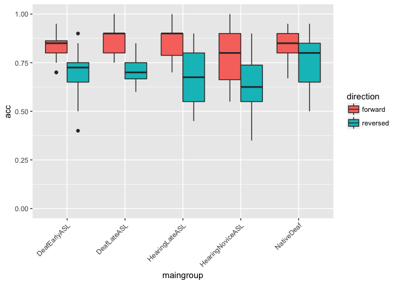

Study 1 Adult Data Analysis
================
Adam Stone, PhD
August 31, 2017

-   [Importing and Reshaping Data](#importing-and-reshaping-data)
-   [Participant Demographics](#participant-demographics)
-   [Accuracy Data Analysis](#accuracy-data-analysis)
-   [Eye Data](#eye-data)

Importing and Reshaping Data
----------------------------

Here we're going to import the data, remove dropped participants, and reshape the data so story and direction are grouping variables (and the dataset will be more tall than wide). Let's see all our data first.

``` r
# Import packages we'll need.
library(tidyverse)
library(stringr)
library(lme4)
library(prettydoc)
library(broom)
library(knitr)
# Import the data
data <- read_csv('finaladultdata.csv', col_types=
                   cols(
                     id = col_integer(),
                     participant = col_character(),
                     hearing = col_character(),
                     videogroup = col_character(),
                     aoagroup = col_character(),
                     languagegroup = col_character(),
                     maingroup = col_character(),
                     selfrate = col_double(),
                     age = col_double(),
                     signyrs = col_double(),
                     aoasl = col_integer(),
                     acc.fw1 = col_double(),
                     acc.rv2 = col_double(),
                     acc.fw3 = col_double(),
                     acc.rv4 = col_double(),
                     forehead.fw1 = col_double(),
                     forehead.fw3 = col_double(),
                     forehead.rv2 = col_double(),
                     forehead.rv4 = col_double(),
                     eyes.fw1 = col_double(),
                     eyes.fw3 = col_double(),
                     eyes.rv2 = col_double(),
                     eyes.rv4 = col_double(),
                     mouth.fw1 = col_double(),
                     mouth.fw3 = col_double(),
                     mouth.rv2 = col_double(),
                     mouth.rv4 = col_double(),
                     chin.fw1 = col_double(),
                     chin.fw3 = col_double(),
                     chin.rv2 = col_double(),
                     chin.rv4 = col_double(),
                     upperchest.fw1 = col_double(),
                     upperchest.fw3 = col_double(),
                     upperchest.rv2 = col_double(),
                     upperchest.rv4 = col_double(),
                     midchest.fw1 = col_double(),
                     midchest.fw3 = col_double(),
                     midchest.rv2 = col_double(),
                     midchest.rv4 = col_double(),
                     lowerchest.fw1 = col_double(),
                     lowerchest.fw3 = col_double(),
                     lowerchest.rv2 = col_double(),
                     lowerchest.rv4 = col_double(),
                     belly.fw1 = col_double(),
                     belly.fw3 = col_double(),
                     belly.rv2 = col_double(),
                     belly.rv4 = col_double(),
                     left.fw1 = col_double(),
                     left.fw3 = col_double(),
                     left.rv2 = col_double(),
                     left.rv4 = col_double(),
                     right.fw1 = col_double(),
                     right.fw3 = col_double(),
                     right.rv2 = col_double(),
                     right.rv4 = col_double()
                     )
)
kable(data)
```

|   id| participant                   | hearing | videogroup | aoagroup | languagegroup | maingroup        |  selfrate|    age|  signyrs|  aoasl|  acc.fw1|  acc.rv2|  acc.fw3|  acc.rv4|  forehead.fw1|  forehead.fw3|  forehead.rv2|  forehead.rv4|  eyes.fw1|  eyes.fw3|  eyes.rv2|  eyes.rv4|  mouth.fw1|  mouth.fw3|  mouth.rv2|  mouth.rv4|  chin.fw1|  chin.fw3|  chin.rv2|  chin.rv4|  upperchest.fw1|  upperchest.fw3|  upperchest.rv2|  upperchest.rv4|  midchest.fw1|  midchest.fw3|  midchest.rv2|  midchest.rv4|  lowerchest.fw1|  lowerchest.fw3|  lowerchest.rv2|  lowerchest.rv4|  belly.fw1|  belly.fw3|  belly.rv2|  belly.rv4|  left.fw1|  left.fw3|  left.rv2|  left.rv4|  right.fw1|  right.fw3|  right.rv2|  right.rv4|
|----:|:------------------------------|:--------|:-----------|:---------|:--------------|:-----------------|---------:|------:|--------:|------:|--------:|--------:|--------:|--------:|-------------:|-------------:|-------------:|-------------:|---------:|---------:|---------:|---------:|----------:|----------:|----------:|----------:|---------:|---------:|---------:|---------:|---------------:|---------------:|---------------:|---------------:|-------------:|-------------:|-------------:|-------------:|---------------:|---------------:|---------------:|---------------:|----------:|----------:|----------:|----------:|---------:|---------:|---------:|---------:|----------:|----------:|----------:|----------:|
|    1| Jessika                       | Deaf    | Group 1    | Early    | EarlyASL      | DeafEarlyASL     |       5.0|  24.00|    21.00|      3|     0.85|   0.7500|     0.90|     0.80|            NA|            NA|            NA|          0.23|      5.51|      3.70|      3.04|      6.37|      14.73|      25.33|       8.02|      11.58|      0.72|      7.61|      0.43|      0.31|            0.01|            0.04|              NA|              NA|            NA|          0.02|            NA|            NA|              NA|            0.02|              NA|              NA|         NA|         NA|         NA|         NA|        NA|        NA|        NA|        NA|         NA|         NA|         NA|         NA|
|    2| Derek                         | Deaf    | Group 1    | Early    | EarlyASL      | DeafEarlyASL     |       5.0|  41.00|    38.00|      3|     0.80|   0.7000|     0.85|     0.65|            NA|          0.02|          0.01|            NA|      0.53|      2.09|      3.08|      1.20|      16.98|      29.47|       5.44|      11.70|      3.29|      4.14|      0.52|      2.46|            0.22|              NA|            0.01|            0.27|            NA|          0.01|          0.02|          0.32|              NA|              NA|            0.02|            0.20|         NA|         NA|       0.38|         NA|        NA|        NA|      0.03|        NA|         NA|         NA|         NA|         NA|
|    3| Vanessa\_Deaf                 | Deaf    | Group 2    | Early    | EarlyASL      | DeafEarlyASL     |       5.0|  34.00|    30.00|      4|     0.85|   0.7000|     0.80|     0.65|            NA|          0.02|          0.02|          0.12|      0.32|      1.77|      0.05|      2.22|      15.87|      17.98|      32.13|      11.72|      0.52|      0.57|      3.36|      4.30|            0.03|            0.03|            0.01|            0.18|          0.23|          0.01|            NA|          0.06|              NA|              NA|              NA|            0.01|         NA|         NA|         NA|         NA|        NA|        NA|        NA|        NA|         NA|         NA|         NA|       0.02|
|    4| Josh                          | Deaf    | Group 2    | Early    | EarlyASL      | DeafEarlyASL     |       5.0|  31.00|    27.00|      4|     0.95|   0.5000|     0.85|     0.75|            NA|            NA|            NA|            NA|      0.72|        NA|      0.06|        NA|      19.77|      16.46|      28.94|      14.28|      6.19|      4.14|      9.58|      5.78|            0.12|            0.06|            0.34|            0.45|          0.03|          0.02|          0.49|            NA|              NA|            0.02|            0.01|              NA|         NA|       0.02|         NA|         NA|        NA|        NA|      0.79|        NA|       0.12|         NA|         NA|       0.09|
|    5| Lynnette                      | Deaf    | Group 1    | Early    | EarlyASL      | DeafEarlyASL     |       5.0|  39.00|    34.00|      5|     0.90|   0.6500|     0.70|     0.75|            NA|          0.17|            NA|          0.03|      3.17|      0.08|      0.41|      0.37|      16.91|       1.82|       2.26|       1.44|      0.15|      0.76|      3.10|      0.06|              NA|              NA|            0.01|            0.02|            NA|          0.01|            NA|          0.01|              NA|              NA|              NA|            0.01|         NA|       0.01|         NA|         NA|        NA|        NA|        NA|        NA|         NA|       0.06|       0.37|       0.02|
|    6| Laura P (missing stories)     | Deaf    | Group 1    | Early    | EarlyASL      | DeafEarlyASL     |       5.0|  37.00|    29.00|      8|     0.95|   0.7500|     0.70|     0.90|            NA|            NA|            NA|            NA|        NA|      3.01|        NA|      0.72|         NA|      31.72|         NA|       2.69|        NA|      0.54|        NA|      0.37|              NA|            0.03|              NA|            0.01|            NA|          0.01|            NA|            NA|              NA|              NA|              NA|              NA|         NA|         NA|         NA|         NA|        NA|        NA|        NA|        NA|         NA|       0.17|         NA|       0.01|
|    7| Rebecca                       | Deaf    | Group 1    | Early    | EarlyASL      | DeafEarlyASL     |       5.0|  38.00|    29.00|      9|     0.85|   0.4000|     0.75|     0.55|            NA|            NA|            NA|            NA|      0.01|        NA|      0.02|        NA|       8.31|       0.40|       0.02|       2.06|     11.80|      2.16|      0.44|      3.09|            0.08|            0.32|            0.32|            0.46|            NA|          0.01|          0.01|          0.02|              NA|            0.01|              NA|              NA|         NA|       0.04|         NA|         NA|        NA|        NA|        NA|        NA|         NA|       3.90|         NA|         NA|
|    8| Cathy                         | Deaf    | Group 2    | Early    | EarlyASL      | DeafEarlyASL     |       5.0|  39.00|    30.00|      9|     0.85|   0.7500|     0.85|     0.85|            NA|            NA|            NA|            NA|        NA|        NA|        NA|        NA|         NA|         NA|         NA|         NA|        NA|        NA|        NA|        NA|              NA|              NA|              NA|              NA|            NA|            NA|            NA|            NA|              NA|              NA|              NA|              NA|         NA|         NA|         NA|         NA|        NA|        NA|        NA|        NA|         NA|         NA|         NA|         NA|
|    9| Crystal                       | Deaf    | Group 2    | Early    | LateASL       | DeafLateASL      |       5.0|  39.00|    29.00|     10|     0.90|   0.6667|     0.80|     0.80|            NA|          0.00|            NA|          0.02|      4.78|     10.02|     18.82|      7.30|      13.26|      11.34|      17.52|      13.63|      0.14|      0.09|      0.04|      0.02|              NA|            0.10|            0.01|              NA|            NA|          0.02|          0.01|          0.01|              NA|            0.01|              NA|              NA|         NA|       0.03|         NA|         NA|      0.16|        NA|        NA|        NA|         NA|         NA|       0.07|         NA|
|   10| Chrissy G.                    | Deaf    | Group 1    | Early    | LateASL       | DeafLateASL      |       5.0|  43.00|    27.00|     12|     0.90|   0.7000|     0.90|     0.65|            NA|            NA|            NA|            NA|        NA|        NA|        NA|        NA|         NA|         NA|         NA|         NA|        NA|        NA|        NA|        NA|              NA|              NA|              NA|              NA|            NA|            NA|            NA|            NA|              NA|              NA|              NA|              NA|         NA|         NA|         NA|         NA|        NA|        NA|        NA|        NA|         NA|         NA|         NA|         NA|
|   11| Adam                          | Deaf    | Group 1    | Early    | LateASL       | DeafLateASL      |       5.0|  26.00|    13.00|     13|     0.80|   0.7000|       NA|       NA|            NA|            NA|            NA|            NA|      3.78|      4.90|      1.03|      2.28|      17.31|      31.70|      10.39|      10.89|      0.23|      0.44|      0.28|      0.06|              NA|              NA|              NA|            0.22|            NA|            NA|            NA|            NA|              NA|              NA|              NA|              NA|         NA|         NA|         NA|         NA|        NA|        NA|        NA|        NA|         NA|         NA|         NA|       0.01|
|   12| Brad                          | Deaf    | Group 1    | Early    | LateASL       | DeafLateASL      |       5.0|  34.00|    21.00|     13|     0.75|   0.6000|     0.80|     0.75|            NA|            NA|            NA|            NA|      3.46|      0.06|      0.42|      0.15|      17.29|      10.87|      11.42|      17.42|      0.15|      0.88|      0.56|      0.38|            0.01|              NA|            0.24|              NA|            NA|          0.01|            NA|            NA|              NA|            0.01|              NA|              NA|         NA|       0.08|         NA|         NA|        NA|        NA|        NA|        NA|       0.01|         NA|         NA|         NA|
|   13| Alicia                        | Deaf    | Group 2    | Early    | LateASL       | DeafLateASL      |       5.0|  37.00|    23.00|     14|     0.95|   0.7000|     1.00|     0.85|            NA|            NA|            NA|          0.05|      0.85|      0.07|      3.92|      1.05|      14.91|       8.17|      29.22|      13.42|      1.03|      2.23|      1.02|      1.11|            1.26|            0.01|            0.26|            0.36|          0.05|          0.01|          0.29|          1.64|              NA|            0.03|            0.11|            0.16|         NA|       0.13|       0.05|         NA|        NA|      0.65|      1.92|      0.38|         NA|       0.05|         NA|         NA|
|   14| Joe                           | Deaf    | Group 2    | Early    | LateASL       | DeafLateASL      |       5.0|  44.00|    29.00|     15|     0.90|   0.6000|     0.90|     0.80|            NA|            NA|            NA|            NA|        NA|        NA|        NA|        NA|         NA|         NA|         NA|         NA|        NA|        NA|        NA|        NA|              NA|              NA|              NA|              NA|            NA|            NA|            NA|            NA|              NA|              NA|              NA|              NA|         NA|         NA|         NA|         NA|        NA|        NA|        NA|        NA|         NA|         NA|         NA|         NA|
|   15| Svenna                        | Deaf    | Group 2    | Native   | Native        | NativeDeaf       |       5.0|  32.00|    32.00|      0|     0.85|   0.9000|     0.95|     0.85|            NA|            NA|            NA|            NA|      3.45|      0.02|      3.71|      0.86|      13.88|      19.59|      31.92|      18.38|      0.47|      1.87|      0.27|      1.73|              NA|            0.07|            0.12|              NA|            NA|            NA|          0.01|            NA|              NA|              NA|              NA|              NA|         NA|         NA|         NA|         NA|        NA|        NA|        NA|        NA|         NA|         NA|         NA|       0.22|
|   16| Monica                        | Deaf    | Group 1    | Native   | Native        | NativeDeaf       |       5.0|  24.00|    24.00|      0|     0.80|   0.8500|     0.75|     0.70|            NA|            NA|            NA|          7.17|      5.89|      5.05|      1.34|     10.43|      15.25|      29.36|       5.59|       0.59|      0.33|      1.51|      4.21|      0.01|              NA|              NA|            0.13|              NA|            NA|            NA|          0.01|            NA|              NA|              NA|              NA|              NA|         NA|         NA|       0.02|         NA|        NA|      0.02|        NA|      0.03|         NA|       0.01|         NA|         NA|
|   17| Valerie                       | Deaf    | Group 1    | Native   | Native        | NativeDeaf       |       5.0|  29.00|    29.00|      0|     0.90|   0.8000|     0.76|     0.85|            NA|            NA|            NA|            NA|      0.11|      0.05|        NA|        NA|      15.54|       3.33|       1.80|         NA|      5.08|     32.94|     12.87|      0.50|            0.02|            0.40|            0.09|            0.02|            NA|            NA|            NA|            NA|              NA|              NA|              NA|              NA|         NA|         NA|         NA|         NA|        NA|        NA|        NA|        NA|         NA|         NA|         NA|         NA|
|   18| Lucy                          | Deaf    | Group 2    | Native   | Native        | NativeDeaf       |       5.0|  37.00|    37.00|      0|     0.85|   0.6500|     0.90|     0.85|            NA|            NA|            NA|            NA|      0.15|        NA|      0.03|        NA|      16.40|      17.95|      35.04|      14.53|      0.41|      2.91|      1.21|      0.67|            0.03|            0.03|              NA|              NA|            NA|            NA|            NA|            NA|              NA|              NA|              NA|              NA|         NA|         NA|         NA|         NA|        NA|        NA|        NA|        NA|         NA|         NA|         NA|         NA|
|   19| Chrissy K                     | Deaf    | Group 2    | Native   | Native        | NativeDeaf       |       5.0|  22.00|    22.00|      0|     0.90|   0.8500|     0.75|     0.65|            NA|            NA|            NA|            NA|        NA|        NA|        NA|        NA|       3.63|       1.24|       0.68|       0.13|     14.56|     14.24|     25.89|      8.27|            0.06|            6.22|            7.48|            8.67|          0.12|          0.15|          0.02|          1.91|            0.03|              NA|            0.02|            0.06|       0.05|         NA|       0.25|       0.43|        NA|        NA|      0.21|      0.47|         NA|         NA|         NA|         NA|
|   20| MarlaMarks Deaf               | Deaf    | Group 2    | Native   | Native        | NativeDeaf       |       5.0|  57.00|    57.00|      0|     0.90|   0.6200|     0.95|     0.85|          0.04|            NA|          0.01|            NA|      7.31|      2.03|      1.25|      2.21|      10.35|      17.88|      14.58|      15.35|      0.02|      0.21|      0.52|      1.41|            0.10|            0.23|            0.19|            0.02|          0.12|            NA|          0.02|          0.01|              NA|              NA|              NA|              NA|         NA|         NA|         NA|       0.02|        NA|        NA|        NA|        NA|         NA|         NA|         NA|         NA|
|   21| Alyssa\_Deaf                  | Deaf    | Group 1    | Native   | Native        | NativeDeaf       |       5.0|  24.00|    22.00|      0|     0.80|   0.7000|     0.80|     0.85|            NA|            NA|            NA|            NA|      0.31|        NA|        NA|      0.01|       4.90|       1.86|       0.12|       2.24|     15.03|     32.42|     13.22|     14.73|            0.21|            0.12|            0.02|            0.21|          0.02|          0.02|          0.01|          0.02|            0.01|              NA|            0.01|            0.36|         NA|       0.01|       0.01|         NA|        NA|        NA|        NA|        NA|       0.01|         NA|       0.16|       0.03|
|   22| Melissa                       | Deaf    | Group 2    | Native   | Native        | NativeDeaf       |       5.0|  33.00|    33.00|      0|       NA|       NA|     0.86|     0.80|            NA|            NA|            NA|            NA|      6.20|      2.74|      3.61|      1.59|      10.90|      17.74|      31.92|      18.12|      0.02|      0.07|      0.23|      0.41|            0.23|            0.02|              NA|            0.03|            NA|            NA|            NA|            NA|              NA|              NA|              NA|            0.01|         NA|         NA|         NA|       0.01|        NA|        NA|        NA|        NA|         NA|         NA|         NA|       0.01|
|   23| Lucinda                       | Deaf    | Group 2    | Native   | Native        | NativeDeaf       |       5.0|  32.00|    32.00|      0|     0.85|   0.6500|     0.90|     0.85|            NA|            NA|            NA|            NA|        NA|        NA|        NA|        NA|         NA|         NA|         NA|         NA|        NA|        NA|        NA|        NA|              NA|              NA|              NA|              NA|            NA|            NA|            NA|            NA|              NA|              NA|              NA|              NA|         NA|         NA|         NA|         NA|        NA|        NA|        NA|        NA|         NA|         NA|         NA|         NA|
|   24| Lindsay\_DeafAdult            | Deaf    | Group 1    | Native   | Native        | NativeDeaf       |       5.0|  37.00|    36.00|      1|     0.85|   0.5500|     0.67|     0.60|            NA|          0.16|            NA|            NA|      2.38|      0.93|      0.96|      0.57|      16.07|      13.11|       2.65|      13.13|      2.74|     11.61|      3.33|      4.72|              NA|            1.01|            0.02|            0.07|            NA|          0.01|            NA|            NA|              NA|              NA|            0.02|              NA|         NA|       0.05|       0.02|         NA|        NA|        NA|        NA|        NA|         NA|       0.02|       0.29|         NA|
|   25| Michael\_Deaf                 | Deaf    | Group 2    | Native   | Native        | NativeDeaf       |       5.0|  30.00|    29.00|      1|     0.90|   0.5000|     0.85|     0.75|          0.01|            NA|          0.01|          0.21|      2.14|      0.69|      2.33|      1.32|      14.01|      10.74|      12.33|       2.76|      0.09|      0.84|      4.01|      0.30|            0.02|            0.03|            0.08|            0.03|            NA|          0.09|          0.01|            NA|              NA|              NA|              NA|              NA|         NA|       0.01|         NA|         NA|        NA|        NA|        NA|        NA|         NA|         NA|       0.18|         NA|
|   26| Erin                          | Deaf    | Group 1    | Native   | Native        | NativeDeaf       |       5.0|  37.00|    36.00|      1|     0.95|   0.9500|     0.86|     0.95|            NA|            NA|            NA|            NA|      0.25|      0.46|      8.70|      0.89|      20.23|      36.18|       3.02|      17.36|      0.73|      0.32|      0.10|      0.02|            0.21|            0.24|            0.17|            0.20|            NA|            NA|            NA|            NA|              NA|              NA|              NA|              NA|         NA|         NA|         NA|         NA|        NA|        NA|        NA|        NA|         NA|         NA|         NA|         NA|
|   27| Megan                         | Hearing | Group 2    | Late     | EarlyASL      | NA               |       4.0|  17.00|    10.00|      6|     0.80|   0.8000|     0.95|     0.80|            NA|            NA|            NA|            NA|        NA|        NA|        NA|        NA|         NA|         NA|         NA|         NA|        NA|        NA|        NA|        NA|              NA|              NA|              NA|              NA|            NA|            NA|            NA|            NA|              NA|              NA|              NA|              NA|         NA|         NA|         NA|         NA|        NA|        NA|        NA|        NA|         NA|         NA|         NA|         NA|
|   28| Allison                       | Hearing | Group 1    | Late     | LateASL       | HearingLateASL   |       5.0|  22.00|    10.00|     12|     0.80|   0.5000|     0.75|     0.90|          0.04|          1.63|          0.92|          1.56|     14.00|     11.40|     16.03|     13.19|       6.04|       3.28|       1.72|       1.02|      0.23|      0.19|      0.01|      0.03|            0.03|            0.10|            0.02|              NA|          0.07|          0.02|          0.04|            NA|            0.08|            0.03|            0.42|              NA|       0.02|       0.03|         NA|         NA|        NA|      0.02|        NA|        NA|         NA|       8.12|       0.01|       1.90|
|   29| DeAnnaHearingLate             | Hearing | Group 2    | Late     | LateASL       | HearingLateASL   |       4.5|  23.00|     9.00|     13|     0.70|   0.6500|     0.75|     0.80|            NA|          2.36|          0.18|          0.27|      6.59|     13.27|     14.25|     11.68|      10.52|       4.74|      16.03|       4.89|      0.04|      0.85|      2.70|      1.16|              NA|              NA|            1.47|            0.93|            NA|            NA|          0.04|          2.26|              NA|              NA|            0.15|            0.12|         NA|         NA|         NA|         NA|        NA|      0.06|      1.54|        NA|         NA|       0.31|       0.21|         NA|
|   30| Sara G                        | Hearing | Group 1    | Late     | LateASL       | HearingLateASL   |       4.0|  29.00|    15.00|     14|     0.90|   0.7000|     0.85|     0.85|          0.61|          1.57|          1.41|          0.58|      1.12|     30.28|     15.00|     12.47|       0.50|       7.97|       1.87|       4.50|      0.02|      0.48|      2.79|      0.25|              NA|            0.04|            2.23|            0.15|            NA|          0.02|          0.40|            NA|              NA|            0.12|            0.74|              NA|         NA|       0.01|       0.86|         NA|      0.29|      0.97|      0.68|        NA|       0.02|       0.16|       2.36|         NA|
|   31| JenniferHearingTerp           | Hearing | Group 2    | Late     | LateASL       | HearingLateASL   |       5.0|  32.00|    17.00|     15|     0.75|   0.6500|     1.00|     0.65|            NA|            NA|            NA|          0.08|      0.36|        NA|        NA|      1.31|      17.39|       4.63|      34.54|      19.00|      0.44|      0.10|      2.01|      0.32|              NA|              NA|              NA|              NA|            NA|            NA|            NA|            NA|              NA|              NA|              NA|              NA|         NA|         NA|         NA|         NA|        NA|        NA|        NA|        NA|         NA|         NA|         NA|         NA|
|   32| Desiree\_Nonnative Signer     | Hearing | Group 2    | Late     | LateASL       | HearingLateASL   |       4.0|  18.00|     5.00|     15|     1.00|   0.5000|     1.00|     0.80|            NA|            NA|            NA|            NA|      1.11|      2.20|      0.01|      0.27|      14.85|      13.78|      24.69|       2.00|      2.36|      0.72|     11.45|      1.73|            0.04|            0.02|            0.07|            0.04|          0.02|          0.01|          0.02|          0.01|              NA|            0.01|            0.01|              NA|         NA|         NA|       0.03|       0.01|        NA|        NA|        NA|        NA|         NA|         NA|         NA|       0.02|
|   33| Matt\_Hall\_LateAdultSigner   | Hearing | Group 2    | Late     | LateASL       | HearingLateASL   |       5.0|  29.00|    11.00|     18|     0.85|   0.6100|     0.95|     0.85|          0.02|            NA|            NA|            NA|      0.58|      0.23|      0.09|      0.18|      11.76|      20.32|      32.88|      19.72|      5.93|      1.75|      4.22|      1.53|            0.17|              NA|              NA|              NA|            NA|            NA|            NA|            NA|              NA|              NA|              NA|              NA|         NA|         NA|         NA|         NA|        NA|        NA|        NA|        NA|         NA|         NA|         NA|         NA|
|   34| Tori                          | Hearing | Group 1    | Late     | LateASL       | HearingLateASL   |       5.0|  30.00|    12.00|     18|     0.90|   0.5000|     0.75|     0.45|          0.28|          1.12|          2.47|          2.34|      7.53|     17.02|      7.41|      6.55|       3.61|       9.10|       0.72|       3.04|      2.48|      3.06|      1.45|      1.55|            1.65|            0.42|            1.53|            2.46|          0.22|          0.11|          0.16|          0.32|            0.05|            0.17|            0.34|            0.04|       0.07|       0.14|       0.02|       0.22|      0.27|      2.66|      1.09|      0.44|         NA|         NA|       0.76|       0.15|
|   35| Amy L                         | Hearing | Group 1    | Late     | LateASL       | HearingLateASL   |       5.0|  39.00|    20.00|     19|     0.90|   0.5500|     0.90|     0.80|            NA|          0.05|            NA|          0.06|      1.88|     20.00|     13.60|     15.14|      17.90|      16.92|       1.10|       3.23|      0.13|      0.02|      0.01|      0.05|              NA|            0.02|            0.01|            0.01|            NA|          0.01|            NA|            NA|              NA|              NA|              NA|              NA|         NA|       0.03|         NA|         NA|        NA|        NA|        NA|        NA|       0.12|         NA|         NA|         NA|
|   36| Chris                         | Hearing | Group 1    | Late     | LateASL       | HearingLateASL   |       4.0|  26.00|     7.00|     19|     0.90|   0.5500|     0.75|     0.65|          0.05|          0.34|          5.65|          3.14|     10.34|     21.82|     12.60|      8.80|       6.49|      14.37|       0.12|       1.30|      0.26|      0.02|      0.47|      0.19|            0.07|            0.24|            0.01|              NA|            NA|            NA|          0.02|            NA|              NA|            0.01|            0.37|              NA|         NA|         NA|         NA|         NA|        NA|        NA|        NA|        NA|         NA|         NA|       0.45|       1.09|
|   37| Jilliean                      | Hearing | Group 2    | Late     | LateASL       | HearingLateASL   |       5.0|  38.00|    18.00|     20|     0.90|   0.8500|     0.90|     0.75|            NA|            NA|            NA|            NA|      1.91|      0.78|      2.34|      0.88|      16.13|      18.39|      32.60|      17.12|        NA|      1.17|      1.82|      2.06|              NA|            0.15|            0.25|              NA|            NA|          0.05|            NA|            NA|              NA|              NA|              NA|              NA|         NA|         NA|         NA|         NA|        NA|        NA|        NA|        NA|         NA|         NA|         NA|         NA|
|   38| Cami                          | Hearing | Group 2    | Late     | LateASL       | HearingLateASL   |       5.0|  28.00|     6.00|     22|     0.90|   0.8000|     1.00|     0.80|            NA|            NA|          0.19|            NA|      0.25|        NA|      1.79|        NA|      11.26|       4.54|      21.91|       5.14|      6.08|     16.85|     11.49|     15.09|            0.22|            0.23|            0.36|            0.09|            NA|            NA|          0.01|          0.02|              NA|              NA|            0.02|            0.24|         NA|         NA|       0.26|       0.02|        NA|        NA|      0.03|        NA|       0.20|       0.26|       0.21|       0.21|
|   39| deniz                         | Hearing | Group 2    | Late     | LateASL       | HearingLateASL   |       4.0|  33.00|    11.00|     22|     0.90|   0.5000|     0.80|     0.80|            NA|            NA|            NA|            NA|        NA|      0.03|        NA|        NA|       6.96|      13.98|       7.02|       7.71|      3.94|      2.35|     10.32|     11.38|            1.18|            0.21|            0.75|            0.22|          0.70|            NA|          0.25|          1.20|              NA|              NA|            0.02|            0.51|         NA|         NA|       0.01|         NA|        NA|        NA|      0.18|        NA|         NA|         NA|         NA|         NA|
|   40| DustinHearingCODA             | Hearing | Group 2    | Native   | Native        | NA               |       5.0|  29.00|    29.00|      0|     0.85|   0.5000|     0.75|     0.85|            NA|            NA|            NA|            NA|      7.71|     11.36|      1.43|     10.34|      10.67|      10.45|      33.51|       9.50|      0.05|      0.02|      1.58|      1.07|              NA|              NA|            0.09|            0.37|            NA|          0.02|          0.02|          0.20|              NA|              NA|              NA|              NA|         NA|         NA|         NA|         NA|        NA|        NA|      0.32|        NA|       0.04|         NA|         NA|         NA|
|   41| DanFisher                     | Hearing | Group 1    | Native   | Native        | NA               |       5.0|  26.00|    25.00|      1|     0.95|   0.6000|     0.85|     0.90|          0.02|          0.01|            NA|            NA|      0.88|      0.63|        NA|      0.23|       8.95|      16.18|       1.35|      13.28|      5.11|      7.73|      6.88|      3.87|            0.18|            0.42|            0.07|              NA|            NA|          0.04|            NA|          0.01|              NA|              NA|              NA|              NA|         NA|         NA|         NA|         NA|      0.01|        NA|        NA|        NA|       0.08|       0.02|       0.70|       0.00|
|   42| Stephanie                     | Hearing | Group 1    | Novice   | NoviceASL     | HearingNoviceASL |       3.0|  19.00|     4.00|     15|     1.00|   0.5000|     0.81|     0.70|            NA|            NA|            NA|            NA|      2.49|      0.06|        NA|      0.37|      13.61|      29.68|       5.09|      11.96|      2.23|      4.33|      7.36|      3.84|            1.58|            0.25|            1.88|            0.92|          0.55|          0.02|          0.80|          0.01|            0.17|              NA|            0.63|              NA|         NA|       0.01|       0.29|         NA|        NA|      0.20|      0.21|        NA|         NA|         NA|         NA|         NA|
|   43| Mauro                         | Hearing | Group 2    | Novice   | NoviceASL     | HearingNoviceASL |       2.0|  21.00|     3.00|     16|     0.80|   0.7000|     0.65|     0.55|            NA|            NA|            NA|            NA|      0.79|      4.18|      0.83|      4.20|      14.34|      15.81|      28.70|      13.28|      2.50|      0.68|      4.62|      0.33|              NA|            0.01|            0.47|            0.06|          0.02|          0.01|          0.02|          0.62|              NA|            0.01|            0.15|            0.13|       0.01|       0.02|       0.02|         NA|        NA|      0.32|      1.03|      0.22|       0.36|       0.42|         NA|         NA|
|   44| Cora                          | Hearing | Group 2    | Novice   | NoviceASL     | HearingNoviceASL |       3.0|  21.00|     4.00|     17|     0.90|   0.5500|     0.90|     0.60|          0.23|          0.45|            NA|          0.12|     12.94|     18.88|     20.82|     15.47|       4.40|       0.52|       9.23|       4.02|      0.03|      0.07|      0.21|      0.04|            0.01|            0.01|            0.02|            0.23|            NA|            NA|          0.02|          0.01|              NA|            0.01|            0.30|              NA|         NA|       0.01|       0.02|       0.01|        NA|        NA|      0.54|        NA|         NA|         NA|         NA|         NA|
|   45| Aya\_Hawari                   | Hearing | Group 2    | Novice   | NoviceASL     | HearingNoviceASL |       3.0|  18.00|     1.00|     17|     0.75|   0.6000|     0.90|     0.75|            NA|            NA|            NA|            NA|      0.28|        NA|      0.13|      0.24|      10.77|       2.65|       2.91|       6.65|      3.69|     10.04|     17.14|      9.29|            2.23|            7.22|           11.04|            3.21|          0.98|          0.56|          2.87|          0.67|            0.26|            0.10|            0.17|            1.01|         NA|       0.38|       0.04|         NA|        NA|        NA|      0.99|        NA|         NA|       0.67|       0.06|         NA|
|   46| Hayley Nava                   | Hearing | Group 1    | Novice   | NoviceASL     | HearingNoviceASL |       2.0|  20.00|     2.00|     18|     0.55|   0.5000|     0.60|     0.55|            NA|            NA|            NA|            NA|      4.37|      6.60|      4.46|      1.19|      13.12|       9.99|      26.86|       4.48|      0.24|      0.18|      2.00|        NA|            0.03|            0.04|              NA|              NA|          0.03|            NA|            NA|            NA|              NA|              NA|            0.01|              NA|         NA|         NA|         NA|         NA|        NA|        NA|      0.02|        NA|         NA|         NA|         NA|         NA|
|   47| Danielle\_Abraham             | Hearing | Group 1    | Novice   | NoviceASL     | HearingNoviceASL |       3.0|  20.00|     2.00|     18|     0.75|   0.3500|     0.60|     0.55|            NA|            NA|            NA|            NA|      1.07|      0.47|      0.89|      4.54|      15.27|      29.17|       1.57|       8.86|      2.78|      1.29|      3.88|      2.60|            0.85|            2.51|            2.20|            1.67|          0.62|          0.25|          2.12|          0.34|            0.25|            0.07|            0.33|              NA|       0.02|       0.04|       0.01|       0.01|        NA|      2.11|        NA|        NA|         NA|         NA|       0.84|         NA|
|   48| Aman\_Nassir                  | Hearing | Group 1    | Novice   | NoviceASL     | HearingNoviceASL |       3.0|  21.00|     2.00|     19|     0.95|   0.6000|     0.70|     0.55|            NA|            NA|            NA|            NA|      4.81|      1.95|      2.85|      8.33|      15.54|      34.09|       6.77|       9.56|      0.17|      0.07|        NA|      0.08|            0.01|              NA|              NA|              NA|            NA|            NA|            NA|            NA|              NA|              NA|              NA|              NA|         NA|         NA|         NA|         NA|        NA|        NA|        NA|        NA|         NA|         NA|         NA|         NA|
|   49| Phuong\_Tran                  | Hearing | Group 2    | Novice   | NoviceASL     | HearingNoviceASL |       3.0|  22.00|     2.00|     20|     0.65|   0.7500|     0.60|     0.65|            NA|          1.19|          0.16|          0.10|      6.60|     16.37|      0.10|      5.93|      10.92|       3.50|      11.22|      14.49|      0.03|      0.31|     20.19|      0.03|            0.15|              NA|            1.80|            0.02|            NA|            NA|          1.43|            NA|              NA|              NA|            0.39|              NA|         NA|         NA|         NA|         NA|        NA|        NA|      1.59|      0.52|         NA|       0.32|       0.16|       0.01|
|   50| Jaylin\_Novice\_NotInstructed | Hearing | Group 2    | Novice   | NoviceASL     | HearingNoviceASL |       4.0|  22.00|     1.10|     21|     0.85|   0.8000|     0.80|     0.75|          0.51|          0.12|          0.12|          0.19|      1.72|      3.07|      2.19|      6.75|       8.45|      14.31|      15.05|       6.75|      3.74|      2.42|     12.08|      1.44|            0.20|            0.10|            3.66|            1.13|          0.56|          0.03|          0.72|          2.52|            0.17|            0.02|              NA|            0.16|         NA|       0.25|         NA|         NA|      0.02|        NA|      1.33|      0.03|         NA|       0.01|       0.21|         NA|
|   51| Yasmine                       | Hearing | Group 1    | Novice   | NoviceASL     | HearingNoviceASL |       3.5|  19.00|     3.00|     16|     0.90|   0.9000|     0.80|     0.80|          0.02|            NA|            NA|            NA|      1.97|      1.30|      0.03|      0.06|      10.91|      10.77|       1.85|       5.13|      2.79|     14.62|      6.57|      8.28|            1.38|            5.34|            1.86|            2.15|          1.43|          1.29|          1.67|          0.84|            0.02|            0.35|            0.08|            0.01|         NA|         NA|       0.32|         NA|      1.01|      2.04|        NA|        NA|         NA|       0.04|       0.59|         NA|
|   52| Austin\_Novice\_Instructed    | Hearing | Group 2    | Novice   | NoviceASL     | HearingNoviceASL |       4.0|  19.75|     2.75|     17|     0.85|   0.7000|     0.90|     0.70|            NA|            NA|            NA|            NA|      0.56|      0.10|      0.01|      0.36|      13.75|      17.37|       8.91|      15.50|      2.07|      2.25|     25.85|      3.82|            0.02|            0.05|            0.07|            0.02|          0.01|          0.03|          0.02|          0.02|              NA|            0.02|            0.02|              NA|       0.02|       0.01|       0.08|       0.03|        NA|        NA|        NA|        NA|       0.01|         NA|         NA|         NA|

Remove dropped participants (they have no main group name, or no data). These are who we dropped.

``` r
dropped <- filter(data, is.na(maingroup)==TRUE)
manual <- filter(data,participant=="Lucinda" | participant=="Joe")
dropped <- rbind(dropped,manual) %>% arrange(id)
data <- data %>%
  filter(is.na(maingroup)==FALSE) %>% 
  filter(participant!="Lucinda" & participant!="Joe")
dropped
```

    ## # A tibble: 5 x 55
    ##      id       participant hearing videogroup aoagroup languagegroup
    ##   <int>             <chr>   <chr>      <chr>    <chr>         <chr>
    ## 1    14               Joe    Deaf    Group 2    Early       LateASL
    ## 2    23           Lucinda    Deaf    Group 2   Native        Native
    ## 3    27             Megan Hearing    Group 2     Late      EarlyASL
    ## 4    40 DustinHearingCODA Hearing    Group 2   Native        Native
    ## 5    41         DanFisher Hearing    Group 1   Native        Native
    ## # ... with 49 more variables: maingroup <chr>, selfrate <dbl>, age <dbl>,
    ## #   signyrs <dbl>, aoasl <int>, acc.fw1 <dbl>, acc.rv2 <dbl>,
    ## #   acc.fw3 <dbl>, acc.rv4 <dbl>, forehead.fw1 <dbl>, forehead.fw3 <dbl>,
    ## #   forehead.rv2 <dbl>, forehead.rv4 <dbl>, eyes.fw1 <dbl>,
    ## #   eyes.fw3 <dbl>, eyes.rv2 <dbl>, eyes.rv4 <dbl>, mouth.fw1 <dbl>,
    ## #   mouth.fw3 <dbl>, mouth.rv2 <dbl>, mouth.rv4 <dbl>, chin.fw1 <dbl>,
    ## #   chin.fw3 <dbl>, chin.rv2 <dbl>, chin.rv4 <dbl>, upperchest.fw1 <dbl>,
    ## #   upperchest.fw3 <dbl>, upperchest.rv2 <dbl>, upperchest.rv4 <dbl>,
    ## #   midchest.fw1 <dbl>, midchest.fw3 <dbl>, midchest.rv2 <dbl>,
    ## #   midchest.rv4 <dbl>, lowerchest.fw1 <dbl>, lowerchest.fw3 <dbl>,
    ## #   lowerchest.rv2 <dbl>, lowerchest.rv4 <dbl>, belly.fw1 <dbl>,
    ## #   belly.fw3 <dbl>, belly.rv2 <dbl>, belly.rv4 <dbl>, left.fw1 <dbl>,
    ## #   left.fw3 <dbl>, left.rv2 <dbl>, left.rv4 <dbl>, right.fw1 <dbl>,
    ## #   right.fw3 <dbl>, right.rv2 <dbl>, right.rv4 <dbl>

Now we'll reshape the data. Based on Rain's UNM talk, this is what Group 1 & 2 saw:

| No. | Group1              | Group2              |
|:----|:--------------------|:--------------------|
| 1   | Red Riding Hood Fwd | Goldilocks Fwd      |
| 2   | King Midas Rev      | Cinderella Rev      |
| 3   | Cinderella Fwd      | King Mias Fwd       |
| 4   | Goldilocks Rev      | Red Riding Hood Rev |

Let's add that information to our data when we reshape it. Here's the final, "cleaned-up" dataset that we're going to use for all further analysis.

``` r
# I tried writing a function to do this using column names as arguments. 
# But after hours of googling I couldn't figure it out! So just copying/pasting code here.
data.acc <- data %>%
  select(id,acc.fw1:acc.rv4) %>%
  gather(video,acc,acc.fw1:acc.rv4, factor_key=TRUE) %>%
  mutate(video = str_sub(video,-3,-1))
data.forehead <- data %>%
  select(id,forehead.fw1:forehead.rv4) %>%
  gather(video,forehead,forehead.fw1:forehead.rv4) %>%
  mutate(video = str_sub(video,-3,-1))
data.eyes <- data %>%
  select(id,eyes.fw1:eyes.rv4) %>%
  gather(video,eyes,eyes.fw1:eyes.rv4) %>%
  mutate(video = str_sub(video,-3,-1))
data.mouth <- data %>%
  select(id,mouth.fw1:mouth.rv4) %>%
  gather(video,mouth,mouth.fw1:mouth.rv4) %>%
  mutate(video = str_sub(video,-3,-1))
data.chin <- data %>%
  select(id,chin.fw1:chin.rv4) %>%
  gather(video,chin,chin.fw1:chin.rv4) %>%
  mutate(video = str_sub(video,-3,-1))
data.upperchest <- data %>%
  select(id,upperchest.fw1:upperchest.rv4) %>%
  gather(video,upperchest,upperchest.fw1:upperchest.rv4) %>%
  mutate(video = str_sub(video,-3,-1))
data.midchest <- data %>%
  select(id,midchest.fw1:midchest.rv4) %>%
  gather(video,midchest,midchest.fw1:midchest.rv4) %>%
  mutate(video = str_sub(video,-3,-1))
data.lowerchest <- data %>%
  select(id,lowerchest.fw1:lowerchest.rv4) %>%
  gather(video,lowerchest,lowerchest.fw1:lowerchest.rv4) %>%
  mutate(video = str_sub(video,-3,-1))
data.belly <- data %>%
  select(id,belly.fw1:belly.rv4) %>%
  gather(video,belly,belly.fw1:belly.rv4) %>%
  mutate(video = str_sub(video,-3,-1))
data.left <- data %>%
  select(id,left.fw1:left.rv4) %>%
  gather(video,left,left.fw1:left.rv4) %>%
  mutate(video = str_sub(video,-3,-1))
data.right <- data %>%
  select(id,right.fw1:right.rv4) %>%
  gather(video,right,right.fw1:right.rv4) %>%
  mutate(video = str_sub(video,-3,-1))
data.header <- data[1:11]

# Join them all back together. inner_join is smart, it'll join by id AND video.
newdata <- data.header %>%
  inner_join(data.acc,by="id") %>%
  inner_join(data.forehead) %>%
  inner_join(data.eyes) %>%
  inner_join(data.mouth) %>%
  inner_join(data.chin) %>%
  inner_join(data.upperchest) %>%
  inner_join(data.midchest) %>%
  inner_join(data.lowerchest) %>%
  inner_join(data.belly) %>%
  inner_join(data.left) %>%
  inner_join(data.right)

# Let's change the names
oldata <- data
data <- newdata

# Add story and direction variables and split data into videogroups
data$story <- NA
data$direction <- NA
group1 <- filter(data,videogroup=="Group 1")
group2 <- filter(data,videogroup=="Group 2")

# Now define levels for story and direction based on that table above
group1 <- mutate(group1,story = ifelse(video == "fw1","RedRidingHood",
                                       ifelse(video == "rv2","KingMidas",
                                              ifelse(video =="fw3","Cinderella","Goldilocks"))))
group1 <- mutate(group1,direction = ifelse(video == "fw1","forward",
                                       ifelse(video == "rv2","reversed",
                                              ifelse(video == "fw3","forward","reversed"))))
group2 <- mutate(group2,story = ifelse(video == "fw1","Goldilocks",
                                       ifelse(video == "rv2","Cinderella",
                                              ifelse(video=="fw3","KingMidas","RedRidingHood"))))
group2 <- mutate(group2,direction = ifelse(video == "fw1","forward",
                                           ifelse(video == "rv2","reversed",
                                                  ifelse(video == "fw3","forward","reversed"))))

# Join groups back together and view
data <- rbind(group1,group2)
data <- arrange(data,id,video)

# Convert some columns to factors
data <- data %>%
  mutate(hearing = as.factor(hearing)) %>%
  mutate(videogroup = as.factor(videogroup)) %>%
  mutate(aoagroup = as.factor(aoagroup)) %>%
  mutate(languagegroup = as.factor(languagegroup)) %>%
  mutate(maingroup = as.factor(maingroup)) %>%
  mutate(video = as.factor(video)) %>%
  mutate(story = as.factor(story)) %>%
  mutate(direction = as.factor(direction)) %>%
  select(id,participant,hearing,videogroup,aoagroup,languagegroup,maingroup,video,story,
         direction,age,selfrate,signyrs,aoasl,acc,forehead,eyes,mouth,chin,upperchest,
         midchest,lowerchest,belly,left,right)
data
```

    ## # A tibble: 188 x 25
    ##       id  participant hearing videogroup aoagroup languagegroup
    ##    <int>        <chr>  <fctr>     <fctr>   <fctr>        <fctr>
    ##  1     1      Jessika    Deaf    Group 1    Early      EarlyASL
    ##  2     1      Jessika    Deaf    Group 1    Early      EarlyASL
    ##  3     1      Jessika    Deaf    Group 1    Early      EarlyASL
    ##  4     1      Jessika    Deaf    Group 1    Early      EarlyASL
    ##  5     2        Derek    Deaf    Group 1    Early      EarlyASL
    ##  6     2        Derek    Deaf    Group 1    Early      EarlyASL
    ##  7     2        Derek    Deaf    Group 1    Early      EarlyASL
    ##  8     2        Derek    Deaf    Group 1    Early      EarlyASL
    ##  9     3 Vanessa_Deaf    Deaf    Group 2    Early      EarlyASL
    ## 10     3 Vanessa_Deaf    Deaf    Group 2    Early      EarlyASL
    ## # ... with 178 more rows, and 19 more variables: maingroup <fctr>,
    ## #   video <fctr>, story <fctr>, direction <fctr>, age <dbl>,
    ## #   selfrate <dbl>, signyrs <dbl>, aoasl <int>, acc <dbl>, forehead <dbl>,
    ## #   eyes <dbl>, mouth <dbl>, chin <dbl>, upperchest <dbl>, midchest <dbl>,
    ## #   lowerchest <dbl>, belly <dbl>, left <dbl>, right <dbl>

Participant Demographics
------------------------

Now we can easily get group means.

``` r
groupmeans <- data %>%
  group_by(maingroup) %>%
  summarize(n = n()/4,
            age = mean(age),
            selfrate = mean(selfrate),
            signyrs = mean(signyrs),
            aoasl = mean(aoasl))
groupmeans
```

    ## # A tibble: 5 x 6
    ##          maingroup     n      age selfrate   signyrs      aoasl
    ##             <fctr> <dbl>    <dbl>    <dbl>     <dbl>      <dbl>
    ## 1     DeafEarlyASL     8 35.37500 5.000000 29.750000  5.6250000
    ## 2      DeafLateASL     5 35.80000 5.000000 22.600000 12.4000000
    ## 3   HearingLateASL    12 28.91667 4.625000 11.750000 17.2500000
    ## 4 HearingNoviceASL    11 20.25000 3.045455  2.440909 17.6363636
    ## 5       NativeDeaf    11 32.90909 5.000000 32.454545  0.2727273

Accuracy Data Analysis
----------------------

And accuracy boxplots and error bar charts for forward vs. backward stories.

``` r
# Summarizing means and SDs
accdata <- data %>%
  group_by(maingroup,direction) %>%
  summarize(acc.mean = mean(acc, na.rm=TRUE),
            acc.sd = sd(acc, na.rm=TRUE))

#Boxplot
ggplot(data,aes(maingroup,acc,fill=direction)) + 
  geom_boxplot() +
  scale_y_continuous(limits=c(0,1)) +
  theme(axis.text.x=element_text(angle=45,hjust=1))
```

    ## Warning: Removed 4 rows containing non-finite values (stat_boxplot).



``` r
# Error bar chart
ggplot(accdata,aes(maingroup,acc.mean,color=direction)) + 
  geom_point(position=position_dodge(0.5)) +
  geom_errorbar(aes(ymin=acc.mean-acc.sd,ymax=acc.mean+acc.sd),width=0.1,position=position_dodge(0.5)) +
  scale_y_continuous(limits=c(0,1)) +
  theme(axis.text.x=element_text(angle=45,hjust=1))
```


Let's test for statistical significance. A simple ANOVA tell us there is a main effect of group and direction, but no interactions. Tukey's HSD posthoc tells us that Hearing Novice ASL is significantly different from Deaf Native.

``` r
# Let's set Native Deaf as the reference level to compare all other
data$maingroup <- relevel(data$maingroup, ref="NativeDeaf")
# Run the ANOVA
acc.anova <- aov(data=data,acc ~ maingroup*direction)
summary(acc.anova)
```

    ##                      Df Sum Sq Mean Sq F value   Pr(>F)    
    ## maingroup             4 0.2139  0.0535   4.202  0.00284 ** 
    ## direction             1 0.8993  0.8993  70.656 1.47e-14 ***
    ## maingroup:direction   4 0.0558  0.0140   1.097  0.35971    
    ## Residuals           174 2.2146  0.0127                     
    ## ---
    ## Signif. codes:  0 '***' 0.001 '**' 0.01 '*' 0.05 '.' 0.1 ' ' 1
    ## 4 observations deleted due to missingness

``` r
# Run the posthoc on main group
TukeyHSD(acc.anova,'maingroup',conf.level = 0.95)
```

    ##   Tukey multiple comparisons of means
    ##     95% family-wise confidence level
    ## 
    ## Fit: aov(formula = acc ~ maingroup * direction, data = data)
    ## 
    ## $maingroup
    ##                                        diff         lwr           upr
    ## DeafEarlyASL-NativeDeaf         -0.04080357 -0.11377589  0.0321687518
    ## DeafLateASL-NativeDeaf          -0.01661190 -0.10422251  0.0709986993
    ## HearingLateASL-NativeDeaf       -0.03017857 -0.09588652  0.0355293817
    ## HearingNoviceASL-NativeDeaf     -0.09483766 -0.16192494 -0.0277503815
    ## DeafLateASL-DeafEarlyASL         0.02419167 -0.06743370  0.1158170296
    ## HearingLateASL-DeafEarlyASL      0.01062500 -0.06034770  0.0815977010
    ## HearingNoviceASL-DeafEarlyASL   -0.05403409 -0.12628568  0.0182175003
    ## HearingLateASL-DeafLateASL      -0.01356667 -0.09951888  0.0723855426
    ## HearingNoviceASL-DeafLateASL    -0.07822576 -0.16523697  0.0087854511
    ## HearingNoviceASL-HearingLateASL -0.06465909 -0.12956570  0.0002475157
    ##                                     p adj
    ## DeafEarlyASL-NativeDeaf         0.5370847
    ## DeafLateASL-NativeDeaf          0.9849659
    ## HearingLateASL-NativeDeaf       0.7123224
    ## HearingNoviceASL-NativeDeaf     0.0012958
    ## DeafLateASL-DeafEarlyASL        0.9497930
    ## HearingLateASL-DeafEarlyASL     0.9938691
    ## HearingNoviceASL-DeafEarlyASL   0.2416462
    ## HearingLateASL-DeafLateASL      0.9924915
    ## HearingNoviceASL-DeafLateASL    0.1003415
    ## HearingNoviceASL-HearingLateASL 0.0514107

Group coefficients are here. Remember our reference level ("control") is Native Deaf. Their forward accuracy is 85% with a reversal effect of -9%. ASL, Forward. Mean accuracy for that is 84%, and its reversal effect is -14%. All the other values are to be added to these coefficients. Hearing Novice ASL's forward accuracy was 78%, with a reversal effect of -6%!

``` r
#Coefficients
acc.anova$coefficients
```

    ##                                 (Intercept) 
    ##                                  0.84761905 
    ##                       maingroupDeafEarlyASL 
    ##                                 -0.01011905 
    ##                        maingroupDeafLateASL 
    ##                                  0.01904762 
    ##                     maingroupHearingLateASL 
    ##                                  0.01904762 
    ##                   maingroupHearingNoviceASL 
    ##                                 -0.06534632 
    ##                           directionreversed 
    ##                                 -0.08238095 
    ##     maingroupDeafEarlyASL:directionreversed 
    ##                                 -0.06136905 
    ##      maingroupDeafLateASL:directionreversed 
    ##                                 -0.07131905 
    ##   maingroupHearingLateASL:directionreversed 
    ##                                 -0.09845238 
    ## maingroupHearingNoviceASL:directionreversed 
    ##                                 -0.05898268

In summary, ANOVA tells us there are main effects of group and direction, no interactions. All of which is a good thing. But I'm curious if there's any item-level effects we should be watching out for. Because there are 4 different stories. Let's plot those out.

``` r
# Run summary stats grouped by story, too
accdata2 <- data %>%
  group_by(maingroup,story,direction) %>%
  summarize(acc.mean = mean(acc, na.rm=TRUE),
            acc.sd = sd(acc, na.rm=TRUE))
# Boxplot
# ggplot(data,aes(maingroup,acc,fill=direction)) + 
#   geom_boxplot() +
#   scale_y_continuous(limits=c(0,1)) +
#   facet_wrap("story")

# Error bar chart
ggplot(accdata2,aes(maingroup,acc.mean,color=direction)) + 
  geom_point(position=position_dodge(0.5)) +
  geom_errorbar(aes(ymin=acc.mean-acc.sd,ymax=acc.mean+acc.sd),width=0.1,position=position_dodge(0.5)) +
  scale_y_continuous(limits=c(0,1)) +
  facet_wrap("story") + 
  theme(axis.text.x=element_text(angle=45,hjust=1))
```

    ## Warning: Removed 3 rows containing missing values (geom_errorbar).


Boy! Seems King Midas had a strong reversal effect, while Red Riding Hood had a weak reversal effect. Maybe we should put those in as random effects variables in a mixed model, along with participants too. With mixed models, you define predictor variables (what we're interested in; aka, fixed effects) and grouping (what we're not interested in, aka, random effects). This is overkill for simple accuracy data but this will help set us up for eye tracking analysis and **importantly reviewers may ask us about item-level effects given we have just 4 stories.**

So here, we have fixed effects of group and direction, and random effects of story and id, with varying slopes for direction.

The output tells us now that Hearing Novice ASL is significantly different from Deaf Native ASL, that we still have a main effect of direction, with a significant interaction of direction and Hearing Late ASL. We probably don't need all this in the paper, though, the ANOVA will do and accuracy is not our main point.

``` r
acc.lm <- lmer(data=data, acc ~ maingroup*direction + (direction|id) + (1|story))
summary(acc.lm)
```

    ## Linear mixed model fit by REML ['lmerMod']
    ## Formula: acc ~ maingroup * direction + (direction | id) + (1 | story)
    ##    Data: data
    ## 
    ## REML criterion at convergence: -263.9
    ## 
    ## Scaled residuals: 
    ##      Min       1Q   Median       3Q      Max 
    ## -2.09133 -0.59555  0.04032  0.59360  2.30454 
    ## 
    ## Random effects:
    ##  Groups   Name              Variance Std.Dev. Corr
    ##  id       (Intercept)       0.002124 0.04609      
    ##           directionreversed 0.004103 0.06405  0.10
    ##  story    (Intercept)       0.001209 0.03477      
    ##  Residual                   0.007603 0.08719      
    ## Number of obs: 184, groups:  id, 47; story, 4
    ## 
    ## Fixed effects:
    ##                                              Estimate Std. Error t value
    ## (Intercept)                                  0.848275   0.029336  28.916
    ## maingroupDeafEarlyASL                       -0.009193   0.036101  -0.255
    ## maingroupDeafLateASL                         0.013256   0.042936   0.309
    ## maingroupHearingLateASL                      0.017338   0.032445   0.534
    ## maingroupHearingNoviceASL                   -0.066577   0.033120  -2.010
    ## directionreversed                           -0.084140   0.033221  -2.533
    ## maingroupDeafEarlyASL:directionreversed     -0.062773   0.050839  -1.235
    ## maingroupDeafLateASL:directionreversed      -0.064972   0.060418  -1.075
    ## maingroupHearingLateASL:directionreversed   -0.094585   0.045618  -2.073
    ## maingroupHearingNoviceASL:directionreversed -0.056074   0.046556  -1.204
    ## 
    ## Correlation of Fixed Effects:
    ##             (Intr) mnDEASL mnDLASL mnHLASL mnHNASL drctnr mDEASL: mDLASL:
    ## mngrpDfEASL -0.528                                                       
    ## mngrpDfLASL -0.443  0.362                                                
    ## mngrpHrLASL -0.586  0.475   0.400                                        
    ## mngrpHrNASL -0.574  0.466   0.392   0.520                                
    ## dirctnrvrsd -0.345  0.281   0.236   0.311   0.305                        
    ## mngrpDEASL:  0.226 -0.426  -0.156  -0.201  -0.199  -0.655                
    ## mngrpDLASL:  0.190 -0.157  -0.435  -0.170  -0.168  -0.551  0.363         
    ## mngrpHLASL:  0.250 -0.202  -0.171  -0.425  -0.222  -0.727  0.473   0.399 
    ## mngrpHNASL:  0.246 -0.199  -0.168  -0.223  -0.424  -0.713  0.465   0.392 
    ##             mHLASL:
    ## mngrpDfEASL        
    ## mngrpDfLASL        
    ## mngrpHrLASL        
    ## mngrpHrNASL        
    ## dirctnrvrsd        
    ## mngrpDEASL:        
    ## mngrpDLASL:        
    ## mngrpHLASL:        
    ## mngrpHNASL:  0.520

Eye Data
--------

To come!
