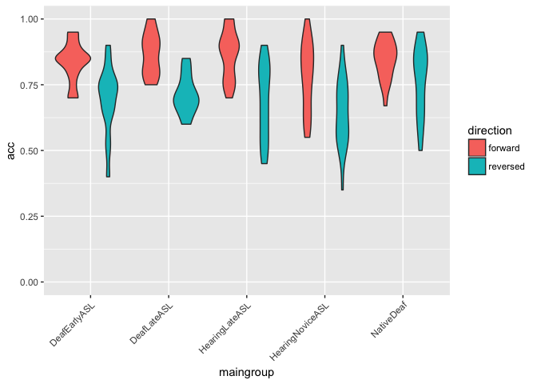
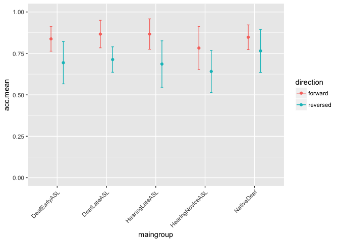
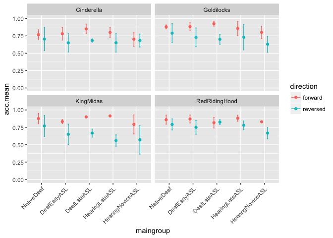

Study 1 Adult Data Analysis
================
Adam Stone, PhD
August 31, 2017

-   [Importing and Reshaping Data](#importing-and-reshaping-data)
-   [Participant Demographics](#participant-demographics)
-   [Accuracy Data Analysis](#accuracy-data-analysis)
-   [Eye Data](#eye-data)

Importing and Reshaping Data
----------------------------

Here we're going to import the data, remove dropped participants, and reshape the data so story and direction are grouping variables (and the dataset will be more tall than wide). Let's see all our data first (scroll horizontally).

<table class="table table-striped table-hover table-condensed" style="font-size: 7px; margin-left: auto; margin-right: auto;">
<thead>
<tr>
<th style="text-align:right;">
id
</th>
<th style="text-align:left;">
participant
</th>
<th style="text-align:left;">
hearing
</th>
<th style="text-align:left;">
videogroup
</th>
<th style="text-align:left;">
aoagroup
</th>
<th style="text-align:left;">
languagegroup
</th>
<th style="text-align:left;">
maingroup
</th>
<th style="text-align:right;">
selfrate
</th>
<th style="text-align:right;">
age
</th>
<th style="text-align:right;">
signyrs
</th>
<th style="text-align:right;">
aoasl
</th>
<th style="text-align:right;">
acc.fw1
</th>
<th style="text-align:right;">
acc.rv2
</th>
<th style="text-align:right;">
acc.fw3
</th>
<th style="text-align:right;">
acc.rv4
</th>
<th style="text-align:right;">
forehead.fw1
</th>
<th style="text-align:right;">
forehead.fw3
</th>
<th style="text-align:right;">
forehead.rv2
</th>
<th style="text-align:right;">
forehead.rv4
</th>
<th style="text-align:right;">
eyes.fw1
</th>
<th style="text-align:right;">
eyes.fw3
</th>
<th style="text-align:right;">
eyes.rv2
</th>
<th style="text-align:right;">
eyes.rv4
</th>
<th style="text-align:right;">
mouth.fw1
</th>
<th style="text-align:right;">
mouth.fw3
</th>
<th style="text-align:right;">
mouth.rv2
</th>
<th style="text-align:right;">
mouth.rv4
</th>
<th style="text-align:right;">
chin.fw1
</th>
<th style="text-align:right;">
chin.fw3
</th>
<th style="text-align:right;">
chin.rv2
</th>
<th style="text-align:right;">
chin.rv4
</th>
<th style="text-align:right;">
upperchest.fw1
</th>
<th style="text-align:right;">
upperchest.fw3
</th>
<th style="text-align:right;">
upperchest.rv2
</th>
<th style="text-align:right;">
upperchest.rv4
</th>
<th style="text-align:right;">
midchest.fw1
</th>
<th style="text-align:right;">
midchest.fw3
</th>
<th style="text-align:right;">
midchest.rv2
</th>
<th style="text-align:right;">
midchest.rv4
</th>
<th style="text-align:right;">
lowerchest.fw1
</th>
<th style="text-align:right;">
lowerchest.fw3
</th>
<th style="text-align:right;">
lowerchest.rv2
</th>
<th style="text-align:right;">
lowerchest.rv4
</th>
<th style="text-align:right;">
belly.fw1
</th>
<th style="text-align:right;">
belly.fw3
</th>
<th style="text-align:right;">
belly.rv2
</th>
<th style="text-align:right;">
belly.rv4
</th>
<th style="text-align:right;">
left.fw1
</th>
<th style="text-align:right;">
left.fw3
</th>
<th style="text-align:right;">
left.rv2
</th>
<th style="text-align:right;">
left.rv4
</th>
<th style="text-align:right;">
right.fw1
</th>
<th style="text-align:right;">
right.fw3
</th>
<th style="text-align:right;">
right.rv2
</th>
<th style="text-align:right;">
right.rv4
</th>
</tr>
</thead>
<tbody>
<tr>
<td style="text-align:right;">
1
</td>
<td style="text-align:left;">
Jessika
</td>
<td style="text-align:left;">
Deaf
</td>
<td style="text-align:left;">
Group 1
</td>
<td style="text-align:left;">
Early
</td>
<td style="text-align:left;">
EarlyASL
</td>
<td style="text-align:left;">
DeafEarlyASL
</td>
<td style="text-align:right;">
5.0
</td>
<td style="text-align:right;">
24.00
</td>
<td style="text-align:right;">
21.00
</td>
<td style="text-align:right;">
3
</td>
<td style="text-align:right;">
0.85
</td>
<td style="text-align:right;">
0.7500
</td>
<td style="text-align:right;">
0.90
</td>
<td style="text-align:right;">
0.80
</td>
<td style="text-align:right;">
NA
</td>
<td style="text-align:right;">
NA
</td>
<td style="text-align:right;">
NA
</td>
<td style="text-align:right;">
0.23
</td>
<td style="text-align:right;">
5.51
</td>
<td style="text-align:right;">
3.70
</td>
<td style="text-align:right;">
3.04
</td>
<td style="text-align:right;">
6.37
</td>
<td style="text-align:right;">
14.73
</td>
<td style="text-align:right;">
25.33
</td>
<td style="text-align:right;">
8.02
</td>
<td style="text-align:right;">
11.58
</td>
<td style="text-align:right;">
0.72
</td>
<td style="text-align:right;">
7.61
</td>
<td style="text-align:right;">
0.43
</td>
<td style="text-align:right;">
0.31
</td>
<td style="text-align:right;">
0.01
</td>
<td style="text-align:right;">
0.04
</td>
<td style="text-align:right;">
NA
</td>
<td style="text-align:right;">
NA
</td>
<td style="text-align:right;">
NA
</td>
<td style="text-align:right;">
0.02
</td>
<td style="text-align:right;">
NA
</td>
<td style="text-align:right;">
NA
</td>
<td style="text-align:right;">
NA
</td>
<td style="text-align:right;">
0.02
</td>
<td style="text-align:right;">
NA
</td>
<td style="text-align:right;">
NA
</td>
<td style="text-align:right;">
NA
</td>
<td style="text-align:right;">
NA
</td>
<td style="text-align:right;">
NA
</td>
<td style="text-align:right;">
NA
</td>
<td style="text-align:right;">
NA
</td>
<td style="text-align:right;">
NA
</td>
<td style="text-align:right;">
NA
</td>
<td style="text-align:right;">
NA
</td>
<td style="text-align:right;">
NA
</td>
<td style="text-align:right;">
NA
</td>
<td style="text-align:right;">
NA
</td>
<td style="text-align:right;">
NA
</td>
</tr>
<tr>
<td style="text-align:right;">
2
</td>
<td style="text-align:left;">
Derek
</td>
<td style="text-align:left;">
Deaf
</td>
<td style="text-align:left;">
Group 1
</td>
<td style="text-align:left;">
Early
</td>
<td style="text-align:left;">
EarlyASL
</td>
<td style="text-align:left;">
DeafEarlyASL
</td>
<td style="text-align:right;">
5.0
</td>
<td style="text-align:right;">
41.00
</td>
<td style="text-align:right;">
38.00
</td>
<td style="text-align:right;">
3
</td>
<td style="text-align:right;">
0.80
</td>
<td style="text-align:right;">
0.7000
</td>
<td style="text-align:right;">
0.85
</td>
<td style="text-align:right;">
0.65
</td>
<td style="text-align:right;">
NA
</td>
<td style="text-align:right;">
0.02
</td>
<td style="text-align:right;">
0.01
</td>
<td style="text-align:right;">
NA
</td>
<td style="text-align:right;">
0.53
</td>
<td style="text-align:right;">
2.09
</td>
<td style="text-align:right;">
3.08
</td>
<td style="text-align:right;">
1.20
</td>
<td style="text-align:right;">
16.98
</td>
<td style="text-align:right;">
29.47
</td>
<td style="text-align:right;">
5.44
</td>
<td style="text-align:right;">
11.70
</td>
<td style="text-align:right;">
3.29
</td>
<td style="text-align:right;">
4.14
</td>
<td style="text-align:right;">
0.52
</td>
<td style="text-align:right;">
2.46
</td>
<td style="text-align:right;">
0.22
</td>
<td style="text-align:right;">
NA
</td>
<td style="text-align:right;">
0.01
</td>
<td style="text-align:right;">
0.27
</td>
<td style="text-align:right;">
NA
</td>
<td style="text-align:right;">
0.01
</td>
<td style="text-align:right;">
0.02
</td>
<td style="text-align:right;">
0.32
</td>
<td style="text-align:right;">
NA
</td>
<td style="text-align:right;">
NA
</td>
<td style="text-align:right;">
0.02
</td>
<td style="text-align:right;">
0.20
</td>
<td style="text-align:right;">
NA
</td>
<td style="text-align:right;">
NA
</td>
<td style="text-align:right;">
0.38
</td>
<td style="text-align:right;">
NA
</td>
<td style="text-align:right;">
NA
</td>
<td style="text-align:right;">
NA
</td>
<td style="text-align:right;">
0.03
</td>
<td style="text-align:right;">
NA
</td>
<td style="text-align:right;">
NA
</td>
<td style="text-align:right;">
NA
</td>
<td style="text-align:right;">
NA
</td>
<td style="text-align:right;">
NA
</td>
</tr>
<tr>
<td style="text-align:right;">
3
</td>
<td style="text-align:left;">
Vanessa\_Deaf
</td>
<td style="text-align:left;">
Deaf
</td>
<td style="text-align:left;">
Group 2
</td>
<td style="text-align:left;">
Early
</td>
<td style="text-align:left;">
EarlyASL
</td>
<td style="text-align:left;">
DeafEarlyASL
</td>
<td style="text-align:right;">
5.0
</td>
<td style="text-align:right;">
34.00
</td>
<td style="text-align:right;">
30.00
</td>
<td style="text-align:right;">
4
</td>
<td style="text-align:right;">
0.85
</td>
<td style="text-align:right;">
0.7000
</td>
<td style="text-align:right;">
0.80
</td>
<td style="text-align:right;">
0.65
</td>
<td style="text-align:right;">
NA
</td>
<td style="text-align:right;">
0.02
</td>
<td style="text-align:right;">
0.02
</td>
<td style="text-align:right;">
0.12
</td>
<td style="text-align:right;">
0.32
</td>
<td style="text-align:right;">
1.77
</td>
<td style="text-align:right;">
0.05
</td>
<td style="text-align:right;">
2.22
</td>
<td style="text-align:right;">
15.87
</td>
<td style="text-align:right;">
17.98
</td>
<td style="text-align:right;">
32.13
</td>
<td style="text-align:right;">
11.72
</td>
<td style="text-align:right;">
0.52
</td>
<td style="text-align:right;">
0.57
</td>
<td style="text-align:right;">
3.36
</td>
<td style="text-align:right;">
4.30
</td>
<td style="text-align:right;">
0.03
</td>
<td style="text-align:right;">
0.03
</td>
<td style="text-align:right;">
0.01
</td>
<td style="text-align:right;">
0.18
</td>
<td style="text-align:right;">
0.23
</td>
<td style="text-align:right;">
0.01
</td>
<td style="text-align:right;">
NA
</td>
<td style="text-align:right;">
0.06
</td>
<td style="text-align:right;">
NA
</td>
<td style="text-align:right;">
NA
</td>
<td style="text-align:right;">
NA
</td>
<td style="text-align:right;">
0.01
</td>
<td style="text-align:right;">
NA
</td>
<td style="text-align:right;">
NA
</td>
<td style="text-align:right;">
NA
</td>
<td style="text-align:right;">
NA
</td>
<td style="text-align:right;">
NA
</td>
<td style="text-align:right;">
NA
</td>
<td style="text-align:right;">
NA
</td>
<td style="text-align:right;">
NA
</td>
<td style="text-align:right;">
NA
</td>
<td style="text-align:right;">
NA
</td>
<td style="text-align:right;">
NA
</td>
<td style="text-align:right;">
0.02
</td>
</tr>
<tr>
<td style="text-align:right;">
4
</td>
<td style="text-align:left;">
Josh
</td>
<td style="text-align:left;">
Deaf
</td>
<td style="text-align:left;">
Group 2
</td>
<td style="text-align:left;">
Early
</td>
<td style="text-align:left;">
EarlyASL
</td>
<td style="text-align:left;">
DeafEarlyASL
</td>
<td style="text-align:right;">
5.0
</td>
<td style="text-align:right;">
31.00
</td>
<td style="text-align:right;">
27.00
</td>
<td style="text-align:right;">
4
</td>
<td style="text-align:right;">
0.95
</td>
<td style="text-align:right;">
0.5000
</td>
<td style="text-align:right;">
0.85
</td>
<td style="text-align:right;">
0.75
</td>
<td style="text-align:right;">
NA
</td>
<td style="text-align:right;">
NA
</td>
<td style="text-align:right;">
NA
</td>
<td style="text-align:right;">
NA
</td>
<td style="text-align:right;">
0.72
</td>
<td style="text-align:right;">
NA
</td>
<td style="text-align:right;">
0.06
</td>
<td style="text-align:right;">
NA
</td>
<td style="text-align:right;">
19.77
</td>
<td style="text-align:right;">
16.46
</td>
<td style="text-align:right;">
28.94
</td>
<td style="text-align:right;">
14.28
</td>
<td style="text-align:right;">
6.19
</td>
<td style="text-align:right;">
4.14
</td>
<td style="text-align:right;">
9.58
</td>
<td style="text-align:right;">
5.78
</td>
<td style="text-align:right;">
0.12
</td>
<td style="text-align:right;">
0.06
</td>
<td style="text-align:right;">
0.34
</td>
<td style="text-align:right;">
0.45
</td>
<td style="text-align:right;">
0.03
</td>
<td style="text-align:right;">
0.02
</td>
<td style="text-align:right;">
0.49
</td>
<td style="text-align:right;">
NA
</td>
<td style="text-align:right;">
NA
</td>
<td style="text-align:right;">
0.02
</td>
<td style="text-align:right;">
0.01
</td>
<td style="text-align:right;">
NA
</td>
<td style="text-align:right;">
NA
</td>
<td style="text-align:right;">
0.02
</td>
<td style="text-align:right;">
NA
</td>
<td style="text-align:right;">
NA
</td>
<td style="text-align:right;">
NA
</td>
<td style="text-align:right;">
NA
</td>
<td style="text-align:right;">
0.79
</td>
<td style="text-align:right;">
NA
</td>
<td style="text-align:right;">
0.12
</td>
<td style="text-align:right;">
NA
</td>
<td style="text-align:right;">
NA
</td>
<td style="text-align:right;">
0.09
</td>
</tr>
<tr>
<td style="text-align:right;">
5
</td>
<td style="text-align:left;">
Lynnette
</td>
<td style="text-align:left;">
Deaf
</td>
<td style="text-align:left;">
Group 1
</td>
<td style="text-align:left;">
Early
</td>
<td style="text-align:left;">
EarlyASL
</td>
<td style="text-align:left;">
DeafEarlyASL
</td>
<td style="text-align:right;">
5.0
</td>
<td style="text-align:right;">
39.00
</td>
<td style="text-align:right;">
34.00
</td>
<td style="text-align:right;">
5
</td>
<td style="text-align:right;">
0.90
</td>
<td style="text-align:right;">
0.6500
</td>
<td style="text-align:right;">
0.70
</td>
<td style="text-align:right;">
0.75
</td>
<td style="text-align:right;">
NA
</td>
<td style="text-align:right;">
0.17
</td>
<td style="text-align:right;">
NA
</td>
<td style="text-align:right;">
0.03
</td>
<td style="text-align:right;">
3.17
</td>
<td style="text-align:right;">
0.08
</td>
<td style="text-align:right;">
0.41
</td>
<td style="text-align:right;">
0.37
</td>
<td style="text-align:right;">
16.91
</td>
<td style="text-align:right;">
1.82
</td>
<td style="text-align:right;">
2.26
</td>
<td style="text-align:right;">
1.44
</td>
<td style="text-align:right;">
0.15
</td>
<td style="text-align:right;">
0.76
</td>
<td style="text-align:right;">
3.10
</td>
<td style="text-align:right;">
0.06
</td>
<td style="text-align:right;">
NA
</td>
<td style="text-align:right;">
NA
</td>
<td style="text-align:right;">
0.01
</td>
<td style="text-align:right;">
0.02
</td>
<td style="text-align:right;">
NA
</td>
<td style="text-align:right;">
0.01
</td>
<td style="text-align:right;">
NA
</td>
<td style="text-align:right;">
0.01
</td>
<td style="text-align:right;">
NA
</td>
<td style="text-align:right;">
NA
</td>
<td style="text-align:right;">
NA
</td>
<td style="text-align:right;">
0.01
</td>
<td style="text-align:right;">
NA
</td>
<td style="text-align:right;">
0.01
</td>
<td style="text-align:right;">
NA
</td>
<td style="text-align:right;">
NA
</td>
<td style="text-align:right;">
NA
</td>
<td style="text-align:right;">
NA
</td>
<td style="text-align:right;">
NA
</td>
<td style="text-align:right;">
NA
</td>
<td style="text-align:right;">
NA
</td>
<td style="text-align:right;">
0.06
</td>
<td style="text-align:right;">
0.37
</td>
<td style="text-align:right;">
0.02
</td>
</tr>
<tr>
<td style="text-align:right;">
6
</td>
<td style="text-align:left;">
Laura P (missing stories)
</td>
<td style="text-align:left;">
Deaf
</td>
<td style="text-align:left;">
Group 1
</td>
<td style="text-align:left;">
Early
</td>
<td style="text-align:left;">
EarlyASL
</td>
<td style="text-align:left;">
DeafEarlyASL
</td>
<td style="text-align:right;">
5.0
</td>
<td style="text-align:right;">
37.00
</td>
<td style="text-align:right;">
29.00
</td>
<td style="text-align:right;">
8
</td>
<td style="text-align:right;">
0.95
</td>
<td style="text-align:right;">
0.7500
</td>
<td style="text-align:right;">
0.70
</td>
<td style="text-align:right;">
0.90
</td>
<td style="text-align:right;">
NA
</td>
<td style="text-align:right;">
NA
</td>
<td style="text-align:right;">
NA
</td>
<td style="text-align:right;">
NA
</td>
<td style="text-align:right;">
NA
</td>
<td style="text-align:right;">
3.01
</td>
<td style="text-align:right;">
NA
</td>
<td style="text-align:right;">
0.72
</td>
<td style="text-align:right;">
NA
</td>
<td style="text-align:right;">
31.72
</td>
<td style="text-align:right;">
NA
</td>
<td style="text-align:right;">
2.69
</td>
<td style="text-align:right;">
NA
</td>
<td style="text-align:right;">
0.54
</td>
<td style="text-align:right;">
NA
</td>
<td style="text-align:right;">
0.37
</td>
<td style="text-align:right;">
NA
</td>
<td style="text-align:right;">
0.03
</td>
<td style="text-align:right;">
NA
</td>
<td style="text-align:right;">
0.01
</td>
<td style="text-align:right;">
NA
</td>
<td style="text-align:right;">
0.01
</td>
<td style="text-align:right;">
NA
</td>
<td style="text-align:right;">
NA
</td>
<td style="text-align:right;">
NA
</td>
<td style="text-align:right;">
NA
</td>
<td style="text-align:right;">
NA
</td>
<td style="text-align:right;">
NA
</td>
<td style="text-align:right;">
NA
</td>
<td style="text-align:right;">
NA
</td>
<td style="text-align:right;">
NA
</td>
<td style="text-align:right;">
NA
</td>
<td style="text-align:right;">
NA
</td>
<td style="text-align:right;">
NA
</td>
<td style="text-align:right;">
NA
</td>
<td style="text-align:right;">
NA
</td>
<td style="text-align:right;">
NA
</td>
<td style="text-align:right;">
0.17
</td>
<td style="text-align:right;">
NA
</td>
<td style="text-align:right;">
0.01
</td>
</tr>
<tr>
<td style="text-align:right;">
7
</td>
<td style="text-align:left;">
Rebecca
</td>
<td style="text-align:left;">
Deaf
</td>
<td style="text-align:left;">
Group 1
</td>
<td style="text-align:left;">
Early
</td>
<td style="text-align:left;">
EarlyASL
</td>
<td style="text-align:left;">
DeafEarlyASL
</td>
<td style="text-align:right;">
5.0
</td>
<td style="text-align:right;">
38.00
</td>
<td style="text-align:right;">
29.00
</td>
<td style="text-align:right;">
9
</td>
<td style="text-align:right;">
0.85
</td>
<td style="text-align:right;">
0.4000
</td>
<td style="text-align:right;">
0.75
</td>
<td style="text-align:right;">
0.55
</td>
<td style="text-align:right;">
NA
</td>
<td style="text-align:right;">
NA
</td>
<td style="text-align:right;">
NA
</td>
<td style="text-align:right;">
NA
</td>
<td style="text-align:right;">
0.01
</td>
<td style="text-align:right;">
NA
</td>
<td style="text-align:right;">
0.02
</td>
<td style="text-align:right;">
NA
</td>
<td style="text-align:right;">
8.31
</td>
<td style="text-align:right;">
0.40
</td>
<td style="text-align:right;">
0.02
</td>
<td style="text-align:right;">
2.06
</td>
<td style="text-align:right;">
11.80
</td>
<td style="text-align:right;">
2.16
</td>
<td style="text-align:right;">
0.44
</td>
<td style="text-align:right;">
3.09
</td>
<td style="text-align:right;">
0.08
</td>
<td style="text-align:right;">
0.32
</td>
<td style="text-align:right;">
0.32
</td>
<td style="text-align:right;">
0.46
</td>
<td style="text-align:right;">
NA
</td>
<td style="text-align:right;">
0.01
</td>
<td style="text-align:right;">
0.01
</td>
<td style="text-align:right;">
0.02
</td>
<td style="text-align:right;">
NA
</td>
<td style="text-align:right;">
0.01
</td>
<td style="text-align:right;">
NA
</td>
<td style="text-align:right;">
NA
</td>
<td style="text-align:right;">
NA
</td>
<td style="text-align:right;">
0.04
</td>
<td style="text-align:right;">
NA
</td>
<td style="text-align:right;">
NA
</td>
<td style="text-align:right;">
NA
</td>
<td style="text-align:right;">
NA
</td>
<td style="text-align:right;">
NA
</td>
<td style="text-align:right;">
NA
</td>
<td style="text-align:right;">
NA
</td>
<td style="text-align:right;">
3.90
</td>
<td style="text-align:right;">
NA
</td>
<td style="text-align:right;">
NA
</td>
</tr>
<tr>
<td style="text-align:right;">
8
</td>
<td style="text-align:left;">
Cathy
</td>
<td style="text-align:left;">
Deaf
</td>
<td style="text-align:left;">
Group 2
</td>
<td style="text-align:left;">
Early
</td>
<td style="text-align:left;">
EarlyASL
</td>
<td style="text-align:left;">
DeafEarlyASL
</td>
<td style="text-align:right;">
5.0
</td>
<td style="text-align:right;">
39.00
</td>
<td style="text-align:right;">
30.00
</td>
<td style="text-align:right;">
9
</td>
<td style="text-align:right;">
0.85
</td>
<td style="text-align:right;">
0.7500
</td>
<td style="text-align:right;">
0.85
</td>
<td style="text-align:right;">
0.85
</td>
<td style="text-align:right;">
NA
</td>
<td style="text-align:right;">
NA
</td>
<td style="text-align:right;">
NA
</td>
<td style="text-align:right;">
NA
</td>
<td style="text-align:right;">
NA
</td>
<td style="text-align:right;">
NA
</td>
<td style="text-align:right;">
NA
</td>
<td style="text-align:right;">
NA
</td>
<td style="text-align:right;">
NA
</td>
<td style="text-align:right;">
NA
</td>
<td style="text-align:right;">
NA
</td>
<td style="text-align:right;">
NA
</td>
<td style="text-align:right;">
NA
</td>
<td style="text-align:right;">
NA
</td>
<td style="text-align:right;">
NA
</td>
<td style="text-align:right;">
NA
</td>
<td style="text-align:right;">
NA
</td>
<td style="text-align:right;">
NA
</td>
<td style="text-align:right;">
NA
</td>
<td style="text-align:right;">
NA
</td>
<td style="text-align:right;">
NA
</td>
<td style="text-align:right;">
NA
</td>
<td style="text-align:right;">
NA
</td>
<td style="text-align:right;">
NA
</td>
<td style="text-align:right;">
NA
</td>
<td style="text-align:right;">
NA
</td>
<td style="text-align:right;">
NA
</td>
<td style="text-align:right;">
NA
</td>
<td style="text-align:right;">
NA
</td>
<td style="text-align:right;">
NA
</td>
<td style="text-align:right;">
NA
</td>
<td style="text-align:right;">
NA
</td>
<td style="text-align:right;">
NA
</td>
<td style="text-align:right;">
NA
</td>
<td style="text-align:right;">
NA
</td>
<td style="text-align:right;">
NA
</td>
<td style="text-align:right;">
NA
</td>
<td style="text-align:right;">
NA
</td>
<td style="text-align:right;">
NA
</td>
<td style="text-align:right;">
NA
</td>
</tr>
<tr>
<td style="text-align:right;">
9
</td>
<td style="text-align:left;">
Crystal
</td>
<td style="text-align:left;">
Deaf
</td>
<td style="text-align:left;">
Group 2
</td>
<td style="text-align:left;">
Early
</td>
<td style="text-align:left;">
LateASL
</td>
<td style="text-align:left;">
DeafLateASL
</td>
<td style="text-align:right;">
5.0
</td>
<td style="text-align:right;">
39.00
</td>
<td style="text-align:right;">
29.00
</td>
<td style="text-align:right;">
10
</td>
<td style="text-align:right;">
0.90
</td>
<td style="text-align:right;">
0.6667
</td>
<td style="text-align:right;">
0.80
</td>
<td style="text-align:right;">
0.80
</td>
<td style="text-align:right;">
NA
</td>
<td style="text-align:right;">
0.00
</td>
<td style="text-align:right;">
NA
</td>
<td style="text-align:right;">
0.02
</td>
<td style="text-align:right;">
4.78
</td>
<td style="text-align:right;">
10.02
</td>
<td style="text-align:right;">
18.82
</td>
<td style="text-align:right;">
7.30
</td>
<td style="text-align:right;">
13.26
</td>
<td style="text-align:right;">
11.34
</td>
<td style="text-align:right;">
17.52
</td>
<td style="text-align:right;">
13.63
</td>
<td style="text-align:right;">
0.14
</td>
<td style="text-align:right;">
0.09
</td>
<td style="text-align:right;">
0.04
</td>
<td style="text-align:right;">
0.02
</td>
<td style="text-align:right;">
NA
</td>
<td style="text-align:right;">
0.10
</td>
<td style="text-align:right;">
0.01
</td>
<td style="text-align:right;">
NA
</td>
<td style="text-align:right;">
NA
</td>
<td style="text-align:right;">
0.02
</td>
<td style="text-align:right;">
0.01
</td>
<td style="text-align:right;">
0.01
</td>
<td style="text-align:right;">
NA
</td>
<td style="text-align:right;">
0.01
</td>
<td style="text-align:right;">
NA
</td>
<td style="text-align:right;">
NA
</td>
<td style="text-align:right;">
NA
</td>
<td style="text-align:right;">
0.03
</td>
<td style="text-align:right;">
NA
</td>
<td style="text-align:right;">
NA
</td>
<td style="text-align:right;">
0.16
</td>
<td style="text-align:right;">
NA
</td>
<td style="text-align:right;">
NA
</td>
<td style="text-align:right;">
NA
</td>
<td style="text-align:right;">
NA
</td>
<td style="text-align:right;">
NA
</td>
<td style="text-align:right;">
0.07
</td>
<td style="text-align:right;">
NA
</td>
</tr>
<tr>
<td style="text-align:right;">
10
</td>
<td style="text-align:left;">
Chrissy G.
</td>
<td style="text-align:left;">
Deaf
</td>
<td style="text-align:left;">
Group 1
</td>
<td style="text-align:left;">
Early
</td>
<td style="text-align:left;">
LateASL
</td>
<td style="text-align:left;">
DeafLateASL
</td>
<td style="text-align:right;">
5.0
</td>
<td style="text-align:right;">
43.00
</td>
<td style="text-align:right;">
27.00
</td>
<td style="text-align:right;">
12
</td>
<td style="text-align:right;">
0.90
</td>
<td style="text-align:right;">
0.7000
</td>
<td style="text-align:right;">
0.90
</td>
<td style="text-align:right;">
0.65
</td>
<td style="text-align:right;">
NA
</td>
<td style="text-align:right;">
NA
</td>
<td style="text-align:right;">
NA
</td>
<td style="text-align:right;">
NA
</td>
<td style="text-align:right;">
NA
</td>
<td style="text-align:right;">
NA
</td>
<td style="text-align:right;">
NA
</td>
<td style="text-align:right;">
NA
</td>
<td style="text-align:right;">
NA
</td>
<td style="text-align:right;">
NA
</td>
<td style="text-align:right;">
NA
</td>
<td style="text-align:right;">
NA
</td>
<td style="text-align:right;">
NA
</td>
<td style="text-align:right;">
NA
</td>
<td style="text-align:right;">
NA
</td>
<td style="text-align:right;">
NA
</td>
<td style="text-align:right;">
NA
</td>
<td style="text-align:right;">
NA
</td>
<td style="text-align:right;">
NA
</td>
<td style="text-align:right;">
NA
</td>
<td style="text-align:right;">
NA
</td>
<td style="text-align:right;">
NA
</td>
<td style="text-align:right;">
NA
</td>
<td style="text-align:right;">
NA
</td>
<td style="text-align:right;">
NA
</td>
<td style="text-align:right;">
NA
</td>
<td style="text-align:right;">
NA
</td>
<td style="text-align:right;">
NA
</td>
<td style="text-align:right;">
NA
</td>
<td style="text-align:right;">
NA
</td>
<td style="text-align:right;">
NA
</td>
<td style="text-align:right;">
NA
</td>
<td style="text-align:right;">
NA
</td>
<td style="text-align:right;">
NA
</td>
<td style="text-align:right;">
NA
</td>
<td style="text-align:right;">
NA
</td>
<td style="text-align:right;">
NA
</td>
<td style="text-align:right;">
NA
</td>
<td style="text-align:right;">
NA
</td>
<td style="text-align:right;">
NA
</td>
</tr>
<tr>
<td style="text-align:right;">
11
</td>
<td style="text-align:left;">
Adam
</td>
<td style="text-align:left;">
Deaf
</td>
<td style="text-align:left;">
Group 1
</td>
<td style="text-align:left;">
Early
</td>
<td style="text-align:left;">
LateASL
</td>
<td style="text-align:left;">
DeafLateASL
</td>
<td style="text-align:right;">
5.0
</td>
<td style="text-align:right;">
26.00
</td>
<td style="text-align:right;">
13.00
</td>
<td style="text-align:right;">
13
</td>
<td style="text-align:right;">
0.80
</td>
<td style="text-align:right;">
0.7000
</td>
<td style="text-align:right;">
NA
</td>
<td style="text-align:right;">
NA
</td>
<td style="text-align:right;">
NA
</td>
<td style="text-align:right;">
NA
</td>
<td style="text-align:right;">
NA
</td>
<td style="text-align:right;">
NA
</td>
<td style="text-align:right;">
3.78
</td>
<td style="text-align:right;">
4.90
</td>
<td style="text-align:right;">
1.03
</td>
<td style="text-align:right;">
2.28
</td>
<td style="text-align:right;">
17.31
</td>
<td style="text-align:right;">
31.70
</td>
<td style="text-align:right;">
10.39
</td>
<td style="text-align:right;">
10.89
</td>
<td style="text-align:right;">
0.23
</td>
<td style="text-align:right;">
0.44
</td>
<td style="text-align:right;">
0.28
</td>
<td style="text-align:right;">
0.06
</td>
<td style="text-align:right;">
NA
</td>
<td style="text-align:right;">
NA
</td>
<td style="text-align:right;">
NA
</td>
<td style="text-align:right;">
0.22
</td>
<td style="text-align:right;">
NA
</td>
<td style="text-align:right;">
NA
</td>
<td style="text-align:right;">
NA
</td>
<td style="text-align:right;">
NA
</td>
<td style="text-align:right;">
NA
</td>
<td style="text-align:right;">
NA
</td>
<td style="text-align:right;">
NA
</td>
<td style="text-align:right;">
NA
</td>
<td style="text-align:right;">
NA
</td>
<td style="text-align:right;">
NA
</td>
<td style="text-align:right;">
NA
</td>
<td style="text-align:right;">
NA
</td>
<td style="text-align:right;">
NA
</td>
<td style="text-align:right;">
NA
</td>
<td style="text-align:right;">
NA
</td>
<td style="text-align:right;">
NA
</td>
<td style="text-align:right;">
NA
</td>
<td style="text-align:right;">
NA
</td>
<td style="text-align:right;">
NA
</td>
<td style="text-align:right;">
0.01
</td>
</tr>
<tr>
<td style="text-align:right;">
12
</td>
<td style="text-align:left;">
Brad
</td>
<td style="text-align:left;">
Deaf
</td>
<td style="text-align:left;">
Group 1
</td>
<td style="text-align:left;">
Early
</td>
<td style="text-align:left;">
LateASL
</td>
<td style="text-align:left;">
DeafLateASL
</td>
<td style="text-align:right;">
5.0
</td>
<td style="text-align:right;">
34.00
</td>
<td style="text-align:right;">
21.00
</td>
<td style="text-align:right;">
13
</td>
<td style="text-align:right;">
0.75
</td>
<td style="text-align:right;">
0.6000
</td>
<td style="text-align:right;">
0.80
</td>
<td style="text-align:right;">
0.75
</td>
<td style="text-align:right;">
NA
</td>
<td style="text-align:right;">
NA
</td>
<td style="text-align:right;">
NA
</td>
<td style="text-align:right;">
NA
</td>
<td style="text-align:right;">
3.46
</td>
<td style="text-align:right;">
0.06
</td>
<td style="text-align:right;">
0.42
</td>
<td style="text-align:right;">
0.15
</td>
<td style="text-align:right;">
17.29
</td>
<td style="text-align:right;">
10.87
</td>
<td style="text-align:right;">
11.42
</td>
<td style="text-align:right;">
17.42
</td>
<td style="text-align:right;">
0.15
</td>
<td style="text-align:right;">
0.88
</td>
<td style="text-align:right;">
0.56
</td>
<td style="text-align:right;">
0.38
</td>
<td style="text-align:right;">
0.01
</td>
<td style="text-align:right;">
NA
</td>
<td style="text-align:right;">
0.24
</td>
<td style="text-align:right;">
NA
</td>
<td style="text-align:right;">
NA
</td>
<td style="text-align:right;">
0.01
</td>
<td style="text-align:right;">
NA
</td>
<td style="text-align:right;">
NA
</td>
<td style="text-align:right;">
NA
</td>
<td style="text-align:right;">
0.01
</td>
<td style="text-align:right;">
NA
</td>
<td style="text-align:right;">
NA
</td>
<td style="text-align:right;">
NA
</td>
<td style="text-align:right;">
0.08
</td>
<td style="text-align:right;">
NA
</td>
<td style="text-align:right;">
NA
</td>
<td style="text-align:right;">
NA
</td>
<td style="text-align:right;">
NA
</td>
<td style="text-align:right;">
NA
</td>
<td style="text-align:right;">
NA
</td>
<td style="text-align:right;">
0.01
</td>
<td style="text-align:right;">
NA
</td>
<td style="text-align:right;">
NA
</td>
<td style="text-align:right;">
NA
</td>
</tr>
<tr>
<td style="text-align:right;">
13
</td>
<td style="text-align:left;">
Alicia
</td>
<td style="text-align:left;">
Deaf
</td>
<td style="text-align:left;">
Group 2
</td>
<td style="text-align:left;">
Early
</td>
<td style="text-align:left;">
LateASL
</td>
<td style="text-align:left;">
DeafLateASL
</td>
<td style="text-align:right;">
5.0
</td>
<td style="text-align:right;">
37.00
</td>
<td style="text-align:right;">
23.00
</td>
<td style="text-align:right;">
14
</td>
<td style="text-align:right;">
0.95
</td>
<td style="text-align:right;">
0.7000
</td>
<td style="text-align:right;">
1.00
</td>
<td style="text-align:right;">
0.85
</td>
<td style="text-align:right;">
NA
</td>
<td style="text-align:right;">
NA
</td>
<td style="text-align:right;">
NA
</td>
<td style="text-align:right;">
0.05
</td>
<td style="text-align:right;">
0.85
</td>
<td style="text-align:right;">
0.07
</td>
<td style="text-align:right;">
3.92
</td>
<td style="text-align:right;">
1.05
</td>
<td style="text-align:right;">
14.91
</td>
<td style="text-align:right;">
8.17
</td>
<td style="text-align:right;">
29.22
</td>
<td style="text-align:right;">
13.42
</td>
<td style="text-align:right;">
1.03
</td>
<td style="text-align:right;">
2.23
</td>
<td style="text-align:right;">
1.02
</td>
<td style="text-align:right;">
1.11
</td>
<td style="text-align:right;">
1.26
</td>
<td style="text-align:right;">
0.01
</td>
<td style="text-align:right;">
0.26
</td>
<td style="text-align:right;">
0.36
</td>
<td style="text-align:right;">
0.05
</td>
<td style="text-align:right;">
0.01
</td>
<td style="text-align:right;">
0.29
</td>
<td style="text-align:right;">
1.64
</td>
<td style="text-align:right;">
NA
</td>
<td style="text-align:right;">
0.03
</td>
<td style="text-align:right;">
0.11
</td>
<td style="text-align:right;">
0.16
</td>
<td style="text-align:right;">
NA
</td>
<td style="text-align:right;">
0.13
</td>
<td style="text-align:right;">
0.05
</td>
<td style="text-align:right;">
NA
</td>
<td style="text-align:right;">
NA
</td>
<td style="text-align:right;">
0.65
</td>
<td style="text-align:right;">
1.92
</td>
<td style="text-align:right;">
0.38
</td>
<td style="text-align:right;">
NA
</td>
<td style="text-align:right;">
0.05
</td>
<td style="text-align:right;">
NA
</td>
<td style="text-align:right;">
NA
</td>
</tr>
<tr>
<td style="text-align:right;">
14
</td>
<td style="text-align:left;">
Joe
</td>
<td style="text-align:left;">
Deaf
</td>
<td style="text-align:left;">
Group 2
</td>
<td style="text-align:left;">
Early
</td>
<td style="text-align:left;">
LateASL
</td>
<td style="text-align:left;">
DeafLateASL
</td>
<td style="text-align:right;">
5.0
</td>
<td style="text-align:right;">
44.00
</td>
<td style="text-align:right;">
29.00
</td>
<td style="text-align:right;">
15
</td>
<td style="text-align:right;">
0.90
</td>
<td style="text-align:right;">
0.6000
</td>
<td style="text-align:right;">
0.90
</td>
<td style="text-align:right;">
0.80
</td>
<td style="text-align:right;">
NA
</td>
<td style="text-align:right;">
NA
</td>
<td style="text-align:right;">
NA
</td>
<td style="text-align:right;">
NA
</td>
<td style="text-align:right;">
NA
</td>
<td style="text-align:right;">
NA
</td>
<td style="text-align:right;">
NA
</td>
<td style="text-align:right;">
NA
</td>
<td style="text-align:right;">
NA
</td>
<td style="text-align:right;">
NA
</td>
<td style="text-align:right;">
NA
</td>
<td style="text-align:right;">
NA
</td>
<td style="text-align:right;">
NA
</td>
<td style="text-align:right;">
NA
</td>
<td style="text-align:right;">
NA
</td>
<td style="text-align:right;">
NA
</td>
<td style="text-align:right;">
NA
</td>
<td style="text-align:right;">
NA
</td>
<td style="text-align:right;">
NA
</td>
<td style="text-align:right;">
NA
</td>
<td style="text-align:right;">
NA
</td>
<td style="text-align:right;">
NA
</td>
<td style="text-align:right;">
NA
</td>
<td style="text-align:right;">
NA
</td>
<td style="text-align:right;">
NA
</td>
<td style="text-align:right;">
NA
</td>
<td style="text-align:right;">
NA
</td>
<td style="text-align:right;">
NA
</td>
<td style="text-align:right;">
NA
</td>
<td style="text-align:right;">
NA
</td>
<td style="text-align:right;">
NA
</td>
<td style="text-align:right;">
NA
</td>
<td style="text-align:right;">
NA
</td>
<td style="text-align:right;">
NA
</td>
<td style="text-align:right;">
NA
</td>
<td style="text-align:right;">
NA
</td>
<td style="text-align:right;">
NA
</td>
<td style="text-align:right;">
NA
</td>
<td style="text-align:right;">
NA
</td>
<td style="text-align:right;">
NA
</td>
</tr>
<tr>
<td style="text-align:right;">
15
</td>
<td style="text-align:left;">
Svenna
</td>
<td style="text-align:left;">
Deaf
</td>
<td style="text-align:left;">
Group 2
</td>
<td style="text-align:left;">
Native
</td>
<td style="text-align:left;">
Native
</td>
<td style="text-align:left;">
NativeDeaf
</td>
<td style="text-align:right;">
5.0
</td>
<td style="text-align:right;">
32.00
</td>
<td style="text-align:right;">
32.00
</td>
<td style="text-align:right;">
0
</td>
<td style="text-align:right;">
0.85
</td>
<td style="text-align:right;">
0.9000
</td>
<td style="text-align:right;">
0.95
</td>
<td style="text-align:right;">
0.85
</td>
<td style="text-align:right;">
NA
</td>
<td style="text-align:right;">
NA
</td>
<td style="text-align:right;">
NA
</td>
<td style="text-align:right;">
NA
</td>
<td style="text-align:right;">
3.45
</td>
<td style="text-align:right;">
0.02
</td>
<td style="text-align:right;">
3.71
</td>
<td style="text-align:right;">
0.86
</td>
<td style="text-align:right;">
13.88
</td>
<td style="text-align:right;">
19.59
</td>
<td style="text-align:right;">
31.92
</td>
<td style="text-align:right;">
18.38
</td>
<td style="text-align:right;">
0.47
</td>
<td style="text-align:right;">
1.87
</td>
<td style="text-align:right;">
0.27
</td>
<td style="text-align:right;">
1.73
</td>
<td style="text-align:right;">
NA
</td>
<td style="text-align:right;">
0.07
</td>
<td style="text-align:right;">
0.12
</td>
<td style="text-align:right;">
NA
</td>
<td style="text-align:right;">
NA
</td>
<td style="text-align:right;">
NA
</td>
<td style="text-align:right;">
0.01
</td>
<td style="text-align:right;">
NA
</td>
<td style="text-align:right;">
NA
</td>
<td style="text-align:right;">
NA
</td>
<td style="text-align:right;">
NA
</td>
<td style="text-align:right;">
NA
</td>
<td style="text-align:right;">
NA
</td>
<td style="text-align:right;">
NA
</td>
<td style="text-align:right;">
NA
</td>
<td style="text-align:right;">
NA
</td>
<td style="text-align:right;">
NA
</td>
<td style="text-align:right;">
NA
</td>
<td style="text-align:right;">
NA
</td>
<td style="text-align:right;">
NA
</td>
<td style="text-align:right;">
NA
</td>
<td style="text-align:right;">
NA
</td>
<td style="text-align:right;">
NA
</td>
<td style="text-align:right;">
0.22
</td>
</tr>
<tr>
<td style="text-align:right;">
16
</td>
<td style="text-align:left;">
Monica
</td>
<td style="text-align:left;">
Deaf
</td>
<td style="text-align:left;">
Group 1
</td>
<td style="text-align:left;">
Native
</td>
<td style="text-align:left;">
Native
</td>
<td style="text-align:left;">
NativeDeaf
</td>
<td style="text-align:right;">
5.0
</td>
<td style="text-align:right;">
24.00
</td>
<td style="text-align:right;">
24.00
</td>
<td style="text-align:right;">
0
</td>
<td style="text-align:right;">
0.80
</td>
<td style="text-align:right;">
0.8500
</td>
<td style="text-align:right;">
0.75
</td>
<td style="text-align:right;">
0.70
</td>
<td style="text-align:right;">
NA
</td>
<td style="text-align:right;">
NA
</td>
<td style="text-align:right;">
NA
</td>
<td style="text-align:right;">
7.17
</td>
<td style="text-align:right;">
5.89
</td>
<td style="text-align:right;">
5.05
</td>
<td style="text-align:right;">
1.34
</td>
<td style="text-align:right;">
10.43
</td>
<td style="text-align:right;">
15.25
</td>
<td style="text-align:right;">
29.36
</td>
<td style="text-align:right;">
5.59
</td>
<td style="text-align:right;">
0.59
</td>
<td style="text-align:right;">
0.33
</td>
<td style="text-align:right;">
1.51
</td>
<td style="text-align:right;">
4.21
</td>
<td style="text-align:right;">
0.01
</td>
<td style="text-align:right;">
NA
</td>
<td style="text-align:right;">
NA
</td>
<td style="text-align:right;">
0.13
</td>
<td style="text-align:right;">
NA
</td>
<td style="text-align:right;">
NA
</td>
<td style="text-align:right;">
NA
</td>
<td style="text-align:right;">
0.01
</td>
<td style="text-align:right;">
NA
</td>
<td style="text-align:right;">
NA
</td>
<td style="text-align:right;">
NA
</td>
<td style="text-align:right;">
NA
</td>
<td style="text-align:right;">
NA
</td>
<td style="text-align:right;">
NA
</td>
<td style="text-align:right;">
NA
</td>
<td style="text-align:right;">
0.02
</td>
<td style="text-align:right;">
NA
</td>
<td style="text-align:right;">
NA
</td>
<td style="text-align:right;">
0.02
</td>
<td style="text-align:right;">
NA
</td>
<td style="text-align:right;">
0.03
</td>
<td style="text-align:right;">
NA
</td>
<td style="text-align:right;">
0.01
</td>
<td style="text-align:right;">
NA
</td>
<td style="text-align:right;">
NA
</td>
</tr>
<tr>
<td style="text-align:right;">
17
</td>
<td style="text-align:left;">
Valerie
</td>
<td style="text-align:left;">
Deaf
</td>
<td style="text-align:left;">
Group 1
</td>
<td style="text-align:left;">
Native
</td>
<td style="text-align:left;">
Native
</td>
<td style="text-align:left;">
NativeDeaf
</td>
<td style="text-align:right;">
5.0
</td>
<td style="text-align:right;">
29.00
</td>
<td style="text-align:right;">
29.00
</td>
<td style="text-align:right;">
0
</td>
<td style="text-align:right;">
0.90
</td>
<td style="text-align:right;">
0.8000
</td>
<td style="text-align:right;">
0.76
</td>
<td style="text-align:right;">
0.85
</td>
<td style="text-align:right;">
NA
</td>
<td style="text-align:right;">
NA
</td>
<td style="text-align:right;">
NA
</td>
<td style="text-align:right;">
NA
</td>
<td style="text-align:right;">
0.11
</td>
<td style="text-align:right;">
0.05
</td>
<td style="text-align:right;">
NA
</td>
<td style="text-align:right;">
NA
</td>
<td style="text-align:right;">
15.54
</td>
<td style="text-align:right;">
3.33
</td>
<td style="text-align:right;">
1.80
</td>
<td style="text-align:right;">
NA
</td>
<td style="text-align:right;">
5.08
</td>
<td style="text-align:right;">
32.94
</td>
<td style="text-align:right;">
12.87
</td>
<td style="text-align:right;">
0.50
</td>
<td style="text-align:right;">
0.02
</td>
<td style="text-align:right;">
0.40
</td>
<td style="text-align:right;">
0.09
</td>
<td style="text-align:right;">
0.02
</td>
<td style="text-align:right;">
NA
</td>
<td style="text-align:right;">
NA
</td>
<td style="text-align:right;">
NA
</td>
<td style="text-align:right;">
NA
</td>
<td style="text-align:right;">
NA
</td>
<td style="text-align:right;">
NA
</td>
<td style="text-align:right;">
NA
</td>
<td style="text-align:right;">
NA
</td>
<td style="text-align:right;">
NA
</td>
<td style="text-align:right;">
NA
</td>
<td style="text-align:right;">
NA
</td>
<td style="text-align:right;">
NA
</td>
<td style="text-align:right;">
NA
</td>
<td style="text-align:right;">
NA
</td>
<td style="text-align:right;">
NA
</td>
<td style="text-align:right;">
NA
</td>
<td style="text-align:right;">
NA
</td>
<td style="text-align:right;">
NA
</td>
<td style="text-align:right;">
NA
</td>
<td style="text-align:right;">
NA
</td>
</tr>
<tr>
<td style="text-align:right;">
18
</td>
<td style="text-align:left;">
Lucy
</td>
<td style="text-align:left;">
Deaf
</td>
<td style="text-align:left;">
Group 2
</td>
<td style="text-align:left;">
Native
</td>
<td style="text-align:left;">
Native
</td>
<td style="text-align:left;">
NativeDeaf
</td>
<td style="text-align:right;">
5.0
</td>
<td style="text-align:right;">
37.00
</td>
<td style="text-align:right;">
37.00
</td>
<td style="text-align:right;">
0
</td>
<td style="text-align:right;">
0.85
</td>
<td style="text-align:right;">
0.6500
</td>
<td style="text-align:right;">
0.90
</td>
<td style="text-align:right;">
0.85
</td>
<td style="text-align:right;">
NA
</td>
<td style="text-align:right;">
NA
</td>
<td style="text-align:right;">
NA
</td>
<td style="text-align:right;">
NA
</td>
<td style="text-align:right;">
0.15
</td>
<td style="text-align:right;">
NA
</td>
<td style="text-align:right;">
0.03
</td>
<td style="text-align:right;">
NA
</td>
<td style="text-align:right;">
16.40
</td>
<td style="text-align:right;">
17.95
</td>
<td style="text-align:right;">
35.04
</td>
<td style="text-align:right;">
14.53
</td>
<td style="text-align:right;">
0.41
</td>
<td style="text-align:right;">
2.91
</td>
<td style="text-align:right;">
1.21
</td>
<td style="text-align:right;">
0.67
</td>
<td style="text-align:right;">
0.03
</td>
<td style="text-align:right;">
0.03
</td>
<td style="text-align:right;">
NA
</td>
<td style="text-align:right;">
NA
</td>
<td style="text-align:right;">
NA
</td>
<td style="text-align:right;">
NA
</td>
<td style="text-align:right;">
NA
</td>
<td style="text-align:right;">
NA
</td>
<td style="text-align:right;">
NA
</td>
<td style="text-align:right;">
NA
</td>
<td style="text-align:right;">
NA
</td>
<td style="text-align:right;">
NA
</td>
<td style="text-align:right;">
NA
</td>
<td style="text-align:right;">
NA
</td>
<td style="text-align:right;">
NA
</td>
<td style="text-align:right;">
NA
</td>
<td style="text-align:right;">
NA
</td>
<td style="text-align:right;">
NA
</td>
<td style="text-align:right;">
NA
</td>
<td style="text-align:right;">
NA
</td>
<td style="text-align:right;">
NA
</td>
<td style="text-align:right;">
NA
</td>
<td style="text-align:right;">
NA
</td>
<td style="text-align:right;">
NA
</td>
</tr>
<tr>
<td style="text-align:right;">
19
</td>
<td style="text-align:left;">
Chrissy K
</td>
<td style="text-align:left;">
Deaf
</td>
<td style="text-align:left;">
Group 2
</td>
<td style="text-align:left;">
Native
</td>
<td style="text-align:left;">
Native
</td>
<td style="text-align:left;">
NativeDeaf
</td>
<td style="text-align:right;">
5.0
</td>
<td style="text-align:right;">
22.00
</td>
<td style="text-align:right;">
22.00
</td>
<td style="text-align:right;">
0
</td>
<td style="text-align:right;">
0.90
</td>
<td style="text-align:right;">
0.8500
</td>
<td style="text-align:right;">
0.75
</td>
<td style="text-align:right;">
0.65
</td>
<td style="text-align:right;">
NA
</td>
<td style="text-align:right;">
NA
</td>
<td style="text-align:right;">
NA
</td>
<td style="text-align:right;">
NA
</td>
<td style="text-align:right;">
NA
</td>
<td style="text-align:right;">
NA
</td>
<td style="text-align:right;">
NA
</td>
<td style="text-align:right;">
NA
</td>
<td style="text-align:right;">
3.63
</td>
<td style="text-align:right;">
1.24
</td>
<td style="text-align:right;">
0.68
</td>
<td style="text-align:right;">
0.13
</td>
<td style="text-align:right;">
14.56
</td>
<td style="text-align:right;">
14.24
</td>
<td style="text-align:right;">
25.89
</td>
<td style="text-align:right;">
8.27
</td>
<td style="text-align:right;">
0.06
</td>
<td style="text-align:right;">
6.22
</td>
<td style="text-align:right;">
7.48
</td>
<td style="text-align:right;">
8.67
</td>
<td style="text-align:right;">
0.12
</td>
<td style="text-align:right;">
0.15
</td>
<td style="text-align:right;">
0.02
</td>
<td style="text-align:right;">
1.91
</td>
<td style="text-align:right;">
0.03
</td>
<td style="text-align:right;">
NA
</td>
<td style="text-align:right;">
0.02
</td>
<td style="text-align:right;">
0.06
</td>
<td style="text-align:right;">
0.05
</td>
<td style="text-align:right;">
NA
</td>
<td style="text-align:right;">
0.25
</td>
<td style="text-align:right;">
0.43
</td>
<td style="text-align:right;">
NA
</td>
<td style="text-align:right;">
NA
</td>
<td style="text-align:right;">
0.21
</td>
<td style="text-align:right;">
0.47
</td>
<td style="text-align:right;">
NA
</td>
<td style="text-align:right;">
NA
</td>
<td style="text-align:right;">
NA
</td>
<td style="text-align:right;">
NA
</td>
</tr>
<tr>
<td style="text-align:right;">
20
</td>
<td style="text-align:left;">
MarlaMarks Deaf
</td>
<td style="text-align:left;">
Deaf
</td>
<td style="text-align:left;">
Group 2
</td>
<td style="text-align:left;">
Native
</td>
<td style="text-align:left;">
Native
</td>
<td style="text-align:left;">
NativeDeaf
</td>
<td style="text-align:right;">
5.0
</td>
<td style="text-align:right;">
57.00
</td>
<td style="text-align:right;">
57.00
</td>
<td style="text-align:right;">
0
</td>
<td style="text-align:right;">
0.90
</td>
<td style="text-align:right;">
0.6200
</td>
<td style="text-align:right;">
0.95
</td>
<td style="text-align:right;">
0.85
</td>
<td style="text-align:right;">
0.04
</td>
<td style="text-align:right;">
NA
</td>
<td style="text-align:right;">
0.01
</td>
<td style="text-align:right;">
NA
</td>
<td style="text-align:right;">
7.31
</td>
<td style="text-align:right;">
2.03
</td>
<td style="text-align:right;">
1.25
</td>
<td style="text-align:right;">
2.21
</td>
<td style="text-align:right;">
10.35
</td>
<td style="text-align:right;">
17.88
</td>
<td style="text-align:right;">
14.58
</td>
<td style="text-align:right;">
15.35
</td>
<td style="text-align:right;">
0.02
</td>
<td style="text-align:right;">
0.21
</td>
<td style="text-align:right;">
0.52
</td>
<td style="text-align:right;">
1.41
</td>
<td style="text-align:right;">
0.10
</td>
<td style="text-align:right;">
0.23
</td>
<td style="text-align:right;">
0.19
</td>
<td style="text-align:right;">
0.02
</td>
<td style="text-align:right;">
0.12
</td>
<td style="text-align:right;">
NA
</td>
<td style="text-align:right;">
0.02
</td>
<td style="text-align:right;">
0.01
</td>
<td style="text-align:right;">
NA
</td>
<td style="text-align:right;">
NA
</td>
<td style="text-align:right;">
NA
</td>
<td style="text-align:right;">
NA
</td>
<td style="text-align:right;">
NA
</td>
<td style="text-align:right;">
NA
</td>
<td style="text-align:right;">
NA
</td>
<td style="text-align:right;">
0.02
</td>
<td style="text-align:right;">
NA
</td>
<td style="text-align:right;">
NA
</td>
<td style="text-align:right;">
NA
</td>
<td style="text-align:right;">
NA
</td>
<td style="text-align:right;">
NA
</td>
<td style="text-align:right;">
NA
</td>
<td style="text-align:right;">
NA
</td>
<td style="text-align:right;">
NA
</td>
</tr>
<tr>
<td style="text-align:right;">
21
</td>
<td style="text-align:left;">
Alyssa\_Deaf
</td>
<td style="text-align:left;">
Deaf
</td>
<td style="text-align:left;">
Group 1
</td>
<td style="text-align:left;">
Native
</td>
<td style="text-align:left;">
Native
</td>
<td style="text-align:left;">
NativeDeaf
</td>
<td style="text-align:right;">
5.0
</td>
<td style="text-align:right;">
24.00
</td>
<td style="text-align:right;">
22.00
</td>
<td style="text-align:right;">
0
</td>
<td style="text-align:right;">
0.80
</td>
<td style="text-align:right;">
0.7000
</td>
<td style="text-align:right;">
0.80
</td>
<td style="text-align:right;">
0.85
</td>
<td style="text-align:right;">
NA
</td>
<td style="text-align:right;">
NA
</td>
<td style="text-align:right;">
NA
</td>
<td style="text-align:right;">
NA
</td>
<td style="text-align:right;">
0.31
</td>
<td style="text-align:right;">
NA
</td>
<td style="text-align:right;">
NA
</td>
<td style="text-align:right;">
0.01
</td>
<td style="text-align:right;">
4.90
</td>
<td style="text-align:right;">
1.86
</td>
<td style="text-align:right;">
0.12
</td>
<td style="text-align:right;">
2.24
</td>
<td style="text-align:right;">
15.03
</td>
<td style="text-align:right;">
32.42
</td>
<td style="text-align:right;">
13.22
</td>
<td style="text-align:right;">
14.73
</td>
<td style="text-align:right;">
0.21
</td>
<td style="text-align:right;">
0.12
</td>
<td style="text-align:right;">
0.02
</td>
<td style="text-align:right;">
0.21
</td>
<td style="text-align:right;">
0.02
</td>
<td style="text-align:right;">
0.02
</td>
<td style="text-align:right;">
0.01
</td>
<td style="text-align:right;">
0.02
</td>
<td style="text-align:right;">
0.01
</td>
<td style="text-align:right;">
NA
</td>
<td style="text-align:right;">
0.01
</td>
<td style="text-align:right;">
0.36
</td>
<td style="text-align:right;">
NA
</td>
<td style="text-align:right;">
0.01
</td>
<td style="text-align:right;">
0.01
</td>
<td style="text-align:right;">
NA
</td>
<td style="text-align:right;">
NA
</td>
<td style="text-align:right;">
NA
</td>
<td style="text-align:right;">
NA
</td>
<td style="text-align:right;">
NA
</td>
<td style="text-align:right;">
0.01
</td>
<td style="text-align:right;">
NA
</td>
<td style="text-align:right;">
0.16
</td>
<td style="text-align:right;">
0.03
</td>
</tr>
<tr>
<td style="text-align:right;">
22
</td>
<td style="text-align:left;">
Melissa
</td>
<td style="text-align:left;">
Deaf
</td>
<td style="text-align:left;">
Group 2
</td>
<td style="text-align:left;">
Native
</td>
<td style="text-align:left;">
Native
</td>
<td style="text-align:left;">
NativeDeaf
</td>
<td style="text-align:right;">
5.0
</td>
<td style="text-align:right;">
33.00
</td>
<td style="text-align:right;">
33.00
</td>
<td style="text-align:right;">
0
</td>
<td style="text-align:right;">
NA
</td>
<td style="text-align:right;">
NA
</td>
<td style="text-align:right;">
0.86
</td>
<td style="text-align:right;">
0.80
</td>
<td style="text-align:right;">
NA
</td>
<td style="text-align:right;">
NA
</td>
<td style="text-align:right;">
NA
</td>
<td style="text-align:right;">
NA
</td>
<td style="text-align:right;">
6.20
</td>
<td style="text-align:right;">
2.74
</td>
<td style="text-align:right;">
3.61
</td>
<td style="text-align:right;">
1.59
</td>
<td style="text-align:right;">
10.90
</td>
<td style="text-align:right;">
17.74
</td>
<td style="text-align:right;">
31.92
</td>
<td style="text-align:right;">
18.12
</td>
<td style="text-align:right;">
0.02
</td>
<td style="text-align:right;">
0.07
</td>
<td style="text-align:right;">
0.23
</td>
<td style="text-align:right;">
0.41
</td>
<td style="text-align:right;">
0.23
</td>
<td style="text-align:right;">
0.02
</td>
<td style="text-align:right;">
NA
</td>
<td style="text-align:right;">
0.03
</td>
<td style="text-align:right;">
NA
</td>
<td style="text-align:right;">
NA
</td>
<td style="text-align:right;">
NA
</td>
<td style="text-align:right;">
NA
</td>
<td style="text-align:right;">
NA
</td>
<td style="text-align:right;">
NA
</td>
<td style="text-align:right;">
NA
</td>
<td style="text-align:right;">
0.01
</td>
<td style="text-align:right;">
NA
</td>
<td style="text-align:right;">
NA
</td>
<td style="text-align:right;">
NA
</td>
<td style="text-align:right;">
0.01
</td>
<td style="text-align:right;">
NA
</td>
<td style="text-align:right;">
NA
</td>
<td style="text-align:right;">
NA
</td>
<td style="text-align:right;">
NA
</td>
<td style="text-align:right;">
NA
</td>
<td style="text-align:right;">
NA
</td>
<td style="text-align:right;">
NA
</td>
<td style="text-align:right;">
0.01
</td>
</tr>
<tr>
<td style="text-align:right;">
23
</td>
<td style="text-align:left;">
Lucinda
</td>
<td style="text-align:left;">
Deaf
</td>
<td style="text-align:left;">
Group 2
</td>
<td style="text-align:left;">
Native
</td>
<td style="text-align:left;">
Native
</td>
<td style="text-align:left;">
NativeDeaf
</td>
<td style="text-align:right;">
5.0
</td>
<td style="text-align:right;">
32.00
</td>
<td style="text-align:right;">
32.00
</td>
<td style="text-align:right;">
0
</td>
<td style="text-align:right;">
0.85
</td>
<td style="text-align:right;">
0.6500
</td>
<td style="text-align:right;">
0.90
</td>
<td style="text-align:right;">
0.85
</td>
<td style="text-align:right;">
NA
</td>
<td style="text-align:right;">
NA
</td>
<td style="text-align:right;">
NA
</td>
<td style="text-align:right;">
NA
</td>
<td style="text-align:right;">
NA
</td>
<td style="text-align:right;">
NA
</td>
<td style="text-align:right;">
NA
</td>
<td style="text-align:right;">
NA
</td>
<td style="text-align:right;">
NA
</td>
<td style="text-align:right;">
NA
</td>
<td style="text-align:right;">
NA
</td>
<td style="text-align:right;">
NA
</td>
<td style="text-align:right;">
NA
</td>
<td style="text-align:right;">
NA
</td>
<td style="text-align:right;">
NA
</td>
<td style="text-align:right;">
NA
</td>
<td style="text-align:right;">
NA
</td>
<td style="text-align:right;">
NA
</td>
<td style="text-align:right;">
NA
</td>
<td style="text-align:right;">
NA
</td>
<td style="text-align:right;">
NA
</td>
<td style="text-align:right;">
NA
</td>
<td style="text-align:right;">
NA
</td>
<td style="text-align:right;">
NA
</td>
<td style="text-align:right;">
NA
</td>
<td style="text-align:right;">
NA
</td>
<td style="text-align:right;">
NA
</td>
<td style="text-align:right;">
NA
</td>
<td style="text-align:right;">
NA
</td>
<td style="text-align:right;">
NA
</td>
<td style="text-align:right;">
NA
</td>
<td style="text-align:right;">
NA
</td>
<td style="text-align:right;">
NA
</td>
<td style="text-align:right;">
NA
</td>
<td style="text-align:right;">
NA
</td>
<td style="text-align:right;">
NA
</td>
<td style="text-align:right;">
NA
</td>
<td style="text-align:right;">
NA
</td>
<td style="text-align:right;">
NA
</td>
<td style="text-align:right;">
NA
</td>
</tr>
<tr>
<td style="text-align:right;">
24
</td>
<td style="text-align:left;">
Lindsay\_DeafAdult
</td>
<td style="text-align:left;">
Deaf
</td>
<td style="text-align:left;">
Group 1
</td>
<td style="text-align:left;">
Native
</td>
<td style="text-align:left;">
Native
</td>
<td style="text-align:left;">
NativeDeaf
</td>
<td style="text-align:right;">
5.0
</td>
<td style="text-align:right;">
37.00
</td>
<td style="text-align:right;">
36.00
</td>
<td style="text-align:right;">
1
</td>
<td style="text-align:right;">
0.85
</td>
<td style="text-align:right;">
0.5500
</td>
<td style="text-align:right;">
0.67
</td>
<td style="text-align:right;">
0.60
</td>
<td style="text-align:right;">
NA
</td>
<td style="text-align:right;">
0.16
</td>
<td style="text-align:right;">
NA
</td>
<td style="text-align:right;">
NA
</td>
<td style="text-align:right;">
2.38
</td>
<td style="text-align:right;">
0.93
</td>
<td style="text-align:right;">
0.96
</td>
<td style="text-align:right;">
0.57
</td>
<td style="text-align:right;">
16.07
</td>
<td style="text-align:right;">
13.11
</td>
<td style="text-align:right;">
2.65
</td>
<td style="text-align:right;">
13.13
</td>
<td style="text-align:right;">
2.74
</td>
<td style="text-align:right;">
11.61
</td>
<td style="text-align:right;">
3.33
</td>
<td style="text-align:right;">
4.72
</td>
<td style="text-align:right;">
NA
</td>
<td style="text-align:right;">
1.01
</td>
<td style="text-align:right;">
0.02
</td>
<td style="text-align:right;">
0.07
</td>
<td style="text-align:right;">
NA
</td>
<td style="text-align:right;">
0.01
</td>
<td style="text-align:right;">
NA
</td>
<td style="text-align:right;">
NA
</td>
<td style="text-align:right;">
NA
</td>
<td style="text-align:right;">
NA
</td>
<td style="text-align:right;">
0.02
</td>
<td style="text-align:right;">
NA
</td>
<td style="text-align:right;">
NA
</td>
<td style="text-align:right;">
0.05
</td>
<td style="text-align:right;">
0.02
</td>
<td style="text-align:right;">
NA
</td>
<td style="text-align:right;">
NA
</td>
<td style="text-align:right;">
NA
</td>
<td style="text-align:right;">
NA
</td>
<td style="text-align:right;">
NA
</td>
<td style="text-align:right;">
NA
</td>
<td style="text-align:right;">
0.02
</td>
<td style="text-align:right;">
0.29
</td>
<td style="text-align:right;">
NA
</td>
</tr>
<tr>
<td style="text-align:right;">
25
</td>
<td style="text-align:left;">
Michael\_Deaf
</td>
<td style="text-align:left;">
Deaf
</td>
<td style="text-align:left;">
Group 2
</td>
<td style="text-align:left;">
Native
</td>
<td style="text-align:left;">
Native
</td>
<td style="text-align:left;">
NativeDeaf
</td>
<td style="text-align:right;">
5.0
</td>
<td style="text-align:right;">
30.00
</td>
<td style="text-align:right;">
29.00
</td>
<td style="text-align:right;">
1
</td>
<td style="text-align:right;">
0.90
</td>
<td style="text-align:right;">
0.5000
</td>
<td style="text-align:right;">
0.85
</td>
<td style="text-align:right;">
0.75
</td>
<td style="text-align:right;">
0.01
</td>
<td style="text-align:right;">
NA
</td>
<td style="text-align:right;">
0.01
</td>
<td style="text-align:right;">
0.21
</td>
<td style="text-align:right;">
2.14
</td>
<td style="text-align:right;">
0.69
</td>
<td style="text-align:right;">
2.33
</td>
<td style="text-align:right;">
1.32
</td>
<td style="text-align:right;">
14.01
</td>
<td style="text-align:right;">
10.74
</td>
<td style="text-align:right;">
12.33
</td>
<td style="text-align:right;">
2.76
</td>
<td style="text-align:right;">
0.09
</td>
<td style="text-align:right;">
0.84
</td>
<td style="text-align:right;">
4.01
</td>
<td style="text-align:right;">
0.30
</td>
<td style="text-align:right;">
0.02
</td>
<td style="text-align:right;">
0.03
</td>
<td style="text-align:right;">
0.08
</td>
<td style="text-align:right;">
0.03
</td>
<td style="text-align:right;">
NA
</td>
<td style="text-align:right;">
0.09
</td>
<td style="text-align:right;">
0.01
</td>
<td style="text-align:right;">
NA
</td>
<td style="text-align:right;">
NA
</td>
<td style="text-align:right;">
NA
</td>
<td style="text-align:right;">
NA
</td>
<td style="text-align:right;">
NA
</td>
<td style="text-align:right;">
NA
</td>
<td style="text-align:right;">
0.01
</td>
<td style="text-align:right;">
NA
</td>
<td style="text-align:right;">
NA
</td>
<td style="text-align:right;">
NA
</td>
<td style="text-align:right;">
NA
</td>
<td style="text-align:right;">
NA
</td>
<td style="text-align:right;">
NA
</td>
<td style="text-align:right;">
NA
</td>
<td style="text-align:right;">
NA
</td>
<td style="text-align:right;">
0.18
</td>
<td style="text-align:right;">
NA
</td>
</tr>
<tr>
<td style="text-align:right;">
26
</td>
<td style="text-align:left;">
Erin
</td>
<td style="text-align:left;">
Deaf
</td>
<td style="text-align:left;">
Group 1
</td>
<td style="text-align:left;">
Native
</td>
<td style="text-align:left;">
Native
</td>
<td style="text-align:left;">
NativeDeaf
</td>
<td style="text-align:right;">
5.0
</td>
<td style="text-align:right;">
37.00
</td>
<td style="text-align:right;">
36.00
</td>
<td style="text-align:right;">
1
</td>
<td style="text-align:right;">
0.95
</td>
<td style="text-align:right;">
0.9500
</td>
<td style="text-align:right;">
0.86
</td>
<td style="text-align:right;">
0.95
</td>
<td style="text-align:right;">
NA
</td>
<td style="text-align:right;">
NA
</td>
<td style="text-align:right;">
NA
</td>
<td style="text-align:right;">
NA
</td>
<td style="text-align:right;">
0.25
</td>
<td style="text-align:right;">
0.46
</td>
<td style="text-align:right;">
8.70
</td>
<td style="text-align:right;">
0.89
</td>
<td style="text-align:right;">
20.23
</td>
<td style="text-align:right;">
36.18
</td>
<td style="text-align:right;">
3.02
</td>
<td style="text-align:right;">
17.36
</td>
<td style="text-align:right;">
0.73
</td>
<td style="text-align:right;">
0.32
</td>
<td style="text-align:right;">
0.10
</td>
<td style="text-align:right;">
0.02
</td>
<td style="text-align:right;">
0.21
</td>
<td style="text-align:right;">
0.24
</td>
<td style="text-align:right;">
0.17
</td>
<td style="text-align:right;">
0.20
</td>
<td style="text-align:right;">
NA
</td>
<td style="text-align:right;">
NA
</td>
<td style="text-align:right;">
NA
</td>
<td style="text-align:right;">
NA
</td>
<td style="text-align:right;">
NA
</td>
<td style="text-align:right;">
NA
</td>
<td style="text-align:right;">
NA
</td>
<td style="text-align:right;">
NA
</td>
<td style="text-align:right;">
NA
</td>
<td style="text-align:right;">
NA
</td>
<td style="text-align:right;">
NA
</td>
<td style="text-align:right;">
NA
</td>
<td style="text-align:right;">
NA
</td>
<td style="text-align:right;">
NA
</td>
<td style="text-align:right;">
NA
</td>
<td style="text-align:right;">
NA
</td>
<td style="text-align:right;">
NA
</td>
<td style="text-align:right;">
NA
</td>
<td style="text-align:right;">
NA
</td>
<td style="text-align:right;">
NA
</td>
</tr>
<tr>
<td style="text-align:right;">
27
</td>
<td style="text-align:left;">
Megan
</td>
<td style="text-align:left;">
Hearing
</td>
<td style="text-align:left;">
Group 2
</td>
<td style="text-align:left;">
Late
</td>
<td style="text-align:left;">
EarlyASL
</td>
<td style="text-align:left;">
NA
</td>
<td style="text-align:right;">
4.0
</td>
<td style="text-align:right;">
17.00
</td>
<td style="text-align:right;">
10.00
</td>
<td style="text-align:right;">
6
</td>
<td style="text-align:right;">
0.80
</td>
<td style="text-align:right;">
0.8000
</td>
<td style="text-align:right;">
0.95
</td>
<td style="text-align:right;">
0.80
</td>
<td style="text-align:right;">
NA
</td>
<td style="text-align:right;">
NA
</td>
<td style="text-align:right;">
NA
</td>
<td style="text-align:right;">
NA
</td>
<td style="text-align:right;">
NA
</td>
<td style="text-align:right;">
NA
</td>
<td style="text-align:right;">
NA
</td>
<td style="text-align:right;">
NA
</td>
<td style="text-align:right;">
NA
</td>
<td style="text-align:right;">
NA
</td>
<td style="text-align:right;">
NA
</td>
<td style="text-align:right;">
NA
</td>
<td style="text-align:right;">
NA
</td>
<td style="text-align:right;">
NA
</td>
<td style="text-align:right;">
NA
</td>
<td style="text-align:right;">
NA
</td>
<td style="text-align:right;">
NA
</td>
<td style="text-align:right;">
NA
</td>
<td style="text-align:right;">
NA
</td>
<td style="text-align:right;">
NA
</td>
<td style="text-align:right;">
NA
</td>
<td style="text-align:right;">
NA
</td>
<td style="text-align:right;">
NA
</td>
<td style="text-align:right;">
NA
</td>
<td style="text-align:right;">
NA
</td>
<td style="text-align:right;">
NA
</td>
<td style="text-align:right;">
NA
</td>
<td style="text-align:right;">
NA
</td>
<td style="text-align:right;">
NA
</td>
<td style="text-align:right;">
NA
</td>
<td style="text-align:right;">
NA
</td>
<td style="text-align:right;">
NA
</td>
<td style="text-align:right;">
NA
</td>
<td style="text-align:right;">
NA
</td>
<td style="text-align:right;">
NA
</td>
<td style="text-align:right;">
NA
</td>
<td style="text-align:right;">
NA
</td>
<td style="text-align:right;">
NA
</td>
<td style="text-align:right;">
NA
</td>
<td style="text-align:right;">
NA
</td>
</tr>
<tr>
<td style="text-align:right;">
28
</td>
<td style="text-align:left;">
Allison
</td>
<td style="text-align:left;">
Hearing
</td>
<td style="text-align:left;">
Group 1
</td>
<td style="text-align:left;">
Late
</td>
<td style="text-align:left;">
LateASL
</td>
<td style="text-align:left;">
HearingLateASL
</td>
<td style="text-align:right;">
5.0
</td>
<td style="text-align:right;">
22.00
</td>
<td style="text-align:right;">
10.00
</td>
<td style="text-align:right;">
12
</td>
<td style="text-align:right;">
0.80
</td>
<td style="text-align:right;">
0.5000
</td>
<td style="text-align:right;">
0.75
</td>
<td style="text-align:right;">
0.90
</td>
<td style="text-align:right;">
0.04
</td>
<td style="text-align:right;">
1.63
</td>
<td style="text-align:right;">
0.92
</td>
<td style="text-align:right;">
1.56
</td>
<td style="text-align:right;">
14.00
</td>
<td style="text-align:right;">
11.40
</td>
<td style="text-align:right;">
16.03
</td>
<td style="text-align:right;">
13.19
</td>
<td style="text-align:right;">
6.04
</td>
<td style="text-align:right;">
3.28
</td>
<td style="text-align:right;">
1.72
</td>
<td style="text-align:right;">
1.02
</td>
<td style="text-align:right;">
0.23
</td>
<td style="text-align:right;">
0.19
</td>
<td style="text-align:right;">
0.01
</td>
<td style="text-align:right;">
0.03
</td>
<td style="text-align:right;">
0.03
</td>
<td style="text-align:right;">
0.10
</td>
<td style="text-align:right;">
0.02
</td>
<td style="text-align:right;">
NA
</td>
<td style="text-align:right;">
0.07
</td>
<td style="text-align:right;">
0.02
</td>
<td style="text-align:right;">
0.04
</td>
<td style="text-align:right;">
NA
</td>
<td style="text-align:right;">
0.08
</td>
<td style="text-align:right;">
0.03
</td>
<td style="text-align:right;">
0.42
</td>
<td style="text-align:right;">
NA
</td>
<td style="text-align:right;">
0.02
</td>
<td style="text-align:right;">
0.03
</td>
<td style="text-align:right;">
NA
</td>
<td style="text-align:right;">
NA
</td>
<td style="text-align:right;">
NA
</td>
<td style="text-align:right;">
0.02
</td>
<td style="text-align:right;">
NA
</td>
<td style="text-align:right;">
NA
</td>
<td style="text-align:right;">
NA
</td>
<td style="text-align:right;">
8.12
</td>
<td style="text-align:right;">
0.01
</td>
<td style="text-align:right;">
1.90
</td>
</tr>
<tr>
<td style="text-align:right;">
29
</td>
<td style="text-align:left;">
DeAnnaHearingLate
</td>
<td style="text-align:left;">
Hearing
</td>
<td style="text-align:left;">
Group 2
</td>
<td style="text-align:left;">
Late
</td>
<td style="text-align:left;">
LateASL
</td>
<td style="text-align:left;">
HearingLateASL
</td>
<td style="text-align:right;">
4.5
</td>
<td style="text-align:right;">
23.00
</td>
<td style="text-align:right;">
9.00
</td>
<td style="text-align:right;">
13
</td>
<td style="text-align:right;">
0.70
</td>
<td style="text-align:right;">
0.6500
</td>
<td style="text-align:right;">
0.75
</td>
<td style="text-align:right;">
0.80
</td>
<td style="text-align:right;">
NA
</td>
<td style="text-align:right;">
2.36
</td>
<td style="text-align:right;">
0.18
</td>
<td style="text-align:right;">
0.27
</td>
<td style="text-align:right;">
6.59
</td>
<td style="text-align:right;">
13.27
</td>
<td style="text-align:right;">
14.25
</td>
<td style="text-align:right;">
11.68
</td>
<td style="text-align:right;">
10.52
</td>
<td style="text-align:right;">
4.74
</td>
<td style="text-align:right;">
16.03
</td>
<td style="text-align:right;">
4.89
</td>
<td style="text-align:right;">
0.04
</td>
<td style="text-align:right;">
0.85
</td>
<td style="text-align:right;">
2.70
</td>
<td style="text-align:right;">
1.16
</td>
<td style="text-align:right;">
NA
</td>
<td style="text-align:right;">
NA
</td>
<td style="text-align:right;">
1.47
</td>
<td style="text-align:right;">
0.93
</td>
<td style="text-align:right;">
NA
</td>
<td style="text-align:right;">
NA
</td>
<td style="text-align:right;">
0.04
</td>
<td style="text-align:right;">
2.26
</td>
<td style="text-align:right;">
NA
</td>
<td style="text-align:right;">
NA
</td>
<td style="text-align:right;">
0.15
</td>
<td style="text-align:right;">
0.12
</td>
<td style="text-align:right;">
NA
</td>
<td style="text-align:right;">
NA
</td>
<td style="text-align:right;">
NA
</td>
<td style="text-align:right;">
NA
</td>
<td style="text-align:right;">
NA
</td>
<td style="text-align:right;">
0.06
</td>
<td style="text-align:right;">
1.54
</td>
<td style="text-align:right;">
NA
</td>
<td style="text-align:right;">
NA
</td>
<td style="text-align:right;">
0.31
</td>
<td style="text-align:right;">
0.21
</td>
<td style="text-align:right;">
NA
</td>
</tr>
<tr>
<td style="text-align:right;">
30
</td>
<td style="text-align:left;">
Sara G
</td>
<td style="text-align:left;">
Hearing
</td>
<td style="text-align:left;">
Group 1
</td>
<td style="text-align:left;">
Late
</td>
<td style="text-align:left;">
LateASL
</td>
<td style="text-align:left;">
HearingLateASL
</td>
<td style="text-align:right;">
4.0
</td>
<td style="text-align:right;">
29.00
</td>
<td style="text-align:right;">
15.00
</td>
<td style="text-align:right;">
14
</td>
<td style="text-align:right;">
0.90
</td>
<td style="text-align:right;">
0.7000
</td>
<td style="text-align:right;">
0.85
</td>
<td style="text-align:right;">
0.85
</td>
<td style="text-align:right;">
0.61
</td>
<td style="text-align:right;">
1.57
</td>
<td style="text-align:right;">
1.41
</td>
<td style="text-align:right;">
0.58
</td>
<td style="text-align:right;">
1.12
</td>
<td style="text-align:right;">
30.28
</td>
<td style="text-align:right;">
15.00
</td>
<td style="text-align:right;">
12.47
</td>
<td style="text-align:right;">
0.50
</td>
<td style="text-align:right;">
7.97
</td>
<td style="text-align:right;">
1.87
</td>
<td style="text-align:right;">
4.50
</td>
<td style="text-align:right;">
0.02
</td>
<td style="text-align:right;">
0.48
</td>
<td style="text-align:right;">
2.79
</td>
<td style="text-align:right;">
0.25
</td>
<td style="text-align:right;">
NA
</td>
<td style="text-align:right;">
0.04
</td>
<td style="text-align:right;">
2.23
</td>
<td style="text-align:right;">
0.15
</td>
<td style="text-align:right;">
NA
</td>
<td style="text-align:right;">
0.02
</td>
<td style="text-align:right;">
0.40
</td>
<td style="text-align:right;">
NA
</td>
<td style="text-align:right;">
NA
</td>
<td style="text-align:right;">
0.12
</td>
<td style="text-align:right;">
0.74
</td>
<td style="text-align:right;">
NA
</td>
<td style="text-align:right;">
NA
</td>
<td style="text-align:right;">
0.01
</td>
<td style="text-align:right;">
0.86
</td>
<td style="text-align:right;">
NA
</td>
<td style="text-align:right;">
0.29
</td>
<td style="text-align:right;">
0.97
</td>
<td style="text-align:right;">
0.68
</td>
<td style="text-align:right;">
NA
</td>
<td style="text-align:right;">
0.02
</td>
<td style="text-align:right;">
0.16
</td>
<td style="text-align:right;">
2.36
</td>
<td style="text-align:right;">
NA
</td>
</tr>
<tr>
<td style="text-align:right;">
31
</td>
<td style="text-align:left;">
JenniferHearingTerp
</td>
<td style="text-align:left;">
Hearing
</td>
<td style="text-align:left;">
Group 2
</td>
<td style="text-align:left;">
Late
</td>
<td style="text-align:left;">
LateASL
</td>
<td style="text-align:left;">
HearingLateASL
</td>
<td style="text-align:right;">
5.0
</td>
<td style="text-align:right;">
32.00
</td>
<td style="text-align:right;">
17.00
</td>
<td style="text-align:right;">
15
</td>
<td style="text-align:right;">
0.75
</td>
<td style="text-align:right;">
0.6500
</td>
<td style="text-align:right;">
1.00
</td>
<td style="text-align:right;">
0.65
</td>
<td style="text-align:right;">
NA
</td>
<td style="text-align:right;">
NA
</td>
<td style="text-align:right;">
NA
</td>
<td style="text-align:right;">
0.08
</td>
<td style="text-align:right;">
0.36
</td>
<td style="text-align:right;">
NA
</td>
<td style="text-align:right;">
NA
</td>
<td style="text-align:right;">
1.31
</td>
<td style="text-align:right;">
17.39
</td>
<td style="text-align:right;">
4.63
</td>
<td style="text-align:right;">
34.54
</td>
<td style="text-align:right;">
19.00
</td>
<td style="text-align:right;">
0.44
</td>
<td style="text-align:right;">
0.10
</td>
<td style="text-align:right;">
2.01
</td>
<td style="text-align:right;">
0.32
</td>
<td style="text-align:right;">
NA
</td>
<td style="text-align:right;">
NA
</td>
<td style="text-align:right;">
NA
</td>
<td style="text-align:right;">
NA
</td>
<td style="text-align:right;">
NA
</td>
<td style="text-align:right;">
NA
</td>
<td style="text-align:right;">
NA
</td>
<td style="text-align:right;">
NA
</td>
<td style="text-align:right;">
NA
</td>
<td style="text-align:right;">
NA
</td>
<td style="text-align:right;">
NA
</td>
<td style="text-align:right;">
NA
</td>
<td style="text-align:right;">
NA
</td>
<td style="text-align:right;">
NA
</td>
<td style="text-align:right;">
NA
</td>
<td style="text-align:right;">
NA
</td>
<td style="text-align:right;">
NA
</td>
<td style="text-align:right;">
NA
</td>
<td style="text-align:right;">
NA
</td>
<td style="text-align:right;">
NA
</td>
<td style="text-align:right;">
NA
</td>
<td style="text-align:right;">
NA
</td>
<td style="text-align:right;">
NA
</td>
<td style="text-align:right;">
NA
</td>
</tr>
<tr>
<td style="text-align:right;">
32
</td>
<td style="text-align:left;">
Desiree\_Nonnative Signer
</td>
<td style="text-align:left;">
Hearing
</td>
<td style="text-align:left;">
Group 2
</td>
<td style="text-align:left;">
Late
</td>
<td style="text-align:left;">
LateASL
</td>
<td style="text-align:left;">
HearingLateASL
</td>
<td style="text-align:right;">
4.0
</td>
<td style="text-align:right;">
18.00
</td>
<td style="text-align:right;">
5.00
</td>
<td style="text-align:right;">
15
</td>
<td style="text-align:right;">
1.00
</td>
<td style="text-align:right;">
0.5000
</td>
<td style="text-align:right;">
1.00
</td>
<td style="text-align:right;">
0.80
</td>
<td style="text-align:right;">
NA
</td>
<td style="text-align:right;">
NA
</td>
<td style="text-align:right;">
NA
</td>
<td style="text-align:right;">
NA
</td>
<td style="text-align:right;">
1.11
</td>
<td style="text-align:right;">
2.20
</td>
<td style="text-align:right;">
0.01
</td>
<td style="text-align:right;">
0.27
</td>
<td style="text-align:right;">
14.85
</td>
<td style="text-align:right;">
13.78
</td>
<td style="text-align:right;">
24.69
</td>
<td style="text-align:right;">
2.00
</td>
<td style="text-align:right;">
2.36
</td>
<td style="text-align:right;">
0.72
</td>
<td style="text-align:right;">
11.45
</td>
<td style="text-align:right;">
1.73
</td>
<td style="text-align:right;">
0.04
</td>
<td style="text-align:right;">
0.02
</td>
<td style="text-align:right;">
0.07
</td>
<td style="text-align:right;">
0.04
</td>
<td style="text-align:right;">
0.02
</td>
<td style="text-align:right;">
0.01
</td>
<td style="text-align:right;">
0.02
</td>
<td style="text-align:right;">
0.01
</td>
<td style="text-align:right;">
NA
</td>
<td style="text-align:right;">
0.01
</td>
<td style="text-align:right;">
0.01
</td>
<td style="text-align:right;">
NA
</td>
<td style="text-align:right;">
NA
</td>
<td style="text-align:right;">
NA
</td>
<td style="text-align:right;">
0.03
</td>
<td style="text-align:right;">
0.01
</td>
<td style="text-align:right;">
NA
</td>
<td style="text-align:right;">
NA
</td>
<td style="text-align:right;">
NA
</td>
<td style="text-align:right;">
NA
</td>
<td style="text-align:right;">
NA
</td>
<td style="text-align:right;">
NA
</td>
<td style="text-align:right;">
NA
</td>
<td style="text-align:right;">
0.02
</td>
</tr>
<tr>
<td style="text-align:right;">
33
</td>
<td style="text-align:left;">
Matt\_Hall\_LateAdultSigner
</td>
<td style="text-align:left;">
Hearing
</td>
<td style="text-align:left;">
Group 2
</td>
<td style="text-align:left;">
Late
</td>
<td style="text-align:left;">
LateASL
</td>
<td style="text-align:left;">
HearingLateASL
</td>
<td style="text-align:right;">
5.0
</td>
<td style="text-align:right;">
29.00
</td>
<td style="text-align:right;">
11.00
</td>
<td style="text-align:right;">
18
</td>
<td style="text-align:right;">
0.85
</td>
<td style="text-align:right;">
0.6100
</td>
<td style="text-align:right;">
0.95
</td>
<td style="text-align:right;">
0.85
</td>
<td style="text-align:right;">
0.02
</td>
<td style="text-align:right;">
NA
</td>
<td style="text-align:right;">
NA
</td>
<td style="text-align:right;">
NA
</td>
<td style="text-align:right;">
0.58
</td>
<td style="text-align:right;">
0.23
</td>
<td style="text-align:right;">
0.09
</td>
<td style="text-align:right;">
0.18
</td>
<td style="text-align:right;">
11.76
</td>
<td style="text-align:right;">
20.32
</td>
<td style="text-align:right;">
32.88
</td>
<td style="text-align:right;">
19.72
</td>
<td style="text-align:right;">
5.93
</td>
<td style="text-align:right;">
1.75
</td>
<td style="text-align:right;">
4.22
</td>
<td style="text-align:right;">
1.53
</td>
<td style="text-align:right;">
0.17
</td>
<td style="text-align:right;">
NA
</td>
<td style="text-align:right;">
NA
</td>
<td style="text-align:right;">
NA
</td>
<td style="text-align:right;">
NA
</td>
<td style="text-align:right;">
NA
</td>
<td style="text-align:right;">
NA
</td>
<td style="text-align:right;">
NA
</td>
<td style="text-align:right;">
NA
</td>
<td style="text-align:right;">
NA
</td>
<td style="text-align:right;">
NA
</td>
<td style="text-align:right;">
NA
</td>
<td style="text-align:right;">
NA
</td>
<td style="text-align:right;">
NA
</td>
<td style="text-align:right;">
NA
</td>
<td style="text-align:right;">
NA
</td>
<td style="text-align:right;">
NA
</td>
<td style="text-align:right;">
NA
</td>
<td style="text-align:right;">
NA
</td>
<td style="text-align:right;">
NA
</td>
<td style="text-align:right;">
NA
</td>
<td style="text-align:right;">
NA
</td>
<td style="text-align:right;">
NA
</td>
<td style="text-align:right;">
NA
</td>
</tr>
<tr>
<td style="text-align:right;">
34
</td>
<td style="text-align:left;">
Tori
</td>
<td style="text-align:left;">
Hearing
</td>
<td style="text-align:left;">
Group 1
</td>
<td style="text-align:left;">
Late
</td>
<td style="text-align:left;">
LateASL
</td>
<td style="text-align:left;">
HearingLateASL
</td>
<td style="text-align:right;">
5.0
</td>
<td style="text-align:right;">
30.00
</td>
<td style="text-align:right;">
12.00
</td>
<td style="text-align:right;">
18
</td>
<td style="text-align:right;">
0.90
</td>
<td style="text-align:right;">
0.5000
</td>
<td style="text-align:right;">
0.75
</td>
<td style="text-align:right;">
0.45
</td>
<td style="text-align:right;">
0.28
</td>
<td style="text-align:right;">
1.12
</td>
<td style="text-align:right;">
2.47
</td>
<td style="text-align:right;">
2.34
</td>
<td style="text-align:right;">
7.53
</td>
<td style="text-align:right;">
17.02
</td>
<td style="text-align:right;">
7.41
</td>
<td style="text-align:right;">
6.55
</td>
<td style="text-align:right;">
3.61
</td>
<td style="text-align:right;">
9.10
</td>
<td style="text-align:right;">
0.72
</td>
<td style="text-align:right;">
3.04
</td>
<td style="text-align:right;">
2.48
</td>
<td style="text-align:right;">
3.06
</td>
<td style="text-align:right;">
1.45
</td>
<td style="text-align:right;">
1.55
</td>
<td style="text-align:right;">
1.65
</td>
<td style="text-align:right;">
0.42
</td>
<td style="text-align:right;">
1.53
</td>
<td style="text-align:right;">
2.46
</td>
<td style="text-align:right;">
0.22
</td>
<td style="text-align:right;">
0.11
</td>
<td style="text-align:right;">
0.16
</td>
<td style="text-align:right;">
0.32
</td>
<td style="text-align:right;">
0.05
</td>
<td style="text-align:right;">
0.17
</td>
<td style="text-align:right;">
0.34
</td>
<td style="text-align:right;">
0.04
</td>
<td style="text-align:right;">
0.07
</td>
<td style="text-align:right;">
0.14
</td>
<td style="text-align:right;">
0.02
</td>
<td style="text-align:right;">
0.22
</td>
<td style="text-align:right;">
0.27
</td>
<td style="text-align:right;">
2.66
</td>
<td style="text-align:right;">
1.09
</td>
<td style="text-align:right;">
0.44
</td>
<td style="text-align:right;">
NA
</td>
<td style="text-align:right;">
NA
</td>
<td style="text-align:right;">
0.76
</td>
<td style="text-align:right;">
0.15
</td>
</tr>
<tr>
<td style="text-align:right;">
35
</td>
<td style="text-align:left;">
Amy L
</td>
<td style="text-align:left;">
Hearing
</td>
<td style="text-align:left;">
Group 1
</td>
<td style="text-align:left;">
Late
</td>
<td style="text-align:left;">
LateASL
</td>
<td style="text-align:left;">
HearingLateASL
</td>
<td style="text-align:right;">
5.0
</td>
<td style="text-align:right;">
39.00
</td>
<td style="text-align:right;">
20.00
</td>
<td style="text-align:right;">
19
</td>
<td style="text-align:right;">
0.90
</td>
<td style="text-align:right;">
0.5500
</td>
<td style="text-align:right;">
0.90
</td>
<td style="text-align:right;">
0.80
</td>
<td style="text-align:right;">
NA
</td>
<td style="text-align:right;">
0.05
</td>
<td style="text-align:right;">
NA
</td>
<td style="text-align:right;">
0.06
</td>
<td style="text-align:right;">
1.88
</td>
<td style="text-align:right;">
20.00
</td>
<td style="text-align:right;">
13.60
</td>
<td style="text-align:right;">
15.14
</td>
<td style="text-align:right;">
17.90
</td>
<td style="text-align:right;">
16.92
</td>
<td style="text-align:right;">
1.10
</td>
<td style="text-align:right;">
3.23
</td>
<td style="text-align:right;">
0.13
</td>
<td style="text-align:right;">
0.02
</td>
<td style="text-align:right;">
0.01
</td>
<td style="text-align:right;">
0.05
</td>
<td style="text-align:right;">
NA
</td>
<td style="text-align:right;">
0.02
</td>
<td style="text-align:right;">
0.01
</td>
<td style="text-align:right;">
0.01
</td>
<td style="text-align:right;">
NA
</td>
<td style="text-align:right;">
0.01
</td>
<td style="text-align:right;">
NA
</td>
<td style="text-align:right;">
NA
</td>
<td style="text-align:right;">
NA
</td>
<td style="text-align:right;">
NA
</td>
<td style="text-align:right;">
NA
</td>
<td style="text-align:right;">
NA
</td>
<td style="text-align:right;">
NA
</td>
<td style="text-align:right;">
0.03
</td>
<td style="text-align:right;">
NA
</td>
<td style="text-align:right;">
NA
</td>
<td style="text-align:right;">
NA
</td>
<td style="text-align:right;">
NA
</td>
<td style="text-align:right;">
NA
</td>
<td style="text-align:right;">
NA
</td>
<td style="text-align:right;">
0.12
</td>
<td style="text-align:right;">
NA
</td>
<td style="text-align:right;">
NA
</td>
<td style="text-align:right;">
NA
</td>
</tr>
<tr>
<td style="text-align:right;">
36
</td>
<td style="text-align:left;">
Chris
</td>
<td style="text-align:left;">
Hearing
</td>
<td style="text-align:left;">
Group 1
</td>
<td style="text-align:left;">
Late
</td>
<td style="text-align:left;">
LateASL
</td>
<td style="text-align:left;">
HearingLateASL
</td>
<td style="text-align:right;">
4.0
</td>
<td style="text-align:right;">
26.00
</td>
<td style="text-align:right;">
7.00
</td>
<td style="text-align:right;">
19
</td>
<td style="text-align:right;">
0.90
</td>
<td style="text-align:right;">
0.5500
</td>
<td style="text-align:right;">
0.75
</td>
<td style="text-align:right;">
0.65
</td>
<td style="text-align:right;">
0.05
</td>
<td style="text-align:right;">
0.34
</td>
<td style="text-align:right;">
5.65
</td>
<td style="text-align:right;">
3.14
</td>
<td style="text-align:right;">
10.34
</td>
<td style="text-align:right;">
21.82
</td>
<td style="text-align:right;">
12.60
</td>
<td style="text-align:right;">
8.80
</td>
<td style="text-align:right;">
6.49
</td>
<td style="text-align:right;">
14.37
</td>
<td style="text-align:right;">
0.12
</td>
<td style="text-align:right;">
1.30
</td>
<td style="text-align:right;">
0.26
</td>
<td style="text-align:right;">
0.02
</td>
<td style="text-align:right;">
0.47
</td>
<td style="text-align:right;">
0.19
</td>
<td style="text-align:right;">
0.07
</td>
<td style="text-align:right;">
0.24
</td>
<td style="text-align:right;">
0.01
</td>
<td style="text-align:right;">
NA
</td>
<td style="text-align:right;">
NA
</td>
<td style="text-align:right;">
NA
</td>
<td style="text-align:right;">
0.02
</td>
<td style="text-align:right;">
NA
</td>
<td style="text-align:right;">
NA
</td>
<td style="text-align:right;">
0.01
</td>
<td style="text-align:right;">
0.37
</td>
<td style="text-align:right;">
NA
</td>
<td style="text-align:right;">
NA
</td>
<td style="text-align:right;">
NA
</td>
<td style="text-align:right;">
NA
</td>
<td style="text-align:right;">
NA
</td>
<td style="text-align:right;">
NA
</td>
<td style="text-align:right;">
NA
</td>
<td style="text-align:right;">
NA
</td>
<td style="text-align:right;">
NA
</td>
<td style="text-align:right;">
NA
</td>
<td style="text-align:right;">
NA
</td>
<td style="text-align:right;">
0.45
</td>
<td style="text-align:right;">
1.09
</td>
</tr>
<tr>
<td style="text-align:right;">
37
</td>
<td style="text-align:left;">
Jilliean
</td>
<td style="text-align:left;">
Hearing
</td>
<td style="text-align:left;">
Group 2
</td>
<td style="text-align:left;">
Late
</td>
<td style="text-align:left;">
LateASL
</td>
<td style="text-align:left;">
HearingLateASL
</td>
<td style="text-align:right;">
5.0
</td>
<td style="text-align:right;">
38.00
</td>
<td style="text-align:right;">
18.00
</td>
<td style="text-align:right;">
20
</td>
<td style="text-align:right;">
0.90
</td>
<td style="text-align:right;">
0.8500
</td>
<td style="text-align:right;">
0.90
</td>
<td style="text-align:right;">
0.75
</td>
<td style="text-align:right;">
NA
</td>
<td style="text-align:right;">
NA
</td>
<td style="text-align:right;">
NA
</td>
<td style="text-align:right;">
NA
</td>
<td style="text-align:right;">
1.91
</td>
<td style="text-align:right;">
0.78
</td>
<td style="text-align:right;">
2.34
</td>
<td style="text-align:right;">
0.88
</td>
<td style="text-align:right;">
16.13
</td>
<td style="text-align:right;">
18.39
</td>
<td style="text-align:right;">
32.60
</td>
<td style="text-align:right;">
17.12
</td>
<td style="text-align:right;">
NA
</td>
<td style="text-align:right;">
1.17
</td>
<td style="text-align:right;">
1.82
</td>
<td style="text-align:right;">
2.06
</td>
<td style="text-align:right;">
NA
</td>
<td style="text-align:right;">
0.15
</td>
<td style="text-align:right;">
0.25
</td>
<td style="text-align:right;">
NA
</td>
<td style="text-align:right;">
NA
</td>
<td style="text-align:right;">
0.05
</td>
<td style="text-align:right;">
NA
</td>
<td style="text-align:right;">
NA
</td>
<td style="text-align:right;">
NA
</td>
<td style="text-align:right;">
NA
</td>
<td style="text-align:right;">
NA
</td>
<td style="text-align:right;">
NA
</td>
<td style="text-align:right;">
NA
</td>
<td style="text-align:right;">
NA
</td>
<td style="text-align:right;">
NA
</td>
<td style="text-align:right;">
NA
</td>
<td style="text-align:right;">
NA
</td>
<td style="text-align:right;">
NA
</td>
<td style="text-align:right;">
NA
</td>
<td style="text-align:right;">
NA
</td>
<td style="text-align:right;">
NA
</td>
<td style="text-align:right;">
NA
</td>
<td style="text-align:right;">
NA
</td>
<td style="text-align:right;">
NA
</td>
</tr>
<tr>
<td style="text-align:right;">
38
</td>
<td style="text-align:left;">
Cami
</td>
<td style="text-align:left;">
Hearing
</td>
<td style="text-align:left;">
Group 2
</td>
<td style="text-align:left;">
Late
</td>
<td style="text-align:left;">
LateASL
</td>
<td style="text-align:left;">
HearingLateASL
</td>
<td style="text-align:right;">
5.0
</td>
<td style="text-align:right;">
28.00
</td>
<td style="text-align:right;">
6.00
</td>
<td style="text-align:right;">
22
</td>
<td style="text-align:right;">
0.90
</td>
<td style="text-align:right;">
0.8000
</td>
<td style="text-align:right;">
1.00
</td>
<td style="text-align:right;">
0.80
</td>
<td style="text-align:right;">
NA
</td>
<td style="text-align:right;">
NA
</td>
<td style="text-align:right;">
0.19
</td>
<td style="text-align:right;">
NA
</td>
<td style="text-align:right;">
0.25
</td>
<td style="text-align:right;">
NA
</td>
<td style="text-align:right;">
1.79
</td>
<td style="text-align:right;">
NA
</td>
<td style="text-align:right;">
11.26
</td>
<td style="text-align:right;">
4.54
</td>
<td style="text-align:right;">
21.91
</td>
<td style="text-align:right;">
5.14
</td>
<td style="text-align:right;">
6.08
</td>
<td style="text-align:right;">
16.85
</td>
<td style="text-align:right;">
11.49
</td>
<td style="text-align:right;">
15.09
</td>
<td style="text-align:right;">
0.22
</td>
<td style="text-align:right;">
0.23
</td>
<td style="text-align:right;">
0.36
</td>
<td style="text-align:right;">
0.09
</td>
<td style="text-align:right;">
NA
</td>
<td style="text-align:right;">
NA
</td>
<td style="text-align:right;">
0.01
</td>
<td style="text-align:right;">
0.02
</td>
<td style="text-align:right;">
NA
</td>
<td style="text-align:right;">
NA
</td>
<td style="text-align:right;">
0.02
</td>
<td style="text-align:right;">
0.24
</td>
<td style="text-align:right;">
NA
</td>
<td style="text-align:right;">
NA
</td>
<td style="text-align:right;">
0.26
</td>
<td style="text-align:right;">
0.02
</td>
<td style="text-align:right;">
NA
</td>
<td style="text-align:right;">
NA
</td>
<td style="text-align:right;">
0.03
</td>
<td style="text-align:right;">
NA
</td>
<td style="text-align:right;">
0.20
</td>
<td style="text-align:right;">
0.26
</td>
<td style="text-align:right;">
0.21
</td>
<td style="text-align:right;">
0.21
</td>
</tr>
<tr>
<td style="text-align:right;">
39
</td>
<td style="text-align:left;">
deniz
</td>
<td style="text-align:left;">
Hearing
</td>
<td style="text-align:left;">
Group 2
</td>
<td style="text-align:left;">
Late
</td>
<td style="text-align:left;">
LateASL
</td>
<td style="text-align:left;">
HearingLateASL
</td>
<td style="text-align:right;">
4.0
</td>
<td style="text-align:right;">
33.00
</td>
<td style="text-align:right;">
11.00
</td>
<td style="text-align:right;">
22
</td>
<td style="text-align:right;">
0.90
</td>
<td style="text-align:right;">
0.5000
</td>
<td style="text-align:right;">
0.80
</td>
<td style="text-align:right;">
0.80
</td>
<td style="text-align:right;">
NA
</td>
<td style="text-align:right;">
NA
</td>
<td style="text-align:right;">
NA
</td>
<td style="text-align:right;">
NA
</td>
<td style="text-align:right;">
NA
</td>
<td style="text-align:right;">
0.03
</td>
<td style="text-align:right;">
NA
</td>
<td style="text-align:right;">
NA
</td>
<td style="text-align:right;">
6.96
</td>
<td style="text-align:right;">
13.98
</td>
<td style="text-align:right;">
7.02
</td>
<td style="text-align:right;">
7.71
</td>
<td style="text-align:right;">
3.94
</td>
<td style="text-align:right;">
2.35
</td>
<td style="text-align:right;">
10.32
</td>
<td style="text-align:right;">
11.38
</td>
<td style="text-align:right;">
1.18
</td>
<td style="text-align:right;">
0.21
</td>
<td style="text-align:right;">
0.75
</td>
<td style="text-align:right;">
0.22
</td>
<td style="text-align:right;">
0.70
</td>
<td style="text-align:right;">
NA
</td>
<td style="text-align:right;">
0.25
</td>
<td style="text-align:right;">
1.20
</td>
<td style="text-align:right;">
NA
</td>
<td style="text-align:right;">
NA
</td>
<td style="text-align:right;">
0.02
</td>
<td style="text-align:right;">
0.51
</td>
<td style="text-align:right;">
NA
</td>
<td style="text-align:right;">
NA
</td>
<td style="text-align:right;">
0.01
</td>
<td style="text-align:right;">
NA
</td>
<td style="text-align:right;">
NA
</td>
<td style="text-align:right;">
NA
</td>
<td style="text-align:right;">
0.18
</td>
<td style="text-align:right;">
NA
</td>
<td style="text-align:right;">
NA
</td>
<td style="text-align:right;">
NA
</td>
<td style="text-align:right;">
NA
</td>
<td style="text-align:right;">
NA
</td>
</tr>
<tr>
<td style="text-align:right;">
40
</td>
<td style="text-align:left;">
DustinHearingCODA
</td>
<td style="text-align:left;">
Hearing
</td>
<td style="text-align:left;">
Group 2
</td>
<td style="text-align:left;">
Native
</td>
<td style="text-align:left;">
Native
</td>
<td style="text-align:left;">
NA
</td>
<td style="text-align:right;">
5.0
</td>
<td style="text-align:right;">
29.00
</td>
<td style="text-align:right;">
29.00
</td>
<td style="text-align:right;">
0
</td>
<td style="text-align:right;">
0.85
</td>
<td style="text-align:right;">
0.5000
</td>
<td style="text-align:right;">
0.75
</td>
<td style="text-align:right;">
0.85
</td>
<td style="text-align:right;">
NA
</td>
<td style="text-align:right;">
NA
</td>
<td style="text-align:right;">
NA
</td>
<td style="text-align:right;">
NA
</td>
<td style="text-align:right;">
7.71
</td>
<td style="text-align:right;">
11.36
</td>
<td style="text-align:right;">
1.43
</td>
<td style="text-align:right;">
10.34
</td>
<td style="text-align:right;">
10.67
</td>
<td style="text-align:right;">
10.45
</td>
<td style="text-align:right;">
33.51
</td>
<td style="text-align:right;">
9.50
</td>
<td style="text-align:right;">
0.05
</td>
<td style="text-align:right;">
0.02
</td>
<td style="text-align:right;">
1.58
</td>
<td style="text-align:right;">
1.07
</td>
<td style="text-align:right;">
NA
</td>
<td style="text-align:right;">
NA
</td>
<td style="text-align:right;">
0.09
</td>
<td style="text-align:right;">
0.37
</td>
<td style="text-align:right;">
NA
</td>
<td style="text-align:right;">
0.02
</td>
<td style="text-align:right;">
0.02
</td>
<td style="text-align:right;">
0.20
</td>
<td style="text-align:right;">
NA
</td>
<td style="text-align:right;">
NA
</td>
<td style="text-align:right;">
NA
</td>
<td style="text-align:right;">
NA
</td>
<td style="text-align:right;">
NA
</td>
<td style="text-align:right;">
NA
</td>
<td style="text-align:right;">
NA
</td>
<td style="text-align:right;">
NA
</td>
<td style="text-align:right;">
NA
</td>
<td style="text-align:right;">
NA
</td>
<td style="text-align:right;">
0.32
</td>
<td style="text-align:right;">
NA
</td>
<td style="text-align:right;">
0.04
</td>
<td style="text-align:right;">
NA
</td>
<td style="text-align:right;">
NA
</td>
<td style="text-align:right;">
NA
</td>
</tr>
<tr>
<td style="text-align:right;">
41
</td>
<td style="text-align:left;">
DanFisher
</td>
<td style="text-align:left;">
Hearing
</td>
<td style="text-align:left;">
Group 1
</td>
<td style="text-align:left;">
Native
</td>
<td style="text-align:left;">
Native
</td>
<td style="text-align:left;">
NA
</td>
<td style="text-align:right;">
5.0
</td>
<td style="text-align:right;">
26.00
</td>
<td style="text-align:right;">
25.00
</td>
<td style="text-align:right;">
1
</td>
<td style="text-align:right;">
0.95
</td>
<td style="text-align:right;">
0.6000
</td>
<td style="text-align:right;">
0.85
</td>
<td style="text-align:right;">
0.90
</td>
<td style="text-align:right;">
0.02
</td>
<td style="text-align:right;">
0.01
</td>
<td style="text-align:right;">
NA
</td>
<td style="text-align:right;">
NA
</td>
<td style="text-align:right;">
0.88
</td>
<td style="text-align:right;">
0.63
</td>
<td style="text-align:right;">
NA
</td>
<td style="text-align:right;">
0.23
</td>
<td style="text-align:right;">
8.95
</td>
<td style="text-align:right;">
16.18
</td>
<td style="text-align:right;">
1.35
</td>
<td style="text-align:right;">
13.28
</td>
<td style="text-align:right;">
5.11
</td>
<td style="text-align:right;">
7.73
</td>
<td style="text-align:right;">
6.88
</td>
<td style="text-align:right;">
3.87
</td>
<td style="text-align:right;">
0.18
</td>
<td style="text-align:right;">
0.42
</td>
<td style="text-align:right;">
0.07
</td>
<td style="text-align:right;">
NA
</td>
<td style="text-align:right;">
NA
</td>
<td style="text-align:right;">
0.04
</td>
<td style="text-align:right;">
NA
</td>
<td style="text-align:right;">
0.01
</td>
<td style="text-align:right;">
NA
</td>
<td style="text-align:right;">
NA
</td>
<td style="text-align:right;">
NA
</td>
<td style="text-align:right;">
NA
</td>
<td style="text-align:right;">
NA
</td>
<td style="text-align:right;">
NA
</td>
<td style="text-align:right;">
NA
</td>
<td style="text-align:right;">
NA
</td>
<td style="text-align:right;">
0.01
</td>
<td style="text-align:right;">
NA
</td>
<td style="text-align:right;">
NA
</td>
<td style="text-align:right;">
NA
</td>
<td style="text-align:right;">
0.08
</td>
<td style="text-align:right;">
0.02
</td>
<td style="text-align:right;">
0.70
</td>
<td style="text-align:right;">
0.00
</td>
</tr>
<tr>
<td style="text-align:right;">
42
</td>
<td style="text-align:left;">
Stephanie
</td>
<td style="text-align:left;">
Hearing
</td>
<td style="text-align:left;">
Group 1
</td>
<td style="text-align:left;">
Novice
</td>
<td style="text-align:left;">
NoviceASL
</td>
<td style="text-align:left;">
HearingNoviceASL
</td>
<td style="text-align:right;">
3.0
</td>
<td style="text-align:right;">
19.00
</td>
<td style="text-align:right;">
4.00
</td>
<td style="text-align:right;">
15
</td>
<td style="text-align:right;">
1.00
</td>
<td style="text-align:right;">
0.5000
</td>
<td style="text-align:right;">
0.81
</td>
<td style="text-align:right;">
0.70
</td>
<td style="text-align:right;">
NA
</td>
<td style="text-align:right;">
NA
</td>
<td style="text-align:right;">
NA
</td>
<td style="text-align:right;">
NA
</td>
<td style="text-align:right;">
2.49
</td>
<td style="text-align:right;">
0.06
</td>
<td style="text-align:right;">
NA
</td>
<td style="text-align:right;">
0.37
</td>
<td style="text-align:right;">
13.61
</td>
<td style="text-align:right;">
29.68
</td>
<td style="text-align:right;">
5.09
</td>
<td style="text-align:right;">
11.96
</td>
<td style="text-align:right;">
2.23
</td>
<td style="text-align:right;">
4.33
</td>
<td style="text-align:right;">
7.36
</td>
<td style="text-align:right;">
3.84
</td>
<td style="text-align:right;">
1.58
</td>
<td style="text-align:right;">
0.25
</td>
<td style="text-align:right;">
1.88
</td>
<td style="text-align:right;">
0.92
</td>
<td style="text-align:right;">
0.55
</td>
<td style="text-align:right;">
0.02
</td>
<td style="text-align:right;">
0.80
</td>
<td style="text-align:right;">
0.01
</td>
<td style="text-align:right;">
0.17
</td>
<td style="text-align:right;">
NA
</td>
<td style="text-align:right;">
0.63
</td>
<td style="text-align:right;">
NA
</td>
<td style="text-align:right;">
NA
</td>
<td style="text-align:right;">
0.01
</td>
<td style="text-align:right;">
0.29
</td>
<td style="text-align:right;">
NA
</td>
<td style="text-align:right;">
NA
</td>
<td style="text-align:right;">
0.20
</td>
<td style="text-align:right;">
0.21
</td>
<td style="text-align:right;">
NA
</td>
<td style="text-align:right;">
NA
</td>
<td style="text-align:right;">
NA
</td>
<td style="text-align:right;">
NA
</td>
<td style="text-align:right;">
NA
</td>
</tr>
<tr>
<td style="text-align:right;">
43
</td>
<td style="text-align:left;">
Mauro
</td>
<td style="text-align:left;">
Hearing
</td>
<td style="text-align:left;">
Group 2
</td>
<td style="text-align:left;">
Novice
</td>
<td style="text-align:left;">
NoviceASL
</td>
<td style="text-align:left;">
HearingNoviceASL
</td>
<td style="text-align:right;">
2.0
</td>
<td style="text-align:right;">
21.00
</td>
<td style="text-align:right;">
3.00
</td>
<td style="text-align:right;">
16
</td>
<td style="text-align:right;">
0.80
</td>
<td style="text-align:right;">
0.7000
</td>
<td style="text-align:right;">
0.65
</td>
<td style="text-align:right;">
0.55
</td>
<td style="text-align:right;">
NA
</td>
<td style="text-align:right;">
NA
</td>
<td style="text-align:right;">
NA
</td>
<td style="text-align:right;">
NA
</td>
<td style="text-align:right;">
0.79
</td>
<td style="text-align:right;">
4.18
</td>
<td style="text-align:right;">
0.83
</td>
<td style="text-align:right;">
4.20
</td>
<td style="text-align:right;">
14.34
</td>
<td style="text-align:right;">
15.81
</td>
<td style="text-align:right;">
28.70
</td>
<td style="text-align:right;">
13.28
</td>
<td style="text-align:right;">
2.50
</td>
<td style="text-align:right;">
0.68
</td>
<td style="text-align:right;">
4.62
</td>
<td style="text-align:right;">
0.33
</td>
<td style="text-align:right;">
NA
</td>
<td style="text-align:right;">
0.01
</td>
<td style="text-align:right;">
0.47
</td>
<td style="text-align:right;">
0.06
</td>
<td style="text-align:right;">
0.02
</td>
<td style="text-align:right;">
0.01
</td>
<td style="text-align:right;">
0.02
</td>
<td style="text-align:right;">
0.62
</td>
<td style="text-align:right;">
NA
</td>
<td style="text-align:right;">
0.01
</td>
<td style="text-align:right;">
0.15
</td>
<td style="text-align:right;">
0.13
</td>
<td style="text-align:right;">
0.01
</td>
<td style="text-align:right;">
0.02
</td>
<td style="text-align:right;">
0.02
</td>
<td style="text-align:right;">
NA
</td>
<td style="text-align:right;">
NA
</td>
<td style="text-align:right;">
0.32
</td>
<td style="text-align:right;">
1.03
</td>
<td style="text-align:right;">
0.22
</td>
<td style="text-align:right;">
0.36
</td>
<td style="text-align:right;">
0.42
</td>
<td style="text-align:right;">
NA
</td>
<td style="text-align:right;">
NA
</td>
</tr>
<tr>
<td style="text-align:right;">
44
</td>
<td style="text-align:left;">
Cora
</td>
<td style="text-align:left;">
Hearing
</td>
<td style="text-align:left;">
Group 2
</td>
<td style="text-align:left;">
Novice
</td>
<td style="text-align:left;">
NoviceASL
</td>
<td style="text-align:left;">
HearingNoviceASL
</td>
<td style="text-align:right;">
3.0
</td>
<td style="text-align:right;">
21.00
</td>
<td style="text-align:right;">
4.00
</td>
<td style="text-align:right;">
17
</td>
<td style="text-align:right;">
0.90
</td>
<td style="text-align:right;">
0.5500
</td>
<td style="text-align:right;">
0.90
</td>
<td style="text-align:right;">
0.60
</td>
<td style="text-align:right;">
0.23
</td>
<td style="text-align:right;">
0.45
</td>
<td style="text-align:right;">
NA
</td>
<td style="text-align:right;">
0.12
</td>
<td style="text-align:right;">
12.94
</td>
<td style="text-align:right;">
18.88
</td>
<td style="text-align:right;">
20.82
</td>
<td style="text-align:right;">
15.47
</td>
<td style="text-align:right;">
4.40
</td>
<td style="text-align:right;">
0.52
</td>
<td style="text-align:right;">
9.23
</td>
<td style="text-align:right;">
4.02
</td>
<td style="text-align:right;">
0.03
</td>
<td style="text-align:right;">
0.07
</td>
<td style="text-align:right;">
0.21
</td>
<td style="text-align:right;">
0.04
</td>
<td style="text-align:right;">
0.01
</td>
<td style="text-align:right;">
0.01
</td>
<td style="text-align:right;">
0.02
</td>
<td style="text-align:right;">
0.23
</td>
<td style="text-align:right;">
NA
</td>
<td style="text-align:right;">
NA
</td>
<td style="text-align:right;">
0.02
</td>
<td style="text-align:right;">
0.01
</td>
<td style="text-align:right;">
NA
</td>
<td style="text-align:right;">
0.01
</td>
<td style="text-align:right;">
0.30
</td>
<td style="text-align:right;">
NA
</td>
<td style="text-align:right;">
NA
</td>
<td style="text-align:right;">
0.01
</td>
<td style="text-align:right;">
0.02
</td>
<td style="text-align:right;">
0.01
</td>
<td style="text-align:right;">
NA
</td>
<td style="text-align:right;">
NA
</td>
<td style="text-align:right;">
0.54
</td>
<td style="text-align:right;">
NA
</td>
<td style="text-align:right;">
NA
</td>
<td style="text-align:right;">
NA
</td>
<td style="text-align:right;">
NA
</td>
<td style="text-align:right;">
NA
</td>
</tr>
<tr>
<td style="text-align:right;">
45
</td>
<td style="text-align:left;">
Aya\_Hawari
</td>
<td style="text-align:left;">
Hearing
</td>
<td style="text-align:left;">
Group 2
</td>
<td style="text-align:left;">
Novice
</td>
<td style="text-align:left;">
NoviceASL
</td>
<td style="text-align:left;">
HearingNoviceASL
</td>
<td style="text-align:right;">
3.0
</td>
<td style="text-align:right;">
18.00
</td>
<td style="text-align:right;">
1.00
</td>
<td style="text-align:right;">
17
</td>
<td style="text-align:right;">
0.75
</td>
<td style="text-align:right;">
0.6000
</td>
<td style="text-align:right;">
0.90
</td>
<td style="text-align:right;">
0.75
</td>
<td style="text-align:right;">
NA
</td>
<td style="text-align:right;">
NA
</td>
<td style="text-align:right;">
NA
</td>
<td style="text-align:right;">
NA
</td>
<td style="text-align:right;">
0.28
</td>
<td style="text-align:right;">
NA
</td>
<td style="text-align:right;">
0.13
</td>
<td style="text-align:right;">
0.24
</td>
<td style="text-align:right;">
10.77
</td>
<td style="text-align:right;">
2.65
</td>
<td style="text-align:right;">
2.91
</td>
<td style="text-align:right;">
6.65
</td>
<td style="text-align:right;">
3.69
</td>
<td style="text-align:right;">
10.04
</td>
<td style="text-align:right;">
17.14
</td>
<td style="text-align:right;">
9.29
</td>
<td style="text-align:right;">
2.23
</td>
<td style="text-align:right;">
7.22
</td>
<td style="text-align:right;">
11.04
</td>
<td style="text-align:right;">
3.21
</td>
<td style="text-align:right;">
0.98
</td>
<td style="text-align:right;">
0.56
</td>
<td style="text-align:right;">
2.87
</td>
<td style="text-align:right;">
0.67
</td>
<td style="text-align:right;">
0.26
</td>
<td style="text-align:right;">
0.10
</td>
<td style="text-align:right;">
0.17
</td>
<td style="text-align:right;">
1.01
</td>
<td style="text-align:right;">
NA
</td>
<td style="text-align:right;">
0.38
</td>
<td style="text-align:right;">
0.04
</td>
<td style="text-align:right;">
NA
</td>
<td style="text-align:right;">
NA
</td>
<td style="text-align:right;">
NA
</td>
<td style="text-align:right;">
0.99
</td>
<td style="text-align:right;">
NA
</td>
<td style="text-align:right;">
NA
</td>
<td style="text-align:right;">
0.67
</td>
<td style="text-align:right;">
0.06
</td>
<td style="text-align:right;">
NA
</td>
</tr>
<tr>
<td style="text-align:right;">
46
</td>
<td style="text-align:left;">
Hayley Nava
</td>
<td style="text-align:left;">
Hearing
</td>
<td style="text-align:left;">
Group 1
</td>
<td style="text-align:left;">
Novice
</td>
<td style="text-align:left;">
NoviceASL
</td>
<td style="text-align:left;">
HearingNoviceASL
</td>
<td style="text-align:right;">
2.0
</td>
<td style="text-align:right;">
20.00
</td>
<td style="text-align:right;">
2.00
</td>
<td style="text-align:right;">
18
</td>
<td style="text-align:right;">
0.55
</td>
<td style="text-align:right;">
0.5000
</td>
<td style="text-align:right;">
0.60
</td>
<td style="text-align:right;">
0.55
</td>
<td style="text-align:right;">
NA
</td>
<td style="text-align:right;">
NA
</td>
<td style="text-align:right;">
NA
</td>
<td style="text-align:right;">
NA
</td>
<td style="text-align:right;">
4.37
</td>
<td style="text-align:right;">
6.60
</td>
<td style="text-align:right;">
4.46
</td>
<td style="text-align:right;">
1.19
</td>
<td style="text-align:right;">
13.12
</td>
<td style="text-align:right;">
9.99
</td>
<td style="text-align:right;">
26.86
</td>
<td style="text-align:right;">
4.48
</td>
<td style="text-align:right;">
0.24
</td>
<td style="text-align:right;">
0.18
</td>
<td style="text-align:right;">
2.00
</td>
<td style="text-align:right;">
NA
</td>
<td style="text-align:right;">
0.03
</td>
<td style="text-align:right;">
0.04
</td>
<td style="text-align:right;">
NA
</td>
<td style="text-align:right;">
NA
</td>
<td style="text-align:right;">
0.03
</td>
<td style="text-align:right;">
NA
</td>
<td style="text-align:right;">
NA
</td>
<td style="text-align:right;">
NA
</td>
<td style="text-align:right;">
NA
</td>
<td style="text-align:right;">
NA
</td>
<td style="text-align:right;">
0.01
</td>
<td style="text-align:right;">
NA
</td>
<td style="text-align:right;">
NA
</td>
<td style="text-align:right;">
NA
</td>
<td style="text-align:right;">
NA
</td>
<td style="text-align:right;">
NA
</td>
<td style="text-align:right;">
NA
</td>
<td style="text-align:right;">
NA
</td>
<td style="text-align:right;">
0.02
</td>
<td style="text-align:right;">
NA
</td>
<td style="text-align:right;">
NA
</td>
<td style="text-align:right;">
NA
</td>
<td style="text-align:right;">
NA
</td>
<td style="text-align:right;">
NA
</td>
</tr>
<tr>
<td style="text-align:right;">
47
</td>
<td style="text-align:left;">
Danielle\_Abraham
</td>
<td style="text-align:left;">
Hearing
</td>
<td style="text-align:left;">
Group 1
</td>
<td style="text-align:left;">
Novice
</td>
<td style="text-align:left;">
NoviceASL
</td>
<td style="text-align:left;">
HearingNoviceASL
</td>
<td style="text-align:right;">
3.0
</td>
<td style="text-align:right;">
20.00
</td>
<td style="text-align:right;">
2.00
</td>
<td style="text-align:right;">
18
</td>
<td style="text-align:right;">
0.75
</td>
<td style="text-align:right;">
0.3500
</td>
<td style="text-align:right;">
0.60
</td>
<td style="text-align:right;">
0.55
</td>
<td style="text-align:right;">
NA
</td>
<td style="text-align:right;">
NA
</td>
<td style="text-align:right;">
NA
</td>
<td style="text-align:right;">
NA
</td>
<td style="text-align:right;">
1.07
</td>
<td style="text-align:right;">
0.47
</td>
<td style="text-align:right;">
0.89
</td>
<td style="text-align:right;">
4.54
</td>
<td style="text-align:right;">
15.27
</td>
<td style="text-align:right;">
29.17
</td>
<td style="text-align:right;">
1.57
</td>
<td style="text-align:right;">
8.86
</td>
<td style="text-align:right;">
2.78
</td>
<td style="text-align:right;">
1.29
</td>
<td style="text-align:right;">
3.88
</td>
<td style="text-align:right;">
2.60
</td>
<td style="text-align:right;">
0.85
</td>
<td style="text-align:right;">
2.51
</td>
<td style="text-align:right;">
2.20
</td>
<td style="text-align:right;">
1.67
</td>
<td style="text-align:right;">
0.62
</td>
<td style="text-align:right;">
0.25
</td>
<td style="text-align:right;">
2.12
</td>
<td style="text-align:right;">
0.34
</td>
<td style="text-align:right;">
0.25
</td>
<td style="text-align:right;">
0.07
</td>
<td style="text-align:right;">
0.33
</td>
<td style="text-align:right;">
NA
</td>
<td style="text-align:right;">
0.02
</td>
<td style="text-align:right;">
0.04
</td>
<td style="text-align:right;">
0.01
</td>
<td style="text-align:right;">
0.01
</td>
<td style="text-align:right;">
NA
</td>
<td style="text-align:right;">
2.11
</td>
<td style="text-align:right;">
NA
</td>
<td style="text-align:right;">
NA
</td>
<td style="text-align:right;">
NA
</td>
<td style="text-align:right;">
NA
</td>
<td style="text-align:right;">
0.84
</td>
<td style="text-align:right;">
NA
</td>
</tr>
<tr>
<td style="text-align:right;">
48
</td>
<td style="text-align:left;">
Aman\_Nassir
</td>
<td style="text-align:left;">
Hearing
</td>
<td style="text-align:left;">
Group 1
</td>
<td style="text-align:left;">
Novice
</td>
<td style="text-align:left;">
NoviceASL
</td>
<td style="text-align:left;">
HearingNoviceASL
</td>
<td style="text-align:right;">
3.0
</td>
<td style="text-align:right;">
21.00
</td>
<td style="text-align:right;">
2.00
</td>
<td style="text-align:right;">
19
</td>
<td style="text-align:right;">
0.95
</td>
<td style="text-align:right;">
0.6000
</td>
<td style="text-align:right;">
0.70
</td>
<td style="text-align:right;">
0.55
</td>
<td style="text-align:right;">
NA
</td>
<td style="text-align:right;">
NA
</td>
<td style="text-align:right;">
NA
</td>
<td style="text-align:right;">
NA
</td>
<td style="text-align:right;">
4.81
</td>
<td style="text-align:right;">
1.95
</td>
<td style="text-align:right;">
2.85
</td>
<td style="text-align:right;">
8.33
</td>
<td style="text-align:right;">
15.54
</td>
<td style="text-align:right;">
34.09
</td>
<td style="text-align:right;">
6.77
</td>
<td style="text-align:right;">
9.56
</td>
<td style="text-align:right;">
0.17
</td>
<td style="text-align:right;">
0.07
</td>
<td style="text-align:right;">
NA
</td>
<td style="text-align:right;">
0.08
</td>
<td style="text-align:right;">
0.01
</td>
<td style="text-align:right;">
NA
</td>
<td style="text-align:right;">
NA
</td>
<td style="text-align:right;">
NA
</td>
<td style="text-align:right;">
NA
</td>
<td style="text-align:right;">
NA
</td>
<td style="text-align:right;">
NA
</td>
<td style="text-align:right;">
NA
</td>
<td style="text-align:right;">
NA
</td>
<td style="text-align:right;">
NA
</td>
<td style="text-align:right;">
NA
</td>
<td style="text-align:right;">
NA
</td>
<td style="text-align:right;">
NA
</td>
<td style="text-align:right;">
NA
</td>
<td style="text-align:right;">
NA
</td>
<td style="text-align:right;">
NA
</td>
<td style="text-align:right;">
NA
</td>
<td style="text-align:right;">
NA
</td>
<td style="text-align:right;">
NA
</td>
<td style="text-align:right;">
NA
</td>
<td style="text-align:right;">
NA
</td>
<td style="text-align:right;">
NA
</td>
<td style="text-align:right;">
NA
</td>
<td style="text-align:right;">
NA
</td>
</tr>
<tr>
<td style="text-align:right;">
49
</td>
<td style="text-align:left;">
Phuong\_Tran
</td>
<td style="text-align:left;">
Hearing
</td>
<td style="text-align:left;">
Group 2
</td>
<td style="text-align:left;">
Novice
</td>
<td style="text-align:left;">
NoviceASL
</td>
<td style="text-align:left;">
HearingNoviceASL
</td>
<td style="text-align:right;">
3.0
</td>
<td style="text-align:right;">
22.00
</td>
<td style="text-align:right;">
2.00
</td>
<td style="text-align:right;">
20
</td>
<td style="text-align:right;">
0.65
</td>
<td style="text-align:right;">
0.7500
</td>
<td style="text-align:right;">
0.60
</td>
<td style="text-align:right;">
0.65
</td>
<td style="text-align:right;">
NA
</td>
<td style="text-align:right;">
1.19
</td>
<td style="text-align:right;">
0.16
</td>
<td style="text-align:right;">
0.10
</td>
<td style="text-align:right;">
6.60
</td>
<td style="text-align:right;">
16.37
</td>
<td style="text-align:right;">
0.10
</td>
<td style="text-align:right;">
5.93
</td>
<td style="text-align:right;">
10.92
</td>
<td style="text-align:right;">
3.50
</td>
<td style="text-align:right;">
11.22
</td>
<td style="text-align:right;">
14.49
</td>
<td style="text-align:right;">
0.03
</td>
<td style="text-align:right;">
0.31
</td>
<td style="text-align:right;">
20.19
</td>
<td style="text-align:right;">
0.03
</td>
<td style="text-align:right;">
0.15
</td>
<td style="text-align:right;">
NA
</td>
<td style="text-align:right;">
1.80
</td>
<td style="text-align:right;">
0.02
</td>
<td style="text-align:right;">
NA
</td>
<td style="text-align:right;">
NA
</td>
<td style="text-align:right;">
1.43
</td>
<td style="text-align:right;">
NA
</td>
<td style="text-align:right;">
NA
</td>
<td style="text-align:right;">
NA
</td>
<td style="text-align:right;">
0.39
</td>
<td style="text-align:right;">
NA
</td>
<td style="text-align:right;">
NA
</td>
<td style="text-align:right;">
NA
</td>
<td style="text-align:right;">
NA
</td>
<td style="text-align:right;">
NA
</td>
<td style="text-align:right;">
NA
</td>
<td style="text-align:right;">
NA
</td>
<td style="text-align:right;">
1.59
</td>
<td style="text-align:right;">
0.52
</td>
<td style="text-align:right;">
NA
</td>
<td style="text-align:right;">
0.32
</td>
<td style="text-align:right;">
0.16
</td>
<td style="text-align:right;">
0.01
</td>
</tr>
<tr>
<td style="text-align:right;">
50
</td>
<td style="text-align:left;">
Jaylin\_Novice\_NotInstructed
</td>
<td style="text-align:left;">
Hearing
</td>
<td style="text-align:left;">
Group 2
</td>
<td style="text-align:left;">
Novice
</td>
<td style="text-align:left;">
NoviceASL
</td>
<td style="text-align:left;">
HearingNoviceASL
</td>
<td style="text-align:right;">
4.0
</td>
<td style="text-align:right;">
22.00
</td>
<td style="text-align:right;">
1.10
</td>
<td style="text-align:right;">
21
</td>
<td style="text-align:right;">
0.85
</td>
<td style="text-align:right;">
0.8000
</td>
<td style="text-align:right;">
0.80
</td>
<td style="text-align:right;">
0.75
</td>
<td style="text-align:right;">
0.51
</td>
<td style="text-align:right;">
0.12
</td>
<td style="text-align:right;">
0.12
</td>
<td style="text-align:right;">
0.19
</td>
<td style="text-align:right;">
1.72
</td>
<td style="text-align:right;">
3.07
</td>
<td style="text-align:right;">
2.19
</td>
<td style="text-align:right;">
6.75
</td>
<td style="text-align:right;">
8.45
</td>
<td style="text-align:right;">
14.31
</td>
<td style="text-align:right;">
15.05
</td>
<td style="text-align:right;">
6.75
</td>
<td style="text-align:right;">
3.74
</td>
<td style="text-align:right;">
2.42
</td>
<td style="text-align:right;">
12.08
</td>
<td style="text-align:right;">
1.44
</td>
<td style="text-align:right;">
0.20
</td>
<td style="text-align:right;">
0.10
</td>
<td style="text-align:right;">
3.66
</td>
<td style="text-align:right;">
1.13
</td>
<td style="text-align:right;">
0.56
</td>
<td style="text-align:right;">
0.03
</td>
<td style="text-align:right;">
0.72
</td>
<td style="text-align:right;">
2.52
</td>
<td style="text-align:right;">
0.17
</td>
<td style="text-align:right;">
0.02
</td>
<td style="text-align:right;">
NA
</td>
<td style="text-align:right;">
0.16
</td>
<td style="text-align:right;">
NA
</td>
<td style="text-align:right;">
0.25
</td>
<td style="text-align:right;">
NA
</td>
<td style="text-align:right;">
NA
</td>
<td style="text-align:right;">
0.02
</td>
<td style="text-align:right;">
NA
</td>
<td style="text-align:right;">
1.33
</td>
<td style="text-align:right;">
0.03
</td>
<td style="text-align:right;">
NA
</td>
<td style="text-align:right;">
0.01
</td>
<td style="text-align:right;">
0.21
</td>
<td style="text-align:right;">
NA
</td>
</tr>
<tr>
<td style="text-align:right;">
51
</td>
<td style="text-align:left;">
Yasmine
</td>
<td style="text-align:left;">
Hearing
</td>
<td style="text-align:left;">
Group 1
</td>
<td style="text-align:left;">
Novice
</td>
<td style="text-align:left;">
NoviceASL
</td>
<td style="text-align:left;">
HearingNoviceASL
</td>
<td style="text-align:right;">
3.5
</td>
<td style="text-align:right;">
19.00
</td>
<td style="text-align:right;">
3.00
</td>
<td style="text-align:right;">
16
</td>
<td style="text-align:right;">
0.90
</td>
<td style="text-align:right;">
0.9000
</td>
<td style="text-align:right;">
0.80
</td>
<td style="text-align:right;">
0.80
</td>
<td style="text-align:right;">
0.02
</td>
<td style="text-align:right;">
NA
</td>
<td style="text-align:right;">
NA
</td>
<td style="text-align:right;">
NA
</td>
<td style="text-align:right;">
1.97
</td>
<td style="text-align:right;">
1.30
</td>
<td style="text-align:right;">
0.03
</td>
<td style="text-align:right;">
0.06
</td>
<td style="text-align:right;">
10.91
</td>
<td style="text-align:right;">
10.77
</td>
<td style="text-align:right;">
1.85
</td>
<td style="text-align:right;">
5.13
</td>
<td style="text-align:right;">
2.79
</td>
<td style="text-align:right;">
14.62
</td>
<td style="text-align:right;">
6.57
</td>
<td style="text-align:right;">
8.28
</td>
<td style="text-align:right;">
1.38
</td>
<td style="text-align:right;">
5.34
</td>
<td style="text-align:right;">
1.86
</td>
<td style="text-align:right;">
2.15
</td>
<td style="text-align:right;">
1.43
</td>
<td style="text-align:right;">
1.29
</td>
<td style="text-align:right;">
1.67
</td>
<td style="text-align:right;">
0.84
</td>
<td style="text-align:right;">
0.02
</td>
<td style="text-align:right;">
0.35
</td>
<td style="text-align:right;">
0.08
</td>
<td style="text-align:right;">
0.01
</td>
<td style="text-align:right;">
NA
</td>
<td style="text-align:right;">
NA
</td>
<td style="text-align:right;">
0.32
</td>
<td style="text-align:right;">
NA
</td>
<td style="text-align:right;">
1.01
</td>
<td style="text-align:right;">
2.04
</td>
<td style="text-align:right;">
NA
</td>
<td style="text-align:right;">
NA
</td>
<td style="text-align:right;">
NA
</td>
<td style="text-align:right;">
0.04
</td>
<td style="text-align:right;">
0.59
</td>
<td style="text-align:right;">
NA
</td>
</tr>
<tr>
<td style="text-align:right;">
52
</td>
<td style="text-align:left;">
Austin\_Novice\_Instructed
</td>
<td style="text-align:left;">
Hearing
</td>
<td style="text-align:left;">
Group 2
</td>
<td style="text-align:left;">
Novice
</td>
<td style="text-align:left;">
NoviceASL
</td>
<td style="text-align:left;">
HearingNoviceASL
</td>
<td style="text-align:right;">
4.0
</td>
<td style="text-align:right;">
19.75
</td>
<td style="text-align:right;">
2.75
</td>
<td style="text-align:right;">
17
</td>
<td style="text-align:right;">
0.85
</td>
<td style="text-align:right;">
0.7000
</td>
<td style="text-align:right;">
0.90
</td>
<td style="text-align:right;">
0.70
</td>
<td style="text-align:right;">
NA
</td>
<td style="text-align:right;">
NA
</td>
<td style="text-align:right;">
NA
</td>
<td style="text-align:right;">
NA
</td>
<td style="text-align:right;">
0.56
</td>
<td style="text-align:right;">
0.10
</td>
<td style="text-align:right;">
0.01
</td>
<td style="text-align:right;">
0.36
</td>
<td style="text-align:right;">
13.75
</td>
<td style="text-align:right;">
17.37
</td>
<td style="text-align:right;">
8.91
</td>
<td style="text-align:right;">
15.50
</td>
<td style="text-align:right;">
2.07
</td>
<td style="text-align:right;">
2.25
</td>
<td style="text-align:right;">
25.85
</td>
<td style="text-align:right;">
3.82
</td>
<td style="text-align:right;">
0.02
</td>
<td style="text-align:right;">
0.05
</td>
<td style="text-align:right;">
0.07
</td>
<td style="text-align:right;">
0.02
</td>
<td style="text-align:right;">
0.01
</td>
<td style="text-align:right;">
0.03
</td>
<td style="text-align:right;">
0.02
</td>
<td style="text-align:right;">
0.02
</td>
<td style="text-align:right;">
NA
</td>
<td style="text-align:right;">
0.02
</td>
<td style="text-align:right;">
0.02
</td>
<td style="text-align:right;">
NA
</td>
<td style="text-align:right;">
0.02
</td>
<td style="text-align:right;">
0.01
</td>
<td style="text-align:right;">
0.08
</td>
<td style="text-align:right;">
0.03
</td>
<td style="text-align:right;">
NA
</td>
<td style="text-align:right;">
NA
</td>
<td style="text-align:right;">
NA
</td>
<td style="text-align:right;">
NA
</td>
<td style="text-align:right;">
0.01
</td>
<td style="text-align:right;">
NA
</td>
<td style="text-align:right;">
NA
</td>
<td style="text-align:right;">
NA
</td>
</tr>
</tbody>
</table>
Remove dropped participants (they have no main group name, or no data). These are who we dropped.

``` r
dropped <- filter(data, is.na(maingroup)==TRUE)
manual <- filter(data,participant=="Lucinda" | participant=="Joe")
dropped <- rbind(dropped,manual) %>% arrange(id)
data <- data %>%
  filter(is.na(maingroup)==FALSE) %>% 
  filter(participant!="Lucinda" & participant!="Joe")
kable(dropped) %>% kable_styling(bootstrap_options = c("striped", "hover","condensed"))
```

<table class="table table-striped table-hover table-condensed" style="margin-left: auto; margin-right: auto;">
<thead>
<tr>
<th style="text-align:right;">
id
</th>
<th style="text-align:left;">
participant
</th>
<th style="text-align:left;">
hearing
</th>
<th style="text-align:left;">
videogroup
</th>
<th style="text-align:left;">
aoagroup
</th>
<th style="text-align:left;">
languagegroup
</th>
<th style="text-align:left;">
maingroup
</th>
<th style="text-align:right;">
selfrate
</th>
<th style="text-align:right;">
age
</th>
<th style="text-align:right;">
signyrs
</th>
<th style="text-align:right;">
aoasl
</th>
<th style="text-align:right;">
acc.fw1
</th>
<th style="text-align:right;">
acc.rv2
</th>
<th style="text-align:right;">
acc.fw3
</th>
<th style="text-align:right;">
acc.rv4
</th>
<th style="text-align:right;">
forehead.fw1
</th>
<th style="text-align:right;">
forehead.fw3
</th>
<th style="text-align:right;">
forehead.rv2
</th>
<th style="text-align:right;">
forehead.rv4
</th>
<th style="text-align:right;">
eyes.fw1
</th>
<th style="text-align:right;">
eyes.fw3
</th>
<th style="text-align:right;">
eyes.rv2
</th>
<th style="text-align:right;">
eyes.rv4
</th>
<th style="text-align:right;">
mouth.fw1
</th>
<th style="text-align:right;">
mouth.fw3
</th>
<th style="text-align:right;">
mouth.rv2
</th>
<th style="text-align:right;">
mouth.rv4
</th>
<th style="text-align:right;">
chin.fw1
</th>
<th style="text-align:right;">
chin.fw3
</th>
<th style="text-align:right;">
chin.rv2
</th>
<th style="text-align:right;">
chin.rv4
</th>
<th style="text-align:right;">
upperchest.fw1
</th>
<th style="text-align:right;">
upperchest.fw3
</th>
<th style="text-align:right;">
upperchest.rv2
</th>
<th style="text-align:right;">
upperchest.rv4
</th>
<th style="text-align:right;">
midchest.fw1
</th>
<th style="text-align:right;">
midchest.fw3
</th>
<th style="text-align:right;">
midchest.rv2
</th>
<th style="text-align:right;">
midchest.rv4
</th>
<th style="text-align:right;">
lowerchest.fw1
</th>
<th style="text-align:right;">
lowerchest.fw3
</th>
<th style="text-align:right;">
lowerchest.rv2
</th>
<th style="text-align:right;">
lowerchest.rv4
</th>
<th style="text-align:right;">
belly.fw1
</th>
<th style="text-align:right;">
belly.fw3
</th>
<th style="text-align:right;">
belly.rv2
</th>
<th style="text-align:right;">
belly.rv4
</th>
<th style="text-align:right;">
left.fw1
</th>
<th style="text-align:right;">
left.fw3
</th>
<th style="text-align:right;">
left.rv2
</th>
<th style="text-align:right;">
left.rv4
</th>
<th style="text-align:right;">
right.fw1
</th>
<th style="text-align:right;">
right.fw3
</th>
<th style="text-align:right;">
right.rv2
</th>
<th style="text-align:right;">
right.rv4
</th>
</tr>
</thead>
<tbody>
<tr>
<td style="text-align:right;">
14
</td>
<td style="text-align:left;">
Joe
</td>
<td style="text-align:left;">
Deaf
</td>
<td style="text-align:left;">
Group 2
</td>
<td style="text-align:left;">
Early
</td>
<td style="text-align:left;">
LateASL
</td>
<td style="text-align:left;">
DeafLateASL
</td>
<td style="text-align:right;">
5
</td>
<td style="text-align:right;">
44
</td>
<td style="text-align:right;">
29
</td>
<td style="text-align:right;">
15
</td>
<td style="text-align:right;">
0.90
</td>
<td style="text-align:right;">
0.60
</td>
<td style="text-align:right;">
0.90
</td>
<td style="text-align:right;">
0.80
</td>
<td style="text-align:right;">
NA
</td>
<td style="text-align:right;">
NA
</td>
<td style="text-align:right;">
NA
</td>
<td style="text-align:right;">
NA
</td>
<td style="text-align:right;">
NA
</td>
<td style="text-align:right;">
NA
</td>
<td style="text-align:right;">
NA
</td>
<td style="text-align:right;">
NA
</td>
<td style="text-align:right;">
NA
</td>
<td style="text-align:right;">
NA
</td>
<td style="text-align:right;">
NA
</td>
<td style="text-align:right;">
NA
</td>
<td style="text-align:right;">
NA
</td>
<td style="text-align:right;">
NA
</td>
<td style="text-align:right;">
NA
</td>
<td style="text-align:right;">
NA
</td>
<td style="text-align:right;">
NA
</td>
<td style="text-align:right;">
NA
</td>
<td style="text-align:right;">
NA
</td>
<td style="text-align:right;">
NA
</td>
<td style="text-align:right;">
NA
</td>
<td style="text-align:right;">
NA
</td>
<td style="text-align:right;">
NA
</td>
<td style="text-align:right;">
NA
</td>
<td style="text-align:right;">
NA
</td>
<td style="text-align:right;">
NA
</td>
<td style="text-align:right;">
NA
</td>
<td style="text-align:right;">
NA
</td>
<td style="text-align:right;">
NA
</td>
<td style="text-align:right;">
NA
</td>
<td style="text-align:right;">
NA
</td>
<td style="text-align:right;">
NA
</td>
<td style="text-align:right;">
NA
</td>
<td style="text-align:right;">
NA
</td>
<td style="text-align:right;">
NA
</td>
<td style="text-align:right;">
NA
</td>
<td style="text-align:right;">
NA
</td>
<td style="text-align:right;">
NA
</td>
<td style="text-align:right;">
NA
</td>
<td style="text-align:right;">
NA
</td>
</tr>
<tr>
<td style="text-align:right;">
23
</td>
<td style="text-align:left;">
Lucinda
</td>
<td style="text-align:left;">
Deaf
</td>
<td style="text-align:left;">
Group 2
</td>
<td style="text-align:left;">
Native
</td>
<td style="text-align:left;">
Native
</td>
<td style="text-align:left;">
NativeDeaf
</td>
<td style="text-align:right;">
5
</td>
<td style="text-align:right;">
32
</td>
<td style="text-align:right;">
32
</td>
<td style="text-align:right;">
0
</td>
<td style="text-align:right;">
0.85
</td>
<td style="text-align:right;">
0.65
</td>
<td style="text-align:right;">
0.90
</td>
<td style="text-align:right;">
0.85
</td>
<td style="text-align:right;">
NA
</td>
<td style="text-align:right;">
NA
</td>
<td style="text-align:right;">
NA
</td>
<td style="text-align:right;">
NA
</td>
<td style="text-align:right;">
NA
</td>
<td style="text-align:right;">
NA
</td>
<td style="text-align:right;">
NA
</td>
<td style="text-align:right;">
NA
</td>
<td style="text-align:right;">
NA
</td>
<td style="text-align:right;">
NA
</td>
<td style="text-align:right;">
NA
</td>
<td style="text-align:right;">
NA
</td>
<td style="text-align:right;">
NA
</td>
<td style="text-align:right;">
NA
</td>
<td style="text-align:right;">
NA
</td>
<td style="text-align:right;">
NA
</td>
<td style="text-align:right;">
NA
</td>
<td style="text-align:right;">
NA
</td>
<td style="text-align:right;">
NA
</td>
<td style="text-align:right;">
NA
</td>
<td style="text-align:right;">
NA
</td>
<td style="text-align:right;">
NA
</td>
<td style="text-align:right;">
NA
</td>
<td style="text-align:right;">
NA
</td>
<td style="text-align:right;">
NA
</td>
<td style="text-align:right;">
NA
</td>
<td style="text-align:right;">
NA
</td>
<td style="text-align:right;">
NA
</td>
<td style="text-align:right;">
NA
</td>
<td style="text-align:right;">
NA
</td>
<td style="text-align:right;">
NA
</td>
<td style="text-align:right;">
NA
</td>
<td style="text-align:right;">
NA
</td>
<td style="text-align:right;">
NA
</td>
<td style="text-align:right;">
NA
</td>
<td style="text-align:right;">
NA
</td>
<td style="text-align:right;">
NA
</td>
<td style="text-align:right;">
NA
</td>
<td style="text-align:right;">
NA
</td>
<td style="text-align:right;">
NA
</td>
</tr>
<tr>
<td style="text-align:right;">
27
</td>
<td style="text-align:left;">
Megan
</td>
<td style="text-align:left;">
Hearing
</td>
<td style="text-align:left;">
Group 2
</td>
<td style="text-align:left;">
Late
</td>
<td style="text-align:left;">
EarlyASL
</td>
<td style="text-align:left;">
NA
</td>
<td style="text-align:right;">
4
</td>
<td style="text-align:right;">
17
</td>
<td style="text-align:right;">
10
</td>
<td style="text-align:right;">
6
</td>
<td style="text-align:right;">
0.80
</td>
<td style="text-align:right;">
0.80
</td>
<td style="text-align:right;">
0.95
</td>
<td style="text-align:right;">
0.80
</td>
<td style="text-align:right;">
NA
</td>
<td style="text-align:right;">
NA
</td>
<td style="text-align:right;">
NA
</td>
<td style="text-align:right;">
NA
</td>
<td style="text-align:right;">
NA
</td>
<td style="text-align:right;">
NA
</td>
<td style="text-align:right;">
NA
</td>
<td style="text-align:right;">
NA
</td>
<td style="text-align:right;">
NA
</td>
<td style="text-align:right;">
NA
</td>
<td style="text-align:right;">
NA
</td>
<td style="text-align:right;">
NA
</td>
<td style="text-align:right;">
NA
</td>
<td style="text-align:right;">
NA
</td>
<td style="text-align:right;">
NA
</td>
<td style="text-align:right;">
NA
</td>
<td style="text-align:right;">
NA
</td>
<td style="text-align:right;">
NA
</td>
<td style="text-align:right;">
NA
</td>
<td style="text-align:right;">
NA
</td>
<td style="text-align:right;">
NA
</td>
<td style="text-align:right;">
NA
</td>
<td style="text-align:right;">
NA
</td>
<td style="text-align:right;">
NA
</td>
<td style="text-align:right;">
NA
</td>
<td style="text-align:right;">
NA
</td>
<td style="text-align:right;">
NA
</td>
<td style="text-align:right;">
NA
</td>
<td style="text-align:right;">
NA
</td>
<td style="text-align:right;">
NA
</td>
<td style="text-align:right;">
NA
</td>
<td style="text-align:right;">
NA
</td>
<td style="text-align:right;">
NA
</td>
<td style="text-align:right;">
NA
</td>
<td style="text-align:right;">
NA
</td>
<td style="text-align:right;">
NA
</td>
<td style="text-align:right;">
NA
</td>
<td style="text-align:right;">
NA
</td>
<td style="text-align:right;">
NA
</td>
<td style="text-align:right;">
NA
</td>
</tr>
<tr>
<td style="text-align:right;">
40
</td>
<td style="text-align:left;">
DustinHearingCODA
</td>
<td style="text-align:left;">
Hearing
</td>
<td style="text-align:left;">
Group 2
</td>
<td style="text-align:left;">
Native
</td>
<td style="text-align:left;">
Native
</td>
<td style="text-align:left;">
NA
</td>
<td style="text-align:right;">
5
</td>
<td style="text-align:right;">
29
</td>
<td style="text-align:right;">
29
</td>
<td style="text-align:right;">
0
</td>
<td style="text-align:right;">
0.85
</td>
<td style="text-align:right;">
0.50
</td>
<td style="text-align:right;">
0.75
</td>
<td style="text-align:right;">
0.85
</td>
<td style="text-align:right;">
NA
</td>
<td style="text-align:right;">
NA
</td>
<td style="text-align:right;">
NA
</td>
<td style="text-align:right;">
NA
</td>
<td style="text-align:right;">
7.71
</td>
<td style="text-align:right;">
11.36
</td>
<td style="text-align:right;">
1.43
</td>
<td style="text-align:right;">
10.34
</td>
<td style="text-align:right;">
10.67
</td>
<td style="text-align:right;">
10.45
</td>
<td style="text-align:right;">
33.51
</td>
<td style="text-align:right;">
9.50
</td>
<td style="text-align:right;">
0.05
</td>
<td style="text-align:right;">
0.02
</td>
<td style="text-align:right;">
1.58
</td>
<td style="text-align:right;">
1.07
</td>
<td style="text-align:right;">
NA
</td>
<td style="text-align:right;">
NA
</td>
<td style="text-align:right;">
0.09
</td>
<td style="text-align:right;">
0.37
</td>
<td style="text-align:right;">
NA
</td>
<td style="text-align:right;">
0.02
</td>
<td style="text-align:right;">
0.02
</td>
<td style="text-align:right;">
0.20
</td>
<td style="text-align:right;">
NA
</td>
<td style="text-align:right;">
NA
</td>
<td style="text-align:right;">
NA
</td>
<td style="text-align:right;">
NA
</td>
<td style="text-align:right;">
NA
</td>
<td style="text-align:right;">
NA
</td>
<td style="text-align:right;">
NA
</td>
<td style="text-align:right;">
NA
</td>
<td style="text-align:right;">
NA
</td>
<td style="text-align:right;">
NA
</td>
<td style="text-align:right;">
0.32
</td>
<td style="text-align:right;">
NA
</td>
<td style="text-align:right;">
0.04
</td>
<td style="text-align:right;">
NA
</td>
<td style="text-align:right;">
NA
</td>
<td style="text-align:right;">
NA
</td>
</tr>
<tr>
<td style="text-align:right;">
41
</td>
<td style="text-align:left;">
DanFisher
</td>
<td style="text-align:left;">
Hearing
</td>
<td style="text-align:left;">
Group 1
</td>
<td style="text-align:left;">
Native
</td>
<td style="text-align:left;">
Native
</td>
<td style="text-align:left;">
NA
</td>
<td style="text-align:right;">
5
</td>
<td style="text-align:right;">
26
</td>
<td style="text-align:right;">
25
</td>
<td style="text-align:right;">
1
</td>
<td style="text-align:right;">
0.95
</td>
<td style="text-align:right;">
0.60
</td>
<td style="text-align:right;">
0.85
</td>
<td style="text-align:right;">
0.90
</td>
<td style="text-align:right;">
0.02
</td>
<td style="text-align:right;">
0.01
</td>
<td style="text-align:right;">
NA
</td>
<td style="text-align:right;">
NA
</td>
<td style="text-align:right;">
0.88
</td>
<td style="text-align:right;">
0.63
</td>
<td style="text-align:right;">
NA
</td>
<td style="text-align:right;">
0.23
</td>
<td style="text-align:right;">
8.95
</td>
<td style="text-align:right;">
16.18
</td>
<td style="text-align:right;">
1.35
</td>
<td style="text-align:right;">
13.28
</td>
<td style="text-align:right;">
5.11
</td>
<td style="text-align:right;">
7.73
</td>
<td style="text-align:right;">
6.88
</td>
<td style="text-align:right;">
3.87
</td>
<td style="text-align:right;">
0.18
</td>
<td style="text-align:right;">
0.42
</td>
<td style="text-align:right;">
0.07
</td>
<td style="text-align:right;">
NA
</td>
<td style="text-align:right;">
NA
</td>
<td style="text-align:right;">
0.04
</td>
<td style="text-align:right;">
NA
</td>
<td style="text-align:right;">
0.01
</td>
<td style="text-align:right;">
NA
</td>
<td style="text-align:right;">
NA
</td>
<td style="text-align:right;">
NA
</td>
<td style="text-align:right;">
NA
</td>
<td style="text-align:right;">
NA
</td>
<td style="text-align:right;">
NA
</td>
<td style="text-align:right;">
NA
</td>
<td style="text-align:right;">
NA
</td>
<td style="text-align:right;">
0.01
</td>
<td style="text-align:right;">
NA
</td>
<td style="text-align:right;">
NA
</td>
<td style="text-align:right;">
NA
</td>
<td style="text-align:right;">
0.08
</td>
<td style="text-align:right;">
0.02
</td>
<td style="text-align:right;">
0.7
</td>
<td style="text-align:right;">
0
</td>
</tr>
</tbody>
</table>
Now we'll reshape the data. Based on Rain's UNM talk, this is what Group 1 & 2 saw:

| No. | Group1              | Group2              |
|:----|:--------------------|:--------------------|
| 1   | Red Riding Hood Fwd | Goldilocks Fwd      |
| 2   | King Midas Rev      | Cinderella Rev      |
| 3   | Cinderella Fwd      | King Mias Fwd       |
| 4   | Goldilocks Rev      | Red Riding Hood Rev |

Let's add that information to our data when we reshape it.

``` r
# I tried writing a function to do this using column names as arguments. 
# But after hours of googling I couldn't figure it out! So just copying/pasting code here.
data.acc <- data %>%
  select(id,acc.fw1:acc.rv4) %>%
  gather(video,acc,acc.fw1:acc.rv4, factor_key=TRUE) %>%
  mutate(video = str_sub(video,-3,-1))
data.forehead <- data %>%
  select(id,forehead.fw1:forehead.rv4) %>%
  gather(video,forehead,forehead.fw1:forehead.rv4) %>%
  mutate(video = str_sub(video,-3,-1))
data.eyes <- data %>%
  select(id,eyes.fw1:eyes.rv4) %>%
  gather(video,eyes,eyes.fw1:eyes.rv4) %>%
  mutate(video = str_sub(video,-3,-1))
data.mouth <- data %>%
  select(id,mouth.fw1:mouth.rv4) %>%
  gather(video,mouth,mouth.fw1:mouth.rv4) %>%
  mutate(video = str_sub(video,-3,-1))
data.chin <- data %>%
  select(id,chin.fw1:chin.rv4) %>%
  gather(video,chin,chin.fw1:chin.rv4) %>%
  mutate(video = str_sub(video,-3,-1))
data.upperchest <- data %>%
  select(id,upperchest.fw1:upperchest.rv4) %>%
  gather(video,upperchest,upperchest.fw1:upperchest.rv4) %>%
  mutate(video = str_sub(video,-3,-1))
data.midchest <- data %>%
  select(id,midchest.fw1:midchest.rv4) %>%
  gather(video,midchest,midchest.fw1:midchest.rv4) %>%
  mutate(video = str_sub(video,-3,-1))
data.lowerchest <- data %>%
  select(id,lowerchest.fw1:lowerchest.rv4) %>%
  gather(video,lowerchest,lowerchest.fw1:lowerchest.rv4) %>%
  mutate(video = str_sub(video,-3,-1))
data.belly <- data %>%
  select(id,belly.fw1:belly.rv4) %>%
  gather(video,belly,belly.fw1:belly.rv4) %>%
  mutate(video = str_sub(video,-3,-1))
data.left <- data %>%
  select(id,left.fw1:left.rv4) %>%
  gather(video,left,left.fw1:left.rv4) %>%
  mutate(video = str_sub(video,-3,-1))
data.right <- data %>%
  select(id,right.fw1:right.rv4) %>%
  gather(video,right,right.fw1:right.rv4) %>%
  mutate(video = str_sub(video,-3,-1))
data.header <- data[1:11]

# Join them all back together. inner_join is smart, it'll join by id AND video.
newdata <- data.header %>%
  inner_join(data.acc,by="id") %>%
  inner_join(data.forehead) %>%
  inner_join(data.eyes) %>%
  inner_join(data.mouth) %>%
  inner_join(data.chin) %>%
  inner_join(data.upperchest) %>%
  inner_join(data.midchest) %>%
  inner_join(data.lowerchest) %>%
  inner_join(data.belly) %>%
  inner_join(data.left) %>%
  inner_join(data.right)

# Let's change the names
oldata <- data
data <- newdata

# Add story and direction variables and split data into videogroups
data$story <- NA
data$direction <- NA
group1 <- filter(data,videogroup=="Group 1")
group2 <- filter(data,videogroup=="Group 2")

# Now define levels for story and direction based on that table above
group1 <- mutate(group1,story = ifelse(video == "fw1","RedRidingHood",
                                       ifelse(video == "rv2","KingMidas",
                                              ifelse(video =="fw3","Cinderella","Goldilocks"))))
group1 <- mutate(group1,direction = ifelse(video == "fw1","forward",
                                       ifelse(video == "rv2","reversed",
                                              ifelse(video == "fw3","forward","reversed"))))
group2 <- mutate(group2,story = ifelse(video == "fw1","Goldilocks",
                                       ifelse(video == "rv2","Cinderella",
                                              ifelse(video=="fw3","KingMidas","RedRidingHood"))))
group2 <- mutate(group2,direction = ifelse(video == "fw1","forward",
                                           ifelse(video == "rv2","reversed",
                                                  ifelse(video == "fw3","forward","reversed"))))

# Join groups back together and view
data <- rbind(group1,group2)
data <- arrange(data,id,video)

# Convert some columns to factors
data <- data %>%
  mutate(hearing = as.factor(hearing)) %>%
  mutate(videogroup = as.factor(videogroup)) %>%
  mutate(aoagroup = as.factor(aoagroup)) %>%
  mutate(languagegroup = as.factor(languagegroup)) %>%
  mutate(maingroup = as.factor(maingroup)) %>%
  mutate(video = as.factor(video)) %>%
  mutate(story = as.factor(story)) %>%
  mutate(direction = as.factor(direction)) %>%
  select(id,participant,hearing,videogroup,aoagroup,languagegroup,maingroup,video,story,
         direction,age,selfrate,signyrs,aoasl,acc,forehead,eyes,mouth,chin,upperchest,
         midchest,lowerchest,belly,left,right)
```

Here's the final, "cleaned-up" dataset that we're going to use for all further analysis. Just the first 10 rows. Notice that there are now story and direction columns, and AOI-only columns, and each participant has 4 observation rows (one observation per story). So, more rows, less columns.

``` r
kable(head(data, n=10)) %>% kable_styling(bootstrap_options = c("striped", "hover", "condensed"))
```

<table class="table table-striped table-hover table-condensed" style="margin-left: auto; margin-right: auto;">
<thead>
<tr>
<th style="text-align:right;">
id
</th>
<th style="text-align:left;">
participant
</th>
<th style="text-align:left;">
hearing
</th>
<th style="text-align:left;">
videogroup
</th>
<th style="text-align:left;">
aoagroup
</th>
<th style="text-align:left;">
languagegroup
</th>
<th style="text-align:left;">
maingroup
</th>
<th style="text-align:left;">
video
</th>
<th style="text-align:left;">
story
</th>
<th style="text-align:left;">
direction
</th>
<th style="text-align:right;">
age
</th>
<th style="text-align:right;">
selfrate
</th>
<th style="text-align:right;">
signyrs
</th>
<th style="text-align:right;">
aoasl
</th>
<th style="text-align:right;">
acc
</th>
<th style="text-align:right;">
forehead
</th>
<th style="text-align:right;">
eyes
</th>
<th style="text-align:right;">
mouth
</th>
<th style="text-align:right;">
chin
</th>
<th style="text-align:right;">
upperchest
</th>
<th style="text-align:right;">
midchest
</th>
<th style="text-align:right;">
lowerchest
</th>
<th style="text-align:right;">
belly
</th>
<th style="text-align:right;">
left
</th>
<th style="text-align:right;">
right
</th>
</tr>
</thead>
<tbody>
<tr>
<td style="text-align:right;">
1
</td>
<td style="text-align:left;">
Jessika
</td>
<td style="text-align:left;">
Deaf
</td>
<td style="text-align:left;">
Group 1
</td>
<td style="text-align:left;">
Early
</td>
<td style="text-align:left;">
EarlyASL
</td>
<td style="text-align:left;">
DeafEarlyASL
</td>
<td style="text-align:left;">
fw1
</td>
<td style="text-align:left;">
RedRidingHood
</td>
<td style="text-align:left;">
forward
</td>
<td style="text-align:right;">
24
</td>
<td style="text-align:right;">
5
</td>
<td style="text-align:right;">
21
</td>
<td style="text-align:right;">
3
</td>
<td style="text-align:right;">
0.85
</td>
<td style="text-align:right;">
NA
</td>
<td style="text-align:right;">
5.51
</td>
<td style="text-align:right;">
14.73
</td>
<td style="text-align:right;">
0.72
</td>
<td style="text-align:right;">
0.01
</td>
<td style="text-align:right;">
NA
</td>
<td style="text-align:right;">
NA
</td>
<td style="text-align:right;">
NA
</td>
<td style="text-align:right;">
NA
</td>
<td style="text-align:right;">
NA
</td>
</tr>
<tr>
<td style="text-align:right;">
1
</td>
<td style="text-align:left;">
Jessika
</td>
<td style="text-align:left;">
Deaf
</td>
<td style="text-align:left;">
Group 1
</td>
<td style="text-align:left;">
Early
</td>
<td style="text-align:left;">
EarlyASL
</td>
<td style="text-align:left;">
DeafEarlyASL
</td>
<td style="text-align:left;">
fw3
</td>
<td style="text-align:left;">
Cinderella
</td>
<td style="text-align:left;">
forward
</td>
<td style="text-align:right;">
24
</td>
<td style="text-align:right;">
5
</td>
<td style="text-align:right;">
21
</td>
<td style="text-align:right;">
3
</td>
<td style="text-align:right;">
0.90
</td>
<td style="text-align:right;">
NA
</td>
<td style="text-align:right;">
3.70
</td>
<td style="text-align:right;">
25.33
</td>
<td style="text-align:right;">
7.61
</td>
<td style="text-align:right;">
0.04
</td>
<td style="text-align:right;">
0.02
</td>
<td style="text-align:right;">
0.02
</td>
<td style="text-align:right;">
NA
</td>
<td style="text-align:right;">
NA
</td>
<td style="text-align:right;">
NA
</td>
</tr>
<tr>
<td style="text-align:right;">
1
</td>
<td style="text-align:left;">
Jessika
</td>
<td style="text-align:left;">
Deaf
</td>
<td style="text-align:left;">
Group 1
</td>
<td style="text-align:left;">
Early
</td>
<td style="text-align:left;">
EarlyASL
</td>
<td style="text-align:left;">
DeafEarlyASL
</td>
<td style="text-align:left;">
rv2
</td>
<td style="text-align:left;">
KingMidas
</td>
<td style="text-align:left;">
reversed
</td>
<td style="text-align:right;">
24
</td>
<td style="text-align:right;">
5
</td>
<td style="text-align:right;">
21
</td>
<td style="text-align:right;">
3
</td>
<td style="text-align:right;">
0.75
</td>
<td style="text-align:right;">
NA
</td>
<td style="text-align:right;">
3.04
</td>
<td style="text-align:right;">
8.02
</td>
<td style="text-align:right;">
0.43
</td>
<td style="text-align:right;">
NA
</td>
<td style="text-align:right;">
NA
</td>
<td style="text-align:right;">
NA
</td>
<td style="text-align:right;">
NA
</td>
<td style="text-align:right;">
NA
</td>
<td style="text-align:right;">
NA
</td>
</tr>
<tr>
<td style="text-align:right;">
1
</td>
<td style="text-align:left;">
Jessika
</td>
<td style="text-align:left;">
Deaf
</td>
<td style="text-align:left;">
Group 1
</td>
<td style="text-align:left;">
Early
</td>
<td style="text-align:left;">
EarlyASL
</td>
<td style="text-align:left;">
DeafEarlyASL
</td>
<td style="text-align:left;">
rv4
</td>
<td style="text-align:left;">
Goldilocks
</td>
<td style="text-align:left;">
reversed
</td>
<td style="text-align:right;">
24
</td>
<td style="text-align:right;">
5
</td>
<td style="text-align:right;">
21
</td>
<td style="text-align:right;">
3
</td>
<td style="text-align:right;">
0.80
</td>
<td style="text-align:right;">
0.23
</td>
<td style="text-align:right;">
6.37
</td>
<td style="text-align:right;">
11.58
</td>
<td style="text-align:right;">
0.31
</td>
<td style="text-align:right;">
NA
</td>
<td style="text-align:right;">
NA
</td>
<td style="text-align:right;">
NA
</td>
<td style="text-align:right;">
NA
</td>
<td style="text-align:right;">
NA
</td>
<td style="text-align:right;">
NA
</td>
</tr>
<tr>
<td style="text-align:right;">
2
</td>
<td style="text-align:left;">
Derek
</td>
<td style="text-align:left;">
Deaf
</td>
<td style="text-align:left;">
Group 1
</td>
<td style="text-align:left;">
Early
</td>
<td style="text-align:left;">
EarlyASL
</td>
<td style="text-align:left;">
DeafEarlyASL
</td>
<td style="text-align:left;">
fw1
</td>
<td style="text-align:left;">
RedRidingHood
</td>
<td style="text-align:left;">
forward
</td>
<td style="text-align:right;">
41
</td>
<td style="text-align:right;">
5
</td>
<td style="text-align:right;">
38
</td>
<td style="text-align:right;">
3
</td>
<td style="text-align:right;">
0.80
</td>
<td style="text-align:right;">
NA
</td>
<td style="text-align:right;">
0.53
</td>
<td style="text-align:right;">
16.98
</td>
<td style="text-align:right;">
3.29
</td>
<td style="text-align:right;">
0.22
</td>
<td style="text-align:right;">
NA
</td>
<td style="text-align:right;">
NA
</td>
<td style="text-align:right;">
NA
</td>
<td style="text-align:right;">
NA
</td>
<td style="text-align:right;">
NA
</td>
</tr>
<tr>
<td style="text-align:right;">
2
</td>
<td style="text-align:left;">
Derek
</td>
<td style="text-align:left;">
Deaf
</td>
<td style="text-align:left;">
Group 1
</td>
<td style="text-align:left;">
Early
</td>
<td style="text-align:left;">
EarlyASL
</td>
<td style="text-align:left;">
DeafEarlyASL
</td>
<td style="text-align:left;">
fw3
</td>
<td style="text-align:left;">
Cinderella
</td>
<td style="text-align:left;">
forward
</td>
<td style="text-align:right;">
41
</td>
<td style="text-align:right;">
5
</td>
<td style="text-align:right;">
38
</td>
<td style="text-align:right;">
3
</td>
<td style="text-align:right;">
0.85
</td>
<td style="text-align:right;">
0.02
</td>
<td style="text-align:right;">
2.09
</td>
<td style="text-align:right;">
29.47
</td>
<td style="text-align:right;">
4.14
</td>
<td style="text-align:right;">
NA
</td>
<td style="text-align:right;">
0.01
</td>
<td style="text-align:right;">
NA
</td>
<td style="text-align:right;">
NA
</td>
<td style="text-align:right;">
NA
</td>
<td style="text-align:right;">
NA
</td>
</tr>
<tr>
<td style="text-align:right;">
2
</td>
<td style="text-align:left;">
Derek
</td>
<td style="text-align:left;">
Deaf
</td>
<td style="text-align:left;">
Group 1
</td>
<td style="text-align:left;">
Early
</td>
<td style="text-align:left;">
EarlyASL
</td>
<td style="text-align:left;">
DeafEarlyASL
</td>
<td style="text-align:left;">
rv2
</td>
<td style="text-align:left;">
KingMidas
</td>
<td style="text-align:left;">
reversed
</td>
<td style="text-align:right;">
41
</td>
<td style="text-align:right;">
5
</td>
<td style="text-align:right;">
38
</td>
<td style="text-align:right;">
3
</td>
<td style="text-align:right;">
0.70
</td>
<td style="text-align:right;">
0.01
</td>
<td style="text-align:right;">
3.08
</td>
<td style="text-align:right;">
5.44
</td>
<td style="text-align:right;">
0.52
</td>
<td style="text-align:right;">
0.01
</td>
<td style="text-align:right;">
0.02
</td>
<td style="text-align:right;">
0.02
</td>
<td style="text-align:right;">
0.38
</td>
<td style="text-align:right;">
0.03
</td>
<td style="text-align:right;">
NA
</td>
</tr>
<tr>
<td style="text-align:right;">
2
</td>
<td style="text-align:left;">
Derek
</td>
<td style="text-align:left;">
Deaf
</td>
<td style="text-align:left;">
Group 1
</td>
<td style="text-align:left;">
Early
</td>
<td style="text-align:left;">
EarlyASL
</td>
<td style="text-align:left;">
DeafEarlyASL
</td>
<td style="text-align:left;">
rv4
</td>
<td style="text-align:left;">
Goldilocks
</td>
<td style="text-align:left;">
reversed
</td>
<td style="text-align:right;">
41
</td>
<td style="text-align:right;">
5
</td>
<td style="text-align:right;">
38
</td>
<td style="text-align:right;">
3
</td>
<td style="text-align:right;">
0.65
</td>
<td style="text-align:right;">
NA
</td>
<td style="text-align:right;">
1.20
</td>
<td style="text-align:right;">
11.70
</td>
<td style="text-align:right;">
2.46
</td>
<td style="text-align:right;">
0.27
</td>
<td style="text-align:right;">
0.32
</td>
<td style="text-align:right;">
0.20
</td>
<td style="text-align:right;">
NA
</td>
<td style="text-align:right;">
NA
</td>
<td style="text-align:right;">
NA
</td>
</tr>
<tr>
<td style="text-align:right;">
3
</td>
<td style="text-align:left;">
Vanessa\_Deaf
</td>
<td style="text-align:left;">
Deaf
</td>
<td style="text-align:left;">
Group 2
</td>
<td style="text-align:left;">
Early
</td>
<td style="text-align:left;">
EarlyASL
</td>
<td style="text-align:left;">
DeafEarlyASL
</td>
<td style="text-align:left;">
fw1
</td>
<td style="text-align:left;">
Goldilocks
</td>
<td style="text-align:left;">
forward
</td>
<td style="text-align:right;">
34
</td>
<td style="text-align:right;">
5
</td>
<td style="text-align:right;">
30
</td>
<td style="text-align:right;">
4
</td>
<td style="text-align:right;">
0.85
</td>
<td style="text-align:right;">
NA
</td>
<td style="text-align:right;">
0.32
</td>
<td style="text-align:right;">
15.87
</td>
<td style="text-align:right;">
0.52
</td>
<td style="text-align:right;">
0.03
</td>
<td style="text-align:right;">
0.23
</td>
<td style="text-align:right;">
NA
</td>
<td style="text-align:right;">
NA
</td>
<td style="text-align:right;">
NA
</td>
<td style="text-align:right;">
NA
</td>
</tr>
<tr>
<td style="text-align:right;">
3
</td>
<td style="text-align:left;">
Vanessa\_Deaf
</td>
<td style="text-align:left;">
Deaf
</td>
<td style="text-align:left;">
Group 2
</td>
<td style="text-align:left;">
Early
</td>
<td style="text-align:left;">
EarlyASL
</td>
<td style="text-align:left;">
DeafEarlyASL
</td>
<td style="text-align:left;">
fw3
</td>
<td style="text-align:left;">
KingMidas
</td>
<td style="text-align:left;">
forward
</td>
<td style="text-align:right;">
34
</td>
<td style="text-align:right;">
5
</td>
<td style="text-align:right;">
30
</td>
<td style="text-align:right;">
4
</td>
<td style="text-align:right;">
0.80
</td>
<td style="text-align:right;">
0.02
</td>
<td style="text-align:right;">
1.77
</td>
<td style="text-align:right;">
17.98
</td>
<td style="text-align:right;">
0.57
</td>
<td style="text-align:right;">
0.03
</td>
<td style="text-align:right;">
0.01
</td>
<td style="text-align:right;">
NA
</td>
<td style="text-align:right;">
NA
</td>
<td style="text-align:right;">
NA
</td>
<td style="text-align:right;">
NA
</td>
</tr>
</tbody>
</table>
Participant Demographics
------------------------

Now we can easily get group means.

``` r
groupmeans <- data %>%
  group_by(maingroup) %>%
  summarize(n = n()/4,
            age = mean(age),
            selfrate = mean(selfrate),
            signyrs = mean(signyrs),
            aoasl = mean(aoasl))
kable(groupmeans)
```

<table>
<thead>
<tr>
<th style="text-align:left;">
maingroup
</th>
<th style="text-align:right;">
n
</th>
<th style="text-align:right;">
age
</th>
<th style="text-align:right;">
selfrate
</th>
<th style="text-align:right;">
signyrs
</th>
<th style="text-align:right;">
aoasl
</th>
</tr>
</thead>
<tbody>
<tr>
<td style="text-align:left;">
DeafEarlyASL
</td>
<td style="text-align:right;">
8
</td>
<td style="text-align:right;">
35.37500
</td>
<td style="text-align:right;">
5.000000
</td>
<td style="text-align:right;">
29.750000
</td>
<td style="text-align:right;">
5.6250000
</td>
</tr>
<tr>
<td style="text-align:left;">
DeafLateASL
</td>
<td style="text-align:right;">
5
</td>
<td style="text-align:right;">
35.80000
</td>
<td style="text-align:right;">
5.000000
</td>
<td style="text-align:right;">
22.600000
</td>
<td style="text-align:right;">
12.4000000
</td>
</tr>
<tr>
<td style="text-align:left;">
HearingLateASL
</td>
<td style="text-align:right;">
12
</td>
<td style="text-align:right;">
28.91667
</td>
<td style="text-align:right;">
4.625000
</td>
<td style="text-align:right;">
11.750000
</td>
<td style="text-align:right;">
17.2500000
</td>
</tr>
<tr>
<td style="text-align:left;">
HearingNoviceASL
</td>
<td style="text-align:right;">
11
</td>
<td style="text-align:right;">
20.25000
</td>
<td style="text-align:right;">
3.045454
</td>
<td style="text-align:right;">
2.440909
</td>
<td style="text-align:right;">
17.6363636
</td>
</tr>
<tr>
<td style="text-align:left;">
NativeDeaf
</td>
<td style="text-align:right;">
11
</td>
<td style="text-align:right;">
32.90909
</td>
<td style="text-align:right;">
5.000000
</td>
<td style="text-align:right;">
32.454546
</td>
<td style="text-align:right;">
0.2727273
</td>
</tr>
</tbody>
</table>
Accuracy Data Analysis
----------------------

And accuracy boxplots and error bar charts for forward vs. backward stories.

``` r
# Summarizing means and SDs
accdata <- data %>%
  group_by(maingroup,direction) %>%
  summarize(acc.mean = mean(acc, na.rm=TRUE),
            acc.sd = sd(acc, na.rm=TRUE))

#Boxplot
ggplot(data,aes(maingroup,acc,fill=direction)) + 
  geom_boxplot() +
  scale_y_continuous(limits=c(0,1)) +
  theme(axis.text.x=element_text(angle=45,hjust=1))
```

    ## Warning: Removed 4 rows containing non-finite values (stat_boxplot).



``` r
# Error bar chart
ggplot(accdata,aes(maingroup,acc.mean,color=direction)) + 
  geom_point(position=position_dodge(0.5)) +
  geom_errorbar(aes(ymin=acc.mean-acc.sd,ymax=acc.mean+acc.sd),width=0.1,position=position_dodge(0.5)) +
  scale_y_continuous(limits=c(0,1)) +
  theme(axis.text.x=element_text(angle=45,hjust=1))
```



Let's test for statistical significance. A simple ANOVA tell us there is a main effect of group and direction, but no interactions. Tukey's HSD posthoc tells us that Hearing Novice ASL is significantly different from Deaf Native.

``` r
# Let's set Native Deaf as the reference level to compare all other
data$maingroup <- relevel(data$maingroup, ref="NativeDeaf")
# Run the ANOVA
acc.anova <- aov(data=data,acc ~ maingroup*direction)
kable(xtable(acc.anova))
```

<table>
<thead>
<tr>
<th style="text-align:left;">
</th>
<th style="text-align:right;">
Df
</th>
<th style="text-align:right;">
Sum Sq
</th>
<th style="text-align:right;">
Mean Sq
</th>
<th style="text-align:right;">
F value
</th>
<th style="text-align:right;">
Pr(&gt;F)
</th>
</tr>
</thead>
<tbody>
<tr>
<td style="text-align:left;">
maingroup
</td>
<td style="text-align:right;">
4
</td>
<td style="text-align:right;">
0.2139149
</td>
<td style="text-align:right;">
0.0534787
</td>
<td style="text-align:right;">
4.201872
</td>
<td style="text-align:right;">
0.0028423
</td>
</tr>
<tr>
<td style="text-align:left;">
direction
</td>
<td style="text-align:right;">
1
</td>
<td style="text-align:right;">
0.8992635
</td>
<td style="text-align:right;">
0.8992635
</td>
<td style="text-align:right;">
70.655946
</td>
<td style="text-align:right;">
0.0000000
</td>
</tr>
<tr>
<td style="text-align:left;">
maingroup:direction
</td>
<td style="text-align:right;">
4
</td>
<td style="text-align:right;">
0.0558439
</td>
<td style="text-align:right;">
0.0139610
</td>
<td style="text-align:right;">
1.096926
</td>
<td style="text-align:right;">
0.3597090
</td>
</tr>
<tr>
<td style="text-align:left;">
Residuals
</td>
<td style="text-align:right;">
174
</td>
<td style="text-align:right;">
2.2145603
</td>
<td style="text-align:right;">
0.0127274
</td>
<td style="text-align:right;">
NA
</td>
<td style="text-align:right;">
NA
</td>
</tr>
</tbody>
</table>
``` r
# Run the posthoc on main group
TukeyHSD(acc.anova,'maingroup',conf.level = 0.95) 
```

    ##   Tukey multiple comparisons of means
    ##     95% family-wise confidence level
    ## 
    ## Fit: aov(formula = acc ~ maingroup * direction, data = data)
    ## 
    ## $maingroup
    ##                                        diff         lwr           upr
    ## DeafEarlyASL-NativeDeaf         -0.04080357 -0.11377589  0.0321687518
    ## DeafLateASL-NativeDeaf          -0.01661190 -0.10422251  0.0709986993
    ## HearingLateASL-NativeDeaf       -0.03017857 -0.09588652  0.0355293817
    ## HearingNoviceASL-NativeDeaf     -0.09483766 -0.16192494 -0.0277503815
    ## DeafLateASL-DeafEarlyASL         0.02419167 -0.06743370  0.1158170296
    ## HearingLateASL-DeafEarlyASL      0.01062500 -0.06034770  0.0815977010
    ## HearingNoviceASL-DeafEarlyASL   -0.05403409 -0.12628568  0.0182175003
    ## HearingLateASL-DeafLateASL      -0.01356667 -0.09951888  0.0723855426
    ## HearingNoviceASL-DeafLateASL    -0.07822576 -0.16523697  0.0087854511
    ## HearingNoviceASL-HearingLateASL -0.06465909 -0.12956570  0.0002475157
    ##                                     p adj
    ## DeafEarlyASL-NativeDeaf         0.5370847
    ## DeafLateASL-NativeDeaf          0.9849659
    ## HearingLateASL-NativeDeaf       0.7123224
    ## HearingNoviceASL-NativeDeaf     0.0012958
    ## DeafLateASL-DeafEarlyASL        0.9497930
    ## HearingLateASL-DeafEarlyASL     0.9938691
    ## HearingNoviceASL-DeafEarlyASL   0.2416462
    ## HearingLateASL-DeafLateASL      0.9924915
    ## HearingNoviceASL-DeafLateASL    0.1003415
    ## HearingNoviceASL-HearingLateASL 0.0514107

Group coefficients are here. Remember our reference level ("control") is Native Deaf. Their forward accuracy is 85% with a reversal effect of -9%. ASL, Forward. Mean accuracy for that is 84%, and its reversal effect is -14%. All the other values are to be added to these coefficients. Hearing Novice ASL's forward accuracy was 78%, with a reversal effect of -6%!

``` r
#Coefficients
acc.anova$coefficients
```

    ##                                 (Intercept) 
    ##                                  0.84761905 
    ##                       maingroupDeafEarlyASL 
    ##                                 -0.01011905 
    ##                        maingroupDeafLateASL 
    ##                                  0.01904762 
    ##                     maingroupHearingLateASL 
    ##                                  0.01904762 
    ##                   maingroupHearingNoviceASL 
    ##                                 -0.06534632 
    ##                           directionreversed 
    ##                                 -0.08238095 
    ##     maingroupDeafEarlyASL:directionreversed 
    ##                                 -0.06136905 
    ##      maingroupDeafLateASL:directionreversed 
    ##                                 -0.07131905 
    ##   maingroupHearingLateASL:directionreversed 
    ##                                 -0.09845238 
    ## maingroupHearingNoviceASL:directionreversed 
    ##                                 -0.05898268

In summary, ANOVA tells us there are main effects of group and direction, no interactions. All of which is a good thing. But I'm curious if there's any item-level effects we should be watching out for. Because there are 4 different stories. Let's plot those out.

``` r
# Run summary stats grouped by story, too
accdata2 <- data %>%
  group_by(maingroup,story,direction) %>%
  summarize(acc.mean = mean(acc, na.rm=TRUE),
            acc.sd = sd(acc, na.rm=TRUE))
# Boxplot
# ggplot(data,aes(maingroup,acc,fill=direction)) + 
#   geom_boxplot() +
#   scale_y_continuous(limits=c(0,1)) +
#   facet_wrap("story")

# Error bar chart
ggplot(accdata2,aes(maingroup,acc.mean,color=direction)) + 
  geom_point(position=position_dodge(0.5)) +
  geom_errorbar(aes(ymin=acc.mean-acc.sd,ymax=acc.mean+acc.sd),width=0.1,position=position_dodge(0.5)) +
  scale_y_continuous(limits=c(0,1)) +
  facet_wrap("story") + 
  theme(axis.text.x=element_text(angle=45,hjust=1))
```

    ## Warning: Removed 3 rows containing missing values (geom_errorbar).



Boy! Seems King Midas had a strong reversal effect, while Red Riding Hood had a weak reversal effect. Maybe we should put those in as random effects variables in a mixed model, along with participants too. With mixed models, you define predictor variables (what we're interested in; aka, fixed effects) and grouping (what we're not interested in, aka, random effects). This is overkill for simple accuracy data but this will help set us up for eye tracking analysis and **importantly reviewers may ask us about item-level effects given we have just 4 stories.**

So here, we have fixed effects of group and direction, and random effects of story and id, with varying slopes for direction.

The output tells us now that Hearing Novice ASL is significantly different from Deaf Native ASL, that we still have a main effect of direction, with a significant interaction of direction and Hearing Late ASL. We probably don't need all this in the paper, though, the ANOVA will do and accuracy is not our main point.

``` r
acc.lm <- lmer(data=data, acc ~ maingroup*direction + (direction|id) + (1|story))
summary(acc.lm)
```

    ## Linear mixed model fit by REML ['lmerMod']
    ## Formula: acc ~ maingroup * direction + (direction | id) + (1 | story)
    ##    Data: data
    ## 
    ## REML criterion at convergence: -263.9
    ## 
    ## Scaled residuals: 
    ##      Min       1Q   Median       3Q      Max 
    ## -2.09133 -0.59555  0.04032  0.59360  2.30454 
    ## 
    ## Random effects:
    ##  Groups   Name              Variance Std.Dev. Corr
    ##  id       (Intercept)       0.002124 0.04609      
    ##           directionreversed 0.004103 0.06405  0.10
    ##  story    (Intercept)       0.001209 0.03477      
    ##  Residual                   0.007603 0.08719      
    ## Number of obs: 184, groups:  id, 47; story, 4
    ## 
    ## Fixed effects:
    ##                                              Estimate Std. Error t value
    ## (Intercept)                                  0.848275   0.029336  28.916
    ## maingroupDeafEarlyASL                       -0.009193   0.036101  -0.255
    ## maingroupDeafLateASL                         0.013256   0.042936   0.309
    ## maingroupHearingLateASL                      0.017338   0.032445   0.534
    ## maingroupHearingNoviceASL                   -0.066577   0.033120  -2.010
    ## directionreversed                           -0.084140   0.033221  -2.533
    ## maingroupDeafEarlyASL:directionreversed     -0.062773   0.050839  -1.235
    ## maingroupDeafLateASL:directionreversed      -0.064972   0.060418  -1.075
    ## maingroupHearingLateASL:directionreversed   -0.094585   0.045618  -2.073
    ## maingroupHearingNoviceASL:directionreversed -0.056074   0.046556  -1.204
    ## 
    ## Correlation of Fixed Effects:
    ##             (Intr) mnDEASL mnDLASL mnHLASL mnHNASL drctnr mDEASL: mDLASL:
    ## mngrpDfEASL -0.528                                                       
    ## mngrpDfLASL -0.443  0.362                                                
    ## mngrpHrLASL -0.586  0.475   0.400                                        
    ## mngrpHrNASL -0.574  0.466   0.392   0.520                                
    ## dirctnrvrsd -0.345  0.281   0.236   0.311   0.305                        
    ## mngrpDEASL:  0.226 -0.426  -0.156  -0.201  -0.199  -0.655                
    ## mngrpDLASL:  0.190 -0.157  -0.435  -0.170  -0.168  -0.551  0.363         
    ## mngrpHLASL:  0.250 -0.202  -0.171  -0.425  -0.222  -0.727  0.473   0.399 
    ## mngrpHNASL:  0.246 -0.199  -0.168  -0.223  -0.424  -0.713  0.465   0.392 
    ##             mHLASL:
    ## mngrpDfEASL        
    ## mngrpDfLASL        
    ## mngrpHrLASL        
    ## mngrpHrNASL        
    ## dirctnrvrsd        
    ## mngrpDEASL:        
    ## mngrpDLASL:        
    ## mngrpHLASL:        
    ## mngrpHNASL:  0.520

Eye Data
--------

To come!
